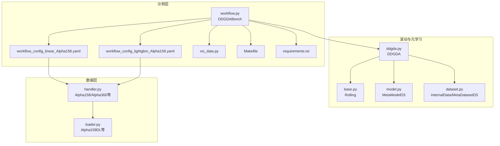
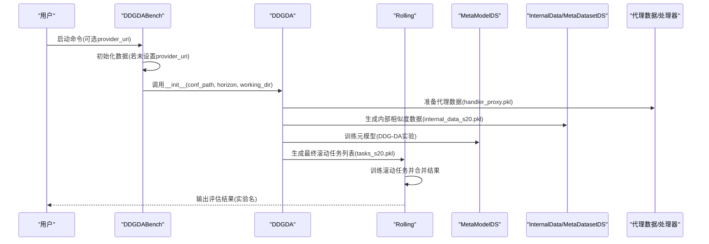
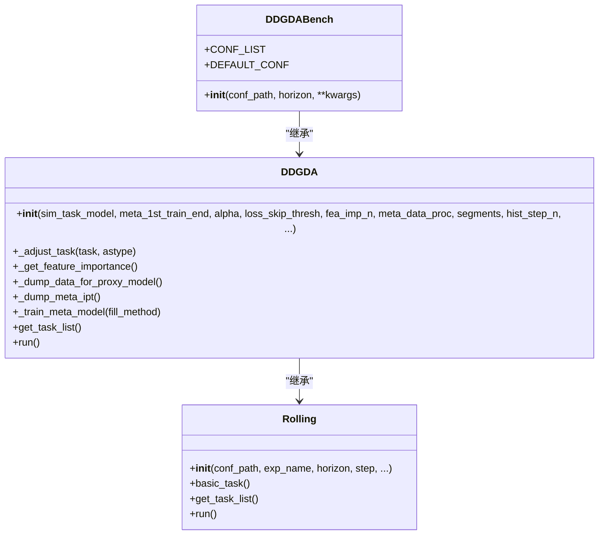
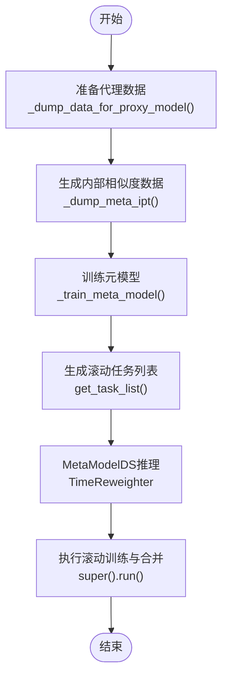
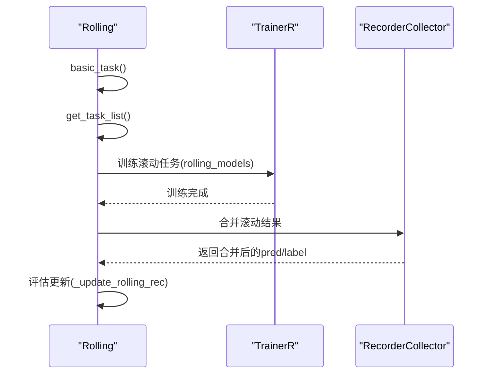
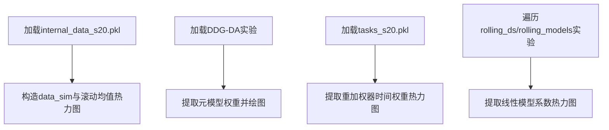
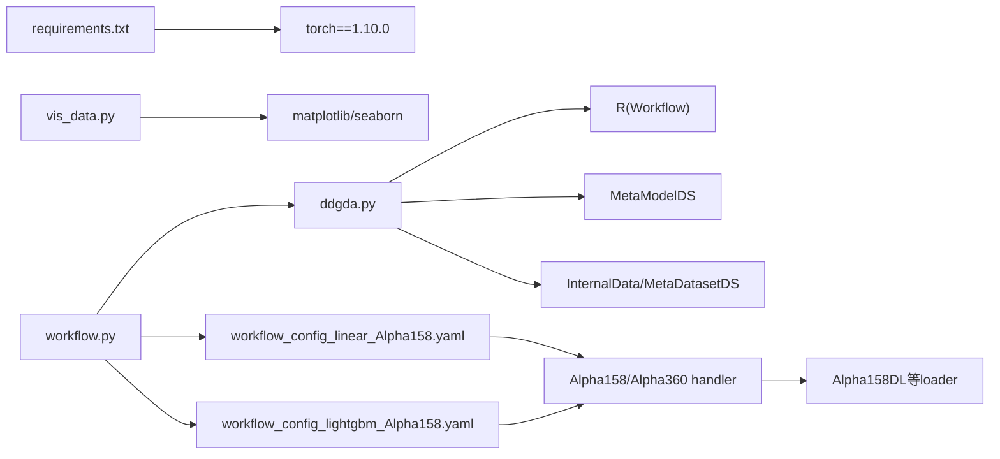

# DDG-DA动态基准测试

<cite>
**本文引用的文件**
- [workflow.py](file://examples/benchmarks_dynamic/DDG-DA/workflow.py)
- [ddgda.py](file://qlib/contrib/rolling/ddgda.py)
- [base.py](file://qlib/contrib/rolling/base.py)
- [model.py](file://qlib/contrib/meta/data_selection/model.py)
- [dataset.py](file://qlib/contrib/meta/data_selection/dataset.py)
- [vis_data.py](file://examples/benchmarks_dynamic/DDG-DA/vis_data.py)
- [Makefile](file://examples/benchmarks_dynamic/DDG-DA/Makefile)
- [requirements.txt](file://examples/benchmarks_dynamic/DDG-DA/requirements.txt)
- [workflow_config_linear_Alpha158.yaml](file://examples/benchmarks_dynamic/baseline/workflow_config_linear_Alpha158.yaml)
- [workflow_config_lightgbm_Alpha158.yaml](file://examples/benchmarks_dynamic/baseline/workflow_config_lightgbm_Alpha158.yaml)
- [handler.py](file://qlib/contrib/data/handler.py)
- [loader.py](file://qlib/contrib/data/loader.py)
</cite>

## 目录
1. [引言](#引言)
2. [项目结构](#项目结构)
3. [核心组件](#核心组件)
4. [架构总览](#架构总览)
5. [详细组件分析](#详细组件分析)
6. [依赖关系分析](#依赖关系分析)
7. [性能与可扩展性](#性能与可扩展性)
8. [故障排查指南](#故障排查指南)
9. [结论](#结论)
10. [附录：扩展指南](#附录扩展指南)

## 引言
本文件深入解析DDG-DA（Domain-Adaptive Dynamic Benchmarking）动态基准测试框架的实现机制，重点围绕以下目标：
- 解释workflow.py中DDGDABench类如何继承DDGDA并配置多模型滚动实验；
- 阐述DDGDA在金融时间序列中的领域自适应思想：通过代理预测模型与元学习，对滚动任务进行重加权，以提升跨时间段的泛化能力；
- 说明Makefile与requirements.txt在环境构建中的作用；
- 结合vis_data.py展示数据可视化分析方法；
- 提供从配置文件加载、模型对比、结果评估到扩展支持新模型与数据集的完整流程。

## 项目结构
DDG-DA示例位于examples/benchmarks_dynamic/DDG-DA目录，核心代码与依赖如下：
- 示例入口与配置：workflow.py、workflow_config_linear_Alpha158.yaml、workflow_config_lightgbm_Alpha158.yaml
- 核心算法实现：qlib/contrib/rolling/ddgda.py（继承Rolling）
- 滚动基类：qlib/contrib/rolling/base.py
- 元学习与数据选择：qlib/contrib/meta/data_selection/model.py、qlib/contrib/meta/data_selection/dataset.py
- 可视化脚本：vis_data.py
- 环境与清理：Makefile、requirements.txt
- 数据处理器与数据集：qlib/contrib/data/handler.py、qlib/contrib/data/loader.py

图表来源
- [workflow.py](file://examples/benchmarks_dynamic/DDG-DA/workflow.py#L1-L46)
- [ddgda.py](file://qlib/contrib/rolling/ddgda.py#L1-L388)
- [base.py](file://qlib/contrib/rolling/base.py#L1-L265)
- [model.py](file://qlib/contrib/meta/data_selection/model.py#L1-L197)
- [dataset.py](file://qlib/contrib/meta/data_selection/dataset.py#L1-L200)
- [workflow_config_linear_Alpha158.yaml](file://examples/benchmarks_dynamic/baseline/workflow_config_linear_Alpha158.yaml#L1-L78)
- [workflow_config_lightgbm_Alpha158.yaml](file://examples/benchmarks_dynamic/baseline/workflow_config_lightgbm_Alpha158.yaml#L1-L72)
- [handler.py](file://qlib/contrib/data/handler.py#L98-L157)
- [loader.py](file://qlib/contrib/data/loader.py#L27-L83)

章节来源
- [workflow.py](file://examples/benchmarks_dynamic/DDG-DA/workflow.py#L1-L46)
- [base.py](file://qlib/contrib/rolling/base.py#L1-L265)

## 核心组件
- DDGDABench：在workflow.py中定义，继承DDGDA，用于配置多模型滚动实验（线性回归与LightGBM），并兼容旧版本参数。
- DDGDA：在ddgda.py中实现，基于Rolling扩展，包含特征重要性计算、代理数据准备、内部相似度数据生成、元模型训练、滚动任务重加权推理等。
- Rolling：在base.py中实现通用滚动逻辑，负责读取配置、生成滚动任务、训练与合并结果。
- MetaModelDS：在model.py中实现元模型，使用IC损失进行训练，输出时间重加权器。
- InternalData/MetaDatasetDS：在dataset.py中实现内部相似度矩阵构建与元任务数据集封装。

章节来源
- [workflow.py](file://examples/benchmarks_dynamic/DDG-DA/workflow.py#L17-L36)
- [ddgda.py](file://qlib/contrib/rolling/ddgda.py#L69-L126)
- [base.py](file://qlib/contrib/rolling/base.py#L52-L118)
- [model.py](file://qlib/contrib/meta/data_selection/model.py#L40-L197)
- [dataset.py](file://qlib/contrib/meta/data_selection/dataset.py#L23-L120)

## 架构总览
DDG-DA通过“代理模型-元学习-滚动重加权”的闭环实现领域自适应动态基准测试。整体流程如下：

图表来源
- [workflow.py](file://examples/benchmarks_dynamic/DDG-DA/workflow.py#L38-L46)
- [ddgda.py](file://qlib/contrib/rolling/ddgda.py#L372-L388)
- [base.py](file://qlib/contrib/rolling/base.py#L253-L260)
- [model.py](file://qlib/contrib/meta/data_selection/model.py#L137-L197)
- [dataset.py](file://qlib/contrib/meta/data_selection/dataset.py#L23-L120)

## 详细组件分析

### DDGDABench类与多模型配置
- 继承关系：DDGDABench继承DDGDA，复用其滚动与元学习能力。
- 配置列表：通过CONF_LIST指定多个基准配置文件路径；默认使用线性模型配置以兼顾效率。
- 初始化兼容：支持传入conf_path与horizon参数，并兼容旧版行为；若传入的配置不在CONF_LIST中，记录警告。
- 运行入口：通过fire.Fire启动，自动初始化QLib，按需下载数据。

图表来源
- [workflow.py](file://examples/benchmarks_dynamic/DDG-DA/workflow.py#L17-L36)
- [ddgda.py](file://qlib/contrib/rolling/ddgda.py#L69-L126)
- [base.py](file://qlib/contrib/rolling/base.py#L52-L118)

章节来源
- [workflow.py](file://examples/benchmarks_dynamic/DDG-DA/workflow.py#L17-L36)

### DDGDA的领域自适应机制
- 代理数据准备：将基础任务调整为线性或GBDT模型，构造代理数据集，标准化后保存为handler格式，供后续元模型训练。
- 内部相似度数据：使用InternalData对代理模型进行滚动训练，提取每条训练区间在所有测试日期上的IC相关性，形成相似度矩阵。
- 元模型训练：MetaModelDS基于MetaDatasetDS构建元任务，使用IC损失训练，输出时间重加权器。
- 滚动任务重加权：在最终滚动阶段，MetaModelDS对任务进行inference，为每个样本生成时间权重，作为重加权器注入任务，从而实现跨时间段的领域自适应。

图表来源
- [ddgda.py](file://qlib/contrib/rolling/ddgda.py#L178-L388)
- [model.py](file://qlib/contrib/meta/data_selection/model.py#L183-L197)
- [dataset.py](file://qlib/contrib/meta/data_selection/dataset.py#L23-L120)

章节来源
- [ddgda.py](file://qlib/contrib/rolling/ddgda.py#L178-L388)
- [model.py](file://qlib/contrib/meta/data_selection/model.py#L137-L197)
- [dataset.py](file://qlib/contrib/meta/data_selection/dataset.py#L23-L120)

### 滚动基类Rolling的工作流
- 基础任务生成：basic_task读取配置，替换标签horizon、处理器缓存、起止时间等。
- 任务列表生成：get_task_list基于RollingGen按步长生成滚动任务，裁剪避免信息泄露。
- 训练与合并：_train_rolling_tasks训练滚动子任务；_ens_rolling合并预测与标签；_update_rolling_rec根据原始配置中的record生成评估报告。

图表来源
- [base.py](file://qlib/contrib/rolling/base.py#L145-L205)
- [base.py](file://qlib/contrib/rolling/base.py#L206-L260)

章节来源
- [base.py](file://qlib/contrib/rolling/base.py#L145-L205)
- [base.py](file://qlib/contrib/rolling/base.py#L206-L260)

### 数据可视化分析（vis_data.py）
- 加载内部相似度数据：读取internal_data_s20.pkl，构造时间维度的IC热力图与滚动均值热力图。
- 加载元模型权重：通过R.get_exp获取DDG-DA实验的元模型，绘制线性权重随时间变化及滚动均值。
- 任务时间权重：读取tasks_s20.pkl，提取重加权器的时间权重，生成热力图与滚动均值热力图。
- 子模型系数（线性模型限定）：遍历rolling_ds与rolling_models实验的记录，提取线性模型系数并热力图展示。

图表来源
- [vis_data.py](file://examples/benchmarks_dynamic/DDG-DA/vis_data.py#L1-L108)

章节来源
- [vis_data.py](file://examples/benchmarks_dynamic/DDG-DA/vis_data.py#L1-L108)

## 依赖关系分析
- 外部依赖
  - torch：requirements.txt声明torch==1.10.0，用于MetaModelDS的神经网络实现。
  - matplotlib/seaborn：vis_data.py用于可视化。
- 内部依赖
  - Qlib工作流：R.start/R.save_objects/R.get_exp/R.list_recorders等贯穿训练、日志与结果加载。
  - 数据处理器：Alpha158/Alpha360等handler与对应loader，支撑特征与标签配置。
  - 元学习组件：InternalData/MetaDatasetDS/MetaModelDS构成相似度计算与元学习闭环。

图表来源
- [requirements.txt](file://examples/benchmarks_dynamic/DDG-DA/requirements.txt#L1-L2)
- [vis_data.py](file://examples/benchmarks_dynamic/DDG-DA/vis_data.py#L1-L108)
- [ddgda.py](file://qlib/contrib/rolling/ddgda.py#L1-L120)
- [model.py](file://qlib/contrib/meta/data_selection/model.py#L1-L70)
- [dataset.py](file://qlib/contrib/meta/data_selection/dataset.py#L1-L60)
- [workflow_config_linear_Alpha158.yaml](file://examples/benchmarks_dynamic/baseline/workflow_config_linear_Alpha158.yaml#L1-L78)
- [workflow_config_lightgbm_Alpha158.yaml](file://examples/benchmarks_dynamic/baseline/workflow_config_lightgbm_Alpha158.yaml#L1-L72)
- [handler.py](file://qlib/contrib/data/handler.py#L98-L157)
- [loader.py](file://qlib/contrib/data/loader.py#L27-L83)

章节来源
- [requirements.txt](file://examples/benchmarks_dynamic/DDG-DA/requirements.txt#L1-L2)
- [handler.py](file://qlib/contrib/data/handler.py#L98-L157)
- [loader.py](file://qlib/contrib/data/loader.py#L27-L83)

## 性能与可扩展性
- 性能要点
  - 处理器缓存：通过replace_task_handler_with_cache减少重复数据预处理开销。
  - 特征重要性：仅在需要时计算，且可限制特征数量以降低维度。
  - 信息泄露规避：滚动时裁剪最后两日，避免未来信息泄漏。
  - 并行计算：InternalData在计算相似度时使用并行加速。
- 扩展建议
  - 新模型：在DDGDABench的CONF_LIST中添加新模型的workflow配置文件；在DDGDA._adjust_task中增加模型类型分支，确保处理器适配。
  - 新数据集：在workflow配置中切换handler为新的Alpha系列或自定义handler；确保数据加载器与特征列一致。
  - 元学习策略：可调整MetaModelDS的损失函数、clip方法、历史步数等超参以适配不同市场特性。

[本节为通用指导，不直接分析具体文件]

## 故障排查指南
- 清理历史实验
  - 使用Makefile的clean目标删除pkl与mlruns，避免实验名冲突。
- 数据源缺失
  - 若未设置PROVIDER_URI，workflow.py会自动下载数据；请确认网络与磁盘空间。
- 实验名冲突
  - Rolling基类提示需先删除mlruns，否则无法创建同名实验。
- 评估失败
  - 确认配置中的record项是否正确；Rolling._update_rolling_rec会根据原始配置生成评估报告。

章节来源
- [Makefile](file://examples/benchmarks_dynamic/DDG-DA/Makefile#L1-L5)
- [workflow.py](file://examples/benchmarks_dynamic/DDG-DA/workflow.py#L38-L46)
- [base.py](file://qlib/contrib/rolling/base.py#L41-L50)
- [base.py](file://qlib/contrib/rolling/base.py#L206-L260)

## 结论
DDG-DA通过“代理模型-元学习-滚动重加权”实现了金融时间序列的领域自适应动态基准测试。DDGDABench以最小改动集成多模型滚动，DDGDA在内部相似度与时间重加权上提供了稳健的跨时间段泛化能力。配合可视化脚本与清晰的配置体系，该框架易于扩展至新模型与新数据集。

[本节为总结，不直接分析具体文件]

## 附录：扩展指南

### 如何扩展支持新模型
- 在DDGDABench中新增配置文件路径至CONF_LIST，并在__init__中兼容新配置。
- 在DDGDA._adjust_task中为新模型类型补充处理器与参数。
- 在workflow.py中为新模型提供独立的workflow配置文件，确保数据集与记录器配置一致。

章节来源
- [workflow.py](file://examples/benchmarks_dynamic/DDG-DA/workflow.py#L17-L36)
- [ddgda.py](file://qlib/contrib/rolling/ddgda.py#L127-L156)

### 如何扩展支持新数据集
- 在workflow配置中更换handler为新数据集（如Alpha360等），并确保特征列与标签列一致。
- 若使用自定义数据加载器，请在loader中提供相应配置，并在handler中正确装配。

章节来源
- [workflow_config_linear_Alpha158.yaml](file://examples/benchmarks_dynamic/baseline/workflow_config_linear_Alpha158.yaml#L45-L63)
- [workflow_config_lightgbm_Alpha158.yaml](file://examples/benchmarks_dynamic/baseline/workflow_config_lightgbm_Alpha158.yaml#L31-L57)
- [handler.py](file://qlib/contrib/data/handler.py#L98-L157)
- [loader.py](file://qlib/contrib/data/loader.py#L27-L83)

### 环境构建与清理
- 安装依赖：requirements.txt声明torch==1.10.0，确保与元学习实现兼容。
- 清理：使用Makefile clean目标删除中间产物与mlruns，避免实验冲突。

章节来源
- [requirements.txt](file://examples/benchmarks_dynamic/DDG-DA/requirements.txt#L1-L2)
- [Makefile](file://examples/benchmarks_dynamic/DDG-DA/Makefile#L1-L5)