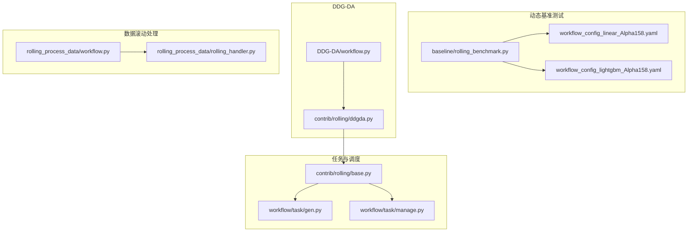

# 动态工作流与滚动更新示例

<cite>
**本文引用的文件列表**
- [examples/benchmarks_dynamic/DDG-DA/README.md](file://examples/benchmarks_dynamic/DDG-DA/README.md)
- [examples/benchmarks_dynamic/DDG-DA/workflow.py](file://examples/benchmarks_dynamic/DDG-DA/workflow.py)
- [examples/benchmarks_dynamic/baseline/README.md](file://examples/benchmarks_dynamic/baseline/README.md)
- [examples/benchmarks_dynamic/baseline/rolling_benchmark.py](file://examples/benchmarks_dynamic/baseline/rolling_benchmark.py)
- [examples/benchmarks_dynamic/baseline/workflow_config_lightgbm_Alpha158.yaml](file://examples/benchmarks_dynamic/baseline/workflow_config_lightgbm_Alpha158.yaml)
- [examples/benchmarks_dynamic/baseline/workflow_config_linear_Alpha158.yaml](file://examples/benchmarks_dynamic/baseline/workflow_config_linear_Alpha158.yaml)
- [examples/model_rolling/task_manager_rolling.py](file://examples/model_rolling/task_manager_rolling.py)
- [examples/rolling_process_data/workflow.py](file://examples/rolling_process_data/workflow.py)
- [examples/rolling_process_data/rolling_handler.py](file://examples/rolling_process_data/rolling_handler.py)
- [qlib/contrib/rolling/base.py](file://qlib/contrib/rolling/base.py)
- [qlib/contrib/rolling/ddgda.py](file://qlib/contrib/rolling/ddgda.py)
- [qlib/workflow/task/gen.py](file://qlib/workflow/task/gen.py)
- [qlib/workflow/task/manage.py](file://qlib/workflow/task/manage.py)
</cite>

## 目录
1. [引言](#引言)
2. [项目结构](#项目结构)
3. [核心组件](#核心组件)
4. [架构总览](#架构总览)
5. [详细组件分析](#详细组件分析)
6. [依赖关系分析](#依赖关系分析)
7. [性能考量](#性能考量)
8. [故障排查指南](#故障排查指南)
9. [结论](#结论)
10. [附录](#附录)

## 引言
本文件系统性阐述 Qlib 中“动态工作流与模型滚动更新”的实现与最佳实践，重点覆盖：
- DDG-DA 与 baseline 目录下的动态基准测试实现
- rolling_benchmark.py 与 task_manager_rolling.py 如何实现模型的定期重训练与预测更新
- rolling_process_data/workflow.py 展示的数据滚动处理流程
- DDG-DA 中领域自适应技术的应用场景与配置方式
- 自动化调度、版本管理、结果对比分析的最佳实践
- 避免数据泄露与过拟合风险的方法

## 项目结构
围绕动态工作流与滚动更新，涉及以下关键路径：
- 基线滚动更新：examples/benchmarks_dynamic/baseline
- DDG-DA 滚动更新：examples/benchmarks_dynamic/DDG-DA
- 数据滚动处理：examples/rolling_process_data
- 工作流任务生成与调度：qlib/workflow/task/*
- 滚动更新基类与 DDG-DA 实现：qlib/contrib/rolling/*

图表来源
- [examples/benchmarks_dynamic/baseline/rolling_benchmark.py](file://examples/benchmarks_dynamic/baseline/rolling_benchmark.py#L1-L42)
- [examples/benchmarks_dynamic/DDG-DA/workflow.py](file://examples/benchmarks_dynamic/DDG-DA/workflow.py#L1-L46)
- [qlib/contrib/rolling/ddgda.py](file://qlib/contrib/rolling/ddgda.py#L1-L388)
- [qlib/contrib/rolling/base.py](file://qlib/contrib/rolling/base.py#L1-L265)
- [examples/rolling_process_data/workflow.py](file://examples/rolling_process_data/workflow.py#L1-L135)
- [examples/rolling_process_data/rolling_handler.py](file://examples/rolling_process_data/rolling_handler.py#L1-L33)
- [qlib/workflow/task/gen.py](file://qlib/workflow/task/gen.py#L1-L352)
- [qlib/workflow/task/manage.py](file://qlib/workflow/task/manage.py#L1-L557)

章节来源
- [examples/benchmarks_dynamic/baseline/README.md](file://examples/benchmarks_dynamic/baseline/README.md#L1-L17)
- [examples/benchmarks_dynamic/DDG-DA/README.md](file://examples/benchmarks_dynamic/DDG-DA/README.md#L1-L36)

## 核心组件
- 基线滚动更新（baseline）
  - 通过 RollingBenchmark 包装 Rolling，支持周期性重训练与滚动评估
  - 支持多模型配置切换（如 Linear、LightGBM），通过 YAML 配置驱动
- DDG-DA
  - 基于元学习的预测分布生成与适配方法，先训练代理模型，再用元模型对最终任务进行推理与重加权
  - 通过内部数据与代理处理器，构建可复用的元数据集，提升滚动任务的泛化能力
- 数据滚动处理
  - 通过 RollingDataHandler 与 DatasetH 的 segments 配置，实现时间序列滚动切分与数据加载
- 任务生成与调度
  - RollingGen 将单任务扩展为滚动任务序列；TaskManager 提供分布式任务池与并发执行

章节来源
- [examples/benchmarks_dynamic/baseline/rolling_benchmark.py](file://examples/benchmarks_dynamic/baseline/rolling_benchmark.py#L1-L42)
- [qlib/contrib/rolling/base.py](file://qlib/contrib/rolling/base.py#L1-L265)
- [qlib/contrib/rolling/ddgda.py](file://qlib/contrib/rolling/ddgda.py#L1-L388)
- [examples/rolling_process_data/workflow.py](file://examples/rolling_process_data/workflow.py#L1-L135)
- [examples/rolling_process_data/rolling_handler.py](file://examples/rolling_process_data/rolling_handler.py#L1-L33)
- [qlib/workflow/task/gen.py](file://qlib/workflow/task/gen.py#L1-L352)
- [qlib/workflow/task/manage.py](file://qlib/workflow/task/manage.py#L1-L557)

## 架构总览
下图展示了从配置到滚动训练、再到结果汇总的整体流程。

图表来源
- [examples/benchmarks_dynamic/baseline/rolling_benchmark.py](file://examples/benchmarks_dynamic/baseline/rolling_benchmark.py#L1-L42)
- [examples/benchmarks_dynamic/DDG-DA/workflow.py](file://examples/benchmarks_dynamic/DDG-DA/workflow.py#L1-L46)
- [qlib/contrib/rolling/base.py](file://qlib/contrib/rolling/base.py#L1-L265)
- [qlib/workflow/task/gen.py](file://qlib/workflow/task/gen.py#L1-L352)
- [qlib/workflow/task/manage.py](file://qlib/workflow/task/manage.py#L1-L557)

## 详细组件分析

### 基线滚动更新（baseline）
- 入口与配置
  - 通过命令行参数选择 conf_path，支持 Linear 与 LightGBM 两种模型配置
  - 默认使用 Linear，效率更高；可通过参数切换为 LightGBM
- 滚动训练与评估
  - 使用 Rolling 基类生成滚动任务序列，训练后聚合滚动预测与标签，再按原始配置生成评估记录
- 数据处理
  - 通过 YAML 中的 handler 与 segments 定义训练/验证/测试区间，确保滚动时时间窗口平移

图表来源
- [examples/benchmarks_dynamic/baseline/rolling_benchmark.py](file://examples/benchmarks_dynamic/baseline/rolling_benchmark.py#L1-L42)
- [qlib/contrib/rolling/base.py](file://qlib/contrib/rolling/base.py#L1-L265)
- [qlib/workflow/task/gen.py](file://qlib/workflow/task/gen.py#L1-L352)

章节来源
- [examples/benchmarks_dynamic/baseline/README.md](file://examples/benchmarks_dynamic/baseline/README.md#L1-L17)
- [examples/benchmarks_dynamic/baseline/rolling_benchmark.py](file://examples/benchmarks_dynamic/baseline/rolling_benchmark.py#L1-L42)
- [examples/benchmarks_dynamic/baseline/workflow_config_linear_Alpha158.yaml](file://examples/benchmarks_dynamic/baseline/workflow_config_linear_Alpha158.yaml#L1-L78)
- [examples/benchmarks_dynamic/baseline/workflow_config_lightgbm_Alpha158.yaml](file://examples/benchmarks_dynamic/baseline/workflow_config_lightgbm_Alpha158.yaml#L1-L72)

### DDG-DA（领域自适应与预测分布生成）
- 方法概述
  - 先训练代理模型（用于估计未来数据分布），再利用元模型对最终任务进行推理与重加权，从而提升滚动任务的稳定性与泛化能力
- 关键步骤
  - 生成代理模型所需数据（特征标准化、标签对齐等），并持久化为处理器格式
  - 构建内部数据（InternalData）与元数据集（MetaDatasetDS），训练元模型（MetaModelDS）
  - 基于元模型对最终任务模板进行推理，得到新的任务列表并执行滚动训练
- 参数要点
  - sim_task_model：相似度计算所用模型类型（linear/gbdt）
  - meta_1st_train_end：元模型首次训练结束时间
  - alpha：元模型正则化系数
  - loss_skip_thresh：按日损失跳过的阈值
  - fea_imp_n：特征重要性筛选数量
  - segments：元任务数据划分策略（比例或固定日期）
  - hist_step_n：历史步长

图表来源
- [examples/benchmarks_dynamic/DDG-DA/workflow.py](file://examples/benchmarks_dynamic/DDG-DA/workflow.py#L1-L46)
- [qlib/contrib/rolling/ddgda.py](file://qlib/contrib/rolling/ddgda.py#L1-L388)
- [qlib/contrib/rolling/base.py](file://qlib/contrib/rolling/base.py#L1-L265)

章节来源
- [examples/benchmarks_dynamic/DDG-DA/README.md](file://examples/benchmarks_dynamic/DDG-DA/README.md#L1-L36)
- [examples/benchmarks_dynamic/DDG-DA/workflow.py](file://examples/benchmarks_dynamic/DDG-DA/workflow.py#L1-L46)
- [qlib/contrib/rolling/ddgda.py](file://qlib/contrib/rolling/ddgda.py#L1-L388)

### 数据滚动处理（rolling_process_data）
- 处理器与数据加载
  - 使用 RollingDataHandler 包装 DataHandlerLP，按滚动窗口动态调整 fit/start/end 时间
  - 通过 DatasetH 的 segments 定义 train/valid/test，随滚动偏移
- 流程控制
  - 初始化 Qlib 与数据源
  - 预处理阶段将 handler 序列化为 pickle，后续复用以加速
  - 循环滚动偏移，更新 handler 与 segments，准备训练/验证/测试数据

图表来源
- [examples/rolling_process_data/workflow.py](file://examples/rolling_process_data/workflow.py#L1-L135)
- [examples/rolling_process_data/rolling_handler.py](file://examples/rolling_process_data/rolling_handler.py#L1-L33)

章节来源
- [examples/rolling_process_data/workflow.py](file://examples/rolling_process_data/workflow.py#L1-L135)
- [examples/rolling_process_data/rolling_handler.py](file://examples/rolling_process_data/rolling_handler.py#L1-L33)

### 任务生成与调度（RollingGen 与 TaskManager）
- 任务生成
  - RollingGen 支持 expanding 与 sliding 两种滚动模式，按 step 平移 segments
  - 可在生成过程中截断避免未来信息泄漏（trunc_days）
- 分布式调度
  - TaskManager 将任务定义写入 MongoDB，提供并发安全的任务抓取、状态管理与结果提交
  - 支持优先级、重试、等待队列等能力，适合大规模滚动任务的自动化执行

图表来源
- [qlib/workflow/task/gen.py](file://qlib/workflow/task/gen.py#L1-L352)
- [qlib/workflow/task/manage.py](file://qlib/workflow/task/manage.py#L1-L557)

章节来源
- [qlib/workflow/task/gen.py](file://qlib/workflow/task/gen.py#L1-L352)
- [qlib/workflow/task/manage.py](file://qlib/workflow/task/manage.py#L1-L557)

### 模型滚动与预测更新（task_manager_rolling.py）
- 示例职责
  - 展示基于 TaskManager 的滚动任务训练与收集流程
  - 通过 RollingGen 生成不同日期段的任务，使用 TrainerRM 并发训练
  - 使用 RecorderCollector 对结果进行分组与聚合，便于对比分析
- 关键点
  - reset：清理实验与任务池，避免历史残留影响
  - task_generating：基于任务配置与滚动生成器生成任务
  - task_training：训练任务（本地或分布式）
  - task_collecting：按模型与滚动键过滤与聚合结果

章节来源
- [examples/model_rolling/task_manager_rolling.py](file://examples/model_rolling/task_manager_rolling.py#L1-L117)

## 依赖关系分析
- 组件耦合
  - RollingBenchmark/DDGDABench 依赖 Rolling 基类与配置文件
  - Rolling 基类依赖任务生成（RollingGen）、训练器（TrainerR/TrainerRM）、收集器（RecorderCollector）
  - DDG-DA 在 Rolling 基础上引入元模型与内部数据，增强滚动任务的泛化
- 外部依赖
  - MongoDB：TaskManager 的任务池存储
  - YAML 配置：模型、数据集、记录器的声明式配置
  - Qlib 内部模块：数据处理器、数据集、记录器、训练器

图表来源
- [examples/benchmarks_dynamic/baseline/rolling_benchmark.py](file://examples/benchmarks_dynamic/baseline/rolling_benchmark.py#L1-L42)
- [examples/benchmarks_dynamic/DDG-DA/workflow.py](file://examples/benchmarks_dynamic/DDG-DA/workflow.py#L1-L46)
- [qlib/contrib/rolling/base.py](file://qlib/contrib/rolling/base.py#L1-L265)
- [qlib/contrib/rolling/ddgda.py](file://qlib/contrib/rolling/ddgda.py#L1-L388)
- [qlib/workflow/task/gen.py](file://qlib/workflow/task/gen.py#L1-L352)
- [qlib/workflow/task/manage.py](file://qlib/workflow/task/manage.py#L1-L557)

章节来源
- [qlib/contrib/rolling/base.py](file://qlib/contrib/rolling/base.py#L1-L265)
- [qlib/contrib/rolling/ddgda.py](file://qlib/contrib/rolling/ddgda.py#L1-L388)
- [qlib/workflow/task/gen.py](file://qlib/workflow/task/gen.py#L1-L352)
- [qlib/workflow/task/manage.py](file://qlib/workflow/task/manage.py#L1-L557)

## 性能考量
- 数据缓存与处理器复用
  - 通过 replace_task_handler_with_cache 或预处理 handler 序列化，减少重复数据加载与预处理开销
- 滚动步长与截断
  - 合理设置 step 与 trunc_days，避免信息泄漏的同时兼顾样本量
- 并行与分布式
  - 使用 TaskManager 与 TrainerRM 并发训练，充分利用多核与多机资源
- 元模型与代理模型
  - DDG-DA 中代理模型仅用于相似度计算，可选择轻量模型（如 Linear）以降低开销

[本节为通用建议，不直接分析具体文件]

## 故障排查指南
- 清理实验与任务池
  - Rolling 基类在运行前会尝试删除滚动实验，若失败需手动清理 MLflow 实验
  - TaskManager 提供 reset_waiting/reset_status 等接口恢复异常任务
- 截断与泄漏
  - RollingGen 在生成任务时会根据 test_start 截断训练/验证区间，避免未来信息泄漏
  - 若出现过拟合迹象，检查 trunc_days 是否足够大
- MongoDB 连接与编码
  - TaskManager 使用二进制序列化存储任务定义与结果，确保 MongoDB 可用且网络稳定
- 结果对比
  - 使用 RecorderCollector 按模型与滚动键过滤与聚合，便于横向对比

章节来源
- [qlib/contrib/rolling/base.py](file://qlib/contrib/rolling/base.py#L1-L265)
- [qlib/workflow/task/manage.py](file://qlib/workflow/task/manage.py#L1-L557)
- [qlib/workflow/task/gen.py](file://qlib/workflow/task/gen.py#L1-L352)

## 结论
- 基线滚动更新通过配置驱动与滚动任务生成，实现了模型的周期性重训练与评估
- DDG-DA 在滚动框架之上引入元学习与预测分布生成，显著提升了滚动任务的稳定性与泛化能力
- 数据滚动处理与任务调度模块共同支撑了大规模、可扩展的动态工作流
- 通过合理的截断策略、分布式调度与结果聚合，可有效避免数据泄露与过拟合，提升结果可比性

[本节为总结性内容，不直接分析具体文件]

## 附录
- 最佳实践清单
  - 自动化调度：使用 TaskManager + TrainerRM 实现分布式滚动训练
  - 版本管理：以实验名区分不同滚动策略与配置，避免覆盖
  - 结果对比：使用 RecorderCollector 按模型/滚动键聚合，输出统一报告
  - 风险控制：严格设置 trunc_days，定期清理实验与任务池，确保可重复性

[本节为通用建议，不直接分析具体文件]