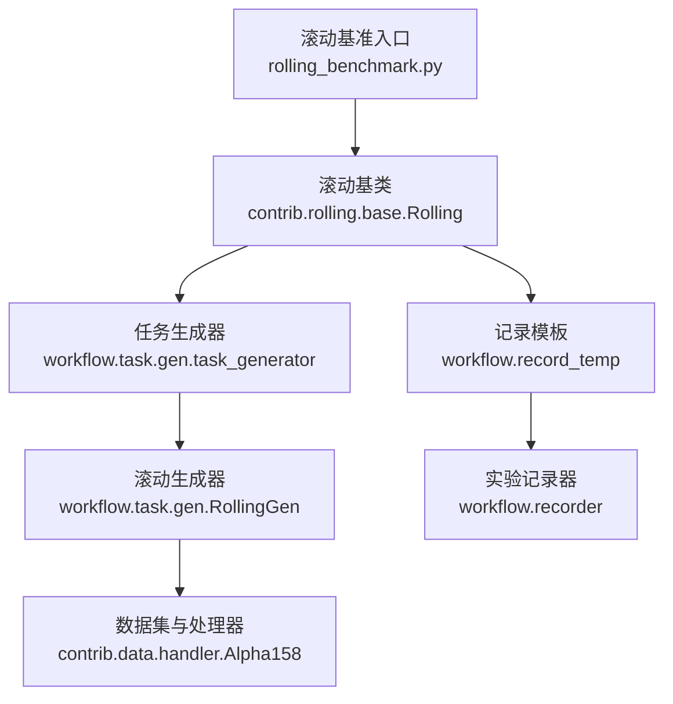
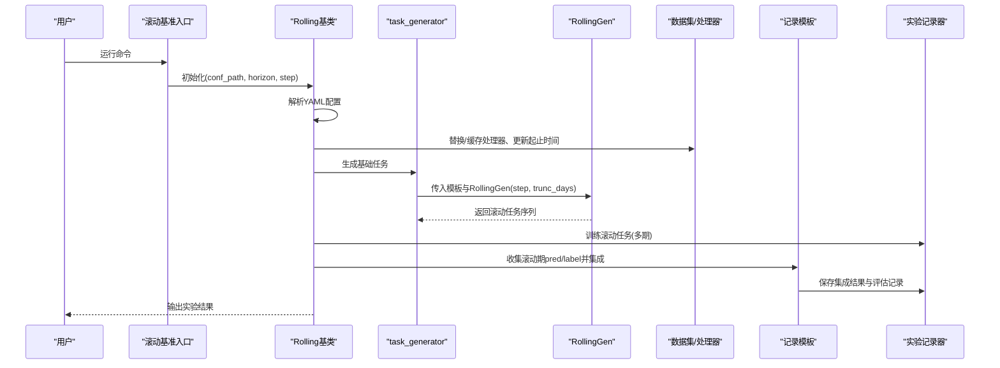
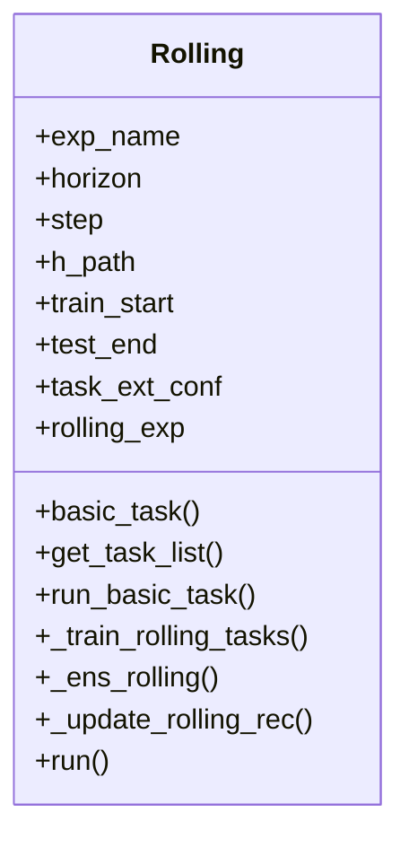
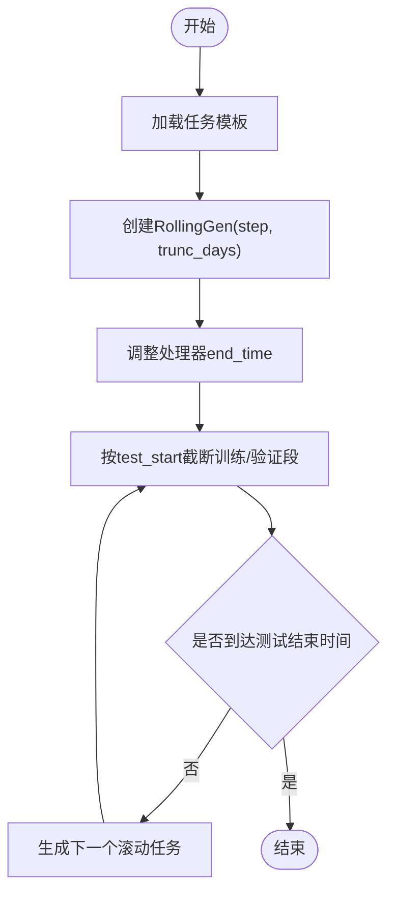
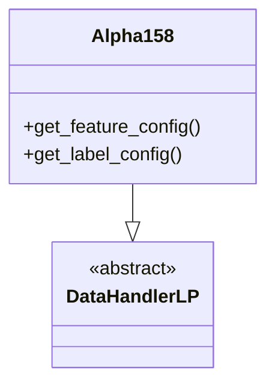
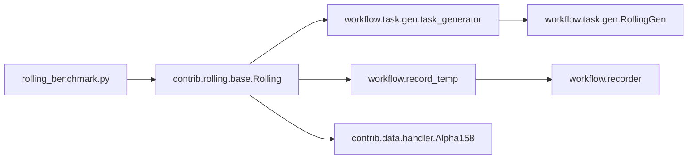

# 基础滚动基准测试

<cite>
**本文引用的文件列表**
- [examples/benchmarks_dynamic/baseline/rolling_benchmark.py](file://examples/benchmarks_dynamic/baseline/rolling_benchmark.py)
- [examples/benchmarks_dynamic/baseline/workflow_config_linear_Alpha158.yaml](file://examples/benchmarks_dynamic/baseline/workflow_config_linear_Alpha158.yaml)
- [examples/benchmarks_dynamic/baseline/workflow_config_lightgbm_Alpha158.yaml](file://examples/benchmarks_dynamic/baseline/workflow_config_lightgbm_Alpha158.yaml)
- [examples/benchmarks_dynamic/README.md](file://examples/benchmarks_dynamic/README.md)
- [qlib/contrib/rolling/base.py](file://qlib/contrib/rolling/base.py)
- [qlib/workflow/task/gen.py](file://qlib/workflow/task/gen.py)
- [qlib/contrib/data/handler.py](file://qlib/contrib/data/handler.py)
- [qlib/workflow/record_temp.py](file://qlib/workflow/record_temp.py)
- [qlib/workflow/recorder.py](file://qlib/workflow/recorder.py)
</cite>

## 目录
1. [简介](#简介)
2. [项目结构](#项目结构)
3. [核心组件](#核心组件)
4. [架构总览](#架构总览)
5. [详细组件分析](#详细组件分析)
6. [依赖关系分析](#依赖关系分析)
7. [性能考量](#性能考量)
8. [故障排查指南](#故障排查指南)
9. [结论](#结论)
10. [附录：自定义滚动策略实践指南](#附录自定义滚动策略实践指南)

## 简介
本文件系统性阐述QLib中“基础滚动基准测试”的实现方式，聚焦于滚动训练与评估的核心流程，对比线性模型与LightGBM在Alpha158数据集上的配置差异，解释滚动窗口（rolling window）参数设置对模型性能的影响，并提供通过YAML配置文件定制化滚动策略的实践指南，以及如何监控模型性能衰减与重新训练触发条件的方法。

## 项目结构
- 滚动基准入口与配置：
  - 入口脚本：examples/benchmarks_dynamic/baseline/rolling_benchmark.py
  - 配置文件：workflow_config_linear_Alpha158.yaml、workflow_config_lightgbm_Alpha158.yaml
- 核心滚动实现：
  - 滚动基类：qlib/contrib/rolling/base.py
  - 任务生成与滚动生成器：qlib/workflow/task/gen.py
- 数据与标签：
  - Alpha158处理器：qlib/contrib/data/handler.py
- 结果记录与回测：
  - 记录模板：qlib/workflow/record_temp.py
  - 实验记录器：qlib/workflow/recorder.py
- 基准说明文档：
  - examples/benchmarks_dynamic/README.md

图表来源
- [examples/benchmarks_dynamic/baseline/rolling_benchmark.py](file://examples/benchmarks_dynamic/baseline/rolling_benchmark.py#L1-L42)
- [qlib/contrib/rolling/base.py](file://qlib/contrib/rolling/base.py#L1-L265)
- [qlib/workflow/task/gen.py](file://qlib/workflow/task/gen.py#L1-L200)
- [qlib/contrib/data/handler.py](file://qlib/contrib/data/handler.py#L98-L157)
- [qlib/workflow/record_temp.py](file://qlib/workflow/record_temp.py#L1-L200)
- [qlib/workflow/recorder.py](file://qlib/workflow/recorder.py#L1-L200)

章节来源
- [examples/benchmarks_dynamic/baseline/rolling_benchmark.py](file://examples/benchmarks_dynamic/baseline/rolling_benchmark.py#L1-L42)
- [examples/benchmarks_dynamic/baseline/workflow_config_linear_Alpha158.yaml](file://examples/benchmarks_dynamic/baseline/workflow_config_linear_Alpha158.yaml#L1-L78)
- [examples/benchmarks_dynamic/baseline/workflow_config_lightgbm_Alpha158.yaml](file://examples/benchmarks_dynamic/baseline/workflow_config_lightgbm_Alpha158.yaml#L1-L72)
- [examples/benchmarks_dynamic/README.md](file://examples/benchmarks_dynamic/README.md#L1-L27)

## 核心组件
- 滚动基类Rolling：负责加载YAML配置、构造基础任务、生成滚动任务序列、训练滚动任务、合并滚动结果并执行最终评估记录。
- 任务生成与滚动生成器：基于模板任务与RollingGen按步长生成滚动任务，避免未来信息泄露。
- 数据处理器Alpha158：为滚动提供统一特征与标签配置，标签为20日相对回报。
- 记录模板RecordTemp：封装信号记录、IC分析、组合分析等评估流程。
- 实验记录器Recorder：统一记录参数、指标与产物到mlflow。

章节来源
- [qlib/contrib/rolling/base.py](file://qlib/contrib/rolling/base.py#L52-L265)
- [qlib/workflow/task/gen.py](file://qlib/workflow/task/gen.py#L1-L200)
- [qlib/contrib/data/handler.py](file://qlib/contrib/data/handler.py#L98-L157)
- [qlib/workflow/record_temp.py](file://qlib/workflow/record_temp.py#L162-L200)
- [qlib/workflow/recorder.py](file://qlib/workflow/recorder.py#L1-L200)

## 架构总览
滚动基准测试以“入口脚本”为起点，调用“滚动基类”完成以下流程：
1) 初始化与数据准备：自动初始化环境，必要时拉取数据；解析YAML配置。
2) 构造基础任务：替换或覆盖标签horizon、缓存处理器、裁剪时间范围。
3) 生成滚动任务：使用RollingGen按步长生成多个滚动任务，避免未来信息泄露。
4) 训练滚动任务：批量训练各滚动任务，输出中间记录。
5) 合并滚动结果：收集各滚动期预测与标签，进行集成汇总。
6) 最终评估：根据配置执行信号记录、IC分析、组合分析等。

图表来源
- [examples/benchmarks_dynamic/baseline/rolling_benchmark.py](file://examples/benchmarks_dynamic/baseline/rolling_benchmark.py#L1-L42)
- [qlib/contrib/rolling/base.py](file://qlib/contrib/rolling/base.py#L145-L265)
- [qlib/workflow/task/gen.py](file://qlib/workflow/task/gen.py#L141-L200)
- [qlib/workflow/record_temp.py](file://qlib/workflow/record_temp.py#L162-L200)
- [qlib/workflow/recorder.py](file://qlib/workflow/recorder.py#L1-L200)

## 详细组件分析

### 组件A：滚动基类Rolling
- 关键职责
  - 加载YAML配置，支持覆盖horizon、step、训练/测试时间范围、处理器缓存路径等。
  - 构造基础任务：动态修改标签horizon（仅适用于预定义Alpha158/Alpha360），替换/缓存处理器，更新segments。
  - 生成滚动任务：调用task_generator与RollingGen，按步长生成滚动任务序列，并裁剪避免信息泄露。
  - 训练与评估：批量训练滚动任务，收集pred/label并集成，最后执行记录模板生成评估报告。
- 参数要点
  - horizon：预测目标的持有期（标签horizon），用于覆盖数据处理器的标签表达式。
  - step：滚动步长（天数），控制滚动窗口滑动频率。
  - trunc_days：滚动时对非测试段进行截断，避免未来信息泄露。
  - rolling_exp：滚动实验名，用于隔离中间结果。
- 性能与稳定性
  - 处理器缓存可显著加速重复数据加载。
  - 严格的时间裁剪与未来信息截断是滚动评估有效性的关键。

图表来源
- [qlib/contrib/rolling/base.py](file://qlib/contrib/rolling/base.py#L52-L265)

章节来源
- [qlib/contrib/rolling/base.py](file://qlib/contrib/rolling/base.py#L52-L265)

### 组件B：任务生成与滚动生成器
- 作用
  - 将单个任务模板扩展为滚动任务序列，支持“扩展型”和“滑动型”两种滚动模式。
  - 在生成过程中自动调整处理器end_time，确保能加载到测试末尾的数据。
  - 对segments进行截断，避免未来信息泄露。
- 关键参数
  - step：滚动步长（天数）
  - rtype：滚动类型（扩展/滑动）
  - trunc_days：截断天数
  - test_key/train_key：测试/训练段键名
- 与Rolling的关系
  - Rolling在构造任务后，调用task_generator与RollingGen生成滚动任务列表。

图表来源
- [qlib/workflow/task/gen.py](file://qlib/workflow/task/gen.py#L93-L171)

章节来源
- [qlib/workflow/task/gen.py](file://qlib/workflow/task/gen.py#L1-L200)

### 组件C：Alpha158数据处理器与标签
- Alpha158标签
  - 默认标签为20日相对回报，对应“Ref($close, -2)/Ref($close, -1) - 1”，与滚动基准文档一致。
- 特征与处理
  - 提供价格、成交量、VWAP等特征，配合归一化、缺失填充等学习/推理处理器。
- 与滚动的关系
  - 滚动基类会根据horizon动态覆盖标签表达式，确保标签与滚动窗口一致。

图表来源
- [qlib/contrib/data/handler.py](file://qlib/contrib/data/handler.py#L98-L157)

章节来源
- [qlib/contrib/data/handler.py](file://qlib/contrib/data/handler.py#L98-L157)
- [examples/benchmarks_dynamic/README.md](file://examples/benchmarks_dynamic/README.md#L23-L27)

### 组件D：记录模板与评估
- SignalRecord：保存滚动期的预测结果，作为后续分析的基础。
- 其他记录：根据配置执行信号分析、组合分析等，形成最终评估报告。
- 与实验记录器的交互：将参数、指标与产物统一保存至mlflow。

章节来源
- [qlib/workflow/record_temp.py](file://qlib/workflow/record_temp.py#L162-L200)
- [qlib/workflow/recorder.py](file://qlib/workflow/recorder.py#L1-L200)

## 依赖关系分析
- 滚动基准入口依赖滚动基类与数据准备工具。
- 滚动基类依赖任务生成器与滚动生成器，以构建滚动任务序列。
- 滚动基类与记录模板共同依赖实验记录器以持久化结果。
- 数据处理器由Alpha158提供，标签与horizon密切相关。

图表来源
- [examples/benchmarks_dynamic/baseline/rolling_benchmark.py](file://examples/benchmarks_dynamic/baseline/rolling_benchmark.py#L1-L42)
- [qlib/contrib/rolling/base.py](file://qlib/contrib/rolling/base.py#L145-L265)
- [qlib/workflow/task/gen.py](file://qlib/workflow/task/gen.py#L1-L200)
- [qlib/contrib/data/handler.py](file://qlib/contrib/data/handler.py#L98-L157)
- [qlib/workflow/record_temp.py](file://qlib/workflow/record_temp.py#L162-L200)
- [qlib/workflow/recorder.py](file://qlib/workflow/recorder.py#L1-L200)

章节来源
- [qlib/contrib/rolling/base.py](file://qlib/contrib/rolling/base.py#L145-L265)
- [qlib/workflow/task/gen.py](file://qlib/workflow/task/gen.py#L1-L200)
- [qlib/contrib/data/handler.py](file://qlib/contrib/data/handler.py#L98-L157)
- [qlib/workflow/record_temp.py](file://qlib/workflow/record_temp.py#L162-L200)
- [qlib/workflow/recorder.py](file://qlib/workflow/recorder.py#L1-L200)

## 性能考量
- 滚动步长（step）与标签horizon（horizon）的匹配
  - 文档明确：标签horizon=20，滚动步长=20天。两者一致可避免标签与滚动窗口错配导致的偏差。
- 信息泄露防护
  - trunc_days应等于horizon+1，确保滚动时不会使用未来信息参与训练/验证。
- 处理器缓存
  - 使用处理器缓存可显著减少重复数据加载开销，提升整体吞吐。
- 评估粒度
  - 滚动期的信号记录与IC分析有助于识别性能衰减趋势，便于触发再训练。

章节来源
- [examples/benchmarks_dynamic/README.md](file://examples/benchmarks_dynamic/README.md#L23-L27)
- [qlib/contrib/rolling/base.py](file://qlib/contrib/rolling/base.py#L194-L204)
- [qlib/workflow/task/gen.py](file://qlib/workflow/task/gen.py#L127-L140)

## 故障排查指南
- 常见问题
  - 未清理历史实验导致mlflow无法创建同名实验：运行前删除mlruns目录。
  - 数据源未就绪：入口脚本会在环境变量为空时自动拉取数据。
  - 标签horizon不匹配：需确保配置中的horizon与数据处理器标签一致。
  - 未来信息泄露：检查trunc_days是否正确设置。
- 定位方法
  - 查看实验记录器日志，确认参数、指标与产物是否成功保存。
  - 检查SignalRecord生成的pred.pkl是否存在，作为后续分析的输入。
  - 若出现rank-deficient矩阵（如Yahoo版本缺少VWAP），可改用crowd-sourced数据。

章节来源
- [qlib/contrib/rolling/base.py](file://qlib/contrib/rolling/base.py#L41-L51)
- [examples/benchmarks_dynamic/baseline/rolling_benchmark.py](file://examples/benchmarks_dynamic/baseline/rolling_benchmark.py#L34-L42)
- [examples/benchmarks_dynamic/README.md](file://examples/benchmarks_dynamic/README.md#L9-L14)
- [qlib/workflow/recorder.py](file://qlib/workflow/recorder.py#L1-L200)

## 结论
基础滚动基准测试通过“入口脚本+滚动基类+任务生成器+记录模板”的协同，实现了对Alpha158数据集上线性模型与LightGBM的滚动训练与评估。其关键在于：
- horizon与step的一致性与信息泄露防护；
- 处理器缓存与时间裁剪的工程优化；
- 通过SignalRecord与IC/组合分析实现的性能监控与再训练触发。

## 附录：自定义滚动策略实践指南

### 1) 修改YAML配置定制滚动策略
- 标签horizon与滚动步长
  - 在基础配置中设置horizon与step，确保二者一致。
  - 可通过task_ext_conf覆盖部分字段，或直接修改YAML中的segments与model/dataset配置。
- 数据集与处理器
  - 选择Alpha158处理器，确保标签表达式与horizon匹配。
  - 如需扩展/滑动滚动，调整RollingGen的rtype与step。
- 记录模板
  - 根据需要增删SignalRecord、SigAnaRecord、PortAnaRecord等，以满足不同评估需求。

章节来源
- [examples/benchmarks_dynamic/baseline/workflow_config_linear_Alpha158.yaml](file://examples/benchmarks_dynamic/baseline/workflow_config_linear_Alpha158.yaml#L45-L78)
- [examples/benchmarks_dynamic/baseline/workflow_config_lightgbm_Alpha158.yaml](file://examples/benchmarks_dynamic/baseline/workflow_config_lightgbm_Alpha158.yaml#L32-L72)
- [qlib/contrib/rolling/base.py](file://qlib/contrib/rolling/base.py#L145-L182)
- [qlib/workflow/task/gen.py](file://qlib/workflow/task/gen.py#L141-L171)

### 2) 监控模型性能衰减与触发再训练
- 指标采集
  - 使用SignalRecord保存滚动期预测，结合SigAnaRecord计算IC、Rank IC等指标。
  - 通过PortAnaRecord生成组合分析，观察收益与回撤变化。
- 触发条件建议
  - 当滚动期IC连续下降超过阈值，或最大回撤超过阈值时，触发再训练。
  - 可结合滚动期指标的移动平均与标准差，设定动态阈值。
- 实施步骤
  - 在记录模板生成后，读取指标序列并进行阈值判断。
  - 若满足再训练条件，重新运行滚动基准入口脚本，或触发自动化流水线。

章节来源
- [qlib/workflow/record_temp.py](file://qlib/workflow/record_temp.py#L162-L200)
- [qlib/workflow/recorder.py](file://qlib/workflow/recorder.py#L1-L200)