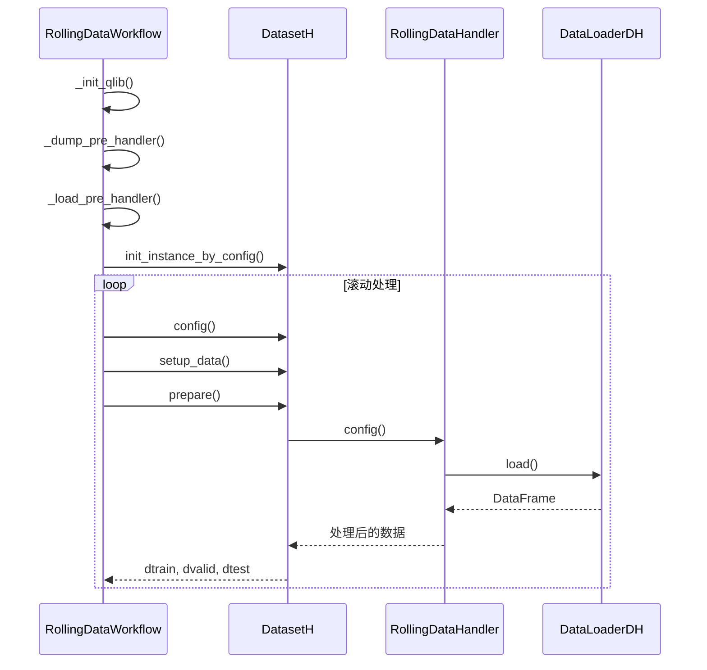
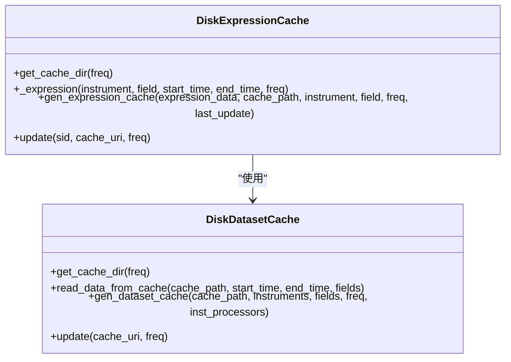

# 数据滚动处理流程

<cite>
**本文档引用的文件**   
- [workflow.py](file://examples/rolling_process_data/workflow.py)
- [rolling_handler.py](file://examples/rolling_process_data/rolling_handler.py)
- [handler.py](file://qlib/data/dataset/handler.py)
- [cache.py](file://qlib/data/cache.py)
- [loader.py](file://qlib/data/dataset/loader.py)
</cite>

## 目录
1. [引言](#引言)
2. [核心组件](#核心组件)
3. [数据滚动处理机制](#数据滚动处理机制)
4. [滚动窗口数据切片](#滚动窗口数据切片)
5. [特征更新与缓存管理](#特征更新与缓存管理)
6. [数据一致性与未来信息泄露防护](#数据一致性与未来信息泄露防护)
7. [配置与性能优化](#配置与性能优化)
8. [结论](#结论)

## 引言
数据滚动处理是量化投资研究中的关键流程，它通过在不同时间窗口上重复执行数据处理、模型训练和评估来验证策略的稳健性。本文档详细说明QLib框架中滚动数据处理流程的实现机制，重点解析workflow.py与rolling_handler.py之间的协作关系，阐述滚动窗口数据切片、特征更新、缓存管理的技术细节，并提供配置和性能优化建议。

## 核心组件

数据滚动处理流程主要由两个核心组件构成：`RollingDataWorkflow`类和`RollingDataHandler`类。`RollingDataWorkflow`类定义了滚动处理的整体流程，包括初始化QLib、预处理处理器和执行滚动过程。`RollingDataHandler`类继承自`DataHandlerLP`，专门用于处理滚动数据，通过配置不同的处理器和数据加载器来实现数据的动态更新。

**Section sources**
- [workflow.py](file://examples/rolling_process_data/workflow.py#L15-L135)
- [rolling_handler.py](file://examples/rolling_process_data/rolling_handler.py#L6-L32)

## 数据滚动处理机制

数据滚动处理机制通过在时间轴上滑动窗口来模拟真实的投资环境。`RollingDataWorkflow`类中的`rolling_process`方法实现了这一机制，它首先初始化QLib环境，然后创建并配置数据集，最后通过循环执行滚动处理。每次滚动都会更新数据集的时间范围和处理器的拟合时间范围，确保模型在不同时间段上进行训练和测试。

**Diagram sources**
- [workflow.py](file://examples/rolling_process_data/workflow.py#L48-L135)
- [rolling_handler.py](file://examples/rolling_process_data/rolling_handler.py#L6-L32)
- [loader.py](file://qlib/data/dataset/loader.py#L350-L415)

## 滚动窗口数据切片

滚动窗口数据切片是通过更新数据集的时间范围来实现的。在`rolling_process`方法中，通过`dataset.config()`方法更新`handler_kwargs`和`segments`参数，动态调整数据处理的时间窗口。`start_time`和`end_time`参数定义了数据处理的总体时间范围，而`fit_start_time`和`fit_end_time`参数则定义了处理器拟合的时间范围。这种设计允许在不同时间段上进行数据处理，同时保持处理器的拟合范围与训练数据一致。

**Section sources**
- [workflow.py](file://examples/rolling_process_data/workflow.py#L97-L120)

## 特征更新与缓存管理

特征更新与缓存管理是通过`DiskExpressionCache`和`DiskDatasetCache`类实现的。`DiskExpressionCache`负责缓存单个表达式的计算结果，而`DiskDatasetCache`则负责缓存整个数据集。当数据需要更新时，`update`方法会检查缓存的有效性，如果缓存已过期，则重新计算并更新缓存。这种机制大大提高了数据处理的效率，避免了重复计算。

**Diagram sources**
- [cache.py](file://qlib/data/cache.py#L490-L689)

## 数据一致性与未来信息泄露防护

数据一致性与未来信息泄露防护是通过严格的时间范围控制和处理器配置来实现的。`RollingDataHandler`类中的`check_transform_proc`函数确保处理器在正确的拟合时间范围内进行拟合，避免了未来信息的泄露。此外，`DataHandlerLP`类中的`process_data`方法通过`with_fit`参数控制是否在处理数据时进行拟合，确保了数据处理的一致性。

**Section sources**
- [rolling_handler.py](file://examples/rolling_process_data/rolling_handler.py#L17-L18)
- [handler.py](file://qlib/data/dataset/handler.py#L530-L614)

## 配置与性能优化

配置与性能优化建议包括合理设置滚动频率、窗口大小和数据预处理逻辑。在大规模数据滚动更新场景下，可以通过启用缓存、优化数据加载器和处理器配置来提高性能。例如，使用`enable_cache=True`参数可以将处理后的数据保存到磁盘，避免重复计算。此外，合理配置`infer_processors`和`learn_processors`可以减少不必要的数据处理步骤，提高处理效率。

**Section sources**
- [workflow.py](file://examples/rolling_process_data/workflow.py#L60-L90)
- [handler.py](file://qlib/data/dataset/handler.py#L443-L445)

## 结论
数据滚动处理流程是量化投资研究中的重要组成部分，通过`RollingDataWorkflow`和`RollingDataHandler`的协作，实现了高效、一致的数据处理。通过合理配置和优化，可以在大规模数据场景下实现高性能的滚动处理，为投资策略的验证提供可靠支持。