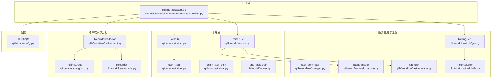
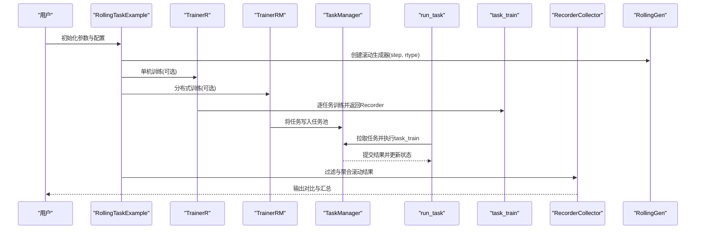
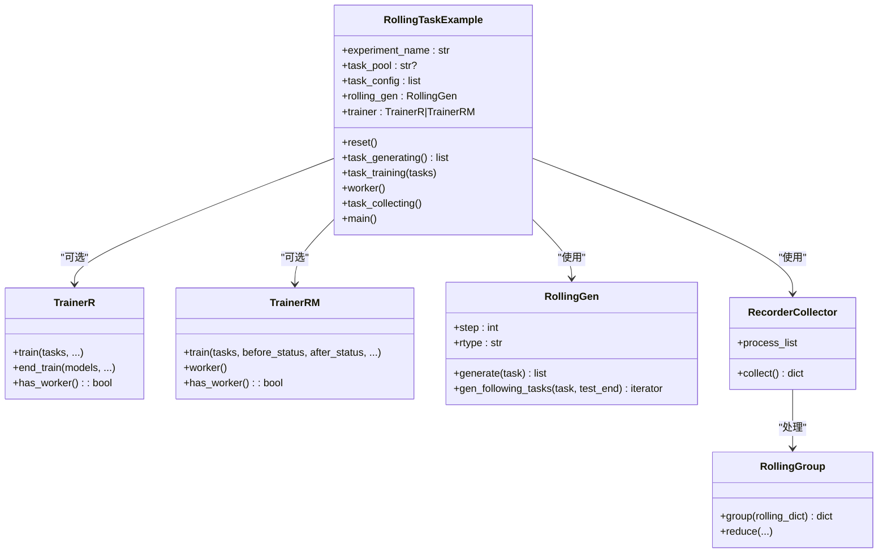
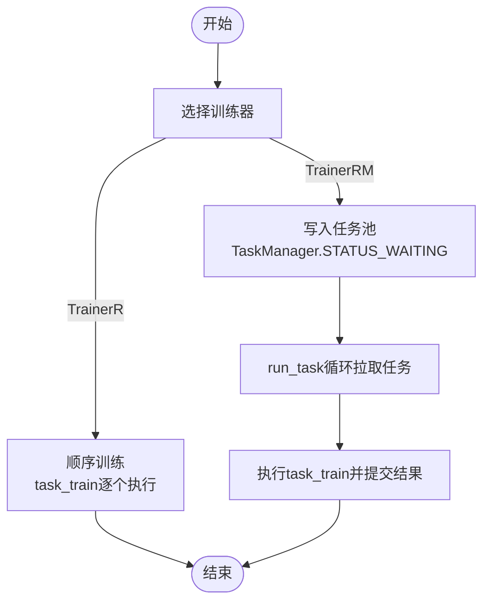
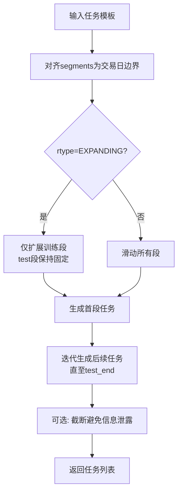
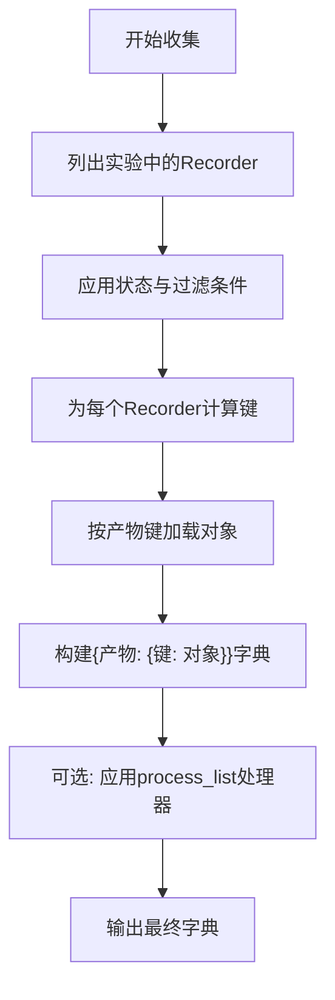
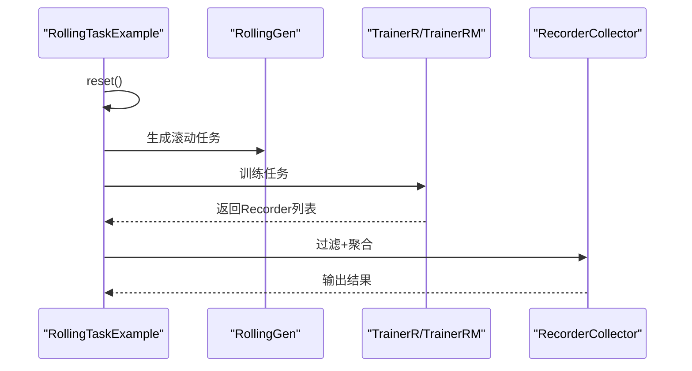
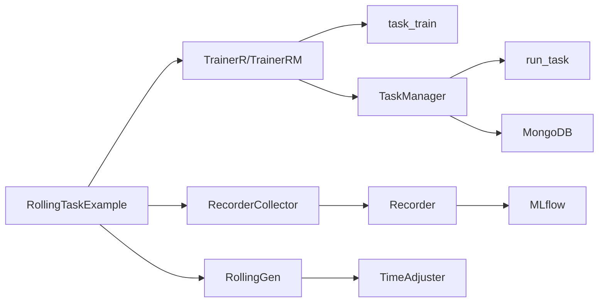

# 模型滚动管理机制

<cite>
**本文引用的文件列表**
- [task_manager_rolling.py](file://examples/model_rolling/task_manager_rolling.py)
- [trainer.py](file://qlib/model/trainer.py)
- [gen.py](file://qlib/workflow/task/gen.py)
- [collect.py](file://qlib/workflow/task/collect.py)
- [group.py](file://qlib/model/ens/group.py)
- [manage.py](file://qlib/workflow/task/manage.py)
- [utils.py](file://qlib/workflow/task/utils.py)
- [recorder.py](file://qlib/workflow/recorder.py)
- [config.py](file://qlib/tests/config.py)
</cite>

## 目录
1. [引言](#引言)
2. [项目结构](#项目结构)
3. [核心组件](#核心组件)
4. [架构总览](#架构总览)
5. [详细组件分析](#详细组件分析)
6. [依赖关系分析](#依赖关系分析)
7. [性能考量](#性能考量)
8. [故障排查指南](#故障排查指南)
9. [结论](#结论)
10. [附录](#附录)

## 引言
本文件面向使用 Qlib 的用户，系统性解析基于 TaskManager 的模型滚动管理架构，重点围绕 examples/model_rolling 中的 RollingTaskExample 类，完整梳理从任务初始化、滚动任务生成、训练调度到结果收集的全流程。同时对 TrainerR 与 TrainerRM 在单机与分布式场景下的差异进行说明；解释 RollingGen 如何生成时间序列滚动任务；阐述 RecorderCollector 的过滤与聚合机制；并给出多模型滚动实验的版本控制、结果对比与性能监控的最佳实践建议。

## 项目结构
该示例位于 examples/model_rolling，围绕 task_manager_rolling.py 展开，其依赖于 workflow/task 下的任务生成、收集与管理模块，以及 model/trainer 中的训练器实现，还有 model/ens/group 提供的滚动分组与集成能力。

图表来源
- [task_manager_rolling.py](file://examples/model_rolling/task_manager_rolling.py#L1-L117)
- [gen.py](file://qlib/workflow/task/gen.py#L1-L352)
- [manage.py](file://qlib/workflow/task/manage.py#L1-L557)
- [trainer.py](file://qlib/model/trainer.py#L73-L127)
- [collect.py](file://qlib/workflow/task/collect.py#L1-L259)
- [group.py](file://qlib/model/ens/group.py#L1-L116)
- [utils.py](file://qlib/workflow/task/utils.py#L1-L309)
- [recorder.py](file://qlib/workflow/recorder.py#L1-L494)
- [config.py](file://qlib/tests/config.py#L1-L168)

章节来源
- [task_manager_rolling.py](file://examples/model_rolling/task_manager_rolling.py#L1-L117)

## 核心组件
- RollingTaskExample：示例入口，负责初始化、任务生成、训练与结果收集的编排。
- RollingGen：滚动任务生成器，基于时间滑动或扩展策略生成多个任务模板。
- TrainerR / TrainerRM：单机与分布式训练器，分别在线性顺序与多进程/多机环境下执行任务。
- TaskManager / run_task：任务池管理与拉取执行，支持状态流转与错误恢复。
- RecorderCollector：从实验记录器中按规则过滤与聚合结果。
- RollingGroup：对滚动键进行分组与滚动集成。
- TimeAdjuster：时间对齐与滚动步进工具。
- Recorder：实验记录器抽象，承载模型训练产物与元数据。

章节来源
- [task_manager_rolling.py](file://examples/model_rolling/task_manager_rolling.py#L24-L116)
- [trainer.py](file://qlib/model/trainer.py#L210-L555)
- [gen.py](file://qlib/workflow/task/gen.py#L141-L303)
- [manage.py](file://qlib/workflow/task/manage.py#L33-L557)
- [collect.py](file://qlib/workflow/task/collect.py#L136-L259)
- [group.py](file://qlib/model/ens/group.py#L92-L116)
- [utils.py](file://qlib/workflow/task/utils.py#L82-L309)
- [recorder.py](file://qlib/workflow/recorder.py#L28-L494)

## 架构总览
下图展示从示例入口到任务执行与结果收集的整体流程，包括单机与分布式两种训练路径。

图表来源
- [task_manager_rolling.py](file://examples/model_rolling/task_manager_rolling.py#L24-L116)
- [trainer.py](file://qlib/model/trainer.py#L210-L555)
- [manage.py](file://qlib/workflow/task/manage.py#L483-L557)
- [collect.py](file://qlib/workflow/task/collect.py#L136-L259)

## 详细组件分析

### RollingTaskExample 类
- 初始化阶段
  - 通过 qlib.init 完成数据提供方与 MongoDB 任务存储初始化。
  - 根据是否传入 task_pool 决定使用 TrainerR 或 TrainerRM。
  - 使用 RollingGen(step, rtype) 配置滚动策略。
- 任务生成
  - 调用 task_generator 与 RollingGen.generate 组合生成滚动任务列表。
- 训练调度
  - TrainerR：顺序训练，返回 Recorder 列表。
  - TrainerRM：将任务写入 TaskManager，由 run_task 拉取执行，支持多进程/多机。
- 结果收集
  - 使用 RecorderCollector 按模型与滚动键过滤与聚合，结合 RollingGroup 实现滚动分组与集成。

图表来源
- [task_manager_rolling.py](file://examples/model_rolling/task_manager_rolling.py#L24-L116)
- [trainer.py](file://qlib/model/trainer.py#L210-L555)
- [gen.py](file://qlib/workflow/task/gen.py#L141-L303)
- [collect.py](file://qlib/workflow/task/collect.py#L136-L259)
- [group.py](file://qlib/model/ens/group.py#L92-L116)

章节来源
- [task_manager_rolling.py](file://examples/model_rolling/task_manager_rolling.py#L24-L116)

### TrainerR 与 TrainerRM 差异（单机 vs 分布式）
- TrainerR
  - 单机顺序训练，逐个调用 task_train 返回 Recorder。
  - 支持在子进程中调用以强制内存释放。
- TrainerRM
  - 基于 TaskManager 的分布式训练框架：
    - train(tasks)：将任务写入任务池，设置 before_status/after_status，返回 Recorder 列表。
    - worker()：启动后台 worker，通过 run_task 拉取任务并执行 task_train。
  - 支持延迟训练（DelayTrainerRM）：prepare 与 end_train 分离，适合跨机器/资源环境。

图表来源
- [trainer.py](file://qlib/model/trainer.py#L210-L555)
- [manage.py](file://qlib/workflow/task/manage.py#L339-L557)

章节来源
- [trainer.py](file://qlib/model/trainer.py#L210-L555)
- [manage.py](file://qlib/workflow/task/manage.py#L339-L557)

### RollingGen：滚动任务生成
- 关键点
  - step：滚动步长（交易日）。
  - rtype：滚动类型（滑动 SHIFT_SD 或扩展 SHIFT_EX）。
  - test_key/train_key：用于区分测试/训练段的时间键。
  - trunc_days：避免未来信息泄漏，对非测试集进行截断。
  - handler_mod：根据 handler 结束时间与测试段结束时间自动调整 handler 的 end_time。
- 算法流程
  - 对初始 segments 进行对齐与首段生成。
  - 根据 rtype 与 step 迭代生成后续任务，直到 test_end。
  - 可选地对 segments 进行截断，确保无未来信息泄露。

图表来源
- [gen.py](file://qlib/workflow/task/gen.py#L141-L303)
- [utils.py](file://qlib/workflow/task/utils.py#L82-L309)

章节来源
- [gen.py](file://qlib/workflow/task/gen.py#L141-L303)
- [utils.py](file://qlib/workflow/task/utils.py#L82-L309)

### RecorderCollector：过滤与聚合机制
- 过滤
  - status：仅收集特定状态的 Recorder。
  - rec_filter_func：自定义过滤函数，如仅保留某模型的结果。
  - list_kwargs：传递给 list_recorders 的查询参数。
- 聚合
  - artifacts_key：指定要提取的产物键集合。
  - artifacts_path：产物名到文件路径映射。
  - process_list：对收集结果进行进一步处理（如 RollingGroup）。
- 错误处理
  - only_exist：加载失败时忽略异常或抛出异常。
  - 重复键覆盖警告：当同一键出现多次时发出告警。

图表来源
- [collect.py](file://qlib/workflow/task/collect.py#L136-L259)
- [group.py](file://qlib/model/ens/group.py#L92-L116)

章节来源
- [collect.py](file://qlib/workflow/task/collect.py#L136-L259)
- [group.py](file://qlib/model/ens/group.py#L92-L116)

### 示例主流程（RollingTaskExample.main）
- reset：清理实验与任务池残留。
- task_generating：生成滚动任务列表。
- task_training：TrainerR 顺序训练或 TrainerRM 分布式训练。
- task_collecting：按模型与滚动键过滤与聚合，输出结果。

图表来源
- [task_manager_rolling.py](file://examples/model_rolling/task_manager_rolling.py#L63-L111)

章节来源
- [task_manager_rolling.py](file://examples/model_rolling/task_manager_rolling.py#L63-L111)

## 依赖关系分析
- 组件耦合
  - RollingTaskExample 依赖 TrainerR/TrainerRM、RollingGen、RecorderCollector。
  - TrainerRM 依赖 TaskManager/run_task 完成分布式执行。
  - RecorderCollector 依赖 Recorder 抽象与实验管理接口。
- 外部依赖
  - MongoDB：TaskManager 任务池持久化。
  - MLflow：Recorder 默认后端，用于记录指标、参数与产物。
  - 时间工具 TimeAdjuster：保证滚动时间对齐与步进。

图表来源
- [task_manager_rolling.py](file://examples/model_rolling/task_manager_rolling.py#L24-L116)
- [trainer.py](file://qlib/model/trainer.py#L210-L555)
- [manage.py](file://qlib/workflow/task/manage.py#L33-L557)
- [collect.py](file://qlib/workflow/task/collect.py#L136-L259)
- [recorder.py](file://qlib/workflow/recorder.py#L28-L494)
- [utils.py](file://qlib/workflow/task/utils.py#L82-L309)

章节来源
- [task_manager_rolling.py](file://examples/model_rolling/task_manager_rolling.py#L24-L116)
- [trainer.py](file://qlib/model/trainer.py#L210-L555)
- [manage.py](file://qlib/workflow/task/manage.py#L33-L557)
- [collect.py](file://qlib/workflow/task/collect.py#L136-L259)
- [recorder.py](file://qlib/workflow/recorder.py#L28-L494)
- [utils.py](file://qlib/workflow/task/utils.py#L82-L309)

## 性能考量
- 并行与资源利用
  - TrainerRM 通过 TaskManager 与 run_task 支持多进程/多机并行，适合大规模滚动实验。
  - TrainerR 可在子进程中调用 task_train 以减少内存压力。
- 数据加载优化
  - 使用 handler_mod 自动延长 handler 的 end_time，避免因数据不足导致的重复加载。
  - trunc_days 截断避免未来信息泄漏，同时减少无效数据读取。
- 任务池管理
  - TaskManager 提供等待、重置、优先级等能力，便于在分布式场景下稳定运行。
- 结果收集
  - RecorderCollector 支持按键过滤与聚合，避免不必要的对象加载。

[本节为通用指导，不直接分析具体文件]

## 故障排查指南
- MongoDB 未配置
  - 现象：TaskManager 初始化报错。
  - 排查：确认 qlib.init 时传入 mongo 配置，或在 C["mongo"] 中设置 task_url 与 task_db_name。
- 任务无法拉取/卡住
  - 现象：run_task 循环等待但无任务。
  - 排查：检查 TaskManager.wait 与任务状态统计；必要时 reset_waiting。
- Recorder 加载失败
  - 现象：RecorderCollector 报告加载异常。
  - 排查：设置 only_exist 控制是否忽略；检查 artifacts_path 与产物是否存在。
- 滚动键冲突
  - 现象：RecorderCollector 警告键重复覆盖。
  - 排查：检查 rec_key_func 是否唯一；确保滚动键在元组末尾位置。

章节来源
- [manage.py](file://qlib/workflow/task/manage.py#L339-L557)
- [collect.py](file://qlib/workflow/task/collect.py#L136-L259)
- [utils.py](file://qlib/workflow/task/utils.py#L22-L58)

## 结论
本文围绕 RollingTaskExample 全流程解析了基于 TaskManager 的滚动实验管理机制，阐明了 TrainerR 与 TrainerRM 在单机与分布式场景下的职责差异，详解了 RollingGen 的滚动生成策略与 TimeAdjuster 的时间对齐逻辑，并总结了 RecorderCollector 的过滤与聚合方法。结合这些组件，用户可以高效构建多模型、多滚动窗口的对比实验，并通过版本控制与结果聚合实现持续监控与迭代。

[本节为总结性内容，不直接分析具体文件]

## 附录

### 最佳实践清单
- 版本控制
  - 使用实验名称与 Recorder 标签区分不同版本；在 Recorder 中记录命令行参数与环境变量。
- 结果对比
  - 使用 RecorderCollector 的 rec_key_func 与 process_list（如 RollingGroup）进行模型与滚动键的分组对比。
- 性能监控
  - 在 Recorder 中记录关键指标与参数；结合 TaskManager 的状态统计与日志进行监控。
- 分布式部署
  - 使用 TrainerRM 与 TaskManager 管理任务池；合理设置 before_status/after_status 与 worker 启动策略。

章节来源
- [trainer.py](file://qlib/model/trainer.py#L210-L555)
- [collect.py](file://qlib/workflow/task/collect.py#L136-L259)
- [recorder.py](file://qlib/workflow/recorder.py#L28-L494)
- [manage.py](file://qlib/workflow/task/manage.py#L339-L557)