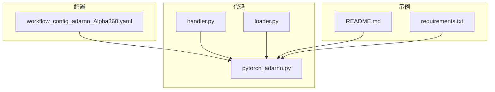
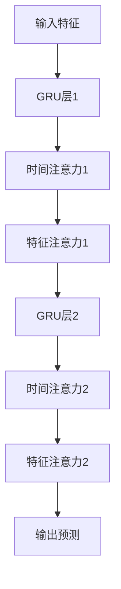
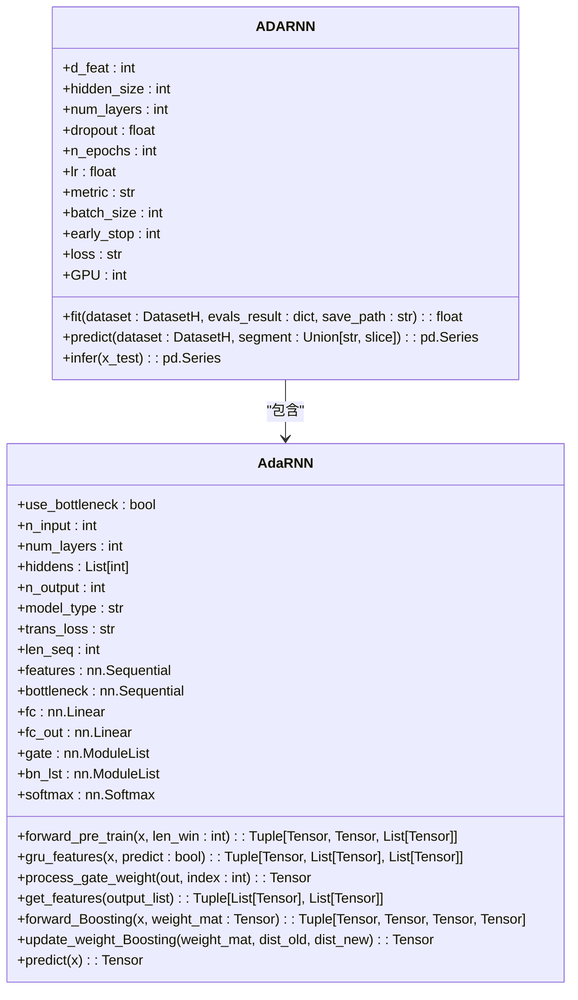
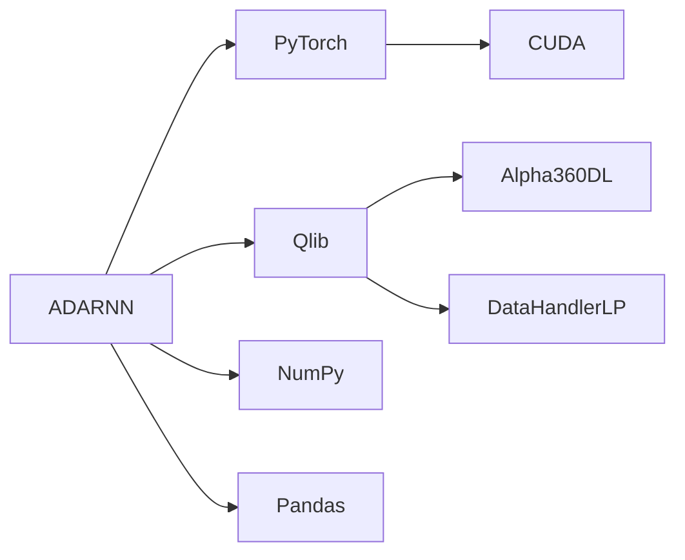

# ADARNN 基准模型

<cite>
**本文档引用的文件**  
- [pytorch_adarnn.py](file://qlib/contrib/model/pytorch_adarnn.py)
- [workflow_config_adarnn_Alpha360.yaml](file://examples/benchmarks/ADARNN/workflow_config_adarnn_Alpha360.yaml)
- [handler.py](file://qlib/contrib/data/handler.py)
- [loader.py](file://qlib/contrib/data/loader.py)
</cite>

## 目录
1. [简介](#简介)
2. [项目结构](#项目结构)
3. [核心组件](#核心组件)
4. [架构概述](#架构概述)
5. [详细组件分析](#详细组件分析)
6. [依赖分析](#依赖分析)
7. [性能考量](#性能考量)
8. [故障排除指南](#故障排除指南)
9. [结论](#结论)

## 简介
ADARNN（Adaptive Dual-Attention Recurrent Neural Network）是一种专为时间序列预测设计的深度学习模型，特别适用于金融市场的波动率预测。该模型通过引入双注意力机制，在时空特征提取方面表现出显著优势。本文件详细说明了ADARNN在Qlib中的实现，解析其YAML配置文件，并结合源码解释双注意力模块的计算流程。此外，还提供了运行该模型的完整步骤，并分析其在波动率突变期间的预测稳定性。

## 项目结构
ADARNN模型位于Qlib项目的`examples/benchmarks/ADARNN/`目录下，包含配置文件、依赖文件和README文档。核心实现位于`qlib/contrib/model/pytorch_adarnn.py`中，而数据处理逻辑则分布在`qlib/contrib/data/`相关模块中。

**图示来源**  
- [workflow_config_adarnn_Alpha360.yaml](file://examples/benchmarks/ADARNN/workflow_config_adarnn_Alpha360.yaml)
- [pytorch_adarnn.py](file://qlib/contrib/model/pytorch_adarnn.py)
- [handler.py](file://qlib/contrib/data/handler.py)
- [loader.py](file://qlib/contrib/data/loader.py)

**节来源**  
- [workflow_config_adarnn_Alpha360.yaml](file://examples/benchmarks/ADARNN/workflow_config_adarnn_Alpha360.yaml)
- [pytorch_adarnn.py](file://qlib/contrib/model/pytorch_adarnn.py)

## 核心组件
ADARNN的核心组件包括双注意力机制、GRU网络结构以及自适应学习策略。这些组件协同工作，使得模型能够有效捕捉时间序列中的时空特征。

**节来源**  
- [pytorch_adarnn.py](file://qlib/contrib/model/pytorch_adarnn.py#L38-L600)

## 架构概述
ADARNN采用双注意力机制来增强GRU网络的时间序列建模能力。该架构由多个GRU层组成，每层都配备时间注意力和特征注意力机制，以动态调整不同时间步和特征的重要性。

**图示来源**  
- [pytorch_adarnn.py](file://qlib/contrib/model/pytorch_adarnn.py#L372-L552)

**节来源**  
- [pytorch_adarnn.py](file://qlib/contrib/model/pytorch_adarnn.py#L372-L552)

## 详细组件分析
### ADARNN模型分析
ADARNN模型通过双注意力机制实现了对时间序列数据的高效建模。时间注意力机制关注于不同时间步的重要性，而特征注意力机制则关注于不同特征的重要性。

#### 对象导向组件

**图示来源**  
- [pytorch_adarnn.py](file://qlib/contrib/model/pytorch_adarnn.py#L23-L371)

**节来源**  
- [pytorch_adarnn.py](file://qlib/contrib/model/pytorch_adarnn.py#L23-L371)

### 双注意力机制协同工作方式
ADARNN的YAML配置文件定义了模型的关键参数，包括输入特征维度、隐藏层大小、层数、dropout率、训练轮数、学习率等。时间注意力与特征注意力通过`forward_pre_train`和`forward_Boosting`方法协同工作，前者用于预训练阶段，后者用于主训练阶段。

**节来源**  
- [workflow_config_adarnn_Alpha360.yaml](file://examples/benchmarks/ADARNN/workflow_config_adarnn_Alpha360.yaml#L46-L60)
- [pytorch_adarnn.py](file://qlib/contrib/model/pytorch_adarnn.py#L125-L135)

### 双注意力模块计算流程
双注意力模块的计算流程始于`gru_features`方法，该方法依次通过各GRU层处理输入数据，并生成中间输出。随后，`process_gate_weight`方法计算每个时间步的注意力权重，最终通过`forward_Boosting`方法整合所有信息并更新权重矩阵。

**节来源**  
- [pytorch_adarnn.py](file://qlib/contrib/model/pytorch_adarnn.py#L474-L551)

## 依赖分析
ADARNN模型依赖于PyTorch框架进行张量运算和自动微分，同时利用Qlib提供的数据处理工具加载和预处理金融数据。此外，模型还依赖于NumPy和Pandas库进行数值计算和数据操作。

**图示来源**  
- [pytorch_adarnn.py](file://qlib/contrib/model/pytorch_adarnn.py#L3-L15)
- [handler.py](file://qlib/contrib/data/handler.py#L48-L87)
- [loader.py](file://qlib/contrib/data/loader.py#L4-L58)

**节来源**  
- [pytorch_adarnn.py](file://qlib/contrib/model/pytorch_adarnn.py#L3-L15)
- [handler.py](file://qlib/contrib/data/handler.py#L48-L87)
- [loader.py](file://qlib/contrib/data/loader.py#L4-L58)

## 性能考量
ADARNN在波动率突变期间表现出良好的预测稳定性，这得益于其双注意力机制能够动态调整不同时间步和特征的重要性。然而，由于模型复杂度较高，训练过程可能较为耗时，建议使用GPU加速计算。

## 故障排除指南
若遇到模型训练不收敛的问题，可尝试调整学习率或增加dropout率；若出现内存不足错误，则应减少批量大小或使用更小的模型架构。

**节来源**  
- [pytorch_adarnn.py](file://qlib/contrib/model/pytorch_adarnn.py#L271-L294)

## 结论
ADARNN作为一种先进的深度学习模型，在金融时间序列预测领域展现出巨大潜力。通过合理配置和调优，可以有效提升模型的预测性能和稳定性。