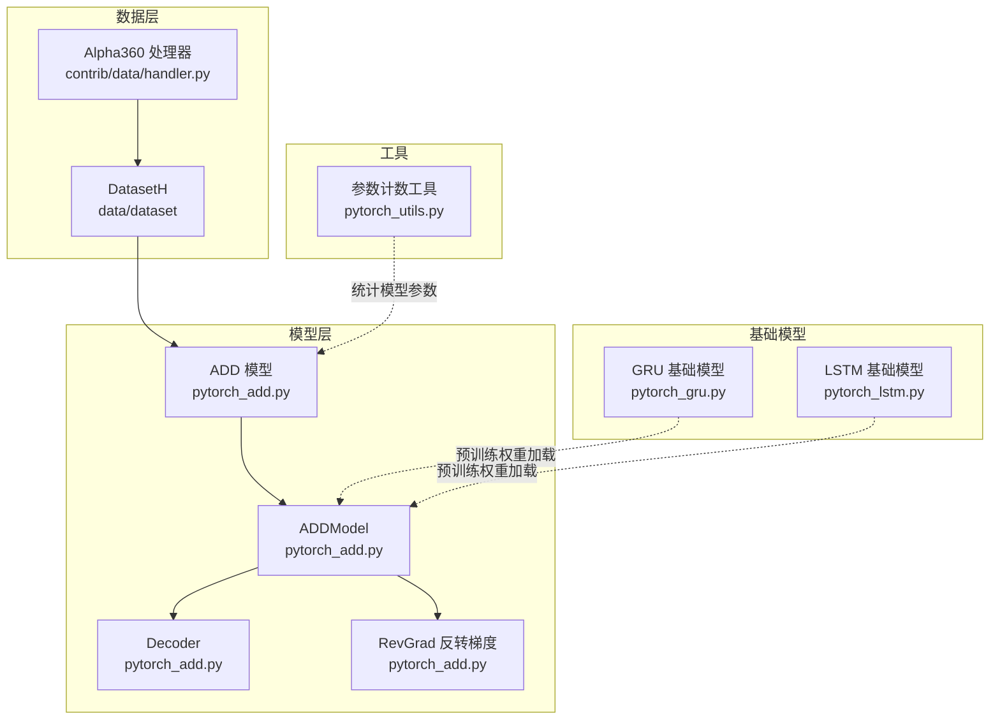
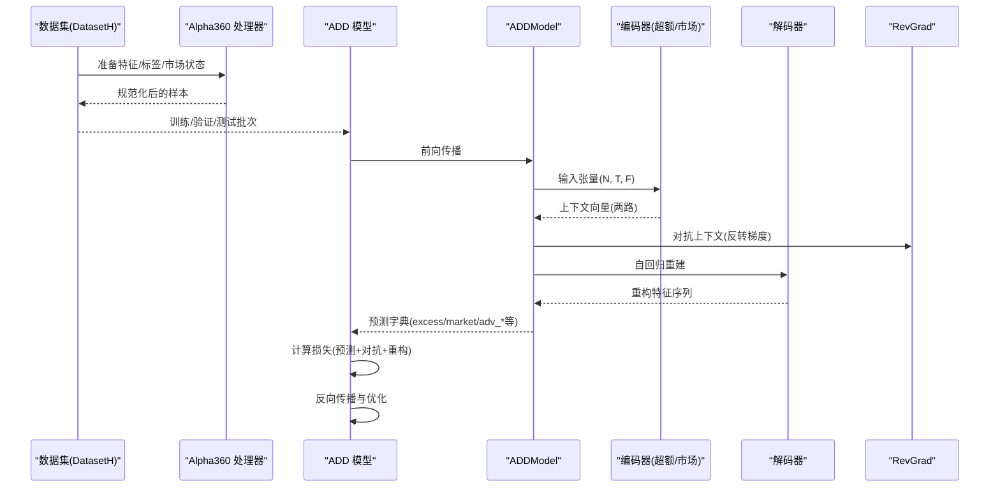
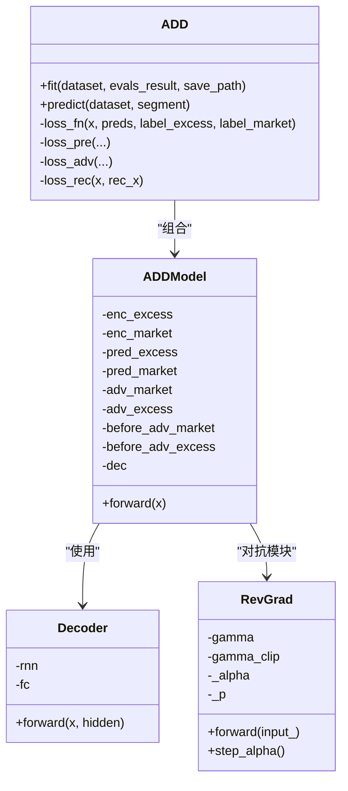
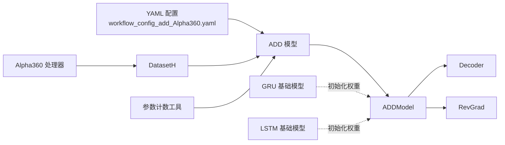

# ADD 基准模型

<cite>
**本文引用的文件列表**
- [pytorch_add.py](file://qlib/contrib/model/pytorch_add.py)
- [workflow_config_add_Alpha360.yaml](file://examples/benchmarks/ADD/workflow_config_add_Alpha360.yaml)
- [Alpha360.py](file://qlib/contrib/data/handler.py)
- [pytorch_gru.py](file://qlib/contrib/model/pytorch_gru.py)
- [pytorch_lstm.py](file://qlib/contrib/model/pytorch_lstm.py)
- [pytorch_utils.py](file://qlib/contrib/model/pytorch_utils.py)
</cite>

## 目录
1. [简介](#简介)
2. [项目结构](#项目结构)
3. [核心组件](#核心组件)
4. [架构总览](#架构总览)
5. [详细组件分析](#详细组件分析)
6. [依赖关系分析](#依赖关系分析)
7. [性能与训练要点](#性能与训练要点)
8. [运行与可视化指南](#运行与可视化指南)
9. [故障排查](#故障排查)
10. [结论](#结论)

## 简介
本文件系统化介绍 Qlib 中 ADD（Adaptive Dynamic Decomposition）基准模型的实现与使用，重点解析其对时序信号进行自适应分解与重构的能力。ADD 将输入特征分解为“超额收益”和“市场状态”两个子空间，并通过对抗训练学习不变特征，同时引入自编码器进行特征重构以增强泛化能力。本文将结合 Yaml 配置文件说明分解层数、重构策略与训练目标；基于源码解析分解与聚合模块的实现机制；并提供运行流程与可视化各分量贡献度的方法，帮助理解市场多周期特性。

## 项目结构
- 模型实现位于：qlib/contrib/model/pytorch_add.py
- 示例工作流配置位于：examples/benchmarks/ADD/workflow_config_add_Alpha360.yaml
- 数据处理器 Alpha360 定义于：qlib/contrib/data/handler.py
- 基础 GRU/LSTM 模型参考：qlib/contrib/model/pytorch_gru.py、qlib/contrib/model/pytorch_lstm.py
- 参数统计工具：qlib/contrib/model/pytorch_utils.py

图表来源
- [pytorch_add.py](file://qlib/contrib/model/pytorch_add.py#L442-L598)
- [Alpha360.py](file://qlib/contrib/data/handler.py#L48-L96)
- [pytorch_gru.py](file://qlib/contrib/model/pytorch_gru.py#L1-L340)
- [pytorch_lstm.py](file://qlib/contrib/model/pytorch_lstm.py#L1-L307)
- [pytorch_utils.py](file://qlib/contrib/model/pytorch_utils.py#L1-L38)

章节来源
- [pytorch_add.py](file://qlib/contrib/model/pytorch_add.py#L1-L598)
- [workflow_config_add_Alpha360.yaml](file://examples/benchmarks/ADD/workflow_config_add_Alpha360.yaml#L1-L93)
- [Alpha360.py](file://qlib/contrib/data/handler.py#L48-L96)
- [pytorch_gru.py](file://qlib/contrib/model/pytorch_gru.py#L1-L340)
- [pytorch_lstm.py](file://qlib/contrib/model/pytorch_lstm.py#L1-L307)
- [pytorch_utils.py](file://qlib/contrib/model/pytorch_utils.py#L1-L38)

## 核心组件
- ADD 模型类：负责超参设置、损失函数定义、训练/验证循环、早停与保存、预测等。
- ADDModel：核心网络结构，包含两路编码器（超额收益与市场状态）、对抗模块与解码器。
- Decoder：自回归式解码器，逐步重构输入特征序列。
- RevGrad：梯度反转层，用于对抗训练，使编码器学习与标签无关的不变特征。
- 基础模型：支持从预训练 GRU/LSTM 加载共享权重，加速收敛。

章节来源
- [pytorch_add.py](file://qlib/contrib/model/pytorch_add.py#L46-L172)
- [pytorch_add.py](file://qlib/contrib/model/pytorch_add.py#L442-L598)

## 架构总览
ADD 的整体流程如下：
- 输入特征按时间步展开，分别送入两路编码器（超额收益/市场状态），得到上下文向量。
- 上下文向量经前馈头分别输出超额收益预测与市场状态分类。
- 对抗模块对另一路的上下文进行梯度反转，形成对抗训练。
- 解码器自回归地重建输入特征序列，损失项包含重构误差。
- 总损失由预测损失、对抗损失与重构损失加权组合。

图表来源
- [pytorch_add.py](file://qlib/contrib/model/pytorch_add.py#L363-L440)
- [pytorch_add.py](file://qlib/contrib/model/pytorch_add.py#L442-L598)
- [Alpha360.py](file://qlib/contrib/data/handler.py#L48-L96)

## 详细组件分析

### ADD 模型类（训练与接口）
- 超参与设备选择：支持 d_feat、hidden_size、num_layers、dropout、dec_dropout、n_epochs、lr、early_stop、base_model、gamma、gamma_clip、mu、GPU 等。
- 损失函数：
  - 预测损失：超额收益使用均方误差，市场状态使用交叉熵。
  - 对抗损失：同样分为超额与市场两路，使用交叉熵或均方误差。
  - 重构损失：对输入与重构特征计算 MSE。
  - 总损失：预测损失 + 对抗损失 + μ × 重构损失。
- 训练流程：每日打乱、批量训练、梯度裁剪、早停、记录指标。
- 预测：按日聚合输出超额收益序列。

章节来源
- [pytorch_add.py](file://qlib/contrib/model/pytorch_add.py#L46-L172)
- [pytorch_add.py](file://qlib/contrib/model/pytorch_add.py#L167-L226)
- [pytorch_add.py](file://qlib/contrib/model/pytorch_add.py#L278-L349)
- [pytorch_add.py](file://qlib/contrib/model/pytorch_add.py#L419-L440)

### ADDModel（分解与聚合）
- 编码器：两路独立的 GRU/LSTM 编码器，分别提取“超额收益”和“市场状态”的上下文表示。
- 预测头：两路分别输出超额收益标量与市场状态三分类。
- 对抗模块：RevGrad 在反向传播时反转梯度，促使编码器学习与标签无关的不变特征。
- 解码器：自回归式 RNN（GRU/LSTM），逐步重建输入特征序列，输出 reconstructed_feature。

图表来源
- [pytorch_add.py](file://qlib/contrib/model/pytorch_add.py#L46-L172)
- [pytorch_add.py](file://qlib/contrib/model/pytorch_add.py#L442-L598)

章节来源
- [pytorch_add.py](file://qlib/contrib/model/pytorch_add.py#L442-L598)

### 解码器（自回归重构）
- 解码器采用 GRU/LSTM，每一步输入上一时刻的重建特征，输出当前时刻的重建特征，并更新隐藏状态。
- 通过逐时刻拼接，得到完整的重构特征序列，作为重构损失的输入。

章节来源
- [pytorch_add.py](file://qlib/contrib/model/pytorch_add.py#L527-L558)

### 对抗训练（RevGrad）
- RevGrad 是一个无参数的梯度反转层，在前向传播时不改变输入，但在反向传播时乘以负的可变系数 α，从而抑制对特定标签的过拟合。
- α 通过 sigmoid 形式的递增函数随训练步数变化，逐步增大到上限值。

章节来源
- [pytorch_add.py](file://qlib/contrib/model/pytorch_add.py#L560-L598)

### 基础模型权重初始化
- 支持从预训练 GRU/LSTM 模型加载共享权重，提升收敛速度与稳定性。
- 通过字典键匹配的方式，将预训练 rnn 层权重注入到 ADD 的两路编码器中。

章节来源
- [pytorch_add.py](file://qlib/contrib/model/pytorch_add.py#L390-L409)
- [pytorch_gru.py](file://qlib/contrib/model/pytorch_gru.py#L1-L340)
- [pytorch_lstm.py](file://qlib/contrib/model/pytorch_lstm.py#L1-L307)

## 依赖关系分析
- 数据处理：Alpha360 处理器提供特征与标签，ADD 使用 DataHandlerLP 的 DK_L/DK_I 键读取学习/推理数据，并生成市场状态标签。
- 模型依赖：ADD 依赖 pytorch_add.py 内部的 GRU/LSTM 编码器与解码器，以及 RevGrad 对抗模块。
- 工具依赖：参数计数工具用于估算模型大小。

图表来源
- [workflow_config_add_Alpha360.yaml](file://examples/benchmarks/ADD/workflow_config_add_Alpha360.yaml#L1-L93)
- [pytorch_add.py](file://qlib/contrib/model/pytorch_add.py#L363-L440)
- [Alpha360.py](file://qlib/contrib/data/handler.py#L48-L96)
- [pytorch_gru.py](file://qlib/contrib/model/pytorch_gru.py#L1-L340)
- [pytorch_lstm.py](file://qlib/contrib/model/pytorch_lstm.py#L1-L307)
- [pytorch_utils.py](file://qlib/contrib/model/pytorch_utils.py#L1-L38)

章节来源
- [workflow_config_add_Alpha360.yaml](file://examples/benchmarks/ADD/workflow_config_add_Alpha360.yaml#L1-L93)
- [pytorch_add.py](file://qlib/contrib/model/pytorch_add.py#L363-L440)
- [Alpha360.py](file://qlib/contrib/data/handler.py#L48-L96)
- [pytorch_utils.py](file://qlib/contrib/model/pytorch_utils.py#L1-L38)

## 性能与训练要点
- 分解层数：num_layers 控制编码器/解码器的深度；hidden_size 控制隐状态维度；d_feat 控制输入特征维数。
- 对抗训练：gamma/gamma_clip 控制 RevGrad 的梯度反转强度与上限；通过对抗损失促使编码器学习不变特征。
- 重构策略：μ 控制重构损失权重；解码器自回归重建有助于捕捉时序动态。
- 早停与优化：early_stop 控制早停步数；optimizer 支持 adam/sdg；训练中使用梯度裁剪防止爆炸。

章节来源
- [pytorch_add.py](file://qlib/contrib/model/pytorch_add.py#L46-L172)
- [pytorch_add.py](file://qlib/contrib/model/pytorch_add.py#L278-L349)

## 运行与可视化指南

### 运行步骤
- 准备数据：使用 Alpha360 处理器加载特征与标签，配置训练/验证/测试时间段。
- 配置模型：在 Yaml 中设置 ADD 的超参（如 d_feat、hidden_size、num_layers、dropout、dec_dropout、n_epochs、lr、early_stop、metric、base_model、gamma、gamma_clip、optimizer、mu、GPU 等）。
- 启动训练：通过 Qlib 的工作流执行任务，模型会自动准备数据、训练、评估并保存最佳权重。
- 预测与回测：使用 SignalRecord、SigAnaRecord、PortAnaRecord 记录信号、IC 分析与组合分析。

章节来源
- [workflow_config_add_Alpha360.yaml](file://examples/benchmarks/ADD/workflow_config_add_Alpha360.yaml#L1-L93)
- [pytorch_add.py](file://qlib/contrib/model/pytorch_add.py#L363-L440)

### 可视化各分量贡献度
- 超额收益预测：predict 返回超额收益序列，可用于 IC、RankIC 等指标分析。
- 市场状态分布：训练阶段会根据市场状态标签生成三分类（低/中/高），可用于观察不同市场环境下的信号表现。
- 重构特征序列：模型输出 reconstructed_feature，可对比原始特征与重构特征，评估解码器对时序动态的还原能力。
- 日内/跨日聚合：训练/预测过程中按日切片与聚合，便于观察不同交易日的信号稳定性。

章节来源
- [pytorch_add.py](file://qlib/contrib/model/pytorch_add.py#L227-L277)
- [pytorch_add.py](file://qlib/contrib/model/pytorch_add.py#L419-L440)
- [pytorch_add.py](file://qlib/contrib/model/pytorch_add.py#L518-L524)

## 故障排查
- 未知优化器：当 optimizer 不是 adam/gd 时会抛出异常，需检查配置。
- 未知基础模型：base_model 必须为 GRU 或 LSTM，否则报错。
- 未知指标：metric 名称不在有效集合时会抛出异常，需确保使用支持的指标。
- 设备不可用：若未检测到 GPU 或 GPU ID 不可用，将回退到 CPU。
- 数据为空：训练数据为空时会提示检查数据集配置。

章节来源
- [pytorch_add.py](file://qlib/contrib/model/pytorch_add.py#L153-L159)
- [pytorch_add.py](file://qlib/contrib/model/pytorch_add.py#L390-L396)
- [pytorch_add.py](file://qlib/contrib/model/pytorch_add.py#L331-L335)
- [pytorch_add.py](file://qlib/contrib/model/pytorch_add.py#L82-L87)

## 结论
ADD 在 Qlib 中实现了对时序信号的自适应分解与重构，通过两路编码器分别建模“超额收益”和“市场状态”，结合对抗训练与重构损失，提升了模型对市场多周期特性的建模能力。YAML 配置清晰地定义了训练目标与策略，源码层面则通过编码器、解码器与对抗模块的协同，实现了端到端的可训练框架。建议在实际应用中合理设置 num_layers、hidden_size、mu、gamma 等关键超参，并结合 IC、RankIC 与组合分析等记录器进行效果评估与可视化。