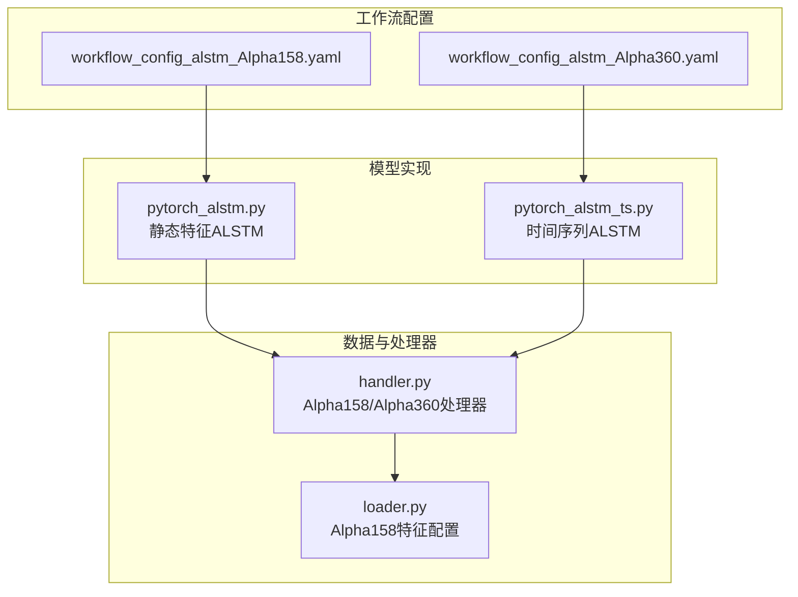
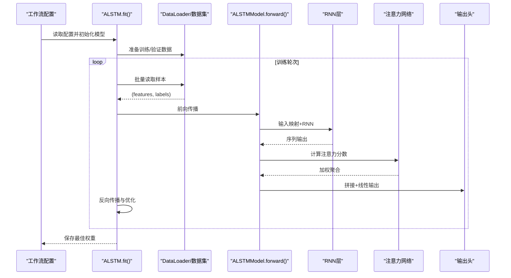
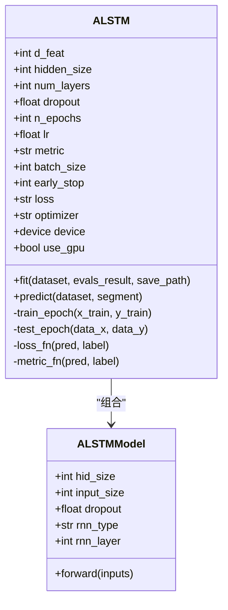
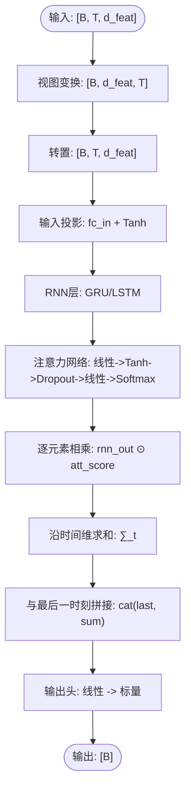
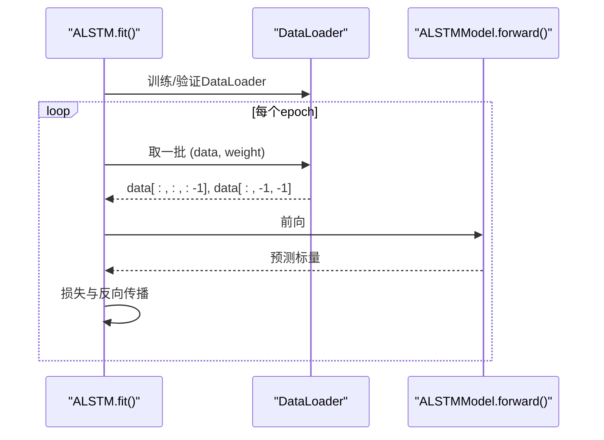
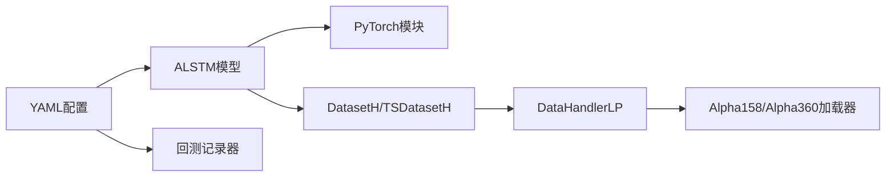

# ALSTM 基准模型

<cite>
**本文引用的文件列表**
- [pytorch_alstm.py](file://qlib/contrib/model/pytorch_alstm.py)
- [pytorch_alstm_ts.py](file://qlib/contrib/model/pytorch_alstm_ts.py)
- [workflow_config_alstm_Alpha158.yaml](file://examples/benchmarks/ALSTM/workflow_config_alstm_Alpha158.yaml)
- [workflow_config_alstm_Alpha360.yaml](file://examples/benchmarks/ALSTM/workflow_config_alstm_Alpha360.yaml)
- [handler.py](file://qlib/contrib/data/handler.py)
- [loader.py](file://qlib/contrib/data/loader.py)
- [README.md（基准模型总览）](file://examples/benchmarks/README.md)
</cite>

## 目录
1. [简介](#简介)
2. [项目结构](#项目结构)
3. [核心组件](#核心组件)
4. [架构总览](#架构总览)
5. [详细组件分析](#详细组件分析)
6. [依赖关系分析](#依赖关系分析)
7. [性能考量](#性能考量)
8. [故障排查指南](#故障排查指南)
9. [结论](#结论)
10. [附录](#附录)

## 简介
本文件系统性解析 Qlib 中的 ALSTM（Attention-based LSTM）基准模型实现，重点阐述其将 LSTM 序列建模与注意力机制相结合的设计思想与优势。文档覆盖：
- Yaml 配置文件的关键参数与训练策略
- 注意力权重计算流程及其对预测结果的影响
- 在 Alpha158 与 Alpha360 因子集上的 IC 表现对比
- 模型复杂度与计算开销的平衡建议

## 项目结构
ALSTM 在 Qlib 的实现位于贡献模块中，包含两个版本：
- 面向静态特征的 ALSTM：使用 DatasetH 与 DataHandlerLP
- 面向时间序列的 ALSTM：使用 TSDatasetH 与时间步维度

同时，ALSTM 的工作流配置分别针对 Alpha158 与 Alpha360 数据集，展示了不同的特征集合与标签定义。

图表来源
- [pytorch_alstm.py](file://qlib/contrib/model/pytorch_alstm.py#L1-L345)
- [pytorch_alstm_ts.py](file://qlib/contrib/model/pytorch_alstm_ts.py#L1-L356)
- [handler.py](file://qlib/contrib/data/handler.py#L98-L115)
- [loader.py](file://qlib/contrib/data/loader.py#L61-L83)
- [workflow_config_alstm_Alpha158.yaml](file://examples/benchmarks/ALSTM/workflow_config_alstm_Alpha158.yaml#L1-L99)
- [workflow_config_alstm_Alpha360.yaml](file://examples/benchmarks/ALSTM/workflow_config_alstm_Alpha360.yaml#L1-L89)

章节来源
- [pytorch_alstm.py](file://qlib/contrib/model/pytorch_alstm.py#L1-L345)
- [pytorch_alstm_ts.py](file://qlib/contrib/model/pytorch_alstm_ts.py#L1-L356)
- [handler.py](file://qlib/contrib/data/handler.py#L98-L115)
- [loader.py](file://qlib/contrib/data/loader.py#L61-L83)
- [workflow_config_alstm_Alpha158.yaml](file://examples/benchmarks/ALSTM/workflow_config_alstm_Alpha158.yaml#L1-L99)
- [workflow_config_alstm_Alpha360.yaml](file://examples/benchmarks/ALSTM/workflow_config_alstm_Alpha360.yaml#L1-L89)

## 核心组件
- ALSTM 模型类：封装超参、优化器、损失函数、早停策略与训练/验证循环
- ALSTMModel 子模块：包含输入投影、RNN 层、注意力网络与输出头
- 数据处理器：Alpha158/Alpha360 处理器负责特征与标签的构造
- 工作流配置：定义训练/验证/测试分段、特征选择、标签定义与回测策略

章节来源
- [pytorch_alstm.py](file://qlib/contrib/model/pytorch_alstm.py#L25-L121)
- [pytorch_alstm_ts.py](file://qlib/contrib/model/pytorch_alstm_ts.py#L28-L138)
- [handler.py](file://qlib/contrib/data/handler.py#L98-L115)

## 架构总览
ALSTM 将输入特征通过线性映射进入隐藏空间，随后送入多层 RNN（默认 GRU），在每个时间步上计算注意力分数，对 RNN 输出进行加权求和，最后将“最后一个时间步的输出”与“注意力聚合输出”拼接后经全连接层得到标量预测。

图表来源
- [pytorch_alstm.py](file://qlib/contrib/model/pytorch_alstm.py#L156-L208)
- [pytorch_alstm_ts.py](file://qlib/contrib/model/pytorch_alstm_ts.py#L170-L205)
- [pytorch_alstm.py](file://qlib/contrib/model/pytorch_alstm.py#L333-L345)
- [pytorch_alstm_ts.py](file://qlib/contrib/model/pytorch_alstm_ts.py#L347-L356)

## 详细组件分析

### 组件A：ALSTM 模型类（静态特征版）
- 超参管理：d_feat、hidden_size、num_layers、dropout、n_epochs、lr、batch_size、early_stop、loss、optimizer、GPU、seed
- 优化器与设备：支持 Adam 与 SGD；自动选择 GPU/CPU
- 损失与指标：支持均方误差损失；指标为负损失用于早停
- 训练/验证：按 epoch 进行训练与评估，记录训练/验证指标，早停停止条件触发时加载最佳权重
- 预测：按批处理推理，返回带索引的 Series

图表来源
- [pytorch_alstm.py](file://qlib/contrib/model/pytorch_alstm.py#L40-L121)
- [pytorch_alstm.py](file://qlib/contrib/model/pytorch_alstm.py#L156-L208)
- [pytorch_alstm.py](file://qlib/contrib/model/pytorch_alstm.py#L294-L345)

章节来源
- [pytorch_alstm.py](file://qlib/contrib/model/pytorch_alstm.py#L40-L121)
- [pytorch_alstm.py](file://qlib/contrib/model/pytorch_alstm.py#L156-L208)
- [pytorch_alstm.py](file://qlib/contrib/model/pytorch_alstm.py#L294-L345)

### 组件B：ALSTMModel 注意力机制
- 输入投影：将 d_feat 维特征映射到 hidden_size
- RNN 层：默认使用 GRU（可选 LSTM），batch_first=True
- 注意力网络：两层前馈 + Tanh + Dropout + 线性 + Softmax，输出每个时间步的注意力权重
- 聚合与输出：将注意力权重与 RNN 输出逐元素相乘并求和，与最后一个时间步的输出拼接后经线性层得到标量预测

图表来源
- [pytorch_alstm.py](file://qlib/contrib/model/pytorch_alstm.py#L333-L345)

章节来源
- [pytorch_alstm.py](file://qlib/contrib/model/pytorch_alstm.py#L294-L345)

### 组件C：ALSTM 模型类（时间序列版）
- 与静态特征版的主要差异在于数据加载与批次结构：使用 DataLoader 与 TSDatasetH，特征的最后一维为特征维度，标签为最后一时刻的标量
- 支持重采样权重与并行加载（n_jobs）

图表来源
- [pytorch_alstm_ts.py](file://qlib/contrib/model/pytorch_alstm_ts.py#L170-L205)
- [pytorch_alstm_ts.py](file://qlib/contrib/model/pytorch_alstm_ts.py#L347-L356)

章节来源
- [pytorch_alstm_ts.py](file://qlib/contrib/model/pytorch_alstm_ts.py#L170-L205)
- [pytorch_alstm_ts.py](file://qlib/contrib/model/pytorch_alstm_ts.py#L206-L286)
- [pytorch_alstm_ts.py](file://qlib/contrib/model/pytorch_alstm_ts.py#L308-L356)

### 组件D：YAML 配置与训练策略
- Alpha158 配置要点
  - 特征处理器：RobustZScoreNorm、Fillna；标签为未来相对收益
  - 模型：ALSTM（静态特征版），d_feat=20，hidden_size=64，num_layers=2，dropout=0.0，n_epochs=200，lr=1e-3，early_stop=10，batch_size=800，loss=mse，rnn_type=GRU
  - 数据集：DatasetH（静态特征），segments 定义训练/验证/测试区间
- Alpha360 配置要点
  - 特征处理器：RobustZScoreNorm、Fillna；标签为未来相对收益
  - 模型：ALSTM（静态特征版），d_feat=6，hidden_size=64，num_layers=2，dropout=0.0，n_epochs=200，lr=1e-3，early_stop=20，batch_size=800，loss=mse，rnn_type=GRU
  - 数据集：DatasetH（静态特征）

章节来源
- [workflow_config_alstm_Alpha158.yaml](file://examples/benchmarks/ALSTM/workflow_config_alstm_Alpha158.yaml#L1-L99)
- [workflow_config_alstm_Alpha360.yaml](file://examples/benchmarks/ALSTM/workflow_config_alstm_Alpha360.yaml#L1-L89)

### 组件E：数据处理器与标签定义
- Alpha158/Alpha360 处理器：定义标签为未来相对收益，支持多种预处理流水线（归一化、填充等）
- Alpha158 特征配置：包含一系列经典技术因子字段

章节来源
- [handler.py](file://qlib/contrib/data/handler.py#L98-L115)
- [loader.py](file://qlib/contrib/data/loader.py#L61-L83)

## 依赖关系分析
- 模型依赖 PyTorch 的 nn.Module、optim、DataLoader 等
- 数据依赖 Qlib 的 DatasetH/TSDatasetH 与 DataHandlerLP
- 评估与回测由工作流记录器完成（SignalRecord、SigAnaRecord、PortAnaRecord）

图表来源
- [pytorch_alstm.py](file://qlib/contrib/model/pytorch_alstm.py#L1-L345)
- [pytorch_alstm_ts.py](file://qlib/contrib/model/pytorch_alstm_ts.py#L1-L356)
- [workflow_config_alstm_Alpha158.yaml](file://examples/benchmarks/ALSTM/workflow_config_alstm_Alpha158.yaml#L1-L99)
- [workflow_config_alstm_Alpha360.yaml](file://examples/benchmarks/ALSTM/workflow_config_alstm_Alpha360.yaml#L1-L89)

章节来源
- [pytorch_alstm.py](file://qlib/contrib/model/pytorch_alstm.py#L1-L345)
- [pytorch_alstm_ts.py](file://qlib/contrib/model/pytorch_alstm_ts.py#L1-L356)
- [workflow_config_alstm_Alpha158.yaml](file://examples/benchmarks/ALSTM/workflow_config_alstm_Alpha158.yaml#L1-L99)
- [workflow_config_alstm_Alpha360.yaml](file://examples/benchmarks/ALSTM/workflow_config_alstm_Alpha360.yaml#L1-L89)

## 性能考量
- 注意力权重计算：注意力网络为轻量级前馈网络，计算开销与 RNN 输出规模线性相关
- RNN 层：hidden_size、num_layers 与序列长度共同决定主要计算量
- 批大小与设备：较大的 batch_size 与 GPU 可显著提升吞吐；注意显存上限
- 早停与正则：early_stop 与 dropout 有助于防止过拟合，提高泛化能力
- 特征维度：d_feat 越大，输入投影与注意力计算成本越高；Alpha158 使用 20 维特征，Alpha360 使用 6 维特征

[本节为通用性能讨论，不直接分析具体文件]

## 故障排查指南
- 空数据报错：当数据集为空时会抛出异常，需检查数据路径与分段配置
- 未知优化器/损失：不支持的优化器或损失类型会抛出异常
- 设备不可用：若未指定 GPU 或 CUDA 不可用，将回退至 CPU
- NaN/无穷值：损失函数与指标函数对 NaN/无穷值有掩码处理，确保标签清洗

章节来源
- [pytorch_alstm.py](file://qlib/contrib/model/pytorch_alstm.py#L140-L155)
- [pytorch_alstm_ts.py](file://qlib/contrib/model/pytorch_alstm_ts.py#L143-L168)

## 结论
ALSTM 将注意力机制引入 LSTM 序列建模，使模型能够自适应地聚焦于对预测关键的时间步，从而在 Alpha158 与 Alpha360 上取得稳健的 IC 表现。通过合理的超参设置（如 hidden_size、num_layers、dropout、batch_size）与早停策略，可在模型复杂度与性能之间取得良好平衡。建议在 Alpha158 上优先尝试更大的 d_feat 以利用更丰富的特征表达，在 Alpha360 上保持较小 d_feat 以控制计算成本。

[本节为总结性内容，不直接分析具体文件]

## 附录

### 运行示例与性能评估方法
- 运行示例
  - Alpha158：参考静态特征版配置，使用 DatasetH 与 Alpha158 处理器
  - Alpha360：参考静态特征版配置，使用 DatasetH 与 Alpha360 处理器
- 性能评估
  - 使用工作流记录器输出信号、IC 分析与组合分析
  - 对比不同数据集下的 IC、ICIR、年化收益与最大回撤

章节来源
- [workflow_config_alstm_Alpha158.yaml](file://examples/benchmarks/ALSTM/workflow_config_alstm_Alpha158.yaml#L54-L99)
- [workflow_config_alstm_Alpha360.yaml](file://examples/benchmarks/ALSTM/workflow_config_alstm_Alpha360.yaml#L46-L89)

### Alpha158 与 Alpha360 上的 IC 表现对比
- 参考基准模型总览中的 IC/ICIR/Rank IC/Rank ICIR 指标，比较 ALSTM 在两个数据集上的表现

章节来源
- [README.md（基准模型总览）](file://examples/benchmarks/README.md#L27-L72)