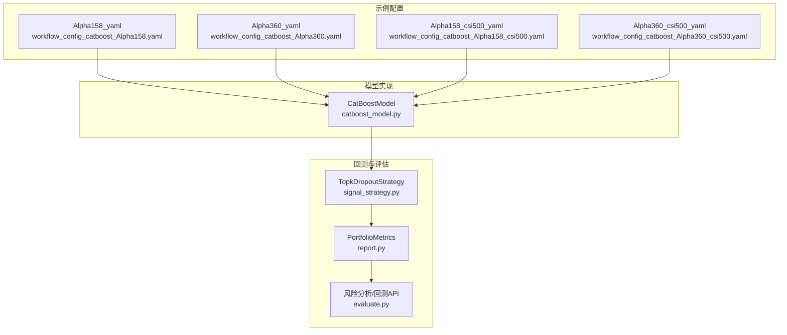
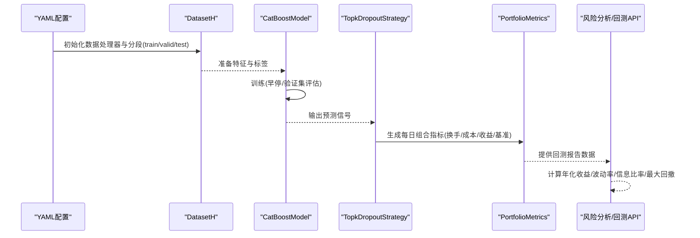
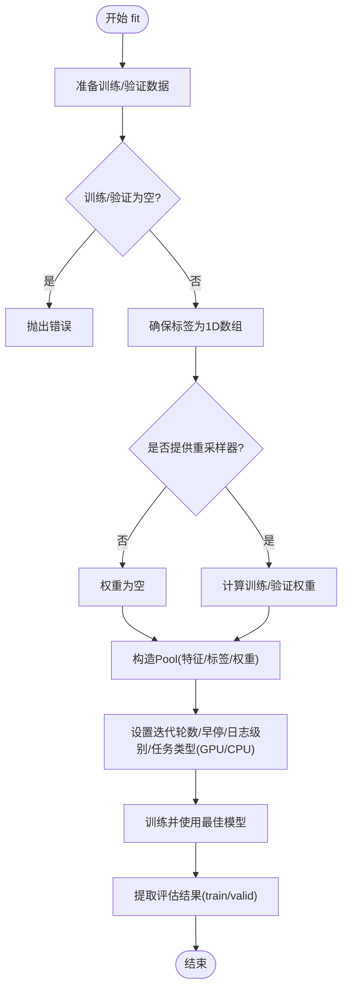
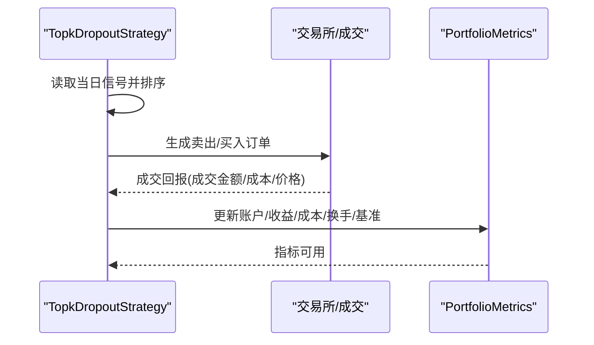
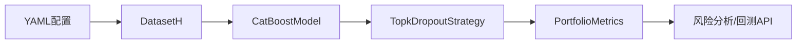

# CatBoost 基准模型

<cite>
**本文引用的文件**
- [README.md](file://examples/benchmarks/CatBoost/README.md)
- [workflow_config_catboost_Alpha158.yaml](file://examples/benchmarks/CatBoost/workflow_config_catboost_Alpha158.yaml)
- [workflow_config_catboost_Alpha360.yaml](file://examples/benchmarks/CatBoost/workflow_config_catboost_Alpha360.yaml)
- [workflow_config_catboost_Alpha158_csi500.yaml](file://examples/benchmarks/CatBoost/workflow_config_catboost_Alpha158_csi500.yaml)
- [workflow_config_catboost_Alpha360_csi500.yaml](file://examples/benchmarks/CatBoost/workflow_config_catboost_Alpha360_csi500.yaml)
- [catboost_model.py](file://qlib/contrib/model/catboost_model.py)
- [report.py](file://qlib/backtest/report.py)
- [evaluate.py](file://qlib/contrib/evaluate.py)
- [signal_strategy.py](file://qlib/contrib/strategy/signal_strategy.py)
- [recorder.py](file://qlib/workflow/recorder.py)
- [gbdt.py](file://qlib/contrib/model/gbdt.py)
</cite>

## 目录
1. [简介](#简介)
2. [项目结构](#项目结构)
3. [核心组件](#核心组件)
4. [架构总览](#架构总览)
5. [详细组件分析](#详细组件分析)
6. [依赖关系分析](#依赖关系分析)
7. [性能考量与调优](#性能考量与调优)
8. [故障排查指南](#故障排查指南)
9. [结论](#结论)
10. [附录](#附录)

## 简介
本文件系统性解析 Qlib 中 CatBoost 基准实现，聚焦于其在处理金融时间序列数据时的优势与实践要点。文档围绕以下目标展开：
- 深入解析 CatBoost 在 Qlib 的 YAML 配置结构，涵盖数据集划分、模型超参数（如 iterations、learning_rate）与类别特征处理等。
- 说明如何运行 CatBoost 模型，并对比其在 CSI300 与 CSI500 等不同指数下的表现差异。
- 结合回测报告中的换手率、最大回撤等指标进行解释。
- 提供性能调优建议，包括并行训练配置与内存优化策略。

## 项目结构
CatBoost 基准实现主要由三部分组成：
- 示例配置：位于 examples/benchmarks/CatBoost 下，包含针对 Alpha158 与 Alpha360 的多套工作流配置，分别对应 csi300 与 csi500 市场。
- 模型实现：位于 qlib/contrib/model/catboost_model.py，封装了 CatBoost 的训练、预测与特征重要性接口。
- 回测与评估：位于 qlib/backtest/report.py、qlib/contrib/evaluate.py、qlib/contrib/strategy/signal_strategy.py 等模块，负责生成回测报告与风险分析。

图表来源
- [workflow_config_catboost_Alpha158.yaml](file://examples/benchmarks/CatBoost/workflow_config_catboost_Alpha158.yaml#L1-L71)
- [workflow_config_catboost_Alpha360.yaml](file://examples/benchmarks/CatBoost/workflow_config_catboost_Alpha360.yaml#L1-L78)
- [workflow_config_catboost_Alpha158_csi500.yaml](file://examples/benchmarks/CatBoost/workflow_config_catboost_Alpha158_csi500.yaml#L1-L71)
- [workflow_config_catboost_Alpha360_csi500.yaml](file://examples/benchmarks/CatBoost/workflow_config_catboost_Alpha360_csi500.yaml#L1-L78)
- [catboost_model.py](file://qlib/contrib/model/catboost_model.py#L1-L101)
- [report.py](file://qlib/backtest/report.py#L1-L220)
- [evaluate.py](file://qlib/contrib/evaluate.py#L1-L120)
- [signal_strategy.py](file://qlib/contrib/strategy/signal_strategy.py#L75-L114)

章节来源
- [README.md](file://examples/benchmarks/CatBoost/README.md#L1-L3)

## 核心组件
- CatBoostModel：封装 CatBoost 训练、预测与特征重要性计算，支持早停、验证集评估与权重重采样。
- TopkDropoutStrategy：基于信号的择时策略，按 topk 与 n_drop 进行每日调仓，支持是否仅交易可交易标的与涨跌停限制。
- PortfolioMetrics：生成每日组合指标，包括收益、成本、换手、账户价值、基准收益等。
- 风险分析工具：提供年化收益、波动率、信息比率与最大回撤等指标计算。

章节来源
- [catboost_model.py](file://qlib/contrib/model/catboost_model.py#L1-L101)
- [signal_strategy.py](file://qlib/contrib/strategy/signal_strategy.py#L75-L114)
- [report.py](file://qlib/backtest/report.py#L1-L220)
- [evaluate.py](file://qlib/contrib/evaluate.py#L1-L120)

## 架构总览
下图展示了从 YAML 配置到模型训练、策略执行与回测报告生成的整体流程。

图表来源
- [workflow_config_catboost_Alpha158.yaml](file://examples/benchmarks/CatBoost/workflow_config_catboost_Alpha158.yaml#L32-L71)
- [catboost_model.py](file://qlib/contrib/model/catboost_model.py#L28-L78)
- [signal_strategy.py](file://qlib/contrib/strategy/signal_strategy.py#L138-L296)
- [report.py](file://qlib/backtest/report.py#L153-L215)
- [evaluate.py](file://qlib/contrib/evaluate.py#L27-L95)

## 详细组件分析

### YAML 配置结构与数据划分
- 数据初始化与市场基准
  - provider_uri：本地数据目录路径。
  - region：cn。
  - market/benchmark：分别指定市场池与基准指数代码。
- 数据处理器配置
  - start_time/end_time/fit_start_time/fit_end_time：全样本区间与拟合区间。
  - instruments：市场池（csi300 或 csi500）。
  - Alpha158/Alpha360：特征处理器类名与模块路径；Alpha360 额外包含标签归一化与标签表达式。
- 分割段
  - train/valid/test：训练、验证与测试的时间窗口，用于模型选择与最终评估。
- 任务配置
  - model：CatBoostModel 类与模块路径，以及损失函数、学习率、深度、叶子数、线程数、增长策略与自举类型等超参。
  - dataset：DatasetH 与 handler（Alpha158/Alpha360），segments 定义训练/验证/测试。
  - record：记录信号、信号分析与组合分析。

章节来源
- [workflow_config_catboost_Alpha158.yaml](file://examples/benchmarks/CatBoost/workflow_config_catboost_Alpha158.yaml#L1-L71)
- [workflow_config_catboost_Alpha360.yaml](file://examples/benchmarks/CatBoost/workflow_config_catboost_Alpha360.yaml#L1-L78)
- [workflow_config_catboost_Alpha158_csi500.yaml](file://examples/benchmarks/CatBoost/workflow_config_catboost_Alpha158_csi500.yaml#L1-L71)
- [workflow_config_catboost_Alpha360_csi500.yaml](file://examples/benchmarks/CatBoost/workflow_config_catboost_Alpha360_csi500.yaml#L1-L78)

### CatBoostModel 实现细节
- 训练流程
  - 从 DatasetH 中准备训练/验证数据，确保标签为 1D 数组。
  - 支持可选的重采样权重（Reweighter）传入。
  - 自动检测 GPU 可用性并设置 task_type（GPU/CPU）。
  - 使用早停与验证集评估，记录训练/验证曲线。
- 预测与特征重要性
  - predict 返回测试集上的预测值序列。
  - get_feature_importance 返回按重要性排序的特征重要性 Series。
- 多标签不支持
  - 若标签维度大于 1 且列数不为 1，抛出异常提示不支持多标签训练。

图表来源
- [catboost_model.py](file://qlib/contrib/model/catboost_model.py#L28-L78)

章节来源
- [catboost_model.py](file://qlib/contrib/model/catboost_model.py#L1-L101)

### 策略与回测执行
- TopkDropoutStrategy
  - 依据信号对股票进行排序，按 topk 与 n_drop 决定买入/卖出标的。
  - 支持仅交易可交易标的、持有门槛、涨跌停限制等控制逻辑。
- 回测报告
  - PortfolioMetrics 维护每日账户、收益、成本、换手、基准等指标。
  - evaluate.risk_analysis 提供年化收益、波动率、信息比率与最大回撤等统计。

图表来源
- [signal_strategy.py](file://qlib/contrib/strategy/signal_strategy.py#L138-L296)
- [report.py](file://qlib/backtest/report.py#L153-L215)
- [evaluate.py](file://qlib/contrib/evaluate.py#L27-L95)

章节来源
- [signal_strategy.py](file://qlib/contrib/strategy/signal_strategy.py#L75-L114)
- [signal_strategy.py](file://qlib/contrib/strategy/signal_strategy.py#L138-L296)
- [report.py](file://qlib/backtest/report.py#L1-L220)
- [evaluate.py](file://qlib/contrib/evaluate.py#L1-L120)

### 不同指数下的表现差异
- csi300 vs csi500
  - 配置文件通过 market/benchmark 字段切换市场池与基准指数，其余训练/回测流程保持一致。
  - 通过比较两套配置的回测报告（如年化收益、最大回撤、换手率等）可量化不同市场池下的表现差异。
- Alpha158 vs Alpha360
  - Alpha360 配置额外包含标签归一化与标签表达式，可能影响信号分布与回测结果。

章节来源
- [workflow_config_catboost_Alpha158.yaml](file://examples/benchmarks/CatBoost/workflow_config_catboost_Alpha158.yaml#L1-L71)
- [workflow_config_catboost_Alpha360.yaml](file://examples/benchmarks/CatBoost/workflow_config_catboost_Alpha360.yaml#L1-L78)
- [workflow_config_catboost_Alpha158_csi500.yaml](file://examples/benchmarks/CatBoost/workflow_config_catboost_Alpha158_csi500.yaml#L1-L71)
- [workflow_config_catboost_Alpha360_csi500.yaml](file://examples/benchmarks/CatBoost/workflow_config_catboost_Alpha360_csi500.yaml#L1-L78)

## 依赖关系分析
- 配置到模型
  - YAML 中的 model/dataset/record 项分别指向 CatBoostModel、DatasetH 与记录器。
- 模型到策略
  - CatBoostModel 的预测作为 TopkDropoutStrategy 的输入信号。
- 策略到回测
  - TopkDropoutStrategy 生成的决策驱动 PortfolioMetrics 的更新。
- 回测到分析
  - PortfolioMetrics 的数据经 evaluate.risk_analysis 计算风险指标。

图表来源
- [workflow_config_catboost_Alpha158.yaml](file://examples/benchmarks/CatBoost/workflow_config_catboost_Alpha158.yaml#L32-L71)
- [catboost_model.py](file://qlib/contrib/model/catboost_model.py#L28-L78)
- [signal_strategy.py](file://qlib/contrib/strategy/signal_strategy.py#L138-L296)
- [report.py](file://qlib/backtest/report.py#L153-L215)
- [evaluate.py](file://qlib/contrib/evaluate.py#L27-L95)

章节来源
- [workflow_config_catboost_Alpha158.yaml](file://examples/benchmarks/CatBoost/workflow_config_catboost_Alpha158.yaml#L32-L71)
- [catboost_model.py](file://qlib/contrib/model/catboost_model.py#L28-L78)
- [signal_strategy.py](file://qlib/contrib/strategy/signal_strategy.py#L138-L296)
- [report.py](file://qlib/backtest/report.py#L153-L215)
- [evaluate.py](file://qlib/contrib/evaluate.py#L27-L95)

## 性能考量与调优
- 并行训练与设备选择
  - CatBoostModel 会自动检测 GPU 设备数量并设置 task_type 为 GPU 或 CPU，以充分利用硬件资源。
  - 线程数可通过 model.kwargs 中的 thread_count 控制，建议根据 CPU 核心数与内存上限合理设置。
- 早停与评估
  - 通过 early_stopping_rounds 与 evals_result 记录训练/验证曲线，有助于避免过拟合并节省训练时间。
- 重采样权重
  - 通过 reweighter 参数传入 Reweighter，可对样本权重进行调整，改善类别不平衡或提升特定样本的重要性。
- 与 LightGBM 对比
  - 两者均支持早停与评估回调，但 CatBoostModel 采用 Pool 包装数据，LightGBM 使用 lgb.Dataset；二者在接口与默认行为上略有差异。

章节来源
- [catboost_model.py](file://qlib/contrib/model/catboost_model.py#L66-L78)
- [gbdt.py](file://qlib/contrib/model/gbdt.py#L57-L91)

## 故障排查指南
- “空数据”错误
  - 当 DatasetH 准备的训练/验证数据为空时，CatBoostModel 将抛出错误。请检查 YAML 中的 start_time/end_time/fit_* 与 instruments 设置。
- “多标签不支持”
  - CatBoostModel 不支持多标签训练，若标签维度大于 1 且列数不为 1，将抛出异常。请确保标签为单列或降维。
- “重采样器类型不支持”
  - reweighter 必须为 Reweighter 实例，否则抛出异常。请确认传入对象类型正确。
- 回测报告缺失
  - 若未生成 PortfolioMetrics，请检查 record 配置与策略执行是否成功。
- 风险指标异常
  - max_drawdown 计算依赖累计收益序列，若数据缺失或频率不匹配，可能导致异常。请核对回测起止时间与频率。

章节来源
- [catboost_model.py](file://qlib/contrib/model/catboost_model.py#L43-L61)
- [report.py](file://qlib/backtest/report.py#L153-L215)
- [evaluate.py](file://qlib/contrib/evaluate.py#L27-L95)

## 结论
CatBoost 在 Qlib 的基准实现提供了简洁而强大的接口，能够高效地完成金融时间序列建模与回测评估。通过合理的 YAML 配置（数据划分、特征处理器、模型超参与类别特征处理），结合 TopkDropoutStrategy 的择时逻辑与 PortfolioMetrics 的指标体系，可以系统性地比较不同市场池（CSI300/CSI500）与不同 Alpha 特征集（Alpha158/Alpha360）下的表现差异。性能方面，CatBoostModel 自动适配 GPU/CPU、支持早停与权重重采样，便于在有限时间内获得稳定的结果。

## 附录
- 运行与评估步骤建议
  - 使用对应的 YAML 配置启动实验，CatBoostModel 将自动训练并输出预测。
  - 通过 TopkDropoutStrategy 生成交易决策，PortfolioMetrics 记录每日指标。
  - 使用 evaluate.risk_analysis 计算年化收益、波动率、信息比率与最大回撤等指标。
- 指标解释
  - 换手率：衡量组合在回测期内的交易频率，过高可能增加交易成本。
  - 最大回撤：反映策略在回测期内的最大净值回撤幅度，用于评估下行风险。

章节来源
- [workflow_config_catboost_Alpha158.yaml](file://examples/benchmarks/CatBoost/workflow_config_catboost_Alpha158.yaml#L32-L71)
- [workflow_config_catboost_Alpha360.yaml](file://examples/benchmarks/CatBoost/workflow_config_catboost_Alpha360.yaml#L39-L78)
- [evaluate.py](file://qlib/contrib/evaluate.py#L27-L95)
- [report.py](file://qlib/backtest/report.py#L153-L215)