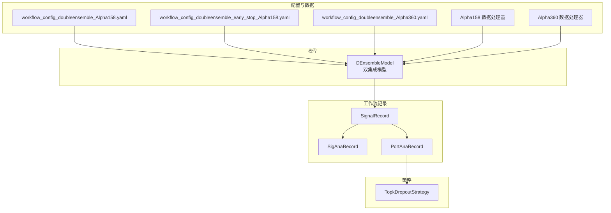
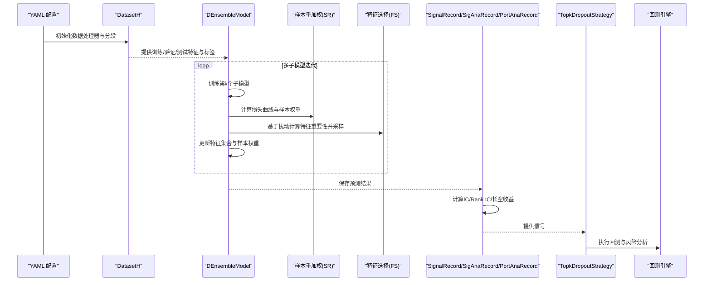
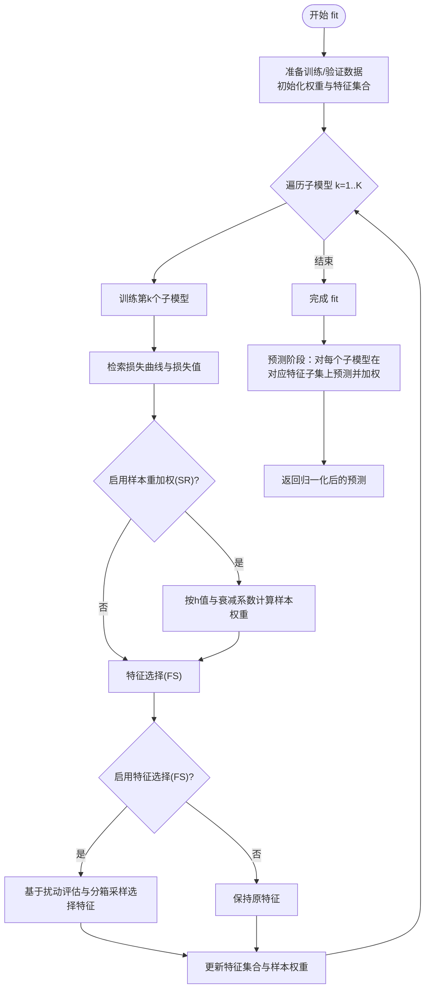
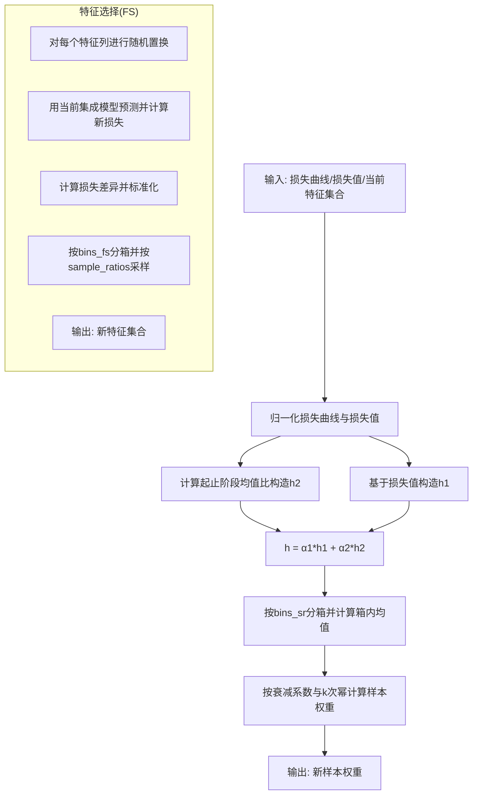
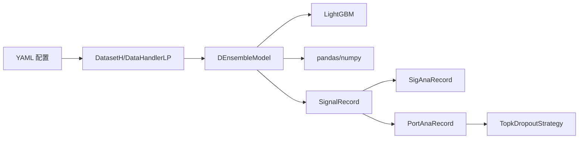

# DoubleEnsemble 基准模型

<cite>
**本文引用的文件列表**
- [double_ensemble.py](file://qlib/contrib/model/double_ensemble.py)
- [workflow_config_doubleensemble_Alpha158.yaml](file://examples/benchmarks/DoubleEnsemble/workflow_config_doubleensemble_Alpha158.yaml)
- [workflow_config_doubleensemble_early_stop_Alpha158.yaml](file://examples/benchmarks/DoubleEnsemble/workflow_config_doubleensemble_early_stop_Alpha158.yaml)
- [workflow_config_doubleensemble_Alpha360.yaml](file://examples/benchmarks/DoubleEnsemble/workflow_config_doubleensemble_Alpha360.yaml)
- [README.md](file://examples/benchmarks/DoubleEnsemble/README.md)
- [record_temp.py](file://qlib/workflow/record_temp.py)
- [signal_strategy.py](file://qlib/contrib/strategy/signal_strategy.py)
- [handler.py](file://qlib/contrib/data/handler.py)
</cite>

## 目录
1. [简介](#简介)
2. [项目结构](#项目结构)
3. [核心组件](#核心组件)
4. [架构总览](#架构总览)
5. [详细组件分析](#详细组件分析)
6. [依赖关系分析](#依赖关系分析)
7. [性能考量](#性能考量)
8. [故障排查指南](#故障排查指南)
9. [结论](#结论)
10. [附录](#附录)

## 简介
本文件系统化解析 Qlib 中 DoubleEnsemble（简称 DEnsemble）基准模型的实现与使用，重点阐述其“双重集成策略”：模型级集成（多子模型加权）与特征级集成（基于样本学习轨迹的样本重加权与基于特征扰动的特征选择）。文档将结合源码与 YAML 配置，说明基学习器组合方式、权重分配机制、早停策略，以及两阶段集成逻辑；并给出完整运行流程与在降低方差、提升鲁棒性方面的效果评估方法。

## 项目结构
DoubleEnsemble 在 Qlib 的典型位置如下：
- 模型实现：qlib/contrib/model/double_ensemble.py
- 基准示例与配置：examples/benchmarks/DoubleEnsemble/*.yaml
- 工作流记录器：qlib/workflow/record_temp.py（用于生成信号、IC 分析与回测）
- 策略：qlib/contrib/strategy/signal_strategy.py（如 TopkDropoutStrategy）
- 数据处理器：qlib/contrib/data/handler.py（Alpha158/Alpha360）

图表来源
- [double_ensemble.py](file://qlib/contrib/model/double_ensemble.py#L1-L278)
- [workflow_config_doubleensemble_Alpha158.yaml](file://examples/benchmarks/DoubleEnsemble/workflow_config_doubleensemble_Alpha158.yaml#L1-L93)
- [workflow_config_doubleensemble_early_stop_Alpha158.yaml](file://examples/benchmarks/DoubleEnsemble/workflow_config_doubleensemble_early_stop_Alpha158.yaml#L1-L94)
- [workflow_config_doubleensemble_Alpha360.yaml](file://examples/benchmarks/DoubleEnsemble/workflow_config_doubleensemble_Alpha360.yaml#L1-L100)
- [record_temp.py](file://qlib/workflow/record_temp.py#L162-L357)
- [signal_strategy.py](file://qlib/contrib/strategy/signal_strategy.py#L75-L164)
- [handler.py](file://qlib/contrib/data/handler.py#L98-L115)

章节来源
- [README.md](file://examples/benchmarks/DoubleEnsemble/README.md#L1-L4)

## 核心组件
- DEnsembleModel：双集成模型主体，包含两阶段迭代训练、样本重加权（SR）、特征选择（FS），以及最终集成预测与特征重要度聚合。
- YAML 配置：定义数据集、模型参数、记录器与回测策略等。
- 记录器：SignalRecord/SigAnaRecord/PortAnaRecord 串联信号生成、IC/Rank IC 分析与回测分析。
- 策略：TopkDropoutStrategy 将信号转换为交易决策并执行回测。

章节来源
- [double_ensemble.py](file://qlib/contrib/model/double_ensemble.py#L15-L124)
- [record_temp.py](file://qlib/workflow/record_temp.py#L162-L357)
- [signal_strategy.py](file://qlib/contrib/strategy/signal_strategy.py#L75-L164)

## 架构总览
下图展示从配置到回测的整体流程，包括数据准备、模型训练与两阶段集成、信号记录与分析、以及回测与风险分析。

图表来源
- [double_ensemble.py](file://qlib/contrib/model/double_ensemble.py#L65-L124)
- [record_temp.py](file://qlib/workflow/record_temp.py#L162-L357)
- [signal_strategy.py](file://qlib/contrib/strategy/signal_strategy.py#L75-L164)

## 详细组件分析

### DEnsembleModel 类与两阶段集成逻辑
- 初始化参数
  - 基学习器类型、损失函数、子模型数量、是否启用 SR/FS、alpha1/alpha2、bins_sr/bins_fs、衰减系数 decay、样本比例 sample_ratios、子模型权重 sub_weights、训练轮数 epochs、早停 rounds。
- 训练流程（fit）
  - 准备训练/验证数据，初始化样本权重与特征集合，循环训练每个子模型。
  - 每次训练后：
    - 通过检索损失曲线与当前集成预测计算样本损失值；
    - 若启用 SR，则按损失曲线与损失值计算样本权重；
    - 若启用 FS，则对特征进行扰动评估并按分箱采样选择新特征集合。
  - 最后一个子模型不进行 SR/FS。
- 预测流程（predict）
  - 对每个子模型在对应特征子集上做预测，按子权重加权平均归一化得到最终预测。
- 特征重要度（get_feature_importance）
  - 聚合各子模型的特征重要度并按子权重加权求和排序。

图表来源
- [double_ensemble.py](file://qlib/contrib/model/double_ensemble.py#L65-L124)
- [double_ensemble.py](file://qlib/contrib/model/double_ensemble.py#L140-L219)
- [double_ensemble.py](file://qlib/contrib/model/double_ensemble.py#L227-L259)

章节来源
- [double_ensemble.py](file://qlib/contrib/model/double_ensemble.py#L15-L278)

### 样本重加权（SR）与特征选择（FS）算法细节
- 样本重加权（SR）
  - 使用损失曲线的起止阶段统计量构造 h 值，结合当前集成损失值进行归一化与加权，按分箱平均后对每箱赋予自适应权重，受衰减系数与 k 次幂影响。
- 特征选择（FS）
  - 对每个特征进行列随机置换，计算扰动后损失变化与原损失的差异标准化，按分箱划分并按 sample_ratios 采样保留特征，逐步缩小特征空间。

图表来源
- [double_ensemble.py](file://qlib/contrib/model/double_ensemble.py#L140-L173)
- [double_ensemble.py](file://qlib/contrib/model/double_ensemble.py#L175-L219)

章节来源
- [double_ensemble.py](file://qlib/contrib/model/double_ensemble.py#L140-L219)

### YAML 配置详解与基学习器组合方式
- 数据集与处理器
  - 支持 Alpha158/Alpha360 数据处理器，分别定义特征列与标签列；segments 划分训练/验证/测试区间。
- 模型参数
  - base_model: "gbm"（内部使用 LightGBM）；loss: "mse"；num_models: 子模型数量；enable_sr/enable_fs: 是否启用 SR/FS；alpha1/alpha2: SR 权重混合系数；bins_sr/bins_fs: 分箱数；decay: SR 衰减系数；sample_ratios: 各分箱采样比例；sub_weights: 子模型权重；epochs: 训练轮数；early_stopping_rounds: 早停轮数；LightGBM 参数透传（如 colsample_bytree、learning_rate、subsample、lambda_l1/2、max_depth、num_leaves、num_threads、verbosity）。
- 记录器
  - SignalRecord：保存预测结果；SigAnaRecord：计算 IC/Rank IC、长空收益等指标；PortAnaRecord：执行回测与风险分析，并支持 TopkDropoutStrategy。

章节来源
- [workflow_config_doubleensemble_Alpha158.yaml](file://examples/benchmarks/DoubleEnsemble/workflow_config_doubleensemble_Alpha158.yaml#L1-L93)
- [workflow_config_doubleensemble_early_stop_Alpha158.yaml](file://examples/benchmarks/DoubleEnsemble/workflow_config_doubleensemble_early_stop_Alpha158.yaml#L1-L94)
- [workflow_config_doubleensemble_Alpha360.yaml](file://examples/benchmarks/DoubleEnsemble/workflow_config_doubleensemble_Alpha360.yaml#L1-L100)
- [record_temp.py](file://qlib/workflow/record_temp.py#L162-L357)
- [signal_strategy.py](file://qlib/contrib/strategy/signal_strategy.py#L75-L164)
- [handler.py](file://qlib/contrib/data/handler.py#L98-L115)

### 集成预测与特征重要度聚合
- 预测阶段对每个子模型在各自特征子集上做预测，按子权重加权求和并归一化，得到最终预测。
- 特征重要度聚合：对每个子模型的特征重要度按子权重加权求和并降序排列，便于解释与特征筛选。

章节来源
- [double_ensemble.py](file://qlib/contrib/model/double_ensemble.py#L247-L278)

## 依赖关系分析
- 模型依赖
  - DEnsembleModel 依赖 LightGBM 进行梯度提升树训练，依赖 pandas/numpy 进行数据与数值计算。
- 工作流依赖
  - YAML 配置驱动 DatasetH 与 DataHandlerLP，模型产出由 SignalRecord 保存，再由 SigAnaRecord 与 PortAnaRecord 完成分析与回测。
- 策略依赖
  - TopkDropoutStrategy 依赖 SignalRecord 产出的预测信号，将其转换为交易决策并执行回测。

图表来源
- [double_ensemble.py](file://qlib/contrib/model/double_ensemble.py#L1-L278)
- [record_temp.py](file://qlib/workflow/record_temp.py#L162-L357)
- [signal_strategy.py](file://qlib/contrib/strategy/signal_strategy.py#L75-L164)

章节来源
- [double_ensemble.py](file://qlib/contrib/model/double_ensemble.py#L1-L278)
- [record_temp.py](file://qlib/workflow/record_temp.py#L162-L357)

## 性能考量
- 计算复杂度
  - SR：对每个样本计算损失曲线并归一化，涉及 O(N×T) 操作；FS：对每个特征进行列置换与预测，涉及 O(F×N×M) 操作，其中 M 为已训练子模型数。
- 内存与时间
  - 大规模数据与较多子模型会显著增加内存与训练时间；建议合理设置 num_models、bins_sr/bins_fs、sample_ratios 与 early_stopping_rounds。
- 早停策略
  - 通过 early_stopping_rounds 防止过拟合，减少无效训练轮次；在配置中可直接指定。
- 并行与线程
  - LightGBM 参数 num_threads 可提升训练效率；注意与系统资源匹配。

章节来源
- [double_ensemble.py](file://qlib/contrib/model/double_ensemble.py#L105-L124)
- [workflow_config_doubleensemble_early_stop_Alpha158.yaml](file://examples/benchmarks/DoubleEnsemble/workflow_config_doubleensemble_early_stop_Alpha158.yaml#L56-L66)

## 故障排查指南
- 数据为空或格式错误
  - 当数据集准备返回空数据时会抛出异常，需检查数据路径、时间范围与处理器配置。
- 多标签不支持
  - LightGBM 不支持多标签训练，需确保标签为一维数组。
- 分箱长度不一致
  - sample_ratios 长度应等于 bins_fs；sub_weights 长度应等于 num_models，否则会触发参数校验错误。
- 未训练即预测
  - 若未 fit 即调用 predict，会提示模型尚未训练。
- 回测无标签
  - 若数据处理器初始化为 drop_raw=True，可能无法生成原始标签，记录器会发出警告并跳过标签保存。

章节来源
- [double_ensemble.py](file://qlib/contrib/model/double_ensemble.py#L65-L74)
- [double_ensemble.py](file://qlib/contrib/model/double_ensemble.py#L126-L138)
- [double_semble.py](file://qlib/contrib/model/double_ensemble.py#L45-L54)
- [double_ensemble.py](file://qlib/contrib/model/double_ensemble.py#L247-L250)
- [record_temp.py](file://qlib/workflow/record_temp.py#L172-L209)

## 结论
DoubleEnsemble 通过“模型级集成 + 特征级集成”的双重策略，在金融数据高维稀疏、噪声大、信号弱的背景下，有效降低方差并提升稳定性。其 SR 与 FS 模块分别从样本动态与特征扰动角度识别关键样本与关键特征，配合多子模型加权与早停策略，形成稳健的预测框架。结合 Qlib 的工作流记录器与回测策略，可系统评估模型在 IC、Rank IC、长空收益与风险指标上的表现。

## 附录

### 运行 DoubleEnsemble 的完整流程
- 准备数据
  - 选择 Alpha158 或 Alpha360 数据处理器，配置时间窗口与分段。
- 配置模型
  - 设置 base_model、loss、num_models、enable_sr/enable_fs、alpha1/alpha2、bins_sr/bins_fs、decay、sample_ratios、sub_weights、epochs、early_stopping_rounds 与 LightGBM 参数。
- 训练与预测
  - 使用 DatasetH 准备训练/验证数据，fit 训练多子模型；predict 生成测试集预测。
- 记录与分析
  - 通过 SignalRecord 保存预测；SigAnaRecord 计算 IC/Rank IC、长空收益；PortAnaRecord 执行回测与风险分析。
- 策略执行
  - 使用 TopkDropoutStrategy 将信号转换为交易决策并执行回测。

章节来源
- [workflow_config_doubleensemble_Alpha158.yaml](file://examples/benchmarks/DoubleEnsemble/workflow_config_doubleensemble_Alpha158.yaml#L32-L93)
- [record_temp.py](file://qlib/workflow/record_temp.py#L162-L357)
- [signal_strategy.py](file://qlib/contrib/strategy/signal_strategy.py#L75-L164)