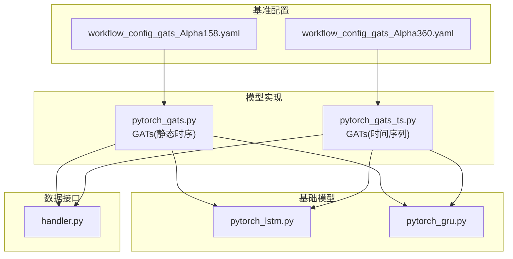
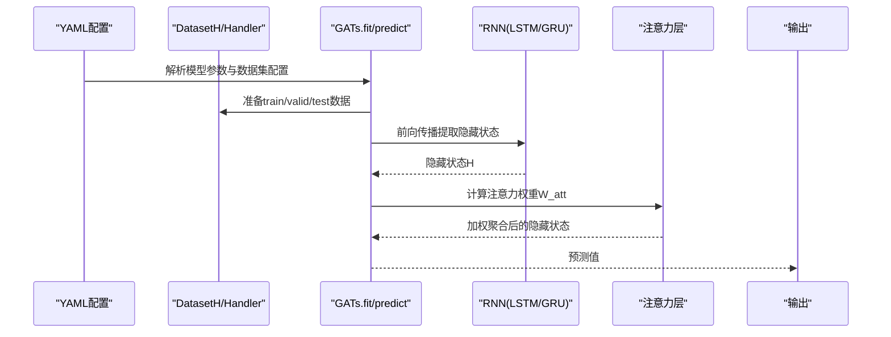
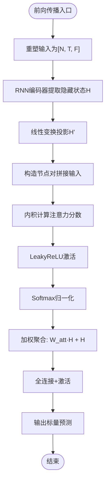
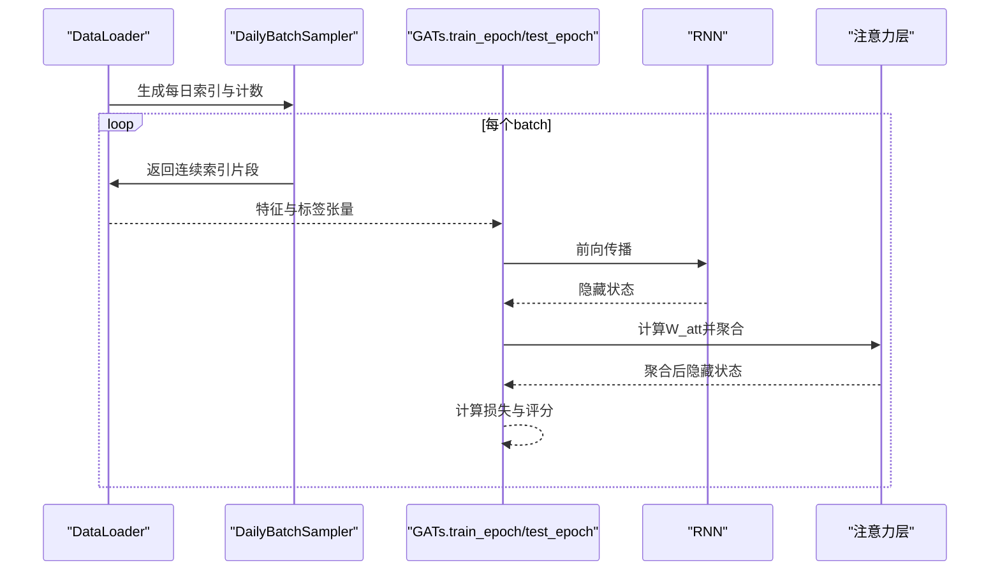
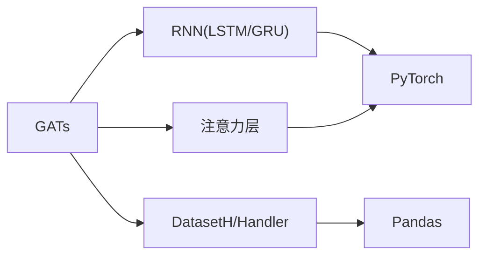

# GATs 基准模型

<cite>
**本文引用的文件列表**
- [README.md](file://examples/benchmarks/GATs/README.md)
- [workflow_config_gats_Alpha158.yaml](file://examples/benchmarks/GATs/workflow_config_gats_Alpha158.yaml)
- [workflow_config_gats_Alpha360.yaml](file://examples/benchmarks/GATs/workflow_config_gats_Alpha360.yaml)
- [pytorch_gats.py](file://qlib/contrib/model/pytorch_gats.py)
- [pytorch_gats_ts.py](file://qlib/contrib/model/pytorch_gats_ts.py)
- [pytorch_lstm.py](file://qlib/contrib/model/pytorch_lstm.py)
- [pytorch_gru.py](file://qlib/contrib/model/pytorch_gru.py)
- [handler.py](file://qlib/data/dataset/handler.py)
</cite>

## 目录
1. [简介](#简介)
2. [项目结构](#项目结构)
3. [核心组件](#核心组件)
4. [架构总览](#架构总览)
5. [详细组件分析](#详细组件分析)
6. [依赖分析](#依赖分析)
7. [性能考虑](#性能考虑)
8. [故障排查指南](#故障排查指南)
9. [结论](#结论)
10. [附录](#附录)

## 简介
本文件系统性阐述 Qlib 中 GATs（Graph Attention Networks）基准实现，重点解释其通过注意力机制学习股票间动态关系的能力。我们将从 YAML 配置入手，解析图构建方式、注意力头数、邻接矩阵更新策略等；随后结合 pytorch_gats.py 源码，深入分析注意力权重计算与图卷积过程；最后给出运行示例与图结构可视化方法，帮助理解模型如何捕捉市场结构变化。

## 项目结构
GATs 在 Qlib 的基准实现位于 examples/benchmarks/GATs 与 qlib/contrib/model 下：
- 配置文件：workflow_config_gats_Alpha158.yaml、workflow_config_gats_Alpha360.yaml
- 模型实现：pytorch_gats.py（静态时序输入）、pytorch_gats_ts.py（时间序列批输入）
- 基础模型：pytorch_lstm.py、pytorch_gru.py（作为预训练编码器）
- 数据接口：handler.py（数据处理器抽象）

图表来源
- [workflow_config_gats_Alpha158.yaml](file://examples/benchmarks/GATs/workflow_config_gats_Alpha158.yaml#L46-L97)
- [workflow_config_gats_Alpha360.yaml](file://examples/benchmarks/GATs/workflow_config_gats_Alpha360.yaml#L46-L89)
- [pytorch_gats.py](file://qlib/contrib/model/pytorch_gats.py#L26-L120)
- [pytorch_gats_ts.py](file://qlib/contrib/model/pytorch_gats_ts.py#L44-L160)
- [pytorch_lstm.py](file://qlib/contrib/model/pytorch_lstm.py#L24-L120)
- [pytorch_gru.py](file://qlib/contrib/model/pytorch_gru.py#L25-L130)
- [handler.py](file://qlib/data/dataset/handler.py#L26-L100)

章节来源
- [README.md](file://examples/benchmarks/GATs/README.md#L1-L5)
- [workflow_config_gats_Alpha158.yaml](file://examples/benchmarks/GATs/workflow_config_gats_Alpha158.yaml#L1-L97)
- [workflow_config_gats_Alpha360.yaml](file://examples/benchmarks/GATs/workflow_config_gats_Alpha360.yaml#L1-L89)

## 核心组件
- GATs 模型类：封装训练、验证、预测流程，支持预训练基础模型加载与早停。
- GATModel 子模块：包含 RNN 编码器（GRU/LSTM）与注意力层，负责特征提取与图注意力聚合。
- 数据集与处理器：DatasetH/Handler 提供特征与标签的组织与分段（train/valid/test）。
- 基础模型：LSTM/GRU 作为预训练编码器，用于初始化 GATs 的隐藏状态表示。

章节来源
- [pytorch_gats.py](file://qlib/contrib/model/pytorch_gats.py#L26-L120)
- [pytorch_gats_ts.py](file://qlib/contrib/model/pytorch_gats_ts.py#L44-L160)
- [pytorch_lstm.py](file://qlib/contrib/model/pytorch_lstm.py#L24-L120)
- [pytorch_gru.py](file://qlib/contrib/model/pytorch_gru.py#L25-L130)
- [handler.py](file://qlib/data/dataset/handler.py#L26-L100)

## 架构总览
下图展示了 GATs 在 Qlib 工作流中的整体交互：YAML 配置驱动模型实例化与数据准备，模型内部调用 RNN 编码器与注意力层进行特征聚合，最终输出预测信号并参与回测与记录。

图表来源
- [workflow_config_gats_Alpha158.yaml](file://examples/benchmarks/GATs/workflow_config_gats_Alpha158.yaml#L46-L97)
- [workflow_config_gats_Alpha360.yaml](file://examples/benchmarks/GATs/workflow_config_gats_Alpha360.yaml#L46-L89)
- [pytorch_gats.py](file://qlib/contrib/model/pytorch_gats.py#L224-L324)
- [pytorch_gats_ts.py](file://qlib/contrib/model/pytorch_gats_ts.py#L233-L335)
- [pytorch_lstm.py](file://qlib/contrib/model/pytorch_lstm.py#L112-L170)
- [pytorch_gru.py](file://qlib/contrib/model/pytorch_gru.py#L113-L178)

## 详细组件分析

### YAML 配置解析（Alpha158 与 Alpha360）
- 数据处理链路
  - 特征归一化与缺失处理：RobustZScoreNorm、Fillna、DropnaLabel、CSRankNorm 等。
  - 标签定义：使用相对价格变化作为标签。
- 模型参数
  - d_feat、hidden_size、num_layers、dropout、n_epochs、lr、early_stop、loss、metric、base_model、model_path、GPU 等。
- 数据集与分段
  - DatasetH/DatasetT（TS）分别对应静态特征与时间序列批输入。
  - 分段：train、valid、test 时间区间。
- 回测与记录
  - TopkDropoutStrategy 策略、账户规模、手续费与滑点设置。
  - SignalRecord、SigAnaRecord、PortAnaRecord 记录预测、IC 分析与组合分析结果。

章节来源
- [workflow_config_gats_Alpha158.yaml](file://examples/benchmarks/GATs/workflow_config_gats_Alpha158.yaml#L1-L97)
- [workflow_config_gats_Alpha360.yaml](file://examples/benchmarks/GATs/workflow_config_gats_Alpha360.yaml#L1-L89)

### 注意力权重计算与图卷积过程（pytorch_gats.py）
- RNN 编码器
  - 支持 GRU/LSTM，batch_first=True，输出最后一时刻的隐藏状态。
- 注意力层
  - 使用线性变换对隐藏状态进行投影，构造节点对拼接输入，经可学习参数 a 生成注意力分数，再经 LeakyReLU 与 Softmax 归一化得到权重矩阵 W_att。
- 图卷积聚合
  - 对隐藏状态进行加权求和并残差连接，随后经全连接与激活函数映射到标量输出。
- 训练与预测
  - fit 过程中按日打乱与分批训练，支持早停与最佳模型保存；predict 将测试集按日组织并逐日前向得到预测序列。

图表来源
- [pytorch_gats.py](file://qlib/contrib/model/pytorch_gats.py#L326-L385)

章节来源
- [pytorch_gats.py](file://qlib/contrib/model/pytorch_gats.py#L326-L385)

### 时间序列批输入版本（pytorch_gats_ts.py）
- 数据采样器
  - DailyBatchSampler 按日期聚合批次，保证同一天内的样本被一起处理，提升时间一致性。
- DataLoader
  - 使用自定义采样器与多进程加载，支持填充 NaN 的前后向填充策略。
- 训练循环
  - 从 DataLoader 取出 batch，取最后一时刻的特征与标签，前向计算损失并反向更新。
- 预测
  - 对测试集按日组织，逐批前向得到预测序列索引与数值。

图表来源
- [pytorch_gats_ts.py](file://qlib/contrib/model/pytorch_gats_ts.py#L26-L42)
- [pytorch_gats_ts.py](file://qlib/contrib/model/pytorch_gats_ts.py#L196-L231)
- [pytorch_gats_ts.py](file://qlib/contrib/model/pytorch_gats_ts.py#L233-L335)

章节来源
- [pytorch_gats_ts.py](file://qlib/contrib/model/pytorch_gats_ts.py#L26-L42)
- [pytorch_gats_ts.py](file://qlib/contrib/model/pytorch_gats_ts.py#L196-L231)
- [pytorch_gats_ts.py](file://qlib/contrib/model/pytorch_gats_ts.py#L233-L335)

### 基础模型（LSTM/GRU）与预训练加载
- GATs.fit 会根据 base_model 选择 LSTM 或 GRU，并加载预训练权重以初始化 GATModel 的对应层。
- 该设计使 GATs 能够复用预训练的时间序列表征能力，加速收敛并提升稳定性。

章节来源
- [pytorch_gats.py](file://qlib/contrib/model/pytorch_gats.py#L248-L267)
- [pytorch_gats_ts.py](file://qlib/contrib/model/pytorch_gats_ts.py#L262-L281)
- [pytorch_lstm.py](file://qlib/contrib/model/pytorch_lstm.py#L112-L170)
- [pytorch_gru.py](file://qlib/contrib/model/pytorch_gru.py#L113-L178)

## 依赖分析
- 组件耦合
  - GATs 依赖于基础模型（LSTM/GRU）与数据处理器（DatasetH/Handler），并通过预训练权重进行参数初始化。
  - 注意力层与 RNN 层紧密耦合，注意力权重直接作用于 RNN 输出的隐藏状态。
- 外部依赖
  - PyTorch 张量运算、优化器与 DataLoader。
  - Qlib 的数据管线（handler、dataset）与工作流记录（record_temp）。

图表来源
- [pytorch_gats.py](file://qlib/contrib/model/pytorch_gats.py#L224-L324)
- [pytorch_gats_ts.py](file://qlib/contrib/model/pytorch_gats_ts.py#L233-L335)
- [pytorch_lstm.py](file://qlib/contrib/model/pytorch_lstm.py#L112-L170)
- [pytorch_gru.py](file://qlib/contrib/model/pytorch_gru.py#L113-L178)
- [handler.py](file://qlib/data/dataset/handler.py#L26-L100)

章节来源
- [pytorch_gats.py](file://qlib/contrib/model/pytorch_gats.py#L224-L324)
- [pytorch_gats_ts.py](file://qlib/contrib/model/pytorch_gats_ts.py#L233-L335)
- [handler.py](file://qlib/data/dataset/handler.py#L26-L100)

## 性能考虑
- 批次与设备
  - 静态版本按日组织样本，时间序列版本使用 DailyBatchSampler 保持时间一致性；两者均支持 GPU 训练。
- 正则化与早停
  - dropout 与 early_stop 有助于缓解过拟合，提高泛化能力。
- 数据加载
  - 时间序列版本通过 DataLoader 与多进程加载提升吞吐；NaN 填充策略减少无效计算。
- 参数初始化
  - 预训练基础模型权重初始化可显著降低训练初期噪声，稳定收敛路径。

章节来源
- [pytorch_gats.py](file://qlib/contrib/model/pytorch_gats.py#L176-L223)
- [pytorch_gats_ts.py](file://qlib/contrib/model/pytorch_gats_ts.py#L196-L231)
- [pytorch_gats_ts.py](file://qlib/contrib/model/pytorch_gats_ts.py#L233-L335)

## 故障排查指南
- 空数据报错
  - 当数据集为空时会抛出异常，需检查数据范围、市场与标签定义是否正确。
- 设备与 GPU
  - 若未检测到可用 GPU，模型会退回到 CPU；请确认 GPU 可用与 CUDA 版本匹配。
- 预训练模型路径
  - model_path 必须指向正确的预训练权重文件，否则初始化失败或参数不匹配。
- 优化器与损失
  - 仅支持 adam 与 gd 优化器，loss 仅支持 mse；其他值会触发异常。

章节来源
- [pytorch_gats.py](file://qlib/contrib/model/pytorch_gats.py#L235-L240)
- [pytorch_gats_ts.py](file://qlib/contrib/model/pytorch_gats_ts.py#L241-L246)
- [pytorch_gats.py](file://qlib/contrib/model/pytorch_gats.py#L130-L136)
- [pytorch_gats_ts.py](file://qlib/contrib/model/pytorch_gats_ts.py#L150-L156)

## 结论
Qlib 的 GATs 基准实现通过 RNN 编码器提取股票时序特征，并以注意力机制对股票间的潜在关系进行动态建模。YAML 配置清晰地定义了数据处理、模型超参与评估流程；源码层面，注意力权重由隐藏状态的两两拼接与可学习参数共同决定，随后进行加权聚合与残差连接，形成稳定的图卷积过程。结合预训练 LSTM/GRU 权重初始化，模型在训练效率与稳定性方面表现良好。建议在实际部署中关注数据质量、设备配置与早停策略，以获得更稳健的预测性能。

## 附录

### 运行示例（基于 YAML）
- Alpha158 数据集
  - 使用 workflow_config_gats_Alpha158.yaml 启动基准任务，模型将加载预训练 LSTM/GRU 权重，按日组织训练并保存最佳模型。
- Alpha360 数据集
  - 使用 workflow_config_gats_Alpha360.yaml 启动基准任务，模型参数与数据集配置与 Alpha158 类似，但特征维度与预训练模型路径不同。

章节来源
- [workflow_config_gats_Alpha158.yaml](file://examples/benchmarks/GATs/workflow_config_gats_Alpha158.yaml#L46-L97)
- [workflow_config_gats_Alpha360.yaml](file://examples/benchmarks/GATs/workflow_config_gats_Alpha360.yaml#L46-L89)

### 图结构可视化方法（理解注意力权重）
- 获取注意力权重
  - 在 GATModel.forward 中，注意力权重 W_att 由 cal_attention 计算得到；可在训练或推理过程中导出该矩阵。
- 可视化步骤
  - 将 W_att 转换为邻接矩阵（如阈值化或归一化），使用网络可视化库绘制节点（股票）与边（注意力强度）。
  - 按时间窗口（如交易日）观察权重变化，识别热点板块与联动关系。
- 实践建议
  - 对权重进行归一化与平滑处理，避免噪声导致的误判。
  - 结合行业分类或概念矩阵，辅助解释权重的经济含义。

章节来源
- [pytorch_gats.py](file://qlib/contrib/model/pytorch_gats.py#L358-L385)
- [pytorch_gats_ts.py](file://qlib/contrib/model/pytorch_gats_ts.py#L370-L394)