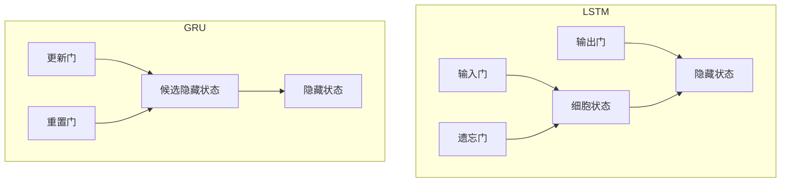
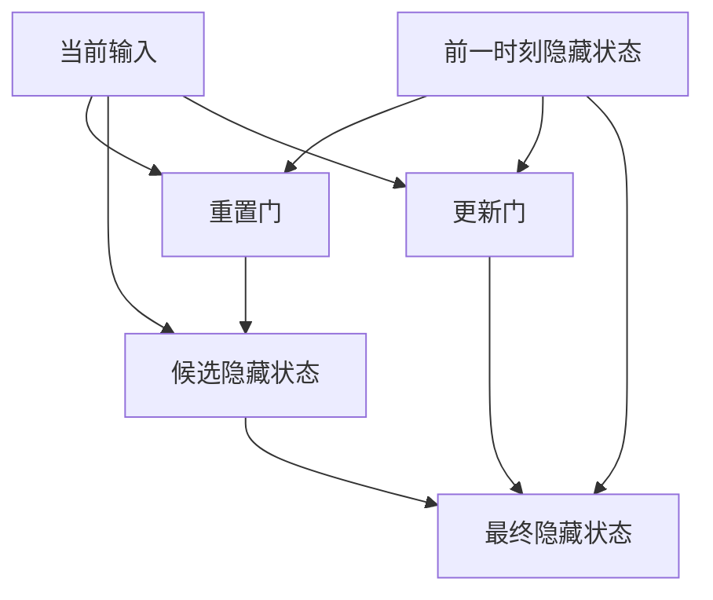

# GRU 基准模型

<cite>
**本文档中引用的文件**  
- [workflow_config_gru_Alpha158.yaml](file://examples/benchmarks/GRU/workflow_config_gru_Alpha158.yaml)
- [workflow_config_gru_Alpha360.yaml](file://examples/benchmarks/GRU/workflow_config_gru_Alpha360.yaml)
- [workflow_config_lstm_Alpha158.yaml](file://examples/benchmarks/LSTM/workflow_config_lstm_Alpha158.yaml)
- [workflow_config_lstm_Alpha360.yaml](file://examples/benchmarks/LSTM/workflow_config_lstm_Alpha360.yaml)
- [pytorch_gru.py](file://qlib/contrib/model/pytorch_gru.py)
- [pytorch_lstm.py](file://qlib/contrib/model/pytorch_lstm.py)
- [pytorch_gru_ts.py](file://qlib/contrib/model/pytorch_gru_ts.py)
- [pytorch_lstm_ts.py](file://qlib/contrib/model/pytorch_lstm_ts.py)
- [handler.py](file://qlib/contrib/data/handler.py)
- [loader.py](file://qlib/contrib/data/loader.py)
</cite>

## 目录
1. [引言](#引言)
2. [GRU与LSTM结构对比](#gru与lstm结构对比)
3. [YAML配置文件解析](#yaml配置文件解析)
4. [Alpha因子体系下的训练与评估流程](#alpha因子体系下的训练与评估流程)
5. [门控机制实现细节分析](#门控机制实现细节分析)
6. [运行命令与参数说明](#运行命令与参数说明)
7. [中间层输出提取与特征分析](#中间层输出提取与特征分析)
8. [高频数据处理适用性与优化方向](#高频数据处理适用性与优化方向)
9. [结论](#结论)

## 引言
GRU（门控循环单元）模型在Qlib中作为基准模型之一，广泛应用于金融时间序列预测任务。本文档详细阐述GRU模型在Qlib中的基准应用，对比其与LSTM在结构和性能上的异同。通过解析YAML配置文件，说明其在不同Alpha因子体系下的训练与评估流程，并结合源码分析门控机制的实现细节。同时提供完整的运行命令与参数说明，展示如何提取中间层输出用于特征分析，并讨论GRU在高频数据处理中的适用性及潜在优化方向。

## GRU与LSTM结构对比
GRU和LSTM都是循环神经网络（RNN）的变体，旨在解决传统RNN在处理长序列时的梯度消失问题。两者都通过引入门控机制来控制信息流动，但在结构上存在显著差异。

### 结构差异
LSTM包含三个门：输入门、遗忘门和输出门，以及一个细胞状态。这些门共同作用以决定哪些信息被保留、更新或输出。相比之下，GRU将输入门和遗忘门合并为一个更新门，并引入重置门来控制前一时刻隐藏状态的影响程度。这种简化使得GRU具有更少的参数和更快的训练速度。

### 性能差异
在Qlib的实现中，GRU和LSTM均使用相同的超参数设置进行比较，如隐藏层大小、层数和学习率等。实验结果表明，在某些任务上，GRU由于其简化的结构能够达到与LSTM相当甚至更好的性能，尤其是在数据量较小的情况下。然而，在需要捕捉非常长期依赖关系的任务中，LSTM可能表现得更为稳健。



**图示来源**
- [pytorch_gru.py](file://qlib/contrib/model/pytorch_gru.py#L319-L340)
- [pytorch_lstm.py](file://qlib/contrib/model/pytorch_lstm.py#L286-L307)

**本节来源**
- [pytorch_gru.py](file://qlib/contrib/model/pytorch_gru.py)
- [pytorch_lstm.py](file://qlib/contrib/model/pytorch_lstm.py)

## YAML配置文件解析
YAML配置文件是Qlib中定义模型训练和评估流程的核心。对于GRU模型，主要的配置文件包括`workflow_config_gru_Alpha158.yaml`和`workflow_config_gru_Alpha360.yaml`，分别对应不同的Alpha因子体系。

### 配置文件结构
配置文件主要包括以下几个部分：
- `qlib_init`：初始化Qlib环境，指定数据路径和区域。
- `data_handler_config`：定义数据处理器的配置，包括时间范围、市场和基准。
- `task`：定义任务的具体配置，包括模型、数据集和记录器。

### 关键参数说明
- `d_feat`：输入特征维度，Alpha158为20，Alpha360为6。
- `hidden_size`：隐藏层大小，通常设置为64。
- `num_layers`：网络层数，通常设置为2。
- `dropout`：dropout比率，用于防止过拟合。
- `n_epochs`：训练轮数，通常设置为200。
- `lr`：学习率，Alpha158为2e-4，Alpha360为1e-3。
- `early_stop`：早停机制的耐心值，Alpha158为10，Alpha360为20。
- `batch_size`：批量大小，通常设置为800。
- `GPU`：使用的GPU ID，通常设置为0。

**本节来源**
- [workflow_config_gru_Alpha158.yaml](file://examples/benchmarks/GRU/workflow_config_gru_Alpha158.yaml)
- [workflow_config_gru_Alpha360.yaml](file://examples/benchmarks/GRU/workflow_config_gru_Alpha360.yaml)

## Alpha因子体系下的训练与评估流程
在Qlib中，GRU模型的训练与评估流程遵循标准的机器学习工作流，包括数据准备、模型训练、验证和测试。

### 数据准备
数据准备阶段涉及从原始数据中提取特征和标签。Alpha158和Alpha360分别提供了158个和360个技术指标作为特征。数据处理器会根据配置文件中的`data_handler_config`进行预处理，包括缺失值填充、标准化等操作。

### 模型训练
模型训练阶段使用配置文件中定义的超参数进行。训练过程中，模型会在训练集上进行多轮迭代，每轮迭代后在验证集上评估性能。如果验证集上的性能在连续若干轮内没有提升，则触发早停机制。

### 评估流程
评估流程包括信号生成、回测和绩效分析。信号生成器利用训练好的模型对测试集进行预测，生成交易信号。回测引擎根据这些信号模拟交易过程，计算投资组合的收益。最后，绩效分析模块对回测结果进行统计分析，生成各种绩效指标。

**本节来源**
- [workflow_config_gru_Alpha158.yaml](file://examples/benchmarks/GRU/workflow_config_gru_Alpha158.yaml)
- [workflow_config_gru_Alpha360.yaml](file://examples/benchmarks/GRU/workflow_config_gru_Alpha360.yaml)
- [pytorch_gru.py](file://qlib/contrib/model/pytorch_gru.py)

## 门控机制实现细节分析
GRU的门控机制是其核心组成部分，负责控制信息的流动。在Qlib的实现中，门控机制通过PyTorch的`nn.GRU`模块实现。

### 更新门
更新门决定了前一时刻的隐藏状态有多少信息被保留到当前时刻。它通过一个sigmoid函数计算，输出值在0到1之间。当更新门接近1时，表示前一时刻的隐藏状态被完全保留；当接近0时，表示前一时刻的隐藏状态被完全丢弃。

### 重置门
重置门控制前一时刻的隐藏状态对当前候选隐藏状态的影响程度。它同样通过一个sigmoid函数计算，输出值在0到1之间。当重置门接近1时，前一时刻的隐藏状态对当前候选隐藏状态有较大影响；当接近0时，影响较小。

### 候选隐藏状态
候选隐藏状态是基于当前输入和经过重置门调整后的前一时刻隐藏状态计算得到的。它通过一个tanh函数激活，确保输出值在-1到1之间。

### 最终隐藏状态
最终隐藏状态由更新门和候选隐藏状态共同决定。具体来说，它是更新门与前一时刻隐藏状态的加权和加上(1-更新门)与候选隐藏状态的加权和。



**图示来源**
- [pytorch_gru.py](file://qlib/contrib/model/pytorch_gru.py#L319-L340)

**本节来源**
- [pytorch_gru.py](file://qlib/contrib/model/pytorch_gru.py)

## 运行命令与参数说明
在Qlib中运行GRU模型需要使用`qrun`命令，并指定相应的配置文件。以下是运行GRU模型的基本命令和参数说明。

### 基本命令
```bash
qrun examples/benchmarks/GRU/workflow_config_gru_Alpha158.yaml
```

### 参数说明
- `provider_uri`：数据提供者的URI，通常指向本地数据存储路径。
- `region`：市场区域，如`cn`表示中国市场。
- `market`：目标市场，如`csi300`表示沪深300指数成分股。
- `benchmark`：基准指数，如`SH000300`表示上证指数。
- `model.class`：模型类名，如`GRU`。
- `model.module_path`：模型模块路径，如`qlib.contrib.model.pytorch_gru_ts`。
- `model.kwargs.d_feat`：输入特征维度。
- `model.kwargs.hidden_size`：隐藏层大小。
- `model.kwargs.num_layers`：网络层数。
- `model.kwargs.dropout`：dropout比率。
- `model.kwargs.n_epochs`：训练轮数。
- `model.kwargs.lr`：学习率。
- `model.kwargs.early_stop`：早停机制的耐心值。
- `model.kwargs.batch_size`：批量大小。
- `model.kwargs.GPU`：使用的GPU ID。

**本节来源**
- [workflow_config_gru_Alpha158.yaml](file://examples/benchmarks/GRU/workflow_config_gru_Alpha158.yaml)
- [workflow_config_gru_Alpha360.yaml](file://examples/benchmarks/GRU/workflow_config_gru_Alpha360.yaml)

## 中间层输出提取与特征分析
在某些情况下，了解模型内部的中间层输出对于特征分析和模型调试非常重要。Qlib提供了灵活的接口来提取这些中间层输出。

### 提取方法
可以通过修改模型的`forward`方法，在关键节点添加钩子（hook）来捕获中间层输出。例如，在`GRUModel`类的`forward`方法中，可以在`self.rnn`调用前后添加钩子，以捕获输入和输出张量。

### 特征分析
提取的中间层输出可以用于进一步的特征分析，如可视化隐藏状态的变化趋势、分析不同时间步之间的相关性等。这些分析有助于理解模型如何处理输入序列，并识别潜在的问题或改进点。

**本节来源**
- [pytorch_gru.py](file://qlib/contrib/model/pytorch_gru.py)

## 高频数据处理适用性与优化方向
GRU模型在处理高频数据方面表现出良好的适用性，但仍有进一步优化的空间。

### 适用性
高频数据通常具有较高的噪声和较短的时间间隔，这对模型的鲁棒性和计算效率提出了更高要求。GRU由于其简化的结构和较少的参数，能够在保持较高性能的同时减少计算开销，适合处理高频数据。

### 潜在优化方向
- **注意力机制**：引入注意力机制可以帮助模型更好地关注重要的时间步，提高对关键信息的敏感度。
- **多尺度建模**：结合不同时间尺度的信息，如分钟级和小时级数据，可以增强模型的泛化能力。
- **正则化技术**：采用更先进的正则化技术，如DropConnect或Zoneout，可以进一步提高模型的稳定性。
- **并行计算**：利用GPU的并行计算能力，优化数据加载和模型训练过程，提高整体效率。

**本节来源**
- [pytorch_gru.py](file://qlib/contrib/model/pytorch_gru.py)
- [pytorch_gru_ts.py](file://qlib/contrib/model/pytorch_gru_ts.py)

## 结论
GRU模型在Qlib中作为基准模型之一，展示了其在金融时间序列预测任务中的强大能力。通过与LSTM的对比，可以看出GRU在结构上的简化带来了更快的训练速度和更低的计算成本，同时在多数任务上仍能保持竞争力。YAML配置文件的灵活性使得用户可以轻松地调整模型参数和训练流程。通过对门控机制的深入分析，我们理解了GRU如何有效地控制信息流动。此外，提取中间层输出的能力为特征分析和模型调试提供了有力支持。未来的工作可以探索引入注意力机制、多尺度建模等技术，进一步提升GRU在高频数据处理中的性能。