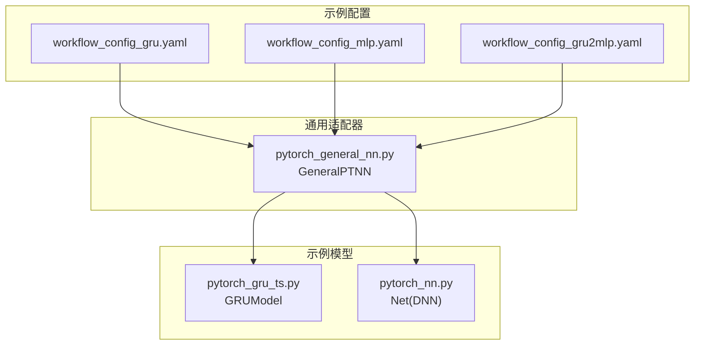
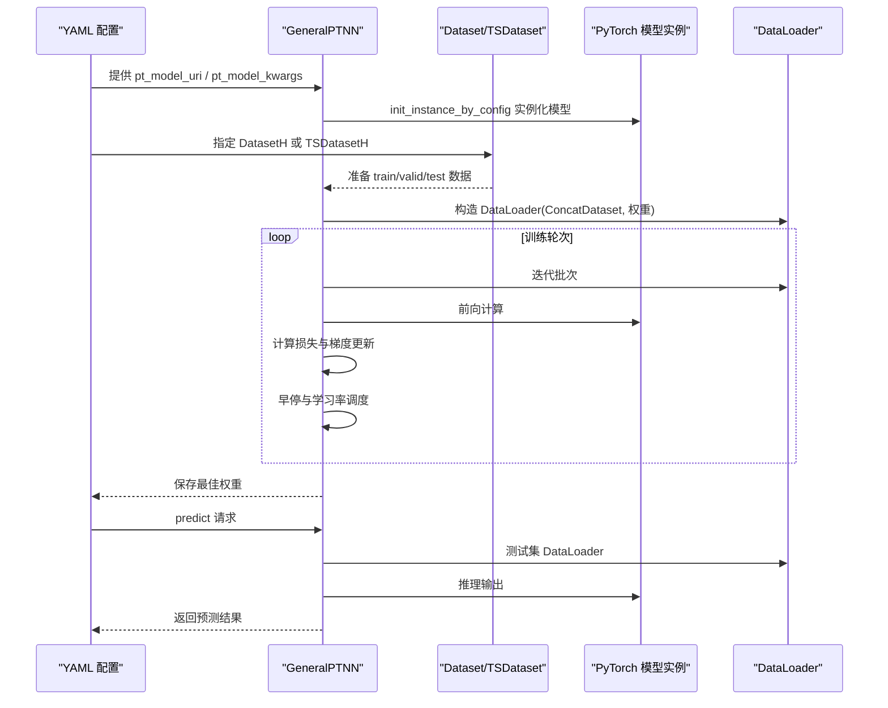
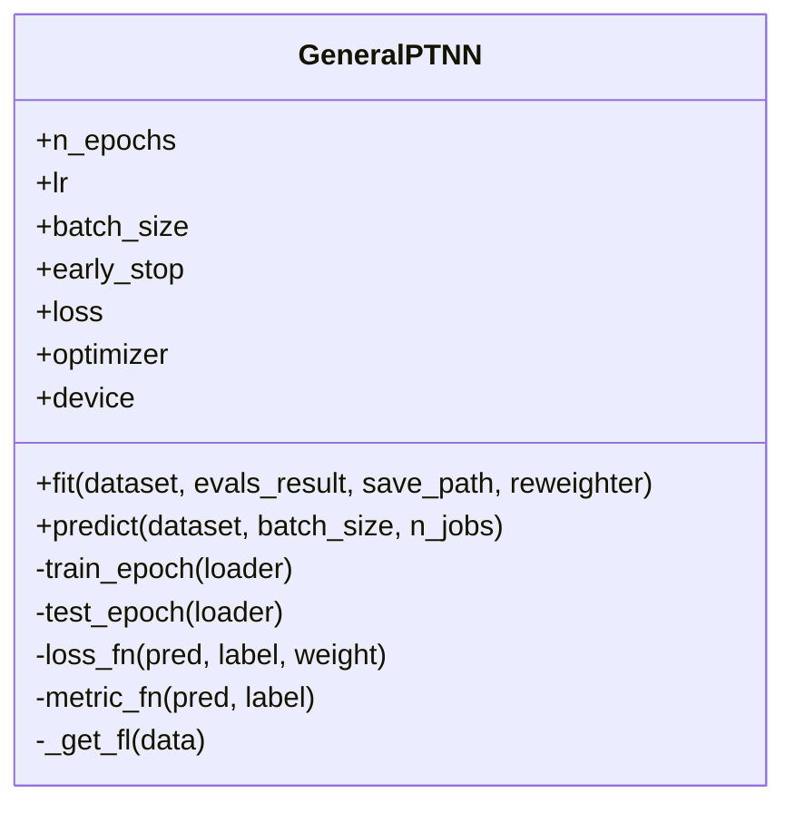
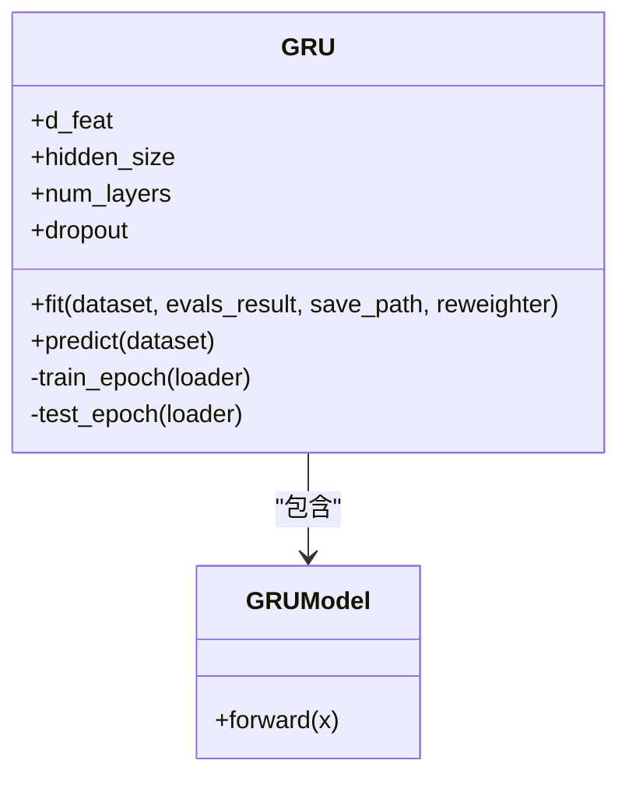
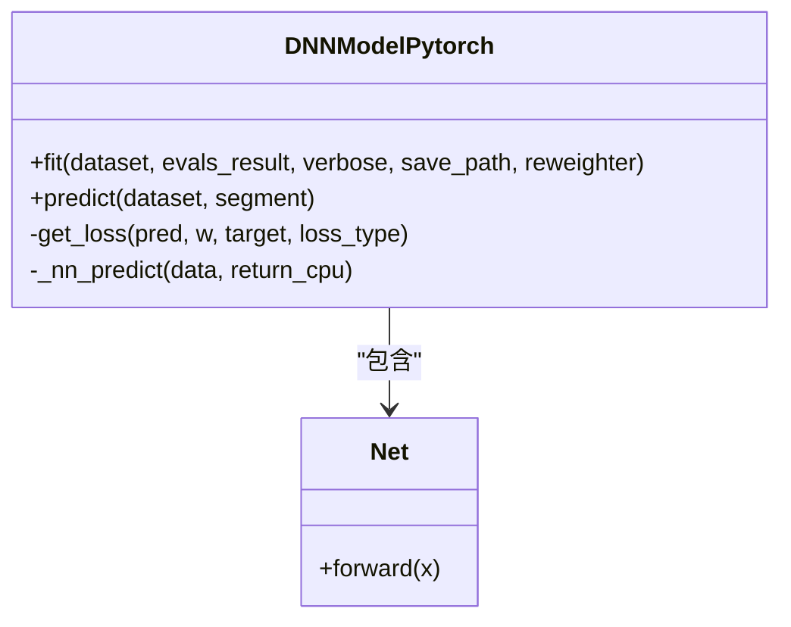
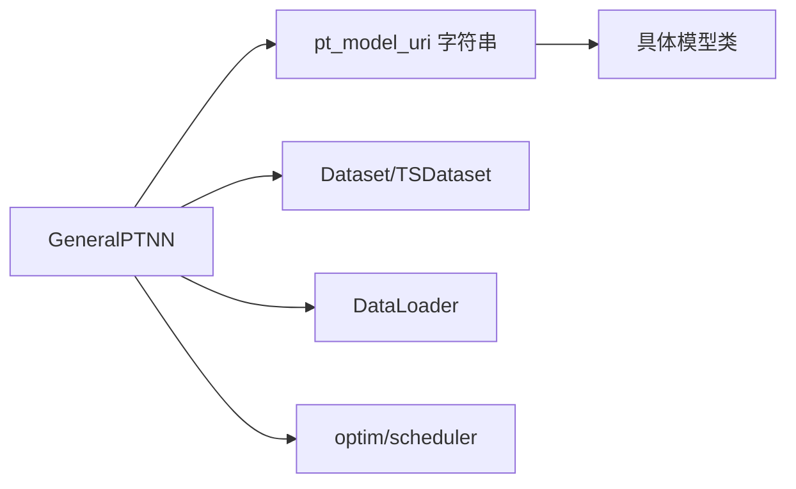

# GeneralPtNN 基准模型

<cite>
**本文引用的文件列表**
- [pytorch_general_nn.py](file://qlib/contrib/model/pytorch_general_nn.py)
- [pytorch_gru_ts.py](file://qlib/contrib/model/pytorch_gru_ts.py)
- [pytorch_nn.py](file://qlib/contrib/model/pytorch_nn.py)
- [workflow_config_gru.yaml](file://examples/benchmarks/GeneralPtNN/workflow_config_gru.yaml)
- [workflow_config_mlp.yaml](file://examples/benchmarks/GeneralPtNN/workflow_config_mlp.yaml)
- [workflow_config_gru2mlp.yaml](file://examples/benchmarks/GeneralPtNN/workflow_config_gru2mlp.yaml)
- [README.md](file://examples/benchmarks/GeneralPtNN/README.md)
- [test_general_nn.py](file://tests/model/test_general_nn.py)
</cite>

## 目录
1. [简介](#简介)
2. [项目结构](#项目结构)
3. [核心组件](#核心组件)
4. [架构总览](#架构总览)
5. [详细组件分析](#详细组件分析)
6. [依赖关系分析](#依赖关系分析)
7. [性能考量](#性能考量)
8. [故障排查指南](#故障排查指南)
9. [结论](#结论)
10. [附录](#附录)

## 简介
本文件系统化介绍 Qlib 中的 GeneralPtNN（General PyTorch Neural Network）通用神经网络适配器在基准实验中的应用。它通过统一的训练与预测流程，将任意 PyTorch 模型以“可插拔”的方式接入 Qlib 的数据集与工作流，从而支持时间序列与表格两类数据形态。本文围绕三种 YAML 配置（GRU、MLP、GRU2MLP）解析不同网络拓扑的定义方式，并结合源码分析 GeneralPTNN 在模型构建上的灵活性与扩展性，帮助研究人员快速验证新架构，尤其适用于原型设计阶段的快速迭代与对比。

## 项目结构
GeneralPtNN 及其示例配置位于以下路径：
- 通用适配器：qlib/contrib/model/pytorch_general_nn.py
- 示例模型实现：
  - 时间序列 GRU：qlib/contrib/model/pytorch_gru_ts.py
  - 表格 MLP：qlib/contrib/model/pytorch_nn.py
- 示例 YAML 配置：
  - GRU：examples/benchmarks/GeneralPtNN/workflow_config_gru.yaml
  - MLP：examples/benchmarks/GeneralPtNN/workflow_config_mlp.yaml
  - GRU 转 MLP（时序到表）：examples/benchmarks/GeneralPtNN/workflow_config_gru2mlp.yaml
- 测试用例：tests/model/test_general_nn.py
- 示例说明：examples/benchmarks/GeneralPtNN/README.md

图表来源
- [pytorch_general_nn.py](file://qlib/contrib/model/pytorch_general_nn.py#L1-L372)
- [pytorch_gru_ts.py](file://qlib/contrib/model/pytorch_gru_ts.py#L300-L320)
- [pytorch_nn.py](file://qlib/contrib/model/pytorch_nn.py#L425-L463)
- [workflow_config_gru.yaml](file://examples/benchmarks/GeneralPtNN/workflow_config_gru.yaml#L54-L73)
- [workflow_config_mlp.yaml](file://examples/benchmarks/GeneralPtNN/workflow_config_mlp.yaml#L59-L71)
- [workflow_config_gru2mlp.yaml](file://examples/benchmarks/GeneralPtNN/workflow_config_gru2mlp.yaml#L54-L66)

章节来源
- [README.md](file://examples/benchmarks/GeneralPtNN/README.md#L1-L20)

## 核心组件
- GeneralPTNN（通用适配器）
  - 统一训练/评估/早停/学习率调度流程，支持时间序列与表格两类数据输入。
  - 通过参数 pt_model_uri 与 pt_model_kwargs 动态实例化任意 PyTorch 模型类。
  - 内置损失函数与指标接口，支持权重样本与 NaN 处理。
- 示例模型
  - GRUModel（时间序列）：基于 GRU 的时序特征提取 + 全连接输出。
  - Net（MLP/DNN）：可配置层数与激活的多层感知机。

章节来源
- [pytorch_general_nn.py](file://qlib/contrib/model/pytorch_general_nn.py#L33-L125)
- [pytorch_gru_ts.py](file://qlib/contrib/model/pytorch_gru_ts.py#L300-L320)
- [pytorch_nn.py](file://qlib/contrib/model/pytorch_nn.py#L425-L463)

## 架构总览
GeneralPtNN 将“模型实例化”与“训练流程”解耦：训练流程由适配器统一管理，模型类由外部传入。YAML 配置决定数据集类型、处理器、模型类与超参，从而实现“换模型如换参数”。

图表来源
- [pytorch_general_nn.py](file://qlib/contrib/model/pytorch_general_nn.py#L235-L372)
- [workflow_config_gru.yaml](file://examples/benchmarks/GeneralPtNN/workflow_config_gru.yaml#L54-L101)
- [workflow_config_mlp.yaml](file://examples/benchmarks/GeneralPtNN/workflow_config_mlp.yaml#L59-L99)
- [workflow_config_gru2mlp.yaml](file://examples/benchmarks/GeneralPtNN/workflow_config_gru2mlp.yaml#L54-L94)

## 详细组件分析

### GeneralPTNN 类与训练流程
- 关键职责
  - 参数解析与设备选择（CPU/GPU）
  - 优化器与学习率调度器初始化
  - 数据加载与批处理（支持权重样本）
  - 训练/验证循环、早停、保存最优参数
  - 预测阶段的数据准备与输出格式化
- 数据适配
  - 时间序列：特征维度为 [B, T, F]，标签取最后一步；表格：特征维度为 [B, F]。
  - 支持缺失值填充策略与权重样本。
- 损失与指标
  - 当前仅支持均方误差损失；指标默认使用损失值。
- 扩展点
  - 通过 pt_model_uri 与 pt_model_kwargs 插拔任意 PyTorch 模型。
  - 可替换损失函数与指标函数以适配任务类型。

图表来源
- [pytorch_general_nn.py](file://qlib/contrib/model/pytorch_general_nn.py#L33-L372)

章节来源
- [pytorch_general_nn.py](file://qlib/contrib/model/pytorch_general_nn.py#L133-L173)
- [pytorch_general_nn.py](file://qlib/contrib/model/pytorch_general_nn.py#L174-L201)
- [pytorch_general_nn.py](file://qlib/contrib/model/pytorch_general_nn.py#L202-L234)
- [pytorch_general_nn.py](file://qlib/contrib/model/pytorch_general_nn.py#L235-L334)
- [pytorch_general_nn.py](file://qlib/contrib/model/pytorch_general_nn.py#L334-L372)

### GRU（时间序列）模型
- 结构要点
  - 使用 GRU 对时序特征进行编码，取最后一个时刻的隐藏状态经全连接层输出标量。
  - 适合时间窗口长度固定的场景。
- 训练流程
  - 严格按时间维切片，标签取最后一步；支持早停与学习率调度。
- 适用场景
  - Alpha158 等时序特征的相对回报预测任务。

图表来源
- [pytorch_gru_ts.py](file://qlib/contrib/model/pytorch_gru_ts.py#L26-L136)
- [pytorch_gru_ts.py](file://qlib/contrib/model/pytorch_gru_ts.py#L302-L320)

章节来源
- [pytorch_gru_ts.py](file://qlib/contrib/model/pytorch_gru_ts.py#L137-L163)
- [pytorch_gru_ts.py](file://qlib/contrib/model/pytorch_gru_ts.py#L164-L199)
- [pytorch_gru_ts.py](file://qlib/contrib/model/pytorch_gru_ts.py#L200-L280)
- [pytorch_gru_ts.py](file://qlib/contrib/model/pytorch_gru_ts.py#L281-L300)

### MLP（表格）模型
- 结构要点
  - Net 为可配置深度与宽度的全连接网络，支持 Dropout/BatchNorm/激活等模块组合。
  - 适合静态特征的回归或分类任务。
- 训练流程
  - 支持权重样本与多种损失（当前示例使用均方误差）。
- 适用场景
  - Alpha158 等静态特征的信号预测任务。

图表来源
- [pytorch_nn.py](file://qlib/contrib/model/pytorch_nn.py#L38-L184)
- [pytorch_nn.py](file://qlib/contrib/model/pytorch_nn.py#L425-L463)

章节来源
- [pytorch_nn.py](file://qlib/contrib/model/pytorch_nn.py#L185-L336)
- [pytorch_nn.py](file://qlib/contrib/model/pytorch_nn.py#L337-L387)
- [pytorch_nn.py](file://qlib/contrib/model/pytorch_nn.py#L425-L463)

### YAML 配置解析与网络拓扑定义

#### GRU 配置（workflow_config_gru.yaml）
- 数据集与处理器
  - 使用 TSDatasetH，时间窗口长度由 step_len 指定；特征/标签预处理包括列过滤、归一化与填充。
- 模型与超参
  - pt_model_uri 指向 GRUModel；pt_model_kwargs 定义 d_feat、hidden_size、num_layers、dropout 等。
  - 训练超参：n_epochs、lr、batch_size、early_stop、loss、n_jobs、GPU 等。
- 任务记录
  - 包含 SignalRecord、SigAnaRecord、PortAnaRecord，用于信号与组合分析。

章节来源
- [workflow_config_gru.yaml](file://examples/benchmarks/GeneralPtNN/workflow_config_gru.yaml#L1-L101)

#### MLP 配置（workflow_config_mlp.yaml）
- 数据集与处理器
  - 使用 DatasetH，特征/标签预处理包含列删除、缺失值填充与标准化。
- 模型与超参
  - pt_model_uri 指向 Net；pt_model_kwargs 定义 input_dim。
  - 训练超参：lr、batch_size、loss、weight_decay、optimizer 等。
- 任务记录
  - 同样包含信号与组合分析记录。

章节来源
- [workflow_config_mlp.yaml](file://examples/benchmarks/GeneralPtNN/workflow_config_mlp.yaml#L1-L99)

#### GRU2MLP 配置（workflow_config_gru2mlp.yaml）
- 数据集与处理器
  - 使用 DatasetH，特征/标签预处理与 MLP 类似。
- 模型与超参
  - pt_model_uri 指向 Net；pt_model_kwargs 定义 input_dim 与 layers。
  - 训练超参：lr、n_epochs、batch_size、loss、optimizer 等。
- 说明
  - 该配置展示了从时间序列到表格数据的最小改动迁移路径：仅需更换数据集类与模型类。

章节来源
- [workflow_config_gru2mlp.yaml](file://examples/benchmarks/GeneralPtNN/workflow_config_gru2mlp.yaml#L1-L94)

### 自定义网络结构的配置方法
- 步骤
  - 实现一个继承自 torch.nn.Module 的模型类（例如 Net 的风格）。
  - 在 YAML 中设置：
    - pt_model_uri：指向你的模型类路径（字符串形式）。
    - pt_model_kwargs：传递给模型类的构造参数（如 input_dim、layers 等）。
  - 如需替换损失/指标，可在适配器中扩展 loss_fn/metric_fn 或通过参数注入。
- 注意事项
  - 输入张量维度需与数据集类型匹配：时间序列 [B, T, F]，表格 [B, F]。
  - 若模型需要额外预处理或后处理，建议在数据处理器或模型内部完成，避免破坏适配器统一流程。

章节来源
- [pytorch_general_nn.py](file://qlib/contrib/model/pytorch_general_nn.py#L90-L125)
- [pytorch_general_nn.py](file://qlib/contrib/model/pytorch_general_nn.py#L151-L173)
- [pytorch_nn.py](file://qlib/contrib/model/pytorch_nn.py#L425-L463)

## 依赖关系分析
- 适配器对模型的依赖是“运行时注入”，通过字符串类路径与 kwargs 解析，降低编译期耦合。
- 数据集接口统一：DatasetH 与 TSDatasetH 提供 prepare/get_index 等一致方法，适配器内部根据维度自动区分时序/表格。
- 外部依赖
  - torch、torch.nn、torch.optim、torch.utils.data
  - Qlib 的 Dataset、DataHandlerLP、Reweighter、ConcatDataset 等工具

图表来源
- [pytorch_general_nn.py](file://qlib/contrib/model/pytorch_general_nn.py#L90-L125)
- [pytorch_general_nn.py](file://qlib/contrib/model/pytorch_general_nn.py#L235-L334)

章节来源
- [pytorch_general_nn.py](file://qlib/contrib/model/pytorch_general_nn.py#L235-L334)

## 性能考量
- 训练稳定性
  - 梯度裁剪（固定阈值）有助于缓解梯度爆炸问题。
  - 学习率调度采用 ReduceLROnPlateau，按验证指标调整。
- 数据加载
  - DataLoader 的 num_workers 与 batch_size 需结合显存与 CPU 资源调优。
  - 时序数据建议使用 fillna_type 处理 NaN，避免训练不稳定。
- 模型规模
  - 可通过 count_parameters 输出模型参数量，辅助选择合适规模。
- 早停策略
  - early_stop 控制收敛速度与过拟合风险，应结合任务与数据规模合理设置。

章节来源
- [pytorch_general_nn.py](file://qlib/contrib/model/pytorch_general_nn.py#L202-L234)
- [pytorch_general_nn.py](file://qlib/contrib/model/pytorch_general_nn.py#L285-L334)

## 故障排查指南
- 常见错误与定位
  - “空数据”：当数据集为空时会抛出异常，检查数据段划分与处理器配置。
  - “不支持的重采样器类型”：reweighter 必须为 Reweighter 或 None。
  - “未拟合模型”：预测前必须先 fit。
  - “未知损失/指标”：当前仅支持 mse 与 loss 指标。
  - “数据形状不支持”：确保输入维度符合适配器预期（时序 [B,T,F]，表格 [B,F]）。
- 建议排查步骤
  - 检查 YAML 中 pt_model_uri 是否正确，pt_model_kwargs 是否与模型构造函数一致。
  - 检查数据集类型（DatasetH vs TSDatasetH）与特征维度是否匹配。
  - 查看日志输出，确认 device 与 GPU 可用性。
  - 使用测试用例验证适配器对时序与表格数据的支持。

章节来源
- [pytorch_general_nn.py](file://qlib/contrib/model/pytorch_general_nn.py#L248-L259)
- [pytorch_general_nn.py](file://qlib/contrib/model/pytorch_general_nn.py#L334-L341)
- [pytorch_general_nn.py](file://qlib/contrib/model/pytorch_general_nn.py#L151-L173)
- [pytorch_general_nn.py](file://qlib/contrib/model/pytorch_general_nn.py#L190-L200)
- [test_general_nn.py](file://tests/model/test_general_nn.py#L1-L81)

## 结论
GeneralPtNN 通过“适配器 + 可插拔模型”的架构，显著提升了 Qlib 中神经网络实验的灵活性与扩展性。借助三种 YAML 配置，用户可以快速切换时间序列与表格两类网络拓扑，并在原型设计阶段高效验证新架构。配合统一的数据集接口与训练流程，GeneralPtNN 成为研究者在 Qlib 生态中进行神经网络基准实验的理想平台。

## 附录

### YAML 配置字段说明（节选）
- 通用字段
  - model.class/model.module_path：指定 GeneralPTNN 及其模块路径
  - model.kwargs.pt_model_uri：模型类路径字符串
  - model.kwargs.pt_model_kwargs：模型构造参数字典
  - dataset.class/dataset.module_path：数据集类与模块路径
  - dataset.kwargs.segments：训练/验证/测试划分
  - dataset.kwargs.step_len：时序窗口长度（仅 TSDatasetH）
- GRU 配置特有
  - pt_model_kwargs.d_feat、hidden_size、num_layers、dropout
- MLP 配置特有
  - pt_model_kwargs.input_dim、layers（可选）

章节来源
- [workflow_config_gru.yaml](file://examples/benchmarks/GeneralPtNN/workflow_config_gru.yaml#L54-L86)
- [workflow_config_mlp.yaml](file://examples/benchmarks/GeneralPtNN/workflow_config_mlp.yaml#L59-L84)
- [workflow_config_gru2mlp.yaml](file://examples/benchmarks/GeneralPtNN/workflow_config_gru2mlp.yaml#L54-L79)