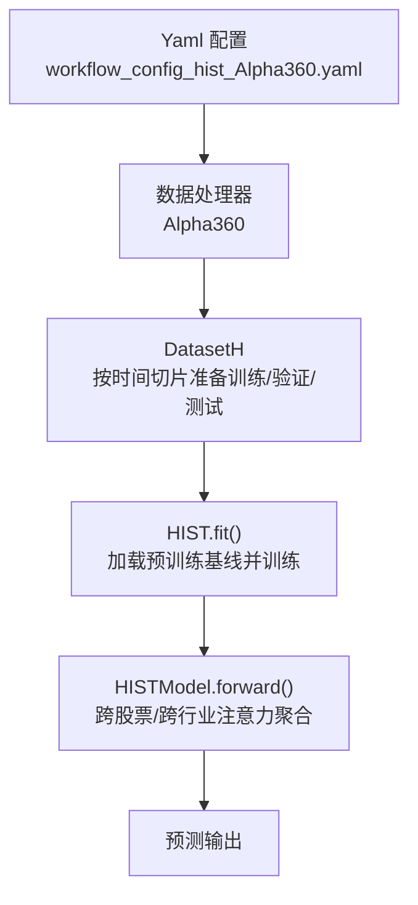
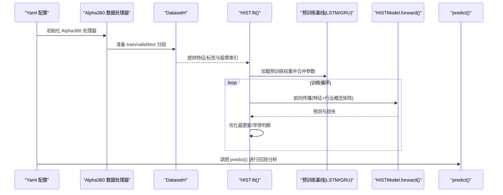
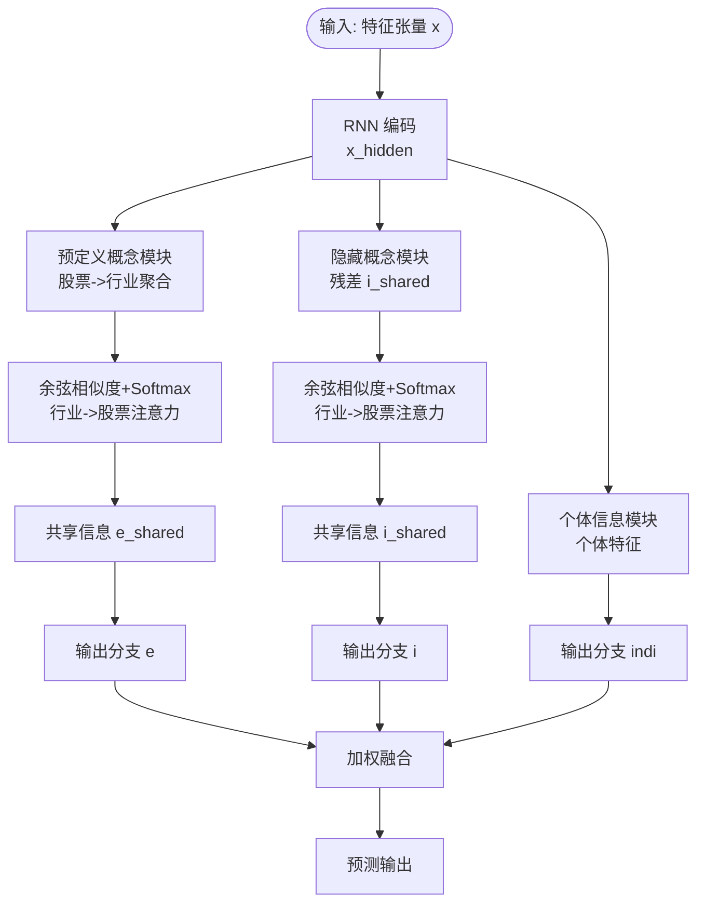
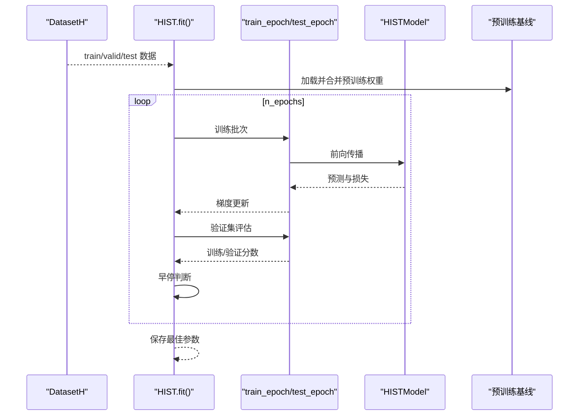
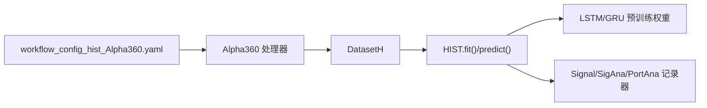

# HIST 基准模型

<cite>
**本文引用的文件列表**
- [workflow_config_hist_Alpha360.yaml](file://examples/benchmarks/HIST/workflow_config_hist_Alpha360.yaml)
- [pytorch_hist.py](file://qlib/contrib/model/pytorch_hist.py)
- [pytorch_lstm.py](file://qlib/contrib/model/pytorch_lstm.py)
- [pytorch_gru.py](file://qlib/contrib/model/pytorch_gru.py)
- [README.md](file://examples/benchmarks/HIST/README.md)
- [handler.py](file://qlib/contrib/data/handler.py)
- [dataset.py](file://qlib/data/dataset/__init__.py)
</cite>

## 目录
1. [简介](#简介)
2. [项目结构](#项目结构)
3. [核心组件](#核心组件)
4. [架构总览](#架构总览)
5. [详细组件分析](#详细组件分析)
6. [依赖关系分析](#依赖关系分析)
7. [性能考量](#性能考量)
8. [故障排查指南](#故障排查指南)
9. [结论](#结论)
10. [附录](#附录)

## 简介
本文件系统化梳理 Qlib 中 HIST（Hierarchical Stock Transformer）基准模型的实现与使用，重点阐释其如何利用行业层次结构进行信息聚合，并解析 Yaml 配置、训练流程、跨股票与跨行业注意力机制的计算方式。同时给出运行步骤、在板块轮动行情中的预测优势分析思路以及可解释性（注意力权重可视化）方法建议。

## 项目结构
HIST 在 Qlib 的实现由以下部分组成：
- 模型定义与训练：pytorch_hist.py 中的 HIST 类与 HISTModel 子类
- 基线模型加载：pytorch_lstm.py 与 pytorch_gru.py 提供预训练基线
- 数据处理与工作流：workflow_config_hist_Alpha360.yaml 定义数据处理器、标签、训练/验证/测试分段与记录器
- 行业概念矩阵与索引：Yaml 中通过 stock2concept 与 stock_index 引入行业层次信息

图表来源
- [workflow_config_hist_Alpha360.yaml](file://examples/benchmarks/HIST/workflow_config_hist_Alpha360.yaml#L46-L91)
- [pytorch_hist.py](file://qlib/contrib/model/pytorch_hist.py#L244-L363)
- [handler.py](file://qlib/contrib/data/handler.py#L48-L91)
- [dataset.py](file://qlib/data/dataset/__init__.py#L72-L173)

章节来源
- [workflow_config_hist_Alpha360.yaml](file://examples/benchmarks/HIST/workflow_config_hist_Alpha360.yaml#L1-L91)
- [pytorch_hist.py](file://qlib/contrib/model/pytorch_hist.py#L244-L363)
- [pytorch_lstm.py](file://qlib/contrib/model/pytorch_lstm.py#L1-L200)
- [pytorch_gru.py](file://qlib/contrib/model/pytorch_gru.py#L1-L200)
- [handler.py](file://qlib/contrib/data/handler.py#L48-L91)
- [dataset.py](file://qlib/data/dataset/__init__.py#L72-L173)

## 核心组件
- HIST 模型类：封装超参、优化器、损失与评估指标；负责训练/验证循环、早停与保存；提供 predict 接口
- HISTModel 子类：基于 GRU/LSTM 的时序编码器，引入“预定义概念模块”和“隐藏概念模块”，并通过余弦相似度与 softmax 实现跨股票与跨行业注意力聚合
- 预训练基线：支持加载 LSTM 或 GRU 的预训练权重，作为特征提取的初始化
- 数据集与处理器：使用 DatasetH 与 Alpha360 处理器，按时间切片准备样本，标签为未来两日涨跌幅

章节来源
- [pytorch_hist.py](file://qlib/contrib/model/pytorch_hist.py#L44-L145)
- [pytorch_hist.py](file://qlib/contrib/model/pytorch_hist.py#L365-L501)
- [pytorch_lstm.py](file://qlib/contrib/model/pytorch_lstm.py#L1-L200)
- [pytorch_gru.py](file://qlib/contrib/model/pytorch_gru.py#L1-L200)
- [handler.py](file://qlib/contrib/data/handler.py#L48-L91)
- [dataset.py](file://qlib/data/dataset/__init__.py#L72-L173)

## 架构总览
下图展示从配置到模型训练与预测的关键交互路径。

图表来源
- [workflow_config_hist_Alpha360.yaml](file://examples/benchmarks/HIST/workflow_config_hist_Alpha360.yaml#L46-L91)
- [pytorch_hist.py](file://qlib/contrib/model/pytorch_hist.py#L244-L363)
- [pytorch_lstm.py](file://qlib/contrib/model/pytorch_lstm.py#L1-L200)
- [pytorch_gru.py](file://qlib/contrib/model/pytorch_gru.py#L1-L200)
- [handler.py](file://qlib/contrib/data/handler.py#L48-L91)
- [dataset.py](file://qlib/data/dataset/__init__.py#L72-L173)

## 详细组件分析

### YAML 配置解析
- 数据范围与市场基准：设置起止时间、市场与基准指数
- 数据处理器：RobustZScoreNorm、Fillna、DropnaLabel、CSRankNorm 等，分别用于特征归一、缺失填充、标签清洗与归一
- 标签定义：使用相对价格变化作为标签
- 策略与回测：TopkDropoutStrategy、账户规模、交易成本等
- 模型配置：d_feat、hidden_size、num_layers、dropout、n_epochs、lr、early_stop、metric、loss、base_model、model_path、stock2concept、stock_index、GPU
- 数据集：DatasetH + Alpha360 处理器，按 train/valid/test 切分
- 记录器：SignalRecord、SigAnaRecord、PortAnaRecord

章节来源
- [workflow_config_hist_Alpha360.yaml](file://examples/benchmarks/HIST/workflow_config_hist_Alpha360.yaml#L1-L91)

### 行业分类映射与层级注意力机制
- 行业映射：通过 stock2concept.npy 将每只股票映射到行业向量空间；stock_index.npy 提供股票到行业索引的映射
- 层级注意力：
  - 预定义概念模块（Predefined Concept Module）：将股票表示投影到行业空间，再反投影回股票空间，形成跨股票的共享信息
  - 隐藏概念模块（Hidden Concept Module）：对残差进行二次聚类，得到更细粒度的行业信息
  - 个体信息模块（Individual Information Module）：保留非共享的个体特征
  - 注意力计算：使用余弦相似度衡量股票与行业之间的关联，Softmax 归一化后加权求和，实现跨股票与跨行业信息聚合

图表来源
- [pytorch_hist.py](file://qlib/contrib/model/pytorch_hist.py#L424-L500)

章节来源
- [pytorch_hist.py](file://qlib/contrib/model/pytorch_hist.py#L190-L242)
- [pytorch_hist.py](file://qlib/contrib/model/pytorch_hist.py#L365-L500)

### 训练流程与早停策略
- 数据准备：DatasetH 读取 Alpha360 处理器产出的特征/标签，按时间切片组织
- 预训练基线：根据 base_model 加载 LSTM 或 GRU 权重，合并至 HISTModel
- 训练循环：每日打乱批次，前向传播计算损失，反向传播与梯度裁剪，评估 train/valid 并记录 IC
- 早停：以 metric（IC）为标准，超过最佳值则重置早停步数并保存最优参数

图表来源
- [pytorch_hist.py](file://qlib/contrib/model/pytorch_hist.py#L244-L363)
- [pytorch_lstm.py](file://qlib/contrib/model/pytorch_lstm.py#L1-L200)
- [pytorch_gru.py](file://qlib/contrib/model/pytorch_gru.py#L1-L200)

章节来源
- [pytorch_hist.py](file://qlib/contrib/model/pytorch_hist.py#L244-L363)

### 预测接口与回测集成
- predict：加载行业概念矩阵与股票索引，按日期打包批次，调用 HISTModel 前向得到预测序列
- 与回测记录器配合：通过 SignalRecord、SigAnaRecord、PortAnaRecord 输出信号、IC 分析与组合分析结果

章节来源
- [pytorch_hist.py](file://qlib/contrib/model/pytorch_hist.py#L330-L363)
- [workflow_config_hist_Alpha360.yaml](file://examples/benchmarks/HIST/workflow_config_hist_Alpha360.yaml#L76-L91)

### 可解释性分析方法：注意力权重可视化
- 可视化思路：在 HISTModel.forward 中，保存“行业->股票注意力”权重（Softmax 后的矩阵），按日期与行业维度绘制热力图，观察不同行业对个股的影响力变化
- 交互式分析：结合 stock_index 对行业进行聚类或排序，对比不同行业在板块轮动期间的权重峰值与持续性
- 注意事项：由于注意力权重来自余弦相似度与 Softmax，需关注数值稳定性与归一化效果

章节来源
- [pytorch_hist.py](file://qlib/contrib/model/pytorch_hist.py#L424-L500)

## 依赖关系分析
- 模型依赖：HIST 依赖 DatasetH、Alpha360 处理器、预训练 LSTM/GRU 模型
- 数据依赖：stock2concept.npy 与 stock_index.npy 由外部提供或自动下载
- 记录器依赖：workflow_config 中的 record 配置决定输出产物类型

图表来源
- [workflow_config_hist_Alpha360.yaml](file://examples/benchmarks/HIST/workflow_config_hist_Alpha360.yaml#L46-L91)
- [pytorch_hist.py](file://qlib/contrib/model/pytorch_hist.py#L244-L363)
- [handler.py](file://qlib/contrib/data/handler.py#L48-L91)
- [dataset.py](file://qlib/data/dataset/__init__.py#L72-L173)

章节来源
- [workflow_config_hist_Alpha360.yaml](file://examples/benchmarks/HIST/workflow_config_hist_Alpha360.yaml#L46-L91)
- [pytorch_hist.py](file://qlib/contrib/model/pytorch_hist.py#L244-L363)

## 性能考量
- 计算复杂度：HISTModel 的注意力计算包含余弦相似度与矩阵乘法，整体复杂度与股票数与行业数呈平方关系
- 内存占用：行业矩阵与注意力权重在前向中会生成中间张量，注意批大小与序列长度的平衡
- 早停与学习率：合理设置 early_stop 与 lr，避免过拟合与收敛缓慢
- GPU 使用：通过 GPU 参数启用 CUDA，提升 RNN 与矩阵运算速度

[本节为通用指导，不直接分析具体文件]

## 故障排查指南
- 空数据报错：当 DatasetH 返回空数据时会抛出异常，检查数据范围与 market/instruments 设置
- 预训练权重路径：若 model_path 为空或路径错误，将无法加载基线权重
- 行业矩阵缺失：首次运行会尝试下载 stock2concept.npy，网络问题可能导致失败
- 指标异常：metric 仅支持 IC，其他值会触发异常

章节来源
- [pytorch_hist.py](file://qlib/contrib/model/pytorch_hist.py#L250-L268)
- [pytorch_hist.py](file://qlib/contrib/model/pytorch_hist.py#L258-L261)
- [pytorch_hist.py](file://qlib/contrib/model/pytorch_hist.py#L162-L177)

## 结论
HIST 在 Qlib 中通过引入行业层次结构与跨股票/跨行业注意力机制，实现了对板块轮动等宏观趋势的建模。其训练流程清晰，可与回测记录器无缝集成；通过注意力权重可视化，能够辅助理解模型在不同行业间的迁移与偏好。建议在实际部署中关注行业矩阵质量、早停策略与 GPU 资源分配，以获得稳定且可解释的预测表现。

[本节为总结性内容，不直接分析具体文件]

## 附录

### 如何运行 HIST 模型
- 准备数据：确保 Alpha360 处理器可用，数据范围与 instruments 正确
- 下载行业矩阵：首次运行会自动下载 stock2concept.npy；也可手动放置至指定路径
- 执行工作流：使用 workflow_config_hist_Alpha360.yaml 配置，启动训练与回测流程
- 查看结果：SignalRecord、SigAnaRecord、PortAnaRecord 生成信号、IC 与组合分析报告

章节来源
- [workflow_config_hist_Alpha360.yaml](file://examples/benchmarks/HIST/workflow_config_hist_Alpha360.yaml#L46-L91)
- [README.md](file://examples/benchmarks/HIST/README.md#L1-L3)