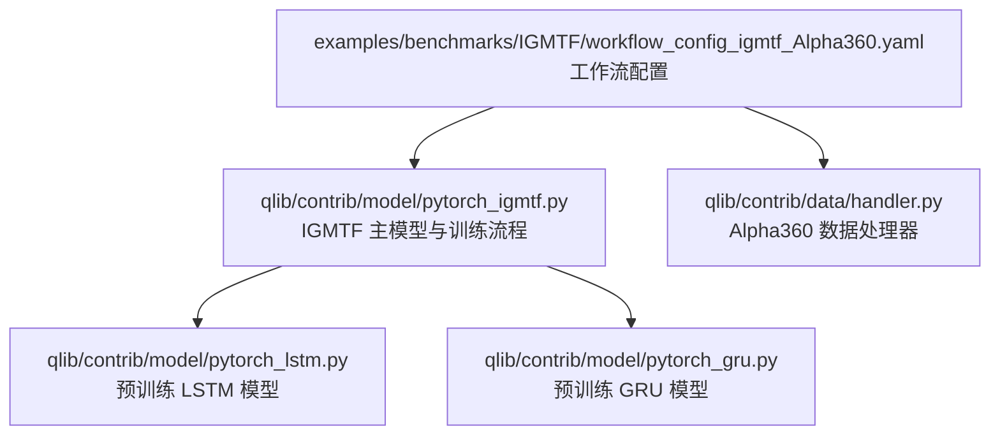
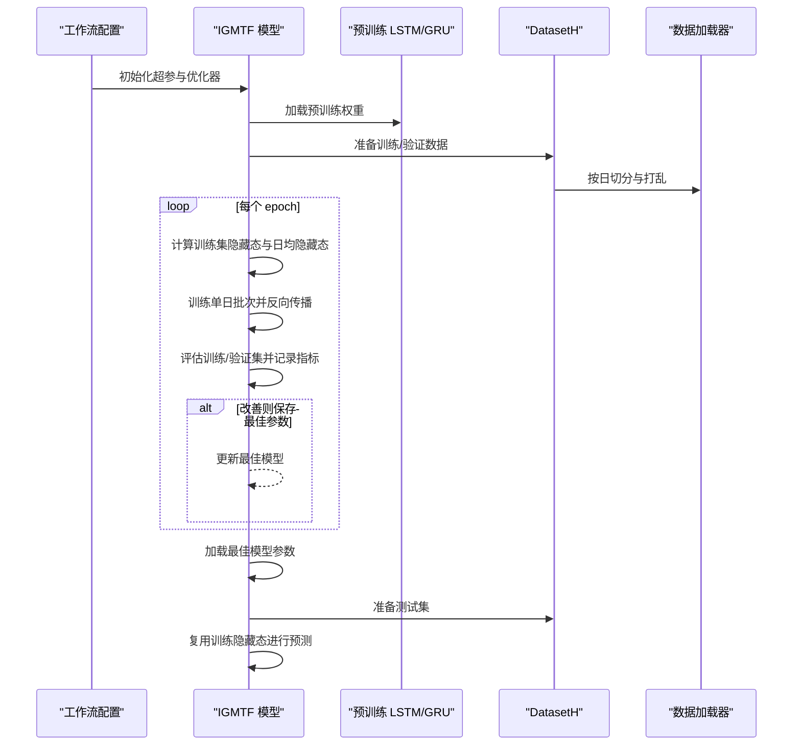
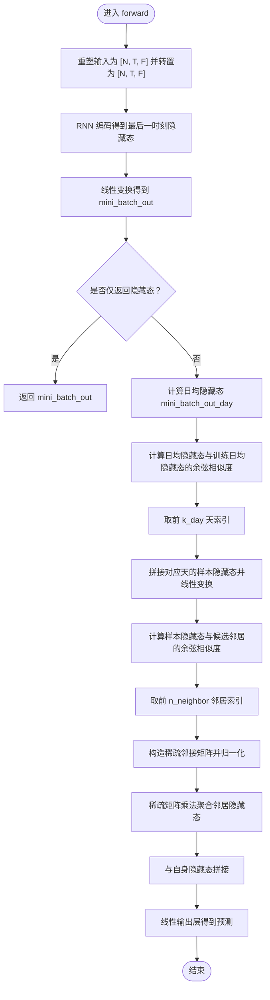
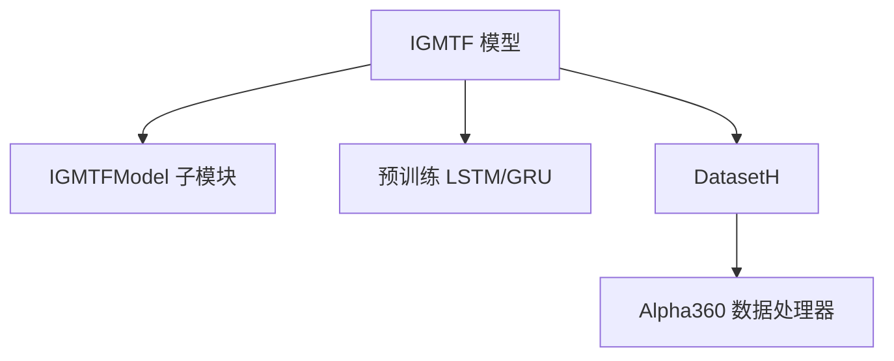

# IGMTF 基准模型

<cite>
**本文引用的文件列表**
- [pytorch_igmtf.py](file://qlib/contrib/model/pytorch_igmtf.py)
- [workflow_config_igmtf_Alpha360.yaml](file://examples/benchmarks/IGMTF/workflow_config_igmtf_Alpha360.yaml)
- [pytorch_lstm.py](file://qlib/contrib/model/pytorch_lstm.py)
- [pytorch_gru.py](file://qlib/contrib/model/pytorch_gru.py)
- [handler.py](file://qlib/contrib/data/handler.py)
</cite>

## 目录
1. [简介](#简介)
2. [项目结构](#项目结构)
3. [核心组件](#核心组件)
4. [架构总览](#架构总览)
5. [详细组件分析](#详细组件分析)
6. [依赖关系分析](#依赖关系分析)
7. [性能考量](#性能考量)
8. [故障排查指南](#故障排查指南)
9. [结论](#结论)
10. [附录](#附录)

## 简介
本文件系统性解析 Qlib 中 IGMTF（Interpretable Graph-based Multi-task Framework）基准模型的实现，重点阐述其基于图神经网络思想的多任务学习能力与消息传递机制。IGMTF 在时间序列建模基础上引入“实例级图”的相似度聚合，通过预训练的时序基础模型（LSTM/GRU）提取特征，并以余弦相似度选择邻居样本进行消息聚合，从而实现跨样本的任务共享与泛化增强。本文还结合 Yaml 配置文件说明图结构构建与任务间共享机制的设置方式，并从代码层面分析消息传递与损失函数设计，最后给出运行示例与性能评估方法。

## 项目结构
- IGMTF 模型实现位于 Qlib 贡献模块中，采用 PyTorch 实现，包含主模型类与训练/推理流程。
- 示例工作流使用 Alpha360 数据处理器，提供特征与标签配置，支持 IC 指标评估与回测记录。
- IGMTF 训练前会加载预训练的 LSTM 或 GRU 模型权重，作为任务共享的初始化来源。

图表来源
- [workflow_config_igmtf_Alpha360.yaml](file://examples/benchmarks/IGMTF/workflow_config_igmtf_Alpha360.yaml#L1-L89)
- [pytorch_igmtf.py](file://qlib/contrib/model/pytorch_igmtf.py#L1-L355)
- [pytorch_lstm.py](file://qlib/contrib/model/pytorch_lstm.py#L1-L200)
- [pytorch_gru.py](file://qlib/contrib/model/pytorch_gru.py#L1-L200)
- [handler.py](file://qlib/contrib/data/handler.py#L1-L158)

章节来源
- [workflow_config_igmtf_Alpha360.yaml](file://examples/benchmarks/IGMTF/workflow_config_igmtf_Alpha360.yaml#L1-L89)
- [pytorch_igmtf.py](file://qlib/contrib/model/pytorch_igmtf.py#L1-L355)
- [pytorch_lstm.py](file://qlib/contrib/model/pytorch_lstm.py#L1-L200)
- [pytorch_gru.py](file://qlib/contrib/model/pytorch_gru.py#L1-L200)
- [handler.py](file://qlib/contrib/data/handler.py#L1-L158)

## 核心组件
- IGMTF 主模型类：封装超参数、优化器、损失与指标、训练/测试循环、预测流程。
- IGMTFModel 子模块：包含时序 RNN（LSTM/GRU）、线性投影层、相似度计算、稀疏邻接构造与消息聚合、输出层。
- 预训练基础模型：LSTM/GRU，用于初始化 IGMTF 的共享表示。
- 数据处理器：Alpha360 提供特征与标签配置，支持归一化与缺失值处理。

章节来源
- [pytorch_igmtf.py](file://qlib/contrib/model/pytorch_igmtf.py#L27-L355)
- [pytorch_lstm.py](file://qlib/contrib/model/pytorch_lstm.py#L24-L200)
- [pytorch_gru.py](file://qlib/contrib/model/pytorch_gru.py#L25-L200)
- [handler.py](file://qlib/contrib/data/handler.py#L48-L158)

## 架构总览
IGMTF 的整体流程包括：
- 使用 DatasetH 准备训练/验证集，按日切分并打乱批次。
- 预训练 LSTM/GRU 加载到 IGMTF 的共享参数中，作为任务共享的起点。
- 训练阶段：对每个 mini-batch 计算隐藏态，构建“日级相似度”与“样本相似度”，选择邻居并构造稀疏邻接，进行消息聚合后拼接输出层得到预测。
- 评估阶段：计算损失与 IC 指标，支持早停与最佳模型保存。
- 预测阶段：复用训练阶段学到的隐藏态与日均隐藏态，按日聚合进行推理。

图表来源
- [workflow_config_igmtf_Alpha360.yaml](file://examples/benchmarks/IGMTF/workflow_config_igmtf_Alpha360.yaml#L46-L89)
- [pytorch_igmtf.py](file://qlib/contrib/model/pytorch_igmtf.py#L248-L355)
- [pytorch_lstm.py](file://qlib/contrib/model/pytorch_lstm.py#L112-L200)
- [pytorch_gru.py](file://qlib/contrib/model/pytorch_gru.py#L113-L200)

## 详细组件分析

### IGMTF 主模型类（IGMTF）
- 职责：管理超参、设备、优化器、损失与指标；组织训练/测试/预测流程；与 DatasetH 协作准备数据。
- 关键点：
  - 优化器支持 Adam/GD；损失为 MSE；指标支持 IC。
  - 训练/测试按日切分并打乱，避免跨日信息泄露。
  - 早停策略基于验证指标，保存最佳模型。
  - 预训练基础模型（LSTM/GRU）权重注入 IGMTF 参数字典，实现任务共享初始化。

章节来源
- [pytorch_igmtf.py](file://qlib/contrib/model/pytorch_igmtf.py#L27-L138)
- [pytorch_igmtf.py](file://qlib/contrib/model/pytorch_igmtf.py#L143-L169)
- [pytorch_igmtf.py](file://qlib/contrib/model/pytorch_igmtf.py#L171-L200)
- [pytorch_igmtf.py](file://qlib/contrib/model/pytorch_igmtf.py#L202-L247)
- [pytorch_igmtf.py](file://qlib/contrib/model/pytorch_igmtf.py#L248-L326)
- [pytorch_igmtf.py](file://qlib/contrib/model/pytorch_igmtf.py#L327-L355)

### IGMTFModel 子模块（消息传递与多任务共享）
- 结构组成：
  - 时序 RNN（LSTM/GRU）：输入维度 d_feat，输出最后一时刻隐藏态。
  - 线性变换与激活：将隐藏态映射到共享空间。
  - 相似度计算：余弦相似度衡量日均隐藏态与样本隐藏态之间的相似性。
  - 邻居选择与稀疏邻接：按日相似度选择若干天，再按样本相似度选择若干邻居，构造稀疏邻接矩阵。
  - 消息聚合：对邻居隐藏态加权求和，与自身隐藏态拼接后经输出层得到预测。
- 消息传递流程：
  - 计算 mini-batch 日均隐藏态与训练日均隐藏态的余弦相似度，选取前 k_day 天。
  - 将这些天的样本隐藏态拼接并线性变换，得到候选邻居集合。
  - 对当前 batch 的样本与候选邻居计算余弦相似度，选择前 n_neighbor 个邻居，构造稀疏邻接并归一化。
  - 使用稀疏矩阵乘法对邻居隐藏态进行聚合，与自身隐藏态拼接后输出预测。

图表来源
- [pytorch_igmtf.py](file://qlib/contrib/model/pytorch_igmtf.py#L404-L442)

章节来源
- [pytorch_igmtf.py](file://qlib/contrib/model/pytorch_igmtf.py#L357-L443)

### 预训练基础模型（LSTM/GRU）
- 作用：为 IGMTF 提供共享的时序表征初始化，提升多任务学习的泛化能力。
- 加载方式：IGMTF 在 fit 阶段读取预训练权重并更新 IGMTF 的同名参数字典，实现参数共享。

章节来源
- [pytorch_lstm.py](file://qlib/contrib/model/pytorch_lstm.py#L112-L127)
- [pytorch_gru.py](file://qlib/contrib/model/pytorch_gru.py#L113-L131)
- [pytorch_igmtf.py](file://qlib/contrib/model/pytorch_igmtf.py#L273-L291)

### 数据处理器（Alpha360）
- 特征与标签：提供 Alpha360 的特征配置与标签定义，支持缺失值填充与标准化等预处理。
- 工作流集成：Yaml 配置中指定 Alpha360 作为数据处理器，配合 DatasetH 进行数据准备与分段。

章节来源
- [handler.py](file://qlib/contrib/data/handler.py#L48-L158)
- [workflow_config_igmtf_Alpha360.yaml](file://examples/benchmarks/IGMTF/workflow_config_igmtf_Alpha360.yaml#L63-L89)

## 依赖关系分析
- 组件耦合：
  - IGMTF 依赖 IGMTFModel 完成消息传递与预测；依赖预训练 LSTM/GRU 完成参数共享初始化。
  - IGMTF 与 DatasetH 协作完成数据准备与分段；与数据处理器（Alpha360）协作完成特征/标签生成。
- 外部依赖：
  - PyTorch 张量运算、稀疏矩阵操作、优化器与损失函数。
  - Qlib 内置的数据集与处理器框架。

图表来源
- [pytorch_igmtf.py](file://qlib/contrib/model/pytorch_igmtf.py#L27-L355)
- [pytorch_lstm.py](file://qlib/contrib/model/pytorch_lstm.py#L112-L127)
- [pytorch_gru.py](file://qlib/contrib/model/pytorch_gru.py#L113-L131)
- [handler.py](file://qlib/contrib/data/handler.py#L48-L158)

章节来源
- [pytorch_igmtf.py](file://qlib/contrib/model/pytorch_igmtf.py#L27-L355)
- [pytorch_lstm.py](file://qlib/contrib/model/pytorch_lstm.py#L112-L127)
- [pytorch_gru.py](file://qlib/contrib/model/pytorch_gru.py#L113-L131)
- [handler.py](file://qlib/contrib/data/handler.py#L48-L158)

## 性能考量
- 计算复杂度：
  - 相似度计算与邻域选择涉及余弦相似度与 top-k 操作，整体复杂度与样本数与邻居数线性相关。
  - 稀疏邻接矩阵构造与稀疏矩阵乘法可有效降低大规模场景下的内存与计算开销。
- 训练稳定性：
  - 使用梯度裁剪防止梯度爆炸。
  - 早停策略基于验证指标，避免过拟合。
- 可扩展性：
  - 通过调整 k_day 与 n_neighbor 控制消息传递范围，平衡性能与效果。
  - 可替换基础模型（LSTM/GRU）以适配不同任务特性。

[本节为通用性能讨论，不直接分析具体文件]

## 故障排查指南
- 数据为空或配置错误：
  - 当训练/验证数据为空时抛出异常，需检查数据路径与时间窗口配置。
- 未知优化器/损失/指标：
  - 优化器仅支持 Adam/GD；损失仅支持 MSE；指标支持 IC 或空字符串/loss，其他值将报错。
- GPU 设备不可用：
  - 若未检测到可用 GPU，模型自动切换至 CPU；可通过配置项控制可见 GPU 与使用状态。

章节来源
- [pytorch_igmtf.py](file://qlib/contrib/model/pytorch_igmtf.py#L129-L134)
- [pytorch_igmtf.py](file://qlib/contrib/model/pytorch_igmtf.py#L143-L169)
- [pytorch_igmtf.py](file://qlib/contrib/model/pytorch_igmtf.py#L259-L261)
- [pytorch_igmtf.py](file://qlib/contrib/model/pytorch_igmtf.py#L139-L142)

## 结论
IGMTF 在 Qlib 中实现了基于实例级图的多任务学习框架：通过预训练时序模型提供共享表征，利用日级与样本级相似度选择邻居并进行稀疏消息聚合，最终在统一输出层完成联合预测。Yaml 配置清晰地定义了数据处理、模型超参与评估流程，便于快速复现实验。该方法在相关性建模与联合预测任务中具备良好的解释性与泛化能力。

[本节为总结性内容，不直接分析具体文件]

## 附录

### YAML 配置要点（图结构与任务共享）
- 数据处理：
  - 使用 Alpha360 数据处理器，定义特征与标签，配置缺失值填充与标准化。
- 模型参数：
  - d_feat、hidden_size、num_layers、dropout、n_epochs、lr、early_stop、metric、loss、base_model、model_path、GPU 等。
- 任务共享：
  - 通过 model_path 指定预训练 LSTM/GRU 权重，IGMTF 在 fit 阶段加载并注入共享参数字典。
- 评估与回测：
  - 指标使用 IC；回测策略与账户规模在 port_analysis_config 中定义；record 中包含信号记录、IC 分析与组合分析记录。

章节来源
- [workflow_config_igmtf_Alpha360.yaml](file://examples/benchmarks/IGMTF/workflow_config_igmtf_Alpha360.yaml#L1-L89)

### 运行示例与性能评估方法
- 运行示例：
  - 使用示例工作流配置启动 IGMTF 训练与评估，自动完成数据准备、模型训练、早停与最佳模型保存。
- 性能评估：
  - 指标：IC（信息系数）用于评估排序相关性；损失（MSE）用于回归任务。
  - 回测：基于 TopK 投资组合策略，计算年化收益、波动率、夏普比率等指标。
  - 记录：SignalRecord/SigAnaRecord/PortAnaRecord 三类记录分别输出信号、IC 分析与组合分析结果。

章节来源
- [workflow_config_igmtf_Alpha360.yaml](file://examples/benchmarks/IGMTF/workflow_config_igmtf_Alpha360.yaml#L46-L89)
- [pytorch_igmtf.py](file://qlib/contrib/model/pytorch_igmtf.py#L143-L169)
- [pytorch_igmtf.py](file://qlib/contrib/model/pytorch_igmtf.py#L248-L326)