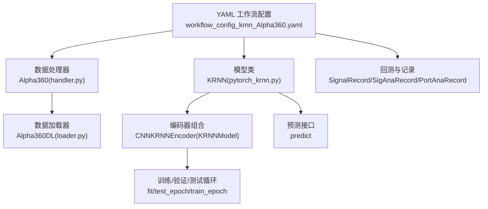
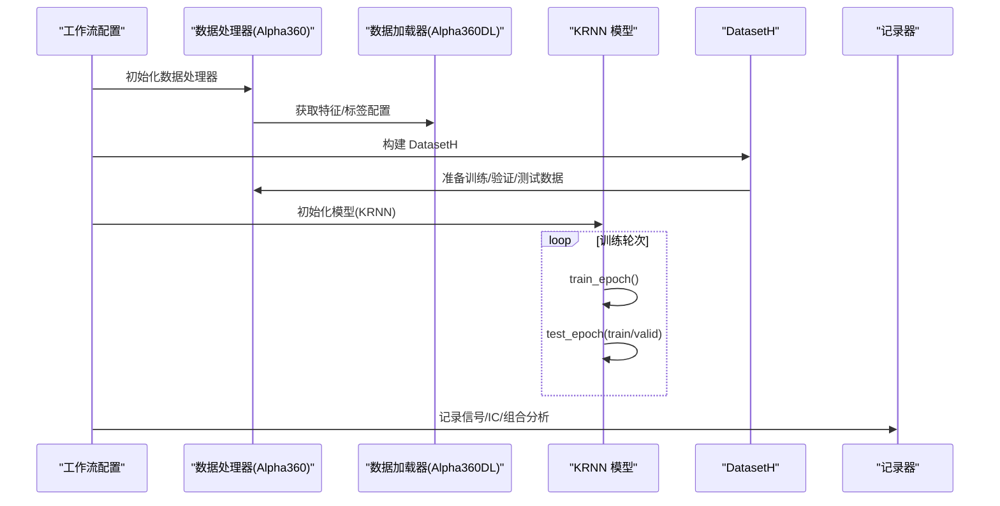
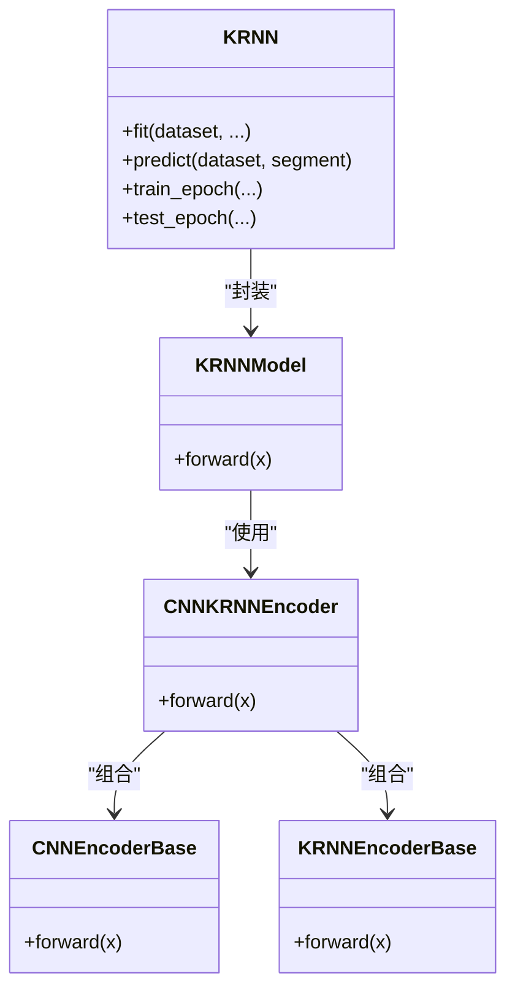
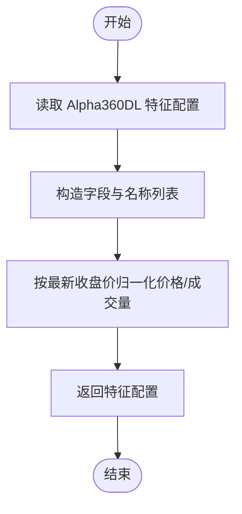
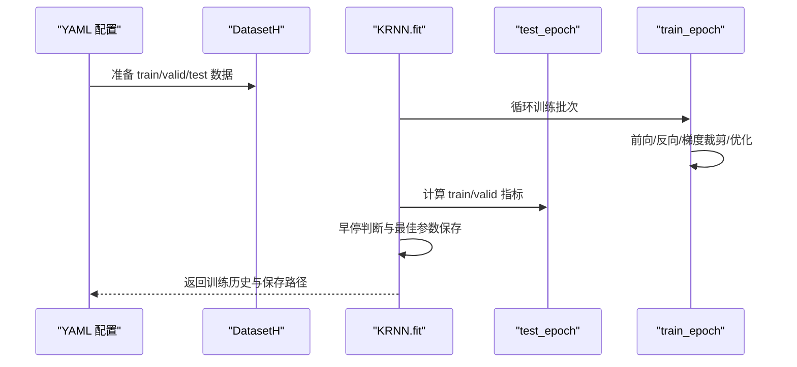
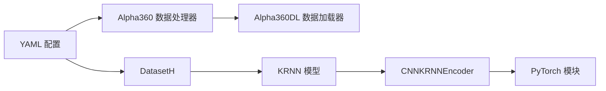

# KRNN 基准模型

<cite>
**本文引用的文件列表**
- [workflow_config_krnn_Alpha360.yaml](file://examples/benchmarks/KRNN/workflow_config_krnn_Alpha360.yaml)
- [pytorch_krnn.py](file://qlib/contrib/model/pytorch_krnn.py)
- [README.md（KRNN 示例）](file://examples/benchmarks/KRNN/README.md)
- [handler.py（Alpha360 数据处理器）](file://qlib/contrib/data/handler.py)
- [loader.py（Alpha360 数据加载器）](file://qlib/contrib/data/loader.py)
- [workflow_config_alstm_Alpha360.yaml](file://examples/benchmarks/ALSTM/workflow_config_alstm_Alpha360.yaml)
- [workflow_config_gru_Alpha360.yaml](file://examples/benchmarks/GRU/workflow_config_gru_Alpha360.yaml)
</cite>

## 目录
1. [简介](#简介)
2. [项目结构](#项目结构)
3. [核心组件](#核心组件)
4. [架构总览](#架构总览)
5. [详细组件分析](#详细组件分析)
6. [依赖关系分析](#依赖关系分析)
7. [性能与训练流程](#性能与训练流程)
8. [运行与评估指南](#运行与评估指南)
9. [知识表示质量对性能的影响](#知识表示质量对性能的影响)
10. [故障排查](#故障排查)
11. [结论](#结论)

## 简介
本文件系统性解析 Qlib 中 KRNN（Knowledge-Rich Neural Network）基准模型的实现与使用，重点说明其在 Yaml 配置中的参数设置、特征输入维度、编码器结构、训练流程与评估记录；同时结合 PyTorch 实现，解释 KRNN 的知识增强机制（以 CNN+多 RNN 并行融合的方式体现），并给出在事件驱动型行情（Alpha360）上的运行与评估方法，最后讨论知识表示质量对模型性能的影响。

## 项目结构
KRNN 在 Qlib 的组织方式如下：
- 模型实现：位于贡献模块的 PyTorch 实现文件中，包含编码器与训练/预测逻辑。
- 数据配置：通过 YAML 工作流配置指定数据处理器、数据集划分与回测策略。
- 数据提供：Alpha360 数据处理器与加载器提供标准化的特征与标签。

图表来源
- [workflow_config_krnn_Alpha360.yaml](file://examples/benchmarks/KRNN/workflow_config_krnn_Alpha360.yaml#L1-L90)
- [handler.py（Alpha360 数据处理器）](file://qlib/contrib/data/handler.py#L48-L91)
- [loader.py（Alpha360 数据加载器）](file://qlib/contrib/data/loader.py#L1-L60)
- [pytorch_krnn.py](file://qlib/contrib/model/pytorch_krnn.py#L136-L223)

章节来源
- [workflow_config_krnn_Alpha360.yaml](file://examples/benchmarks/KRNN/workflow_config_krnn_Alpha360.yaml#L1-L90)
- [handler.py（Alpha360 数据处理器）](file://qlib/contrib/data/handler.py#L48-L91)
- [loader.py（Alpha360 数据加载器）](file://qlib/contrib/data/loader.py#L1-L60)
- [pytorch_krnn.py](file://qlib/contrib/model/pytorch_krnn.py#L136-L223)

## 核心组件
- 编码器模块
  - CNN 编码器基类：对序列进行一维卷积，保持时间步长度不变，提取局部时序特征。
  - 多副本 KRNN 编码器：并行构建多个 GRU，对每个 RNN 输出取平均，提升稳定性与表达能力。
  - CNN+KRNN 组合编码器：先用 CNN 提取局部特征，再用多 RNN 融合序列信息。
- 模型主体
  - KRNNModel：组合编码器并输出标量预测。
  - KRNN：封装训练、验证、早停、保存与预测流程。
- 数据层
  - Alpha360 数据处理器：提供 Alpha360 特征与标签配置。
  - Alpha360DL 数据加载器：生成近 60 日价格/成交量等归一化特征。

章节来源
- [pytorch_krnn.py](file://qlib/contrib/model/pytorch_krnn.py#L28-L179)
- [pytorch_krnn.py](file://qlib/contrib/model/pytorch_krnn.py#L182-L223)
- [handler.py（Alpha360 数据处理器）](file://qlib/contrib/data/handler.py#L48-L91)
- [loader.py（Alpha360 数据加载器）](file://qlib/contrib/data/loader.py#L1-L60)

## 架构总览
KRNN 的整体架构由“特征输入 → 编码器 → 全连接输出 → 训练/预测”构成。YAML 配置定义了数据处理器、数据集划分、模型超参与记录项；PyTorch 实现负责前向传播、损失计算、优化与评估。

图表来源
- [workflow_config_krnn_Alpha360.yaml](file://examples/benchmarks/KRNN/workflow_config_krnn_Alpha360.yaml#L46-L89)
- [handler.py（Alpha360 数据处理器）](file://qlib/contrib/data/handler.py#L48-L91)
- [loader.py（Alpha360 数据加载器）](file://qlib/contrib/data/loader.py#L1-L60)
- [pytorch_krnn.py](file://qlib/contrib/model/pytorch_krnn.py#L381-L511)

## 详细组件分析

### YAML 配置解析（KRNN）
- 数据初始化与市场基准
  - provider_uri、region、market、benchmark 等基础配置。
- 数据处理器配置
  - 使用 Alpha360 数据处理器，包含特征归一化与缺失值处理等预处理链。
  - 标签为未来两日涨跌幅，用于事件驱动型预测。
- 模型配置
  - 类名与模块路径指向 KRNN 实现。
  - 关键超参：fea_dim、cnn_dim、cnn_kernel_size、rnn_dim、rnn_dups、rnn_layers、n_epochs、lr、early_stop、batch_size、metric、GPU。
- 数据集配置
  - 使用 DatasetH，按 train/valid/test 划分时间段。
- 记录配置
  - SignalRecord、SigAnaRecord、PortAnaRecord 三类记录，分别输出信号、IC 分析与组合分析结果。

章节来源
- [workflow_config_krnn_Alpha360.yaml](file://examples/benchmarks/KRNN/workflow_config_krnn_Alpha360.yaml#L1-L90)

### PyTorch 实现（KRNN）
- 编码器
  - CNNEncoderBase：将输入重塑为三维张量后执行一维卷积，保持序列长度不变。
  - KRNNEncoderBase：并行构建多个 GRU（dup_num 个），对各 RNN 输出做平均融合，提升鲁棒性。
  - CNNKRNNEncoder：先 CNN 再 KRNN，形成层次化特征抽取。
- 模型主体
  - KRNNModel：对编码器输出取最后一个时间步，经线性层映射为标量预测。
  - KRNN：封装 fit/test_epoch/train_epoch/predict，支持早停、GPU 设备选择与保存。
- 损失与指标
  - 支持均方误差损失，掩码处理 NaN/无穷标签；指标默认使用负损失作为优化目标。

图表来源
- [pytorch_krnn.py](file://qlib/contrib/model/pytorch_krnn.py#L28-L179)
- [pytorch_krnn.py](file://qlib/contrib/model/pytorch_krnn.py#L182-L223)
- [pytorch_krnn.py](file://qlib/contrib/model/pytorch_krnn.py#L225-L511)

章节来源
- [pytorch_krnn.py](file://qlib/contrib/model/pytorch_krnn.py#L28-L179)
- [pytorch_krnn.py](file://qlib/contrib/model/pytorch_krnn.py#L182-L223)
- [pytorch_krnn.py](file://qlib/contrib/model/pytorch_krnn.py#L225-L511)

### 数据层（Alpha360）
- Alpha360 数据处理器
  - 通过 QlibDataLoader 加载特征与标签，使用默认学习/推理处理器链。
  - 标签配置为未来两日涨跌幅，符合事件驱动型预测任务。
- Alpha360DL 数据加载器
  - 生成近 60 日的 CLOSE/OPEN/HIGH/LOW/VWAP/Volume 等归一化特征，便于模型学习时序模式。

图表来源
- [loader.py（Alpha360 数据加载器）](file://qlib/contrib/data/loader.py#L1-L60)
- [handler.py（Alpha360 数据处理器）](file://qlib/contrib/data/handler.py#L48-L91)

章节来源
- [loader.py（Alpha360 数据加载器）](file://qlib/contrib/data/loader.py#L1-L60)
- [handler.py（Alpha360 数据处理器）](file://qlib/contrib/data/handler.py#L48-L91)

### 训练与评估流程（序列图）

图表来源
- [workflow_config_krnn_Alpha360.yaml](file://examples/benchmarks/KRNN/workflow_config_krnn_Alpha360.yaml#L46-L89)
- [pytorch_krnn.py](file://qlib/contrib/model/pytorch_krnn.py#L381-L511)

章节来源
- [workflow_config_krnn_Alpha360.yaml](file://examples/benchmarks/KRNN/workflow_config_krnn_Alpha360.yaml#L46-L89)
- [pytorch_krnn.py](file://qlib/contrib/model/pytorch_krnn.py#L381-L511)

## 依赖关系分析
- 模型依赖
  - KRNN 依赖 DatasetH 与 DataHandlerLP 的数据准备接口。
  - 编码器依赖 PyTorch 的 Conv1d 与 GRU 模块。
- 数据依赖
  - Alpha360 数据处理器依赖 QlibDataLoader 与 Alpha360DL 的特征配置。
- 配置依赖
  - YAML 配置决定数据集划分、模型超参与记录项，直接影响实验可复现性。

图表来源
- [workflow_config_krnn_Alpha360.yaml](file://examples/benchmarks/KRNN/workflow_config_krnn_Alpha360.yaml#L46-L89)
- [handler.py（Alpha360 数据处理器）](file://qlib/contrib/data/handler.py#L48-L91)
- [loader.py（Alpha360 数据加载器）](file://qlib/contrib/data/loader.py#L1-L60)
- [pytorch_krnn.py](file://qlib/contrib/model/pytorch_krnn.py#L136-L223)

章节来源
- [workflow_config_krnn_Alpha360.yaml](file://examples/benchmarks/KRNN/workflow_config_krnn_Alpha360.yaml#L46-L89)
- [handler.py（Alpha360 数据处理器）](file://qlib/contrib/data/handler.py#L48-L91)
- [loader.py（Alpha360 数据加载器）](file://qlib/contrib/data/loader.py#L1-L60)
- [pytorch_krnn.py](file://qlib/contrib/model/pytorch_krnn.py#L136-L223)

## 性能与训练流程
- 训练细节
  - 批量训练：按 batch_size 切分样本，随机打乱，前向计算损失并反向传播。
  - 梯度裁剪：防止梯度爆炸，提高训练稳定性。
  - 早停：基于验证指标（默认负损失）选择最佳模型并保存。
- 推理细节
  - predict 采用滑窗批量推理，避免一次性加载过多数据。
- 参考对比
  - ALSTM/GRU 等基准模型在相同数据配置下进行对比，便于评估 KRNN 的收益。

章节来源
- [pytorch_krnn.py](file://qlib/contrib/model/pytorch_krnn.py#L381-L511)
- [workflow_config_alstm_Alpha360.yaml](file://examples/benchmarks/ALSTM/workflow_config_alstm_Alpha360.yaml#L1-L89)
- [workflow_config_gru_Alpha360.yaml](file://examples/benchmarks/GRU/workflow_config_gru_Alpha360.yaml#L1-L88)

## 运行与评估指南
- 运行步骤
  - 准备数据：确保已配置 provider_uri 指向本地数据目录，并完成 Alpha360 数据的准备。
  - 执行工作流：使用 Qlib 的工作流入口运行 KRNN 的 YAML 配置，自动完成数据准备、模型训练、预测与记录。
- 评估指标
  - 信号记录：输出预测信号。
  - IC 分析：计算信息系数与秩相关 IC。
  - 组合分析：基于回测参数（手续费、滑点等）评估组合收益与风险。
- 参考示例
  - 可参考 ALSTM/GRU 的 YAML 配置，确认数据处理器、数据集划分与记录项的一致性。

章节来源
- [workflow_config_krnn_Alpha360.yaml](file://examples/benchmarks/KRNN/workflow_config_krnn_Alpha360.yaml#L1-L90)
- [workflow_config_alstm_Alpha360.yaml](file://examples/benchmarks/ALSTM/workflow_config_alstm_Alpha360.yaml#L1-L89)
- [workflow_config_gru_Alpha360.yaml](file://examples/benchmarks/GRU/workflow_config_gru_Alpha360.yaml#L1-L88)

## 知识表示质量对性能的影响
- KRNN 的“知识增强”体现在编码器设计上：通过 CNN 提取局部时序特征，通过多 RNN 并行融合序列信息，形成更稳健的时序表征。
- Alpha360 特征经过按最新收盘价归一化，有助于消除量纲差异，提升模型对相对价格变化的敏感度。
- 知识表示质量（特征覆盖度、稳定性、噪声控制）直接影响模型在事件驱动型行情中的预测效果。建议：
  - 保证特征窗口长度与业务周期匹配；
  - 控制归一化与缺失值处理策略，避免引入偏差；
  - 合理设置 CNN/RNN 层宽与并行副本数，平衡表达能力与过拟合风险。

章节来源
- [loader.py（Alpha360 数据加载器）](file://qlib/contrib/data/loader.py#L1-L60)
- [pytorch_krnn.py](file://qlib/contrib/model/pytorch_krnn.py#L136-L223)

## 故障排查
- 数据为空
  - 若训练/验证数据为空，需检查数据范围与过滤条件是否正确。
- GPU 不可用或版本不匹配
  - 参考示例 README 中关于 CUDA/torch 版本的提示，确保环境兼容。
- 指标异常
  - 检查标签构造与掩码处理逻辑，确保 NaN/无穷值被正确处理。

章节来源
- [pytorch_krnn.py](file://qlib/contrib/model/pytorch_krnn.py#L432-L489)
- [README.md（KRNN 示例）](file://examples/benchmarks/KRNN/README.md#L5-L9)

## 结论
KRNN 在 Qlib 中以清晰的编码器结构与完整的训练/评估流水线实现了对事件驱动型行情的预测。YAML 配置明确了数据来源、模型超参与记录项；PyTorch 实现提供了稳定的 CNN+多 RNN 融合方案。通过 Alpha360 数据处理器与加载器，KRNN 能够稳定地从近 60 日的归一化特征中学习相对价格变化规律。实际应用中，应重视知识表示质量与超参调优，以获得更稳健的预测性能。