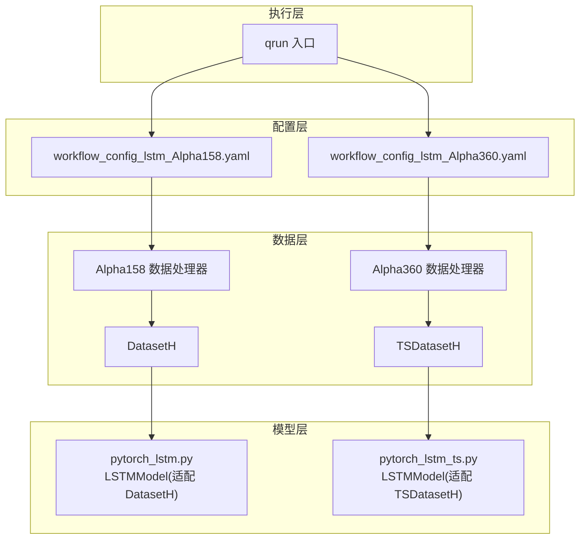
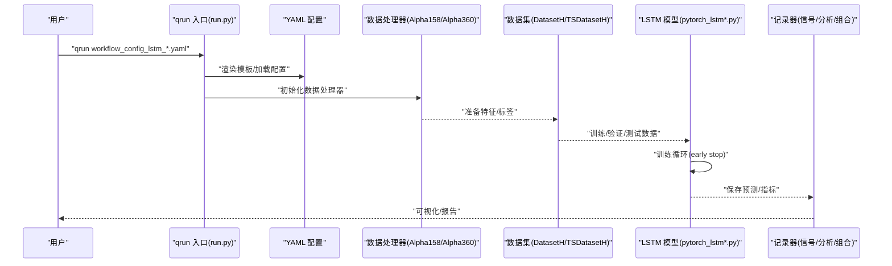
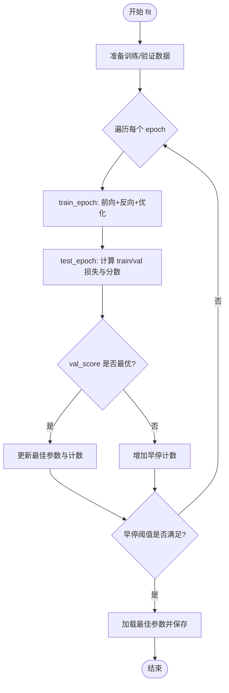
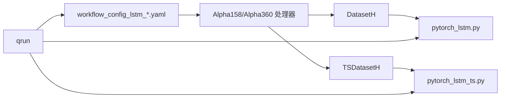

# LSTM 基准模型

<cite>
**本文引用的文件**
- [workflow_config_lstm_Alpha158.yaml](file://examples/benchmarks/LSTM/workflow_config_lstm_Alpha158.yaml)
- [workflow_config_lstm_Alpha360.yaml](file://examples/benchmarks/LSTM/workflow_config_lstm_Alpha360.yaml)
- [pytorch_lstm.py](file://qlib/contrib/model/pytorch_lstm.py)
- [pytorch_lstm_ts.py](file://qlib/contrib/model/pytorch_lstm_ts.py)
- [handler.py](file://qlib/contrib/data/handler.py)
- [run.py](file://qlib/cli/run.py)
- [__init__.py（数据集）](file://qlib/data/dataset/__init__.py)
- [README.md（示例）](file://examples/benchmarks/README.md)
</cite>

## 目录
1. [简介](#简介)
2. [项目结构](#项目结构)
3. [核心组件](#核心组件)
4. [架构总览](#架构总览)
5. [详细组件分析](#详细组件分析)
6. [依赖关系分析](#依赖关系分析)
7. [性能考量](#性能考量)
8. [故障排查指南](#故障排查指南)
9. [结论](#结论)
10. [附录](#附录)

## 简介
本文件系统性介绍 Qlib 中 LSTM 基准实现，聚焦于时序预测任务的架构设计与训练流程。文档围绕以下目标展开：
- 解析 workflow_config_lstm_*.yaml 文件中关于序列长度、隐藏层维度、训练轮数等关键参数的设置；
- 结合 pytorch_lstm.py 源码解释模型前向传播逻辑与训练流程；
- 演示如何通过 qrun 启动 LSTM 模型训练；
- 分析 LSTM 在 Alpha158 与 Alpha360 因子上的预测能力差异；
- 提供可视化预测结果与真实标签对比的方法；
- 讨论过拟合问题的应对策略。

## 项目结构
LSTM 基准模型由“配置文件 + 数据处理器 + 模型实现 + 工作流入口”四部分组成：
- 配置文件：定义数据范围、特征/标签预处理、模型超参、数据集切分与记录器；
- 数据处理器：提供 Alpha158/Alpha360 的特征与标签生成；
- 模型实现：包含两类 LSTM 实现，分别适配 DatasetH 与 TSDatasetH；
- 工作流入口：qrun 命令解析配置并驱动训练与回测。



图表来源
- [workflow_config_lstm_Alpha158.yaml](file://examples/benchmarks/LSTM/workflow_config_lstm_Alpha158.yaml#L1-L98)
- [workflow_config_lstm_Alpha360.yaml](file://examples/benchmarks/LSTM/workflow_config_lstm_Alpha360.yaml#L1-L88)
- [pytorch_lstm.py](file://qlib/contrib/model/pytorch_lstm.py#L286-L307)
- [pytorch_lstm_ts.py](file://qlib/contrib/model/pytorch_lstm_ts.py#L297-L315)
- [handler.py](file://qlib/contrib/data/handler.py#L48-L158)
- [__init__.py（数据集）](file://qlib/data/dataset/__init__.py#L72-L248)

章节来源
- [workflow_config_lstm_Alpha158.yaml](file://examples/benchmarks/LSTM/workflow_config_lstm_Alpha158.yaml#L1-L98)
- [workflow_config_lstm_Alpha360.yaml](file://examples/benchmarks/LSTM/workflow_config_lstm_Alpha360.yaml#L1-L88)
- [pytorch_lstm.py](file://qlib/contrib/model/pytorch_lstm.py#L24-L106)
- [pytorch_lstm_ts.py](file://qlib/contrib/model/pytorch_lstm_ts.py#L40-L111)
- [handler.py](file://qlib/contrib/data/handler.py#L48-L158)
- [__init__.py（数据集）](file://qlib/data/dataset/__init__.py#L72-L248)
- [README.md（示例）](file://examples/benchmarks/README.md#L149-L150)

## 核心组件
- 配置文件（workflow_config_lstm_*.yaml）
  - 定义 qlib 初始化、市场/基准、数据处理器配置、回测参数、任务中的模型与数据集、记录器；
  - 关键参数包括：d_feat、hidden_size、num_layers、dropout、n_epochs、lr、early_stop、batch_size、loss、GPU 等；
  - 数据集切分：train/valid/test 时间段；TSDatasetH 还包含 step_len（序列长度）。
- 数据处理器（Alpha158/Alpha360）
  - 通过 DataHandlerLP 组织特征与标签，支持列级归一化、填充等预处理；
  - Alpha158 默认不使用 infer_processors，Alpha360 使用默认的 infer_processors。
- 模型实现
  - pytorch_lstm.py：面向 DatasetH 的 LSTM，输入为 [N, F*T]，reshape 成 [N, T, F] 后送入 LSTM，取最后一时刻输出；
  - pytorch_lstm_ts.py：面向 TSDatasetH 的 LSTM，直接以 [N, T, F] 形式输入，更贴合时间序列建模。
- 工作流入口（qrun）
  - 解析 YAML，初始化 qlib，调用 task_train 执行训练与记录。

章节来源
- [workflow_config_lstm_Alpha158.yaml](file://examples/benchmarks/LSTM/workflow_config_lstm_Alpha158.yaml#L54-L98)
- [workflow_config_lstm_Alpha360.yaml](file://examples/benchmarks/LSTM/workflow_config_lstm_Alpha360.yaml#L46-L88)
- [pytorch_lstm.py](file://qlib/contrib/model/pytorch_lstm.py#L286-L307)
- [pytorch_lstm_ts.py](file://qlib/contrib/model/pytorch_lstm_ts.py#L297-L315)
- [handler.py](file://qlib/contrib/data/handler.py#L48-L158)
- [run.py](file://qlib/cli/run.py#L85-L150)

## 架构总览
下图展示从配置到训练与预测的整体流程，以及两类 LSTM 模型在不同数据集上的适配关系。



图表来源
- [run.py](file://qlib/cli/run.py#L85-L150)
- [workflow_config_lstm_Alpha158.yaml](file://examples/benchmarks/LSTM/workflow_config_lstm_Alpha158.yaml#L54-L98)
- [workflow_config_lstm_Alpha360.yaml](file://examples/benchmarks/LSTM/workflow_config_lstm_Alpha360.yaml#L46-L88)
- [pytorch_lstm.py](file://qlib/contrib/model/pytorch_lstm.py#L204-L284)
- [pytorch_lstm_ts.py](file://qlib/contrib/model/pytorch_lstm_ts.py#L195-L295)
- [__init__.py（数据集）](file://qlib/data/dataset/__init__.py#L642-L721)

## 详细组件分析

### 配置文件参数解析（workflow_config_lstm_*.yaml）
- 数据范围与处理器
  - start_time/end_time/fit_start_time/fit_end_time：数据时间窗口；
  - instruments：股票池（如 csi300）；
  - infer_processors/learn_processors：特征/标签预处理流水线；
  - label：标签公式（相对价格变化）。
- 任务与模型
  - model.class: LSTM；
  - model.module_path：pytorch_lstm 或 pytorch_lstm_ts；
  - 关键超参：d_feat、hidden_size、num_layers、dropout、n_epochs、lr、early_stop、batch_size、loss、GPU；
  - n_jobs（仅 ts 版本）：DataLoader 并行度。
- 数据集
  - DatasetH：handler 指向 Alpha158/Alpha360；
  - TSDatasetH：增加 step_len（序列长度），用于时间序列采样。
- 记录器
  - SignalRecord、SigAnaRecord、PortAnaRecord：生成信号、IC 分析与组合回测结果。

章节来源
- [workflow_config_lstm_Alpha158.yaml](file://examples/benchmarks/LSTM/workflow_config_lstm_Alpha158.yaml#L1-L98)
- [workflow_config_lstm_Alpha360.yaml](file://examples/benchmarks/LSTM/workflow_config_lstm_Alpha360.yaml#L1-L88)

### 数据处理器（Alpha158/Alpha360）
- Alpha360
  - 默认 infer_processors 包含 ZScoreNorm/Fillna；
  - 默认 learn_processors 包含 DropnaLabel/CSZScoreNorm；
  - 标签为收盘价相对变化。
- Alpha158
  - 默认不使用 infer_processors；
  - 默认 learn_processors 同上；
  - 标签同上。

章节来源
- [handler.py](file://qlib/contrib/data/handler.py#L48-L158)

### LSTM 前向传播与训练流程（pytorch_lstm.py）
- 模型结构
  - LSTMModel：单向 LSTM，input_size=d_feat，num_layers、hidden_size、dropout；
  - 输出层：全连接将最后一时刻的 hidden 映射为标量预测；
  - 输入形状：[N, F*T] → [N, T, F] → [N, T, F] 的 LSTM → 取 out[:, -1, :] → FC → [N]。
- 训练流程
  - fit：按 epoch 循环，每步调用 train_epoch 与 test_epoch；
  - train_epoch：随机打乱样本，按 batch_size 切分，前向、反向、梯度裁剪；
  - test_epoch：评估训练/验证集损失与分数（metric 为 loss）；
  - early stop：基于验证集 metric 最优值停止，保存最佳权重。
- 预测
  - predict：对 test 集按 batch 推理，返回带索引的 Series。



图表来源
- [pytorch_lstm.py](file://qlib/contrib/model/pytorch_lstm.py#L204-L284)

章节来源
- [pytorch_lstm.py](file://qlib/contrib/model/pytorch_lstm.py#L24-L106)
- [pytorch_lstm.py](file://qlib/contrib/model/pytorch_lstm.py#L128-L203)
- [pytorch_lstm.py](file://qlib/contrib/model/pytorch_lstm.py#L204-L284)
- [pytorch_lstm.py](file://qlib/contrib/model/pytorch_lstm.py#L286-L307)

### LSTM 前向传播与训练流程（pytorch_lstm_ts.py）
- 模型结构
  - LSTMModel：与上述一致，但输入为 [N, T, F]，无需 reshape；
  - 支持加权损失（loss_fn 可传 weight）。
- 训练流程
  - fit：构建 DataLoader（train/valid），支持 n_jobs 并行；
  - train_epoch/test_epoch：从 DataLoader 读取 (data, weight)，取特征与标签；
  - early stop 与参数保存逻辑同上。
- 预测
  - predict：构造 test DataLoader，逐批推理并拼接结果。

```mermaid
sequenceDiagram
participant DS as "TSDatasetH"
participant DL as "DataLoader"
participant M as "LSTM(ts)"
participant OPT as "优化器"
DS->>DL : "train/valid/test DataLoader"
loop 每个 epoch
DL->>M : "batch : (data, weight)"
M->>M : "forward(data)"
M->>OPT : "loss.backward()"
OPT-->>M : "step"
end
M-->>M : "early stop 选择最佳参数"
```

图表来源
- [pytorch_lstm_ts.py](file://qlib/contrib/model/pytorch_lstm_ts.py#L195-L295)
- [__init__.py（数据集）](file://qlib/data/dataset/__init__.py#L642-L721)

章节来源
- [pytorch_lstm_ts.py](file://qlib/contrib/model/pytorch_lstm_ts.py#L40-L111)
- [pytorch_lstm_ts.py](file://qlib/contrib/model/pytorch_lstm_ts.py#L160-L194)
- [pytorch_lstm_ts.py](file://qlib/contrib/model/pytorch_lstm_ts.py#L195-L295)
- [pytorch_lstm_ts.py](file://qlib/contrib/model/pytorch_lstm_ts.py#L297-L315)

### 数据集适配与序列长度（step_len）
- DatasetH：直接返回特征/标签 DataFrame，LSTM 通过 reshape 将 F*T 展开为 [N, T, F]；
- TSDatasetH：通过 TSDataSampler 将表征数据转换为时间序列采样器，支持 step_len 控制序列长度；
- 示例配置中：
  - Alpha158（ts 版本）：dataset.step_len=20；
  - Alpha360（非 ts 版本）：未显式指定 step_len，默认由 DatasetH 决定。

章节来源
- [workflow_config_lstm_Alpha158.yaml](file://examples/benchmarks/LSTM/workflow_config_lstm_Alpha158.yaml#L70-L83)
- [workflow_config_lstm_Alpha360.yaml](file://examples/benchmarks/LSTM/workflow_config_lstm_Alpha360.yaml#L61-L73)
- [__init__.py（数据集）](file://qlib/data/dataset/__init__.py#L642-L721)

### Alpha158 vs Alpha360 预测能力差异
- 特征空间
  - Alpha158：默认不使用 infer_processors，特征更原始；
  - Alpha360：默认使用 ZScoreNorm/Fillna 等，特征更标准化；
- 标签一致：两者均使用收盘价相对变化作为标签；
- 模型适配
  - Alpha158：workflow 指向 pytorch_lstm_ts（TSDatasetH），可利用 step_len；
  - Alpha360：workflow 指向 pytorch_lstm（DatasetH），需通过 reshape 构造时间维。
- 差异影响
  - Alpha360 的特征标准化可能提升收敛稳定性；
  - Alpha158 的原始特征可能保留更多非线性信息，但需更强的正则化或更长序列长度。

章节来源
- [handler.py](file://qlib/contrib/data/handler.py#L48-L158)
- [workflow_config_lstm_Alpha158.yaml](file://examples/benchmarks/LSTM/workflow_config_lstm_Alpha158.yaml#L54-L98)
- [workflow_config_lstm_Alpha360.yaml](file://examples/benchmarks/LSTM/workflow_config_lstm_Alpha360.yaml#L46-L88)
- [README.md（示例）](file://examples/benchmarks/README.md#L149-L150)

### 可视化预测结果与真实标签对比
- 信号记录与分析
  - workflow 中配置了 SignalRecord、SigAnaRecord、PortAnaRecord；
  - 可通过记录器导出预测信号、IC 分析与组合回测报告；
- 可视化建议
  - 使用 SigAnaRecord 生成的 IC 图、rank IC 图；
  - 使用 PortAnaRecord 生成收益曲线、最大回撤等；
  - 若需自定义对比图，可在记录器输出基础上二次绘图（例如预测值与标签散点、残差分布等）。

章节来源
- [workflow_config_lstm_Alpha158.yaml](file://examples/benchmarks/LSTM/workflow_config_lstm_Alpha158.yaml#L83-L98)
- [workflow_config_lstm_Alpha360.yaml](file://examples/benchmarks/LSTM/workflow_config_lstm_Alpha360.yaml#L73-L88)

### 过拟合问题的应对策略
- 正则化与结构
  - dropout：在 LSTM 层设置 dropout；
  - early_stop：监控验证集指标，达到阈值即停止；
  - 权重衰减：可通过优化器参数引入 L2 正则（当前实现未显式使用，可扩展）。
- 数据与特征
  - Alpha360 的特征标准化有助于稳定训练；
  - 对缺失值进行合理填充（如 ffill+bfill）；
  - 合理设置 batch_size 与学习率。
- 序列长度与样本量
  - step_len（TSDatasetH）与 d_feat（特征维度）需平衡计算与表达能力；
  - 样本不足时可考虑数据增强或迁移学习。

章节来源
- [pytorch_lstm.py](file://qlib/contrib/model/pytorch_lstm.py#L128-L203)
- [pytorch_lstm_ts.py](file://qlib/contrib/model/pytorch_lstm_ts.py#L160-L194)
- [handler.py](file://qlib/contrib/data/handler.py#L48-L158)

## 依赖关系分析
- 配置文件依赖数据处理器与数据集模块；
- 模型实现依赖 PyTorch、Numpy、Pandas；
- 工作流入口依赖 qrun 与 task_train；
- TSDatasetH 依赖 TSDataSampler，负责时间序列采样与索引映射。



图表来源
- [workflow_config_lstm_Alpha158.yaml](file://examples/benchmarks/LSTM/workflow_config_lstm_Alpha158.yaml#L54-L98)
- [workflow_config_lstm_Alpha360.yaml](file://examples/benchmarks/LSTM/workflow_config_lstm_Alpha360.yaml#L46-L88)
- [pytorch_lstm.py](file://qlib/contrib/model/pytorch_lstm.py#L24-L106)
- [pytorch_lstm_ts.py](file://qlib/contrib/model/pytorch_lstm_ts.py#L40-L111)
- [run.py](file://qlib/cli/run.py#L85-L150)

章节来源
- [__init__.py（数据集）](file://qlib/data/dataset/__init__.py#L72-L248)
- [run.py](file://qlib/cli/run.py#L85-L150)

## 性能考量
- 计算资源
  - GPU：通过 GPU 参数启用 CUDA；
  - 并行度：n_jobs（ts 版本）控制 DataLoader 并发；
  - batch_size：影响内存占用与收敛速度。
- 数据加载
  - TSDatasetH 的 step_len 与 TSDataSampler 的索引机制对内存与 IO 有直接影响；
  - 建议根据硬件资源调整 step_len 与 batch_size。
- 训练稳定性
  - 梯度裁剪（clip_grad_value_）有助于缓解梯度爆炸；
  - 学习率与优化器选择（Adam/GD）影响收敛速度与精度。

章节来源
- [pytorch_lstm.py](file://qlib/contrib/model/pytorch_lstm.py#L128-L203)
- [pytorch_lstm_ts.py](file://qlib/contrib/model/pytorch_lstm_ts.py#L160-L194)
- [workflow_config_lstm_Alpha158.yaml](file://examples/benchmarks/LSTM/workflow_config_lstm_Alpha158.yaml#L54-L98)
- [workflow_config_lstm_Alpha360.yaml](file://examples/benchmarks/LSTM/workflow_config_lstm_Alpha360.yaml#L46-L88)

## 故障排查指南
- 空数据报错
  - fit 中若训练/验证集为空会抛出异常，检查数据时间窗口与 instruments 设置。
- 模型未拟合
  - predict 前需先 fit，否则会报未拟合错误。
- GPU 不可用
  - 当 GPU=-1 或不可用时自动切换 CPU，注意显存与内存差异。
- 数据缺失
  - TSDatasetH 在 DataLoader 配置中支持 fillna_type（ffill/bfill），确保序列连续性。

章节来源
- [pytorch_lstm.py](file://qlib/contrib/model/pytorch_lstm.py#L214-L220)
- [pytorch_lstm.py](file://qlib/contrib/model/pytorch_lstm.py#L262-L267)
- [pytorch_lstm_ts.py](file://qlib/contrib/model/pytorch_lstm_ts.py#L207-L218)

## 结论
- Qlib 的 LSTM 基准模型提供了两套适配方案：DatasetH（需 reshape）与 TSDatasetH（原生时间序列）；
- 配置文件清晰分离数据、模型与记录器，便于复现实验；
- Alpha158 与 Alpha360 在特征预处理与模型适配上存在差异，应结合任务特性选择；
- 通过 early stop、dropout、梯度裁剪与合理的 batch_size/step_len，可有效缓解过拟合；
- 借助记录器可快速产出信号、IC 与组合回测结果，便于可视化与进一步分析。

## 附录
- 启动训练
  - 使用 qrun 命令运行配置文件，即可完成初始化、训练、记录与回测。
- 可视化建议
  - 使用 SigAnaRecord 与 PortAnaRecord 的输出进行 IC 曲线、收益曲线与最大回撤分析；
  - 自定义散点图对比预测值与标签，观察残差分布。

章节来源
- [run.py](file://qlib/cli/run.py#L85-L150)
- [workflow_config_lstm_Alpha158.yaml](file://examples/benchmarks/LSTM/workflow_config_lstm_Alpha158.yaml#L83-L98)
- [workflow_config_lstm_Alpha360.yaml](file://examples/benchmarks/LSTM/workflow_config_lstm_Alpha360.yaml#L73-L88)