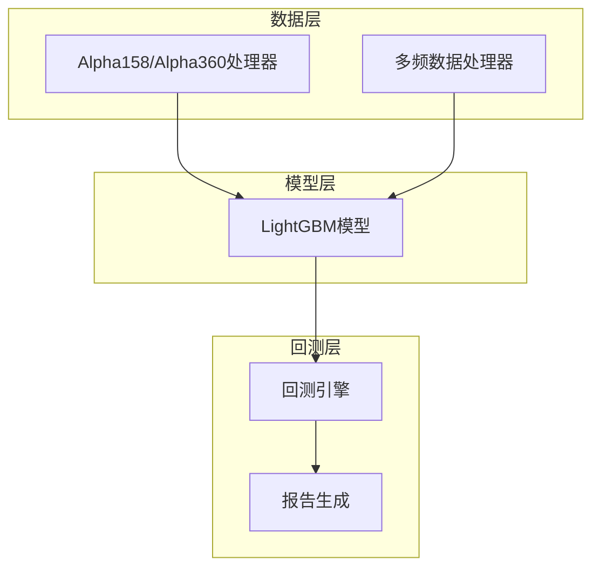
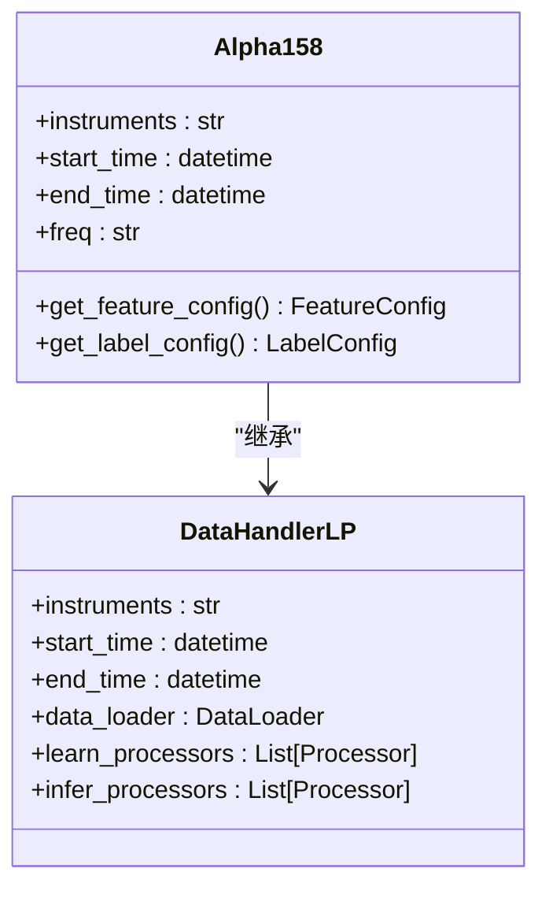
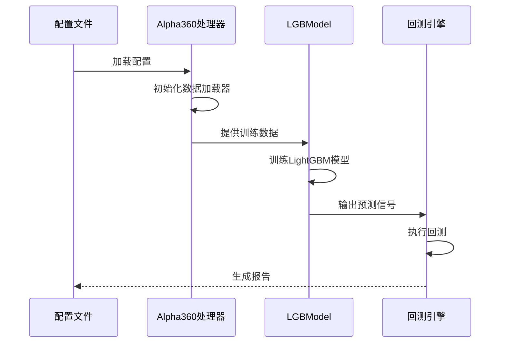
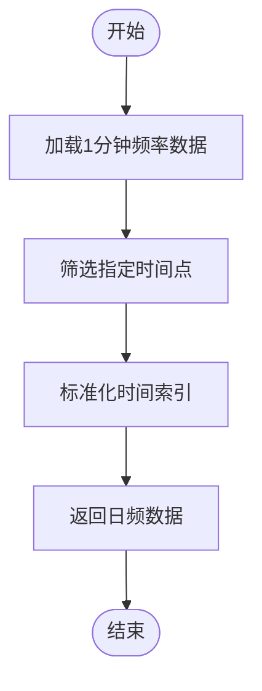
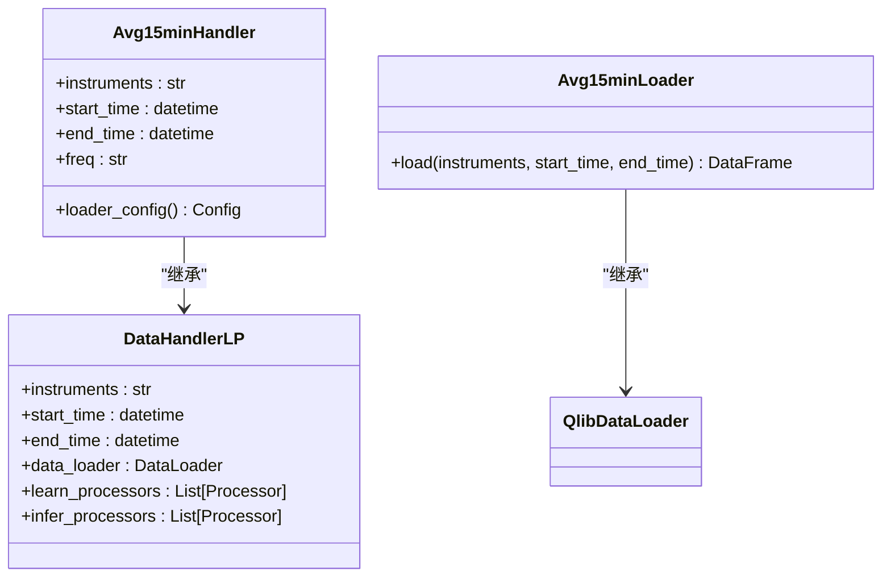
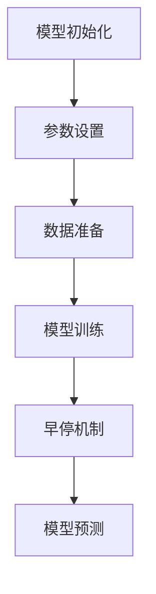
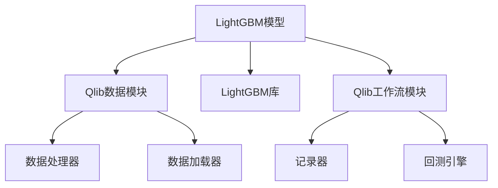

# LightGBM 基准模型

<cite>
**本文档中引用的文件**  
- [workflow_config_lightgbm_Alpha158.yaml](file://examples/benchmarks/LightGBM/workflow_config_lightgbm_Alpha158.yaml)
- [workflow_config_lightgbm_Alpha360.yaml](file://examples/benchmarks/LightGBM/workflow_config_lightgbm_Alpha360.yaml)
- [workflow_config_lightgbm_multi_freq.yaml](file://examples/benchmarks/LightGBM/workflow_config_lightgbm_multi_freq.yaml)
- [workflow_config_lightgbm_Alpha158_multi_freq.yaml](file://examples/benchmarks/LightGBM/workflow_config_lightgbm_Alpha158_multi_freq.yaml)
- [features_sample.py](file://examples/benchmarks/LightGBM/features_sample.py)
- [multi_freq_handler.py](file://examples/benchmarks/LightGBM/multi_freq_handler.py)
- [features_resample_N.py](file://examples/benchmarks/LightGBM/features_resample_N.py)
- [gbdt.py](file://qlib/contrib/model/gbdt.py)
- [handler.py](file://qlib/contrib/data/handler.py)
- [run.py](file://qlib/cli/run.py)
</cite>

## 目录
1. [简介](#简介)
2. [项目结构](#项目结构)
3. [核心组件](#核心组件)
4. [架构概述](#架构概述)
5. [详细组件分析](#详细组件分析)
6. [依赖分析](#依赖分析)
7. [性能考量](#性能考量)
8. [故障排除指南](#故障排除指南)
9. [结论](#结论)

## 简介
本文档详细说明了Qlib中LightGBM作为GBDT模型的基准实现，涵盖其在Alpha158和Alpha360因子体系下的配置差异。文档解释了workflow_config_lightgbm_*.yaml文件中的数据集定义、模型参数、训练流程和回测设置。结合features_sample.py和multi_freq_handler.py说明特征采样与多频数据处理机制。提供通过qrun运行该模型的完整命令示例，并分析输出的回测报告中年化收益、夏普比率、IC值等关键指标。最后说明如何调整超参数并集成到自定义研究流程中。

## 项目结构
Qlib的LightGBM基准实现位于examples/benchmarks/LightGBM目录下，包含多个配置文件和辅助脚本。主要文件包括针对不同因子体系的配置文件（Alpha158和Alpha360）、多频数据处理脚本以及特征采样工具。

**Diagram sources**
- [workflow_config_lightgbm_Alpha158.yaml](file://examples/benchmarks/LightGBM/workflow_config_lightgbm_Alpha158.yaml)
- [workflow_config_lightgbm_Alpha360.yaml](file://examples/benchmarks/LightGBM/workflow_config_lightgbm_Alpha360.yaml)

**Section sources**
- [workflow_config_lightgbm_Alpha158.yaml](file://examples/benchmarks/LightGBM/workflow_config_lightgbm_Alpha158.yaml)
- [workflow_config_lightgbm_Alpha360.yaml](file://examples/benchmarks/LightGBM/workflow_config_lightgbm_Alpha360.yaml)

## 核心组件
LightGBM在Qlib中的实现主要由三个核心部分组成：模型定义、数据处理器和工作流配置。模型定义在gbdt.py中，数据处理器包括Alpha158和Alpha360类，工作流配置则通过YAML文件进行定义。

**Section sources**
- [gbdt.py](file://qlib/contrib/model/gbdt.py)
- [handler.py](file://qlib/contrib/data/handler.py)

## 架构概述
LightGBM在Qlib中的架构遵循标准的机器学习工作流：数据准备、模型训练、预测和回测。数据处理器负责特征工程和数据预处理，模型组件执行训练和预测，回测模块评估策略表现。

**Diagram sources**
- [gbdt.py](file://qlib/contrib/model/gbdt.py)
- [handler.py](file://qlib/contrib/data/handler.py)
- [run.py](file://qlib/cli/run.py)

## 详细组件分析

### Alpha158与Alpha360配置差异分析
Alpha158和Alpha360是Qlib中两种不同的因子体系，它们在LightGBM配置中的主要差异体现在数据处理器和标签定义上。

#### Alpha158配置特点
Alpha158配置使用Alpha158数据处理器，其特征集相对精简，专注于158个经过验证的技术因子。在workflow_config_lightgbm_Alpha158.yaml中，数据处理器配置为Alpha158类，标签定义为"Ref($close, -2) / Ref($close, -1) - 1"，表示两日后的收益率预测。

**Diagram sources**
- [handler.py](file://qlib/contrib/data/handler.py#L98-L158)

#### Alpha360配置特点
Alpha360配置使用Alpha360数据处理器，其特征集更为丰富，包含360个技术因子。在workflow_config_lightgbm_Alpha360.yaml中，除了数据处理器类的不同，学习处理器配置也有所差异，包含DropnaLabel和CSRankNorm等预处理步骤。

**Diagram sources**
- [handler.py](file://qlib/contrib/data/handler.py#L48-L96)
- [gbdt.py](file://qlib/contrib/model/gbdt.py#L16-L127)

### 特征采样与多频数据处理机制
Qlib提供了灵活的特征采样和多频数据处理机制，通过自定义处理器实现。

#### 特征采样机制
features_sample.py中定义的Resample1minProcessor类实现了分钟级数据的采样功能。该处理器通过指定小时和分钟参数，从1分钟频率的数据中提取特定时刻的数据点，并将其转换为日频数据。

**Diagram sources**
- [features_sample.py](file://examples/benchmarks/LightGBM/features_sample.py#L7-L19)

#### 多频数据处理机制
multi_freq_handler.py实现了多频数据处理功能，能够同时处理日频和分钟频数据。Avg15minHandler类通过Avg15minLoader加载不同频率的数据，并将15分钟平均值作为特征。

**Diagram sources**
- [multi_freq_handler.py](file://examples/benchmarks/LightGBM/multi_freq_handler.py#L19-L135)

### 模型参数与训练流程
LightGBM模型在Qlib中的实现遵循标准的GBDT训练流程，包含数据准备、模型训练和预测三个主要阶段。

#### 模型参数配置
在workflow_config_lightgbm_*.yaml文件中，模型参数通过kwargs字段进行配置。关键参数包括：
- loss: 损失函数，通常设置为"mse"（均方误差）
- colsample_bytree: 特征采样率
- learning_rate: 学习率
- subsample: 数据采样率
- lambda_l1和lambda_l2: L1和L2正则化参数
- max_depth: 最大深度
- num_leaves: 叶子节点数

**Diagram sources**
- [gbdt.py](file://qlib/contrib/model/gbdt.py#L16-L127)
- [workflow_config_lightgbm_Alpha158.yaml](file://examples/benchmarks/LightGBM/workflow_config_lightgbm_Alpha158.yaml#L35-L44)

## 依赖分析
LightGBM在Qlib中的实现依赖于多个核心模块，包括数据处理、模型训练和回测组件。

**Diagram sources**
- [gbdt.py](file://qlib/contrib/model/gbdt.py)
- [handler.py](file://qlib/contrib/data/handler.py)

**Section sources**
- [gbdt.py](file://qlib/contrib/model/gbdt.py)
- [handler.py](file://qlib/contrib/data/handler.py)

## 性能考量
LightGBM在Qlib中的性能表现受多个因素影响，包括特征数量、数据频率、模型复杂度和硬件资源。

- 特征数量：Alpha360相比Alpha158有更多的特征，可能导致训练时间增加
- 数据频率：多频数据处理需要更多的内存和计算资源
- 模型复杂度：更深的树和更多的叶子节点会增加训练时间
- 并行计算：通过num_threads参数可以利用多核CPU加速训练

## 故障排除指南
在使用LightGBM基准模型时可能遇到的常见问题及解决方案：

**Section sources**
- [gbdt.py](file://qlib/contrib/model/gbdt.py#L28-L55)
- [run.py](file://qlib/cli/run.py#L86-L149)

## 结论
Qlib中的LightGBM基准实现提供了一个完整的量化研究工作流，从数据处理到模型训练再到回测分析。通过灵活的配置文件和可扩展的处理器架构，用户可以轻松地在不同因子体系和数据频率下进行实验。模型的高性能和可解释性使其成为量化研究中的有力工具。