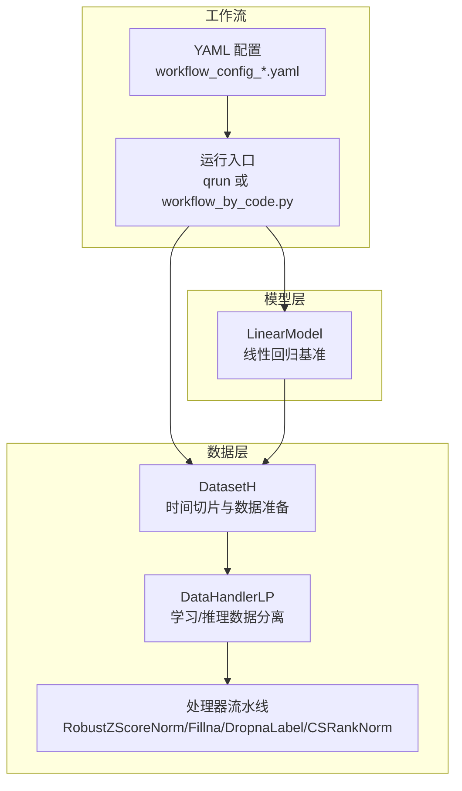
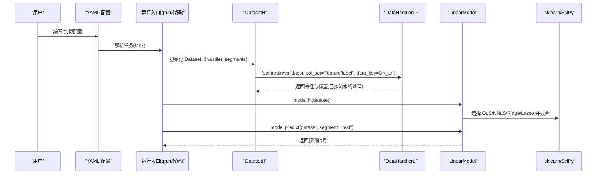
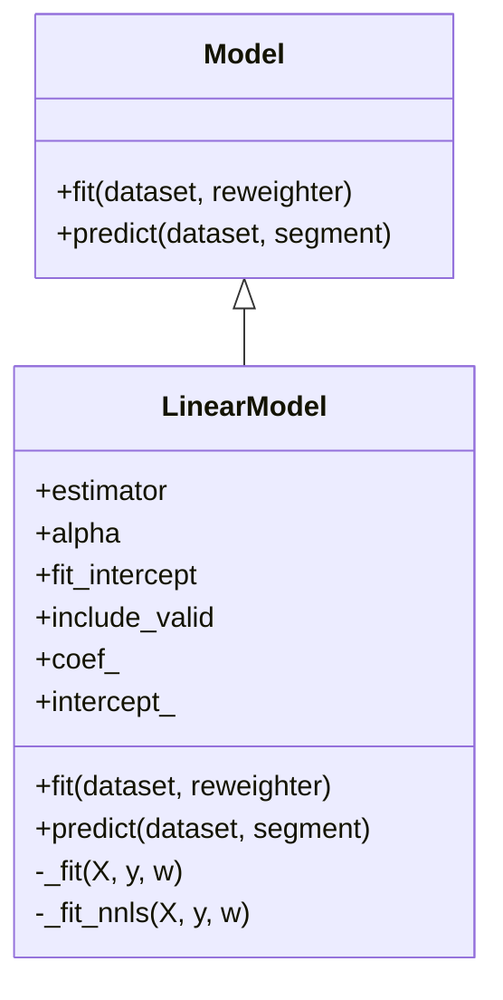
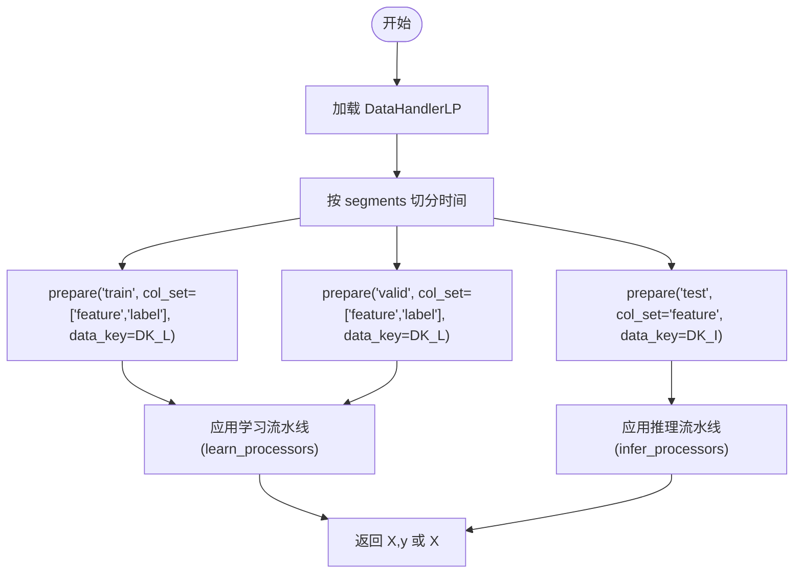
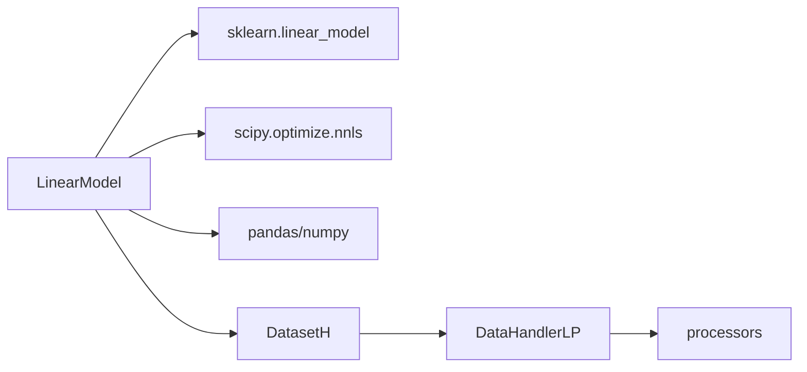

# Linear 基准模型

<cite>
**本文引用的文件**
- [linear.py](file://qlib/contrib/model/linear.py)
- [base.py](file://qlib/model/base.py)
- [handler.py](file://qlib/data/dataset/handler.py)
- [dataset/__init__.py](file://qlib/data/dataset/__init__.py)
- [contrib/data/handler.py](file://qlib/contrib/data/handler.py)
- [data/dataset/processor.py](file://qlib/data/dataset/processor.py)
- [workflow_config_linear_Alpha158.yaml](file://examples/benchmarks/Linear/workflow_config_linear_Alpha158.yaml)
- [workflow_config_linear_Alpha158_csi500.yaml](file://examples/benchmarks/Linear/workflow_config_linear_Alpha158_csi500.yaml)
- [workflow_config_linear_Alpha158_multi_pass_bt.yaml](file://examples/benchmarks/Linear/workflow_config_linear_Alpha158_multi_pass_bt.yaml)
- [workflow_by_code.py](file://examples/workflow_by_code.py)
</cite>

## 目录
1. [简介](#简介)
2. [项目结构](#项目结构)
3. [核心组件](#核心组件)
4. [架构总览](#架构总览)
5. [详细组件分析](#详细组件分析)
6. [依赖分析](#依赖分析)
7. [性能考虑](#性能考虑)
8. [故障排查指南](#故障排查指南)
9. [结论](#结论)
10. [附录：快速运行示例](#附录快速运行示例)

## 简介
本文件系统化解析 Qlib 中的 Linear 模型（最简线性回归基准），覆盖以下方面：
- Yaml 配置文件的字段含义与关键设置（特征输入、目标变量、训练方式、回测策略）
- 源码实现细节（最小二乘、非负最小二乘、岭回归、Lasso 的选择与调用路径）
- 数据流与处理链路（DataHandlerLP、DatasetH、处理器流水线）
- 轻量级运行示例（命令行与代码两种方式）
- 在强线性关系假设下的表现边界与适用场景

## 项目结构
Linear 模型位于 Qlib 的贡献模块中，配合数据处理器与工作流配置共同完成端到端实验。

图表来源
- [linear.py](file://qlib/contrib/model/linear.py#L1-L114)
- [handler.py](file://qlib/data/dataset/handler.py#L383-L787)
- [dataset/__init__.py](file://qlib/data/dataset/__init__.py#L72-L271)
- [workflow_config_linear_Alpha158.yaml](file://examples/benchmarks/Linear/workflow_config_linear_Alpha158.yaml#L1-L77)

章节来源
- [linear.py](file://qlib/contrib/model/linear.py#L1-L114)
- [handler.py](file://qlib/data/dataset/handler.py#L383-L787)
- [dataset/__init__.py](file://qlib/data/dataset/__init__.py#L72-L271)
- [workflow_config_linear_Alpha158.yaml](file://examples/benchmarks/Linear/workflow_config_linear_Alpha158.yaml#L1-L77)

## 核心组件
- LinearModel：封装 OLS、NNLS、Ridge、Lasso 四种估计器，支持可选截距与是否合并验证集参与训练。
- DataHandlerLP：将原始数据分为“推理”和“学习”两套处理流水线，并按 data_key 切换。
- DatasetH：根据 segments 时间切片从 DataHandlerLP 获取训练/验证/测试数据。
- 处理器（processors）：RobustZScoreNorm、Fillna、DropnaLabel、CSRankNorm 等，用于特征标准化、缺失填充、标签清洗与跨时点归一化。

章节来源
- [linear.py](file://qlib/contrib/model/linear.py#L1-L114)
- [base.py](file://qlib/model/base.py#L1-L111)
- [handler.py](file://qlib/data/dataset/handler.py#L383-L787)
- [dataset/__init__.py](file://qlib/data/dataset/__init__.py#L72-L271)
- [data/dataset/processor.py](file://qlib/data/dataset/processor.py#L98-L366)

## 架构总览
下面的序列图展示了从 Yaml 配置到模型训练与预测的关键调用链。

图表来源
- [workflow_config_linear_Alpha158.yaml](file://examples/benchmarks/Linear/workflow_config_linear_Alpha158.yaml#L45-L77)
- [dataset/__init__.py](file://qlib/data/dataset/__init__.py#L186-L248)
- [handler.py](file://qlib/data/dataset/handler.py#L674-L712)
- [linear.py](file://qlib/contrib/model/linear.py#L58-L114)

## 详细组件分析

### LinearModel 组件
- 支持的估计器
  - OLS：普通最小二乘
  - NNLS：非负最小二乘（约束系数非负）
  - Ridge：L2 正则
  - Lasso：L1 正则
- 关键参数
  - estimator：选择估计器类型
  - alpha：正则强度（仅在 Ridge/Lasso 生效）
  - fit_intercept：是否拟合截距
  - include_valid：是否将验证集合并进训练
- 训练流程
  - 从 DatasetH 准备训练数据（可选合并验证集），丢弃缺失样本
  - 可选权重重加权（Reweighter），传入 sklearn 拟合
  - NNLS 特殊处理：支持截距通过增广列实现；不支持样本权重
- 预测流程
  - 使用学到的系数与截距对测试集进行线性组合

图表来源
- [base.py](file://qlib/model/base.py#L22-L111)
- [linear.py](file://qlib/contrib/model/linear.py#L17-L114)

章节来源
- [linear.py](file://qlib/contrib/model/linear.py#L17-L114)

### 数据处理与流水线
- DataHandlerLP 将数据分为三份：
  - DK_R：原始数据
  - DK_I：推理数据（inference_processors）
  - DK_L：学习数据（learn_processors）
- DatasetH 根据 segments 切分时间区间，按 data_key 选择不同数据视图：
  - 训练阶段通常使用 DK_L（学习流水线）
  - 测试阶段使用 DK_I（推理流水线）

图表来源
- [dataset/__init__.py](file://qlib/data/dataset/__init__.py#L186-L248)
- [handler.py](file://qlib/data/dataset/handler.py#L383-L787)

章节来源
- [dataset/__init__.py](file://qlib/data/dataset/__init__.py#L72-L271)
- [handler.py](file://qlib/data/dataset/handler.py#L383-L787)

### 处理器与特征/标签预处理
- 特征预处理
  - RobustZScoreNorm：鲁棒 Z-score 归一化，可裁剪异常值
  - Fillna：按字段组填充缺失
- 标签预处理
  - DropnaLabel：按标签列删除缺失样本（仅学习阶段可用）
  - CSRankNorm：按日期跨股票排序并归一化，常用于 label

章节来源
- [data/dataset/processor.py](file://qlib/data/dataset/processor.py#L98-L366)
- [contrib/data/handler.py](file://qlib/contrib/data/handler.py#L98-L158)

### Yaml 配置解析（以 Alpha158 为例）
- 全局初始化
  - provider_uri：本地数据目录
  - region：区域（如 cn）
- 数据处理配置
  - start_time/end_time：全周期范围
  - fit_start_time/fit_end_time：拟合统计量的时间窗口
  - instruments：股票池（如 csi300 或 csi500）
  - infer_processors：推理阶段特征处理（如 RobustZScoreNorm、Fillna）
  - learn_processors：学习阶段处理（如 DropnaLabel、CSRankNorm）
- 任务配置
  - model：LinearModel，estimator=ols
  - dataset：DatasetH + Alpha158 处理器，segments 定义 train/valid/test
- 记录与回测
  - SignalRecord、SigAnaRecord、PortAnaRecord：记录信号、IC 分析与组合分析
  - 策略：TopkDropoutStrategy，基于模型输出信号进行下单

章节来源
- [workflow_config_linear_Alpha158.yaml](file://examples/benchmarks/Linear/workflow_config_linear_Alpha158.yaml#L1-L77)
- [workflow_config_linear_Alpha158_csi500.yaml](file://examples/benchmarks/Linear/workflow_config_linear_Alpha158_csi500.yaml#L1-L77)
- [workflow_config_linear_Alpha158_multi_pass_bt.yaml](file://examples/benchmarks/Linear/workflow_config_linear_Alpha158_multi_pass_bt.yaml#L1-L79)

## 依赖分析
- 内部依赖
  - LinearModel 继承自 Model 抽象基类，遵循统一的 fit/predict 接口
  - 通过 DatasetH/DataHandlerLP 获取特征与标签，遵循 data_key 与 col_set 约定
- 外部依赖
  - sklearn.linear_model：LinearRegression、Ridge、Lasso
  - scipy.optimize.nnls：非负最小二乘
  - pandas/numpy：数据结构与数值计算

图表来源
- [linear.py](file://qlib/contrib/model/linear.py#L1-L114)
- [dataset/__init__.py](file://qlib/data/dataset/__init__.py#L72-L271)
- [handler.py](file://qlib/data/dataset/handler.py#L383-L787)

章节来源
- [linear.py](file://qlib/contrib/model/linear.py#L1-L114)
- [base.py](file://qlib/model/base.py#L1-L111)

## 性能考虑
- 数据准备
  - 使用 DataHandlerLP 的学习/推理流水线可避免重复处理，提升效率
  - segments 切分与 data_key 选择直接影响特征/标签一致性
- 训练细节
  - OLS/Ridge/Lasso 直接调用 sklearn，适合中小规模问题
  - NNLS 使用 scipy.optimize.nnls，注意大矩阵时的内存与时间开销
- 预测阶段
  - 系数与截距一次性计算后，预测为向量化矩阵乘法，速度较快

[本节为通用建议，无需特定文件引用]

## 故障排查指南
- “空数据”错误
  - 现象：训练前数据被 dropna 后为空
  - 排查：检查数据源、时间窗口、处理器是否过度过滤
  - 参考路径：[linear.py](file://qlib/contrib/model/linear.py#L67-L69)
- “未拟合”预测
  - 现象：predict 前未 fit
  - 排查：确认 model.fit 已执行且 coef_ 已赋值
  - 参考路径：[linear.py](file://qlib/contrib/model/linear.py#L110-L114)
- “不支持样本权重”的 NNLS
  - 现象：使用 NNLS 且提供权重时报错
  - 排查：当前实现不支持 NNLS 权重；如需权重请改用 OLS/Ridge/Lasso
  - 参考路径：[linear.py](file://qlib/contrib/model/linear.py#L97-L100)
- “include_valid=True 但不存在验证集”
  - 现象：日志提示 valid 不存在
  - 排查：确认 segments 中定义了 valid；或关闭 include_valid
  - 参考路径：[linear.py](file://qlib/contrib/model/linear.py#L60-L66)

章节来源
- [linear.py](file://qlib/contrib/model/linear.py#L58-L114)

## 结论
Linear 模型在 Qlib 中提供了强线性关系假设下的最简基准。其优势在于：
- 易于解释：系数直观反映特征重要性
- 易于复现：配置驱动，便于快速验证数据质量与特征有效性
- 易于扩展：支持 OLS、NNLS、Ridge、Lasso 四种估计器，满足不同正则需求

局限性：
- 对非线性关系敏感度低
- 对异常值与多重共线性较为敏感（可通过 RobustZScoreNorm、Ridge/Lasso 缓解）
- 不支持 NNLS 权重与部分高级功能（TODO）

[本节为总结性内容，无需特定文件引用]

## 附录：快速运行示例

### 方式一：命令行（qrun）
- 进入 Linear 示例目录，使用 qrun 执行 Yaml 配置
  - 示例命令（以 Alpha158 为例）：
    - qrun examples/benchmarks/Linear/workflow_config_linear_Alpha158.yaml Linear
  - 如需更换市场（如 csi500）：
    - qrun examples/benchmarks/Linear/workflow_config_linear_Alpha158_csi500.yaml Linear

章节来源
- [workflow_config_linear_Alpha158.yaml](file://examples/benchmarks/Linear/workflow_config_linear_Alpha158.yaml#L1-L77)
- [workflow_config_linear_Alpha158_csi500.yaml](file://examples/benchmarks/Linear/workflow_config_linear_Alpha158_csi500.yaml#L1-L77)

### 方式二：代码直跑（workflow_by_code.py）
- 参考脚本中的模式，直接在 Python 中初始化数据与模型，然后 fit/predict 并生成记录
- 关键步骤
  - 初始化 Qlib 与数据（GetData().qlib_data(...)）
  - 初始化模型与数据集（init_instance_by_config）
  - 启动实验（R.start(...)）、保存对象、生成 Signal/SigAna/PortAna 记录

章节来源
- [workflow_by_code.py](file://examples/workflow_by_code.py#L1-L86)