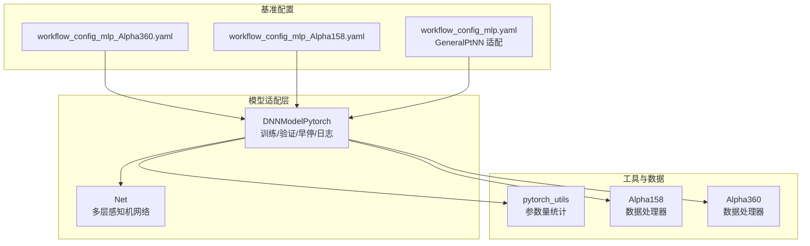
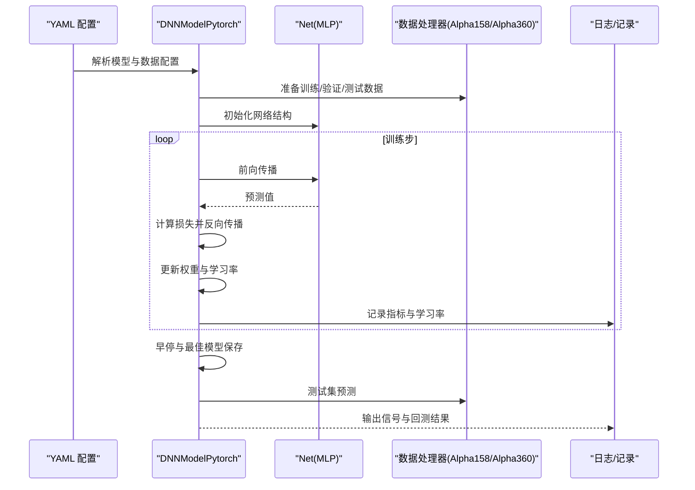
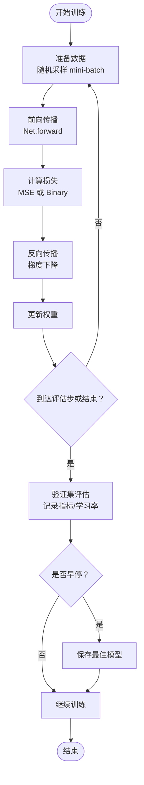
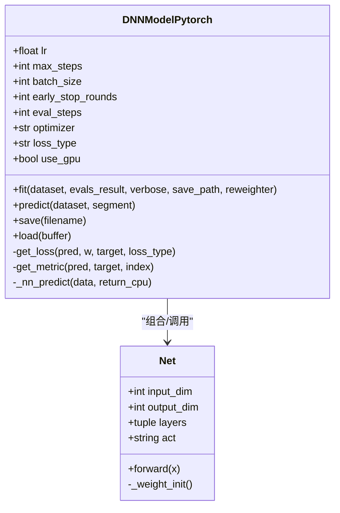
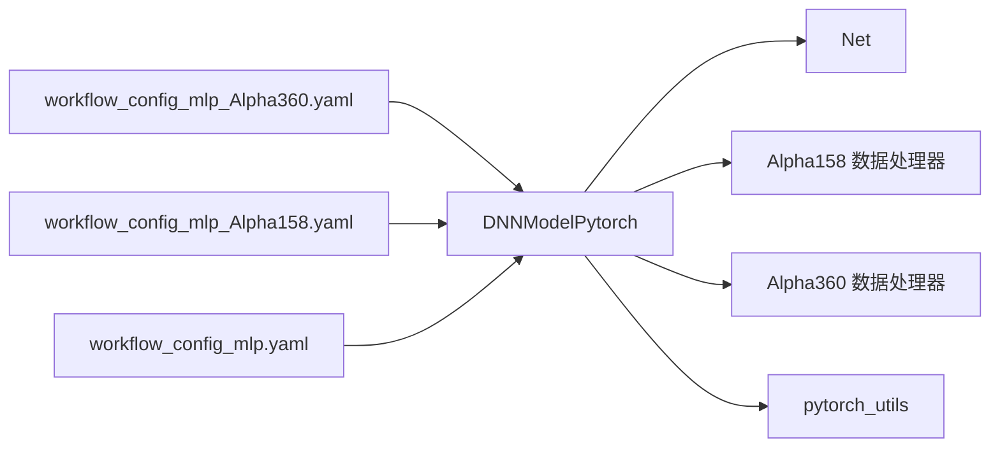

# MLP 基准模型

<cite>
**本文引用的文件列表**
- [pytorch_nn.py](file://qlib/contrib/model/pytorch_nn.py)
- [pytorch_utils.py](file://qlib/contrib/model/pytorch_utils.py)
- [workflow_config_mlp_Alpha360.yaml](file://examples/benchmarks/MLP/workflow_config_mlp_Alpha360.yaml)
- [workflow_config_mlp_Alpha158.yaml](file://examples/benchmarks/MLP/workflow_config_mlp_Alpha158.yaml)
- [workflow_config_mlp.yaml](file://examples/benchmarks/GeneralPtNN/workflow_config_mlp.yaml)
- [handler.py](file://qlib/contrib/data/handler.py)
- [handler.py](file://qlib/data/dataset/handler.py)
</cite>

## 目录
1. [简介](#简介)
2. [项目结构](#项目结构)
3. [核心组件](#核心组件)
4. [架构总览](#架构总览)
5. [详细组件分析](#详细组件分析)
6. [依赖关系分析](#依赖关系分析)
7. [性能考量](#性能考量)
8. [故障排查指南](#故障排查指南)
9. [结论](#结论)
10. [附录](#附录)

## 简介
本文件系统性解析 Qlib 中 MLP（多层感知机）的基准实现，作为基础神经网络模型的参考标准。内容覆盖：
- YAML 配置文件解析：隐藏层结构、激活函数、正则化方式、优化器与损失函数等关键参数
- 源码分析：基于 pytorch_nn.py 的前向传播与反向传播流程
- 运行示例与性能基线：通过基准工作流配置给出可复现实验路径
- 适用场景与局限性：在金融数据建模中的定位与边界

## 项目结构
MLP 在 Qlib 中由以下模块协同完成：
- 模型适配器：DNNModelPytorch（训练、验证、早停、日志、保存/加载）
- 网络结构：Net（多层全连接 + Dropout/BatchNorm + 可选激活）
- 工具函数：参数量统计
- 数据处理器：Alpha158/Alpha360 数据处理器
- 基准工作流：YAML 配置文件，定义数据、模型、训练策略与回测记录

图表来源
- [pytorch_nn.py](file://qlib/contrib/model/pytorch_nn.py#L38-L180)
- [pytorch_utils.py](file://qlib/contrib/model/pytorch_utils.py#L1-L38)
- [handler.py](file://qlib/contrib/data/handler.py#L48-L157)
- [workflow_config_mlp_Alpha360.yaml](file://examples/benchmarks/MLP/workflow_config_mlp_Alpha360.yaml#L47-L86)
- [workflow_config_mlp_Alpha158.yaml](file://examples/benchmarks/MLP/workflow_config_mlp_Alpha158.yaml#L59-L99)
- [workflow_config_mlp.yaml](file://examples/benchmarks/GeneralPtNN/workflow_config_mlp.yaml#L59-L99)

章节来源
- [pytorch_nn.py](file://qlib/contrib/model/pytorch_nn.py#L38-L180)
- [pytorch_utils.py](file://qlib/contrib/model/pytorch_utils.py#L1-L38)
- [handler.py](file://qlib/contrib/data/handler.py#L48-L157)
- [workflow_config_mlp_Alpha360.yaml](file://examples/benchmarks/MLP/workflow_config_mlp_Alpha360.yaml#L47-L86)
- [workflow_config_mlp_Alpha158.yaml](file://examples/benchmarks/MLP/workflow_config_mlp_Alpha158.yaml#L59-L99)
- [workflow_config_mlp.yaml](file://examples/benchmarks/GeneralPtNN/workflow_config_mlp.yaml#L59-L99)

## 核心组件
- DNNModelPytorch
  - 负责训练循环、早停、学习率调度、指标记录、模型保存/加载
  - 支持 MSE/BCEWithLogits 损失，支持 Adam/GD 优化器
  - 默认使用 ReduceLROnPlateau 学习率调度（兼容不同 PyTorch 版本）
- Net（MLP 网络）
  - 输入维度可配置，隐藏层由 layers 元组指定
  - 激活函数支持 LeakyReLU/SiLU；默认使用 LeakyReLU
  - 每个隐藏层包含：Linear → BatchNorm1d → 激活 → Dropout
  - 权重初始化采用 Kaiming 正态分布（leaky_relu）
- 参数量统计
  - 提供模型参数量统计工具，便于模型规模评估

章节来源
- [pytorch_nn.py](file://qlib/contrib/model/pytorch_nn.py#L38-L180)
- [pytorch_nn.py](file://qlib/contrib/model/pytorch_nn.py#L425-L463)
- [pytorch_utils.py](file://qlib/contrib/model/pytorch_utils.py#L1-L38)

## 架构总览
下图展示从 YAML 配置到模型训练与预测的整体流程。

图表来源
- [pytorch_nn.py](file://qlib/contrib/model/pytorch_nn.py#L189-L336)
- [handler.py](file://qlib/contrib/data/handler.py#L48-L157)
- [workflow_config_mlp_Alpha360.yaml](file://examples/benchmarks/MLP/workflow_config_mlp_Alpha360.yaml#L47-L86)
- [workflow_config_mlp_Alpha158.yaml](file://examples/benchmarks/MLP/workflow_config_mlp_Alpha158.yaml#L59-L99)

## 详细组件分析

### YAML 配置解析（隐藏层、激活、正则化等）
- 隐藏层结构
  - 通过 pt_model_kwargs.layers 指定每层神经元数量；默认单隐层（如 256）
  - input_dim 由数据特征维度决定（Alpha158 为 157，Alpha360 为 360）
- 激活函数
  - 默认激活为 LeakyReLU；可通过 pt_model_kwargs.act 切换为 SiLU
- 正则化
  - weight_decay 控制 L2 正则强度
  - Dropout 比例固定为 0.05（输入与输出层各一次）
  - BatchNorm1d 应用于每个隐藏层
- 优化器与损失
  - optimizer 支持 adam/gd；loss 支持 mse/binary
  - binary 场景使用 BCEWithLogitsLoss
- 训练超参
  - lr、max_steps、batch_size、early_stop_rounds、eval_steps 等
- 数据与回测
  - 使用 DatasetH + Alpha158/Alpha360 处理器
  - 回测策略与记录器在 YAML 中定义

章节来源
- [workflow_config_mlp_Alpha360.yaml](file://examples/benchmarks/MLP/workflow_config_mlp_Alpha360.yaml#L47-L86)
- [workflow_config_mlp_Alpha158.yaml](file://examples/benchmarks/MLP/workflow_config_mlp_Alpha158.yaml#L59-L99)
- [workflow_config_mlp.yaml](file://examples/benchmarks/GeneralPtNN/workflow_config_mlp.yaml#L59-L99)
- [pytorch_nn.py](file://qlib/contrib/model/pytorch_nn.py#L425-L463)

### 前向传播与反向传播流程（pytorch_nn.py）
- 训练主循环
  - 随机采样 mini-batch，前向得到预测，计算加权损失，反向传播，更新权重
  - 定期（eval_steps）在验证集上评估，记录指标与学习率
  - 早停：若验证指标未改善超过 early_stop_rounds，则停止
  - 最佳模型保存：以验证指标最优时的权重作为最终模型
- 前向传播
  - Net.forward 依次执行各层（Linear → BatchNorm1d → 激活 → Dropout），最后线性映射到输出
- 损失与指标
  - MSE：均方误差，支持样本权重
  - Binary：BCEWithLogitsLoss
  - 指标：使用 IC（信息系数）作为排序相关性度量（负号用于最小化）

图表来源
- [pytorch_nn.py](file://qlib/contrib/model/pytorch_nn.py#L189-L336)
- [pytorch_nn.py](file://qlib/contrib/model/pytorch_nn.py#L425-L463)

章节来源
- [pytorch_nn.py](file://qlib/contrib/model/pytorch_nn.py#L189-L336)
- [pytorch_nn.py](file://qlib/contrib/model/pytorch_nn.py#L425-L463)

### 类关系与数据结构（Net 与 DNNModelPytorch）

图表来源
- [pytorch_nn.py](file://qlib/contrib/model/pytorch_nn.py#L38-L180)
- [pytorch_nn.py](file://qlib/contrib/model/pytorch_nn.py#L425-L463)

章节来源
- [pytorch_nn.py](file://qlib/contrib/model/pytorch_nn.py#L38-L180)
- [pytorch_nn.py](file://qlib/contrib/model/pytorch_nn.py#L425-L463)

### 运行示例与性能基线
- 运行方式
  - 使用 YAML 配置文件启动基准实验，例如：
    - Alpha360：workflow_config_mlp_Alpha360.yaml
    - Alpha158：workflow_config_mlp_Alpha158.yaml
    - 通用 MLP（GeneralPtNN 适配）：workflow_config_mlp.yaml
- 关键参数示例
  - Alpha360：input_dim=360，batch_size=4096，lr=0.002，optimizer=adam，loss=mse
  - Alpha158：input_dim=157，batch_size=8192，weight_decay=0.0002，optimizer=adam
- 性能基线建议
  - 以验证集指标（如负 IC）作为主要评估指标
  - 记录训练耗时、显存占用、收敛步数与早停步数
  - 对比不同激活（LeakyReLU vs SiLU）、不同层数与宽度对性能的影响

章节来源
- [workflow_config_mlp_Alpha360.yaml](file://examples/benchmarks/MLP/workflow_config_mlp_Alpha360.yaml#L47-L86)
- [workflow_config_mlp_Alpha158.yaml](file://examples/benchmarks/MLP/workflow_config_mlp_Alpha158.yaml#L59-L99)
- [workflow_config_mlp.yaml](file://examples/benchmarks/GeneralPtNN/workflow_config_mlp.yaml#L59-L99)

## 依赖关系分析
- 组件耦合
  - DNNModelPytorch 依赖 Net 网络结构与数据处理器（Alpha158/Alpha360）
  - 通过 init_instance_by_config 动态实例化网络，便于替换不同模型
- 外部依赖
  - PyTorch（优化器、损失、调度器、批归一化）
  - scikit-learn（指标计算）
- 潜在环依赖
  - 无直接环依赖；配置文件仅声明类名与参数，不直接导入模型实现

图表来源
- [pytorch_nn.py](file://qlib/contrib/model/pytorch_nn.py#L38-L180)
- [handler.py](file://qlib/contrib/data/handler.py#L48-L157)
- [workflow_config_mlp_Alpha360.yaml](file://examples/benchmarks/MLP/workflow_config_mlp_Alpha360.yaml#L47-L86)
- [workflow_config_mlp_Alpha158.yaml](file://examples/benchmarks/MLP/workflow_config_mlp_Alpha158.yaml#L59-L99)
- [workflow_config_mlp.yaml](file://examples/benchmarks/GeneralPtNN/workflow_config_mlp.yaml#L59-L99)

章节来源
- [pytorch_nn.py](file://qlib/contrib/model/pytorch_nn.py#L38-L180)
- [handler.py](file://qlib/contrib/data/handler.py#L48-L157)
- [workflow_config_mlp_Alpha360.yaml](file://examples/benchmarks/MLP/workflow_config_mlp_Alpha360.yaml#L47-L86)
- [workflow_config_mlp_Alpha158.yaml](file://examples/benchmarks/MLP/workflow_config_mlp_Alpha158.yaml#L59-L99)
- [workflow_config_mlp.yaml](file://examples/benchmarks/GeneralPtNN/workflow_config_mlp.yaml#L59-L99)

## 性能考量
- 计算效率
  - 批大小与设备选择对吞吐影响显著；建议根据显存上限调整 batch_size
  - 使用 ReduceLROnPlateau 自适应学习率有助于稳定收敛
- 内存管理
  - 训练时将数据移至 GPU 会显著提升速度，但需注意显存限制
  - 验证阶段可按批预测，避免一次性载入全部数据
- 正则化与过拟合
  - Dropout 与 BatchNorm1d 有助于泛化；weight_decay 控制 L2 正则强度
  - 早停机制防止过拟合
- 激活函数与初始化
  - Kaiming 初始化与 LeakyReLU/SiLU 适合深层网络；可尝试不同激活观察效果

[本节为通用指导，无需列出具体文件来源]

## 故障排查指南
- 常见问题
  - 设备不可用：确认 GPU 是否可用，或设置 GPU=-1 使用 CPU
  - 激活函数不支持：确保 act 为 LeakyReLU 或 SiLU
  - 损失类型不支持：loss 仅支持 mse/binary
  - 数据形状异常：确保输入维度与 input_dim 一致
- 日志与指标
  - 训练日志包含 train_loss、val_loss、train_metric、val_metric、学习率等
  - 若验证指标长时间不改善，检查 early_stop_rounds 与学习率设置
- 模型保存与加载
  - 保存路径与格式遵循 Qlib 规范；加载时需重建模型结构后恢复权重

章节来源
- [pytorch_nn.py](file://qlib/contrib/model/pytorch_nn.py#L122-L146)
- [pytorch_nn.py](file://qlib/contrib/model/pytorch_nn.py#L337-L404)

## 结论
Qlib 的 MLP 基准实现提供了简洁而稳健的神经网络框架：
- 配置灵活：通过 YAML 快速切换数据集、网络结构与训练策略
- 实现清晰：DNNModelPytorch 封装了完整的训练/验证/早停流程，Net 提供标准的多层感知机结构
- 易于扩展：通过 pt_model_uri 可接入任意 PyTorch 模型，便于与更复杂模型对比
- 适用场景：适合作为金融信号回归任务的基线模型，尤其在特征工程完善、标签噪声可控的情况下表现稳定；对于高维时序建模，可进一步引入注意力/图卷积等结构

[本节为总结性内容，无需列出具体文件来源]

## 附录
- 数据处理器
  - Alpha158/Alpha360 提供标准化的特征与标签生成流程，适配 MLP 的输入维度
- 参数量统计
  - 使用 pytorch_utils.count_parameters 评估模型规模，辅助资源规划

章节来源
- [handler.py](file://qlib/contrib/data/handler.py#L48-L157)
- [pytorch_utils.py](file://qlib/contrib/model/pytorch_utils.py#L1-L38)