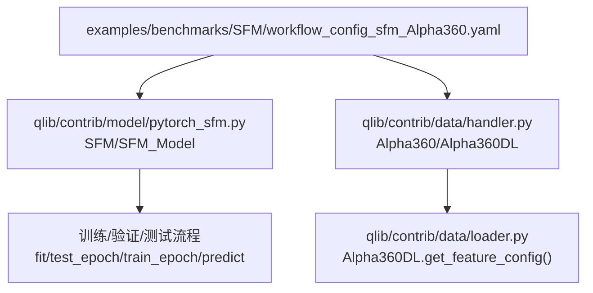
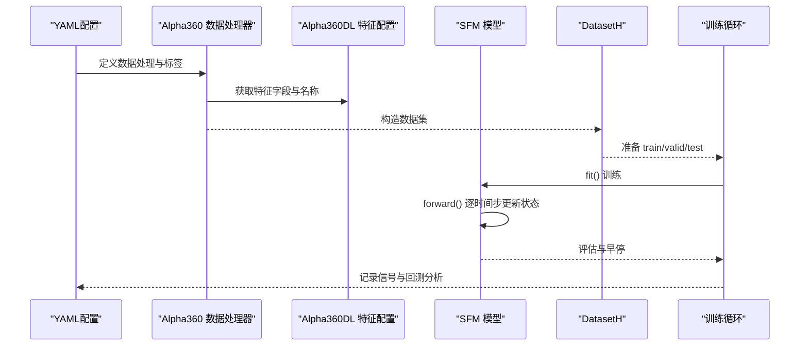
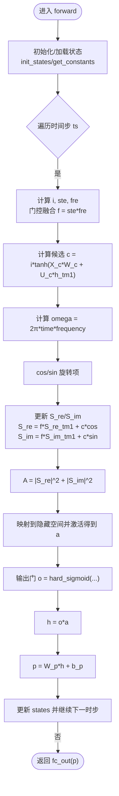
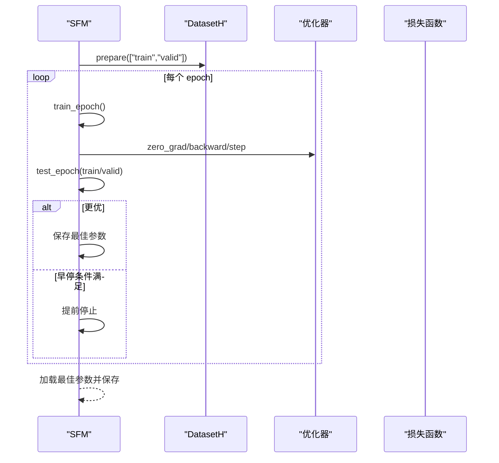
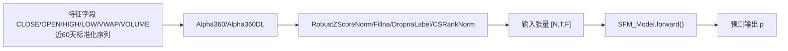
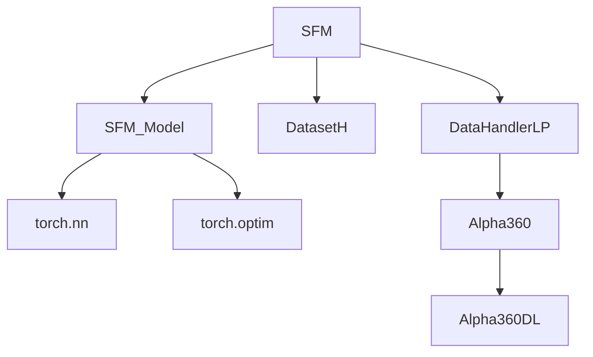

# SFM 基准模型

<cite>
**本文引用的文件列表**
- [pytorch_sfm.py](file://qlib/contrib/model/pytorch_sfm.py)
- [workflow_config_sfm_Alpha360.yaml](file://examples/benchmarks/SFM/workflow_config_sfm_Alpha360.yaml)
- [README.md（SFM 示例）](file://examples/benchmarks/SFM/README.md)
- [handler.py](file://qlib/contrib/data/handler.py)
- [loader.py](file://qlib/contrib/data/loader.py)
- [run_all_model.py](file://examples/run_all_model.py)
</cite>

## 目录
1. [简介](#简介)
2. [项目结构](#项目结构)
3. [核心组件](#核心组件)
4. [架构总览](#架构总览)
5. [详细组件分析](#详细组件分析)
6. [依赖关系分析](#依赖关系分析)
7. [性能考量](#性能考量)
8. [故障排查指南](#故障排查指南)
9. [结论](#结论)
10. [附录](#附录)

## 简介
本文件系统化解析 Qlib 中 SFM（State-Frequency Memory）基准模型的实现，重点阐述其在“时域-频域联合建模”方面的设计思想与代码落地。SFM 将离散傅里叶变换的思想引入循环神经网络的记忆单元中，通过复数形式的频率分量对隐藏状态进行分解与累积，从而在历史市场数据中挖掘多周期交易模式并用于股价预测。本文将从 YAML 配置入手，解析频域变换方式、状态更新机制与训练策略，并结合 pytorch_sfm.py 的核心计算逻辑进行深入剖析，最后给出运行示例、结果评估方法以及对噪声与参数敏感性的讨论。

## 项目结构
SFM 在 Qlib 中由三部分组成：
- 模型实现：位于贡献模块的 PyTorch 实现，包含 SFM_Model（核心计算）与 SFM（训练与推理封装）
- 数据处理器：Alpha360 数据处理器与对应的特征配置，提供近 60 天的标准化价格序列作为输入
- 工作流配置：示例 YAML，定义数据集划分、预处理流程、模型超参与记录器

图表来源
- [workflow_config_sfm_Alpha360.yaml](file://examples/benchmarks/SFM/workflow_config_sfm_Alpha360.yaml#L1-L91)
- [pytorch_sfm.py](file://qlib/contrib/model/pytorch_sfm.py#L180-L461)
- [handler.py](file://qlib/contrib/data/handler.py#L48-L91)
- [loader.py](file://qlib/contrib/data/loader.py#L16-L59)

章节来源
- [workflow_config_sfm_Alpha360.yaml](file://examples/benchmarks/SFM/workflow_config_sfm_Alpha360.yaml#L1-L91)
- [pytorch_sfm.py](file://qlib/contrib/model/pytorch_sfm.py#L180-L461)
- [handler.py](file://qlib/contrib/data/handler.py#L48-L91)
- [loader.py](file://qlib/contrib/data/loader.py#L16-L59)

## 核心组件
- SFM_Model（核心计算单元）
  - 输入维度 d_feat，隐藏维度 hidden_size，输出维度 output_dim，频域维度 freq_dim
  - 使用正交初始化权重 U，Xavier 初始化权重 W，激活函数为 Tanh 与 Hardsigmoid
  - 内部维护状态向量，包含上一时刻的输出 p、隐藏状态 h、复数频域分量 S_re/S_im、时间步 time、以及常量缓存 B_U/B_W/frequency
  - forward 过程按时间步迭代，每步计算门控项 ste/fre、状态融合 f、候选值 c、频率旋转项 omega 并更新 S_re/S_im，最终得到输出 h 与 p

- SFM（训练与推理封装）
  - 负责超参设置、优化器选择（Adam/GD）、损失函数（仅支持 MSE，掩码 NaN）、指标（默认用负损失）
  - fit 流程：准备训练/验证集，按 epoch 训练与评估，早停保存最优参数
  - test_epoch/predict 提供评估与预测接口

章节来源
- [pytorch_sfm.py](file://qlib/contrib/model/pytorch_sfm.py#L25-L179)
- [pytorch_sfm.py](file://qlib/contrib/model/pytorch_sfm.py#L180-L461)

## 架构总览
SFM 的整体工作流如下：
- 数据层：Alpha360 提供近 60 天的标准化价格序列（CLOSE/OPEN/HIGH/LOW/VWAP/Volume），并按 day 频率组织
- 处理层：RobustZScoreNorm、Fillna、DropnaLabel、CSRankNorm 等处理器完成归一化与标签构造
- 模型层：SFM 将输入重排为 [N, T, F]，逐时间步更新状态，融合时域与频域信息
- 训练层：DatasetH 划分 train/valid/test，SFM.fit 执行训练与早停，记录器产出信号与组合分析

图表来源
- [workflow_config_sfm_Alpha360.yaml](file://examples/benchmarks/SFM/workflow_config_sfm_Alpha360.yaml#L1-L91)
- [handler.py](file://qlib/contrib/data/handler.py#L48-L91)
- [loader.py](file://qlib/contrib/data/loader.py#L16-L59)
- [pytorch_sfm.py](file://qlib/contrib/model/pytorch_sfm.py#L360-L415)

## 详细组件分析

### SFM_Model：时域-频域联合建模
- 输入格式与重排
  - 输入被重塑为 [N, F, T] 后转置为 [N, T, F]，按时间步 ts 迭代
- 状态初始化与常量缓存
  - init_states：初始化 p/h/S_re/S_im/time，并根据隐藏维度与频域维度生成初始复数频谱
  - get_constants：缓存 B_U/B_W（缩放因子）与 frequency（频率向量数组）
- 门控与融合
  - 计算 i、ste、fre 三个门控项，分别对应时域记忆、状态-频域融合强度、频域特征
  - ste 与 fre 经 reshape 后做外积 f，形成“状态×频域”的耦合矩阵
- 频域更新与幅度聚合
  - 依据时间步 time 与 frequency 计算 omega，以 cos/sin 形成旋转项
  - 更新 S_re/S_im：S_re = f*S_re_tm1 + c*cos，S_im = f*S_im_tm1 + c*sin
  - A = |S_re|^2 + |S_im|^2，映射到隐藏空间后经线性层与激活得到 a
- 输出与状态推进
  - o 为输出门，h = o*a，p = W_p*h + b_p
  - 更新 states：p、h、S_re、S_im、time，并清空后续缓存

图表来源
- [pytorch_sfm.py](file://qlib/contrib/model/pytorch_sfm.py#L77-L139)

章节来源
- [pytorch_sfm.py](file://qlib/contrib/model/pytorch_sfm.py#L77-L139)

### SFM：训练与推理
- 超参与设备
  - 支持 d_feat、hidden_size、output_dim、freq_dim、dropout_W/U、n_epochs、lr、batch_size、early_stop、eval_steps、loss、optimizer、GPU、seed 等
  - 自动选择 CUDA 或 CPU 设备
- 优化器与损失
  - Adam 或 SGD；损失函数仅支持 MSE，掩码 NaN 样本
- 训练流程
  - fit：准备 train/valid，按 epoch 训练与评估，早停保存最佳参数
  - test_epoch：批量评估损失与指标
  - train_epoch：随机打乱索引，分批前向、反向与梯度裁剪
- 预测
  - predict：按 batch 推理，返回带索引的 Series

图表来源
- [pytorch_sfm.py](file://qlib/contrib/model/pytorch_sfm.py#L336-L415)

章节来源
- [pytorch_sfm.py](file://qlib/contrib/model/pytorch_sfm.py#L180-L461)

### 数据配置与频域变换方式
- Alpha360 特征
  - 提供近 60 天的 CLOSE/OPEN/HIGH/LOW/VWAP/Volume 的标准化序列，作为时域输入
  - 特征字段与名称由 Alpha360DL.get_feature_config() 生成
- 标签
  - 使用相对收益差分构造 label，如 Ref($close, -2)/Ref($close, -1) - 1
- 频域变换
  - SFM 通过复数频域分量 S_re/S_im 对隐藏状态进行累积与旋转，频率向量由 get_constants 生成，随时间步累加形成 omega

图表来源
- [loader.py](file://qlib/contrib/data/loader.py#L16-L59)
- [handler.py](file://qlib/contrib/data/handler.py#L48-L91)
- [workflow_config_sfm_Alpha360.yaml](file://examples/benchmarks/SFM/workflow_config_sfm_Alpha360.yaml#L1-L91)

章节来源
- [loader.py](file://qlib/contrib/data/loader.py#L16-L59)
- [handler.py](file://qlib/contrib/data/handler.py#L48-L91)
- [workflow_config_sfm_Alpha360.yaml](file://examples/benchmarks/SFM/workflow_config_sfm_Alpha360.yaml#L1-L91)

### YAML 配置解析
- 全局初始化与市场/基准
  - provider_uri、region、market、benchmark 等
- 数据处理器
  - start_time/end_time、fit_start_time/fit_end_time、instruments
  - infer_processors：RobustZScoreNorm（feature）、Fillna（feature）
  - learn_processors：DropnaLabel、CSRankNorm（label）
  - label：相对收益差分表达式
- 任务配置
  - model：class 指向 SFM，module_path 指向 pytorch_sfm，kwargs 包含 d_feat、hidden_size、output_dim、freq_dim、dropout_W/U、n_epochs、lr、batch_size、early_stop、eval_steps、loss、optimizer、GPU
  - dataset：class 指向 DatasetH，handler 为 Alpha360，segments 划分 train/valid/test
  - record：SignalRecord、SigAnaRecord、PortAnaRecord

章节来源
- [workflow_config_sfm_Alpha360.yaml](file://examples/benchmarks/SFM/workflow_config_sfm_Alpha360.yaml#L1-L91)

### 运行示例与结果分析方法
- 运行方式
  - 可直接使用示例 YAML 配置进行端到端实验
  - 也可参考 run_all_model.py 的通用脚本，批量运行各基准模型并汇总指标
- 结果分析
  - 信号记录：SignalRecord 输出预测信号
  - IC/Rank IC：衡量信号与未来收益的相关性
  - 回测分析：PortAnaRecord 基于 TopkDropoutStrategy 生成组合分析报告
  - 收益与风险：年化超额收益、信息比率、最大回撤等

章节来源
- [workflow_config_sfm_Alpha360.yaml](file://examples/benchmarks/SFM/workflow_config_sfm_Alpha360.yaml#L66-L91)
- [run_all_model.py](file://examples/run_all_model.py#L133-L186)

## 依赖关系分析
- 模块内依赖
  - SFM 依赖 SFM_Model 与 DatasetH、DataHandlerLP
  - SFM_Model 依赖 torch.nn、torch.optim、init、np、pd
- 数据依赖
  - Alpha360/Alpha360DL 提供特征与标签配置
  - RobustZScoreNorm、Fillna、DropnaLabel、CSRankNorm 等处理器构成数据管线
- 外部依赖
  - torch、numpy、pandas、ruamel.yaml、fire（run_all_model）

图表来源
- [pytorch_sfm.py](file://qlib/contrib/model/pytorch_sfm.py#L180-L303)
- [handler.py](file://qlib/contrib/data/handler.py#L48-L91)
- [loader.py](file://qlib/contrib/data/loader.py#L16-L59)

章节来源
- [pytorch_sfm.py](file://qlib/contrib/model/pytorch_sfm.py#L180-L303)
- [handler.py](file://qlib/contrib/data/handler.py#L48-L91)
- [loader.py](file://qlib/contrib/data/loader.py#L16-L59)

## 性能考量
- 计算复杂度
  - 时间步 T 的前向计算包含矩阵乘法与三角函数，整体复杂度约 O(T*F*H + T*H*Freq)，其中 H 为隐藏维度，Freq 为频域维度
- 内存占用
  - 需要存储每个样本在 T 步内的状态（p、h、S_re、S_im、time），显存开销与 T、H、Freq 成正比
- 训练稳定性
  - 使用梯度裁剪与早停，有助于缓解梯度爆炸与过拟合
- 并行与批处理
  - 训练与评估采用分批处理，可提升吞吐；预测阶段建议使用较大的 batch_size 以减少重复初始化开销

[本节为一般性指导，不直接分析具体文件]

## 故障排查指南
- 数据为空或形状不匹配
  - 确认 DatasetH.prepare 返回的 train/valid/test 不为空
  - 检查 d_feat 与实际特征维度一致
- 模型未拟合即预测
  - predict 前需先调用 fit，否则会抛出异常
- 优化器不支持
  - 当前仅支持 adam/gd，其他名称会触发异常
- 损失/指标未知
  - loss 仅支持 mse；metric 默认 loss，其他名称会报错
- GPU 可用性
  - 若 GPU 不可用，自动回退到 CPU；请检查 CUDA 环境与 GPU ID

章节来源
- [pytorch_sfm.py](file://qlib/contrib/model/pytorch_sfm.py#L360-L415)
- [pytorch_sfm.py](file://qlib/contrib/model/pytorch_sfm.py#L294-L303)
- [pytorch_sfm.py](file://qlib/contrib/model/pytorch_sfm.py#L416-L435)

## 结论
SFM 在 Qlib 中实现了将频域思想融入循环记忆单元的创新路径：通过复数频域分量 S_re/S_im 对隐藏状态进行旋转与累积，结合时域门控与状态-频域融合，形成对多周期交易模式的联合建模能力。配合 Alpha360 的标准化时序特征与稳健的数据处理流程，SFM 在高频交易信号提取方面具备一定潜力。实践中可通过调整频域维度、隐藏维度与门控融合强度等超参，结合早停与正则化策略，进一步提升稳定性与泛化性能。

[本节为总结性内容，不直接分析具体文件]

## 附录

### 参数敏感性与鲁棒性建议
- 频域维度（freq_dim）
  - 增大可提升对多周期模式的捕捉能力，但会增加计算与内存开销；建议从较小值开始网格搜索
- 隐藏维度（hidden_size）
  - 与 freq_dim 协同影响表达能力；过大易过拟合，过小可能欠拟合
- Dropout（dropout_W/dropout_U）
  - 在权重与状态转移上施加稀疏化，有助于缓解过拟合
- 学习率（lr）与优化器
  - Adam 在大多数情况下更稳定；SGD 需更谨慎的 lr 设置
- 数据预处理
  - RobustZScoreNorm 与 Fillna 对噪声与缺失值有显著鲁棒性；CSRankNorm 有助于标签分布稳定

[本节为一般性指导，不直接分析具体文件]