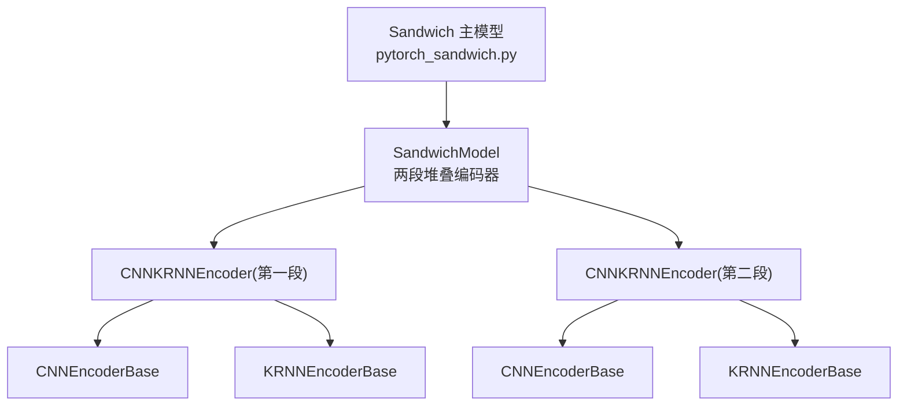
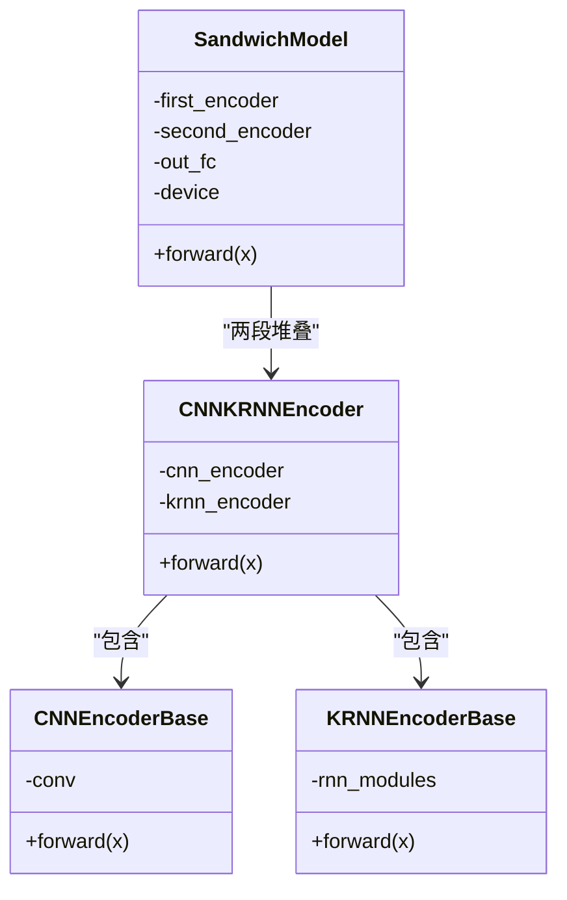
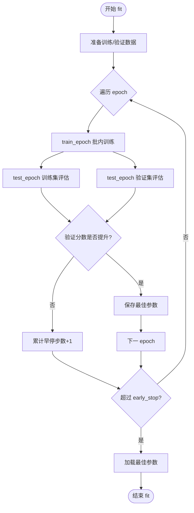
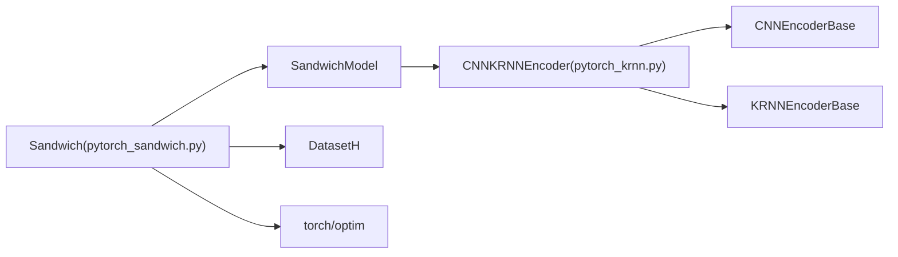

# Sandwich 基准模型

<cite>
**本文引用的文件**
- [pytorch_sandwich.py](file://qlib/contrib/model/pytorch_sandwich.py)
- [pytorch_krnn.py](file://qlib/contrib/model/pytorch_krnn.py)
- [workflow_config_sandwich_Alpha360.yaml](file://examples/benchmarks/Sandwich/workflow_config_sandwich_Alpha360.yaml)
- [README.md（Sandwich 示例）](file://examples/benchmarks/Sandwich/README.md)
- [benchmarks 汇总表](file://examples/benchmarks/README.md)
</cite>

## 目录
1. [简介](#简介)
2. [项目结构](#项目结构)
3. [核心组件](#核心组件)
4. [架构总览](#架构总览)
5. [详细组件分析](#详细组件分析)
6. [依赖关系分析](#依赖关系分析)
7. [性能考量](#性能考量)
8. [故障排查指南](#故障排查指南)
9. [结论](#结论)
10. [附录](#附录)

## 简介
本文件系统化阐述 Qlib 中 Sandwich 基准模型的实现架构与设计理念，重点解析其“多层堆叠”的复合建模思路：通过两段 CNN+KRNN 编码器堆叠形成“三明治式”特征提取路径，并在末端使用全连接层输出预测值。文档同时结合 YAML 配置文件说明子模型组合方式与训练参数设置，基于源码分析模型集成机制（此处为单模型而非多模型集成），并给出完整的运行流程与性能对比参考，最后讨论模型复杂度与泛化能力之间的权衡。

## 项目结构
Sandwich 模型位于 Qlib 贡献模块中，核心实现由两部分组成：
- Sandwich 主模型：负责超参管理、训练/验证/早停、预测等全流程控制
- 编码器子模块：由 CNNKRNNEncoder 组成，提供两段堆叠编码能力



图表来源
- [pytorch_sandwich.py](file://qlib/contrib/model/pytorch_sandwich.py#L25-L95)
- [pytorch_krnn.py](file://qlib/contrib/model/pytorch_krnn.py#L28-L179)

章节来源
- [pytorch_sandwich.py](file://qlib/contrib/model/pytorch_sandwich.py#L25-L95)
- [pytorch_krnn.py](file://qlib/contrib/model/pytorch_krnn.py#L28-L179)

## 核心组件
- Sandwich（主模型）
  - 负责超参初始化、优化器选择、设备选择、训练循环、早停与保存、预测推理
  - 使用 DatasetH 准备训练/验证/测试集，支持按 epoch 迭代与批内训练
- SandwichModel（网络主体）
  - 两段堆叠编码器：first_encoder → second_encoder
  - 末端线性层输出标量预测
- CNNKRNNEncoder（编码器）
  - 先经 CNNEncoderBase（1D 卷积）提取时序局部模式
  - 再经 KRNNEncoderBase（K 并行 GRU，平均聚合）捕获序列动态依赖
- KRNN（对比参考）
  - 单段 CNN+KRNN 的简化版本，便于理解 Sandwich 的堆叠思想

章节来源
- [pytorch_sandwich.py](file://qlib/contrib/model/pytorch_sandwich.py#L97-L382)
- [pytorch_krnn.py](file://qlib/contrib/model/pytorch_krnn.py#L28-L223)

## 架构总览
Sandwich 的整体流程如下：YAML 配置指定模型类与参数；Workflow 加载配置后实例化 Sandwich；随后进行数据准备、训练、早停、保存与预测。

```mermaid
sequenceDiagram
participant Y as "YAML 配置"
participant W as "Workflow"
participant M as "Sandwich"
participant DS as "DatasetH"
participant ENC as "SandwichModel/CNNKRNNEncoder"
participant OPT as "优化器"
Y->>W : 指定模型类与参数
W->>M : 实例化 Sandwich
M->>DS : prepare(["train","valid","test"])
M->>M : 训练循环(多轮epoch)
M->>ENC : 前向传播
ENC-->>M : 序列编码表示
M->>OPT : 反向传播与参数更新
M->>M : 早停判断与最佳参数保存
M->>DS : predict(segment="test")
M->>ENC : 前向传播
ENC-->>M : 预测结果
M-->>W : 返回预测序列
```

图表来源
- [workflow_config_sandwich_Alpha360.yaml](file://examples/benchmarks/Sandwich/workflow_config_sandwich_Alpha360.yaml#L46-L91)
- [pytorch_sandwich.py](file://qlib/contrib/model/pytorch_sandwich.py#L302-L382)

## 详细组件分析

### SandwichModel（两段堆叠编码器）
- 设计要点
  - 第一段编码器：输入特征维度经 CNN 提取局部特征，再由 K 并行 GRU 捕获序列动态
  - 第二段编码器：将第一段输出作为新的输入继续编码，形成深层抽象
  - 末端线性层对最后一时刻的隐藏状态做回归输出
- 数据流
  - 输入形状：[batch_size, node_num, seq_len, input_dim]
  - 输出形状：[batch_size]



图表来源
- [pytorch_sandwich.py](file://qlib/contrib/model/pytorch_sandwich.py#L25-L95)
- [pytorch_krnn.py](file://qlib/contrib/model/pytorch_krnn.py#L28-L179)

章节来源
- [pytorch_sandwich.py](file://qlib/contrib/model/pytorch_sandwich.py#L25-L95)
- [pytorch_krnn.py](file://qlib/contrib/model/pytorch_krnn.py#L28-L179)

### Sandwich（训练与预测控制）
- 超参与设备
  - 支持 fea_dim、cnn_dim_1/2、cnn_kernel_size、rnn_dim_1/2、rnn_dups、rnn_layers、dropout、n_epochs、lr、batch_size、early_stop、loss、optimizer、GPU 等
  - 自动选择 CPU/GPU 设备
- 训练流程
  - 分批随机打乱索引，前向计算损失，反向传播，梯度裁剪，优化器更新
  - 每轮评估训练/验证分数，采用早停策略保存最佳参数
- 预测流程
  - 对测试集分批前向，汇总预测结果为 Series



图表来源
- [pytorch_sandwich.py](file://qlib/contrib/model/pytorch_sandwich.py#L302-L382)

章节来源
- [pytorch_sandwich.py](file://qlib/contrib/model/pytorch_sandwich.py#L97-L382)

### YAML 配置解析（Sandwich）
- 模型类与模块路径
  - class: Sandwich
  - module_path: qlib.contrib.model.pytorch_sandwich
- 关键超参
  - fea_dim、cnn_dim_1、cnn_dim_2、cnn_kernel_size、rnn_dim_1、rnn_dim_2、rnn_dups、rnn_layers、n_epochs、lr、early_stop、batch_size、metric、GPU
- 数据集与处理器
  - dataset.class: DatasetH
  - handler.class: Alpha360
  - segments: train/valid/test 时间切片
- 记录器
  - SignalRecord、SigAnaRecord、PortAnaRecord 用于信号记录、IC 分析与组合回测分析

章节来源
- [workflow_config_sandwich_Alpha360.yaml](file://examples/benchmarks/Sandwich/workflow_config_sandwich_Alpha360.yaml#L46-L91)

### 模型集成机制说明
- 本实现为单模型 Sandwich，未见多模型集成或权重融合策略的代码证据
- 若需实现多模型融合，可在上层 Workflow 或自定义 Record 层添加集成逻辑（例如加权平均、投票等），但当前仓库未包含此类实现

章节来源
- [pytorch_sandwich.py](file://qlib/contrib/model/pytorch_sandwich.py#L97-L382)

## 依赖关系分析
- Sandwich 依赖
  - pytorch_sandwich.py：主模型与 SandwichModel
  - pytorch_krnn.py：CNNKRNNEncoder、CNNEncoderBase、KRNNEncoderBase
  - DatasetH：数据准备与分段
- 外部依赖
  - torch、torch.nn、torch.optim
  - numpy、pandas
  - Qlib 日志与工具模块



图表来源
- [pytorch_sandwich.py](file://qlib/contrib/model/pytorch_sandwich.py#L97-L382)
- [pytorch_krnn.py](file://qlib/contrib/model/pytorch_krnn.py#L28-L179)

章节来源
- [pytorch_sandwich.py](file://qlib/contrib/model/pytorch_sandwich.py#L97-L382)
- [pytorch_krnn.py](file://qlib/contrib/model/pytorch_krnn.py#L28-L179)

## 性能考量
- 训练稳定性
  - 使用梯度裁剪防止爆炸梯度
  - 早停避免过拟合
- 数据与标签处理
  - 支持 NaN/Inf 掩码，仅对有效样本计算损失与指标
- 模型复杂度与泛化
  - 两段堆叠编码器可提升特征抽象层次，但会增加参数规模与计算开销
  - 合理设置 rnn_dups、rnn_layers、cnn_dim_1/2、rnn_dim_1/2 可平衡表达能力与过拟合风险
- 参考性能（Alpha360）
  - 在基准汇总表中，Sandwich 的 IC、ICIR、Rank IC、Rank ICIR、年化收益、信息比率、最大回撤等指标处于中等水平，具体数值可参考示例目录中的汇总表

章节来源
- [pytorch_sandwich.py](file://qlib/contrib/model/pytorch_sandwich.py#L231-L301)
- [benchmarks 汇总表](file://examples/benchmarks/README.md#L67-L72)

## 故障排查指南
- 常见问题与定位
  - 空数据报错：当训练/验证集为空时抛出异常，检查数据路径与时间切片配置
  - GPU 不可用：自动回退到 CPU；若需要 GPU，请确认 CUDA/torch 版本匹配
  - 优化器不支持：仅支持 adam/gd，其他名称会触发异常
  - 未拟合即预测：predict 前必须先 fit
- 建议排查步骤
  - 检查 YAML 中 dataset.segments 与 handler 配置是否正确
  - 确认 fea_dim 与输入张量维度一致
  - 观察早停日志，确认是否存在过拟合迹象
  - 如需 GPU，确认环境变量与显存情况

章节来源
- [pytorch_sandwich.py](file://qlib/contrib/model/pytorch_sandwich.py#L302-L382)
- [workflow_config_sandwich_Alpha360.yaml](file://examples/benchmarks/Sandwich/workflow_config_sandwich_Alpha360.yaml#L46-L91)

## 结论
Sandwich 在 Qlib 中以“两段堆叠编码器”的形式实现了多层特征提取：第一段 CNN+KRNN 捕获局部与序列依赖，第二段进一步抽象高层语义，最终以线性层回归输出。其训练流程遵循标准的批内训练、评估与早停策略。从基准汇总表可见，该模型在 Alpha360 上具备一定竞争力，但并非最优。实践中应根据任务复杂度与资源约束调整堆叠深度与并行 RNN 数量，在模型复杂度与泛化能力之间取得平衡。

## 附录
- 运行流程（基于 YAML 配置）
  1) 准备数据与处理器
  2) 实例化 Sandwich 模型并设置超参
  3) 准备 train/valid/test 数据
  4) 训练与早停，保存最佳参数
  5) 预测测试集并生成信号记录与分析记录

章节来源
- [workflow_config_sandwich_Alpha360.yaml](file://examples/benchmarks/Sandwich/workflow_config_sandwich_Alpha360.yaml#L46-L91)
- [pytorch_sandwich.py](file://qlib/contrib/model/pytorch_sandwich.py#L302-L382)
- [README.md（Sandwich 示例）](file://examples/benchmarks/Sandwich/README.md#L1-L9)