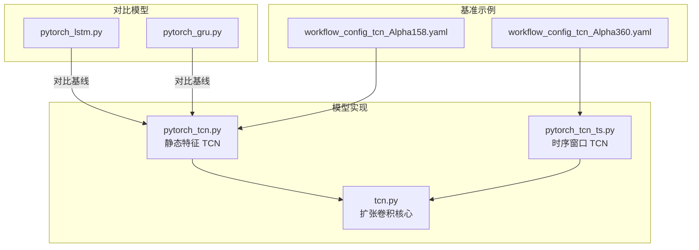
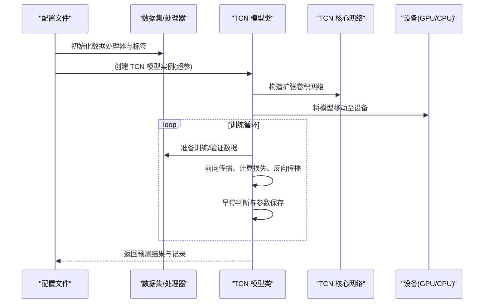
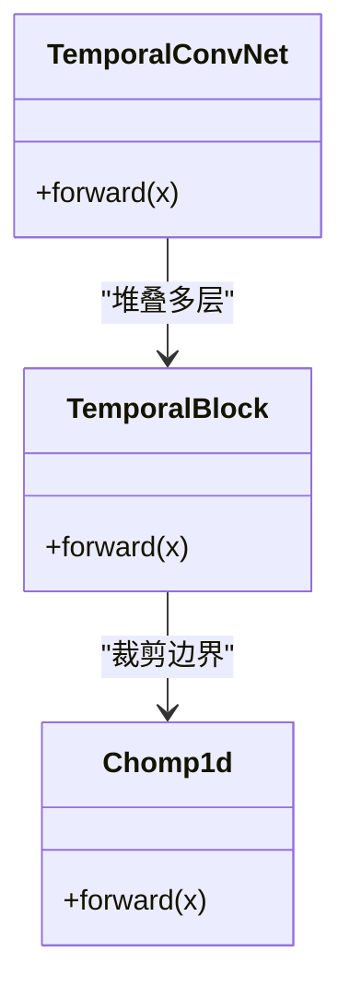
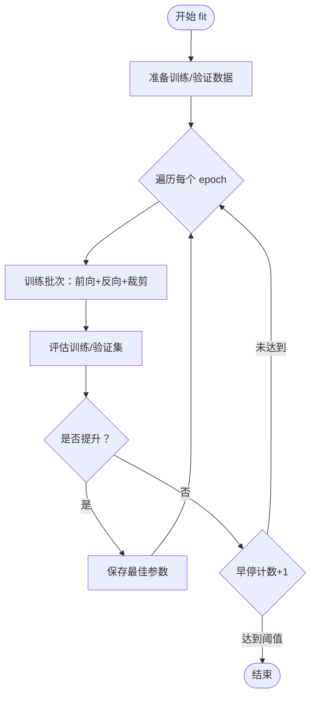
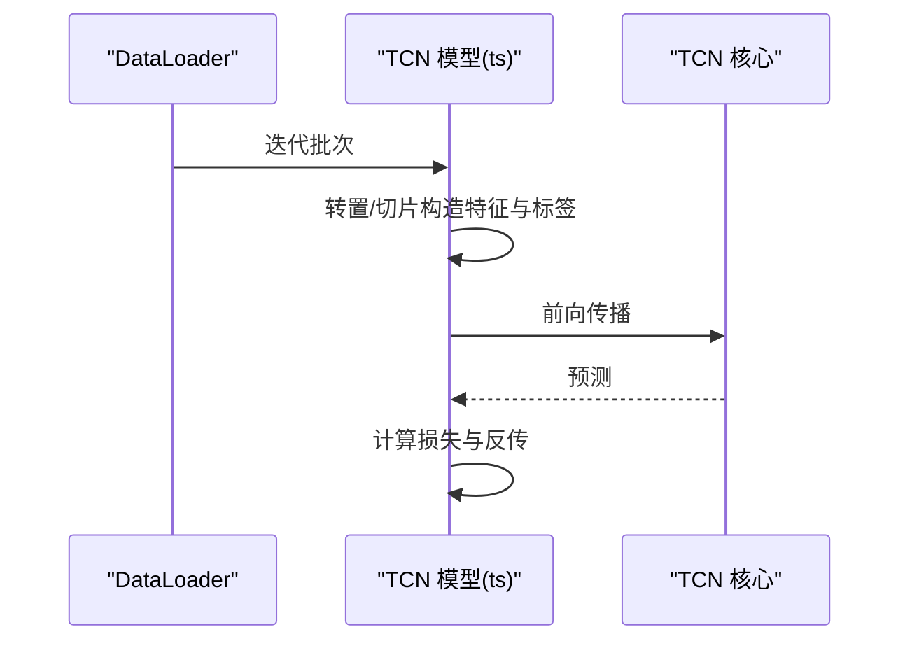
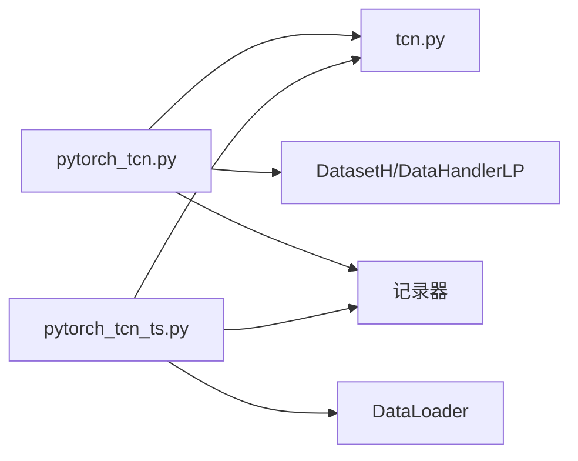

# TCN 基准模型

<cite>
**本文引用的文件列表**
- [workflow_config_tcn_Alpha158.yaml](file://examples/benchmarks/TCN/workflow_config_tcn_Alpha158.yaml)
- [workflow_config_tcn_Alpha360.yaml](file://examples/benchmarks/TCN/workflow_config_tcn_Alpha360.yaml)
- [pytorch_tcn.py](file://qlib/contrib/model/pytorch_tcn.py)
- [pytorch_tcn_ts.py](file://qlib/contrib/model/pytorch_tcn_ts.py)
- [tcn.py](file://qlib/contrib/model/tcn.py)
- [pytorch_lstm.py](file://qlib/contrib/model/pytorch_lstm.py)
- [pytorch_gru.py](file://qlib/contrib/model/pytorch_gru.py)
- [README.md](file://examples/benchmarks/TCN/README.md)
</cite>

## 目录
1. [简介](#简介)
2. [项目结构](#项目结构)
3. [核心组件](#核心组件)
4. [架构总览](#架构总览)
5. [详细组件分析](#详细组件分析)
6. [依赖关系分析](#依赖关系分析)
7. [性能考量](#性能考量)
8. [故障排查指南](#故障排查指南)
9. [结论](#结论)
10. [附录](#附录)

## 简介
本文件系统性介绍 Qlib 中 TCN（Temporal Convolutional Network）基准实现，重点解析其使用因果卷积（因果性确保时序预测不“窥视”未来信息）处理时间序列数据的机制，并结合 YAML 配置文件说明卷积核大小、扩张因子（膨胀率）、层数等关键超参数的设置原则。随后基于源码分析扩张卷积的实现细节，解释其对长期依赖建模的能力；最后给出运行 TCN 模型的方法、在不同市场环境下的稳定性评估思路，以及与 RNN 类模型（如 LSTM、GRU）的性能对比方法。

## 项目结构
TCN 在 Qlib 的实现位于贡献模块中，包含两个版本：
- 面向静态特征的 TCN 实现：pytorch_tcn.py
- 面向时间序列窗口的数据加载 TCN 实现：pytorch_tcn_ts.py
- 核心扩张卷积网络：tcn.py
- 基准工作流配置：examples/benchmarks/TCN 下的 Alpha158 与 Alpha360 配置

图表来源
- [workflow_config_tcn_Alpha158.yaml](file://examples/benchmarks/TCN/workflow_config_tcn_Alpha158.yaml#L1-L100)
- [workflow_config_tcn_Alpha360.yaml](file://examples/benchmarks/TCN/workflow_config_tcn_Alpha360.yaml#L1-L90)
- [pytorch_tcn.py](file://qlib/contrib/model/pytorch_tcn.py#L1-L311)
- [pytorch_tcn_ts.py](file://qlib/contrib/model/pytorch_tcn_ts.py#L1-L298)
- [tcn.py](file://qlib/contrib/model/tcn.py#L1-L77)
- [pytorch_lstm.py](file://qlib/contrib/model/pytorch_lstm.py#L1-L200)
- [pytorch_gru.py](file://qlib/contrib/model/pytorch_gru.py#L1-L200)

章节来源
- [workflow_config_tcn_Alpha158.yaml](file://examples/benchmarks/TCN/workflow_config_tcn_Alpha158.yaml#L1-L100)
- [workflow_config_tcn_Alpha360.yaml](file://examples/benchmarks/TCN/workflow_config_tcn_Alpha360.yaml#L1-L90)
- [pytorch_tcn.py](file://qlib/contrib/model/pytorch_tcn.py#L1-L311)
- [pytorch_tcn_ts.py](file://qlib/contrib/model/pytorch_tcn_ts.py#L1-L298)
- [tcn.py](file://qlib/contrib/model/tcn.py#L1-L77)
- [pytorch_lstm.py](file://qlib/contrib/model/pytorch_lstm.py#L1-L200)
- [pytorch_gru.py](file://qlib/contrib/model/pytorch_gru.py#L1-L200)

## 核心组件
- TCN 模型类（静态特征版）：封装训练、验证、早停、预测流程，支持 Adam/GD 优化器、MSE 损失、梯度裁剪、GPU 设备选择。
- TCN 模型类（时序窗口版）：通过 DataLoader 加载滑动窗口样本，支持多进程加载、前向填充/反向填充处理缺失值。
- 扩张卷积网络（TCN 核心）：由多个 TemporalBlock 组成，逐层指数级膨胀（dilation），保证感受野随深度增长，同时保持时间对齐。
- TemporalBlock：两层因果卷积（weight_norm + Chomp1d），残差连接，ReLU 激活，Dropout 正则化。
- 配置文件：定义数据处理器、标签构造、回测策略、任务参数、记录器等。

章节来源
- [pytorch_tcn.py](file://qlib/contrib/model/pytorch_tcn.py#L26-L311)
- [pytorch_tcn_ts.py](file://qlib/contrib/model/pytorch_tcn_ts.py#L25-L298)
- [tcn.py](file://qlib/contrib/model/tcn.py#L1-L77)
- [workflow_config_tcn_Alpha158.yaml](file://examples/benchmarks/TCN/workflow_config_tcn_Alpha158.yaml#L1-L100)
- [workflow_config_tcn_Alpha360.yaml](file://examples/benchmarks/TCN/workflow_config_tcn_Alpha360.yaml#L1-L90)

## 架构总览
下图展示 TCN 在 Qlib 中的端到端调用链路：配置文件驱动任务执行，模型类负责数据准备、训练、验证与保存，核心 TCN 网络负责时序特征提取与预测输出。

图表来源
- [workflow_config_tcn_Alpha158.yaml](file://examples/benchmarks/TCN/workflow_config_tcn_Alpha158.yaml#L1-L100)
- [workflow_config_tcn_Alpha360.yaml](file://examples/benchmarks/TCN/workflow_config_tcn_Alpha360.yaml#L1-L90)
- [pytorch_tcn.py](file://qlib/contrib/model/pytorch_tcn.py#L120-L272)
- [pytorch_tcn_ts.py](file://qlib/contrib/model/pytorch_tcn_ts.py#L121-L265)
- [tcn.py](file://qlib/contrib/model/tcn.py#L52-L77)

## 详细组件分析

### YAML 配置文件解析与参数设置原则
- 数据与标签
  - 数据范围：训练/验证/测试分段，使用固定起止时间切片。
  - 特征预处理：Alpha158/Alpha360 处理器，RobustZScoreNorm、Fillna、CSRankNorm 等。
  - 标签：相对收益类标签，用于回归任务。
- 回测与交易成本
  - TopkDropout 策略，设定 topk 与丢弃数量；交易成本参数（滑点、手续费、最小费用）。
- 模型任务
  - 模型类：TCN（静态特征版或时序窗口版），指定 d_feat、num_layers、n_chans、kernel_size、dropout、n_epochs、lr、early_stop、batch_size、loss、optimizer、GPU 等。
  - 数据集：DatasetH 或 TSDatasetH，按时间步长 step_len 切分。
- 记录器
  - SignalRecord、SigAnaRecord、PortAnaRecord 三类记录，分别输出信号、IC 分析与组合分析。

参数设置原则（结合源码与配置）
- d_feat：输入特征维度，应与数据处理器输出一致。
- num_layers：扩张层数，决定感受野与长期依赖建模能力；层数越多，计算量越大。
- n_chans：每层通道数，影响表达能力与过拟合风险；通常为 2 的幂次更利于膨胀。
- kernel_size：卷积核大小，越大感受野越广，但需注意边界裁剪与时间对齐。
- dropout：正则化，防止过拟合；在静态特征版默认较高，在时序窗口版可设为 0。
- batch_size：批大小，影响收敛稳定性与显存占用。
- early_stop：早停轮数，避免过拟合。
- optimizer/lr：优化器与学习率，Adam 通常更稳定；学习率过大易震荡，过小收敛慢。
- GPU：设备选择，建议开启以提升吞吐。

章节来源
- [workflow_config_tcn_Alpha158.yaml](file://examples/benchmarks/TCN/workflow_config_tcn_Alpha158.yaml#L1-L100)
- [workflow_config_tcn_Alpha360.yaml](file://examples/benchmarks/TCN/workflow_config_tcn_Alpha360.yaml#L1-L90)

### 扩张卷积实现机制与长期依赖建模
TCN 的核心由 TemporalConvNet 与 TemporalBlock 组成，关键点如下：
- 膨胀卷积（Dilated Convolution）
  - 每一层的膨胀率按 2^i 增长，使感受野呈指数扩展，从而捕获长期依赖。
  - 通过 padding 与 Chomp1d 保证时间维对齐，不引入未来信息。
- 残差连接与激活
  - 两层卷积后加残差，ReLU 激活，有助于深层网络训练稳定。
- 权重归一化
  - 使用 weight_norm 提升训练稳定性与收敛速度。
- 输出策略
  - 取最后一时刻的时间步进行线性映射得到标量预测，适配回归任务。

图表来源
- [tcn.py](file://qlib/contrib/model/tcn.py#L1-L77)

章节来源
- [tcn.py](file://qlib/contrib/model/tcn.py#L1-L77)

### 模型类与训练流程（静态特征版）
- 初始化
  - 解析超参，构建 TCNModel（TCN + 线性输出层），选择优化器与设备。
- 训练
  - 按 epoch 循环，随机打乱索引，分批前向、反向与梯度裁剪。
  - 早停：以验证集指标为准则，超过阈值停止。
- 预测
  - 对测试集按批推理，拼接索引返回 Series。

图表来源
- [pytorch_tcn.py](file://qlib/contrib/model/pytorch_tcn.py#L164-L272)

章节来源
- [pytorch_tcn.py](file://qlib/contrib/model/pytorch_tcn.py#L120-L272)

### 模型类与训练流程（时序窗口版）
- 初始化
  - 与静态特征版类似，额外支持 DataLoader、多进程加载、前/后向填充缺失值。
- 训练/评估
  - 从 DataLoader 获取样本，转置与切片构造特征与标签，前向与反向传播。
- 预测
  - 构造测试 DataLoader，按批推理并拼接索引。

图表来源
- [pytorch_tcn_ts.py](file://qlib/contrib/model/pytorch_tcn_ts.py#L165-L201)

章节来源
- [pytorch_tcn_ts.py](file://qlib/contrib/model/pytorch_tcn_ts.py#L121-L265)

### 与 RNN 类模型的性能对比方法
- 同一数据与标签
  - 使用相同数据处理器、特征工程、标签构造、时间切分与回测策略。
- 同一评估指标
  - IC、年化收益、最大回撤、胜率等统一口径；记录器可复用。
- 同一训练设置
  - 早停、学习率调度、批大小、设备等尽量对齐，控制变量法。
- 基线模型
  - LSTM、GRU 作为对比基线，参数规模与 TCN 对齐，便于公平比较。

章节来源
- [pytorch_lstm.py](file://qlib/contrib/model/pytorch_lstm.py#L1-L200)
- [pytorch_gru.py](file://qlib/contrib/model/pytorch_gru.py#L1-L200)

## 依赖关系分析
- 模块耦合
  - TCN 模型类依赖数据集接口（DatasetH/TSDatasetH）、数据处理器（DataHandlerLP）、记录器（SignalRecord/SigAnaRecord/PortAnaRecord）。
  - 核心 TCN 网络依赖 PyTorch 卷积、权重归一化与线性层。
- 外部依赖
  - NumPy、Pandas、PyTorch、torch.utils.data.DataLoader。
- 可能的循环依赖
  - 当前实现无直接循环导入，各模块职责清晰。

图表来源
- [pytorch_tcn.py](file://qlib/contrib/model/pytorch_tcn.py#L1-L311)
- [pytorch_tcn_ts.py](file://qlib/contrib/model/pytorch_tcn_ts.py#L1-L298)
- [tcn.py](file://qlib/contrib/model/tcn.py#L1-L77)

章节来源
- [pytorch_tcn.py](file://qlib/contrib/model/pytorch_tcn.py#L1-L311)
- [pytorch_tcn_ts.py](file://qlib/contrib/model/pytorch_tcn_ts.py#L1-L298)
- [tcn.py](file://qlib/contrib/model/tcn.py#L1-L77)

## 性能考量
- 计算复杂度
  - TCN 的扩张卷积在保持时间对齐的同时，通过指数膨胀扩大感受野，适合长序列建模；层数与通道数增加会显著提升计算量。
- 内存占用
  - 批大小与序列长度直接影响显存；建议根据 GPU 显存调整 batch_size 与 kernel_size。
- 收敛与稳定性
  - 权重归一化、梯度裁剪、Dropout 有助于稳定训练；学习率与优化器选择对收敛速度影响较大。
- 并行化
  - 时序窗口版支持多进程 DataLoader，可显著提升数据加载吞吐。

[本节为通用性能讨论，无需列出具体文件来源]

## 故障排查指南
- 训练不收敛或震荡
  - 检查学习率是否过高；尝试降低学习率或更换优化器。
  - 观察早停阈值是否过小导致频繁停止。
- 显存不足
  - 降低 batch_size 或减少 num_layers/n_chans。
  - 确认 GPU 是否正确选择。
- 数据缺失导致 NaN
  - 时序窗口版已内置前/后向填充策略；静态特征版可通过数据处理器配置缺失值处理。
- 预测结果异常
  - 确认特征维度 d_feat 与数据一致；检查标签构造逻辑与回测参数。

章节来源
- [pytorch_tcn.py](file://qlib/contrib/model/pytorch_tcn.py#L144-L163)
- [pytorch_tcn_ts.py](file://qlib/contrib/model/pytorch_tcn_ts.py#L145-L163)

## 结论
Qlib 中的 TCN 基准实现通过因果扩张卷积有效建模长期时序依赖，配合权重归一化、残差连接与 Dropout 提升训练稳定性。YAML 配置提供了灵活的超参与数据处理选项，支持在不同市场环境下进行稳健评估。与 LSTM、GRU 等 RNN 类模型相比，TCN 在长序列建模上具备并行化优势与稳定的长期依赖建模能力，建议在相同数据与评估口径下进行公平对比，以确定最优模型方案。

[本节为总结性内容，无需列出具体文件来源]

## 附录

### 如何运行 TCN 模型
- 使用静态特征版（Alpha360）
  - 参考配置：workflow_config_tcn_Alpha360.yaml
  - 模型类：pytorch_tcn.py 中的 TCN
  - 运行方式：通过 Qlib 工作流入口执行该配置文件
- 使用时序窗口版（Alpha158）
  - 参考配置：workflow_config_tcn_Alpha158.yaml
  - 模型类：pytorch_tcn_ts.py 中的 TCN
  - 运行方式：通过 Qlib 工作流入口执行该配置文件

章节来源
- [workflow_config_tcn_Alpha158.yaml](file://examples/benchmarks/TCN/workflow_config_tcn_Alpha158.yaml#L1-L100)
- [workflow_config_tcn_Alpha360.yaml](file://examples/benchmarks/TCN/workflow_config_tcn_Alpha360.yaml#L1-L90)
- [pytorch_tcn.py](file://qlib/contrib/model/pytorch_tcn.py#L26-L139)
- [pytorch_tcn_ts.py](file://qlib/contrib/model/pytorch_tcn_ts.py#L25-L139)

### 不同市场环境下的稳定性评估
- 时间切分
  - 使用不同的训练/验证/测试时间段，观察指标稳定性与泛化能力。
- 市场风格切换
  - 在不同市场阶段（牛市/熊市/震荡）分别评估，关注 IC、IR、最大回撤等指标。
- 回测参数敏感性
  - 对 topk、丢弃比例、交易成本等参数进行网格搜索，评估稳健性。

[本节为通用评估方法，无需列出具体文件来源]

### 与 RNN 类模型的对比要点
- 数据与标签一致：确保 Alpha158/Alpha360 处理器、标签构造与时间切分一致。
- 评估口径一致：统一 IC、年化收益、最大回撤、胜率等指标。
- 训练设置一致：早停、学习率、批大小、设备等尽量对齐。
- 基线模型：LSTM、GRU 作为对照组，参数规模与 TCN 对齐。

章节来源
- [pytorch_lstm.py](file://qlib/contrib/model/pytorch_lstm.py#L1-L200)
- [pytorch_gru.py](file://qlib/contrib/model/pytorch_gru.py#L1-L200)