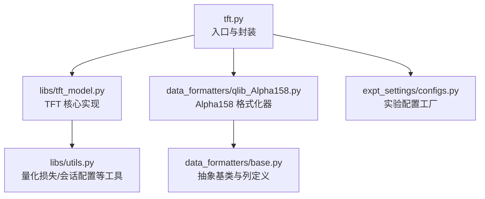
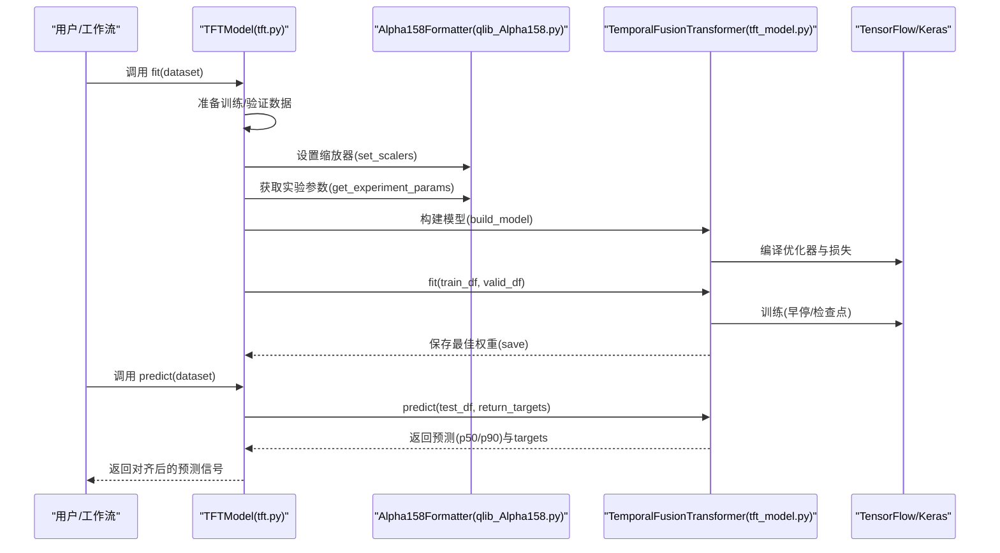
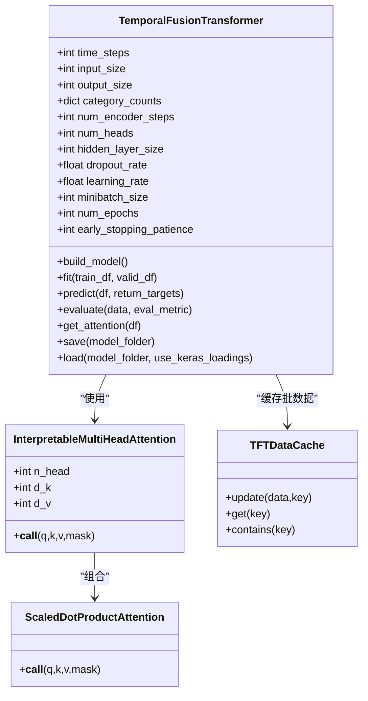
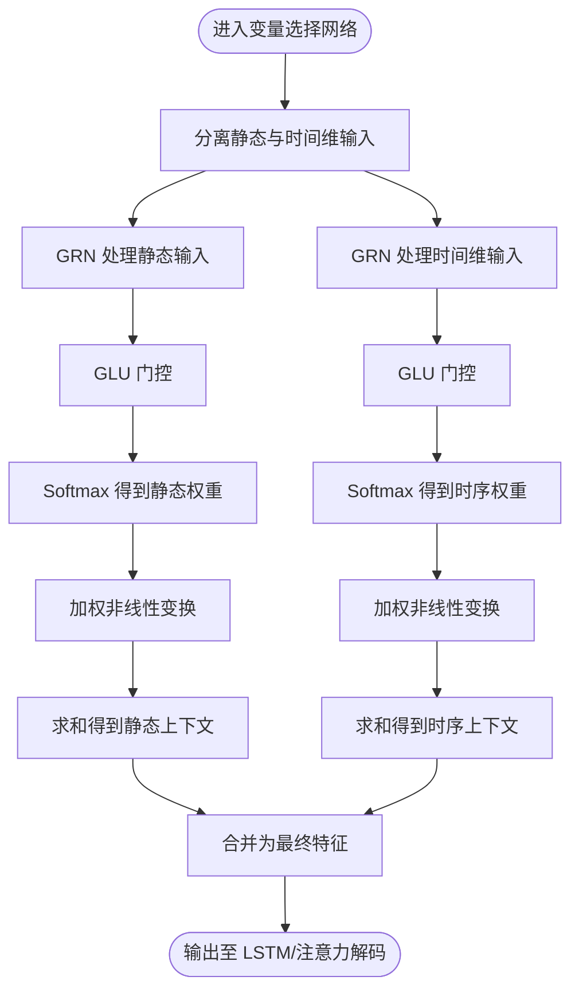
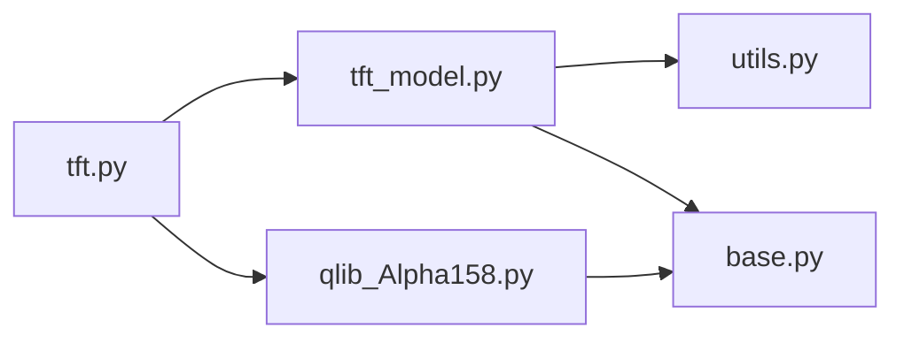

# TFT 基准模型

<cite>
**本文引用的文件**
- [tft.py](file://examples/benchmarks/TFT/tft.py)
- [workflow_config_tft_Alpha158.yaml](file://examples/benchmarks/TFT/workflow_config_tft_Alpha158.yaml)
- [tft_model.py](file://examples/benchmarks/TFT/libs/tft_model.py)
- [qlib_Alpha158.py](file://examples/benchmarks/TFT/data_formatters/qlib_Alpha158.py)
- [configs.py](file://examples/benchmarks/TFT/expt_settings/configs.py)
- [base.py](file://examples/benchmarks/TFT/data_formatters/base.py)
- [utils.py](file://examples/benchmarks/TFT/libs/utils.py)
- [README.md](file://examples/benchmarks/TFT/README.md)
</cite>

## 目录
1. [简介](#简介)
2. [项目结构](#项目结构)
3. [核心组件](#核心组件)
4. [架构总览](#架构总览)
5. [详细组件分析](#详细组件分析)
6. [依赖关系分析](#依赖关系分析)
7. [性能考量](#性能考量)
8. [故障排查指南](#故障排查指南)
9. [结论](#结论)
10. [附录](#附录)

## 简介
本文件系统化阐述 Qlib 中的 Temporal Fusion Transformer（TFT）基准模型实现，重点说明其结合 LSTM 与注意力机制的混合架构优势，以及在多步预测任务中的表现。文档围绕以下目标展开：
- 解析 YAML 配置与 tft.py 主入口文件，明确静态变量、已知未来输入、观测输入的处理方式；
- 结合 tft_model.py 源码解释门控机制、变量选择网络与序列到序列解码的实现细节；
- 利用 data_formatters 模块说明 Alpha158 数据格式化流程；
- 提供完整的训练、预测与可视化流程，并分析多步预测任务中的表现。

## 项目结构
TFT 基准模型位于 examples/benchmarks/TFT 目录下，包含如下关键子模块：
- 入口脚本与工作流配置：tft.py、workflow_config_tft_Alpha158.yaml
- 模型实现：libs/tft_model.py
- 数据格式化：data_formatters/qlib_Alpha158.py、data_formatters/base.py
- 实验设置：expt_settings/configs.py
- 工具函数：libs/utils.py
- 使用说明：README.md

图表来源
- [tft.py](file://examples/benchmarks/TFT/tft.py#L1-L323)
- [tft_model.py](file://examples/benchmarks/TFT/libs/tft_model.py#L1-L1278)
- [qlib_Alpha158.py](file://examples/benchmarks/TFT/data_formatters/qlib_Alpha158.py#L1-L231)
- [configs.py](file://examples/benchmarks/TFT/expt_settings/configs.py#L1-L95)
- [base.py](file://examples/benchmarks/TFT/data_formatters/base.py#L1-L223)
- [utils.py](file://examples/benchmarks/TFT/libs/utils.py#L1-L225)

章节来源
- [tft.py](file://examples/benchmarks/TFT/tft.py#L1-L120)
- [workflow_config_tft_Alpha158.yaml](file://examples/benchmarks/TFT/workflow_config_tft_Alpha158.yaml#L1-L64)

## 核心组件
- 模型封装类 TFTModel：继承自 Qlib 的 ModelFT，负责数据准备、训练、预测与保存；内部实例化 TemporalFusionTransformer 并通过 ExperimentConfig 获取数据格式化器与默认参数。
- 数据格式化器 Alpha158Formatter：基于 GenericDataFormatter 定义 Alpha158 的列定义、分桶、归一化与反归一化逻辑，并提供固定参数与默认模型参数。
- 实验配置工厂 ExperimentConfig：根据实验名返回对应的数据格式化器实例与输出路径。
- TFT 核心模型 TemporalFusionTransformer：实现嵌入、变量选择、LSTM 编码器/解码器、注意力解码、门控残差网络、量化损失与训练流程。
- 工具模块 utils：提供量化损失、TensorFlow 会话配置、检查点保存/加载等辅助能力。

章节来源
- [tft.py](file://examples/benchmarks/TFT/tft.py#L154-L323)
- [qlib_Alpha158.py](file://examples/benchmarks/TFT/data_formatters/qlib_Alpha158.py#L31-L231)
- [configs.py](file://examples/benchmarks/TFT/expt_settings/configs.py#L28-L95)
- [tft_model.py](file://examples/benchmarks/TFT/libs/tft_model.py#L351-L1278)
- [utils.py](file://examples/benchmarks/TFT/libs/utils.py#L1-L225)

## 架构总览
TFT 在 Qlib 中采用“封装层 + 模型层 + 格式化层”的三层架构：
- 封装层（tft.py）：对接 Qlib 数据集与记录器，完成数据预处理、标签位移、会话管理与模型持久化。
- 模型层（tft_model.py）：构建 TFT 图并训练，支持多头注意力、门控残差网络、变量选择、因果掩码与量化损失。
- 格式化层（data_formatters/*）：定义列类型与输入类型，执行标准化、编码与预测反归一化。

图表来源
- [tft.py](file://examples/benchmarks/TFT/tft.py#L168-L284)
- [qlib_Alpha158.py](file://examples/benchmarks/TFT/data_formatters/qlib_Alpha158.py#L104-L202)
- [tft_model.py](file://examples/benchmarks/TFT/libs/tft_model.py#L947-L1163)

## 详细组件分析

### YAML 配置与主入口（tft.py）
- 数据集注册与字段映射：通过 DATASET_SETTING 为 Alpha158/Alpha360 指定特征列与标签列，用于后续筛选与索引。
- 数据预处理：
  - process_qlib_data：按数据集选择特征列与标签列，重排索引为（时间, 交易代码），补充日期派生特征（星期、月份、年份、常数项）。
  - get_shifted_label：对标签进行位移以模拟多步预测目标。
  - fill_test_na：测试集缺失值按时间维度均值填充。
- 训练流程：
  - 初始化 ExperimentConfig，获取数据格式化器与默认参数；
  - 设置 TensorFlow GPU/CPU 会话配置；
  - 调用 TemporalFusionTransformer.fit 进行训练并保存模型。
- 预测流程：
  - 加载已保存图与权重，调用 predict 返回 p50/p90 预测，并对齐标签位移生成最终信号。

章节来源
- [tft.py](file://examples/benchmarks/TFT/tft.py#L23-L121)
- [tft.py](file://examples/benchmarks/TFT/tft.py#L168-L284)

### 数据格式化（data_formatters）
- 列定义与输入类型：
  - Alpha158Formatter._column_definition 明确各列的数据类型与输入类型（ID、TIME、TARGET、OBSERVED_INPUT、KNOWN_INPUT、STATIC_INPUT）。
  - OBSERVED_INPUT 表示历史可观察变量；KNOWN_INPUT 表示已知未来变量；STATIC_INPUT 表示静态变量。
- 分割与缩放：
  - split_data：按年份切分为训练/验证/测试，并在校准训练集上设置缩放器。
  - set_scalers：对连续变量做标准化，对类别变量做标签编码，记录类别数量。
- 反归一化：
  - format_predictions：将模型输出还原到原始尺度，便于评估与回测。

章节来源
- [qlib_Alpha158.py](file://examples/benchmarks/TFT/data_formatters/qlib_Alpha158.py#L40-L103)
- [qlib_Alpha158.py](file://examples/benchmarks/TFT/data_formatters/qlib_Alpha158.py#L104-L202)
- [base.py](file://examples/benchmarks/TFT/data_formatters/base.py#L35-L164)

### 实验配置工厂（expt_settings/configs.py）
- ExperimentConfig：根据实验名返回数据目录、模型目录、结果目录与数据 CSV 路径；提供 make_data_formatter 工厂方法，返回对应格式化器实例。

章节来源
- [configs.py](file://examples/benchmarks/TFT/expt_settings/configs.py#L28-L95)

### TFT 核心模型（tft_model.py）
- 关键组件与流程：
  - 嵌入与输入拆分：get_tft_embeddings 将输入划分为 unknown_inputs（未观测）、known_combined_layer（已知未来/静态）、obs_inputs（历史观测）、static_inputs（静态）。
  - 变量选择网络（GRN + GLU）：对静态变量与时间维度变量分别计算稀疏权重，实现“门控机制”与“变量选择”，提升可解释性与泛化能力。
  - LSTM 编码器/解码器：历史与未来输入分别经 LSTM 编码，初始状态来自静态上下文；随后进行门控残差连接与特征增强。
  - 注意力解码：使用可解释多头注意力（InterpretableMultiHeadAttention），配合因果掩码（get_decoder_mask）实现自回归解码。
  - 输出层：TimeDistributed 线性层输出多分位数（默认 0.1/0.5/0.9）。
  - 训练与评估：compile 使用自定义量化损失，fit 支持早停与检查点；evaluate 返回指标；predict 返回对齐格式的预测与目标。
  - 可解释性：保存静态变量选择权重、历史/未来变量选择权重与解码器自注意力权重，便于可视化分析。

图表来源
- [tft_model.py](file://examples/benchmarks/TFT/libs/tft_model.py#L351-L1278)

章节来源
- [tft_model.py](file://examples/benchmarks/TFT/libs/tft_model.py#L441-L553)
- [tft_model.py](file://examples/benchmarks/TFT/libs/tft_model.py#L800-L946)
- [tft_model.py](file://examples/benchmarks/TFT/libs/tft_model.py#L947-L1163)

### 门控机制、变量选择网络与序列到序列解码
- 门控机制（GLU）：apply_gating_layer 通过线性变换与 Sigmoid 门控相乘，实现门控残差网络（GRN）的门控分支，抑制冗余信息。
- 变量选择网络（GRN + softmax 权重）：对静态与时间维输入分别计算稀疏权重，加权非线性变换后求和，形成“动态特征融合”。
- 序列到序列解码：LSTM 编码器输出作为上下文，解码器自注意力在因果掩码下进行自回归解码，输出多分位数预测。

图表来源
- [tft_model.py](file://examples/benchmarks/TFT/libs/tft_model.py#L140-L191)
- [tft_model.py](file://examples/benchmarks/TFT/libs/tft_model.py#L800-L946)

章节来源
- [tft_model.py](file://examples/benchmarks/TFT/libs/tft_model.py#L140-L191)
- [tft_model.py](file://examples/benchmarks/TFT/libs/tft_model.py#L800-L946)

### Alpha158 数据格式化流程
- 列定义：明确 ID、TIME、TARGET、OBSERVED_INPUT、KNOWN_INPUT、STATIC_INPUT 的列名与类型。
- 特征工程：在 tft.py 中补充日期派生特征（星期、月份、年份、常数项），并在 qlib_Alpha158.py 中对连续变量标准化、类别变量编码。
- 分割策略：按年份划分训练/验证/测试集，先拟合训练集缩放器再对全集转换。

章节来源
- [qlib_Alpha158.py](file://examples/benchmarks/TFT/data_formatters/qlib_Alpha158.py#L40-L103)
- [qlib_Alpha158.py](file://examples/benchmarks/TFT/data_formatters/qlib_Alpha158.py#L104-L202)
- [tft.py](file://examples/benchmarks/TFT/tft.py#L94-L121)

### 训练、预测与可视化流程
- 训练流程：
  - 通过 ExperimentConfig 获取数据格式化器与默认参数；
  - 设置缩放器、构建模型、编译优化器与损失；
  - fit 支持早停与检查点，自动保存最佳权重。
- 预测流程：
  - 加载已保存图与权重；
  - predict 返回 p50/p90 预测与 targets，format_score 对齐标签位移生成信号；
  - 可通过 get_attention 获取注意力权重，用于解释性可视化。
- 可视化建议：
  - 使用 attention 组件（静态/历史/未来变量选择权重、解码器自注意力）绘制热力图或条形图；
  - 对比不同时间窗口与分位数的注意力分布，分析变量重要性变化。

章节来源
- [tft.py](file://examples/benchmarks/TFT/tft.py#L168-L284)
- [tft_model.py](file://examples/benchmarks/TFT/libs/tft_model.py#L1114-L1221)

## 依赖关系分析
- 组件耦合：
  - tft.py 依赖 data_formatters.base.GenericDataFormatter 与 libs.tft_model.TemporalFusionTransformer；
  - tft_model.py 依赖 data_formatters.base 与 libs.utils；
  - qlib_Alpha158.py 继承 GenericDataFormatter 并实现具体列定义与缩放逻辑。
- 外部依赖：
  - TensorFlow/Keras（版本兼容性注意：README 指出 Python 3.6-3.7 与 CUDA 10.0 环境要求）；
  - scikit-learn（用于标准化与标签编码）。

图表来源
- [tft.py](file://examples/benchmarks/TFT/tft.py#L1-L30)
- [tft_model.py](file://examples/benchmarks/TFT/libs/tft_model.py#L1-L40)
- [qlib_Alpha158.py](file://examples/benchmarks/TFT/data_formatters/qlib_Alpha158.py#L1-L30)
- [base.py](file://examples/benchmarks/TFT/data_formatters/base.py#L1-L40)
- [utils.py](file://examples/benchmarks/TFT/libs/utils.py#L1-L40)

章节来源
- [tft.py](file://examples/benchmarks/TFT/tft.py#L1-L30)
- [tft_model.py](file://examples/benchmarks/TFT/libs/tft_model.py#L1-L40)
- [qlib_Alpha158.py](file://examples/benchmarks/TFT/data_formatters/qlib_Alpha158.py#L1-L30)
- [base.py](file://examples/benchmarks/TFT/data_formatters/base.py#L1-L40)
- [utils.py](file://examples/benchmarks/TFT/libs/utils.py#L1-L40)

## 性能考量
- 计算资源：模型必须运行在 GPU（README 明确要求），且需满足 Python 与 CUDA 版本约束。
- 批处理与并行：TFTDataCache 支持批数据缓存，fit/predict 使用多进程与批量推理，减少内存峰值。
- 正则化与早停：dropout_rate、early_stopping_patience 控制过拟合；量化损失保证多分位数预测稳定性。
- 可扩展性：通过 ExperimentConfig 与 GenericDataFormatter 抽象，可快速接入新数据集。

[本节为通用指导，无需特定文件来源]

## 故障排查指南
- 环境问题：
  - 若报错提示无法在 CPU 上运行，请确认 README 中的 Python 与 CUDA 版本要求。
- 数据格式错误：
  - 若出现“输入列不匹配”或“列类型非法”，检查 data_formatters/base.py 的列定义与输入类型是否符合规范。
- 训练异常：
  - 若训练 NaN 或发散，检查学习率、梯度裁剪阈值与数据缩放是否合理；适当提高 early_stopping_patience。
- 预测对齐问题：
  - 若信号与标签错位，确认 tft.py 中标签位移与 format_score 的对齐逻辑一致。

章节来源
- [README.md](file://examples/benchmarks/TFT/README.md#L7-L15)
- [base.py](file://examples/benchmarks/TFT/data_formatters/base.py#L134-L223)
- [tft.py](file://examples/benchmarks/TFT/tft.py#L168-L284)

## 结论
Qlib 中的 TFT 基准模型通过清晰的三层架构实现了可解释、可扩展的多步时序预测。其核心优势在于：
- 混合架构：LSTM 捕获时序依赖，注意力解码实现自回归与上下文感知；
- 可解释性：变量选择网络与注意力权重提供直观洞察；
- 工程化：完善的缩放、缓存、早停与检查点机制，便于生产部署。

[本节为总结性内容，无需特定文件来源]

## 附录
- YAML 工作流配置要点：
  - 数据集与处理器：handler 指向 Alpha158，segments 定义训练/验证/测试区间；
  - 记录器：SignalRecord、SigAnaRecord、PortAnaRecord 串联信号生成与组合回测；
  - 任务：model 指向 TFTModel，dataset 指向 DatasetH。

章节来源
- [workflow_config_tft_Alpha158.yaml](file://examples/benchmarks/TFT/workflow_config_tft_Alpha158.yaml#L1-L64)