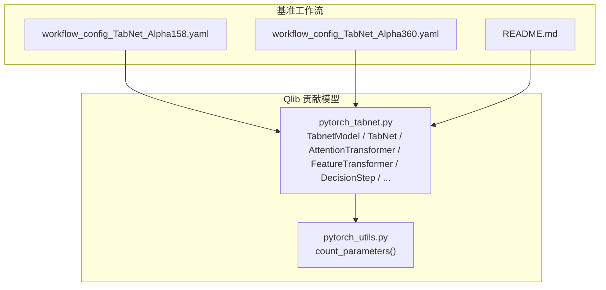
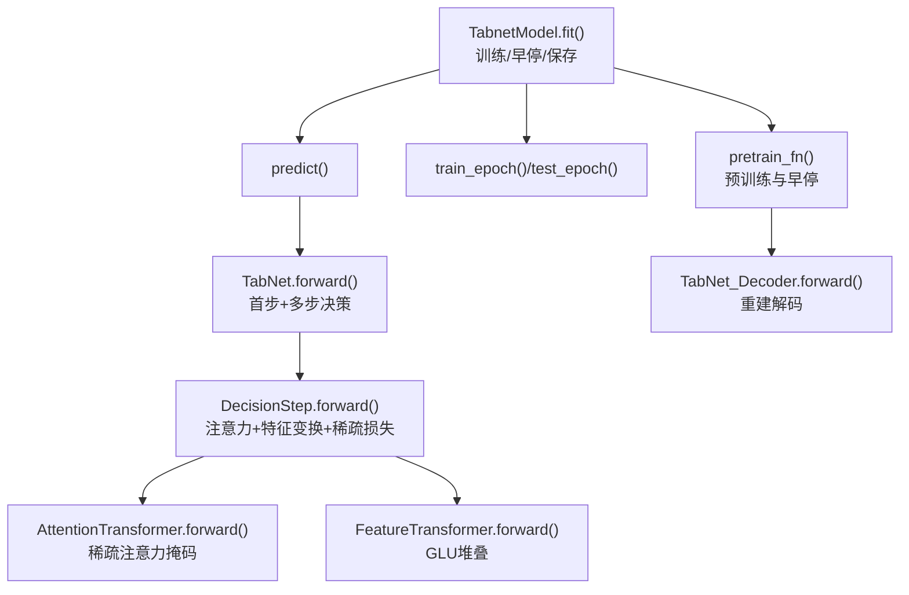
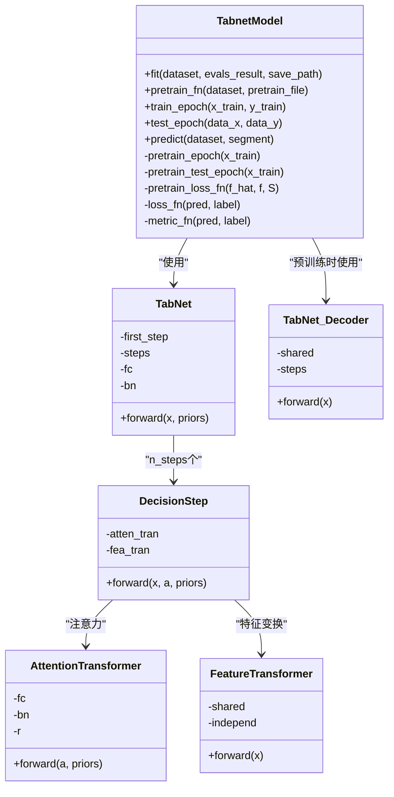
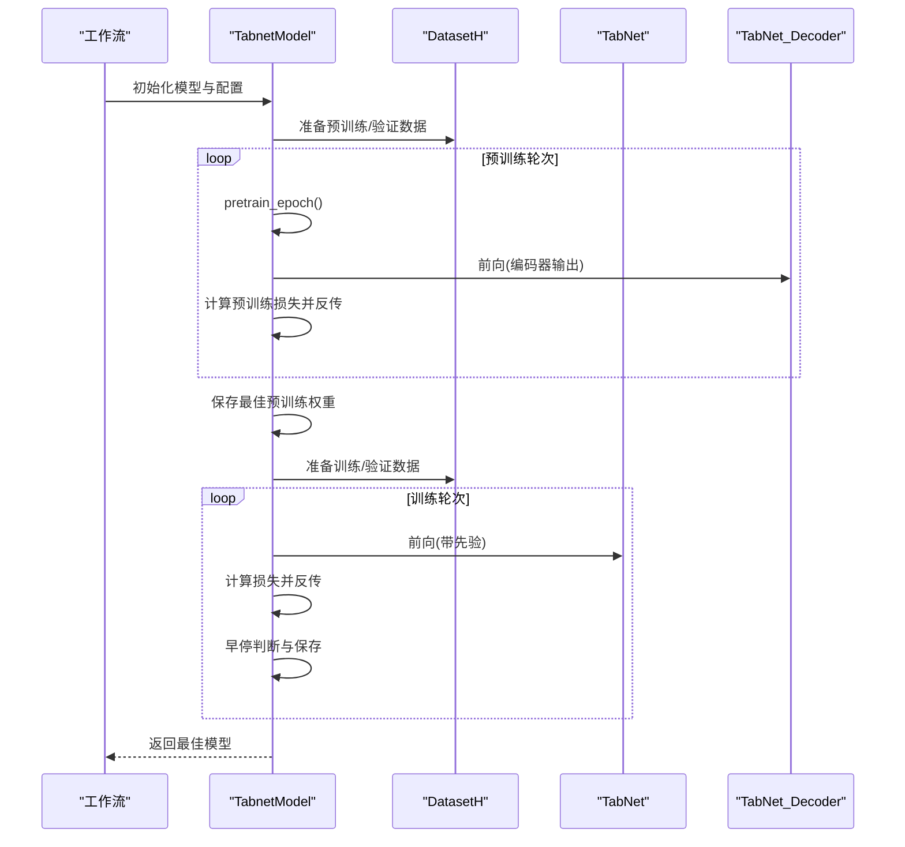
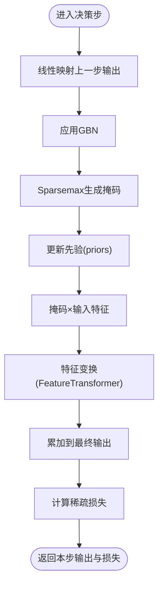
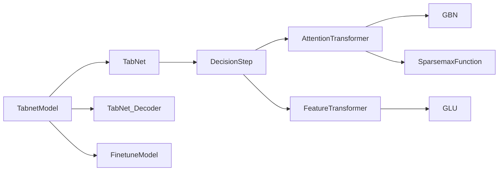

# TabNet 基准模型

<cite>
**本文引用的文件列表**
- [pytorch_tabnet.py](file://qlib/contrib/model/pytorch_tabnet.py)
- [pytorch_utils.py](file://qlib/contrib/model/pytorch_utils.py)
- [workflow_config_TabNet_Alpha158.yaml](file://examples/benchmarks/TabNet/workflow_config_TabNet_Alpha158.yaml)
- [workflow_config_TabNet_Alpha360.yaml](file://examples/benchmarks/TabNet/workflow_config_TabNet_Alpha360.yaml)
- [README.md](file://examples/benchmarks/TabNet/README.md)
</cite>

## 目录
1. [简介](#简介)
2. [项目结构](#项目结构)
3. [核心组件](#核心组件)
4. [架构总览](#架构总览)
5. [详细组件分析](#详细组件分析)
6. [依赖关系分析](#依赖关系分析)
7. [性能与资源开销](#性能与资源开销)
8. [运行与使用指南](#运行与使用指南)
9. [注意力权重提取与可解释性分析](#注意力权重提取与可解释性分析)
10. [故障排查](#故障排查)
11. [结论](#结论)

## 简介
本文件系统化梳理 Qlib 平台中 TabNet 基准实现，重点解析其通过“顺序注意力”进行特征选择的机制，结合 YAML 配置文件说明关键超参数（如决策步数、注意力掩码生成策略、特征变换模块等），并基于源码分析分步特征选择流程与可解释性优势。同时提供运行方法、注意力权重提取路径以及在高维金融数据场景下的性能与内存占用建议。

## 项目结构
- 模型实现位于 Qlib 贡献模块中，采用 PyTorch 实现，包含编码器、解码器、注意力与特征变换等子模块。
- 基准工作流配置位于 examples/benchmarks/TabNet 下，分别针对 Alpha158 与 Alpha360 的特征维度提供示例配置。

图表来源
- [pytorch_tabnet.py](file://qlib/contrib/model/pytorch_tabnet.py#L24-L110)
- [pytorch_utils.py](file://qlib/contrib/model/pytorch_utils.py#L1-L38)
- [workflow_config_TabNet_Alpha158.yaml](file://examples/benchmarks/TabNet/workflow_config_TabNet_Alpha158.yaml#L46-L66)
- [workflow_config_TabNet_Alpha360.yaml](file://examples/benchmarks/TabNet/workflow_config_TabNet_Alpha360.yaml#L46-L66)
- [README.md](file://examples/benchmarks/TabNet/README.md#L1-L4)

章节来源
- [pytorch_tabnet.py](file://qlib/contrib/model/pytorch_tabnet.py#L24-L110)
- [workflow_config_TabNet_Alpha158.yaml](file://examples/benchmarks/TabNet/workflow_config_TabNet_Alpha158.yaml#L46-L66)
- [workflow_config_TabNet_Alpha360.yaml](file://examples/benchmarks/TabNet/workflow_config_TabNet_Alpha360.yaml#L46-L66)
- [README.md](file://examples/benchmarks/TabNet/README.md#L1-L4)

## 核心组件
- TabnetModel：封装训练、预训练、微调与预测流程；管理优化器、损失与评估指标；支持 GPU 设备选择与早停。
- TabNet 编码器：由“首步特征变换 + 多决策步”组成，每步输出一个共享维度的特征向量，并累积到最终输出。
- AttentionTransformer：对上一步输出进行线性映射后经稀疏 softmax（Sparsemax）生成注意力掩码，并更新先验以控制重复使用特征。
- FeatureTransformer：共享与独立堆叠的门控线性单元（GLU）组合，实现特征变换。
- DecisionStep：整合注意力与特征变换，计算稀疏正则损失，作为可解释性的来源之一。
- TabNet_Decoder：预训练阶段的重建解码器，由若干 DecoderStep 组成。
- 辅助模块：Ghost Batch Normalization（GBN）、自定义 SparsemaxFunction、参数计数工具。

章节来源
- [pytorch_tabnet.py](file://qlib/contrib/model/pytorch_tabnet.py#L24-L110)
- [pytorch_tabnet.py](file://qlib/contrib/model/pytorch_tabnet.py#L436-L479)
- [pytorch_tabnet.py](file://qlib/contrib/model/pytorch_tabnet.py#L527-L548)
- [pytorch_tabnet.py](file://qlib/contrib/model/pytorch_tabnet.py#L550-L579)
- [pytorch_tabnet.py](file://qlib/contrib/model/pytorch_tabnet.py#L581-L596)
- [pytorch_tabnet.py](file://qlib/contrib/model/pytorch_tabnet.py#L410-L434)
- [pytorch_utils.py](file://qlib/contrib/model/pytorch_utils.py#L1-L38)

## 架构总览
下图展示 TabNet 在 Qlib 中的整体结构与数据流：模型初始化、预训练、微调、推理与记录。

图表来源
- [pytorch_tabnet.py](file://qlib/contrib/model/pytorch_tabnet.py#L150-L216)
- [pytorch_tabnet.py](file://qlib/contrib/model/pytorch_tabnet.py#L274-L381)
- [pytorch_tabnet.py](file://qlib/contrib/model/pytorch_tabnet.py#L436-L479)
- [pytorch_tabnet.py](file://qlib/contrib/model/pytorch_tabnet.py#L527-L548)
- [pytorch_tabnet.py](file://qlib/contrib/model/pytorch_tabnet.py#L550-L579)
- [pytorch_tabnet.py](file://qlib/contrib/model/pytorch_tabnet.py#L581-L596)
- [pytorch_tabnet.py](file://qlib/contrib/model/pytorch_tabnet.py#L410-L434)

## 详细组件分析

### TabNet 编码器与顺序注意力
- 结构要点
  - 首步：对输入进行批量归一化后进入 FeatureTransformer，得到 a（用于注意力）与 d（用于后续融合）两部分。
  - 决策步：每步接收当前样本 x、上一步的 a，生成注意力掩码，按掩码稀疏地选择特征，再经 FeatureTransformer 变换，累加到最终输出。
  - 稀疏正则：每步计算掩码的稀疏损失，鼓励特征选择的稀疏性与可解释性。
- 关键参数
  - n_steps：决策步数，控制注意力迭代次数与特征选择深度。
  - n_d/n_a：分别决定每步输出的融合维度与注意力输入维度。
  - relax：松弛系数，控制特征被重复使用的程度；越大越允许重复使用。
  - vbs：虚拟批大小，用于 GBN 的高效批归一化。
- 注意力掩码
  - 使用 Sparsemax 将上一步输出映射为概率型掩码，且通过先验更新实现“顺序选择”。

图表来源
- [pytorch_tabnet.py](file://qlib/contrib/model/pytorch_tabnet.py#L24-L110)
- [pytorch_tabnet.py](file://qlib/contrib/model/pytorch_tabnet.py#L436-L479)
- [pytorch_tabnet.py](file://qlib/contrib/model/pytorch_tabnet.py#L581-L596)
- [pytorch_tabnet.py](file://qlib/contrib/model/pytorch_tabnet.py#L527-L548)
- [pytorch_tabnet.py](file://qlib/contrib/model/pytorch_tabnet.py#L550-L579)
- [pytorch_tabnet.py](file://qlib/contrib/model/pytorch_tabnet.py#L410-L434)

章节来源
- [pytorch_tabnet.py](file://qlib/contrib/model/pytorch_tabnet.py#L436-L479)
- [pytorch_tabnet.py](file://qlib/contrib/model/pytorch_tabnet.py#L527-L548)
- [pytorch_tabnet.py](file://qlib/contrib/model/pytorch_tabnet.py#L550-L579)
- [pytorch_tabnet.py](file://qlib/contrib/model/pytorch_tabnet.py#L581-L596)

### 预训练与微调流程
- 预训练
  - 通过 Bernoulli 掩码随机屏蔽部分特征，构造重建任务，使用自定义预训练损失函数进行训练，并保存验证集上最优模型。
- 微调
  - 加载预训练权重，将编码器输出经线性层映射到最终输出维度，再进行下游任务训练与早停。

图表来源
- [pytorch_tabnet.py](file://qlib/contrib/model/pytorch_tabnet.py#L150-L216)
- [pytorch_tabnet.py](file://qlib/contrib/model/pytorch_tabnet.py#L274-L381)
- [pytorch_tabnet.py](file://qlib/contrib/model/pytorch_tabnet.py#L410-L434)

章节来源
- [pytorch_tabnet.py](file://qlib/contrib/model/pytorch_tabnet.py#L150-L216)
- [pytorch_tabnet.py](file://qlib/contrib/model/pytorch_tabnet.py#L274-L381)
- [pytorch_tabnet.py](file://qlib/contrib/model/pytorch_tabnet.py#L410-L434)

### 稀疏注意力与可解释性
- 稀疏注意力
  - 每步使用 AttentionTransformer 对上一步输出进行映射，经 Sparsemax 生成掩码，掩码乘以输入特征，仅激活被选中的特征。
  - 先验 priors 会根据掩码更新，使后续步骤更难重复选择同一特征（受 relax 控制）。
- 稀疏正则
  - 每步计算掩码的稀疏损失，鼓励特征选择的稀疏性，提升可解释性。
- 可解释性来源
  - 各步注意力掩码可视为“特征选择轨迹”，反映不同步对特征的重要性变化。

图表来源
- [pytorch_tabnet.py](file://qlib/contrib/model/pytorch_tabnet.py#L527-L548)
- [pytorch_tabnet.py](file://qlib/contrib/model/pytorch_tabnet.py#L581-L596)

章节来源
- [pytorch_tabnet.py](file://qlib/contrib/model/pytorch_tabnet.py#L527-L548)
- [pytorch_tabnet.py](file://qlib/contrib/model/pytorch_tabnet.py#L581-L596)

## 依赖关系分析
- 模块内依赖
  - TabnetModel 依赖 TabNet、TabNet_Decoder、FinetuneModel、损失/度量函数与优化器。
  - TabNet 依赖 FeatureTransformer 与多个 DecisionStep。
  - DecisionStep 依赖 AttentionTransformer 与 FeatureTransformer。
  - AttentionTransformer 依赖 GBN 与 SparsemaxFunction。
- 外部依赖
  - PyTorch（张量、自动微分、优化器、函数式模块）。
  - Qlib 数据集与处理器（DatasetH、DataHandlerLP）。

图表来源
- [pytorch_tabnet.py](file://qlib/contrib/model/pytorch_tabnet.py#L24-L110)
- [pytorch_tabnet.py](file://qlib/contrib/model/pytorch_tabnet.py#L436-L479)
- [pytorch_tabnet.py](file://qlib/contrib/model/pytorch_tabnet.py#L527-L548)
- [pytorch_tabnet.py](file://qlib/contrib/model/pytorch_tabnet.py#L550-L579)
- [pytorch_tabnet.py](file://qlib/contrib/model/pytorch_tabnet.py#L581-L596)

章节来源
- [pytorch_tabnet.py](file://qlib/contrib/model/pytorch_tabnet.py#L24-L110)
- [pytorch_tabnet.py](file://qlib/contrib/model/pytorch_tabnet.py#L436-L479)
- [pytorch_tabnet.py](file://qlib/contrib/model/pytorch_tabnet.py#L527-L548)
- [pytorch_tabnet.py](file://qlib/contrib/model/pytorch_tabnet.py#L550-L579)
- [pytorch_tabnet.py](file://qlib/contrib/model/pytorch_tabnet.py#L581-L596)

## 性能与资源开销
- 参数规模估算
  - 通过参数计数工具统计模型参数数量，换算为 MB 单位，便于评估显存占用与加载成本。
- 批处理与虚拟批大小
  - vbs 控制 GBN 的虚拟批大小，有助于在小批情况下稳定归一化，减少显存波动。
- 训练稳定性
  - 梯度裁剪防止梯度爆炸，早停避免过拟合，降低无效训练时间。
- 高维金融数据建议
  - 合理设置 n_steps 与 n_d/n_a，避免过度深的网络导致显存压力。
  - 若显存紧张，可适当减小 batch_size 或 vbs，或减少 n_steps。
  - 预训练可显著提升收敛速度与稳定性，建议开启。

章节来源
- [pytorch_utils.py](file://qlib/contrib/model/pytorch_utils.py#L1-L38)
- [pytorch_tabnet.py](file://qlib/contrib/model/pytorch_tabnet.py#L88-L92)
- [pytorch_tabnet.py](file://qlib/contrib/model/pytorch_tabnet.py#L294-L297)
- [pytorch_tabnet.py](file://qlib/contrib/model/pytorch_tabnet.py#L188-L209)

## 运行与使用指南
- 使用 Alpha158 数据集的基准配置
  - 模型类：TabnetModel
  - 数据集：DatasetH + Alpha158 处理器
  - 分段：pretrain/pretrain_validation/train/valid/test
  - 记录：SignalRecord、SigAnaRecord、PortAnaRecord
- 使用 Alpha360 数据集的基准配置
  - 与 Alpha158 类似，仅 d_feat 与 label 定义不同。
- 运行方式
  - 通过 Qlib 工作流接口加载上述 YAML 配置，即可完成数据准备、模型训练、预测与回测分析。

章节来源
- [workflow_config_TabNet_Alpha158.yaml](file://examples/benchmarks/TabNet/workflow_config_TabNet_Alpha158.yaml#L46-L82)
- [workflow_config_TabNet_Alpha360.yaml](file://examples/benchmarks/TabNet/workflow_config_TabNet_Alpha360.yaml#L46-L82)

## 注意力权重提取与可解释性分析
- 提取路径
  - 在推理阶段，可通过访问内部模块或扩展 forward 输出来收集各步注意力掩码。当前实现未直接暴露掩码，但可在以下位置进行扩展：
    - DecisionStep.forward：返回值包含本步掩码与稀疏损失，可在此处保存掩码。
    - TabNet.forward：在循环中累积各步掩码，便于分析特征选择轨迹。
- 可解释性优势
  - 顺序注意力掩码可作为“特征重要性随步变化”的证据，帮助理解模型在不同决策步对哪些特征赋予更高权重。
  - 稀疏损失鼓励稀疏选择，减少冗余特征参与，提升可解释性。

章节来源
- [pytorch_tabnet.py](file://qlib/contrib/model/pytorch_tabnet.py#L581-L596)
- [pytorch_tabnet.py](file://qlib/contrib/model/pytorch_tabnet.py#L436-L479)

## 故障排查
- 空数据报错
  - 当数据集为空时会抛出异常，需检查数据准备阶段的分段与处理器配置。
- 设备不匹配
  - 若 GPU 不可用或索引错误，模型会回退到 CPU；请确认设备号与 CUDA 可用状态。
- NaN/Inf 处理
  - 训练与测试前会对 NaN 填充为 0，预测阶段也会做相同处理；若仍出现异常，检查数据预处理与缺失值策略。
- 显存不足
  - 降低 batch_size、vbs，或减少 n_steps 与 n_d/n_a；必要时关闭预训练或缩短训练轮次。

章节来源
- [pytorch_tabnet.py](file://qlib/contrib/model/pytorch_tabnet.py#L170-L175)
- [pytorch_tabnet.py](file://qlib/contrib/model/pytorch_tabnet.py#L224-L243)
- [pytorch_tabnet.py](file://qlib/contrib/model/pytorch_tabnet.py#L246-L272)
- [pytorch_tabnet.py](file://qlib/contrib/model/pytorch_tabnet.py#L71-L73)

## 结论
Qlib 中的 TabNet 基准实现完整复刻了顺序注意力与稀疏正则的核心思想：通过多步注意力逐步筛选特征，结合稀疏损失与先验更新实现可解释的特征选择。YAML 配置清晰地指定了数据、模型与记录流程，便于在高维金融数据上快速落地。通过合理设置 n_steps、n_d/n_a、vbs 与 batch_size，可在保证性能的同时控制显存与训练时间。若需进一步挖掘可解释性，可在模型内部扩展以导出各步注意力掩码，从而可视化特征重要性演变。