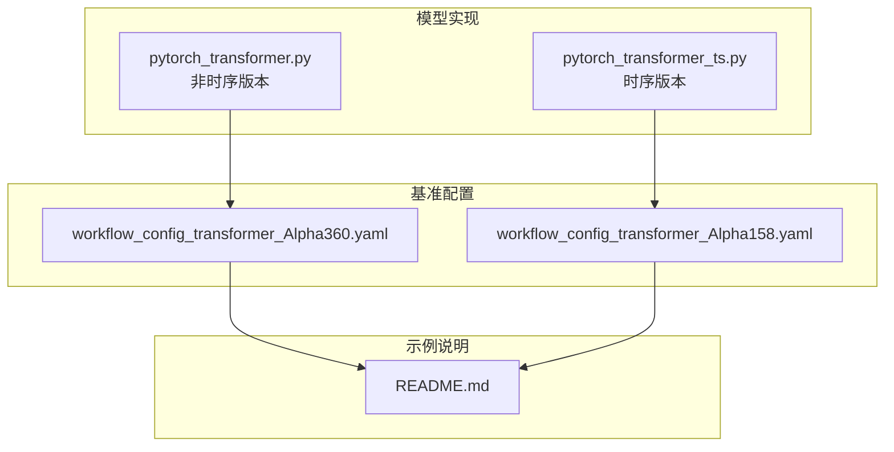
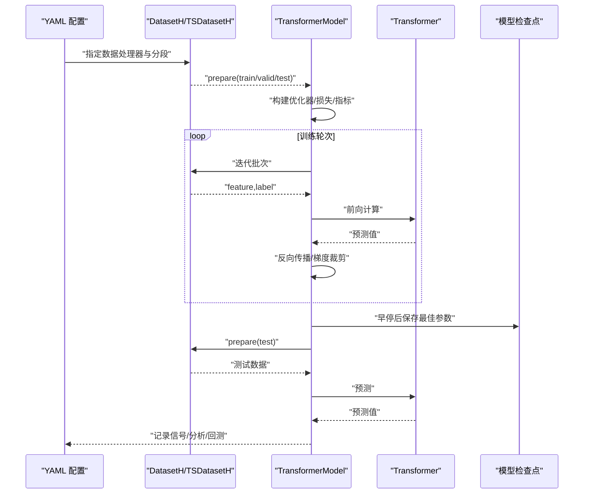
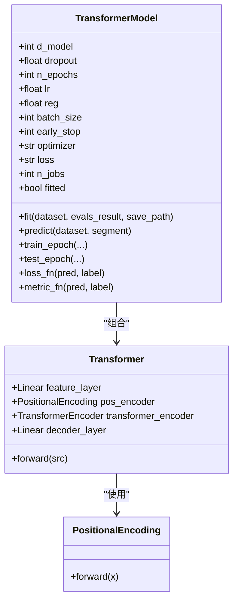
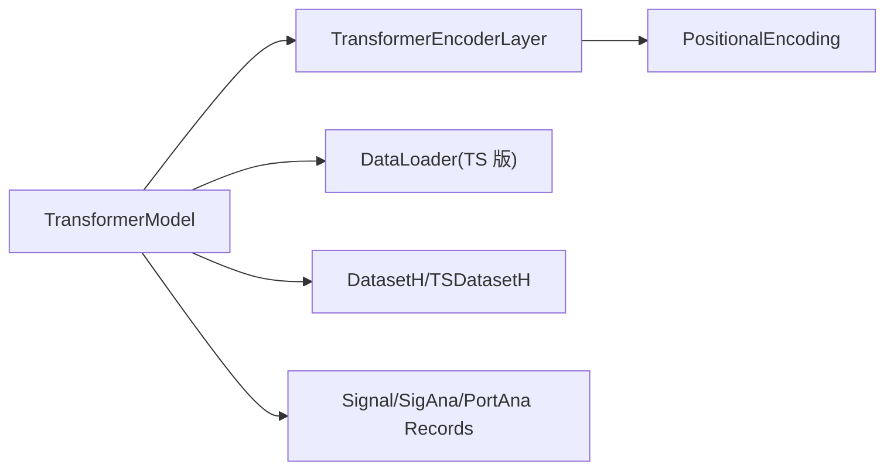

# Transformer 基准模型

<cite>
**本文引用的文件列表**
- [pytorch_transformer.py](file://qlib/contrib/model/pytorch_transformer.py)
- [pytorch_transformer_ts.py](file://qlib/contrib/model/pytorch_transformer_ts.py)
- [workflow_config_transformer_Alpha360.yaml](file://examples/benchmarks/Transformer/workflow_config_transformer_Alpha360.yaml)
- [workflow_config_transformer_Alpha158.yaml](file://examples/benchmarks/Transformer/workflow_config_transformer_Alpha158.yaml)
- [README.md](file://examples/benchmarks/Transformer/README.md)
</cite>

## 目录
1. [引言](#引言)
2. [项目结构](#项目结构)
3. [核心组件](#核心组件)
4. [架构总览](#架构总览)
5. [详细组件分析](#详细组件分析)
6. [依赖关系分析](#依赖关系分析)
7. [性能考量](#性能考量)
8. [故障排查指南](#故障排查指南)
9. [结论](#结论)
10. [附录](#附录)

## 引言
本文件系统化介绍 Qlib 中 Transformer 的基准实现，重点阐述其自注意力机制在金融时序建模中的优势，并结合 YAML 配置文件与源码，解析注意力头数、前馈网络维度、位置编码方式等关键参数。文档还给出如何运行该模型并在长序列预测任务上进行评估的方法，并提供注意力权重可视化的思路，帮助理解模型对不同时间步的关注程度。

## 项目结构
- 模型实现位于 qlib/contrib/model 下：
  - 非时序版本：pytorch_transformer.py（支持 DatasetH）
  - 时间序列版本：pytorch_transformer_ts.py（支持 TSDatasetH）
- 基准工作流配置位于 examples/benchmarks/Transformer：
  - Alpha360 与 Alpha158 的 YAML 配置
- 示例说明位于 examples/benchmarks/Transformer/README.md

图表来源
- [pytorch_transformer.py](file://qlib/contrib/model/pytorch_transformer.py#L1-L286)
- [pytorch_transformer_ts.py](file://qlib/contrib/model/pytorch_transformer_ts.py#L1-L265)
- [workflow_config_transformer_Alpha360.yaml](file://examples/benchmarks/Transformer/workflow_config_transformer_Alpha360.yaml#L1-L79)
- [workflow_config_transformer_Alpha158.yaml](file://examples/benchmarks/Transformer/workflow_config_transformer_Alpha158.yaml#L1-L88)
- [README.md](file://examples/benchmarks/Transformer/README.md#L1-L4)

章节来源
- [pytorch_transformer.py](file://qlib/contrib/model/pytorch_transformer.py#L1-L286)
- [pytorch_transformer_ts.py](file://qlib/contrib/model/pytorch_transformer_ts.py#L1-L265)
- [workflow_config_transformer_Alpha360.yaml](file://examples/benchmarks/Transformer/workflow_config_transformer_Alpha360.yaml#L1-L79)
- [workflow_config_transformer_Alpha158.yaml](file://examples/benchmarks/Transformer/workflow_config_transformer_Alpha158.yaml#L1-L88)
- [README.md](file://examples/benchmarks/Transformer/README.md#L1-L4)

## 核心组件
- TransformerModel：封装训练、验证、早停、保存与预测流程；负责损失函数、指标计算与优化器选择。
- Transformer：核心网络，包含特征映射层、位置编码、多层编码器与解码层。
- PositionalEncoding：正弦/余弦位置编码，为序列提供时间信息。

关键参数与职责
- d_feat：输入特征维数（非时序版本中为每个时间步的特征数量）
- d_model：隐藏状态维度（Transformer 内部状态大小）
- nhead：多头注意力头数
- num_layers：编码器层数
- dropout：丢弃率
- batch_size/n_epochs/lr/optimizer/loss/metric/early_stop/reg/GPU/seed：训练超参与设备选择

章节来源
- [pytorch_transformer.py](file://qlib/contrib/model/pytorch_transformer.py#L27-L110)
- [pytorch_transformer.py](file://qlib/contrib/model/pytorch_transformer.py#L258-L286)
- [pytorch_transformer_ts.py](file://qlib/contrib/model/pytorch_transformer_ts.py#L25-L100)
- [pytorch_transformer_ts.py](file://qlib/contrib/model/pytorch_transformer_ts.py#L238-L265)

## 架构总览
下图展示 Transformer 在 Qlib 中的端到端调用链路：YAML 配置 -> 数据集准备 -> 训练循环 -> 模型保存 -> 预测与记录。

图表来源
- [workflow_config_transformer_Alpha360.yaml](file://examples/benchmarks/Transformer/workflow_config_transformer_Alpha360.yaml#L46-L79)
- [pytorch_transformer.py](file://qlib/contrib/model/pytorch_transformer.py#L157-L215)
- [pytorch_transformer_ts.py](file://qlib/contrib/model/pytorch_transformer_ts.py#L137-L220)

## 详细组件分析

### 组件一：TransformerModel（非时序版本）
- 负责训练流程：随机打乱、批内迭代、损失计算、反向传播、梯度裁剪、早停与最佳参数保存。
- 负责评估流程：训练集与验证集上的损失与指标平均。
- 负责预测流程：按批推理并拼接结果，返回带索引的序列。

实现要点
- 损失函数：支持缺失标签掩码，仅对有效样本计算损失。
- 指标函数：默认使用负损失作为指标。
- 优化器：支持 Adam 与 SGD。
- 设备：自动选择 GPU/CPU 并可设置随机种子。

章节来源
- [pytorch_transformer.py](file://qlib/contrib/model/pytorch_transformer.py#L84-L156)
- [pytorch_transformer.py](file://qlib/contrib/model/pytorch_transformer.py#L157-L215)

### 组件二：Transformer（非时序版本）
- 输入预处理：将展平的 [N, F*T] 重塑为 [N, T, F]，线性映射到 d_model。
- 位置编码：将位置编码加到序列上。
- 多层编码器：使用 PyTorch 的 TransformerEncoderLayer 与 TransformerEncoder。
- 解码：取最后一个时间步的隐藏状态并通过线性层输出标量。

注意
- 未显式实现残差连接与层归一化；PyTorch 的 TransformerEncoderLayer 默认包含这些子层。

章节来源
- [pytorch_transformer.py](file://qlib/contrib/model/pytorch_transformer.py#L258-L286)

### 组件三：PositionalEncoding（非时序版本）
- 使用正弦/余弦函数生成固定位置编码，形状为 [max_len, d_model]，并注册为 buffer。
- 在 forward 中与输入相加，保持 [T, N, F] 的顺序。

章节来源
- [pytorch_transformer.py](file://qlib/contrib/model/pytorch_transformer.py#L242-L256)

### 组件四：TransformerModel（时序版本）
- 与非时序版本类似，但使用 DataLoader 进行批处理，支持填充策略（前向/后向填充）。
- 对训练/验证/测试阶段分别构造 DataLoader 并统一训练与评估流程。

章节来源
- [pytorch_transformer_ts.py](file://qlib/contrib/model/pytorch_transformer_ts.py#L102-L136)
- [pytorch_transformer_ts.py](file://qlib/contrib/model/pytorch_transformer_ts.py#L137-L220)

### 组件五：Transformer（时序版本）
- 输入为 [N, T, F]，直接进入特征映射层。
- 位置编码后通过编码器，取最后一个时间步的隐藏状态并线性解码。

章节来源
- [pytorch_transformer_ts.py](file://qlib/contrib/model/pytorch_transformer_ts.py#L238-L265)

### 组件六：YAML 配置（Alpha360）
- 模型类：TransformerModel，模块路径：qlib.contrib.model.pytorch_transformer
- 关键参数：d_feat、seed 等
- 数据集：DatasetH + Alpha360 处理器，划分 train/valid/test
- 记录：SignalRecord、SigAnaRecord、PortAnaRecord

章节来源
- [workflow_config_transformer_Alpha360.yaml](file://examples/benchmarks/Transformer/workflow_config_transformer_Alpha360.yaml#L46-L79)

### 组件七：YAML 配置（Alpha158）
- 模型类：TransformerModel，模块路径：qlib.contrib.model.pytorch_transformer_ts
- 数据集：TSDatasetH + Alpha158 处理器，设置 step_len=20
- 记录：同上

章节来源
- [workflow_config_transformer_Alpha158.yaml](file://examples/benchmarks/Transformer/workflow_config_transformer_Alpha158.yaml#L54-L88)

### 类关系图（代码级）

图表来源
- [pytorch_transformer.py](file://qlib/contrib/model/pytorch_transformer.py#L27-L110)
- [pytorch_transformer.py](file://qlib/contrib/model/pytorch_transformer.py#L242-L286)

## 依赖关系分析
- 模型依赖 PyTorch 的 nn.TransformerEncoderLayer 与 nn.TransformerEncoder，默认包含多头注意力、前馈网络、残差连接与层归一化。
- 数据依赖 qlib.data.dataset.DatasetH/TSDatasetH 与 DataHandlerLP，用于准备训练/验证/测试数据。
- 记录依赖 qlib.workflow.record_temp 中的 SignalRecord、SigAnaRecord、PortAnaRecord，用于信号记录、IC 分析与组合分析。

图表来源
- [pytorch_transformer.py](file://qlib/contrib/model/pytorch_transformer.py#L258-L286)
- [pytorch_transformer_ts.py](file://qlib/contrib/model/pytorch_transformer_ts.py#L137-L220)
- [workflow_config_transformer_Alpha360.yaml](file://examples/benchmarks/Transformer/workflow_config_transformer_Alpha360.yaml#L46-L79)
- [workflow_config_transformer_Alpha158.yaml](file://examples/benchmarks/Transformer/workflow_config_transformer_Alpha158.yaml#L54-L88)

章节来源
- [pytorch_transformer.py](file://qlib/contrib/model/pytorch_transformer.py#L258-L286)
- [pytorch_transformer_ts.py](file://qlib/contrib/model/pytorch_transformer_ts.py#L137-L220)
- [workflow_config_transformer_Alpha360.yaml](file://examples/benchmarks/Transformer/workflow_config_transformer_Alpha360.yaml#L46-L79)
- [workflow_config_transformer_Alpha158.yaml](file://examples/benchmarks/Transformer/workflow_config_transformer_Alpha158.yaml#L54-L88)

## 性能考量
- 批大小与设备：较大的 batch 可提升吞吐，GPU 可显著加速训练；可通过参数控制。
- 早停：当验证指标不再提升时停止训练，避免过拟合。
- 梯度裁剪：防止梯度爆炸，提高稳定性。
- 位置编码：固定编码，无需额外参数学习，开销低。
- 注意力头数与层数：头数越多、层数越深，表达能力越强，但计算与内存开销随之增加。

章节来源
- [pytorch_transformer.py](file://qlib/contrib/model/pytorch_transformer.py#L104-L156)
- [pytorch_transformer_ts.py](file://qlib/contrib/model/pytorch_transformer_ts.py#L102-L136)

## 故障排查指南
- 空数据报错：若训练或验证数据为空，会抛出异常提示检查数据集配置。
- 未拟合预测：在 predict 前需先 fit，否则会报错。
- 优化器不支持：当前实现支持 Adam 与 SGD，其他名称会抛出异常。
- 缺失标签处理：损失函数对 NaN 标签进行掩码，确保只计算有效样本。

章节来源
- [pytorch_transformer.py](file://qlib/contrib/model/pytorch_transformer.py#L163-L170)
- [pytorch_transformer.py](file://qlib/contrib/model/pytorch_transformer.py#L216-L239)
- [pytorch_transformer.py](file://qlib/contrib/model/pytorch_transformer.py#L70-L76)
- [pytorch_transformer.py](file://qlib/contrib/model/pytorch_transformer.py#L88-L103)

## 结论
Qlib 的 Transformer 基准模型以简洁的方式实现了自注意力机制，通过位置编码为序列提供时间信息，借助 PyTorch 的 TransformerEncoderLayer 自带的多头注意力、前馈网络、残差与层归一化，形成稳定的时序建模基线。YAML 配置清晰地将数据、模型与记录串联起来，便于快速复现实验并进行回测评估。对于长序列预测任务，该实现具备良好的可扩展性与可解释性基础。

## 附录

### 如何运行与评估
- 使用 qrun 直接运行 YAML 配置，自动完成数据准备、训练、验证、预测与记录。
- 若需本地调试，可参考 run.sh 中的命令行示例，或在 Python 中调用相应接口。

章节来源
- [workflow_config_transformer_Alpha360.yaml](file://examples/benchmarks/Transformer/workflow_config_transformer_Alpha360.yaml#L46-L79)
- [workflow_config_transformer_Alpha158.yaml](file://examples/benchmarks/Transformer/workflow_config_transformer_Alpha158.yaml#L54-L88)
- [README.md](file://examples/benchmarks/Transformer/README.md#L1-L4)

### 关键参数与含义（来自 YAML 与源码）
- d_feat：输入特征维数（非时序版本中为每个时间步的特征数量）
- d_model：隐藏状态维度
- nhead：多头注意力头数
- num_layers：编码器层数
- dropout：丢弃率
- batch_size/n_epochs/lr/optimizer/loss/metric/early_stop/reg/GPU/seed：训练超参与设备选择

章节来源
- [pytorch_transformer.py](file://qlib/contrib/model/pytorch_transformer.py#L27-L110)
- [pytorch_transformer_ts.py](file://qlib/contrib/model/pytorch_transformer_ts.py#L25-L100)
- [workflow_config_transformer_Alpha360.yaml](file://examples/benchmarks/Transformer/workflow_config_transformer_Alpha360.yaml#L46-L79)
- [workflow_config_transformer_Alpha158.yaml](file://examples/benchmarks/Transformer/workflow_config_transformer_Alpha158.yaml#L54-L88)

### 注意力权重可视化思路
- 当前实现未直接暴露注意力权重；可在以下方向扩展：
  - 修改 Transformer.forward，在编码器中间层返回注意力权重（需要自定义编码器层以收集注意力矩阵）。
  - 在训练/推理时额外输出注意力权重张量，保存为 NumPy 或 Pandas 文件。
  - 使用 Matplotlib/Seaborn 绘制热力图，横轴为时间步，纵轴为时间步或头索引，颜色深浅表示关注强度。
  - 将注意力权重与标签对齐，分析不同时间步对预测的影响。

说明：上述为通用可视化建议，具体实现需根据模型内部结构进行扩展。