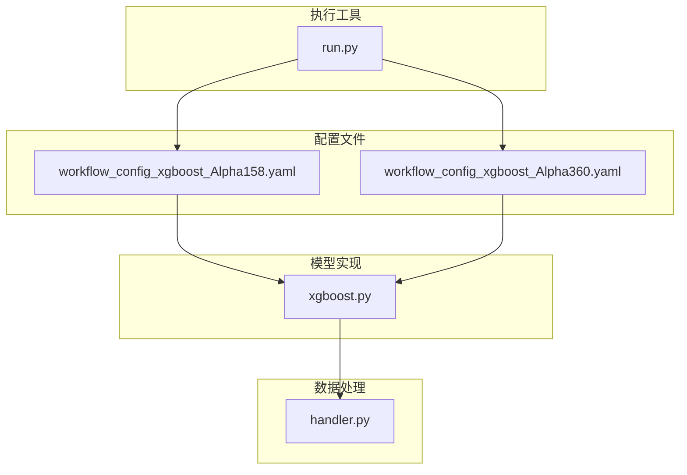
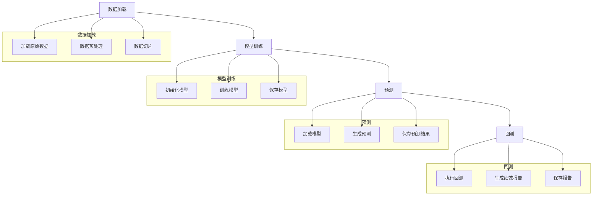
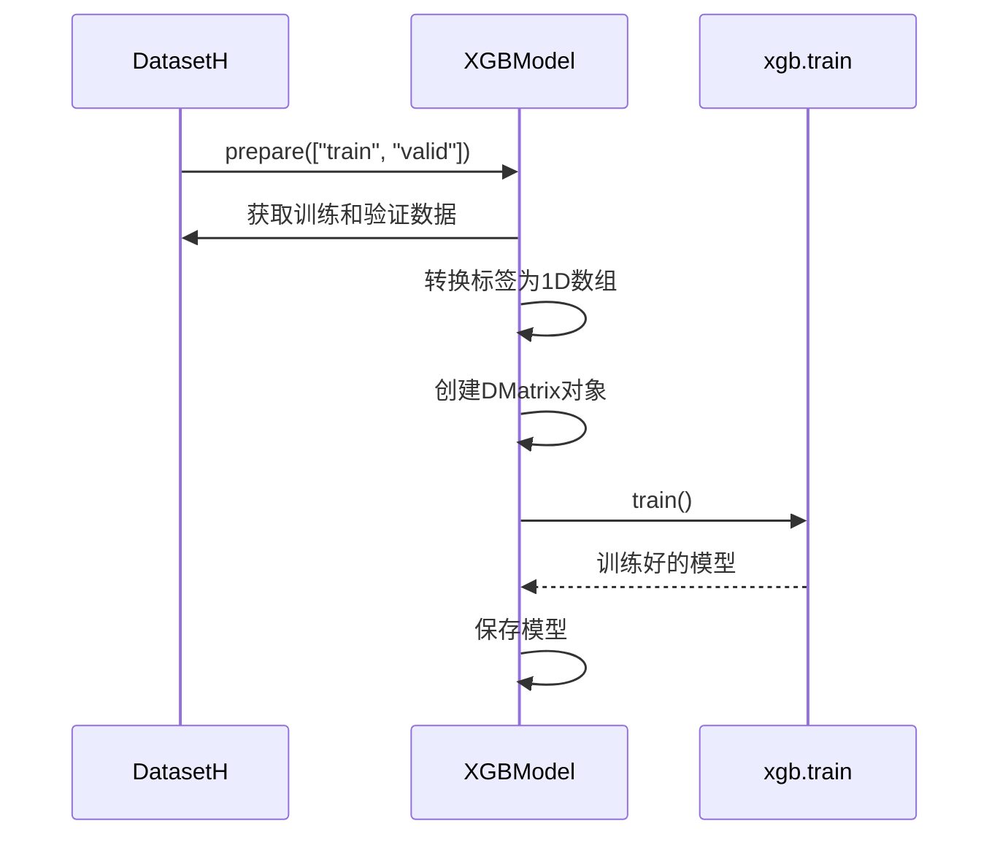
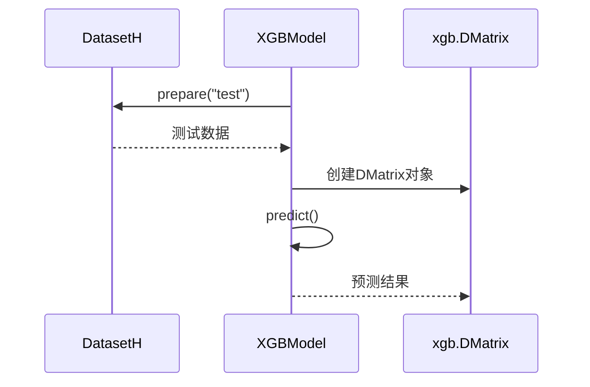
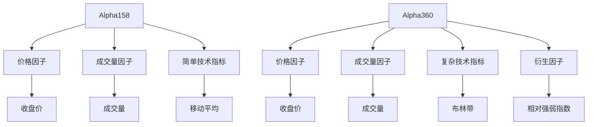
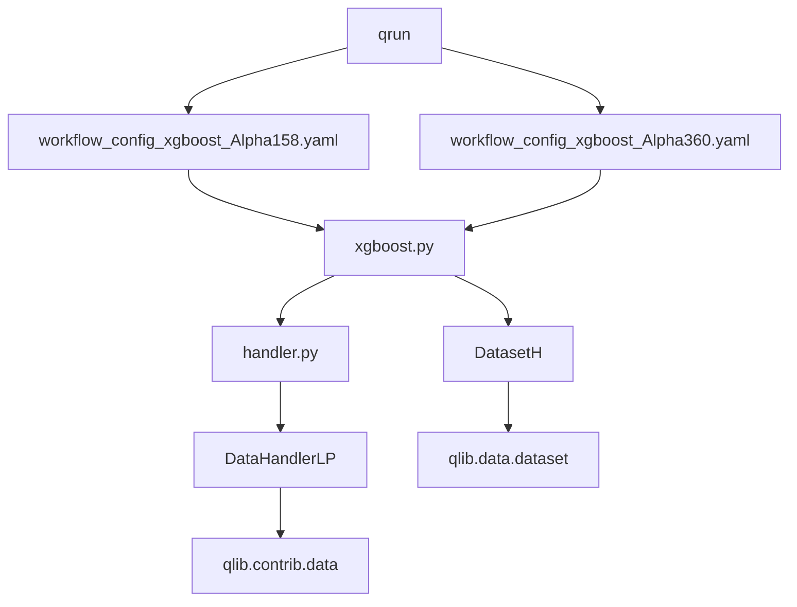

# XGBoost 基准模型

<cite>
**本文档中引用的文件**  
- [workflow_config_xgboost_Alpha158.yaml](file://examples/benchmarks/XGBoost/workflow_config_xgboost_Alpha158.yaml)
- [workflow_config_xgboost_Alpha360.yaml](file://examples/benchmarks/XGBoost/workflow_config_xgboost_Alpha360.yaml)
- [xgboost.py](file://qlib/contrib/model/xgboost.py)
- [handler.py](file://qlib/contrib/data/handler.py)
- [run.py](file://qlib/cli/run.py)
- [data.rst](file://docs/component/data.rst)
- [workflow.rst](file://docs/component/workflow.rst)
</cite>

## 目录
1. [简介](#简介)
2. [项目结构](#项目结构)
3. [核心组件](#核心组件)
4. [架构概述](#架构概述)
5. [详细组件分析](#详细组件分析)
6. [依赖分析](#依赖分析)
7. [性能考虑](#性能考虑)
8. [故障排除指南](#故障排除指南)
9. [结论](#结论)

## 简介
本文档系统介绍了XGBoost在Qlib平台上的基准应用，重点解析其YAML配置文件中关于数据加载、模型训练、预测和回测的定义。对比了Alpha158与Alpha360因子集在XGBoost工作流中的不同配置策略。说明了如何通过qrun命令执行XGBoost模型并获取预测结果与绩效报告。结合代码示例展示如何在Python中调用该模型配置，并解释其与其他组件（如data、strategy）的集成方式。提供了常见问题排查方法，如特征维度不匹配或训练中断。

## 项目结构
Qlib项目中的XGBoost基准模型位于`examples/benchmarks/XGBoost/`目录下，包含两个主要的YAML配置文件：`workflow_config_xgboost_Alpha158.yaml`和`workflow_config_xgboost_Alpha360.yaml`。这些配置文件定义了使用不同因子集的XGBoost模型的工作流。XGBoost模型的实现位于`qlib/contrib/model/xgboost.py`文件中，而相关的数据处理组件则分布在`qlib/contrib/data/`目录下。

**图示来源**
- [workflow_config_xgboost_Alpha158.yaml](file://examples/benchmarks/XGBoost/workflow_config_xgboost_Alpha158.yaml)
- [workflow_config_xgboost_Alpha360.yaml](file://examples/benchmarks/XGBoost/workflow_config_xgboost_Alpha360.yaml)
- [xgboost.py](file://qlib/contrib/model/xgboost.py)
- [handler.py](file://qlib/contrib/data/handler.py)
- [run.py](file://qlib/cli/run.py)

**节来源**
- [workflow_config_xgboost_Alpha158.yaml](file://examples/benchmarks/XGBoost/workflow_config_xgboost_Alpha158.yaml)
- [workflow_config_xgboost_Alpha360.yaml](file://examples/benchmarks/XGBoost/workflow_config_xgboost_Alpha360.yaml)

## 核心组件
XGBoost在Qlib平台上的核心组件包括YAML配置文件、XGBoost模型实现、数据处理组件和执行工具。YAML配置文件定义了整个工作流的参数，包括数据加载、模型训练、预测和回测。XGBoost模型实现位于`xgboost.py`文件中，提供了模型的训练、预测和特征重要性分析功能。数据处理组件负责加载和预处理数据，而执行工具`qrun`则用于运行整个工作流。

**节来源**
- [xgboost.py](file://qlib/contrib/model/xgboost.py)
- [workflow_config_xgboost_Alpha158.yaml](file://examples/benchmarks/XGBoost/workflow_config_xgboost_Alpha158.yaml)
- [workflow_config_xgboost_Alpha360.yaml](file://examples/benchmarks/XGBoost/workflow_config_xgboost_Alpha360.yaml)

## 架构概述
XGBoost在Qlib平台上的架构可以分为四个主要部分：数据加载、模型训练、预测和回测。数据加载部分负责从数据源加载数据并进行预处理；模型训练部分使用预处理后的数据训练XGBoost模型；预测部分使用训练好的模型对新数据进行预测；回测部分则评估模型的预测性能。

**图示来源**
- [workflow_config_xgboost_Alpha158.yaml](file://examples/benchmarks/XGBoost/workflow_config_xgboost_Alpha158.yaml)
- [workflow_config_xgboost_Alpha360.yaml](file://examples/benchmarks/XGBoost/workflow_config_xgboost_Alpha360.yaml)
- [xgboost.py](file://qlib/contrib/model/xgboost.py)

## 详细组件分析
### XGBoost模型分析
XGBoost模型在Qlib平台上的实现位于`xgboost.py`文件中，继承自`Model`类并实现了`FeatureInt`接口。模型的训练过程包括准备训练和验证数据、转换数据格式以适应XGBoost的要求、训练模型并记录训练结果。预测过程则包括加载测试数据、使用训练好的模型进行预测并返回预测结果。

#### 模型训练流程

**图示来源**
- [xgboost.py](file://qlib/contrib/model/xgboost.py#L23-L67)

#### 模型预测流程

**图示来源**
- [xgboost.py](file://qlib/contrib/model/xgboost.py#L71-L75)

**节来源**
- [xgboost.py](file://qlib/contrib/model/xgboost.py)

### Alpha158与Alpha360因子集对比
Alpha158和Alpha360是两种不同的因子集，它们在XGBoost工作流中的配置策略有所不同。Alpha158因子集主要关注价格、成交量等基本技术指标，而Alpha360因子集则包含了更多复杂的因子。

#### Alpha158配置特点
- 使用`Alpha158`类作为数据处理器
- 特征集相对简单，主要包含价格和成交量相关的因子
- 适用于基础的技术分析场景

#### Alpha360配置特点
- 使用`Alpha360`类作为数据处理器
- 特征集更为复杂，包含更多衍生因子
- 适用于需要更精细分析的场景

**图示来源**
- [workflow_config_xgboost_Alpha158.yaml](file://examples/benchmarks/XGBoost/workflow_config_xgboost_Alpha158.yaml#L48-L49)
- [workflow_config_xgboost_Alpha360.yaml](file://examples/benchmarks/XGBoost/workflow_config_xgboost_Alpha360.yaml#L55-L56)

**节来源**
- [workflow_config_xgboost_Alpha158.yaml](file://examples/benchmarks/XGBoost/workflow_config_xgboost_Alpha158.yaml)
- [workflow_config_xgboost_Alpha360.yaml](file://examples/benchmarks/XGBoost/workflow_config_xgboost_Alpha360.yaml)

## 依赖分析
XGBoost模型在Qlib平台上的运行依赖于多个组件，包括数据处理、模型训练、预测和回测等。这些组件之间的依赖关系如下：

**图示来源**
- [run.py](file://qlib/cli/run.py)
- [workflow_config_xgboost_Alpha158.yaml](file://examples/benchmarks/XGBoost/workflow_config_xgboost_Alpha158.yaml)
- [workflow_config_xgboost_Alpha360.yaml](file://examples/benchmarks/XGBoost/workflow_config_xgboost_Alpha360.yaml)
- [xgboost.py](file://qlib/contrib/model/xgboost.py)
- [handler.py](file://qlib/contrib/data/handler.py)

**节来源**
- [run.py](file://qlib/cli/run.py)
- [workflow_config_xgboost_Alpha158.yaml](file://examples/benchmarks/XGBoost/workflow_config_xgboost_Alpha158.yaml)
- [workflow_config_xgboost_Alpha360.yaml](file://examples/benchmarks/XGBoost/workflow_config_xgboost_Alpha360.yaml)

## 性能考虑
在使用XGBoost模型时，需要考虑以下几个性能因素：
- 数据预处理的效率：数据预处理是整个工作流中的瓶颈之一，需要优化数据加载和处理过程。
- 模型训练时间：XGBoost模型的训练时间较长，可以通过调整参数（如`n_estimators`、`max_depth`等）来平衡训练时间和模型性能。
- 内存使用：大规模数据集可能会导致内存不足，需要合理管理内存使用。

## 故障排除指南
在使用XGBoost模型时，可能会遇到一些常见问题，如特征维度不匹配或训练中断。以下是一些常见的故障排除方法：

### 特征维度不匹配
当特征维度不匹配时，通常是因为数据预处理过程中出现了问题。可以通过以下步骤进行排查：
1. 检查数据加载是否正确
2. 检查数据预处理步骤是否一致
3. 确认训练和测试数据的特征维度是否相同

### 训练中断
训练中断可能是由于内存不足或计算资源不足导致的。可以通过以下方法解决：
1. 减少数据集规模
2. 调整模型参数以减少内存使用
3. 增加计算资源

**节来源**
- [xgboost.py](file://qlib/contrib/model/xgboost.py)
- [workflow_config_xgboost_Alpha158.yaml](file://examples/benchmarks/XGBoost/workflow_config_xgboost_Alpha158.yaml)
- [workflow_config_xgboost_Alpha360.yaml](file://examples/benchmarks/XGBoost/workflow_config_xgboost_Alpha360.yaml)

## 结论
XGBoost在Qlib平台上的基准应用提供了一个完整的量化研究工作流，涵盖了数据加载、模型训练、预测和回测等各个环节。通过YAML配置文件，用户可以方便地定义和调整工作流参数。Alpha158和Alpha360因子集提供了不同的配置策略，适用于不同的分析场景。通过`qrun`命令，用户可以轻松地执行整个工作流并获取预测结果与绩效报告。在实际应用中，需要注意性能优化和常见问题的排查，以确保模型的稳定运行。