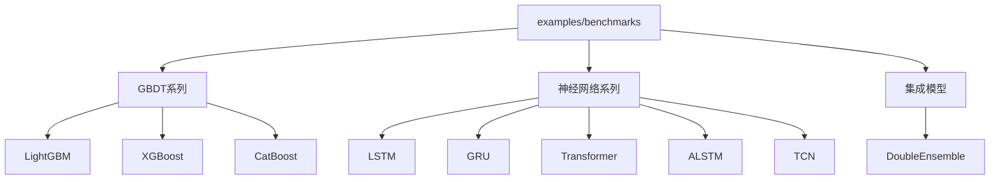
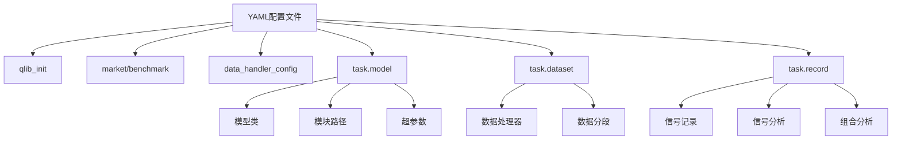

# 基准模型示例

<cite>
**本文档中引用的文件**  
- [README.md](file://examples/benchmarks/README.md)
- [LightGBM/README.md](file://examples/benchmarks/LightGBM/README.md)
- [XGBoost/README.md](file://examples/benchmarks/XGBoost/README.md)
- [CatBoost/README.md](file://examples/benchmarks/CatBoost/README.md)
- [LSTM/README.md](file://examples/benchmarks/LSTM/README.md)
- [GRU/README.md](file://examples/benchmarks/GRU/README.md)
- [Transformer/README.md](file://examples/benchmarks/Transformer/README.md)
- [ALSTM/README.md](file://examples/benchmarks/ALSTM/README.md)
- [TCN/README.md](file://examples/benchmarks/TCN/README.md)
- [DoubleEnsemble/README.md](file://examples/benchmarks/DoubleEnsemble/README.md)
- [workflow_config_lightgbm_Alpha158.yaml](file://examples/benchmarks/LightGBM/workflow_config_lightgbm_Alpha158.yaml)
- [workflow_config_lightgbm_Alpha360.yaml](file://examples/benchmarks/LightGBM/workflow_config_lightgbm_Alpha360.yaml)
- [workflow_config_xgboost_Alpha158.yaml](file://examples/benchmarks/XGBoost/workflow_config_xgboost_Alpha158.yaml)
- [workflow_config_catboost_Alpha158.yaml](file://examples/benchmarks/CatBoost/workflow_config_catboost_Alpha158.yaml)
- [workflow_config_lstm_Alpha158.yaml](file://examples/benchmarks/LSTM/workflow_config_lstm_Alpha158.yaml)
- [workflow_config_gru_Alpha158.yaml](file://examples/benchmarks/GRU/workflow_config_gru_Alpha158.yaml)
- [workflow_config_transformer_Alpha158.yaml](file://examples/benchmarks/Transformer/workflow_config_transformer_Alpha158.yaml)
- [workflow_config_alstm_Alpha158.yaml](file://examples/benchmarks/ALSTM/workflow_config_alstm_Alpha158.yaml)
- [workflow_config_tcn_Alpha158.yaml](file://examples/benchmarks/TCN/workflow_config_tcn_Alpha158.yaml)
- [workflow_config_doubleensemble_Alpha158.yaml](file://examples/benchmarks/DoubleEnsemble/workflow_config_doubleensemble_Alpha158.yaml)
- [LightGBM/features_sample.py](file://examples/benchmarks/LightGBM/features_sample.py)
- [LightGBM/features_resample_N.py](file://examples/benchmarks/LightGBM/features_resample_N.py)
- [LightGBM/multi_freq_handler.py](file://examples/benchmarks/LightGBM/multi_freq_handler.py)
</cite>

## 目录
1. [简介](#简介)
2. [项目结构](#项目结构)
3. [GBDT模型系列](#gbdt模型系列)
4. [神经网络模型系列](#神经网络模型系列)
5. [集成模型](#集成模型)
6. [特征工程与数据处理](#特征工程与数据处理)
7. [YAML配置文件详解](#yaml配置文件详解)
8. [运行流程与执行方式](#运行流程与执行方式)
9. [性能评估与回测指标](#性能评估与回测指标)
10. [Alpha因子应用差异](#alpha因子应用差异)

## 简介
本文档系统化整理了Qlib框架中`examples/benchmarks`目录下的所有基准模型示例。这些模型主要用于量化投资中的Alpha因子挖掘，通过预测股票未来超额收益来构建投资组合。文档涵盖GBDT系列（LightGBM、XGBoost、CatBoost）、神经网络系列（LSTM、GRU、Transformer、ALSTM、TCN等）以及集成模型（DoubleEnsemble）三大类模型。

每个模型都提供了独立的教程，详细解释其架构设计、配置文件结构、特征工程流程、训练与预测流程，并结合实际配置文件说明不同Alpha因子（Alpha158、Alpha360）的应用差异。同时提供运行步骤、依赖管理、预期输出结果及性能评估方法，帮助用户快速理解和使用这些基准模型。

**Section sources**
- [README.md](file://examples/benchmarks/README.md)

## 项目结构
`examples/benchmarks`目录下包含了多个子目录，每个子目录对应一个具体的基准模型实现。主要结构如下：

- **GBDT系列**：包含LightGBM、XGBoost、CatBoost等基于梯度提升决策树的模型
- **神经网络系列**：包含LSTM、GRU、Transformer、ALSTM、TCN等多种深度学习模型
- **集成模型**：包含DoubleEnsemble等高级集成学习方法
- **其他模型**：如Linear、MLP、TabNet等

每个模型目录都包含以下核心文件：
- `README.md`：模型介绍和相关论文链接
- `requirements.txt`：模型依赖的Python包
- `workflow_config_*.yaml`：工作流配置文件，用于qrun命令执行



**Diagram sources**
- [README.md](file://examples/benchmarks/README.md)

**Section sources**
- [README.md](file://examples/benchmarks/README.md)

## GBDT模型系列

### LightGBM
LightGBM是一种高效的梯度提升决策树框架，采用基于直方图的决策树算法和Leaf-wise生长策略，在保持高精度的同时大幅提升训练速度和内存效率。

在Qlib中的实现通过`qlib.contrib.model.gbdt.LGBModel`类完成，配置文件中关键参数包括：
- `loss`: 损失函数类型（如mse）
- `colsample_bytree`: 特征采样率
- `learning_rate`: 学习率
- `subsample`: 样本采样率
- `lambda_l1`和`lambda_l2`: L1和L2正则化系数
- `max_depth`和`num_leaves`: 树结构参数

LightGBM目录还包含特殊的特征处理文件，如`features_sample.py`中的`Resample1minProcessor`用于分钟级数据重采样，`multi_freq_handler.py`支持多频率数据处理。

**Section sources**
- [LightGBM/README.md](file://examples/benchmarks/LightGBM/README.md)
- [workflow_config_lightgbm_Alpha158.yaml](file://examples/benchmarks/LightGBM/workflow_config_lightgbm_Alpha158.yaml)
- [LightGBM/features_sample.py](file://examples/benchmarks/LightGBM/features_sample.py)
- [LightGBM/multi_freq_handler.py](file://examples/benchmarks/LightGBM/multi_freq_handler.py)

### XGBoost
XGBoost是另一种广泛使用的梯度提升框架，以其正则化技术和系统优化著称。在Qlib中通过`qlib.contrib.model.xgboost.XGBModel`实现。

XGBoost模型的配置与LightGBM类似，但具有不同的参数体系和优化目标。其核心优势在于对模型复杂度的显式控制和对缺失值的内置处理能力。

**Section sources**
- [XGBoost/README.md](file://examples/benchmarks/XGBoost/README.md)
- [workflow_config_xgboost_Alpha158.yaml](file://examples/benchmarks/XGBoost/workflow_config_xgboost_Alpha158.yaml)

### CatBoost
CatBoost是专门处理分类特征的梯度提升框架，采用有序提升（Ordered Boosting）技术来减少过拟合。在Qlib中通过`qlib.contrib.model.catboost_model.CatBoostModel`实现。

CatBoost特别适合处理包含大量分类变量的金融数据，在Alpha因子建模中表现出色。其主要特点包括：
- 对分类特征的自动处理
- 减少预测偏移的有序提升算法
- 强大的过拟合防御机制

**Section sources**
- [CatBoost/README.md](file://examples/benchmarks/CatBoost/README.md)
- [workflow_config_catboost_Alpha158.yaml](file://examples/benchmarks/CatBoost/workflow_config_catboost_Alpha158.yaml)

## 神经网络模型系列

### LSTM
长短期记忆网络（LSTM）是一种特殊的循环神经网络，能够学习长期依赖关系。在时间序列预测中表现优异，特别适合处理股票价格等金融时间序列数据。

在Qlib中通过`qlib.contrib.model.pytorch_lstm.PytorchLSTM`实现，配置文件中可设置隐藏层维度、层数等超参数。LSTM模型能够捕捉金融时间序列中的非线性模式和长期趋势。

**Section sources**
- [LSTM/README.md](file://examples/benchmarks/LSTM/README.md)
- [workflow_config_lstm_Alpha158.yaml](file://examples/benchmarks/LSTM/workflow_config_lstm_Alpha158.yaml)

### GRU
门控循环单元（GRU）是LSTM的简化版本，通过合并遗忘门和输入门来减少模型复杂度。在保持类似性能的同时，训练速度更快，参数更少。

在Qlib中通过`qlib.contrib.model.pytorch_gru.PytorchGRU`实现，适合需要快速迭代和轻量级模型的场景。GRU在处理中短期时间序列模式时表现良好。

**Section sources**
- [GRU/README.md](file://examples/benchmarks/GRU/README.md)
- [workflow_config_gru_Alpha158.yaml](file://examples/benchmarks/GRU/workflow_config_gru_Alpha158.yaml)

### Transformer
Transformer模型基于自注意力机制，能够并行处理序列数据，克服了RNN系列模型的顺序计算瓶颈。在长序列建模中表现出色。

在Qlib中通过`qlib.contrib.model.pytorch_transformer.PytorchTransformer`实现，特别适合处理包含长期依赖关系的金融时间序列。其自注意力机制能够自动学习不同时间步之间的相关性权重。

**Section sources**
- [Transformer/README.md](file://examples/benchmarks/Transformer/README.md)
- [workflow_config_transformer_Alpha158.yaml](file://examples/benchmarks/Transformer/workflow_config_transformer_Alpha158.yaml)

### ALSTM
ALSTM是在标准LSTM基础上增加了时间注意力聚合层的改进模型。通过注意力机制为不同时间步的隐藏状态分配不同权重，增强模型对关键时间点的敏感度。

在Qlib中实现为LSTM与注意力机制的结合，能够更好地捕捉金融时间序列中的关键转折点。根据文档说明，当前实现是ALSTM的简化版本。

**Section sources**
- [ALSTM/README.md](file://examples/benchmarks/ALSTM/README.md)
- [workflow_config_alstm_Alpha158.yaml](file://examples/benchmarks/ALSTM/workflow_config_alstm_Alpha158.yaml)

### TCN
时间卷积网络（TCN）使用扩张因果卷积来处理序列数据，能够捕捉长期依赖关系，同时保持并行计算的优势。与RNN相比，TCN具有更稳定的梯度和更长的感受野。

在Qlib中通过`qlib.contrib.model.pytorch_tcn.PytorchTCN`实现，适合处理需要大范围时间上下文的金融预测任务。其因果卷积结构确保了预测时不会泄露未来信息。

**Section sources**
- [TCN/README.md](file://examples/benchmarks/TCN/README.md)
- [workflow_config_tcn_Alpha158.yaml](file://examples/benchmarks/TCN/workflow_config_tcn_Alpha158.yaml)

## 集成模型

### DoubleEnsemble
DoubleEnsemble是一种基于样本重加权和特征选择的集成学习框架，旨在解决金融数据中信号噪声比低和特征数量增加的问题。

该模型通过两个阶段的集成：
1. **基于学习轨迹的样本重加权**：识别关键样本
2. **基于打乱的特征选择**：提取关键特征

在Qlib中，DoubleEnsemble的基础模型通常是LGBM，通过组合多个弱学习器来提高预测稳定性和准确性，有效缓解金融市场预测中的过拟合和不稳定性问题。

**Section sources**
- [DoubleEnsemble/README.md](file://examples/benchmarks/DoubleEnsemble/README.md)
- [workflow_config_doubleensemble_Alpha158.yaml](file://examples/benchmarks/DoubleEnsemble/workflow_config_doubleensemble_Alpha158.yaml)

## 特征工程与数据处理
Qlib提供了丰富的特征工程工具和数据处理方法，支持多种数据源和频率的处理。

### Alpha158与Alpha360差异
- **Alpha158**：表格化数据集，特征经过精心设计的人工特征工程，特征间空间关系较弱
- **Alpha360**：包含原始价格和成交量数据，未经大量特征工程处理，特征在时间维度上具有强烈的空间关系

### 多频率数据处理
LightGBM目录中的`multi_freq_handler.py`展示了如何处理多频率数据源，通过结合日频和15分钟频数据进行每日预测。`features_resample_N.py`中的`ResampleNProcessor`支持将分钟级数据重采样到目标频率。

### 数据预处理
配置文件中的`learn_processors`定义了学习阶段的数据处理流程，常见处理器包括：
- `DropnaLabel`：删除标签为空的样本
- `CSRankNorm`：横截面排名归一化，用于消除量纲影响

**Section sources**
- [README.md](file://examples/benchmarks/README.md)
- [LightGBM/multi_freq_handler.py](file://examples/benchmarks/LightGBM/multi_freq_handler.py)
- [LightGBM/features_resample_N.py](file://examples/benchmarks/LightGBM/features_resample_N.py)

## YAML配置文件详解
YAML配置文件定义了整个工作流的执行参数，主要包含以下几个部分：

### qlib_init
Qlib初始化配置，指定数据提供者路径和区域。

### market与benchmark
定义交易市场和基准指数，如csi300和SH000300。

### data_handler_config
数据处理器配置，包括时间范围、标的池等。

### task.model
模型配置，指定模型类、模块路径和超参数。

### task.dataset
数据集配置，定义数据处理器（如Alpha158、Alpha360）和数据分段（训练、验证、测试）。

### task.record
记录器配置，包括信号记录、信号分析和组合分析等。



**Diagram sources**
- [workflow_config_lightgbm_Alpha158.yaml](file://examples/benchmarks/LightGBM/workflow_config_lightgbm_Alpha158.yaml)

**Section sources**
- [workflow_config_lightgbm_Alpha158.yaml](file://examples/benchmarks/LightGBM/workflow_config_lightgbm_Alpha158.yaml)

## 运行流程与执行方式
基准模型可以通过多种方式执行：

### qrun命令行方式
```bash
qrun workflow_config_lightgbm_Alpha158.yaml
```

### Python API方式
通过导入Qlib工作流模块，以编程方式执行配置文件定义的任务。

### 批量运行
使用`run_all_model.py`脚本批量运行多个模型，支持指定运行次数以获得统计稳定的性能指标。

### 模型迁移
将CSI300模型迁移到CSI500只需修改配置文件中的市场和基准指数参数，如将csi300替换为csi500，SH000300替换为SH000905。

**Section sources**
- [README.md](file://examples/benchmarks/README.md)

## 性能评估与回测指标
模型性能通过信号基础和组合基础两类指标评估：

### 信号基础评估
- **IC**（信息系数）：预测值与实际收益的相关系数
- **ICIR**（IC信息比率）：IC均值与标准差的比值
- **Rank IC**：预测值排名与实际收益排名的相关系数
- **Rank ICIR**：Rank IC的均值与标准差比值

### 组合基础评估
- **年化收益率**：投资组合的年化回报率
- **信息比率**：超额收益与跟踪误差的比值
- **最大回撤**：投资组合价值从峰值到谷值的最大损失

回测配置中包含交易成本、涨跌停限制等真实市场因素，确保评估结果的实用性。

**Section sources**
- [README.md](file://examples/benchmarks/README.md)

## Alpha因子应用差异
不同Alpha因子在模型应用中表现出显著差异：

### Alpha158特点
- 经过精心设计的人工特征
- 特征间相关性较弱
- 适合传统机器学习模型
- 在LightGBM等树模型上表现优异

### Alpha360特点
- 原始价格和成交量数据
- 特征在时间维度上有强相关性
- 适合深度学习模型
- 在LSTM、Transformer等序列模型上表现更好

模型选择应根据Alpha因子的特点进行：对于结构化特征（Alpha158），GBDT系列模型通常表现最佳；对于原始时序数据（Alpha360），神经网络模型能更好地捕捉复杂模式。

**Section sources**
- [README.md](file://examples/benchmarks/README.md)