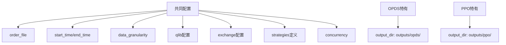
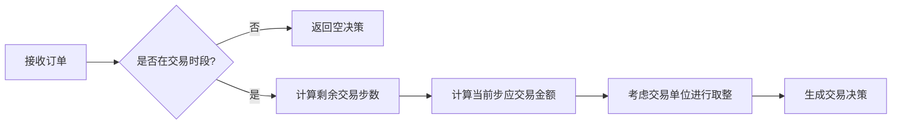
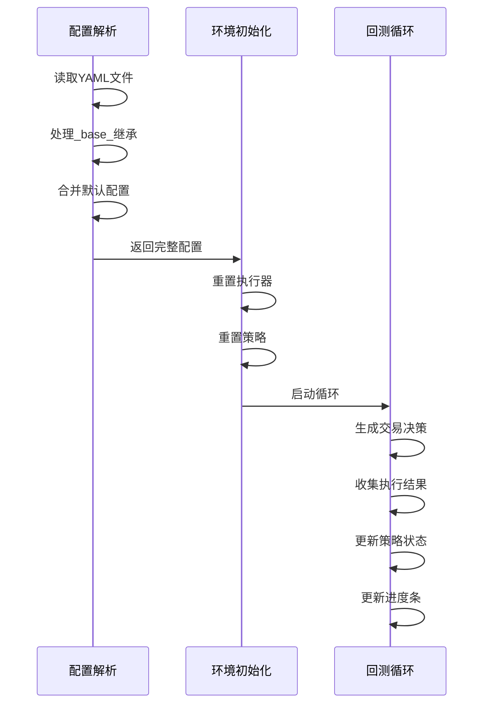

# 回测配置详解

<cite>
**本文档中引用的文件**  
- [backtest_opds.yml](file://examples/rl_order_execution/exp_configs/backtest_opds.yml)
- [backtest_ppo.yml](file://examples/rl_order_execution/exp_configs/backtest_ppo.yml)
- [backtest_twap.yml](file://examples/rl_order_execution/exp_configs/backtest_twap.yml)
- [backtest.py](file://qlib/backtest/backtest.py)
- [naive_config_parser.py](file://qlib/rl/contrib/naive_config_parser.py)
- [rule_strategy.py](file://qlib/contrib/strategy/rule_strategy.py)
- [policy.py](file://qlib/rl/order_execution/policy.py)
</cite>

## 目录
1. [引言](#引言)
2. [核心配置文件结构](#核心配置文件结构)
3. [关键参数详解](#关键参数详解)
4. [OPDS与PPO配置对比](#opds与ppo配置对比)
5. [TWAP配置特点](#twap配置特点)
6. [配置解析与环境初始化](#配置解析与环境初始化)
7. [配置调试技巧](#配置调试技巧)
8. [结论](#结论)

## 引言
本文档深入分析QLib框架中OPDS、PPO及TWAP基准策略的回测配置文件结构。通过详细解读配置文件中的关键参数，阐述如何指定模型检查点、回测时间段和交易标的等重要设置。文档将对比分析不同策略配置的异同，特别是OPDS与PPO在环境设置上的区别，并结合代码说明配置如何被解析并初始化回测环境。重点阐述TWAP作为规则型基线的配置特点，解释其预期PA值接近零的理论依据，并提供实用的配置调试技巧。

## 核心配置文件结构
OPDS、PPO和TWAP策略的回测配置文件均采用YAML格式，遵循QLib的配置设计逻辑。这些配置文件定义了回测流程中各个组件的初始化参数，包括订单文件、时间范围、数据粒度、QLib配置、交易所设置、策略定义、并发数和输出目录等。

所有配置文件都包含以下核心部分：
- `order_file`: 指定订单文件路径
- `start_time` 和 `end_time`: 定义回测的时间范围
- `data_granularity`: 设置数据粒度
- `qlib`: QLib框架的配置，包括数据提供者URI
- `exchange`: 交易所相关配置，如价格限制和成交价格
- `strategies`: 定义回测中使用的策略
- `concurrency`: 并发执行的线程数
- `output_dir`: 回测结果的输出目录

**Section sources**
- [backtest_opds.yml](file://examples/rl_order_execution/exp_configs/backtest_opds.yml)
- [backtest_ppo.yml](file://examples/rl_order_execution/exp_configs/backtest_ppo.yml)
- [backtest_twap.yml](file://examples/rl_order_execution/exp_configs/backtest_twap.yml)

## 关键参数详解
### 模型检查点(weight_file)
模型检查点参数用于指定训练好的模型权重文件路径，是连接训练和回测的关键。在OPDS和PPO配置文件中，该参数位于策略的`policy`部分的`kwargs`中，被注释掉以供用户根据需要启用。

```yaml
policy:
  class: PPO
  kwargs:
    lr: 0.0001
    # weight_file: outputs/opds/checkpoints/latest.pth
  module_path: qlib.rl.order_execution.policy
```

当需要使用特定检查点进行回测时，用户只需取消注释`weight_file`行并指定正确的路径。该路径通常指向训练输出目录中的`.pth`文件。

### 回测时间段
回测时间段通过`start_time`和`end_time`两个参数定义，指定了回测执行的具体时间范围。这两个参数以字符串形式表示时间，如"9:30"和"14:54"，代表从上午9:30到下午14:54的交易时段。

### 交易标的
交易标的在订单文件中定义，而不是直接在回测配置文件中指定。订单文件（如`test_orders.pkl`）包含了具体的股票代码、交易数量和方向等信息。配置文件通过`order_file`参数引用这个订单文件，从而间接确定了交易标的。

**Section sources**
- [backtest_opds.yml](file://examples/rl_order_execution/exp_configs/backtest_opds.yml#L2-L3)
- [backtest_ppo.yml](file://examples/rl_order_execution/exp_configs/backtest_ppo.yml#L2-L3)
- [backtest_twap.yml](file://examples/rl_order_execution/exp_configs/backtest_twap.yml#L2-L3)

## OPDS与PPO配置对比
OPDS和PPO策略的回测配置文件在结构上几乎完全相同，这反映了它们共享相似的回测框架和环境设置。两者的主要区别在于输出目录和模型检查点路径。



**Diagram sources**
- [backtest_opds.yml](file://examples/rl_order_execution/exp_configs/backtest_opds.yml)
- [backtest_ppo.yml](file://examples/rl_order_execution/exp_configs/backtest_ppo.yml)

### 环境设置区别
尽管OPDS和PPO的配置文件结构相似，但它们在实际运行时可能使用不同的训练配置，这体现在`train_opds.yml`和`train_ppo.yml`文件中。主要区别包括：

1. **奖励函数**: OPDS使用`PAPenaltyReward`，而PPO使用`PPOReward`
2. **检查点路径**: OPDS的检查点保存在`./outputs/opds`，PPO的检查点保存在`./outputs/ppo`
3. **特征列**: 训练配置中使用的特征列可能不同，影响模型输入

这些差异导致了两种策略在训练过程中的不同行为，尽管它们的回测配置非常相似。

**Section sources**
- [train_opds.yml](file://examples/rl_order_execution/exp_configs/train_opds.yml)
- [train_ppo.yml](file://examples/rl_order_execution/exp_configs/train_ppo.yml)

## TWAP配置特点
TWAP（时间加权平均价格）策略作为规则型基线，其配置具有显著特点。与OPDS和PPO不同，TWAP配置文件中的`strategies`部分仅包含`TWAPStrategy`，没有复杂的神经网络和策略参数。

```yaml
strategies:
  1day:
    class: TWAPStrategy
    kwargs: {}
    module_path: qlib.contrib.strategy.rule_strategy
  30min:
    class: TWAPStrategy
    kwargs: {}
    module_path: qlib.contrib.strategy.rule_strategy
```

### 预期PA值接近零的理论依据
TWAP策略的预期PA（Profit and Loss Attribution）值接近零，这基于以下理论依据：

1. **市场中性**: TWAP策略旨在将大额订单均匀分布在指定时间段内，不预测市场方向，因此不应产生超额收益
2. **执行成本最小化**: 其主要目标是最小化市场冲击成本，而不是获取alpha收益
3. **基准作用**: 作为基准策略，TWAP提供了一个"无技能"执行的参考点，任何优于TWAP的策略都表明具有实际的执行优势

TWAP策略的实现位于`rule_strategy.py`文件中，其`generate_trade_decision`方法简单地将订单金额平均分配到各个交易时段。



**Diagram sources**
- [rule_strategy.py](file://qlib/contrib/strategy/rule_strategy.py#L22-L122)
- [backtest_twap.yml](file://examples/rl_order_execution/exp_configs/backtest_twap.yml)

**Section sources**
- [backtest_twap.yml](file://examples/rl_order_execution/exp_configs/backtest_twap.yml)
- [rule_strategy.py](file://qlib/contrib/strategy/rule_strategy.py)

## 配置解析与环境初始化
回测配置的解析和环境初始化过程涉及多个组件的协同工作。这个过程从`backtest.py`中的`backtest_loop`函数开始，通过`collect_data_loop`生成器函数实现。

### 配置解析流程
配置解析主要由`naive_config_parser.py`文件中的`get_backtest_config_fromfile`函数处理。该函数执行以下步骤：

1. 使用`parse_backtest_config`读取YAML文件
2. 处理`_base_`字段，支持配置继承
3. 合并默认配置，包括交易所默认参数
4. 转换列表为元组，确保配置的不可变性

```python
def get_backtest_config_fromfile(path: str) -> dict:
    backtest_config = parse_backtest_config(path)
    exchange_config_default = {
        "open_cost": 0.0005,
        "close_cost": 0.0015,
        "min_cost": 5.0,
        "trade_unit": 100.0,
        "cash_limit": None,
    }
    backtest_config["exchange"] = merge_a_into_b(a=backtest_config["exchange"], b=exchange_config_default)
    return backtest_config
```

### 环境初始化
环境初始化过程在`backtest.py`中实现，主要涉及以下步骤：

1. 重置执行器（executor）和策略（strategy）
2. 使用进度条显示回测进度
3. 循环执行交易决策和执行结果的收集
4. 在回测结束后收集投资组合指标和交易指标

`collect_data_loop`函数是核心，它协调策略和执行器的交互，生成交易决策并收集执行结果。



**Diagram sources**
- [naive_config_parser.py](file://qlib/rl/contrib/naive_config_parser.py#L83-L107)
- [backtest.py](file://qlib/backtest/backtest.py#L53-L110)

**Section sources**
- [backtest.py](file://qlib/backtest/backtest.py)
- [naive_config_parser.py](file://qlib/rl/contrib/naive_config_parser.py)

## 配置调试技巧
### 定位检查点路径错误
当回测因检查点路径错误而失败时，可以按照以下步骤进行调试：

1. **验证路径存在性**: 确认`weight_file`指定的路径确实存在
2. **检查文件权限**: 确保进程有读取该文件的权限
3. **验证文件完整性**: 确认检查点文件未损坏
4. **检查模型兼容性**: 确保检查点文件与当前代码版本兼容

在`policy.py`文件中，`PPO`类的初始化代码会尝试加载权重文件，如果失败会抛出异常：

```python
if weight_file is not None:
    set_weight(self, Trainer.get_policy_state_dict(weight_file))
```

### 通用调试建议
- 使用绝对路径而非相对路径，避免路径解析问题
- 在配置文件中添加注释，说明每个参数的用途
- 从小规模数据开始测试，逐步扩大到完整数据集
- 启用详细的日志记录，以便追踪问题根源
- 使用版本控制管理配置文件，便于回溯和比较

**Section sources**
- [policy.py](file://qlib/rl/order_execution/policy.py#L157-L158)
- [backtest.py](file://qlib/backtest/backtest.py)

## 结论
本文档全面分析了OPDS、PPO及TWAP基准策略的回测配置文件结构。通过详细解读配置文件中的关键参数，我们了解了如何指定模型检查点、回测时间段和交易标的等重要设置。OPDS与PPO配置在结构上高度相似，主要区别体现在输出目录和训练配置上。TWAP作为规则型基线，其配置简单直接，预期PA值接近零，为评估其他策略提供了重要参考。配置解析和环境初始化过程展示了QLib框架的模块化设计，通过`naive_config_parser.py`和`backtest.py`等组件的协同工作，实现了灵活而强大的回测功能。最后，提供的配置调试技巧有助于快速定位和解决常见的配置问题，确保回测过程的顺利进行。