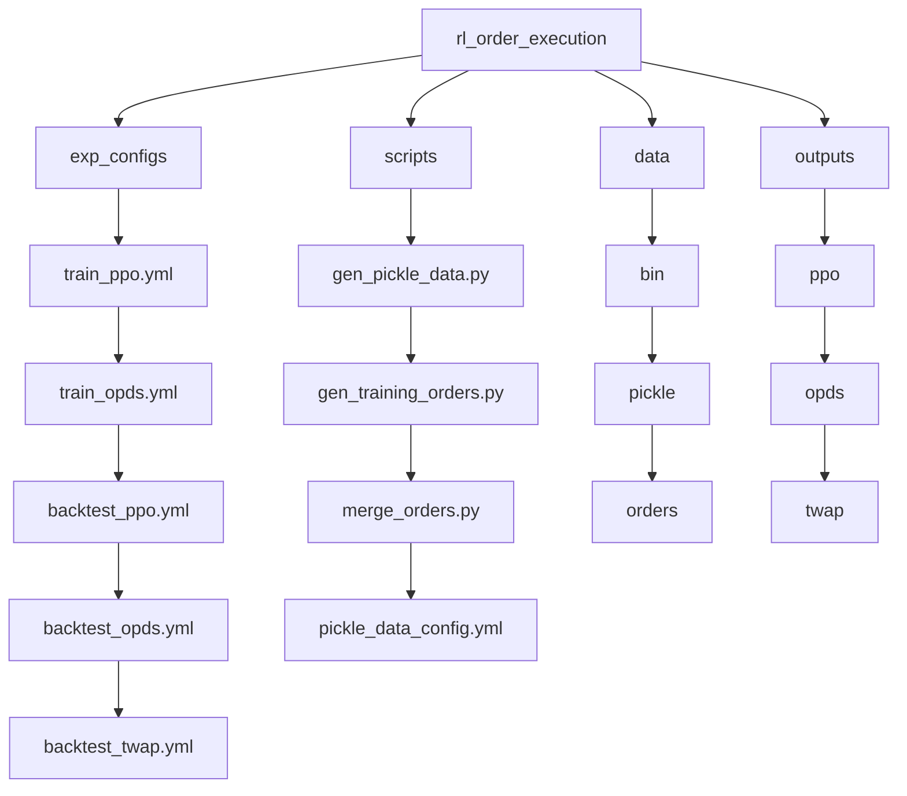
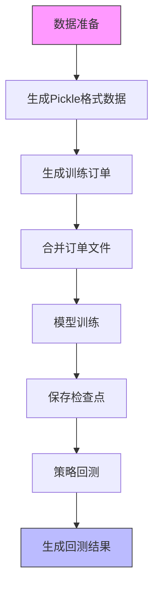
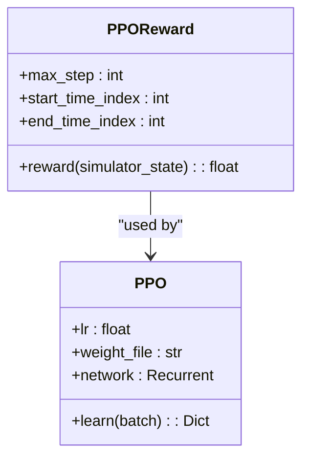
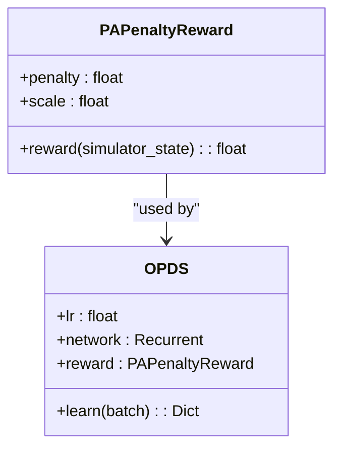
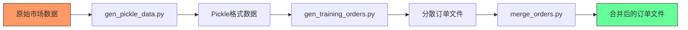
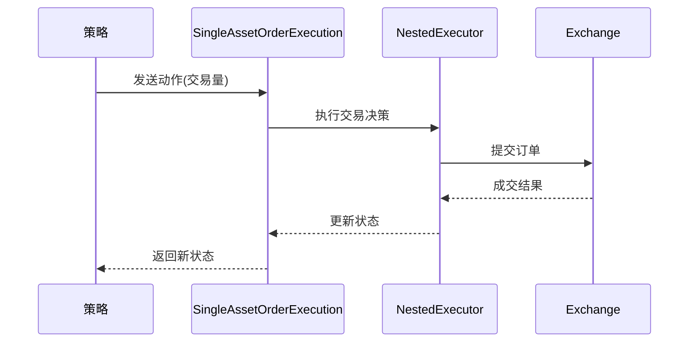

# 强化学习订单执行示例

<cite>
**本文档引用的文件**
- [README.md](file://examples/rl_order_execution/README.md)
- [backtest_opds.yml](file://examples/rl_order_execution/exp_configs/backtest_opds.yml)
- [train_ppo.yml](file://examples/rl_order_execution/exp_configs/train_ppo.yml)
- [gen_pickle_data.py](file://examples/rl_order_execution/scripts/gen_pickle_data.py)
- [merge_orders.py](file://examples/rl_order_execution/scripts/merge_orders.py)
- [simulator_qlib.py](file://qlib/rl/order_execution/simulator_qlib.py)
- [state.py](file://qlib/rl/order_execution/state.py)
- [reward.py](file://qlib/rl/order_execution/reward.py)
- [network.py](file://qlib/rl/order_execution/network.py)
- [policy.py](file://qlib/rl/order_execution/policy.py)
- [train_opds.yml](file://examples/rl_order_execution/exp_configs/train_opds.yml)
- [backtest_ppo.yml](file://examples/rl_order_execution/exp_configs/backtest_ppo.yml)
- [backtest_twap.yml](file://examples/rl_order_execution/exp_configs/backtest_twap.yml)
- [gen_training_orders.py](file://examples/rl_order_execution/scripts/gen_training_orders.py)
- [pickle_data_config.yml](file://examples/rl_order_execution/scripts/pickle_data_config.yml)
</cite>

## 目录
1. [简介](#简介)
2. [项目结构](#项目结构)
3. [核心组件](#核心组件)
4. [训练与回测流程](#训练与回测流程)
5. [策略配置详解](#策略配置详解)
6. [训练数据准备](#训练数据准备)
7. [市场模拟器分析](#市场模拟器分析)
8. [状态、动作与奖励设计](#状态动作与奖励设计)
9. [调试技巧](#调试技巧)
10. [结论](#结论)

## 简介

本文档全面讲解rl_order_execution示例中基于强化学习的订单执行策略实现。该示例展示了如何使用强化学习方法（如PPO和OPDS）来优化交易执行过程，同时提供了传统基准策略（如TWAP）进行性能对比。系统通过Qlib框架提供的市场数据和回测工具，实现了从数据预处理、模型训练到策略回测的完整工作流。

**Section sources**
- [README.md](file://examples/rl_order_execution/README.md)

## 项目结构

rl_order_execution示例的项目结构清晰地划分了配置、脚本和数据处理三个主要部分。`exp_configs/`目录包含训练和回测的YAML配置文件，`scripts/`目录包含数据生成和处理脚本，而训练和回测过程中产生的输出则存储在`outputs/`目录中。

**Diagram sources**
- [README.md](file://examples/rl_order_execution/README.md)

**Section sources**
- [README.md](file://examples/rl_order_execution/README.md)

## 核心组件

本示例的核心组件包括策略网络、状态解释器、动作解释器、奖励函数和市场模拟器。这些组件共同构成了强化学习订单执行系统的基础架构。策略网络（如Recurrent网络）负责从状态中学习最优动作策略，状态解释器（如FullHistoryStateInterpreter）负责将原始市场数据转换为适合模型输入的状态表示，而奖励函数则定义了策略优化的目标。

**Section sources**
- [network.py](file://qlib/rl/order_execution/network.py)
- [state.py](file://qlib/rl/order_execution/state.py)
- [reward.py](file://qlib/rl/order_execution/reward.py)
- [policy.py](file://qlib/rl/order_execution/policy.py)

## 训练与回测流程

强化学习订单执行的完整流程包括数据准备、模型训练和策略回测三个阶段。训练阶段使用简化的市场模拟器以提高效率，而回测阶段则使用更真实的市场模拟器来评估策略的实际表现。这种设计允许在训练时快速迭代，同时在回测时获得更接近真实交易环境的结果。

**Diagram sources**
- [README.md](file://examples/rl_order_execution/README.md)
- [gen_pickle_data.py](file://examples/rl_order_execution/scripts/gen_pickle_data.py)
- [gen_training_orders.py](file://examples/rl_order_execution/scripts/gen_training_orders.py)
- [merge_orders.py](file://examples/rl_order_execution/scripts/merge_orders.py)

**Section sources**
- [README.md](file://examples/rl_order_execution/README.md)

## 策略配置详解

### PPO策略配置

PPO（Proximal Policy Optimization）策略在`train_ppo.yml`配置文件中定义，其核心特点是使用PPOReward作为奖励函数。该奖励函数在交易周期结束时根据VWAP与TWAP的价格优势来计算奖励，鼓励策略在完成订单的同时获得更好的执行价格。

**Diagram sources**
- [train_ppo.yml](file://examples/rl_order_execution/exp_configs/train_ppo.yml)
- [reward.py](file://qlib/rl/order_execution/reward.py)
- [policy.py](file://qlib/rl/order_execution/policy.py)

### OPDS策略配置

OPDS（Oracle Policy Distillation for Order Execution）策略在`train_opds.yml`配置文件中定义，其主要特点是使用PAPenaltyReward作为奖励函数。该奖励函数不仅考虑价格优势（PA），还对短时间内大量交易施加惩罚，从而鼓励更平稳的交易行为。

**Diagram sources**
- [train_opds.yml](file://examples/rl_order_execution/exp_configs/train_opds.yml)
- [reward.py](file://qlib/rl/order_execution/reward.py)

### TWAP策略配置

TWAP（Time-weighted Average Price）策略作为一种基准策略，在`backtest_twap.yml`配置文件中定义。该策略不涉及模型训练，而是按照时间均匀分配交易量，为评估强化学习策略的性能提供了一个简单的基准。

**Section sources**
- [backtest_opds.yml](file://examples/rl_order_execution/exp_configs/backtest_opds.yml)
- [backtest_ppo.yml](file://examples/rl_order_execution/exp_configs/backtest_ppo.yml)
- [backtest_twap.yml](file://examples/rl_order_execution/exp_configs/backtest_twap.yml)

## 训练数据准备

### 数据生成流程

训练数据准备过程由三个主要脚本组成：`gen_pickle_data.py`负责将原始市场数据转换为Pickle格式，`gen_training_orders.py`生成用于训练的订单数据，而`merge_orders.py`则将分散的订单文件合并为统一的训练、验证和测试集。

**Diagram sources**
- [gen_pickle_data.py](file://examples/rl_order_execution/scripts/gen_pickle_data.py)
- [gen_training_orders.py](file://examples/rl_order_execution/scripts/gen_training_orders.py)
- [merge_orders.py](file://examples/rl_order_execution/scripts/merge_orders.py)

### 订单生成逻辑

`gen_training_orders.py`脚本通过分析历史市场数据生成训练订单。订单的交易量基于对数正态分布随机生成，确保了训练数据的多样性和现实性。订单数据按时间划分为训练集、验证集和测试集，以支持模型的训练、调优和最终评估。

**Section sources**
- [gen_training_orders.py](file://examples/rl_order_execution/scripts/gen_training_orders.py)
- [pickle_data_config.yml](file://examples/rl_order_execution/scripts/pickle_data_config.yml)

## 市场模拟器分析

### Qlib市场模拟器

`simulator_qlib.py`实现了基于Qlib回测工具的单资产订单执行模拟器。该模拟器利用Qlib的交易决策和执行机制，提供了更真实的市场环境模拟。与训练时使用的简化模拟器相比，它考虑了实际交易中的各种约束条件。

**Diagram sources**
- [simulator_qlib.py](file://qlib/rl/order_execution/simulator_qlib.py)

### 状态表示

`state.py`文件定义了订单执行问题的状态表示。SAOEState（Single Asset Order Execution State）包含了订单信息、当前时间、剩余交易量、历史执行记录等关键要素，为策略决策提供了全面的环境信息。

**Section sources**
- [simulator_qlib.py](file://qlib/rl/order_execution/simulator_qlib.py)
- [state.py](file://qlib/rl/order_execution/state.py)

## 状态动作与奖励设计

### 状态空间设计

状态空间由FullHistoryStateInterpreter构建，包含5个维度的市场数据（开盘价、最高价、最低价、收盘价、成交量）和48个时间步的历史信息。这种设计使策略能够基于完整的历史价格走势做出决策。

**Section sources**
- [train_ppo.yml](file://examples/rl_order_execution/exp_configs/train_ppo.yml)
- [train_opds.yml](file://examples/rl_order_execution/exp_configs/train_opds.yml)

### 动作空间设计

动作空间采用分类动作解释器（CategoricalActionInterpreter），将交易决策离散化为有限的几个选项。这种设计简化了强化学习问题，使其更适合使用PPO等策略梯度方法进行求解。

### 奖励函数设计

#### PPO奖励函数

PPOReward奖励函数在交易周期结束时计算，基于VWAP与TWAP的价格优势来评估策略表现。这种设计直接优化了交易执行的核心目标——获得更好的执行价格。

#### OPDS奖励函数

PAPenaltyReward奖励函数在每个时间步都提供反馈，不仅奖励价格优势，还惩罚短时间内大量交易的行为。这种设计鼓励策略产生更平稳、更隐蔽的交易模式，减少市场冲击。

**Section sources**
- [reward.py](file://qlib/rl/order_execution/reward.py)

## 调试技巧

### 训练不稳定问题

当遇到训练不稳定的问题时，可以尝试调整学习率、增加批处理大小或修改奖励函数的缩放因子。此外，检查数据预处理过程是否引入了异常值或数据泄露也是重要的调试步骤。

### 收敛慢问题

对于收敛慢的问题，建议检查网络架构是否过于复杂或简单，调整探索与利用的平衡，或增加训练轮数。同时，确保奖励信号足够强且及时，以便策略能够有效学习。

**Section sources**
- [README.md](file://examples/rl_order_execution/README.md)
- [train_ppo.yml](file://examples/rl_order_execution/exp_configs/train_ppo.yml)
- [train_opds.yml](file://examples/rl_order_execution/exp_configs/train_opds.yml)

## 结论

rl_order_execution示例展示了如何将强化学习应用于金融交易执行问题。通过PPO和OPDS等先进算法，系统能够学习到优于传统TWAP策略的执行方案。该实现充分利用了Qlib框架的数据处理和回测能力，为研究和开发智能交易策略提供了一个完整的实验平台。