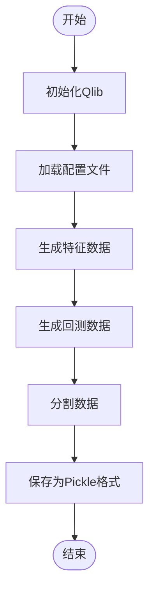
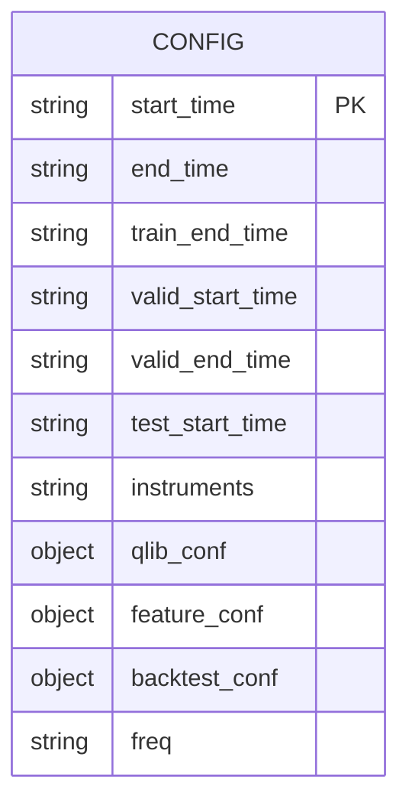
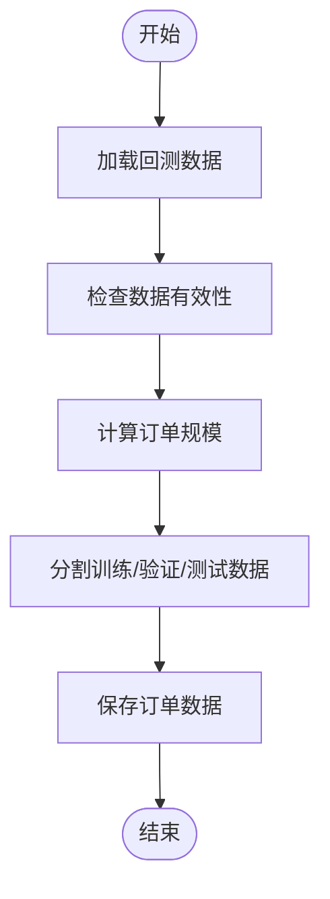
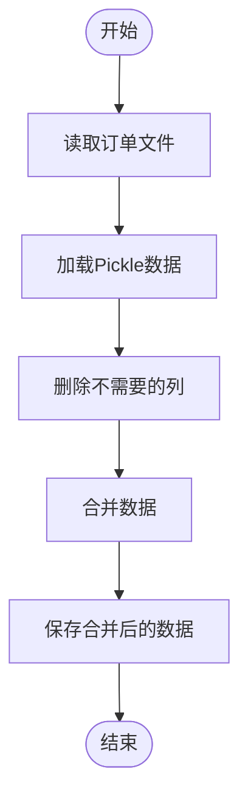

# 数据预处理与订单生成

<cite>
**本文档中引用的文件**  
- [gen_pickle_data.py](file://examples/rl_order_execution/scripts/gen_pickle_data.py)
- [pickle_data_config.yml](file://examples/rl_order_execution/scripts/pickle_data_config.yml)
- [gen_training_orders.py](file://examples/rl_order_execution/scripts/gen_training_orders.py)
- [merge_orders.py](file://examples/rl_order_execution/scripts/merge_orders.py)
- [highfreq_provider.py](file://qlib/contrib/data/highfreq_provider.py)
- [highfreq_handler.py](file://qlib/contrib/data/highfreq_handler.py)
- [highfreq_processor.py](file://qlib/contrib/data/highfreq_processor.py)
</cite>

## 目录
1. [数据预处理流程概述](#数据预处理流程概述)
2. [原始数据到Pickle格式转换](#原始数据到pickle格式转换)
3. [数据字段映射规则](#数据字段映射规则)
4. [训练订单生成逻辑](#训练订单生成逻辑)
5. [订单与市场数据整合](#订单与市场数据整合)
6. [常见问题与解决方案](#常见问题与解决方案)
7. [扩展数据源实现建议](#扩展数据源实现建议)

## 数据预处理流程概述

强化学习订单执行示例中的数据预处理流程主要包括三个核心步骤：首先将原始市场数据转换为适合训练的Pickle格式，然后生成用于训练的订单数据，最后将订单数据与市场数据整合为完整的训练数据集。该流程通过`gen_pickle_data.py`、`gen_training_orders.py`和`merge_orders.py`三个脚本协同工作，确保数据格式的一致性和完整性。

**Section sources**
- [gen_pickle_data.py](file://examples/rl_order_execution/scripts/gen_pickle_data.py)
- [gen_training_orders.py](file://examples/rl_order_execution/scripts/gen_training_orders.py)
- [merge_orders.py](file://examples/rl_order_execution/scripts/merge_orders.py)

## 原始数据到Pickle格式转换

`gen_pickle_data.py`脚本负责将原始市场数据转换为Pickle格式。该脚本通过`HighFreqProvider`类实现数据转换功能，根据配置文件中的参数生成特征数据和回测数据。数据转换过程包括数据加载、特征工程和数据分割等步骤。

**Diagram sources **
- [gen_pickle_data.py](file://examples/rl_order_execution/scripts/gen_pickle_data.py#L14-L46)
- [highfreq_provider.py](file://qlib/contrib/data/highfreq_provider.py#L18-L305)

**Section sources**
- [gen_pickle_data.py](file://examples/rl_order_execution/scripts/gen_pickle_data.py#L1-L47)
- [highfreq_provider.py](file://qlib/contrib/data/highfreq_provider.py#L1-L305)

## 数据字段映射规则

`pickle_data_config.yml`文件定义了数据字段的映射规则，包括时间范围、交易品种、特征配置和回测配置等。该配置文件使用YAML格式，通过清晰的结构化定义确保数据处理的一致性和可重复性。

**Diagram sources **
- [pickle_data_config.yml](file://examples/rl_order_execution/scripts/pickle_data_config.yml#L1-L78)

**Section sources**
- [pickle_data_config.yml](file://examples/rl_order_execution/scripts/pickle_data_config.yml#L1-L78)

## 训练订单生成逻辑

`gen_training_orders.py`脚本负责生成训练订单。该脚本从Pickle格式的回测数据中提取市场信息，随机生成订单规模和执行时间窗口。订单生成过程包括数据加载、有效性检查、订单规模计算和数据分割等步骤。

**Diagram sources **
- [gen_training_orders.py](file://examples/rl_order_execution/scripts/gen_training_orders.py#L1-L54)

**Section sources**
- [gen_training_orders.py](file://examples/rl_order_execution/scripts/gen_training_orders.py#L1-L54)

## 订单与市场数据整合

`merge_orders.py`脚本负责将生成的订单数据与市场数据整合为完整的训练数据集。该脚本通过读取分散的订单文件，将其合并为统一的Pickle文件，便于后续的模型训练和评估。

**Diagram sources **
- [merge_orders.py](file://examples/rl_order_execution/scripts/merge_orders.py#L1-L16)

**Section sources**
- [merge_orders.py](file://examples/rl_order_execution/scripts/merge_orders.py#L1-L16)

## 常见问题与解决方案

在数据预处理过程中可能会遇到数据路径错误、订单格式不匹配等常见问题。针对这些问题，建议采取以下解决方案：首先检查配置文件中的路径设置是否正确，其次验证数据文件的格式和内容是否符合预期，最后确保所有依赖的库和模块都已正确安装和配置。

**Section sources**
- [gen_pickle_data.py](file://examples/rl_order_execution/scripts/gen_pickle_data.py#L1-L47)
- [gen_training_orders.py](file://examples/rl_order_execution/scripts/gen_training_orders.py#L1-L54)
- [merge_orders.py](file://examples/rl_order_execution/scripts/merge_orders.py#L1-L16)

## 扩展数据源实现建议

为了支持更多交易品种，建议采用模块化的设计思路。可以通过扩展配置文件来支持新的交易品种，同时修改数据处理脚本以适应不同的数据格式。此外，建议建立统一的数据接口规范，确保不同数据源之间的兼容性和一致性。

**Section sources**
- [pickle_data_config.yml](file://examples/rl_order_execution/scripts/pickle_data_config.yml#L1-L78)
- [highfreq_handler.py](file://qlib/contrib/data/highfreq_handler.py#L1-L510)
- [highfreq_processor.py](file://qlib/contrib/data/highfreq_processor.py#L1-L81)