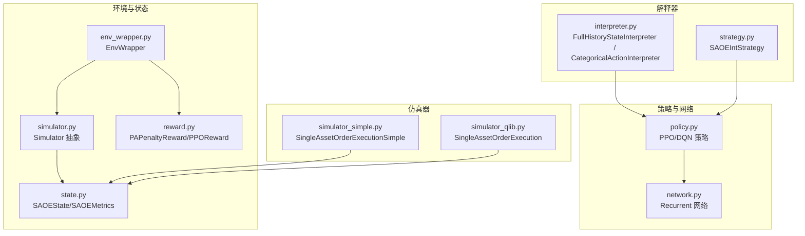
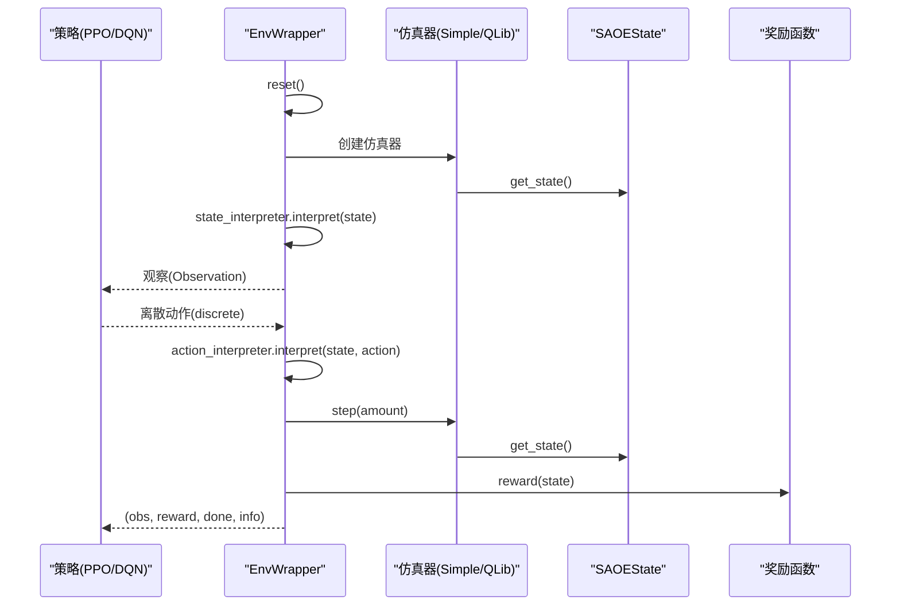
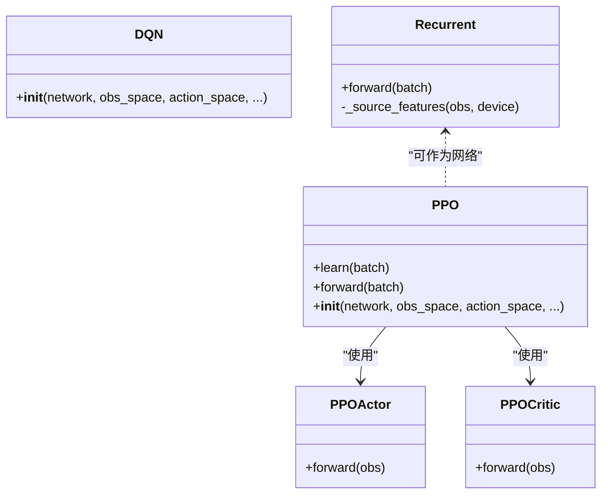
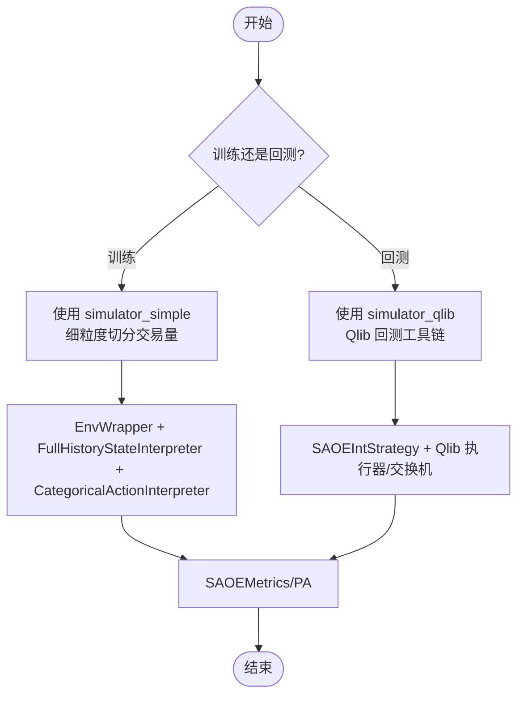
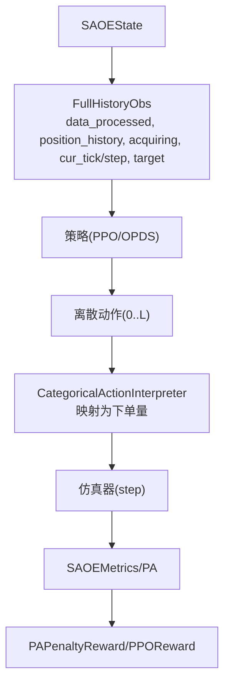
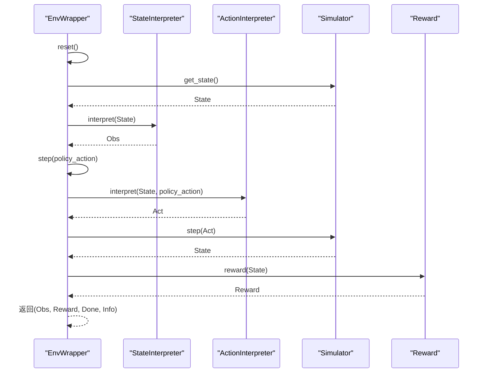
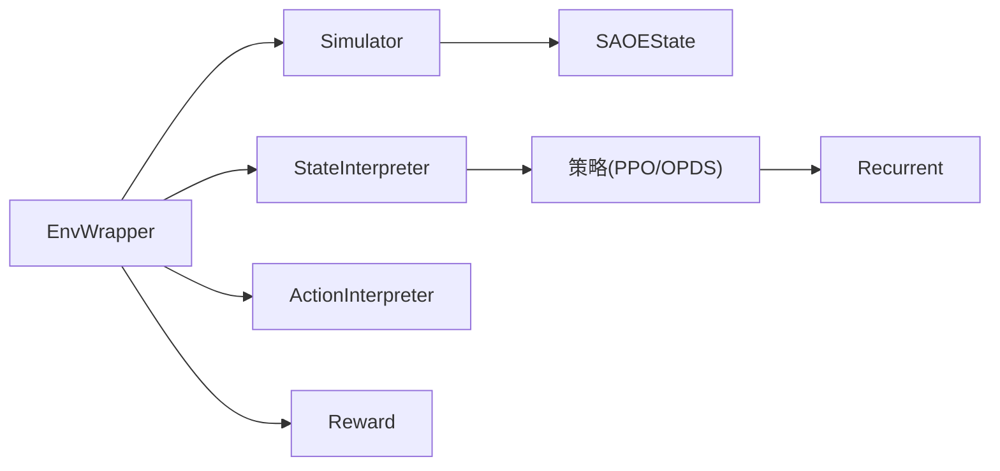

# 策略实现与市场仿真

<cite>
**本文引用的文件**
- [policy.py](file://qlib/rl/order_execution/policy.py)
- [network.py](file://qlib/rl/order_execution/network.py)
- [simulator_qlib.py](file://qlib/rl/order_execution/simulator_qlib.py)
- [simulator_simple.py](file://qlib/rl/order_execution/simulator_simple.py)
- [state.py](file://qlib/rl/order_execution/state.py)
- [reward.py](file://qlib/rl/order_execution/reward.py)
- [interpreter.py](file://qlib/rl/order_execution/interpreter.py)
- [strategy.py](file://qlib/rl/order_execution/strategy.py)
- [env_wrapper.py](file://qlib/rl/utils/env_wrapper.py)
- [simulator.py](file://qlib/rl/simulator.py)
- [train_ppo.yml](file://examples/rl_order_execution/exp_configs/train_ppo.yml)
- [backtest_ppo.yml](file://examples/rl_order_execution/exp_configs/backtest_ppo.yml)
</cite>

## 目录
1. [引言](#引言)
2. [项目结构](#项目结构)
3. [核心组件](#核心组件)
4. [架构总览](#架构总览)
5. [详细组件分析](#详细组件分析)
6. [依赖关系分析](#依赖关系分析)
7. [性能考量](#性能考量)
8. [故障排查指南](#故障排查指南)
9. [结论](#结论)
10. [附录](#附录)

## 引言
本文件面向强化学习订单执行策略的实现与验证，重点解析以下内容：
- PPO 与 OPDS（基于 Recurrent 的策略）在 policy.py 中的网络架构与算法实现差异
- simulator_qlib.py 与 simulator_simple.py 两个仿真器的设计理念与区别，以及为何后者用于训练、前者用于回测
- 状态空间（如剩余订单量、市场深度）、动作空间（下单比例）与奖励函数（价格优势 PA）的设计原理及对策略性能的影响
- 如何通过 env_wrapper.py 实现 Gym 兼容环境
- 针对训练不稳定、奖励稀疏等典型问题的调参策略

## 项目结构
围绕订单执行任务，系统由“策略网络 + 解释器 + 仿真器 + 环境封装 + 奖励”构成，训练与回测分别使用不同的仿真器以匹配数据来源与目标。

图表来源
- [policy.py](file://qlib/rl/order_execution/policy.py#L1-L238)
- [network.py](file://qlib/rl/order_execution/network.py#L1-L141)
- [interpreter.py](file://qlib/rl/order_execution/interpreter.py#L1-L258)
- [strategy.py](file://qlib/rl/order_execution/strategy.py#L1-L552)
- [simulator_simple.py](file://qlib/rl/order_execution/simulator_simple.py#L1-L363)
- [simulator_qlib.py](file://qlib/rl/order_execution/simulator_qlib.py#L1-L142)
- [env_wrapper.py](file://qlib/rl/utils/env_wrapper.py#L1-L251)
- [simulator.py](file://qlib/rl/simulator.py#L1-L76)
- [state.py](file://qlib/rl/order_execution/state.py#L1-L102)
- [reward.py](file://qlib/rl/order_execution/reward.py#L1-L100)

章节来源
- [policy.py](file://qlib/rl/order_execution/policy.py#L1-L238)
- [network.py](file://qlib/rl/order_execution/network.py#L1-L141)
- [interpreter.py](file://qlib/rl/order_execution/interpreter.py#L1-L258)
- [strategy.py](file://qlib/rl/order_execution/strategy.py#L1-L552)
- [simulator_simple.py](file://qlib/rl/order_execution/simulator_simple.py#L1-L363)
- [simulator_qlib.py](file://qlib/rl/order_execution/simulator_qlib.py#L1-L142)
- [env_wrapper.py](file://qlib/rl/utils/env_wrapper.py#L1-L251)
- [simulator.py](file://qlib/rl/simulator.py#L1-L76)
- [state.py](file://qlib/rl/order_execution/state.py#L1-L102)
- [reward.py](file://qlib/rl/order_execution/reward.py#L1-L100)

## 核心组件
- 策略与网络
  - PPO/DQN：封装了 Actor/Critic 或模型、优化器、超参数，默认离散动作空间，支持加载权重文件
  - Recurrent：OPDS 策略使用的网络，融合公开特征、私有特征与方向特征，输出固定维度表征
- 解释器
  - FullHistoryStateInterpreter：将历史与当前信息打包为字典观测
  - CategoricalActionInterpreter：将离散动作映射为连续下单量
- 仿真器
  - simulator_simple：基于 pickle 数据的细粒度仿真，按步切分交易量，便于训练
  - simulator_qlib：基于 Qlib 回测工具链，适合回测与策略集成
- 环境封装
  - EnvWrapper：Gym 环境包装器，串联解释器、策略与仿真器，统一 step/reset 流程
- 奖励
  - PAPenaltyReward：鼓励更高价格优势并惩罚短期内集中交易
  - PPOReward：基于 VWAP/TWAP 比率的阶段式奖励

章节来源
- [policy.py](file://qlib/rl/order_execution/policy.py#L66-L238)
- [network.py](file://qlib/rl/order_execution/network.py#L1-L141)
- [interpreter.py](file://qlib/rl/order_execution/interpreter.py#L68-L258)
- [simulator_simple.py](file://qlib/rl/order_execution/simulator_simple.py#L1-L363)
- [simulator_qlib.py](file://qlib/rl/order_execution/simulator_qlib.py#L1-L142)
- [env_wrapper.py](file://qlib/rl/utils/env_wrapper.py#L1-L251)
- [reward.py](file://qlib/rl/order_execution/reward.py#L1-L100)

## 架构总览
下图展示从策略到仿真器再到环境的整体流程，以及解释器与奖励在其中的作用。

图表来源
- [env_wrapper.py](file://qlib/rl/utils/env_wrapper.py#L146-L248)
- [simulator.py](file://qlib/rl/simulator.py#L52-L76)
- [state.py](file://qlib/rl/order_execution/state.py#L70-L102)
- [reward.py](file://qlib/rl/order_execution/reward.py#L1-L100)
- [interpreter.py](file://qlib/rl/order_execution/interpreter.py#L199-L250)

## 详细组件分析

### PPO 与 OPDS 策略对比（policy.py）
- PPO
  - 使用 PPOPolicy 包装器，自动构建 Actor（Softmax 输出概率分布）与 Critic（价值估计），默认离散动作空间
  - 参数包含裁剪阈值、GAE lambda、折扣因子、梯度裁剪、价值系数等；支持加载训练权重
- OPDS（Recurrent 策略）
  - 通过 Recurrent 网络提取特征，融合公开序列特征、私有位置与步长特征、方向特征，输出固定维度表征
  - 该网络作为策略的特征提取器，配合离散动作解释器使用
- 差异要点
  - 动作空间：PPO 默认离散；OPDS 可用离散或连续动作解释器
  - 网络结构：PPO 使用独立 Actor/Critic；OPDS 使用共享特征提取器后接动作头
  - 训练目标：PPO 采用策略梯度近似；OPDS 通常与离散动作解释器配合

图表来源
- [policy.py](file://qlib/rl/order_execution/policy.py#L66-L238)
- [network.py](file://qlib/rl/order_execution/network.py#L1-L141)

章节来源
- [policy.py](file://qlib/rl/order_execution/policy.py#L66-L238)
- [network.py](file://qlib/rl/order_execution/network.py#L1-L141)

### 仿真器设计与用途差异（simulator_simple.py vs simulator_qlib.py）
- simulator_simple
  - 基于 pickle 数据的细粒度仿真，每步按时间窗口切分交易量，支持 vol_threshold 限制单步成交量
  - 提供 price_advantage 计算，便于训练时使用价格优势作为奖励信号
  - 适合训练场景：数据可控、可观测性强、便于快速迭代
- simulator_qlib
  - 基于 Qlib 回测工具链，与真实回测框架集成，适合回测与策略落地
  - 通过策略适配器维护历史与指标，支持多订单、多步骤的回测流程
  - 适合回测场景：与真实市场基础设施一致，便于评估策略稳健性

图表来源
- [simulator_simple.py](file://qlib/rl/order_execution/simulator_simple.py#L1-L363)
- [simulator_qlib.py](file://qlib/rl/order_execution/simulator_qlib.py#L1-L142)
- [strategy.py](file://qlib/rl/order_execution/strategy.py#L445-L552)
- [state.py](file://qlib/rl/order_execution/state.py#L1-L102)

章节来源
- [simulator_simple.py](file://qlib/rl/order_execution/simulator_simple.py#L1-L363)
- [simulator_qlib.py](file://qlib/rl/order_execution/simulator_qlib.py#L1-L142)
- [strategy.py](file://qlib/rl/order_execution/strategy.py#L1-L552)
- [state.py](file://qlib/rl/order_execution/state.py#L1-L102)

### 状态空间、动作空间与奖励函数
- 状态空间（SAOEState）
  - 包含订单、当前时间/步、剩余未成交数量、历史执行与步骤记录、回测数据索引、ticks_per_step 等
  - FullHistoryStateInterpreter 将历史处理数据、昨日数据、方向、当前 tick/步、目标量、位置与历史位置打包为观测
- 动作空间
  - CategoricalActionInterpreter 将离散动作映射为下单量，支持最后一步全成交
  - TwapRelativeActionInterpreter 将连续比例映射为相对 TWAP 的下单量
- 奖励函数
  - PAPenaltyReward：鼓励更高价格优势，并惩罚短期内集中交易
  - PPOReward：在最后一步或完成时，根据 VWAP/TWAP 比率给定阶段式奖励

图表来源
- [state.py](file://qlib/rl/order_execution/state.py#L1-L102)
- [interpreter.py](file://qlib/rl/order_execution/interpreter.py#L68-L258)
- [reward.py](file://qlib/rl/order_execution/reward.py#L1-L100)
- [simulator_simple.py](file://qlib/rl/order_execution/simulator_simple.py#L147-L363)

章节来源
- [state.py](file://qlib/rl/order_execution/state.py#L1-L102)
- [interpreter.py](file://qlib/rl/order_execution/interpreter.py#L1-L258)
- [reward.py](file://qlib/rl/order_execution/reward.py#L1-L100)
- [simulator_simple.py](file://qlib/rl/order_execution/simulator_simple.py#L1-L363)

### Gym 兼容环境实现（env_wrapper.py）
- EnvWrapper 继承 gym.Env，封装 Simulator、StateInterpreter、ActionInterpreter、Reward、AuxiliaryInfoCollector、Logger
- reset：从 seed_iterator 获取初始状态，创建仿真器，返回初始观察
- step：将策略动作经 ActionInterpreter 转换为仿真器动作，调用 simulator.step，计算 reward 与 info，记录日志
- 通过弱引用注入 env 到其他组件，避免循环引用

图表来源
- [env_wrapper.py](file://qlib/rl/utils/env_wrapper.py#L146-L248)
- [simulator.py](file://qlib/rl/simulator.py#L52-L76)
- [reward.py](file://qlib/rl/order_execution/reward.py#L1-L100)

章节来源
- [env_wrapper.py](file://qlib/rl/utils/env_wrapper.py#L1-L251)
- [simulator.py](file://qlib/rl/simulator.py#L1-L76)
- [reward.py](file://qlib/rl/order_execution/reward.py#L1-L100)

### 训练配置与回测配置（示例）
- 训练配置（train_ppo.yml）
  - 使用 simulator_simple 的数据粒度、每步时间、成交量上限
  - 离散动作解释器 values=4，最大步数 8
  - FullHistoryStateInterpreter：data_dim=5，data_ticks=48，max_step=8
  - PPOReward：max_step=8，起止时间索引
  - Recurrent 网络 + PPO 策略
- 回测配置（backtest_ppo.yml）
  - 使用 Qlib provider_uri_5min，exchange 配置 deal_price/volume_threshold
  - SAOEIntStrategy + PPO 策略 + FullHistoryStateInterpreter + CategoricalActionInterpreter
  - TWAP 对照策略

章节来源
- [train_ppo.yml](file://examples/rl_order_execution/exp_configs/train_ppo.yml#L1-L68)
- [backtest_ppo.yml](file://examples/rl_order_execution/exp_configs/backtest_ppo.yml#L1-L54)

## 依赖关系分析
- 组件耦合
  - EnvWrapper 与 Simulator 强耦合，通过 get_state/step 完成状态流转
  - StateInterpreter 与 ActionInterpreter 与策略解耦，便于替换
  - Recurrent 网络与 StateInterpreter 的观测空间绑定
- 外部依赖
  - Qlib 回测工具链（simulator_qlib）
  - Tianshou 策略与数据结构（policy.py）

图表来源
- [env_wrapper.py](file://qlib/rl/utils/env_wrapper.py#L146-L248)
- [simulator.py](file://qlib/rl/simulator.py#L52-L76)
- [state.py](file://qlib/rl/order_execution/state.py#L70-L102)
- [interpreter.py](file://qlib/rl/order_execution/interpreter.py#L68-L258)
- [policy.py](file://qlib/rl/order_execution/policy.py#L66-L238)
- [network.py](file://qlib/rl/order_execution/network.py#L1-L141)

章节来源
- [env_wrapper.py](file://qlib/rl/utils/env_wrapper.py#L1-L251)
- [simulator.py](file://qlib/rl/simulator.py#L1-L76)
- [state.py](file://qlib/rl/order_execution/state.py#L1-L102)
- [interpreter.py](file://qlib/rl/order_execution/interpreter.py#L1-L258)
- [policy.py](file://qlib/rl/order_execution/policy.py#L1-L238)
- [network.py](file://qlib/rl/order_execution/network.py#L1-L141)

## 性能考量
- 训练稳定性
  - 降低学习率、增大 batch_size、使用 reward normalization、clip_loss_grad
  - 使用 PPO 的 eps_clip/value_clip 控制更新幅度
- 奖励稀疏
  - 使用 PAPenaltyReward 在每步提供正向信号，避免仅在最后一步才给奖励
  - 合理设置 penalty 与 scale，平衡短期集中交易与长期收益
- 数据粒度与步长
  - data_granularity 与 ticks_per_step 影响仿真精度与速度，需权衡
- 网络表达能力
  - Recurrent 的 hidden_dim、rnn_type、rnn_num_layers 决定特征提取能力
- 并行与并发
  - concurrency 控制环境并行度，注意内存与 CPU 占用

[本节为通用指导，不直接分析具体文件]

## 故障排查指南
- 训练不稳定
  - 检查学习率是否过高，适当降低
  - 检查 reward normalization 是否开启
  - 检查 eps_clip/value_clip 是否合理
- 奖励异常
  - 确认 reward 函数未产生 NaN/Inf
  - 检查 PA 计算是否除零或方向错误
- 仿真器断言失败
  - simulator_simple 的 position 不应为负，检查 vol_threshold 与最后时刻补全逻辑
  - simulator_qlib 的 done 条件与回测数据一致性
- 环境重置问题
  - seed_iterator 用尽会返回无效观测，需确保数据队列充足

章节来源
- [policy.py](file://qlib/rl/order_execution/policy.py#L132-L159)
- [simulator_simple.py](file://qlib/rl/order_execution/simulator_simple.py#L147-L230)
- [reward.py](file://qlib/rl/order_execution/reward.py#L33-L51)
- [env_wrapper.py](file://qlib/rl/utils/env_wrapper.py#L146-L194)

## 结论
- PPO 与 OPDS 在动作空间与网络结构上存在差异，PPO 更偏向策略梯度范式，OPDS 通过 Recurrent 提取时序特征
- simulator_simple 适合训练，强调可观测性与快速迭代；simulator_qlib 适合回测，强调与真实回测工具链的一致性
- 状态/动作/奖励三者共同决定策略性能，建议在训练中使用 PAPenaltyReward，在回测中结合 PPOReward 与 Qlib 工具进行综合评估
- 通过 EnvWrapper 将解释器、策略与仿真器解耦，便于替换与扩展

[本节为总结，不直接分析具体文件]

## 附录
- 关键路径参考
  - PPO/DQN 初始化与权重加载：[policy.py](file://qlib/rl/order_execution/policy.py#L114-L159)
  - Recurrent 网络前向与特征拼接：[network.py](file://qlib/rl/order_execution/network.py#L69-L120)
  - FullHistoryStateInterpreter 观测构造：[interpreter.py](file://qlib/rl/order_execution/interpreter.py#L101-L131)
  - CategoricalActionInterpreter 动作映射：[interpreter.py](file://qlib/rl/order_execution/interpreter.py#L225-L231)
  - simulator_simple 步进与 PA 计算：[simulator_simple.py](file://qlib/rl/order_execution/simulator_simple.py#L147-L230)
  - simulator_qlib 迭代策略与适配器：[simulator_qlib.py](file://qlib/rl/order_execution/simulator_qlib.py#L108-L139)
  - EnvWrapper reset/step 主流程：[env_wrapper.py](file://qlib/rl/utils/env_wrapper.py#L146-L248)
  - PPOReward/ PAPenaltyReward 奖励计算：[reward.py](file://qlib/rl/order_execution/reward.py#L17-L100)