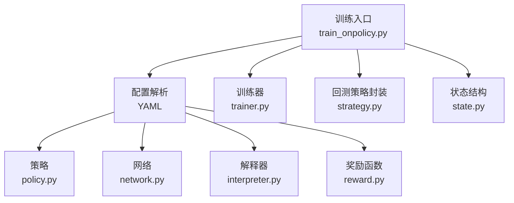
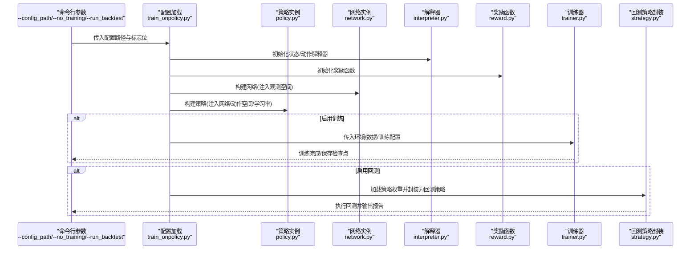
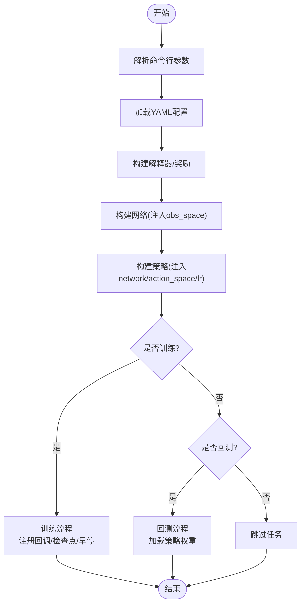
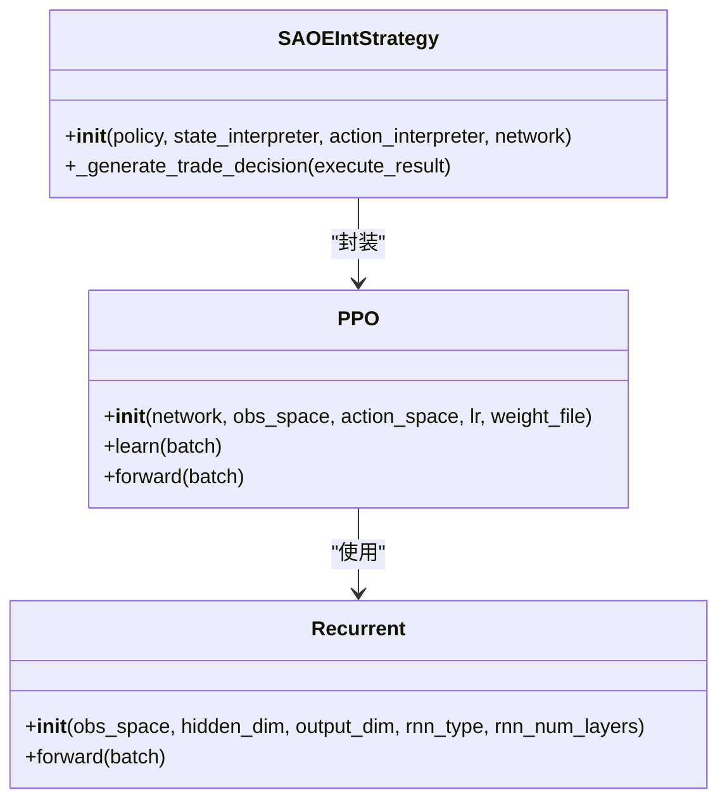
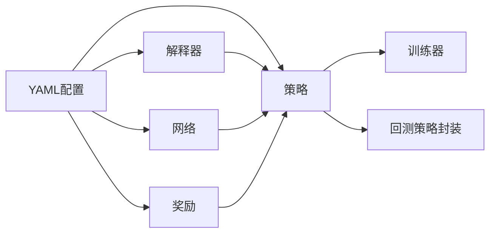

# 训练配置详解

<cite>
**本文引用的文件**
- [train_opds.yml](file://examples/rl_order_execution/exp_configs/train_opds.yml)
- [train_ppo.yml](file://examples/rl_order_execution/exp_configs/train_ppo.yml)
- [backtest_opds.yml](file://examples/rl_order_execution/exp_configs/backtest_opds.yml)
- [backtest_ppo.yml](file://examples/rl_order_execution/exp_configs/backtest_ppo.yml)
- [train_onpolicy.py](file://qlib/rl/contrib/train_onpolicy.py)
- [policy.py](file://qlib/rl/order_execution/policy.py)
- [network.py](file://qlib/rl/order_execution/network.py)
- [reward.py](file://qlib/rl/order_execution/reward.py)
- [interpreter.py](file://qlib/rl/order_execution/interpreter.py)
- [state.py](file://qlib/rl/order_execution/state.py)
- [strategy.py](file://qlib/rl/order_execution/strategy.py)
- [trainer.py](file://qlib/rl/trainer/trainer.py)
</cite>

## 目录
1. [引言](#引言)
2. [项目结构](#项目结构)
3. [核心组件](#核心组件)
4. [架构总览](#架构总览)
5. [详细组件分析](#详细组件分析)
6. [依赖关系分析](#依赖关系分析)
7. [性能考量](#性能考量)
8. [故障排查指南](#故障排查指南)
9. [结论](#结论)
10. [附录](#附录)

## 引言
本文件围绕 OPDS 与 PPO 两种强化学习订单执行策略的训练配置进行深入解析，重点说明 Yaml 中 policy、environment、trainer 等核心模块的参数设置，解释学习率（lr）、折扣因子（gamma）、网络结构（hidden_sizes）等超参数的选取依据；并结合 train_onpolicy.py 源码阐述配置如何驱动训练流程，解释 weight_file 参数在模型恢复与评估中的作用。最后给出修改配置以适配不同交易品种或时间周期的实践建议，并说明 --run_backtest 与 --no_training 标志位的使用场景。

## 项目结构
- 配置文件位于 examples/rl_order_execution/exp_configs 下，分别提供 OPDS 与 PPO 的训练与回测配置。
- 训练入口脚本 train_onpolicy.py 负责读取配置、构建策略、环境与训练器，并按需执行训练与回测。
- 策略、网络、奖励、解释器、状态与策略封装等模块位于 qlib/rl/order_execution 及相关子模块中。
- 训练器位于 qlib/rl/trainer，负责收集交互数据、更新策略、验证与日志记录。

图表来源
- [train_onpolicy.py](file://qlib/rl/contrib/train_onpolicy.py#L204-L270)
- [policy.py](file://qlib/rl/order_execution/policy.py#L102-L160)
- [network.py](file://qlib/rl/order_execution/network.py#L19-L121)
- [interpreter.py](file://qlib/rl/order_execution/interpreter.py#L68-L148)
- [reward.py](file://qlib/rl/order_execution/reward.py#L17-L100)
- [trainer.py](file://qlib/rl/trainer/trainer.py#L30-L118)
- [strategy.py](file://qlib/rl/order_execution/strategy.py#L445-L552)
- [state.py](file://qlib/rl/order_execution/state.py#L70-L102)

章节来源
- [train_onpolicy.py](file://qlib/rl/contrib/train_onpolicy.py#L204-L270)
- [train_opds.yml](file://examples/rl_order_execution/exp_configs/train_opds.yml#L1-L67)
- [train_ppo.yml](file://examples/rl_order_execution/exp_configs/train_ppo.yml#L1-L68)

## 核心组件
- 策略（policy）
  - OPDS/PPO：在配置中通过 class 指定为 PPO，kwargs 中包含学习率 lr。
  - 在策略实现中，PPOPolicy 接受 lr、discount_factor、gae_lambda、vf_coef、eps_clip、max_batch_size 等参数，默认值与训练器/环境耦合。
- 网络（network）
  - Recurrent：基于历史数据与私有变量的双向 RNN 分支，输出特征向量供 Actor/Critic 使用。
  - hidden_dim、output_dim、rnn_type、rnn_num_layers 等可调超参。
- 解释器（interpreter）
  - 状态解释器 FullHistoryStateInterpreter：将 SAOEState 转换为 FullHistoryObs，包含 data_processed、cur_tick、cur_step、num_step、position、position_history 等键。
  - 动作解释器 CategoricalActionInterpreter：将离散动作映射为连续成交量。
- 奖励（reward）
  - OPDS 使用 PAPenaltyReward：鼓励价格优势（PA），同时惩罚短期内集中成交。
  - PPO 使用 PPOReward：在最后一步比较 VWAP/TWAP 比例，给出离散奖励。
- 训练器（trainer）
  - Trainer 负责迭代收集、训练、验证与日志；支持早停、检查点、验证频率等。
- 回测策略封装（strategy）
  - SAOEIntStrategy：在回测时加载策略权重，将策略输出的动作解释为实际委托量。

章节来源
- [policy.py](file://qlib/rl/order_execution/policy.py#L102-L160)
- [network.py](file://qlib/rl/order_execution/network.py#L19-L121)
- [interpreter.py](file://qlib/rl/order_execution/interpreter.py#L68-L148)
- [reward.py](file://qlib/rl/order_execution/reward.py#L17-L100)
- [trainer.py](file://qlib/rl/trainer/trainer.py#L30-L118)
- [strategy.py](file://qlib/rl/order_execution/strategy.py#L445-L552)

## 架构总览
下图展示从配置到训练与回测的整体流程，以及关键对象之间的依赖关系。

图表来源
- [train_onpolicy.py](file://qlib/rl/contrib/train_onpolicy.py#L204-L270)
- [policy.py](file://qlib/rl/order_execution/policy.py#L102-L160)
- [network.py](file://qlib/rl/order_execution/network.py#L19-L121)
- [interpreter.py](file://qlib/rl/order_execution/interpreter.py#L68-L148)
- [reward.py](file://qlib/rl/order_execution/reward.py#L17-L100)
- [trainer.py](file://qlib/rl/trainer/trainer.py#L188-L273)
- [strategy.py](file://qlib/rl/order_execution/strategy.py#L445-L552)

## 详细组件分析

### OPDS 训练配置（train_opds.yml）
- simulator
  - data_granularity：分钟粒度，用于步长与时间索引对齐。
  - time_per_step：每步时间跨度（分钟），影响状态中 cur_tick 与 cur_step 的计算。
  - vol_limit：未设置，表示不限制每步成交量。
- env
  - concurrency：并行工作数。
  - parallel_mode：dummy 并行模式，适合小规模调试。
- action_interpreter
  - CategoricalActionInterpreter：values=4 表示离散动作空间大小；max_step=8 控制最后一步放量。
- state_interpreter
  - FullHistoryStateInterpreter：data_dim=5、data_ticks=48（240/5）、max_step=8；processed_data_provider 指向本地特征目录。
- reward
  - PAPenaltyReward：penalty=4.0、scale=0.01，平衡 PA 与短期集中成交惩罚。
- data
  - order_dir、feature_root_dir：订单与特征数据根目录。
  - feature_columns_today/yesterday：今日与昨日特征列。
  - total_time、default_start/end_time：总交易时长与默认起止索引。
  - proc_data_dim：处理后数据维度。
- network
  - Recurrent：默认隐藏维度与输出维度由网络内部决定。
- policy
  - PPO：lr=0.0001。
- runtime
  - seed=42、use_cuda=false。
- trainer
  - max_epoch=500、repeat_per_collect=25、earlystop_patience=50、episode_per_collect=10000、batch_size=1024、val_every_n_epoch=4、checkpoint_path=./outputs/opds、checkpoint_every_n_iters=1。

章节来源
- [train_opds.yml](file://examples/rl_order_execution/exp_configs/train_opds.yml#L1-L67)

### PPO 训练配置（train_ppo.yml）
- 与 OPDS 类似，但 reward 使用 PPOReward：
  - max_step=8、start_time_index=0、end_time_index=46（对应 240-5 分钟，按 5 分钟粒度）。
- 其余参数与 OPDS 基本一致，便于对比。

章节来源
- [train_ppo.yml](file://examples/rl_order_execution/exp_configs/train_ppo.yml#L1-L68)

### 回测配置（backtest_opds.yml 与 backtest_ppo.yml）
- order_file：测试订单文件路径。
- start_time/end_time：回测时间窗口。
- data_granularity：5min。
- qlib.provider_uri_5min：二进制数据提供者路径。
- exchange：limit_threshold、deal_price、volume_threshold。
- strategies：
  - 1day：SAOEIntStrategy，包含 action_interpreter、network、policy、state_interpreter。
  - 30min：TWAPStrategy。
- concurrency：并发数。
- output_dir：输出目录。

章节来源
- [backtest_opds.yml](file://examples/rl_order_execution/exp_configs/backtest_opds.yml#L1-L54)
- [backtest_ppo.yml](file://examples/rl_order_execution/exp_configs/backtest_ppo.yml#L1-L54)

### 训练入口与流程（train_onpolicy.py）
- 参数解析
  - --config_path：指定配置文件路径。
  - --no_training：跳过训练流程。
  - --run_backtest：运行回测流程。
- 关键流程
  - 读取配置，初始化 state_interpreter、action_interpreter、reward。
  - 注入观测/动作空间，构建 network 与 policy。
  - 若启用训练：构造 LazyLoadDataset，注册 MetricsWriter、Checkpoint、EarlyStopping 回调，调用 train。
  - 若启用回测：构造 test 数据集，调用 backtest。
- 权重恢复
  - policy 的 kwargs 支持 weight_file，当存在时 Trainer 会加载检查点中的策略权重。

图表来源
- [train_onpolicy.py](file://qlib/rl/contrib/train_onpolicy.py#L204-L270)

章节来源
- [train_onpolicy.py](file://qlib/rl/contrib/train_onpolicy.py#L204-L270)

### 策略与网络（policy.py、network.py）
- PPO
  - 接收 network、obs_space、action_space、lr 等参数；支持 weight_file 自动加载检查点权重。
  - 默认 discount_factor=1.0、reward_normalization=True、eps_clip=0.3、value_clip=True、vf_coef=1.0、gae_lambda=1.0、max_batch_size=256、deterministic_eval=True。
- Recurrent
  - 将输入分为三路分支（公共变量、私有变量、方向特征），经 RNN 提取特征后拼接，再经 FC 得到输出特征。
  - 支持 rnn_type（rnn/lstm/gru）、rnn_num_layers、hidden_dim、output_dim 等超参。

图表来源
- [policy.py](file://qlib/rl/order_execution/policy.py#L102-L160)
- [network.py](file://qlib/rl/order_execution/network.py#L19-L121)
- [strategy.py](file://qlib/rl/order_execution/strategy.py#L445-L552)

章节来源
- [policy.py](file://qlib/rl/order_execution/policy.py#L102-L160)
- [network.py](file://qlib/rl/order_execution/network.py#L19-L121)
- [strategy.py](file://qlib/rl/order_execution/strategy.py#L445-L552)

### 奖励函数（reward.py）
- PAPenaltyReward
  - 在每步计算 PA 与短期集中惩罚项，最终奖励为两者之和，再乘以 scale。
- PPOReward
  - 在最后一步根据 VWAP/TWAP 比例给出离散奖励（负/零/正），用于衡量执行质量。

章节来源
- [reward.py](file://qlib/rl/order_execution/reward.py#L17-L100)

### 解释器与状态（interpreter.py、state.py）
- FullHistoryStateInterpreter
  - 输出 FullHistoryObs，包含 data_processed、data_processed_prev、acquiring、cur_tick、cur_step、num_step、target、position、position_history。
  - 通过 processed_data_provider 获取当日与昨日处理后的特征，并对当前时刻之后的数据做掩码。
- CategoricalActionInterpreter
  - 将离散动作映射为实际成交量，max_step=8 时在最后一步放量至剩余头寸。
- SAOEState
  - 包含 order、cur_time、cur_step、position、history_exec、history_steps、metrics、backtest_data、ticks_per_step、ticks_index、ticks_for_order 等字段。

章节来源
- [interpreter.py](file://qlib/rl/order_execution/interpreter.py#L68-L148)
- [state.py](file://qlib/rl/order_execution/state.py#L70-L102)

## 依赖关系分析
- 配置到对象的依赖链
  - train_onpolicy.py 读取 YAML，通过 init_instance_by_config 实例化解释器、奖励、网络与策略。
  - 策略依赖网络与动作/观测空间；网络依赖解释器提供的观测空间；策略在 kwargs 中可注入 weight_file。
  - 训练器依赖环境工厂（simulator_fn）、解释器、奖励与策略；回测策略封装依赖策略与解释器。
- 关键耦合点
  - state_interpreter.observation_space 与 network 的输入维度耦合。
  - action_interpreter.action_space 与策略动作空间耦合。
  - reward 与策略目标耦合（OPDS vs PPO 的奖励设计差异）。

图表来源
- [train_onpolicy.py](file://qlib/rl/contrib/train_onpolicy.py#L204-L270)
- [policy.py](file://qlib/rl/order_execution/policy.py#L102-L160)
- [network.py](file://qlib/rl/order_execution/network.py#L19-L121)
- [interpreter.py](file://qlib/rl/order_execution/interpreter.py#L68-L148)
- [reward.py](file://qlib/rl/order_execution/reward.py#L17-L100)
- [trainer.py](file://qlib/rl/trainer/trainer.py#L188-L273)
- [strategy.py](file://qlib/rl/order_execution/strategy.py#L445-L552)

章节来源
- [train_onpolicy.py](file://qlib/rl/contrib/train_onpolicy.py#L204-L270)
- [policy.py](file://qlib/rl/order_execution/policy.py#L102-L160)
- [network.py](file://qlib/rl/order_execution/network.py#L19-L121)
- [interpreter.py](file://qlib/rl/order_execution/interpreter.py#L68-L148)
- [reward.py](file://qlib/rl/order_execution/reward.py#L17-L100)
- [trainer.py](file://qlib/rl/trainer/trainer.py#L188-L273)
- [strategy.py](file://qlib/rl/order_execution/strategy.py#L445-L552)

## 性能考量
- 并行与吞吐
  - env.concurrency 控制并行工作数；parallel_mode=dummy 适合小规模调试，生产环境可考虑 subproc。
  - episode_per_collect、batch_size、repeat_per_collect 影响每轮收集与更新强度，需与硬件资源匹配。
- 内存与显存
  - use_cuda=false 时使用 CPU；若开启 GPU，需确保显存充足。
- 早停与验证
  - earlystop_patience 控制早停耐心；val_every_n_epoch 控制验证频率，避免过度验证导致训练效率下降。
- 时间步与步长
  - data_granularity 与 time_per_step 必须一致整除，否则会触发断言；合理设置可减少无效状态。

[本节为通用建议，不直接分析具体文件]

## 故障排查指南
- 训练未执行
  - 确认未同时设置 --no_training 与 --run_backtest。
  - 检查 checkpoint_path 是否可写，是否存在权限问题。
- 回测报错
  - 确认 backtest 配置中的 weight_file 指向有效检查点文件。
  - 检查 order_file 路径与文件格式。
- 观测/动作空间不匹配
  - 确保 state_interpreter.observation_space 与 network 输入维度一致。
  - 确保 action_interpreter.action_space 与策略动作空间一致。
- 奖励异常
  - PAPenaltyReward 与 PPOReward 在极端情况下可能产生 NaN/Inf，需检查输入数据与参数设置。

章节来源
- [train_onpolicy.py](file://qlib/rl/contrib/train_onpolicy.py#L204-L270)
- [policy.py](file://qlib/rl/order_execution/policy.py#L102-L160)
- [reward.py](file://qlib/rl/order_execution/reward.py#L17-L100)

## 结论
- OPDS 与 PPO 的配置差异主要体现在奖励函数与时间窗口上：OPDS 使用 PAPenaltyReward，强调 PA 与短期集中惩罚；PPO 使用 PPOReward，在最后一步比较 VWAP/TWAP，更偏向执行质量的离散评估。
- 训练流程由 train_onpolicy.py 驱动，通过解释器、网络与策略的组合完成；weight_file 在策略加载时自动生效，便于模型恢复与回测。
- 修改配置以适配不同交易品种或时间周期的关键在于：调整 data_granularity、time_per_step、state_interpreter 的 data_ticks 与 max_step、reward 的时间窗口与参数，以及 network 的 hidden_dim 与 rnn 设置。

[本节为总结性内容，不直接分析具体文件]

## 附录

### 配置参数与超参数选取依据
- 学习率（lr）
  - OPDS/PPO 配置中 lr=0.0001，属于 PPO 常用范围；可根据 batch_size 与优化器设置微调。
- 折扣因子（gamma）
  - PPO 默认 discount_factor=1.0；若希望强调长期回报，可适当降低（如 0.99）。
- 网络结构（hidden_sizes）
  - Recurrent 默认 hidden_dim=64、output_dim=32；可通过 network.kwargs 调整；更大隐藏层可提升表达能力但增加计算成本。
- 步长与时间窗口
  - data_granularity 与 time_per_step 必须一致整除；max_step 与 data_ticks 决定历史窗口长度，需与交易时长匹配。

章节来源
- [policy.py](file://qlib/rl/order_execution/policy.py#L102-L160)
- [network.py](file://qlib/rl/order_execution/network.py#L19-L121)
- [train_onpolicy.py](file://qlib/rl/contrib/train_onpolicy.py#L127-L130)

### 适配不同交易品种或时间周期的实践指导
- 交易品种
  - 更新 state_interpreter.processed_data_provider 的 feature_columns_today/yesterday，确保与数据源一致。
  - 调整 data_dim 与 network 的输入维度以匹配新特征。
- 时间周期
  - 调整 data_granularity（如 1min/5min/15min）与 time_per_step，使二者整除。
  - 重新计算 data_ticks（总交易分钟数 / data_granularity）与 max_step（总步数）。
- 奖励函数
  - OPDS：提高 penalty 或 scale 以抑制集中成交；降低 scale 以弱化 PA 的影响。
  - PPO：调整 start/end_time_index 以覆盖目标交易时段；根据市场流动性调整 max_step。

章节来源
- [train_opds.yml](file://examples/rl_order_execution/exp_configs/train_opds.yml#L1-L67)
- [train_ppo.yml](file://examples/rl_order_execution/exp_configs/train_ppo.yml#L1-L68)
- [interpreter.py](file://qlib/rl/order_execution/interpreter.py#L68-L148)

### --run_backtest 与 --no_training 标志位使用场景
- --no_training
  - 仅运行回测，常用于评估已训练好的模型；需确保 backtest 配置中的 weight_file 指向有效检查点。
- --run_backtest
  - 在训练完成后运行回测，验证策略在测试集上的表现；可与 --no_training 组合以仅回测。
- 两者均未设置
  - 脚本会跳过整个任务，避免误操作。

章节来源
- [train_onpolicy.py](file://qlib/rl/contrib/train_onpolicy.py#L255-L270)
- [backtest_opds.yml](file://examples/rl_order_execution/exp_configs/backtest_opds.yml#L1-L54)
- [backtest_ppo.yml](file://examples/rl_order_execution/exp_configs/backtest_ppo.yml#L1-L54)