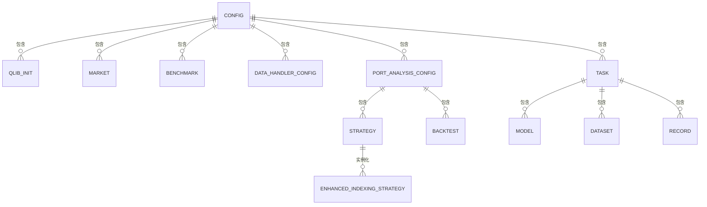
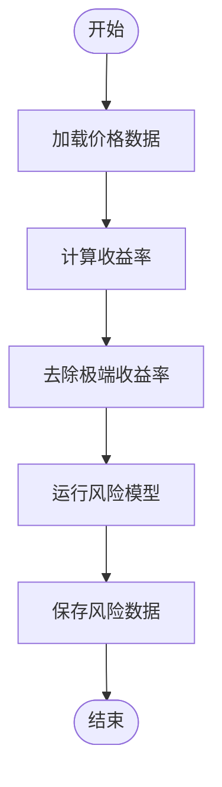
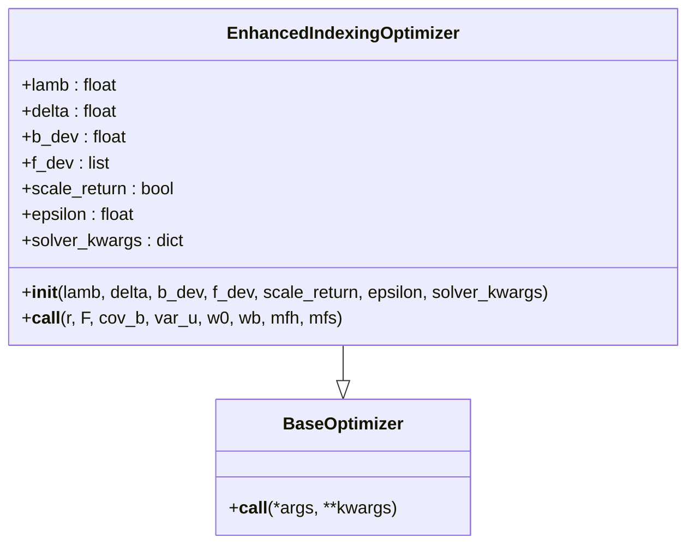
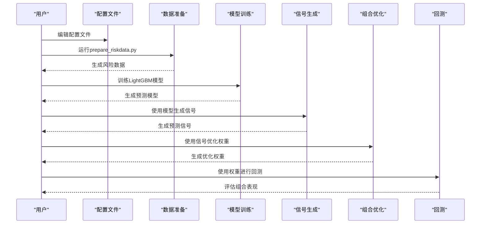
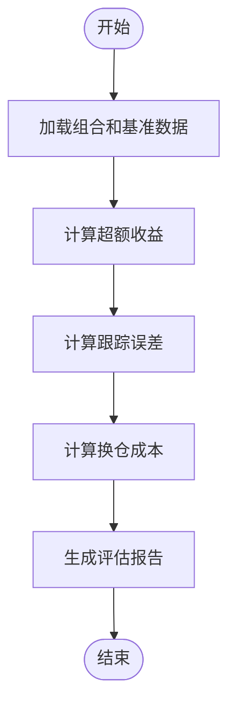

# 投资组合管理示例

<cite>
**本文档中引用的文件**  
- [config_enhanced_indexing.yaml](file://examples/portfolio/config_enhanced_indexing.yaml)
- [prepare_riskdata.py](file://examples/portfolio/prepare_riskdata.py)
- [enhanced_indexing.py](file://qlib/contrib/strategy/optimizer/enhanced_indexing.py)
- [signal_strategy.py](file://qlib/contrib/strategy/signal_strategy.py)
- [structured.py](file://qlib/model/riskmodel/structured.py)
- [evaluate_portfolio.py](file://qlib/contrib/evaluate_portfolio.py)
- [report.py](file://qlib/backtest/report.py)
</cite>

## 目录
1. [简介](#简介)
2. [配置结构解析](#配置结构解析)
3. [风险数据准备](#风险数据准备)
4. [优化器工作原理](#优化器工作原理)
5. [完整流程指导](#完整流程指导)
6. [组合评估](#组合评估)
7. [结论](#结论)

## 简介
增强型指数跟踪策略结合了主动管理和被动管理的优点，旨在超越基准指数（如沪深300）的投资组合回报，同时控制风险敞口（即跟踪误差）。该策略通过优化投资组合权重，在控制风险的同时追求超额收益。本示例详细说明了从风险建模到组合权重求解的完整流程，并展示了如何评估组合的超额收益、跟踪误差和换仓成本。

**Section sources**
- [signal_strategy.py](file://qlib/contrib/strategy/signal_strategy.py#L375-L523)
- [config_enhanced_indexing.yaml](file://examples/portfolio/config_enhanced_indexing.yaml#L1-L72)

## 配置结构解析
`config_enhanced_indexing.yaml` 文件定义了增强型指数跟踪策略的配置结构，包括目标函数、约束条件和风险模型集成方式。

**Diagram sources**
- [config_enhanced_indexing.yaml](file://examples/portfolio/config_enhanced_indexing.yaml#L1-L72)

### 目标函数
增强型指数跟踪策略的目标函数旨在最大化超额收益与风险调整后的收益之差。具体来说，目标函数为：

$$
\max_w  d @ r - \lambda \times (v @ \text{cov}_b @ v + \text{var}_u @ d^2)
$$

其中：
- $d = w - w_b$：相对于基准的权重偏差
- $r$：预期收益
- $v = d @ F$：因子暴露偏差
- $\lambda$：风险厌恶参数
- $\text{cov}_b$：因子协方差矩阵
- $\text{var}_u$：残差方差

### 约束条件
该策略包含以下约束条件：
- $w \geq 0$：不允许卖空
- $\sum(w) = 1$：完全投资
- $\sum(|w - w_0|) \leq \delta$：总换手率限制
- $d \geq -b_{\text{dev}}$ 和 $d \leq b_{\text{dev}}$：基准偏差限制
- $v \geq -f_{\text{dev}}$ 和 $v \leq f_{\text{dev}}$：因子偏差限制

### 风险模型集成方式
风险模型通过 `riskmodel_root` 参数指定，该参数指向包含风险数据的目录。风险数据包括因子暴露、因子协方差和特定风险。这些数据由 `prepare_riskdata.py` 脚本生成，并存储在指定目录中。

**Section sources**
- [config_enhanced_indexing.yaml](file://examples/portfolio/config_enhanced_indexing.yaml#L1-L72)
- [enhanced_indexing.py](file://qlib/contrib/strategy/optimizer/enhanced_indexing.py#L16-L203)

## 风险数据准备
`prepare_riskdata.py` 脚本负责准备协方差矩阵等风险数据输入。它使用 `StructuredCovEstimator` 模型来估计风险数据。

**Diagram sources**
- [prepare_riskdata.py](file://examples/portfolio/prepare_riskdata.py#L1-L53)

### 数据加载
脚本首先加载CSI300成分股的价格数据和所有股票的价格数据。这些数据用于计算收益率和运行风险模型。

### 收益率计算
收益率通过价格数据的百分比变化计算得到。为了减少噪声，脚本会去除收益率的极端值（2.5%和97.5%分位数之外的值）。

### 风险模型运行
`StructuredCovEstimator` 模型使用主成分分析（PCA）或因子分析（FA）来估计因子暴露、因子协方差和特定风险。这些估计值用于构建协方差矩阵。

### 数据保存
生成的风险数据被保存到指定目录中，每个交易日对应一个子目录。子目录中包含因子暴露、因子协方差和特定风险的Pickle文件。

**Section sources**
- [prepare_riskdata.py](file://examples/portfolio/prepare_riskdata.py#L1-L53)
- [structured.py](file://qlib/model/riskmodel/structured.py#L1-L95)

## 优化器工作原理
`EnhancedIndexingOptimizer` 类实现了增强型指数跟踪策略的优化器。它使用CVXPY库来求解优化问题。

**Diagram sources**
- [enhanced_indexing.py](file://qlib/contrib/strategy/optimizer/enhanced_indexing.py#L16-L203)

### 初始化
优化器在初始化时接受以下参数：
- `lamb`：风险厌恶参数
- `delta`：总换手率限制
- `b_dev`：基准偏差限制
- `f_dev`：因子偏差限制
- `scale_return`：是否缩放收益以匹配波动率
- `epsilon`：最小权重
- `solver_kwargs`：CVXPY求解器的额外参数

### 优化过程
优化过程包括以下步骤：
1. **收益缩放**：如果 `scale_return` 为真，则将收益缩放到与波动率匹配。
2. **目标权重**：定义目标权重变量 $w$，并设置初始值为基准权重 $w_b$。
3. **目标函数**：定义目标函数，即超额收益减去风险调整后的收益。
4. **约束条件**：添加权重边界、基准偏差、因子偏差和总换手率约束。
5. **求解**：使用CVXPY求解优化问题。如果求解失败，尝试移除换手率约束再次求解。

**Section sources**
- [enhanced_indexing.py](file://qlib/contrib/strategy/optimizer/enhanced_indexing.py#L16-L203)

## 完整流程指导
从风险建模到组合权重求解的完整流程如下：

1. **数据准备**：使用 `prepare_riskdata.py` 脚本生成风险数据。
2. **配置文件**：编辑 `config_enhanced_indexing.yaml` 文件，设置市场、基准、数据处理配置和回测参数。
3. **模型训练**：使用LightGBM模型训练预测模型。
4. **信号生成**：使用训练好的模型生成预测信号。
5. **组合优化**：使用 `EnhancedIndexingOptimizer` 优化投资组合权重。
6. **回测**：使用优化后的权重进行回测，评估组合表现。

**Diagram sources**
- [config_enhanced_indexing.yaml](file://examples/portfolio/config_enhanced_indexing.yaml#L1-L72)
- [prepare_riskdata.py](file://examples/portfolio/prepare_riskdata.py#L1-L53)
- [enhanced_indexing.py](file://qlib/contrib/strategy/optimizer/enhanced_indexing.py#L16-L203)

## 组合评估
组合评估包括超额收益、跟踪误差和换仓成本的计算。

### 超额收益
超额收益是组合收益与基准收益之差。可以通过 `get_annual_return_from_positions` 函数计算年化超额收益。

### 跟踪误差
跟踪误差是组合收益与基准收益之间的标准差。可以通过 `get_volatility_from_series` 函数计算跟踪误差。

### 换仓成本
换仓成本是交易过程中产生的费用。可以通过 `get_total_cost` 函数获取总换仓成本。

**Diagram sources**
- [evaluate_portfolio.py](file://qlib/contrib/evaluate_portfolio.py#L1-L245)
- [report.py](file://qlib/backtest/report.py#L1-L200)

**Section sources**
- [evaluate_portfolio.py](file://qlib/contrib/evaluate_portfolio.py#L1-L245)
- [report.py](file://qlib/backtest/report.py#L1-L200)

## 结论
增强型指数跟踪策略通过优化投资组合权重，在控制风险的同时追求超额收益。通过 `config_enhanced_indexing.yaml` 配置文件、`prepare_riskdata.py` 脚本和 `EnhancedIndexingOptimizer` 优化器，可以实现从风险建模到组合权重求解的完整流程。最终，通过回测和评估，可以验证组合的表现。