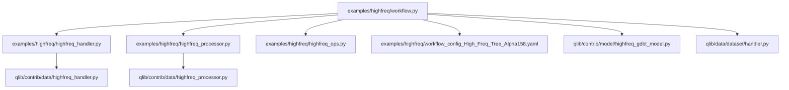
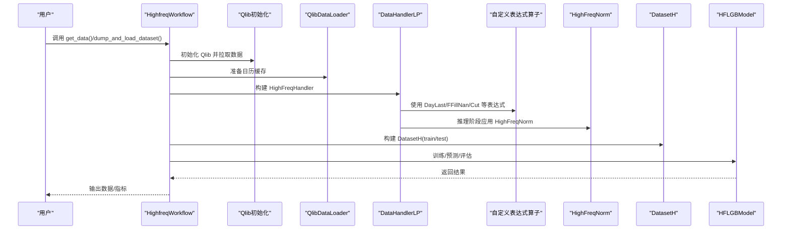
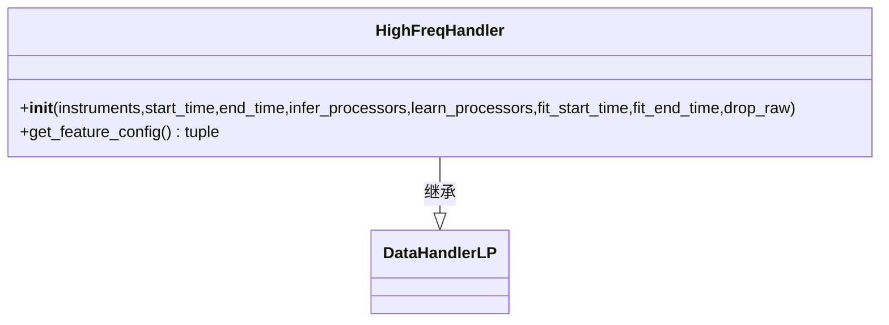
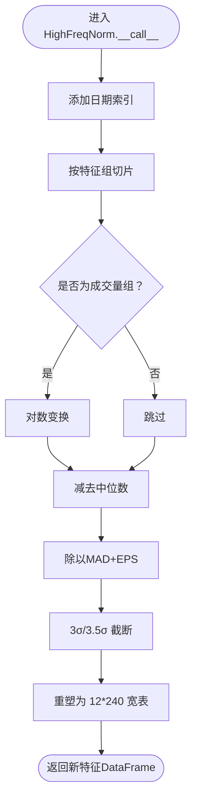
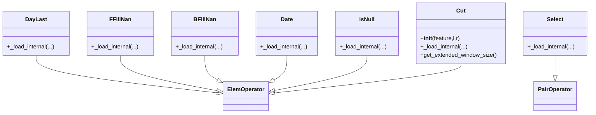
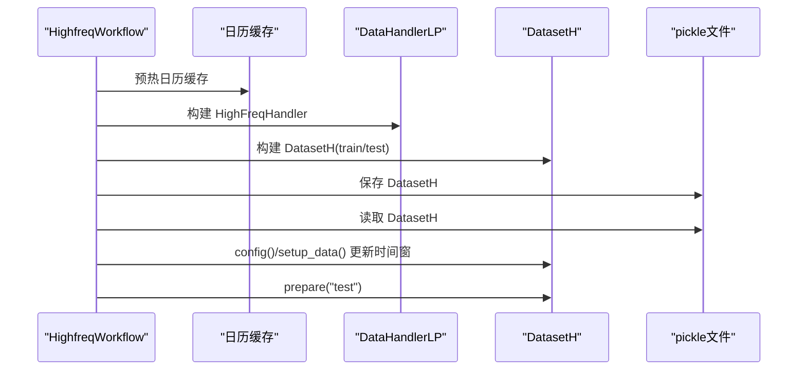
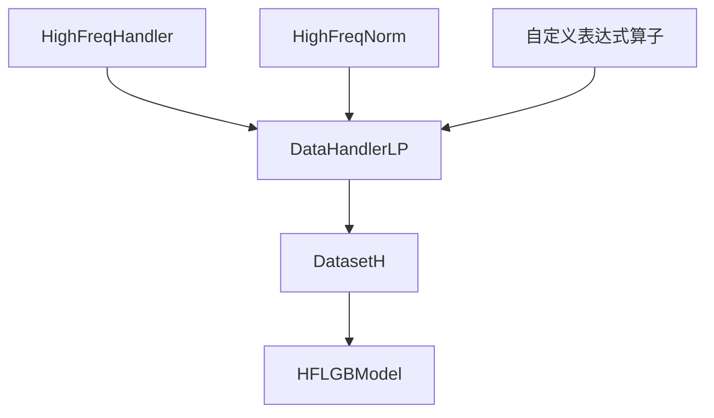

# 高频交易示例

<cite>
**本文引用的文件**
- [examples/highfreq/workflow.py](file://examples/highfreq/workflow.py)
- [examples/highfreq/workflow_config_High_Freq_Tree_Alpha158.yaml](file://examples/highfreq/workflow_config_High_Freq_Tree_Alpha158.yaml)
- [examples/highfreq/highfreq_handler.py](file://examples/highfreq/highfreq_handler.py)
- [examples/highfreq/highfreq_processor.py](file://examples/highfreq/highfreq_processor.py)
- [examples/highfreq/highfreq_ops.py](file://examples/highfreq/highfreq_ops.py)
- [qlib/contrib/data/highfreq_handler.py](file://qlib/contrib/data/highfreq_handler.py)
- [qlib/contrib/data/highfreq_processor.py](file://qlib/contrib/data/highfreq_processor.py)
- [qlib/contrib/model/highfreq_gdbt_model.py](file://qlib/contrib/model/highfreq_gdbt_model.py)
- [qlib/data/dataset/handler.py](file://qlib/data/dataset/handler.py)
- [docs/component/highfreq.rst](file://docs/component/highfreq.rst)
</cite>

## 目录
1. [简介](#简介)
2. [项目结构](#项目结构)
3. [核心组件](#核心组件)
4. [架构总览](#架构总览)
5. [详细组件分析](#详细组件分析)
6. [依赖关系分析](#依赖关系分析)
7. [性能考虑](#性能考虑)
8. [故障排查指南](#故障排查指南)
9. [结论](#结论)
10. [附录](#附录)

## 简介
本文件面向希望理解高频交易示例实现机制的读者，重点解析以下模块与流程：
- highfreq_handler：负责高频数据加载与特征表达式配置（含多周期归一化、成交量与VWAP构造等）
- highfreq_processor：负责特征标准化与重排（支持日级索引、对数变换、分位裁剪等）
- highfreq_ops：定义高频场景常用表达式算子（前向填充、后向填充、按日取末值、选择、空值判断、截断等）
- workflow：演示从初始化环境、准备日历缓存、构建训练/测试数据集，到序列化/反序列化与增量数据准备的完整执行路径
- workflow_config_High_Freq_Tree_Alpha158.yaml：以树模型为例的高频工作流配置，展示多周期特征提取、事件驱动处理与树模型应用

同时，文档将说明如何通过配置实现多周期特征提取、事件驱动处理以及树结构模型应用，并给出高频场景下的性能优化策略与调试监控建议。

## 项目结构
高频示例位于 examples/highfreq，核心文件如下：
- workflow.py：高频工作流入口，包含数据集构建、序列化/反序列化、增量数据准备等
- workflow_config_High_Freq_Tree_Alpha158.yaml：高频工作流配置样例（树模型）
- highfreq_handler.py：示例中的高频处理器（与 qlib.contrib.data 中的通用实现并列）
- highfreq_processor.py：示例中的特征处理器（与 qlib.contrib.data 中的通用实现并列）
- highfreq_ops.py：高频场景表达式算子集合

图表来源
- [examples/highfreq/workflow.py](file://examples/highfreq/workflow.py#L1-L176)
- [examples/highfreq/highfreq_handler.py](file://examples/highfreq/highfreq_handler.py#L1-L159)
- [examples/highfreq/highfreq_processor.py](file://examples/highfreq/highfreq_processor.py#L1-L77)
- [examples/highfreq/highfreq_ops.py](file://examples/highfreq/highfreq_ops.py#L1-L168)
- [qlib/contrib/data/highfreq_handler.py](file://qlib/contrib/data/highfreq_handler.py#L1-L540)
- [qlib/contrib/data/highfreq_processor.py](file://qlib/contrib/data/highfreq_processor.py#L1-L81)
- [qlib/contrib/model/highfreq_gdbt_model.py](file://qlib/contrib/model/highfreq_gdbt_model.py#L1-L172)
- [qlib/data/dataset/handler.py](file://qlib/data/dataset/handler.py#L586-L621)

章节来源
- [examples/highfreq/workflow.py](file://examples/highfreq/workflow.py#L1-L176)
- [examples/highfreq/workflow_config_High_Freq_Tree_Alpha158.yaml](file://examples/highfreq/workflow_config_High_Freq_Tree_Alpha158.yaml#L1-L65)

## 核心组件
- HighFreqHandler（示例）：基于 DataHandlerLP，使用 QlibDataLoader 加载 1 分钟频率数据；通过表达式配置生成多周期价格、成交量与 VWAP 特征，并进行暂停交易过滤与前向填充
- HighFreqNorm（示例）：对价格与成交量进行中位数- MAD 归一化、日级索引重排、3σ 截断与对数变换，输出适配 RL 执行器的形状
- 自定义表达式算子（示例）：DayLast、FFillNan、BFillNan、Date、Select、IsNull、Cut，用于表达式层的数据清洗与窗口操作
- 工作流（示例）：初始化 Qlib、准备日历缓存、构建训练/测试数据集、序列化/反序列化、增量数据准备
- 树模型工作流配置（示例）：以 HFLGBModel 为模型类，配置标签、数据集划分与记录器

章节来源
- [examples/highfreq/highfreq_handler.py](file://examples/highfreq/highfreq_handler.py#L1-L159)
- [examples/highfreq/highfreq_processor.py](file://examples/highfreq/highfreq_processor.py#L1-L77)
- [examples/highfreq/highfreq_ops.py](file://examples/highfreq/highfreq_ops.py#L1-L168)
- [examples/highfreq/workflow.py](file://examples/highfreq/workflow.py#L1-L176)
- [examples/highfreq/workflow_config_High_Freq_Tree_Alpha158.yaml](file://examples/highfreq/workflow_config_High_Freq_Tree_Alpha158.yaml#L1-L65)

## 架构总览
高频工作流从配置出发，经由 DataHandlerLP 的学习/推理阶段，结合自定义表达式算子与特征处理器，最终进入模型训练与预测阶段。下图展示了关键组件之间的交互关系。

图表来源
- [examples/highfreq/workflow.py](file://examples/highfreq/workflow.py#L1-L176)
- [examples/highfreq/highfreq_handler.py](file://examples/highfreq/highfreq_handler.py#L1-L159)
- [examples/highfreq/highfreq_processor.py](file://examples/highfreq/highfreq_processor.py#L1-L77)
- [examples/highfreq/highfreq_ops.py](file://examples/highfreq/highfreq_ops.py#L1-L168)
- [qlib/contrib/model/highfreq_gdbt_model.py](file://qlib/contrib/model/highfreq_gdbt_model.py#L1-L172)

## 详细组件分析

### HighFreqHandler（示例）分析
- 数据加载：通过 QlibDataLoader 以 1 分钟频率加载字段，字段名与表达式由 get_feature_config 动态生成
- 多周期特征：同一字段在当前时刻与滞后 240 步（约 1 天）分别构造特征，形成“当前/滞后”双周期特征
- 价格归一化：以昨日第 237 分钟收盘价作为基准进行日间归一化，避免涨跌停与休市影响
- 成交量与 VWAP：构造成交量占比与滞后版本，使用 Simpson 近似法估算 VWAP
- 暂停过滤与空值处理：通过 Select/IsNull/FFillNan 等表达式剔除休市时段与缺失值

图表来源
- [examples/highfreq/highfreq_handler.py](file://examples/highfreq/highfreq_handler.py#L1-L159)

章节来源
- [examples/highfreq/highfreq_handler.py](file://examples/highfreq/highfreq_handler.py#L1-L159)

### HighFreqNorm（示例）分析
- 拟合阶段：在拟合时间窗内计算各特征组的中位数、MAD、最大最小值，并持久化参数
- 推理阶段：对输入特征进行对数变换（成交量）、中心化与标准化，并进行 3σ/3.5σ 截断
- 日级索引：将 datetime 级别索引转换为日期级别，便于按日聚合
- 形状重排：将 6 个字段 × 240 分钟重塑为 12×240 的宽表，适配 RL 执行器

图表来源
- [examples/highfreq/highfreq_processor.py](file://examples/highfreq/highfreq_processor.py#L1-L77)

章节来源
- [examples/highfreq/highfreq_processor.py](file://examples/highfreq/highfreq_processor.py#L1-L77)

### 自定义表达式算子（示例）分析
- DayLast：按日分组取最后一个值，用于日间归一化基准
- FFillNan/BFillNan：前向/后向填充空值
- Date：从索引映射出日期序列
- Select：条件选择，常用于剔除休市或异常时段
- IsNull：空值判断
- Cut：对原始序列进行前后窗口裁剪，避免边界效应

图表来源
- [examples/highfreq/highfreq_ops.py](file://examples/highfreq/highfreq_ops.py#L1-L168)

章节来源
- [examples/highfreq/highfreq_ops.py](file://examples/highfreq/highfreq_ops.py#L1-L168)

### 工作流（示例）分析
- 初始化与数据准备：合并 SPEC_CONF（注册自定义表达式），初始化 Qlib 并拉取 1 分钟数据；预热日历缓存
- 数据集构建：分别构建训练/测试数据集，支持不同数据源与分割区间
- 序列化/反序列化：将 DatasetH 保存为 pickle 文件，随后重新加载并更新 handler 与 segments 后再次准备数据
- 增量数据准备：通过 config() 与 setup_data() 在不重建整个流程的情况下切换测试时间段

图表来源
- [examples/highfreq/workflow.py](file://examples/highfreq/workflow.py#L1-L176)

章节来源
- [examples/highfreq/workflow.py](file://examples/highfreq/workflow.py#L1-L176)

### 树模型工作流配置（示例）分析
- 数据初始化：provider_uri 指向 1 分钟数据目录，市场、时间范围、训练/验证/测试划分
- 数据处理器：对特征进行稳健 Z-Score 归一化与空值填充；对标签进行跨样本标准化
- 模型：HFLGBModel（LightGBM），二分类目标，设置深度、叶子数、正则化等超参
- 数据集：使用 Alpha158 处理器，按时间划分 train/valid/test
- 记录器：SignalRecord 与 HFSignalRecord，用于信号记录与高频信号记录

章节来源
- [examples/highfreq/workflow_config_High_Freq_Tree_Alpha158.yaml](file://examples/highfreq/workflow_config_High_Freq_Tree_Alpha158.yaml#L1-L65)

## 依赖关系分析
- HighFreqHandler 依赖 DataHandlerLP 的推理/学习阶段处理流程，后者在 prepare 阶段会调用推理/学习处理器链
- HighFreqNorm 依赖 fetch_df_by_index 实现按日期切片，依赖日级索引进行重排
- 自定义表达式算子依赖 qlib.data.ops 的 ElemOperator/PairOperator 基类，实现按日分组与窗口扩展
- HFLGBModel 依赖 DatasetH 提供的 feature/label，进行训练与预测

图表来源
- [qlib/data/dataset/handler.py](file://qlib/data/dataset/handler.py#L586-L621)
- [examples/highfreq/highfreq_handler.py](file://examples/highfreq/highfreq_handler.py#L1-L159)
- [examples/highfreq/highfreq_processor.py](file://examples/highfreq/highfreq_processor.py#L1-L77)
- [examples/highfreq/highfreq_ops.py](file://examples/highfreq/highfreq_ops.py#L1-L168)
- [qlib/contrib/model/highfreq_gdbt_model.py](file://qlib/contrib/model/highfreq_gdbt_model.py#L1-L172)

章节来源
- [qlib/data/dataset/handler.py](file://qlib/data/dataset/handler.py#L586-L621)

## 性能考虑
- 内存复用与零拷贝
  - DataHandlerLP 在推理阶段默认复制数据以避免修改原始数据，可通过只读处理器减少不必要的副本
  - 高频数据量大，建议在处理器中尽量使用就地修改与数值类型压缩（如将布尔转为 int8）
- 并行计算
  - 使用多线程时注意 Python GIL 对 CPU 密集任务的影响；可考虑将耗时的特征计算拆分为外部进程或使用向量化库
  - 日历缓存预热可避免子进程中重复计算，提升多进程场景下的启动速度
- 延迟控制
  - 表达式层尽量使用向量化操作与分组函数，避免逐行循环
  - 对于滞后特征，合理设置 Cut 窗口，减少无效数据参与计算
- I/O 与序列化
  - 将 DatasetH 序列化为 pickle 可显著缩短后续运行时间；注意在更新时间窗后调用 setup_data 以确保一致性
- 数值稳定性
  - 在归一化中加入小常数（如 EPS）以避免除零；对极值采用分位裁剪（3σ/3.5σ）降低尾部噪声影响

章节来源
- [examples/highfreq/workflow.py](file://examples/highfreq/workflow.py#L1-L176)
- [examples/highfreq/highfreq_processor.py](file://examples/highfreq/highfreq_processor.py#L1-L77)

## 故障排查指南
- 数据为空或维度异常
  - 检查 DataHandlerLP 的推理/学习阶段是否正确传入处理器链，确认 fit_start_time/fit_end_time 是否覆盖有效区间
  - 确认表达式配置中 Cut 窗口是否过大导致有效样本过少
- 训练/预测报错
  - HFLGBModel 在多标签场景不支持训练，需确保标签为单列并转换为二分类
  - 若模型未训练即预测，会抛出异常；请先 fit 或加载已有模型
- 序列化/反序列化问题
  - 更新时间窗后务必调用 config() 与 setup_data()，否则可能使用旧的时间窗
  - 确保 pickle 文件与处理器版本兼容，必要时重新生成数据集
- 表达式计算异常
  - 检查 DayLast/FFillNan/Cut 等算子的窗口扩展是否正确，避免越界访问
  - 对于空值与无穷大，使用 IsNull/IsInf 与条件选择组合进行安全处理

章节来源
- [qlib/contrib/model/highfreq_gdbt_model.py](file://qlib/contrib/model/highfreq_gdbt_model.py#L1-L172)
- [examples/highfreq/workflow.py](file://examples/highfreq/workflow.py#L1-L176)
- [examples/highfreq/highfreq_ops.py](file://examples/highfreq/highfreq_ops.py#L1-L168)

## 结论
高频交易示例通过 HighFreqHandler、HighFreqNorm 与自定义表达式算子，实现了多周期特征提取与事件驱动的数据清洗；借助 DataHandlerLP 的学习/推理阶段与 DatasetH 的时间切分，完成了从数据预处理到模型训练与预测的闭环。配合树模型配置与序列化/反序列化机制，可在保证性能的同时快速迭代与扩展。建议在生产环境中进一步强化内存复用、并行计算与延迟控制，并建立完善的调试与监控体系。

## 附录
- 相关文档：高频交易框架设计与嵌套决策执行框架的背景与示例链接
- 示例参考：nested_decision_execution/workflow.py 展示了多层级联合回测的框架思路

章节来源
- [docs/component/highfreq.rst](file://docs/component/highfreq.rst#L1-L41)