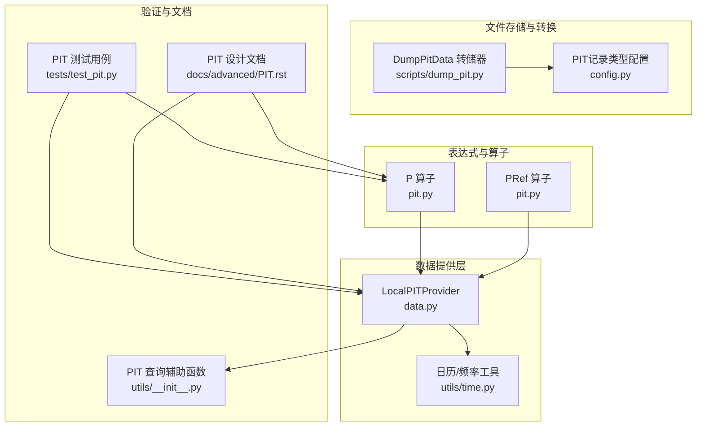
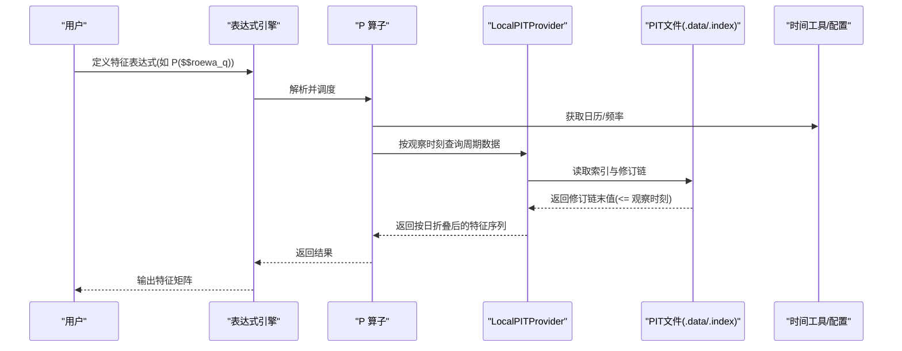
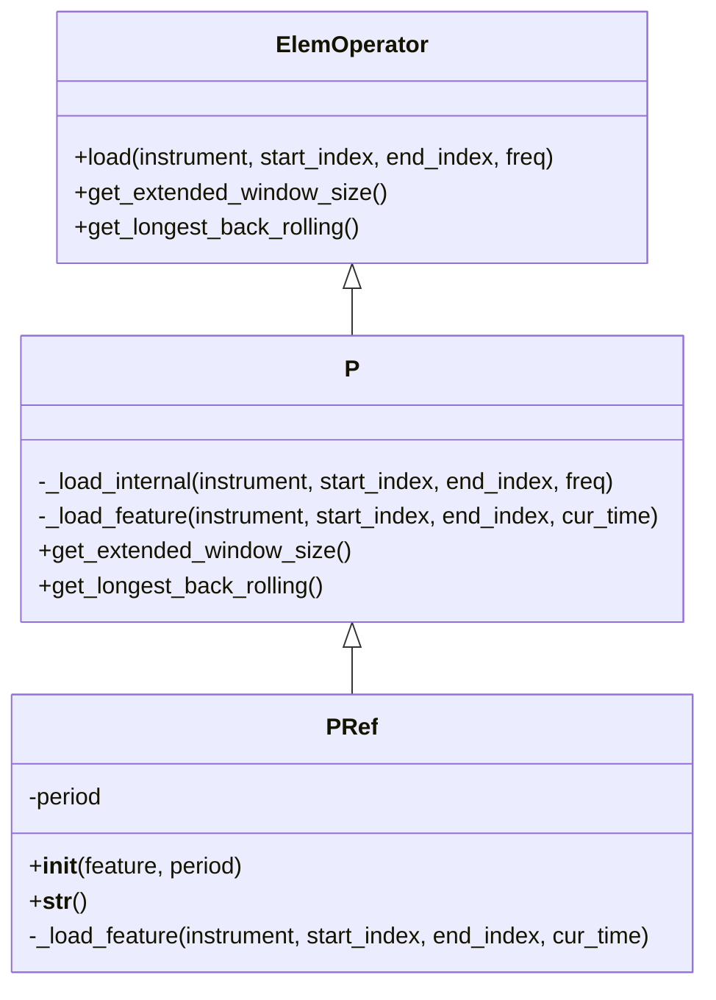
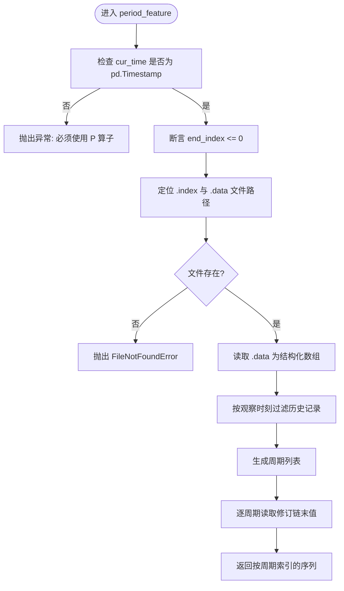
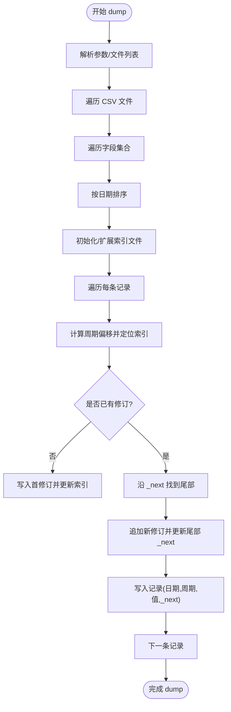
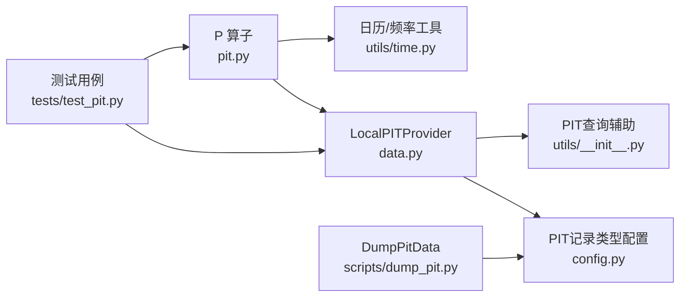

# PIT数据保障

<cite>
**本文引用的文件**
- [pit.py](file://qlib/data/pit.py)
- [PIT.rst](file://docs/advanced/PIT.rst)
- [dump_pit.py](file://scripts/dump_pit.py)
- [data.py](file://qlib/data/data.py)
- [time.py](file://qlib/utils/time.py)
- [__init__.py](file://qlib/utils/__init__.py)
- [test_pit.py](file://tests/test_pit.py)
- [config.py](file://qlib/config.py)
</cite>

## 目录
1. [引言](#引言)
2. [项目结构](#项目结构)
3. [核心组件](#核心组件)
4. [架构总览](#架构总览)
5. [详细组件分析](#详细组件分析)
6. [依赖关系分析](#依赖关系分析)
7. [性能考量](#性能考量)
8. [故障排查指南](#故障排查指南)
9. [结论](#结论)
10. [附录](#附录)

## 引言
本文件系统性讲解Qlib中的PIT（Point-in-Time）数据保障技术：如何通过“观察时刻”与“周期时刻”的双时间轴，确保特征数据与未来标签之间的时间隔离，从而避免未来信息泄露；如何在日频与分钟频等不同频率下实现一致的时间对齐；以及如何在非交易时段与节假日场景下正确处理时间边界。同时，提供PIT验证工具的使用方法与常见问题排查思路，并通过测试用例展示PIT失效对回测结果的严重后果。

## 项目结构
围绕PIT的关键代码分布在以下模块：
- 数据提供与表达式层：PIT算子与PIT Provider
- 文件存储与转换：PIT二进制格式与批量转换脚本
- 时间工具与配置：频率解析、时间边界与常量定义
- 文档与测试：PIT设计文档与回归测试

图表来源
- [pit.py](file://qlib/data/pit.py#L1-L72)
- [data.py](file://qlib/data/data.py#L744-L943)
- [dump_pit.py](file://scripts/dump_pit.py#L1-L281)
- [time.py](file://qlib/utils/time.py#L1-L378)
- [__init__.py](file://qlib/utils/__init__.py#L81-L173)
- [PIT.rst](file://docs/advanced/PIT.rst#L1-L137)
- [test_pit.py](file://tests/test_pit.py#L1-L287)
- [config.py](file://qlib/config.py#L226-L238)

章节来源
- [pit.py](file://qlib/data/pit.py#L1-L72)
- [data.py](file://qlib/data/data.py#L744-L943)
- [dump_pit.py](file://scripts/dump_pit.py#L1-L281)
- [time.py](file://qlib/utils/time.py#L1-L378)
- [__init__.py](file://qlib/utils/__init__.py#L81-L173)
- [PIT.rst](file://docs/advanced/PIT.rst#L1-L137)
- [test_pit.py](file://tests/test_pit.py#L1-L287)
- [config.py](file://qlib/config.py#L226-L238)

## 核心组件
- P 算子：将周期型财务数据按“观察时刻”折叠为每日特征，保证未来信息不泄漏。
- PRef 算子：按指定周期读取PIT值，支持跨期比较。
- LocalPITProvider：从本地文件PIT数据库加载数据，严格限制查询不得包含未来数据。
- DumpPitData：将CSV格式的财务数据转存为PIT二进制文件，建立索引与修订链。
- 时间工具与配置：统一频率解析、日历与时间边界处理，支撑不同频率下的对齐。

章节来源
- [pit.py](file://qlib/data/pit.py#L23-L72)
- [data.py](file://qlib/data/data.py#L744-L943)
- [dump_pit.py](file://scripts/dump_pit.py#L1-L281)
- [time.py](file://qlib/utils/time.py#L114-L185)
- [config.py](file://qlib/config.py#L226-L238)

## 架构总览
PIT数据保障的端到端流程如下：
- 数据准备：采集/归一化财务数据，使用DumpPitData生成PIT二进制文件与索引。
- 表达式计算：通过P/PRef算子在“观察时刻”对周期数据进行折叠与查询。
- 提供与校验：LocalPITProvider在查询时强制禁止未来数据，确保时间隔离。
- 验证与回归：通过测试用例验证PIT行为与回测稳定性。

图表来源
- [pit.py](file://qlib/data/pit.py#L23-L72)
- [data.py](file://qlib/data/data.py#L744-L943)
- [dump_pit.py](file://scripts/dump_pit.py#L150-L266)
- [time.py](file://qlib/utils/time.py#L114-L185)
- [__init__.py](file://qlib/utils/__init__.py#L109-L173)

## 详细组件分析

### P 算子与 PRef 算子
- P 算子负责将周期型财务字段（如季度/年度）在每个观察时刻折叠为日度特征。其内部通过日历索引遍历观察时刻，对每个时刻调用底层特征加载器，仅取历史窗口内的最后一个有效值，从而天然避免未来信息。
- PRef 算子在P的基础上增加周期参数，允许按指定周期读取PIT值，便于跨期比较与滚动计算。

图表来源
- [pit.py](file://qlib/data/pit.py#L23-L72)

章节来源
- [pit.py](file://qlib/data/pit.py#L23-L72)

### LocalPITProvider 的查询与时间隔离
- LocalPITProvider 在查询周期数据时，要求传入的是“观察时刻”（pd.Timestamp），否则直接报错，强制用户使用P算子进行时间折叠。
- 查询接口断言结束索引必须非正，即不允许查询未来数据，从根本上杜绝未来信息泄露。
- 通过索引文件与修订链（_next指针）定位指定周期在观察时刻前的最新修订值，返回按周期列表组织的序列。

图表来源
- [data.py](file://qlib/data/data.py#L744-L943)
- [__init__.py](file://qlib/utils/__init__.py#L109-L173)

章节来源
- [data.py](file://qlib/data/data.py#L744-L943)

### DumpPitData 的文件格式与写入策略
- 文件命名约定：字段名后缀_q或_a分别对应季度与年度。
- 文件结构：.data为修订链表，每条记录含发布日期、周期、值与_next指针；.index记录每个周期首条修订的字节偏移，便于快速定位。
- 写入策略：按日期排序插入，若同一周期已有修订，则沿_next链找到尾部更新；支持增量与覆盖模式，自动维护索引文件。

图表来源
- [dump_pit.py](file://scripts/dump_pit.py#L142-L266)
- [config.py](file://qlib/config.py#L226-L238)

章节来源
- [dump_pit.py](file://scripts/dump_pit.py#L1-L281)
- [config.py](file://qlib/config.py#L226-L238)

### 时间戳对齐与频率差异
- 日频与分钟频的对齐策略：
  - 日频：以日历索引为基准，P算子按日历遍历观察时刻，确保每个交易日只使用该日及之前的修订值。
  - 分钟频：通过时间工具将分钟级数据对齐到采样日历，再进行P折叠，保证分钟粒度下的时间隔离。
- 非交易时段与节假日：LocalPITProvider在查询时严格限定end_index<=0，且表达式层通过日历工具对查询范围进行裁剪，避免跨时段的数据越界。

章节来源
- [time.py](file://qlib/utils/time.py#L114-L185)
- [data.py](file://qlib/data/data.py#L833-L880)

### PIT验证工具与使用方法
- 使用步骤：
  1) 准备CSV格式的财务数据（字段包含日期、周期、值等）。
  2) 运行DumpPitData将CSV转存为PIT二进制文件与索引。
  3) 初始化Qlib并设置provider_uri指向PIT数据目录。
  4) 在表达式中使用P/PRef算子读取PIT特征，运行回测或特征提取。
- 常见验证点：
  - 确认字段名后缀_q/_a与interval匹配。
  - 检查索引文件是否正确生成，周期偏移是否符合预期。
  - 使用测试用例对比PIT输出与预期，验证未来信息未泄漏。

章节来源
- [dump_pit.py](file://scripts/dump_pit.py#L1-L281)
- [test_pit.py](file://tests/test_pit.py#L1-L287)

## 依赖关系分析
- P 算子依赖日历与频率工具，确保按正确的观察时刻遍历。
- LocalPITProvider依赖PIT文件格式与索引，通过修订链查找最新有效值。
- DumpPitData依赖配置中的PIT记录类型与NaN占位，保证二进制兼容性。
- 测试用例依赖D.features接口与PIT数据，验证PIT折叠与跨期比较的正确性。

图表来源
- [pit.py](file://qlib/data/pit.py#L23-L72)
- [data.py](file://qlib/data/data.py#L744-L943)
- [__init__.py](file://qlib/utils/__init__.py#L109-L173)
- [dump_pit.py](file://scripts/dump_pit.py#L1-L281)
- [config.py](file://qlib/config.py#L226-L238)
- [test_pit.py](file://tests/test_pit.py#L1-L287)

章节来源
- [pit.py](file://qlib/data/pit.py#L23-L72)
- [data.py](file://qlib/data/data.py#L744-L943)
- [__init__.py](file://qlib/utils/__init__.py#L109-L173)
- [dump_pit.py](file://scripts/dump_pit.py#L1-L281)
- [config.py](file://qlib/config.py#L226-L238)
- [test_pit.py](file://tests/test_pit.py#L1-L287)

## 性能考量
- 当前实现的性能瓶颈主要集中在：
  - 对每个周期单独调用修订链查询，存在多次文件随机访问。
  - 未启用索引缓存与跨周期复用，导致重复读取。
- 优化建议：
  - 为索引文件引入缓存，减少重复打开与解析。
  - 在单次观察时刻内合并周期查询，减少文件IO次数。
  - 对修订链采用更高效的二分/跳表结构，降低查询复杂度。
  - 在表达式层对P折叠过程进行批量化与向量化处理。

章节来源
- [data.py](file://qlib/data/data.py#L744-L943)
- [PIT.rst](file://docs/advanced/PIT.rst#L132-L136)

## 故障排查指南
- 报错“必须使用P算子”：说明直接查询了周期字段而非P折叠后的日度特征，请改用P($$field_q)等表达式。
- 报错“查询未来数据”：说明end_index>0，需调整查询范围或使用P算子限定观察时刻。
- 文件不存在：确认字段名后缀_q/_a与interval一致，且索引文件已生成。
- 结果为空：检查日期与周期是否匹配，确认CSV归一化阶段已正确填充日期与周期。
- 回测异常波动：检查是否混用了PIT与非PIT特征，或在表达式中误用Ref未来偏移。

章节来源
- [data.py](file://qlib/data/data.py#L744-L943)
- [test_pit.py](file://tests/test_pit.py#L1-L287)

## 结论
PIT通过“观察时刻-周期时刻”的双时间轴设计，结合严格的未来信息隔离与修订链机制，有效避免了回测中的时间穿越问题。尽管当前实现存在一定的IO与查询开销，但其在日频与分钟频下的对齐策略与节假日/非交易时段处理已较为完备。配合DumpPitData与测试用例，用户可安全构建高质量的PIT数据流水线，并显著提升回测结果的可信度。

## 附录
- 关键配置项（PIT记录类型与NaN占位）用于保证二进制兼容性与缺失值处理。
- 文档明确指出PIT当前主要面向季度/年度财务因子，并提示未来可进一步优化性能。

章节来源
- [config.py](file://qlib/config.py#L226-L238)
- [PIT.rst](file://docs/advanced/PIT.rst#L132-L136)