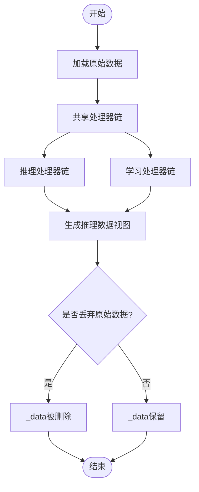
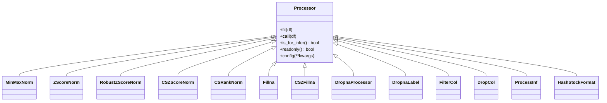

# 常规数据处理

<cite>
**本文引用的文件列表**
- [handler.py](file://qlib/data/dataset/handler.py)
- [processor.py](file://qlib/data/dataset/processor.py)
- [loader.py](file://qlib/data/dataset/loader.py)
- [utils.py](file://qlib/data/dataset/utils.py)
- [storage.py](file://qlib/data/dataset/storage.py)
- [cache.py](file://qlib/data/cache.py)
- [workflow.py](file://examples/rolling_process_data/workflow.py)
- [README.md](file://examples/rolling_process_data/README.md)
</cite>

## 目录
1. [引言](#引言)
2. [项目结构与总体流程](#项目结构与总体流程)
3. [核心组件](#核心组件)
4. [架构总览](#架构总览)
5. [关键组件深度解析](#关键组件深度解析)
6. [依赖关系分析](#依赖关系分析)
7. [性能与缓存机制](#性能与缓存机制)
8. [故障排查指南](#故障排查指南)
9. [结论](#结论)
10. [附录：构建自定义数据处理链示例](#附录构建自定义数据处理链示例)

## 引言
本文件系统性阐述 qlib 中常规数据处理流程的实现机制，重点围绕以下目标：
- DataHandler 类如何管理数据集生命周期（加载、预处理、查询、内存与存储形态切换）
- Processor 类的设计模式与典型预处理操作（标准化、去极值、填充缺失值、跨截面归一化等）的实现方式及对模型性能的影响
- 如何基于 DataHandlerLP 构建“可学习”的处理器流水线，并在训练/推理阶段分别应用不同处理链
- 数据缓存与性能优化策略，以支撑大规模数据处理

## 项目结构与总体流程
从数据到模型的常规路径如下：
- 数据源通过 DataLoader 加载原始特征与标签，返回多索引 DataFrame
- DataHandler 负责统一的 fetch 接口、列集合选择、时间切片、以及可选的底层存储形态（默认 DataFrame 或哈希存储）
- DataHandlerLP 在 DataHandler 基础上引入“可学习”处理器流水线，支持独立/追加两类处理流，分别面向推理与学习
- DatasetH 使用 segments 定义训练/验证/测试的时间段，按需准备数据
- 预处理处理器（Processor 及其子类）提供标准化、去极值、填充缺失值、跨截面归一化等能力
- 缓存层（表达式/数据集缓存）提升重复访问性能

图示来源
- [loader.py](file://qlib/data/dataset/loader.py#L1-L120)
- [handler.py](file://qlib/data/dataset/handler.py#L68-L170)
- [handler.py](file://qlib/data/dataset/handler.py#L383-L787)
- [processor.py](file://qlib/data/dataset/processor.py#L1-L120)
- [cache.py](file://qlib/data/cache.py#L646-L792)

章节来源
- [loader.py](file://qlib/data/dataset/loader.py#L1-L120)
- [handler.py](file://qlib/data/dataset/handler.py#L68-L170)
- [handler.py](file://qlib/data/dataset/handler.py#L383-L787)
- [processor.py](file://qlib/data/dataset/processor.py#L1-L120)
- [cache.py](file://qlib/data/cache.py#L646-L792)

## 核心组件
- DataHandler：统一的数据适配器，负责加载、筛选、列集合选择、时间切片、squeeze 等；支持底层存储为 DataFrame 或哈希存储
- DataHandlerLP：在 DataHandler 基础上扩展“可学习”处理器流水线，支持共享/推理/学习三类处理器，以及两种处理流类型（独立/追加）
- Processor 及其子类：标准化（MinMaxNorm/ZScoreNorm/RZScore）、去极值（ProcessInf）、填充缺失（Fillna/CSZFillna）、跨截面归一化（CSZScoreNorm/CSRankNorm）、过滤列/行（FilterCol/DropCol）、丢弃样本（DropnaProcessor/DropnaLabel）、哈希存储转换（HashStockFormat）
- DataLoader：抽象数据加载器，提供统一 load 接口；包含静态加载器、嵌套加载器、基于 DataHandler 的加载器等
- DatasetH：基于 DataHandler 的数据集封装，使用 segments 定义训练/验证/测试时间段
- 缓存：表达式缓存与数据集缓存，支持磁盘缓存与 Redis 锁协调

章节来源
- [handler.py](file://qlib/data/dataset/handler.py#L68-L170)
- [handler.py](file://qlib/data/dataset/handler.py#L383-L787)
- [processor.py](file://qlib/data/dataset/processor.py#L1-L120)
- [processor.py](file://qlib/data/dataset/processor.py#L196-L324)
- [loader.py](file://qlib/data/dataset/loader.py#L1-L120)
- [cache.py](file://qlib/data/cache.py#L646-L792)

## 架构总览
下面用类图展示关键类之间的关系与职责分工。

图示来源
- [handler.py](file://qlib/data/dataset/handler.py#L68-L170)
- [handler.py](file://qlib/data/dataset/handler.py#L383-L787)
- [processor.py](file://qlib/data/dataset/processor.py#L1-L120)
- [processor.py](file://qlib/data/dataset/processor.py#L196-L324)
- [loader.py](file://qlib/data/dataset/loader.py#L1-L120)
- [storage.py](file://qlib/data/dataset/storage.py#L1-L120)

## 关键组件深度解析

### DataHandler 生命周期与查询机制
- 初始化与加载
  - 通过构造函数注入 DataLoader，随后调用 setup_data 完成底层数据加载与排序
  - 支持 fetch_orig 参数以尽量避免复制，提高性能
- 查询与切片
  - fetch 提供统一接口，支持按时间切片、按列集合选择、按列组选择、squeeze 等
  - 内部通过工具函数按 level 切换索引顺序，保证查询一致性
- 存储形态
  - 默认使用 DataFrame；也可使用哈希存储（按股票分桶），显著降低随机访问开销
- 时间序列迭代
  - 提供按周期生成范围选择器与迭代器，便于滚动窗口训练

图示来源
- [handler.py](file://qlib/data/dataset/handler.py#L174-L210)
- [handler.py](file://qlib/data/dataset/handler.py#L279-L328)
- [utils.py](file://qlib/data/dataset/utils.py#L41-L90)

章节来源
- [handler.py](file://qlib/data/dataset/handler.py#L174-L210)
- [handler.py](file://qlib/data/dataset/handler.py#L279-L328)
- [utils.py](file://qlib/data/dataset/utils.py#L41-L90)
- [storage.py](file://qlib/data/dataset/storage.py#L1-L120)

### DataHandlerLP：可学习处理器流水线
- 设计动机
  - 将“学习阶段”和“推理阶段”的数据处理解耦，允许在学习阶段使用依赖标签的处理器（如丢弃含标签缺失样本），而在推理阶段仅使用可推理处理器
- 处理流类型
  - 独立（PTYPE_I）：共享处理器后，分别对共享结果运行推理/学习两套处理器
  - 追加（PTYPE_A）：共享处理器后，先运行推理处理器，再在推理结果基础上追加学习处理器
- fit 与 process
  - fit：对原始数据或前序输出进行拟合（统计量保存在处理器实例内）
  - process：按顺序执行处理器链，自动判断是否需要复制以避免原数据被修改
- 数据键
  - 支持三种数据键：raw（原始）、infer（推理）、learn（学习），通过 data_key 选择对应数据视图

图示来源
- [handler.py](file://qlib/data/dataset/handler.py#L511-L614)
- [handler.py](file://qlib/data/dataset/handler.py#L553-L610)

章节来源
- [handler.py](file://qlib/data/dataset/handler.py#L383-L787)

### Processor 预处理设计与典型操作
- Processor 抽象
  - fit：从输入数据中学习参数（如均值/方差/分位数等）
  - __call__：对数据进行变换，可能就地修改
  - is_for_infer：标记该处理器是否可用于推理（部分处理器依赖标签，仅适用于学习阶段）
  - readonly：标记处理器是否只读，帮助 DataHandler 避免不必要的复制
- 典型预处理
  - 标准化
    - MinMaxNorm：按时间窗最小/最大值归一化，注意 fit_end_time 不得包含测试信息
    - ZScoreNorm：按时间窗均值/标准差标准化，注意 fit_end_time 不得包含测试信息
    - RobustZScoreNorm：使用中位数与MAD进行稳健标准化，并可裁剪异常值
  - 跨截面归一化
    - CSZScoreNorm：按日期分组进行 zscore 或稳健 zscore 归一化
    - CSRankNorm：按日期分组进行排名归一化
  - 缺失值处理
    - Fillna：按字段组填充常数
    - CSZFillna：按日期分组用均值填充
  - 去极值
    - ProcessInf：将无穷大替换为当日非无穷大值的均值
  - 过滤与丢弃
    - DropnaProcessor/DropnaLabel：按字段组丢弃缺失样本（后者不可用于推理）
    - FilterCol/DropCol：按字段组过滤列
  - 存储形态转换
    - HashStockFormat：将 DataFrame 转换为哈希存储，加速按股票随机访问

图示来源
- [processor.py](file://qlib/data/dataset/processor.py#L1-L120)
- [processor.py](file://qlib/data/dataset/processor.py#L196-L324)

章节来源
- [processor.py](file://qlib/data/dataset/processor.py#L1-L120)
- [processor.py](file://qlib/data/dataset/processor.py#L196-L324)

### 训练/验证/测试划分与时间片段
- DatasetH 通过 segments 字典定义各片段的时间区间
- prepare 方法根据传入的片段名（如 "train"/"valid"/"test"）或直接传入切片，返回对应数据对象
- 对于时序数据集（TSDatasetH），会扩展切片以满足时间序列步长需求

图示来源
- [handler.py](file://qlib/data/dataset/handler.py#L674-L712)
- [handler.py](file://qlib/data/dataset/handler.py#L511-L610)
- [loader.py](file://qlib/data/dataset/loader.py#L350-L415)

章节来源
- [handler.py](file://qlib/data/dataset/handler.py#L674-L712)
- [handler.py](file://qlib/data/dataset/handler.py#L511-L610)
- [loader.py](file://qlib/data/dataset/loader.py#L350-L415)

## 依赖关系分析
- 组件耦合
  - DataHandler 依赖 DataLoader 与 utils 工具函数；可选依赖 BaseHandlerStorage（默认 DataFrame 或 HashingStockStorage）
  - DataHandlerLP 依赖 Processor 子类族，并在 setup_data 中调用 fit/process
  - DatasetH 依赖 DataHandlerLP 并通过 segments 控制数据分段
  - 缓存模块（DiskDatasetCache/DiskExpressionCache）与 Provider 协作，提供磁盘缓存与 Redis 锁
- 外部依赖
  - pandas/numpy 用于数据结构与数值计算
  - redis_lock 用于并发写锁控制
  - qlib.utils 序列化与初始化工具

图示来源
- [loader.py](file://qlib/data/dataset/loader.py#L1-L120)
- [handler.py](file://qlib/data/dataset/handler.py#L68-L170)
- [handler.py](file://qlib/data/dataset/handler.py#L383-L787)
- [processor.py](file://qlib/data/dataset/processor.py#L1-L120)
- [cache.py](file://qlib/data/cache.py#L646-L792)

章节来源
- [loader.py](file://qlib/data/dataset/loader.py#L1-L120)
- [handler.py](file://qlib/data/dataset/handler.py#L68-L170)
- [handler.py](file://qlib/data/dataset/handler.py#L383-L787)
- [processor.py](file://qlib/data/dataset/processor.py#L1-L120)
- [cache.py](file://qlib/data/cache.py#L646-L792)

## 性能与缓存机制
- DataHandler 层面
  - fetch_orig：当可能时返回底层视图而非复制，减少内存拷贝
  - HashingStockStorage：按股票分桶，随机访问单只股票数据更快
  - readonly 标记：DataHandler 在执行处理器链时可避免不必要的复制
- 缓存层
  - 表达式缓存（DiskExpressionCache）：按字段/频率/标的生成二进制缓存，支持读写锁与元数据维护
  - 数据集缓存（DiskDatasetCache）：将特征/标签拼接后的数据集持久化为 HDF，支持读写锁与索引管理
  - 写锁/读锁：通过 Redis 锁协调多进程并发，避免竞态
  - 访问统计与过期：记录访问次数与最近访问时间，便于清理与监控

图示来源
- [cache.py](file://qlib/data/cache.py#L490-L792)

章节来源
- [cache.py](file://qlib/data/cache.py#L490-L792)

## 故障排查指南
- 处理器不可用于推理
  - 若将仅适用于学习阶段的处理器（如 DropnaLabel）放入推理处理器链，DataHandlerLP 会在运行时抛出错误
  - 解决：将该处理器放入 learn_processors，或将 data_key 设置为学习视图
- fit 时间窗泄漏
  - 标准化类要求 fit_end_time 不得包含测试数据信息，否则会导致数据泄漏
  - 解决：严格按训练时间段设置 fit_start_time/fit_end_time
- 存储形态与查询冲突
  - 使用 HashingStockStorage 时，selector 的股票维度与 level 需匹配
  - 解决：确认 selector 类型与 level，必要时使用 utils 工具函数进行格式转换
- 缓存一致性
  - 多进程写入时需注意 Redis 锁状态，避免脏写
  - 解决：检查锁状态或重置锁，确保缓存元数据一致

章节来源
- [handler.py](file://qlib/data/dataset/handler.py#L530-L542)
- [processor.py](file://qlib/data/dataset/processor.py#L196-L324)
- [storage.py](file://qlib/data/dataset/storage.py#L120-L192)
- [cache.py](file://qlib/data/cache.py#L240-L292)

## 结论
- DataHandler 与 DataHandlerLP 提供了统一且灵活的数据适配与可学习处理器流水线
- Processor 族覆盖了标准化、去极值、填充缺失值、跨截面归一化等常见预处理需求
- DatasetH 通过 segments 实现训练/验证/测试的清晰划分
- 缓存与存储形态优化共同保障了大规模数据处理的效率与稳定性

## 附录：构建自定义数据处理链示例
以下示例演示如何组合多个 Processor 构建复杂数据流水线，并在 DataHandlerLP 中应用，同时结合滚动窗口训练场景。

步骤概览
- 准备预处理的“原始特征”（不随滚动窗口变化的部分），使用 DataHandlerLP 生成预处理器并持久化
- 在滚动窗口训练中，仅更新 fit 时间窗与数据时间窗，复用预处理得到的处理器状态
- 在推理阶段使用仅适用于推理的处理器链，在学习阶段使用包含标签相关处理的链

参考实现要点
- 预处理“原始特征”
  - 使用 DataHandlerLP，将“不随滚动变化”的特征作为原始数据，不配置 learn_processors/infer_processors
  - 通过 config(dump_all=True) 保存处理器状态，后续可直接加载
- 滚动窗口训练
  - 在每次滚动时，更新 handler 的 start_time/end_time 与 processor_kwargs 的 fit_start_time/fit_end_time
  - 调用 dataset.setup_data(handler_kwargs={"init_type": DataHandlerLP.IT_FIT_SEQ}) 以按顺序 fit+process
- 分割与准备
  - 通过 dataset.prepare(["train","valid","test"]) 获取训练/验证/测试数据

图示来源
- [workflow.py](file://examples/rolling_process_data/workflow.py#L1-L135)
- [handler.py](file://qlib/data/dataset/handler.py#L511-L610)
- [handler.py](file://qlib/data/dataset/handler.py#L634-L663)

章节来源
- [workflow.py](file://examples/rolling_process_data/workflow.py#L1-L135)
- [README.md](file://examples/rolling_process_data/README.md#L1-L17)