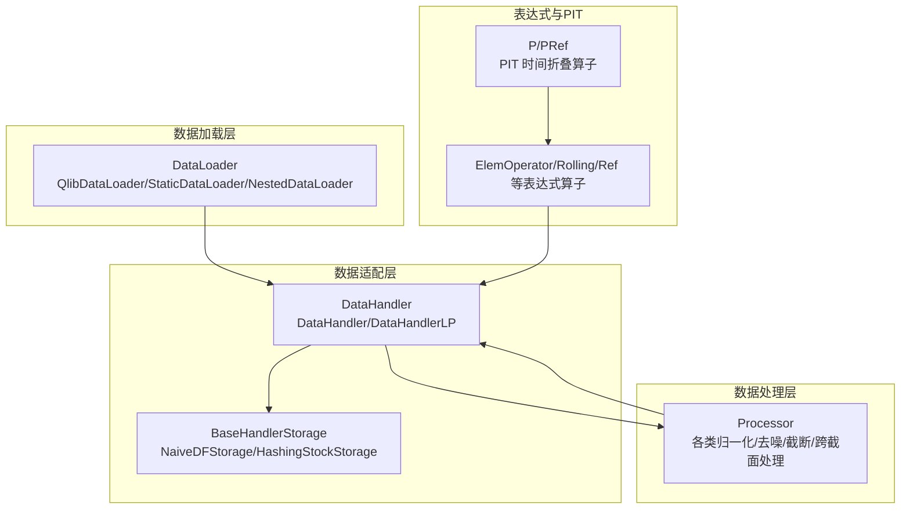
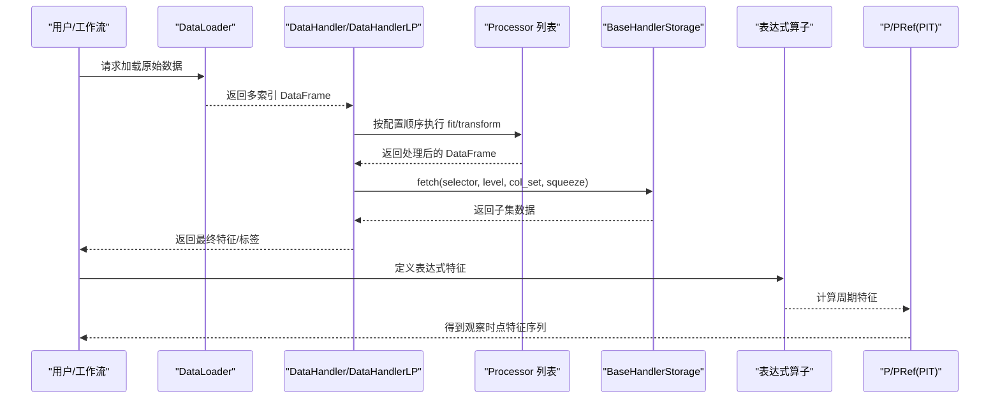
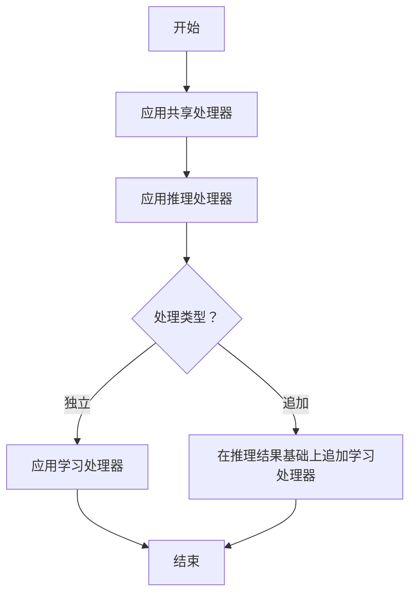
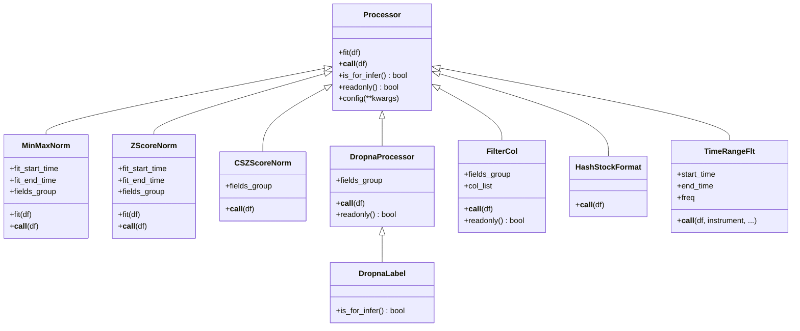
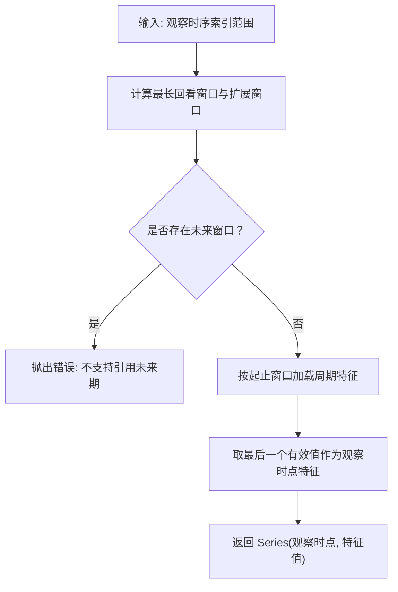
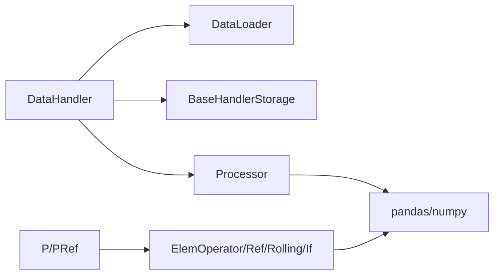

# 数据处理与特征工程

<cite>
**本文引用的文件列表**
- [handler.py](file://qlib/data/dataset/handler.py)
- [processor.py](file://qlib/data/dataset/processor.py)
- [utils.py](file://qlib/data/dataset/utils.py)
- [loader.py](file://qlib/data/dataset/loader.py)
- [storage.py](file://qlib/data/dataset/storage.py)
- [pit.py](file://qlib/data/pit.py)
- [ops.py](file://qlib/data/ops.py)
- [highfreq_handler.py](file://examples/highfreq/highfreq_handler.py)
- [highfreq_processor.py](file://examples/highfreq/highfreq_processor.py)
- [handler.py（contrib）](file://qlib/contrib/data/handler.py)
- [processor.py（contrib）](file://qlib/contrib/data/processor.py)
</cite>

## 目录
1. [引言](#引言)
2. [项目结构](#项目结构)
3. [核心组件](#核心组件)
4. [架构总览](#架构总览)
5. [详细组件分析](#详细组件分析)
6. [依赖关系分析](#依赖关系分析)
7. [性能考量](#性能考量)
8. [故障排查指南](#故障排查指南)
9. [结论](#结论)
10. [附录：自定义特征处理器开发示例](#附录自定义特征处理器开发示例)

## 引言
本文件系统性解析 Qlib 的数据处理流水线，聚焦 DataHandler 与 Processor 的设计模式与协作机制；深入阐述 PIT（Point-in-Time）数据保障技术的实现原理（时间戳对齐与未来数据过滤），确保回测结果的准确性；总结高频数据处理（highfreq_handler.py）的特殊挑战与解决方案（tick 级数据聚合、微结构噪声处理）；并提供自定义特征处理器的开发示例与复杂数据处理链的构建方法，帮助读者在实践中高效、安全地进行特征工程与数据预处理。

## 项目结构
Qlib 的数据层围绕“加载器（DataLoader）—处理器（Processor）—数据处理器（DataHandler/DataHandlerLP）—存储（Storage）”形成清晰的分层架构：
- 加载器负责从底层数据源拉取原始多索引数据（datetime, instrument）
- 处理器以可组合的方式对数据进行清洗、归一化、截断等变换
- 数据处理器封装加载、查询、切片、列集选择、迭代等接口，并支持学习/推理双路径处理
- 存储抽象支持 DataFrame 与哈希存储，优化按股票维度的随机访问
- 高频场景通过专用处理器与表达式算子完成 tick 级特征工程

图表来源
- [loader.py](file://qlib/data/dataset/loader.py#L1-L120)
- [handler.py](file://qlib/data/dataset/handler.py#L68-L120)
- [processor.py](file://qlib/data/dataset/processor.py#L35-L120)
- [storage.py](file://qlib/data/dataset/storage.py#L1-L60)
- [ops.py](file://qlib/data/ops.py#L36-L120)
- [pit.py](file://qlib/data/pit.py#L23-L72)

章节来源
- [loader.py](file://qlib/data/dataset/loader.py#L1-L120)
- [handler.py](file://qlib/data/dataset/handler.py#L68-L120)
- [processor.py](file://qlib/data/dataset/processor.py#L35-L120)
- [storage.py](file://qlib/data/dataset/storage.py#L1-L60)
- [ops.py](file://qlib/data/ops.py#L36-L120)
- [pit.py](file://qlib/data/pit.py#L23-L72)

## 核心组件
- DataHandler：统一的数据访问接口，支持按时间/股票选择、列集裁剪、squeeze、proc_func 钩子等
- DataHandlerLP：在 DataHandler 基础上扩展“学习/推理”双路径处理，支持共享/独立/追加三种处理流程
- Processor：可组合的特征处理单元，支持 fit/fit+transform、是否仅推理可用、是否只读等元信息
- DataLoader：抽象数据加载器，提供 QlibDataLoader、StaticDataLoader、NestedDataLoader 等实现
- Storage：抽象存储接口，提供 NaiveDFStorage 与 HashingStockStorage 两种实现
- 表达式与 PIT：ElemOperator 及其派生（Rolling/Ref/If 等）构成表达式计算图；P/PRef 实现 PIT 时间折叠

章节来源
- [handler.py](file://qlib/data/dataset/handler.py#L68-L120)
- [handler.py](file://qlib/data/dataset/handler.py#L383-L787)
- [processor.py](file://qlib/data/dataset/processor.py#L35-L120)
- [loader.py](file://qlib/data/dataset/loader.py#L1-L120)
- [storage.py](file://qlib/data/dataset/storage.py#L1-L60)
- [ops.py](file://qlib/data/ops.py#L36-L120)
- [pit.py](file://qlib/data/pit.py#L23-L72)

## 架构总览
下图展示从数据加载到特征工程再到 PIT 折叠的关键调用链路与职责边界。

图表来源
- [loader.py](file://qlib/data/dataset/loader.py#L138-L228)
- [handler.py](file://qlib/data/dataset/handler.py#L198-L328)
- [processor.py](file://qlib/data/dataset/processor.py#L35-L120)
- [storage.py](file://qlib/data/dataset/storage.py#L12-L60)
- [ops.py](file://qlib/data/ops.py#L708-L800)
- [pit.py](file://qlib/data/pit.py#L23-L72)

## 详细组件分析

### DataHandler 与 DataHandlerLP：设计模式与协作机制
- 设计要点
  - DataHandler 将底层数据封装为统一的二维索引（datetime, instrument），提供 fetch/select/col_set/squeeze 等能力
  - DataHandlerLP 在 DataHandler 基础上引入“学习/推理”双路径，支持共享/独立/追加三种处理流程，避免重复 fit
  - 通过 readonly/is_for_infer 元信息减少不必要的拷贝与错误使用
- 协作机制
  - DataHandlerLP.fit/process_data 串联多个 Processor，支持 with_fit 流程控制
  - _run_proc_l 负责按顺序执行 fit/transform，并在必要时进行数据副本保护
  - fetch 支持 proc_func 钩子，便于在底层数据上应用自定义处理逻辑
- 关键流程图（DataHandlerLP.process_data）

图表来源
- [handler.py](file://qlib/data/dataset/handler.py#L553-L614)

章节来源
- [handler.py](file://qlib/data/dataset/handler.py#L68-L120)
- [handler.py](file://qlib/data/dataset/handler.py#L198-L328)
- [handler.py](file://qlib/data/dataset/handler.py#L383-L787)

### Processor：可组合的特征处理单元
- Processor 抽象
  - fit/transform 分离，支持带 fit 的流水线
  - readonly/is_for_infer 元信息用于 Handler 决策（是否拷贝、是否允许用于推理）
  - config 支持 fit_start_time/fit_end_time 等参数注入
- 常用处理器
  - 归一化：MinMaxNorm/ZScoreNorm/RosustZScoreNorm/CSZScoreNorm
  - 截断/填充：CSRankNorm/CSZFillna/ProcessInf/Fillna
  - 过滤：DropnaProcessor/DropnaLabel/DropCol/FilterCol
  - 结构化转换：HashStockFormat/TimeRangeFlt
- 类关系图

图表来源
- [processor.py](file://qlib/data/dataset/processor.py#L35-L120)
- [processor.py](file://qlib/data/dataset/processor.py#L120-L220)
- [processor.py](file://qlib/data/dataset/processor.py#L220-L360)
- [processor.py](file://qlib/data/dataset/processor.py#L360-L420)

章节来源
- [processor.py](file://qlib/data/dataset/processor.py#L35-L120)
- [processor.py](file://qlib/data/dataset/processor.py#L120-L220)
- [processor.py](file://qlib/data/dataset/processor.py#L220-L360)
- [processor.py](file://qlib/data/dataset/processor.py#L360-L420)

### DataLoader：灵活的数据加载策略
- QlibDataLoader：基于表达式配置生成特征/标签，支持按组配置频率与仪器处理器
- StaticDataLoader：从文件或内存 DataFrame 加载，支持按 instruments/datetime 过滤
- NestedDataLoader：合并多个 DataLoader，解决字段冲突与拼接问题
- DataLoaderDH：基于 DataHandler 的加载器，适合复用已有 DataHandler

章节来源
- [loader.py](file://qlib/data/dataset/loader.py#L138-L228)
- [loader.py](file://qlib/data/dataset/loader.py#L230-L290)
- [loader.py](file://qlib/data/dataset/loader.py#L291-L348)
- [loader.py](file://qlib/data/dataset/loader.py#L350-L415)

### Storage：按股票维度的高效访问
- NaiveDFStorage：直接基于 DataFrame 的 fetch 实现
- HashingStockStorage：按股票分组缓存，显著降低随机访问成本，fetch 时按股票选择后合并

章节来源
- [storage.py](file://qlib/data/dataset/storage.py#L1-L60)
- [storage.py](file://qlib/data/dataset/storage.py#L88-L192)

### PIT（Point-in-Time）数据保障：时间戳对齐与未来数据过滤
- 设计目标
  - 保证回测中每个观察时点 t 使用“截止到 t 的历史窗口”内的数据计算特征，避免未来数据泄漏
- 实现原理
  - 表达式引擎通过 ElemOperator/Ref/Rolling 等算子描述特征计算图
  - P/PRef 算子在加载周期特征时，限定 end_index=start_index（即取最后一个有效值），从而将周期特征折叠为观察时点的单值
  - 对于未来窗口（end_ws > 0）的表达式（如 Ref(..., -1)），P 算子显式拒绝，防止引用未来期数据
- 算法流程（P._load_internal）

图表来源
- [pit.py](file://qlib/data/pit.py#L23-L72)
- [ops.py](file://qlib/data/ops.py#L708-L800)

章节来源
- [pit.py](file://qlib/data/pit.py#L23-L72)
- [ops.py](file://qlib/data/ops.py#L708-L800)

### 高频数据处理（highfreq_handler.py）：tick 级聚合与微结构噪声处理
- 高频处理器
  - HighFreqHandler：继承 DataHandlerLP，配置 1 分钟频率与表达式特征，自动应用推理/学习处理器
  - HighFreqBacktestHandler：仅加载用于回测的特征（如收盘价、VWAP、成交量）
- 高频特征工程
  - 表达式模板：空值填充、暂停交易过滤、价格/成交量标准化、区间截断、Simpson 近似 VWAP
  - 时延滞后特征：通过 Ref(...) 构造不同时间步长的滞后特征
- 高频处理器（HighFreqNorm）
  - fit 阶段：按日期分组统计价格/成交量的稳健中心与尺度，对数变换处理成交量
  - transform 阶段：对异常值进行分位缩尾与线性缩放，重塑为每分钟一条记录的宽表格式
- tick 级聚合与噪声处理要点
  - 通过表达式模板与稳健统计（中位数、MAD）抑制极端波动与异常值
  - 采用日粒度索引重置与 reshape，适配强化学习执行器的输入格式

章节来源
- [highfreq_handler.py](file://examples/highfreq/highfreq_handler.py#L1-L159)
- [highfreq_processor.py](file://examples/highfreq/highfreq_processor.py#L1-L77)

## 依赖关系分析
- 组件耦合
  - DataHandler 依赖 DataLoader 与 Storage；通过 fetch_df_by_index/fetch_df_by_col 实现灵活选择
  - DataHandlerLP 依赖 Processor 列表，通过 readonly/is_for_infer 控制是否拷贝与适用阶段
  - 表达式算子（ElemOperator/Ref/Rolling/If）与 PIT（P/PRef）共同构成特征计算图
- 外部依赖
  - pandas/numpy 提供核心数据结构与数值运算
  - utils.paral.datetime_groupby_apply 用于跨日期并行处理

图表来源
- [handler.py](file://qlib/data/dataset/handler.py#L198-L328)
- [loader.py](file://qlib/data/dataset/loader.py#L138-L228)
- [storage.py](file://qlib/data/dataset/storage.py#L12-L60)
- [processor.py](file://qlib/data/dataset/processor.py#L35-L120)
- [ops.py](file://qlib/data/ops.py#L36-L120)
- [pit.py](file://qlib/data/pit.py#L23-L72)

章节来源
- [handler.py](file://qlib/data/dataset/handler.py#L198-L328)
- [loader.py](file://qlib/data/dataset/loader.py#L138-L228)
- [storage.py](file://qlib/data/dataset/storage.py#L12-L60)
- [processor.py](file://qlib/data/dataset/processor.py#L35-L120)
- [ops.py](file://qlib/data/ops.py#L36-L120)
- [pit.py](file://qlib/data/pit.py#L23-L72)

## 性能考量
- 数据访问与存储
  - 使用 HashingStockStorage 可显著降低按股票随机访问的成本
  - fetch_orig 参数在可能时避免复制，提升性能
- 处理器管线
  - readonly 为 True 的处理器可避免不必要的拷贝
  - fit_start_time/fit_end_time 严格限定训练窗口，避免泄露
- 并行与批处理
  - datetime_groupby_apply 支持按日期分组并行处理，加速稳健统计与归一化
- 高频特征
  - 对数变换与稳健缩尾减少极端值影响，提高模型稳定性与收敛速度

[本节为通用指导，不直接分析具体文件]

## 故障排查指南
- 常见问题
  - 未来数据泄漏：检查表达式中是否存在未来窗口引用（Ref(..., -1)），P 算子会拒绝此类表达式
  - 推理阶段误用仅学习可用处理器：使用 is_for_infer 校验，DataHandlerLP 在推理阶段会报错
  - 数据未排序导致查询异常：DataHandler.setup_data 中已对索引排序，确保输入数据有序
  - 高频特征异常：确认表达式模板中的空值填充与暂停过滤是否正确应用
- 定位建议
  - 使用 DataHandler.get_range_iterator 快速定位时间窗口与样本规模
  - 通过 DataHandler.get_cols 查看当前列集合，核对列集选择是否符合预期
  - 在自定义 Processor 中打印中间状态，结合 readonly/is_for_infer 信息判断是否需要拷贝

章节来源
- [pit.py](file://qlib/data/pit.py#L23-L72)
- [handler.py](file://qlib/data/dataset/handler.py#L198-L328)
- [processor.py](file://qlib/data/dataset/processor.py#L35-L120)

## 结论
Qlib 的数据处理流水线以“加载器—处理器—数据处理器—存储”为核心，通过可组合的 Processor 与灵活的 DataHandlerLP，实现了学习/推理双路径的高效协同；借助表达式与 PIT 技术，确保了回测中时间一致性与无未来数据泄漏；高频场景通过专用处理器与稳健统计，有效应对 tick 级噪声与极端波动。遵循 readonly/is_for_infer、fit_start_time/fit_end_time 等约定，可构建稳定、可维护且高性能的数据处理链。

[本节为总结，不直接分析具体文件]

## 附录：自定义特征处理器开发示例
- 开发步骤
  - 继承 Processor，实现 fit/transform 两个方法
  - 如需 fit，请在 fit 中仅使用训练窗口数据（参考 MinMaxNorm/ZScoreNorm 的实现）
  - 若处理器不修改输入数据，声明 readonly=True，避免不必要的拷贝
  - 若仅适用于推理阶段，声明 is_for_infer=True 或保持默认（推理可用）
  - 在 DataHandlerLP 中通过 infer_processors/learn_processors/ shared_processors 组合使用
- 示例参考
  - 高频归一化处理器：参考 HighFreqNorm 的 fit/transform 与稳健统计策略
  - 跨截面归一化：参考 CSZScoreNorm 的按日期分组归一化
  - 标签过滤：参考 DropnaLabel 的仅学习阶段过滤

章节来源
- [processor.py](file://qlib/data/dataset/processor.py#L35-L120)
- [processor.py](file://qlib/data/dataset/processor.py#L220-L360)
- [highfreq_processor.py](file://examples/highfreq/highfreq_processor.py#L1-L77)
- [handler.py](file://qlib/data/dataset/handler.py#L383-L787)