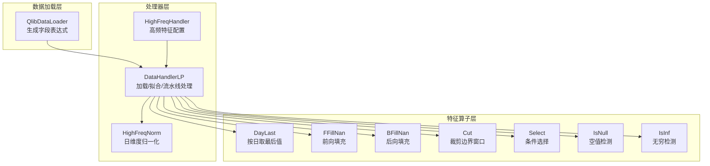
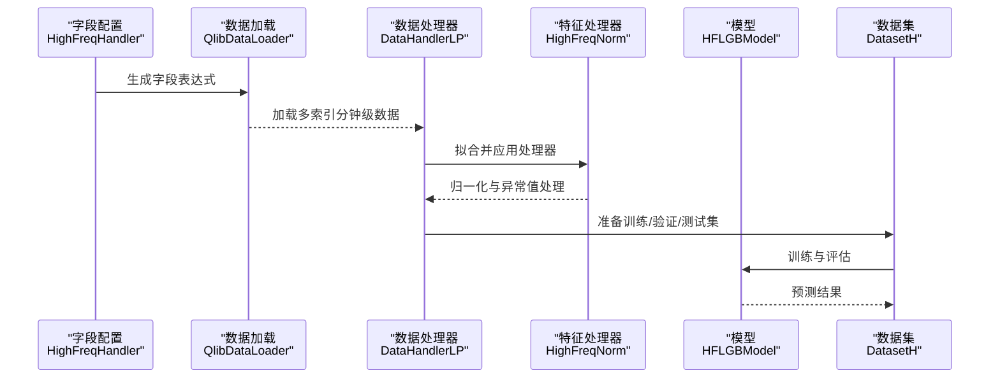
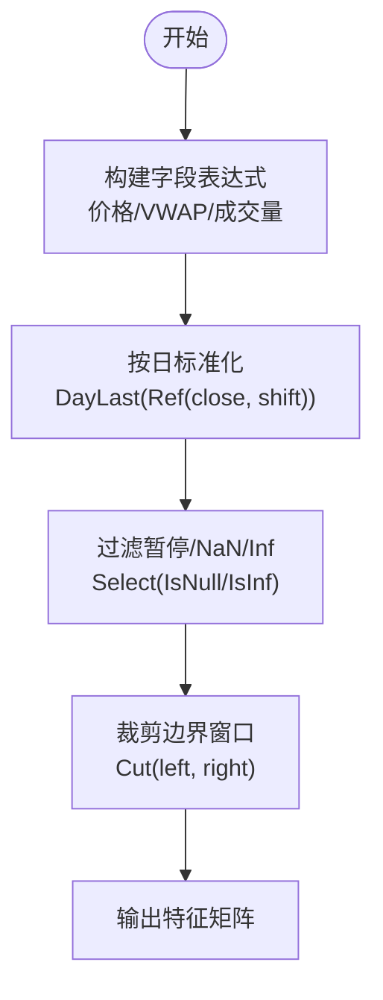
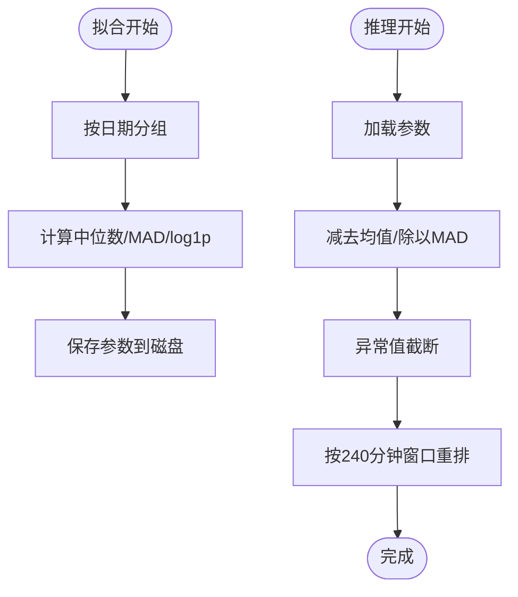
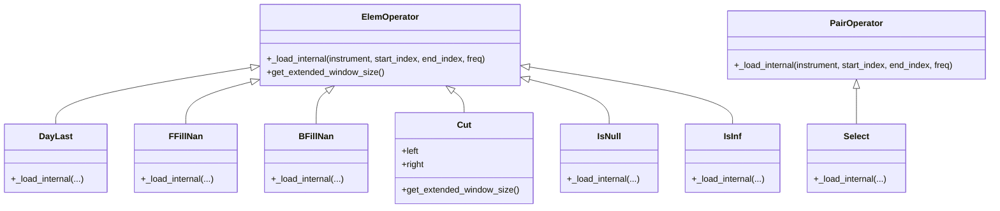
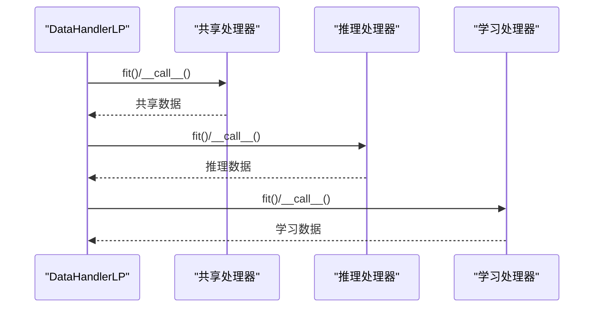
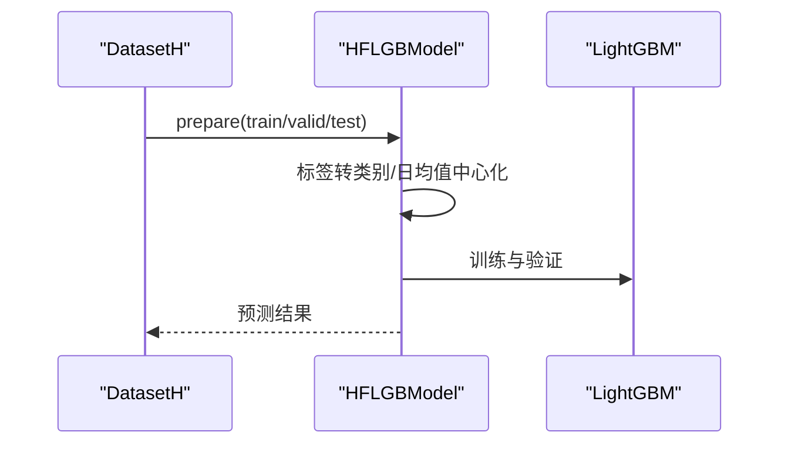
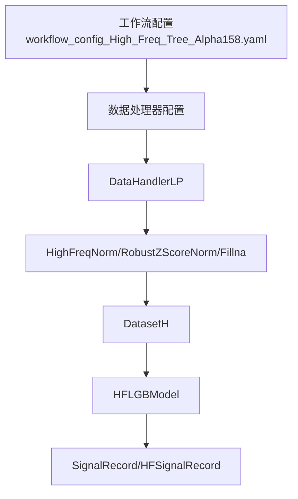
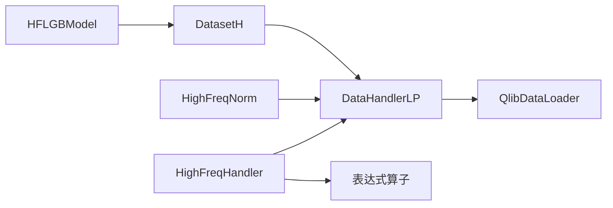

# 高频数据处理

<cite>
**本文引用的文件**
- [highfreq_handler.py](file://qlib/contrib/data/highfreq_handler.py)
- [highfreq_processor.py](file://qlib/contrib/data/highfreq_processor.py)
- [highfreq_ops.py](file://qlib/contrib/ops/high_freq.py)
- [handler.py](file://qlib/contrib/data/handler.py)
- [loader.py](file://qlib/contrib/data/loader.py)
- [handler.py](file://qlib/data/dataset/handler.py)
- [highfreq_gdbt_model.py](file://qlib/contrib/model/highfreq_gdbt_model.py)
- [workflow_config_High_Freq_Tree_Alpha158.yaml](file://examples/highfreq/workflow_config_High_Freq_Tree_Alpha158.yaml)
- [highfreq_handler.py](file://examples/highfreq/highfreq_handler.py)
- [highfreq_processor.py](file://examples/highfreq/highfreq_processor.py)
- [highfreq_ops.py](file://examples/highfreq/highfreq_ops.py)
</cite>

## 目录
1. [引言](#引言)
2. [项目结构](#项目结构)
3. [核心组件](#核心组件)
4. [架构总览](#架构总览)
5. [详细组件分析](#详细组件分析)
6. [依赖关系分析](#依赖关系分析)
7. [性能考量](#性能考量)
8. [故障排查指南](#故障排查指南)
9. [结论](#结论)
10. [附录](#附录)

## 引言
本文件系统性解析 qlib 对高频交易数据的支持机制，重点围绕 HighFreqHandler 类如何处理 tick 级或分钟级数据的时间序列对齐与特征工程，涵盖以下关键主题：
- 时间序列对齐：通过日历分组与窗口扩展，确保跨交易日的特征对齐与滑动窗口一致。
- 高频特征预处理：成交量加权平均价（VWAP）近似与计算、买卖盘口特征提取、微结构噪声过滤（NaN/Inf/暂停交易标记）。
- 采样策略：固定间隔采样（按分钟频率）与事件驱动采样（通过日累计/日最后等算子实现）的差异与适用场景。
- 工作流配置示例：从原始订单簿数据到特征向量的完整转换流程，以及高频特征在预测短期价格变动中的应用思路。

## 项目结构
高频数据处理涉及三层：
- 数据加载层：由 QlibDataLoader 驱动，按配置生成字段表达式并加载多索引时间序列数据。
- 处理器层：DataHandlerLP 负责加载、拟合与流水线化处理，支持学习阶段与推理阶段不同的处理器集合。
- 特征算子层：DayLast、FFillNan、BFillNan、Cut、Select、IsNull、IsInf 等表达式算子，支撑时间对齐与清洗。

图表来源
- [highfreq_handler.py](file://qlib/contrib/data/highfreq_handler.py#L1-L120)
- [highfreq_processor.py](file://qlib/contrib/data/highfreq_processor.py#L1-L81)
- [highfreq_ops.py](file://qlib/contrib/ops/high_freq.py#L1-L120)
- [handler.py](file://qlib/data/dataset/handler.py#L383-L787)

章节来源
- [highfreq_handler.py](file://qlib/contrib/data/highfreq_handler.py#L1-L120)
- [handler.py](file://qlib/data/dataset/handler.py#L383-L787)

## 核心组件
- HighFreqHandler：定义高频特征表达式，包含价格标准化、VWAP、成交量等，并通过 DataHandlerLP 统一加载与处理。
- HighFreqNorm：对价格与成交量进行日维度中位数与MAD缩放，同时对异常值进行截断，适配RL高频执行器的输入格式。
- DayLast/FFillNan/BFillNan/Cut/Select/IsNull/IsInf：表达式算子，用于按日对齐、缺失值填充、边界裁剪与条件选择。
- DataHandlerLP：统一的数据加载、拟合与流水线处理框架，支持学习与推理阶段的差异化处理器。
- HFLGBModel：针对高频信号的LightGBM模型，支持二分类目标与日级别信号度量。

章节来源
- [highfreq_handler.py](file://qlib/contrib/data/highfreq_handler.py#L1-L120)
- [highfreq_processor.py](file://qlib/contrib/data/highfreq_processor.py#L1-L81)
- [highfreq_ops.py](file://qlib/contrib/ops/high_freq.py#L1-L120)
- [handler.py](file://qlib/data/dataset/handler.py#L383-L787)
- [highfreq_gdbt_model.py](file://qlib/contrib/model/highfreq_gdbt_model.py#L1-L172)

## 架构总览
高频数据处理的端到端流程如下：
- 字段配置：HighFreqHandler 生成字段表达式（价格、VWAP、成交量），并按日标准化与裁剪。
- 数据加载：QlibDataLoader 按分钟频率加载多索引数据（datetime, instrument）。
- 处理流水线：DataHandlerLP 拟合并应用处理器（如 HighFreqNorm），完成缺失值、异常值与噪声过滤。
- 模型训练：HFLGBModel 使用 DatasetH 准备训练/验证集，进行二分类或回归训练。
- 信号测试：hf_signal_test 在测试集上按日计算正负精度与平均alpha，评估短期预测能力。

图表来源
- [highfreq_handler.py](file://qlib/contrib/data/highfreq_handler.py#L1-L120)
- [handler.py](file://qlib/data/dataset/handler.py#L383-L787)
- [highfreq_gdbt_model.py](file://qlib/contrib/model/highfreq_gdbt_model.py#L1-L172)

## 详细组件分析

### HighFreqHandler：时间序列对齐与特征表达式
- 日内标准化：通过 DayLast 取昨日收盘作为基准，对当日开盘/最高/最低/收盘/VWAP 进行归一化，避免跳涨停或非交易时段影响。
- 边界裁剪：使用 Cut 对首尾若干分钟窗口进行裁剪，消除开盘/收盘集合竞价与尾盘异常波动。
- 成交量与VWAP：对成交量进行日均窗口平滑后的比值构造，VWAP 采用按日标准化；在示例中提供Simpson近似方法以兼容无VWAP字段的数据源。
- 停牌过滤：通过 Select/IsNull/IsInf/IsInf 等算子剔除暂停交易、NaN、Inf 等异常值，保证特征稳定性。

图表来源
- [highfreq_handler.py](file://qlib/contrib/data/highfreq_handler.py#L41-L101)
- [highfreq_ops.py](file://qlib/contrib/ops/high_freq.py#L102-L120)
- [highfreq_ops.py](file://qlib/contrib/ops/high_freq.py#L241-L278)

章节来源
- [highfreq_handler.py](file://qlib/contrib/data/highfreq_handler.py#L41-L101)
- [highfreq_ops.py](file://qlib/contrib/ops/high_freq.py#L102-L120)
- [highfreq_ops.py](file://qlib/contrib/ops/high_freq.py#L241-L278)

### HighFreqNorm：日维度归一化与异常值截断
- 日维度统计：在拟合阶段按日期分组计算价格/成交量的中位数与MAD（含EPS），并对成交量取log1p稳定分布。
- 推理阶段：使用保存的均值/标准差/极值进行标准化与截断，避免信息泄漏。
- 输出重塑：将多列特征按240分钟窗口重排为长向量，适配RL高频执行器的输入格式。

图表来源
- [highfreq_processor.py](file://qlib/contrib/data/highfreq_processor.py#L1-L81)

章节来源
- [highfreq_processor.py](file://qlib/contrib/data/highfreq_processor.py#L1-L81)

### 表达式算子：时间对齐与清洗
- DayLast：按日分组取最后一个值，常用于日间对齐与基准归一化。
- FFillNan/BFillNan：前向/后向填充缺失值，减少插值带来的偏差。
- Cut：裁剪首尾若干条记录，避免开盘/收盘集合竞价或尾盘异常。
- Select/IsNull/IsInf：条件选择与异常值剔除，提升特征鲁棒性。

图表来源
- [highfreq_ops.py](file://qlib/contrib/ops/high_freq.py#L1-L278)

章节来源
- [highfreq_ops.py](file://qlib/contrib/ops/high_freq.py#L1-L278)

### DataHandlerLP：流水线化处理与时间序列对齐
- 多处理器流水线：支持共享处理器、推理处理器与学习处理器三段式，可独立或追加处理。
- 拟合与处理：先拟合再处理，避免信息泄漏；支持按需丢弃原始数据以节省内存。
- 数据对齐：通过多索引（datetime, instrument）与按日分组操作，确保跨交易日对齐。

图表来源
- [handler.py](file://qlib/data/dataset/handler.py#L438-L787)

章节来源
- [handler.py](file://qlib/data/dataset/handler.py#L438-L787)

### HFLGBModel：高频信号建模与评估
- 目标函数：支持回归（mse）与二分类（binary），二分类时将标签映射为涨跌类别。
- 日级别评估：按日计算正负样本的精度与平均alpha，衡量短期预测信号质量。
- 训练流程：准备训练/验证集，使用EarlyStopping与日志回调，支持微调。

图表来源
- [highfreq_gdbt_model.py](file://qlib/contrib/model/highfreq_gdbt_model.py#L1-L172)

章节来源
- [highfreq_gdbt_model.py](file://qlib/contrib/model/highfreq_gdbt_model.py#L1-L172)

### 示例工作流：从原始订单簿到特征向量
- 数据源：分钟级市场数据（provider_uri 指向本地数据目录）。
- 时间范围：训练/验证/测试按配置切分，fit_start_time/fit_end_time 控制拟合窗口。
- 处理器：推理阶段使用 RobustZScoreNorm 与 Fillna；学习阶段使用 DropnaLabel 与 CSRankNorm。
- 模型：HFLGBModel，二分类目标，使用 DatasetH 组织数据。
- 记录：SignalRecord 与 HFSignalRecord 输出信号与高频信号记录。

图表来源
- [workflow_config_High_Freq_Tree_Alpha158.yaml](file://examples/highfreq/workflow_config_High_Freq_Tree_Alpha158.yaml#L1-L65)
- [highfreq_gdbt_model.py](file://qlib/contrib/model/highfreq_gdbt_model.py#L1-L172)

章节来源
- [workflow_config_High_Freq_Tree_Alpha158.yaml](file://examples/highfreq/workflow_config_High_Freq_Tree_Alpha158.yaml#L1-L65)

## 依赖关系分析
- HighFreqHandler 依赖 DataHandlerLP 与 QlibDataLoader，通过字段表达式生成特征。
- HighFreqNorm 依赖 DataHandlerLP 的流水线机制，在拟合阶段保存参数并在推理阶段加载。
- 表达式算子（DayLast/FFillNan/Cut/Select/IsNull/IsInf）被字段表达式广泛使用，支撑时间对齐与清洗。
- HFLGBModel 依赖 DatasetH 与 DataHandlerLP 的数据键（DK_I/DK_L）组织训练/推理数据。

图表来源
- [highfreq_handler.py](file://qlib/contrib/data/highfreq_handler.py#L1-L120)
- [handler.py](file://qlib/data/dataset/handler.py#L383-L787)
- [highfreq_gdbt_model.py](file://qlib/contrib/model/highfreq_gdbt_model.py#L1-L172)

章节来源
- [highfreq_handler.py](file://qlib/contrib/data/highfreq_handler.py#L1-L120)
- [handler.py](file://qlib/data/dataset/handler.py#L383-L787)
- [highfreq_gdbt_model.py](file://qlib/contrib/model/highfreq_gdbt_model.py#L1-L172)

## 性能考量
- 日历缓存：get_calendar_day 缓存日历数组，避免重复加载导致的性能损耗。
- 分组操作：按日分组（DayLast/DayCumsum）在大数据量下应尽量减少分组键数量，优先使用整点分钟索引。
- 内存优化：DataHandlerLP 支持 drop_raw 丢弃原始数据，降低内存占用；HighFreqNorm 在拟合阶段仅保存必要统计量。
- 并行与批处理：建议在数据加载与特征计算阶段采用批处理与并行策略，减少I/O瓶颈。

## 故障排查指南
- NaN/Inf 导致的异常：使用 IsNull/IsInf 与 Select 过滤异常值；必要时结合 FFillNan/BFillNan 填充。
- 对齐不一致：确认 Cut 的 left/right 参数与交易日长度一致；检查 DayLast 的 shift 是否正确。
- 拟合窗口不匹配：fit_start_time/fit_end_time 与字段表达式中的 Ref/Cut 窗口需一致，避免信息泄漏。
- 模型评估不稳定：检查标签是否按日中心化，以及二分类阈值设置是否合理。

章节来源
- [highfreq_ops.py](file://qlib/contrib/ops/high_freq.py#L1-L278)
- [highfreq_processor.py](file://qlib/contrib/data/highfreq_processor.py#L1-L81)
- [highfreq_gdbt_model.py](file://qlib/contrib/model/highfreq_gdbt_model.py#L1-L172)

## 结论
qlib 的高频数据处理通过“字段表达式 + 表达式算子 + DataHandlerLP 流水线”的组合，实现了分钟级数据的稳健时间序列对齐与特征工程。HighFreqHandler 提供了标准化的价格、VWAP 与成交量特征，并通过 Cut/Select/IsNull/IsInf 等算子进行噪声过滤；HighFreqNorm 则在日维度上完成稳健归一化与异常值截断，适配RL高频执行器输入。配合 HFLGBModel 的日级别信号评估，可在短期价格变动预测中取得良好效果。

## 附录
- 示例工作流配置路径：[workflow_config_High_Freq_Tree_Alpha158.yaml](file://examples/highfreq/workflow_config_High_Freq_Tree_Alpha158.yaml#L1-L65)
- 高频处理器示例：[highfreq_processor.py](file://examples/highfreq/highfreq_processor.py#L1-L77)
- 高频算子示例：[highfreq_ops.py](file://examples/highfreq/highfreq_ops.py#L1-L168)
- 高频处理器（contrib）：[highfreq_processor.py](file://qlib/contrib/data/highfreq_processor.py#L1-L81)
- 高频算子（contrib）：[highfreq_ops.py](file://qlib/contrib/ops/high_freq.py#L1-L278)