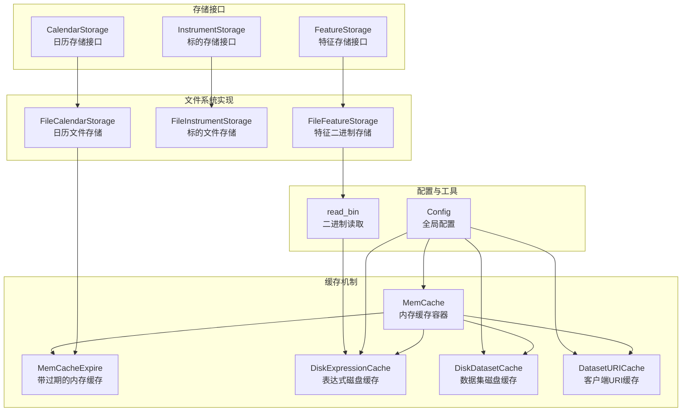
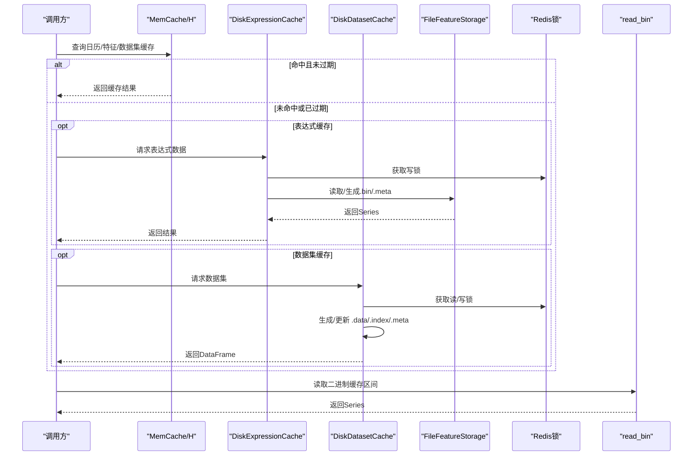
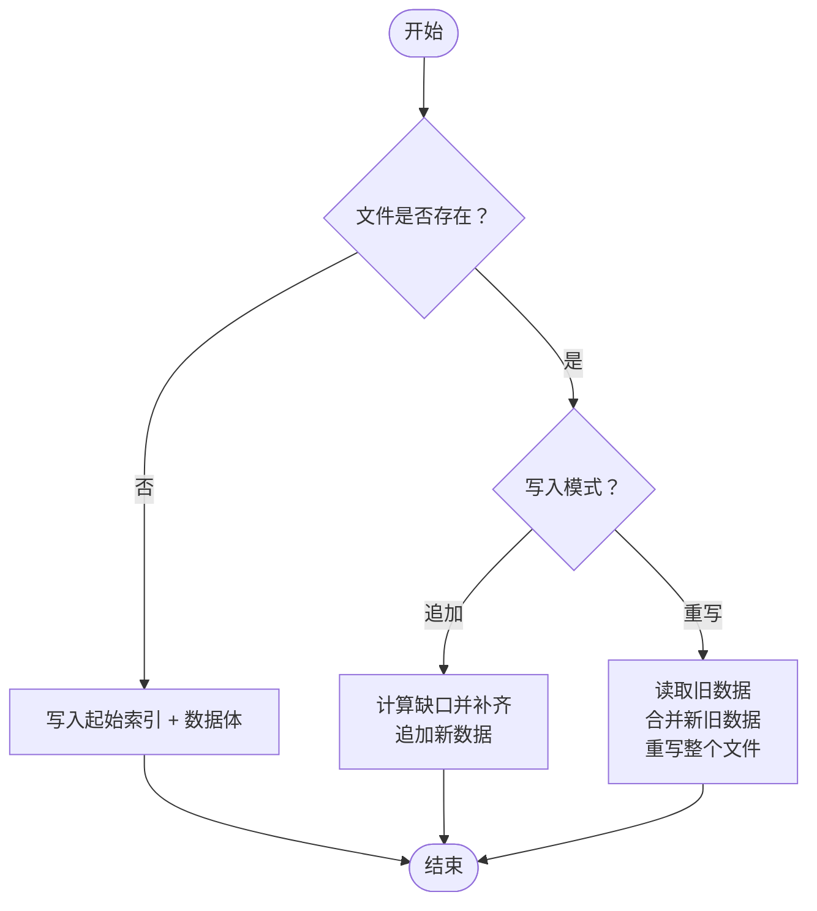
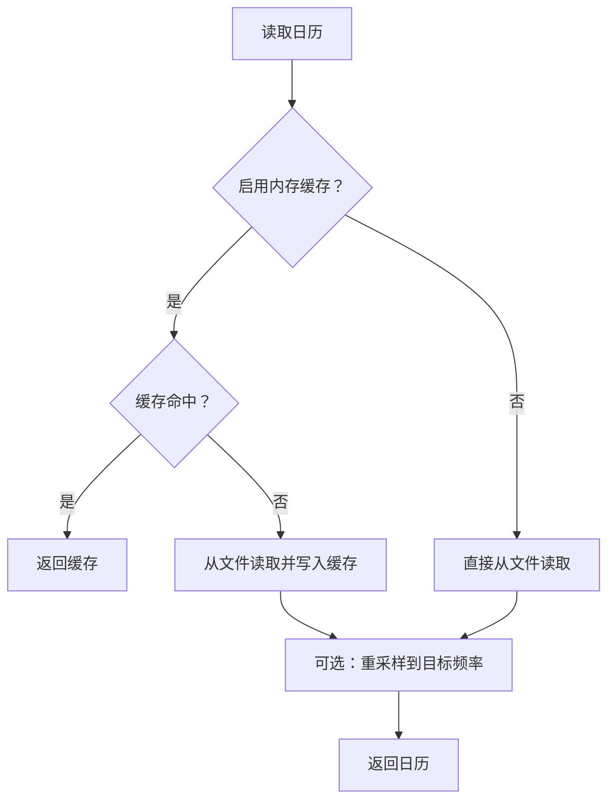
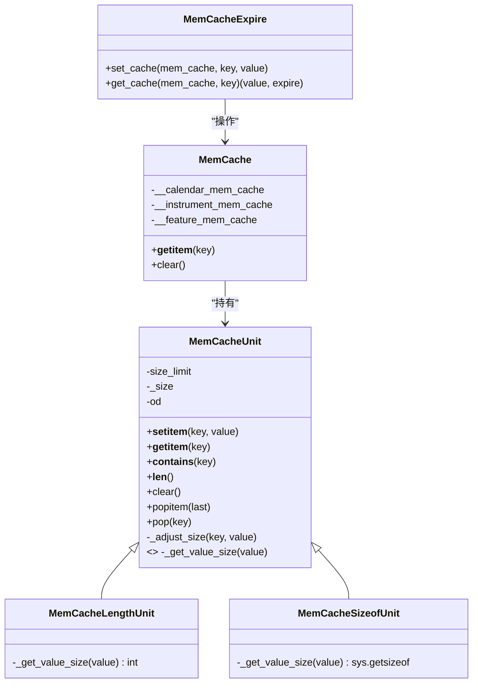
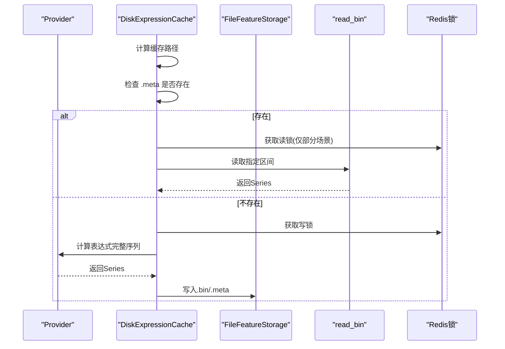
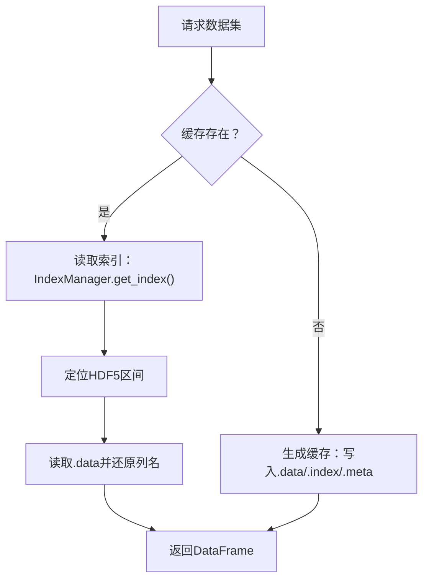
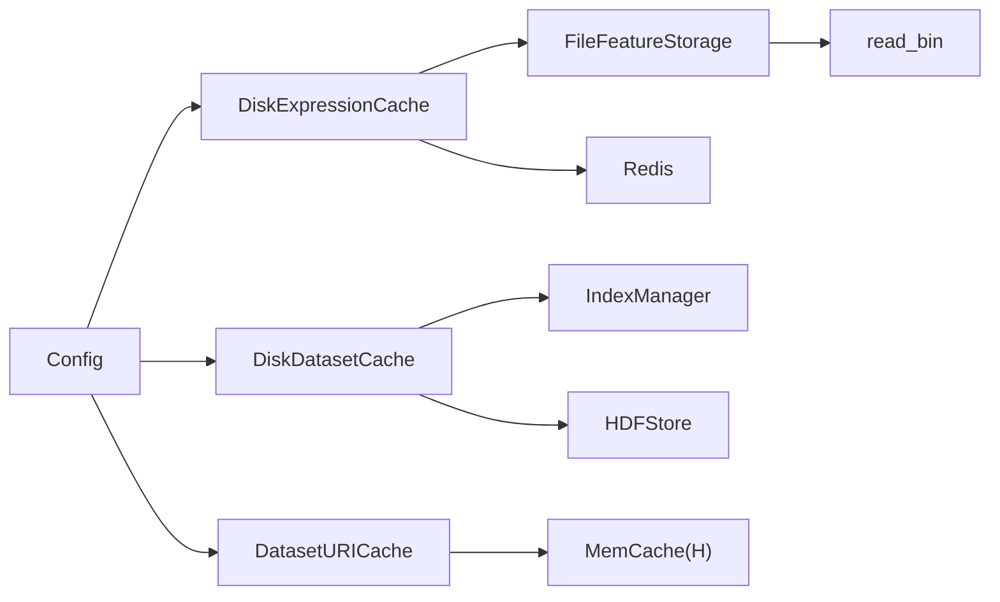

# 数据存储与缓存

<cite>
**本文引用的文件列表**
- [cache.py](file://qlib/data/cache.py)
- [file_storage.py](file://qlib/data/storage/file_storage.py)
- [storage.py](file://qlib/data/storage/storage.py)
- [config.py](file://qlib/config.py)
- [__init__.py](file://qlib/utils/__init__.py)
- [data_cache_demo.py](file://examples/data_demo/data_cache_demo.py)
</cite>

## 目录
1. [简介](#简介)
2. [项目结构](#项目结构)
3. [核心组件](#核心组件)
4. [架构总览](#架构总览)
5. [详细组件分析](#详细组件分析)
6. [依赖关系分析](#依赖关系分析)
7. [性能考量](#性能考量)
8. [故障排查指南](#故障排查指南)
9. [结论](#结论)
10. [附录](#附录)

## 简介
本文件面向量化研究场景，系统性阐述 qlib 的数据存储与缓存体系：基于文件系统的存储后端（file_storage.py）与内存缓存机制（cache.py）。文档重点解释：
- 文件系统存储的序列化格式与索引策略
- 内存缓存的容量限制、LRU 淘汰与过期策略
- 如何通过缓存层加速重复数据访问
- 结合 data_cache_demo.py 展示缓存配置与性能优化技巧
- 缓存失效策略与内存管理最佳实践，支撑大规模量化研究的高效执行

## 项目结构
围绕数据存储与缓存的关键模块如下：
- 存储接口与抽象：storage.py 定义了日历、标的、特征三类存储的统一接口
- 文件系统实现：file_storage.py 基于文本、二进制与 HDF5 实现具体持久化
- 缓存机制：cache.py 提供内存缓存、磁盘表达式缓存、磁盘数据集缓存、客户端 URI 缓存等
- 配置中心：config.py 提供缓存相关的全局配置项
- 工具函数：utils/__init__.py 提供读取二进制缓存等底层工具
- 示例演示：examples/data_demo/data_cache_demo.py 展示如何利用缓存提升训练效率

图表来源
- [storage.py](file://qlib/data/storage/storage.py#L84-L495)
- [file_storage.py](file://qlib/data/storage/file_storage.py#L1-L380)
- [cache.py](file://qlib/data/cache.py#L136-L1199)
- [config.py](file://qlib/config.py#L134-L200)
- [__init__.py](file://qlib/utils/__init__.py#L53-L69)

章节来源
- [storage.py](file://qlib/data/storage/storage.py#L84-L495)
- [file_storage.py](file://qlib/data/storage/file_storage.py#L1-L380)
- [cache.py](file://qlib/data/cache.py#L136-L1199)
- [config.py](file://qlib/config.py#L134-L200)
- [__init__.py](file://qlib/utils/__init__.py#L53-L69)

## 核心组件
- 内存缓存容器与淘汰策略
  - MemCache：按“日历/标的/特征”三类键空间组织，支持长度计数或字节计数两种容量限制方式
  - MemCacheExpire：为缓存值附加时间戳，按全局过期阈值进行判断
- 文件系统存储后端
  - FileCalendarStorage：日历文本文件，支持启用内存缓存读取
  - FileInstrumentStorage：标的区间信息 CSV 文件
  - FileFeatureStorage：特征二进制文件，采用“起始索引 + 浮点数组”的紧凑格式，支持随机访问与追加写入
- 磁盘缓存与索引
  - DiskExpressionCache：表达式缓存（.bin + .meta），使用 Redis 锁保证并发安全
  - DiskDatasetCache：数据集缓存（.data + .index + .meta），HDF5 存储 + 行级索引，支持增量更新
  - DatasetURICache：客户端侧对数据集 URI 的内存缓存，配合服务端磁盘缓存使用
- 配置与工具
  - 全局配置提供缓存大小、过期时间、目录名、默认磁盘缓存开关等
  - read_bin 提供二进制缓存的随机区间读取

章节来源
- [cache.py](file://qlib/data/cache.py#L136-L208)
- [cache.py](file://qlib/data/cache.py#L489-L644)
- [cache.py](file://qlib/data/cache.py#L646-L1061)
- [cache.py](file://qlib/data/cache.py#L1117-L1199)
- [file_storage.py](file://qlib/data/storage/file_storage.py#L132-L191)
- [file_storage.py](file://qlib/data/storage/file_storage.py#L192-L283)
- [file_storage.py](file://qlib/data/storage/file_storage.py#L285-L380)
- [config.py](file://qlib/config.py#L134-L200)
- [__init__.py](file://qlib/utils/__init__.py#L53-L69)

## 架构总览
下图展示从调用方到存储与缓存的整体流程，包括内存缓存命中、磁盘缓存生成与更新、文件系统读写路径。

图表来源
- [cache.py](file://qlib/data/cache.py#L180-L208)
- [cache.py](file://qlib/data/cache.py#L489-L644)
- [cache.py](file://qlib/data/cache.py#L646-L1061)
- [file_storage.py](file://qlib/data/storage/file_storage.py#L285-L380)
- [__init__.py](file://qlib/utils/__init__.py#L53-L69)

## 详细组件分析

### 文件系统存储后端（FileFeatureStorage）
- 序列化格式
  - 起始索引：4 字节小端浮点，记录该文件对应的时间索引起点
  - 数据体：后续连续的 4 字节小端浮点，按时间顺序排列
  - 读取：通过偏移量直接定位区间，避免全量加载
- 随机访问与追加
  - 支持整数索引与切片访问，返回 Series
  - 追加时自动补齐缺失位置；重写时合并旧值与新值
- 目录结构
  - 以“市场/频率”为根，按“标的/字段.频率.bin”组织

图表来源
- [file_storage.py](file://qlib/data/storage/file_storage.py#L285-L380)

章节来源
- [file_storage.py](file://qlib/data/storage/file_storage.py#L285-L380)

### 文件系统存储后端（FileCalendarStorage）
- 文本格式
  - 每行一个日期字符串，按时间顺序存储
  - 支持启用内存缓存读取，减少 IO
- 读取与重采样
  - 若请求频率与文件频率不一致，会根据支持频率进行重采样

图表来源
- [file_storage.py](file://qlib/data/storage/file_storage.py#L132-L191)

章节来源
- [file_storage.py](file://qlib/data/storage/file_storage.py#L132-L191)

### 文件系统存储后端（FileInstrumentStorage）
- CSV 格式
  - 三列：标的、起始时间、结束时间
  - 以标的为键维护区间列表
- 更新与清理
  - 支持增删改查与批量更新

章节来源
- [file_storage.py](file://qlib/data/storage/file_storage.py#L192-L283)

### 内存缓存机制（MemCache 与 MemCacheExpire）
- 容量控制
  - 三种单位：无限制、按元素个数、按对象字节数
  - 使用有序字典维护最近使用顺序，超过上限时淘汰最久未使用项
- 过期策略
  - 为每个缓存值附加时间戳，按全局过期阈值判断是否失效
- 键空间
  - c/i/f 分别对应日历、标的、特征三类缓存

图表来源
- [cache.py](file://qlib/data/cache.py#L43-L118)
- [cache.py](file://qlib/data/cache.py#L120-L135)
- [cache.py](file://qlib/data/cache.py#L136-L179)
- [cache.py](file://qlib/data/cache.py#L180-L208)

章节来源
- [cache.py](file://qlib/data/cache.py#L43-L118)
- [cache.py](file://qlib/data/cache.py#L120-L135)
- [cache.py](file://qlib/data/cache.py#L136-L179)
- [cache.py](file://qlib/data/cache.py#L180-L208)

### 磁盘表达式缓存（DiskExpressionCache）
- 目录与命名
  - 以哈希后的参数作为缓存文件名，按标的子目录组织
- 读取流程
  - 若存在 .meta，则更新访问统计并使用 read_bin 读取指定时间区间的 Series
  - 若不存在，则在写锁保护下生成缓存（.bin + .meta）
- 更新策略
  - 计算新日历窗口，截断旧数据尾部并追加新增数据，同时更新 .meta 中的最后更新时间

图表来源
- [cache.py](file://qlib/data/cache.py#L489-L644)
- [file_storage.py](file://qlib/data/storage/file_storage.py#L285-L380)
- [__init__.py](file://qlib/utils/__init__.py#L53-L69)

章节来源
- [cache.py](file://qlib/data/cache.py#L489-L644)
- [file_storage.py](file://qlib/data/storage/file_storage.py#L285-L380)
- [__init__.py](file://qlib/utils/__init__.py#L53-L69)

### 磁盘数据集缓存（DiskDatasetCache）
- 缓存结构
  - .data：HDF5 文件，按 datetime 排序存储
  - .index：HDF5 文件，记录每条日志对应的起止行号（闭区间起、开区间止）
  - .meta：pickle 序列化的元信息（包含字段、频率、最后更新时间等）
- 读取流程
  - 通过 IndexManager 读取索引，定位 HDF5 区间，再读取数据并还原列名
- 更新流程
  - 计算新旧日历差分，按字段扩展窗口大小决定需要保留的历史期数，删除尾部并追加新区间，同步更新索引与元信息

图表来源
- [cache.py](file://qlib/data/cache.py#L646-L1061)

章节来源
- [cache.py](file://qlib/data/cache.py#L646-L1061)

### 客户端 URI 缓存（DatasetURICache）
- 作用
  - 在客户端缓存数据集 URI，避免重复请求服务端生成缓存
- 交互
  - 当缓存未命中或过期且缓存文件不存在时，请求服务端生成并返回 URI；否则直接从磁盘读取

章节来源
- [cache.py](file://qlib/data/cache.py#L1117-L1199)

### 配置与工具
- 全局配置
  - 缓存大小限制、限制类型、过期时间、默认磁盘缓存开关、缓存目录名、Redis 连接参数等
- 工具函数
  - read_bin：按起始索引与区间读取二进制缓存，支持空区间返回空 Series

章节来源
- [config.py](file://qlib/config.py#L134-L200)
- [__init__.py](file://qlib/utils/__init__.py#L53-L69)

## 依赖关系分析
- 组件耦合
  - FileFeatureStorage 依赖 utils.read_bin 与 config.C
  - DiskExpressionCache 依赖 FileFeatureStorage 与 Redis 锁
  - DiskDatasetCache 依赖 IndexManager 与 HDFStore
  - DatasetURICache 依赖 MemCacheExpire 与 C.dpm
- 外部依赖
  - Redis：用于并发控制与锁管理
  - HDFStore：用于数据集缓存的高效读写
  - numpy/pandas：用于数值与索引处理

图表来源
- [file_storage.py](file://qlib/data/storage/file_storage.py#L285-L380)
- [cache.py](file://qlib/data/cache.py#L489-L1061)
- [config.py](file://qlib/config.py#L134-L200)
- [__init__.py](file://qlib/utils/__init__.py#L53-L69)

章节来源
- [file_storage.py](file://qlib/data/storage/file_storage.py#L285-L380)
- [cache.py](file://qlib/data/cache.py#L489-L1061)
- [config.py](file://qlib/config.py#L134-L200)
- [__init__.py](file://qlib/utils/__init__.py#L53-L69)

## 性能考量
- 内存缓存
  - 合理设置 mem_cache_size_limit 与 mem_cache_limit_type，优先使用“按元素个数”以稳定内存占用
  - 对高频访问的日历与特征开启内存缓存，减少磁盘与网络 IO
- 磁盘缓存
  - 表达式缓存采用二进制格式与索引，读取区间时避免全量加载
  - 数据集缓存使用 HDF5 并建立行级索引，按需读取区间
- 并发与锁
  - 使用 Redis 锁隔离读写冲突，避免竞态条件
  - 读多写少场景建议减少写锁持有时间，尽量批量生成与更新
- 更新策略
  - 表达式缓存与数据集缓存均支持增量更新，减少全量重建成本
  - 更新前先计算扩展窗口，确保未来数据可用性

[本节为通用指导，无需列出具体文件来源]

## 故障排查指南
- 缓存未生效
  - 检查全局配置中的缓存开关与目录名是否正确
  - 确认 MemCacheExpire 的过期时间是否过短导致频繁失效
- 读取异常
  - 表达式缓存读取失败：确认 .meta 是否存在且 .bin 尺寸与起始索引匹配
  - 数据集缓存读取为空：检查索引区间与 HDF5 键是否存在
- 并发问题
  - Redis 锁未释放：使用 CacheUtils.reset_lock 清理残留锁
  - 多进程竞争：确保只在服务端使用写锁，客户端仅读取
- 内存溢出
  - 适当降低 mem_cache_size_limit 或切换为“按字节计数”
  - 清理 H["c"/"i"/"f"] 中不再使用的键

章节来源
- [cache.py](file://qlib/data/cache.py#L210-L292)
- [cache.py](file://qlib/data/cache.py#L180-L208)
- [config.py](file://qlib/config.py#L134-L200)

## 结论
qlib 的数据存储与缓存体系通过“文件系统 + 内存缓存 + 磁盘缓存”的分层设计，在保证数据一致性的同时显著提升了大规模量化研究的执行效率。文件系统采用紧凑的二进制与 HDF5 格式，内存缓存提供 LRU 与过期控制，磁盘缓存则通过索引与增量更新进一步优化读写性能。结合合理的配置与并发控制策略，可在高并发与大数据量场景下保持稳定与高效。

[本节为总结性内容，无需列出具体文件来源]

## 附录

### 缓存配置与性能优化技巧（来自 data_cache_demo.py）
- 利用处理器缓存复用：将 DataHandlerLP 序列化为 pickle 文件，避免重复预处理
- 任务配置切换：通过修改任务配置中的 handler 路径，快速切换是否使用缓存处理器
- 时间对比：通过 TimeInspector 对比启用缓存前后的训练耗时，验证优化效果

章节来源
- [data_cache_demo.py](file://examples/data_demo/data_cache_demo.py#L1-L55)