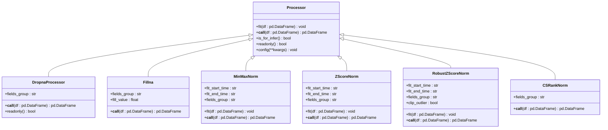

# 数据管理

<cite>
**Referenced Files in This Document**   
- [data.py](file://qlib/data/data.py)
- [base.py](file://qlib/data/base.py)
- [pit.py](file://qlib/data/pit.py)
- [cache.py](file://qlib/data/cache.py)
- [handler.py](file://qlib/data/dataset/handler.py)
- [processor.py](file://qlib/data/dataset/processor.py)
- [loader.py](file://qlib/data/dataset/loader.py)
- [highfreq_handler.py](file://examples/highfreq/highfreq_handler.py)
- [data_cache_demo.py](file://examples/data_demo/data_cache_demo.py)
- [data_mem_resuse_demo.py](file://examples/data_demo/data_mem_resuse_demo.py)
- [collector.py](file://scripts/data_collector/yahoo/collector.py)
- [collector.py](file://scripts/data_collector/baostock_5min/collector.py)
</cite>

## 目录
1. [数据管理框架概述](#数据管理框架概述)
2. [核心组件分析](#核心组件分析)
3. [PIT（Point-in-Time）数据保障机制](#pitpoint-in-time数据保障机制)
4. [高频数据处理模块](#高频数据处理模块)
5. [自定义数据收集器开发指南](#自定义数据收集器开发指南)
6. [数据缓存与内存复用优化](#数据缓存与内存复用优化)
7. [结论](#结论)

## 数据管理框架概述

Qlib的数据管理框架是一个完整的数据生命周期管理系统，涵盖了数据获取、存储、处理和访问的各个环节。该框架通过一系列核心类和模块，为量化研究提供了高效、可靠的数据支持。

框架的核心设计理念是分层架构，将数据管理的不同职责分离到不同的组件中。在最底层是数据提供者（Provider），负责从各种数据源获取原始数据。中间层是数据处理组件，包括处理器（Processor）和数据处理器（DataHandler），负责对原始数据进行清洗、转换和特征工程。最上层是数据访问接口，为用户提供统一的数据访问方式。

整个框架通过配置系统进行灵活的组装和扩展，用户可以根据具体需求选择不同的数据提供者、缓存策略和处理流程。这种设计使得框架既能够支持本地数据处理，也能够支持分布式服务器架构，满足不同规模和复杂度的研究需求。

## 核心组件分析

Qlib的数据管理框架由多个核心组件构成，每个组件都有明确的职责和接口。这些组件协同工作，形成了一个完整的数据处理流水线。

### DataHandler

DataHandler是数据访问的核心组件，它为用户提供了一个统一的接口来访问和操作数据。DataHandler的主要职责是协调数据加载器（DataLoader）和数据处理器（Processor），将原始数据转换为可用于模型训练和预测的格式。

DataHandler的核心功能包括：
- **数据加载**：通过DataLoader从数据源加载原始数据
- **数据处理**：应用一系列处理器对数据进行清洗、标准化和特征工程
- **数据访问**：提供统一的接口供用户查询和获取处理后的数据

DataHandler的设计支持多种数据处理模式，包括学习模式和推理模式，允许用户为不同场景配置不同的处理流程。

**Section sources**
- [handler.py](file://qlib/data/dataset/handler.py#L26-L787)

### Dataset

Dataset组件负责管理数据集的生命周期，包括数据的加载、分割和访问。它与DataHandler紧密协作，为机器学习模型提供训练、验证和测试数据。

Dataset的核心功能体现在其灵活的数据分割机制上，支持按时间、样本或其他维度对数据进行划分。这种设计使得用户可以轻松实现时间序列交叉验证、滚动预测等复杂的实验设计。

此外，Dataset还提供了丰富的数据访问接口，支持批量加载、随机采样等多种数据访问模式，满足不同模型训练的需求。

**Section sources**
- [handler.py](file://qlib/data/dataset/handler.py#L26-L787)
- [loader.py](file://qlib/data/dataset/loader.py#L18-L415)

### Processor

Processor是数据处理的核心单元，负责执行具体的数据转换操作。每个Processor都是一个独立的、可复用的数据处理模块，实现了单一职责原则。

Processor的主要类型包括：
- **数据清洗处理器**：如DropnaProcessor、Fillna等，负责处理缺失值和异常值
- **标准化处理器**：如MinMaxNorm、ZScoreNorm等，负责数据的标准化和归一化
- **特征工程处理器**：如CSRankNorm、RobustZScoreNorm等，负责生成新的特征

Processor的设计支持链式调用，多个处理器可以按顺序组合成复杂的数据处理流水线。这种设计使得数据处理流程既灵活又易于维护。



**Diagram sources **
- [processor.py](file://qlib/data/dataset/processor.py#L35-L420)

**Section sources**
- [processor.py](file://qlib/data/dataset/processor.py#L35-L420)

## PIT（Point-in-Time）数据保障机制

PIT（Point-in-Time）数据保障机制是Qlib框架中防止未来数据泄露的关键技术。该机制确保在任何时间点查询数据时，只能访问到该时间点之前已经公开的数据，从而保证了回测和预测结果的真实性和可靠性。

### 实现原理

PIT机制的实现基于两个核心概念：观察时间（observe_time）和周期时间（period_time）。观察时间是指数据被查询的时间点，而周期时间是指数据所代表的业务周期（如季度、年度等）。

当查询某个时间点的财务数据时，PIT机制会：
1. 确定该时间点之前所有可能的周期
2. 查询这些周期对应的数据
3. 根据数据的发布时间，确定在该时间点实际可获得的数据
4. 返回正确的数据值

这种机制有效地模拟了真实世界中信息逐步披露的过程，避免了使用未来信息的问题。


**Diagram sources **
- [pit.py](file://qlib/data/pit.py#L1-L72)
- [data.py](file://qlib/data/data.py#L338-L386)

### 防止未来数据泄露

PIT机制在防止未来数据泄露方面发挥着至关重要的作用。在量化研究中，使用未来信息会导致过于乐观的回测结果，从而误导投资决策。

PIT机制通过以下方式防止未来数据泄露：
- **时间一致性检查**：确保查询时间与数据发布时间的一致性
- **数据可见性控制**：根据数据的发布时间控制其可见性
- **历史状态重建**：重建任意时间点的数据可见状态

这种机制使得Qlib能够准确模拟真实交易环境，为用户提供可靠的回测结果。

**Section sources**
- [pit.py](file://qlib/data/pit.py#L1-L72)
- [data.py](file://qlib/data/data.py#L338-L386)

## 高频数据处理模块

Qlib的高频数据处理模块（highfreq_handler.py）针对高频交易数据的特点进行了特殊设计，解决了高频数据处理中的诸多挑战。

### 特殊设计

高频数据处理模块的主要特殊设计包括：

1. **数据标准化**：针对高频数据的特点，实现了专门的标准化方法，如使用前一天收盘价作为基准进行价格归一化。

2. **异常值处理**：高频数据中常出现异常值，模块实现了多种异常值检测和处理方法，如使用Simpson积分法近似计算VWAP。

3. **数据填充**：针对高频数据中常见的缺失值问题，实现了前向填充和后向填充相结合的策略。

4. **交易时段处理**：准确处理不同市场的交易时段，如中国股市的上午和下午交易时段。


**Diagram sources **
- [highfreq_handler.py](file://examples/highfreq/highfreq_handler.py#L1-L159)

### 处理流程

高频数据处理模块的处理流程如下：

1. **数据获取**：从数据源获取原始高频数据
2. **数据清洗**：去除无效数据和异常值
3. **数据标准化**：将价格和成交量等数据进行标准化处理
4. **特征生成**：基于标准化后的数据生成各种技术指标
5. **数据输出**：将处理后的数据提供给模型使用

这种流程设计确保了高频数据的质量和一致性，为高频交易策略的开发提供了可靠的数据基础。

**Section sources**
- [highfreq_handler.py](file://examples/highfreq/highfreq_handler.py#L1-L159)

## 自定义数据收集器开发指南

Qlib框架支持开发自定义数据收集器，用户可以根据需要从各种数据源收集数据。以下是开发自定义数据收集器的指南。

### 开发步骤

开发自定义数据收集器的主要步骤包括：

1. **继承基础收集器类**：从BaseCollector类继承，实现基本的数据收集功能。
2. **实现数据获取方法**：重写get_data方法，实现从特定数据源获取数据的逻辑。
3. **实现数据标准化方法**：重写normalize方法，将原始数据转换为Qlib标准格式。
4. **配置运行参数**：通过Run类配置数据收集的参数，如时间范围、频率等。

### 示例：Yahoo数据收集器

以Yahoo数据收集器为例，其开发过程如下：

```python
class YahooCollector(BaseCollector):
    def get_data(self, symbol, interval, start_datetime, end_datetime):
        # 实现从Yahoo Finance获取数据的逻辑
        pass
        
    def normalize(self, df):
        # 实现数据标准化逻辑
        pass
```

### 示例：Baostock数据收集器

以Baostock数据收集器为例，其开发过程如下：

```python
class BaostockCollectorHS3005min(BaseCollector):
    def get_data(self, symbol, interval, start_datetime, end_datetime):
        # 实现从Baostock获取数据的逻辑
        pass
        
    def normalize(self, df):
        # 实现数据标准化逻辑
        pass
```

通过这些步骤，用户可以轻松开发出适合自己需求的数据收集器，扩展Qlib的数据源支持。

**Section sources**
- [collector.py](file://scripts/data_collector/yahoo/collector.py#L48-L800)
- [collector.py](file://scripts/data_collector/baostock_5min/collector.py#L26-L329)

## 数据缓存与内存复用优化

Qlib框架提供了强大的数据缓存和内存复用优化技术，显著提高了数据处理的效率。

### 数据缓存技术

Qlib的数据缓存技术主要包括：

1. **表达式缓存**：通过ExpressionCache类缓存表达式计算结果，避免重复计算。
2. **数据集缓存**：通过DatasetCache类缓存数据集，避免重复加载和处理。
3. **磁盘缓存**：通过DiskExpressionCache和DiskDatasetCache类将缓存数据持久化到磁盘。

这些缓存技术通过减少重复的数据加载和处理操作，显著提高了数据访问的效率。

### 内存复用优化

内存复用优化技术通过以下方式提高效率：

1. **序列化处理**：将处理后的数据处理器（DataHandler）序列化保存，避免重复的数据处理过程。
2. **内存共享**：在多个任务之间共享已处理的数据，避免重复的内存占用。
3. **缓存策略**：通过配置不同的缓存策略，优化内存使用效率。


**Diagram sources **
- [data_cache_demo.py](file://examples/data_demo/data_cache_demo.py#L1-L55)
- [data_mem_resuse_demo.py](file://examples/data_demo/data_mem_resuse_demo.py#L1-L60)

### 性能对比

通过数据缓存和内存复用优化，可以显著提高数据处理的性能。以LightGBM模型训练为例：

- **无缓存**：每次都需要重新加载和处理数据
- **有缓存**：可以直接使用已处理的数据，节省大量时间

这种优化对于需要频繁运行的实验和模型调优尤其重要。

**Section sources**
- [data_cache_demo.py](file://examples/data_demo/data_cache_demo.py#L1-L55)
- [data_mem_resuse_demo.py](file://examples/data_demo/data_mem_resuse_demo.py#L1-L60)

## 结论

Qlib的数据管理框架通过精心设计的组件和机制，为量化研究提供了强大而灵活的数据支持。框架的核心优势在于其模块化的设计，使得各个组件可以独立开发和优化，同时又能无缝集成。

PIT机制有效地解决了未来数据泄露的问题，确保了研究结果的可靠性。高频数据处理模块针对高频交易的特点进行了专门优化，为高频策略的开发提供了坚实的基础。

自定义数据收集器的支持使得框架能够适应各种数据源，而数据缓存和内存复用优化技术则显著提高了数据处理的效率。这些特性共同构成了一个完整、高效的数据管理解决方案，为量化研究提供了强有力的支持。