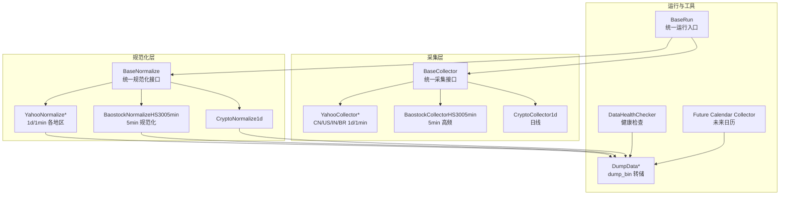
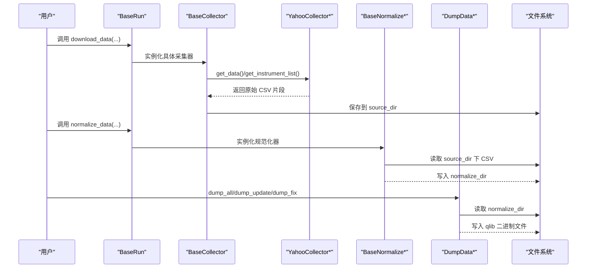
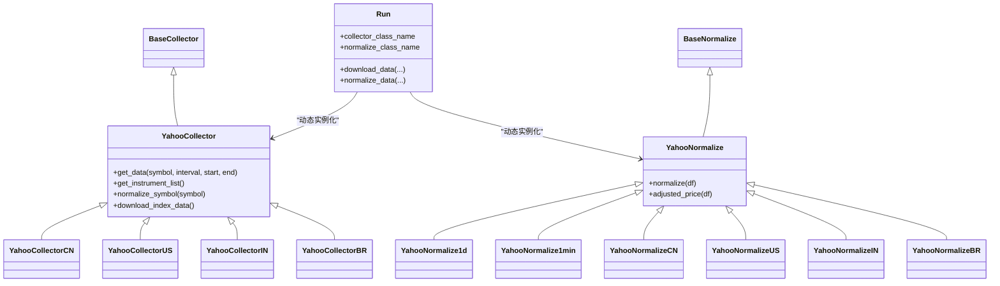
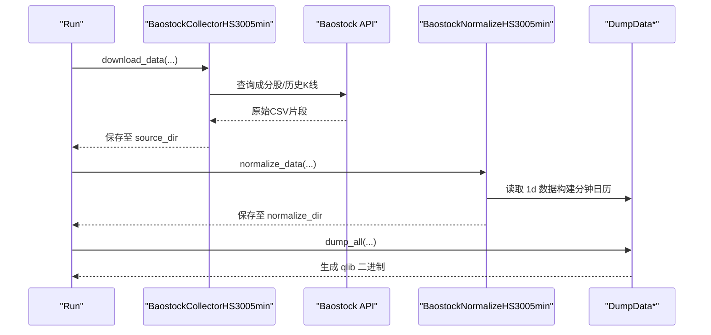
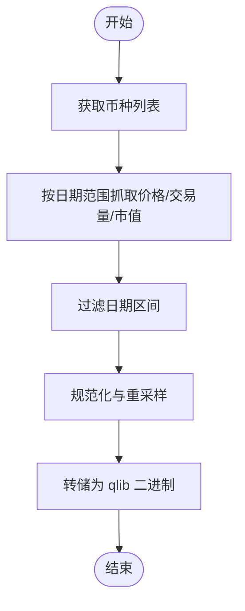
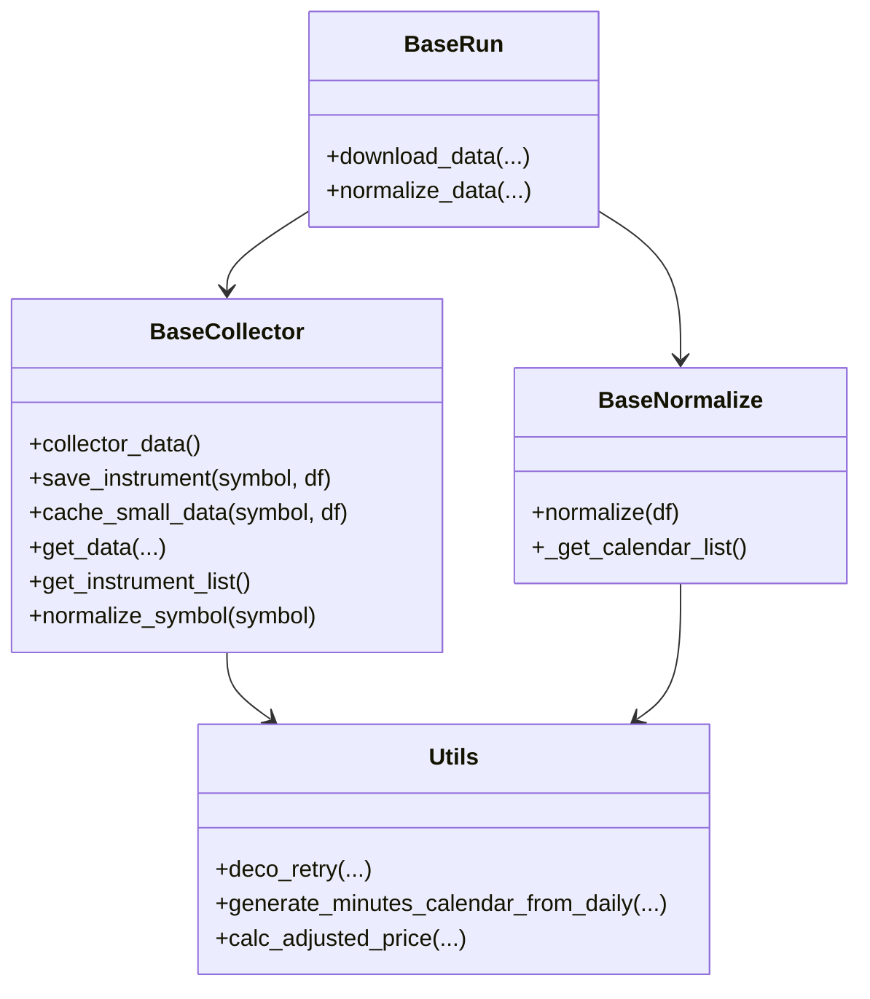
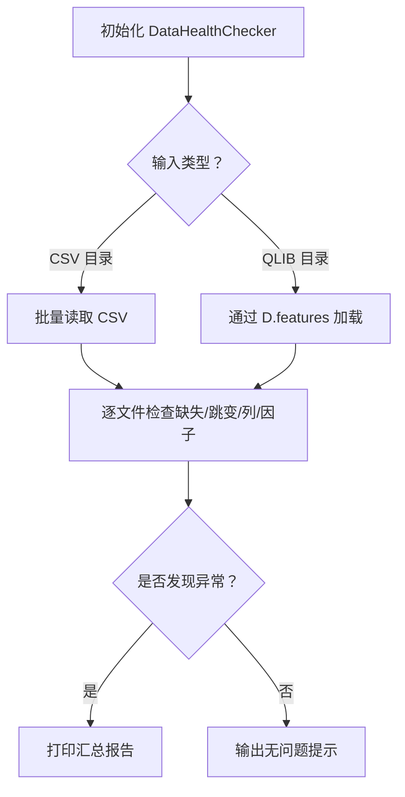
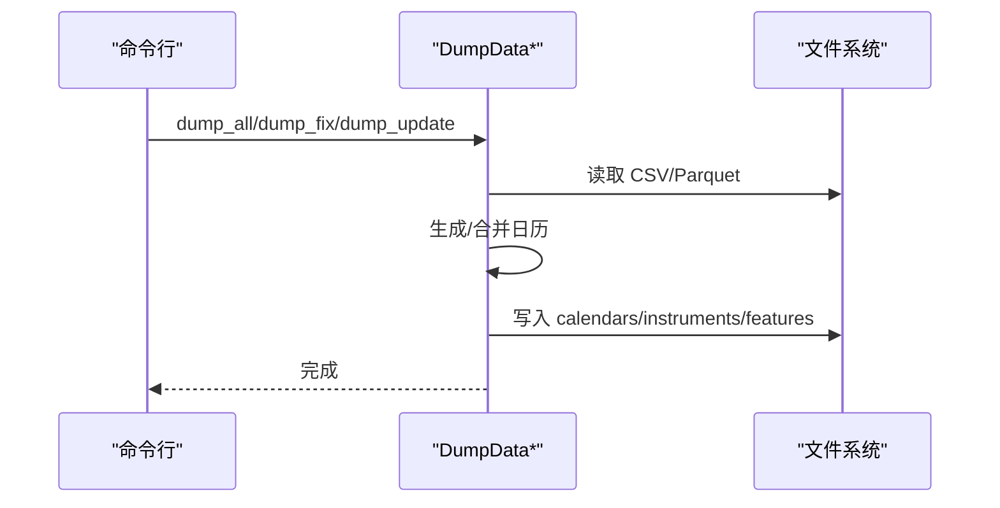
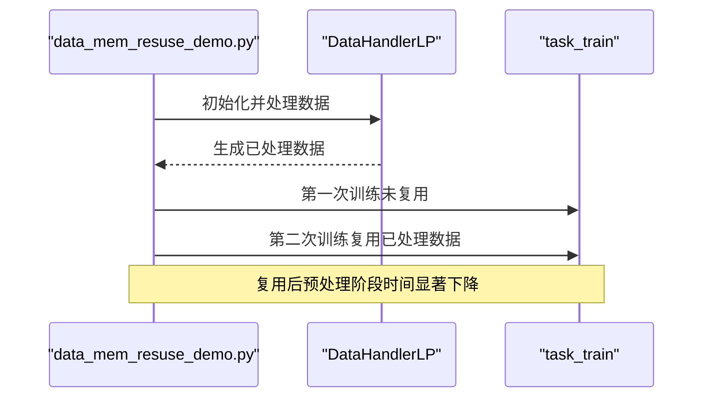
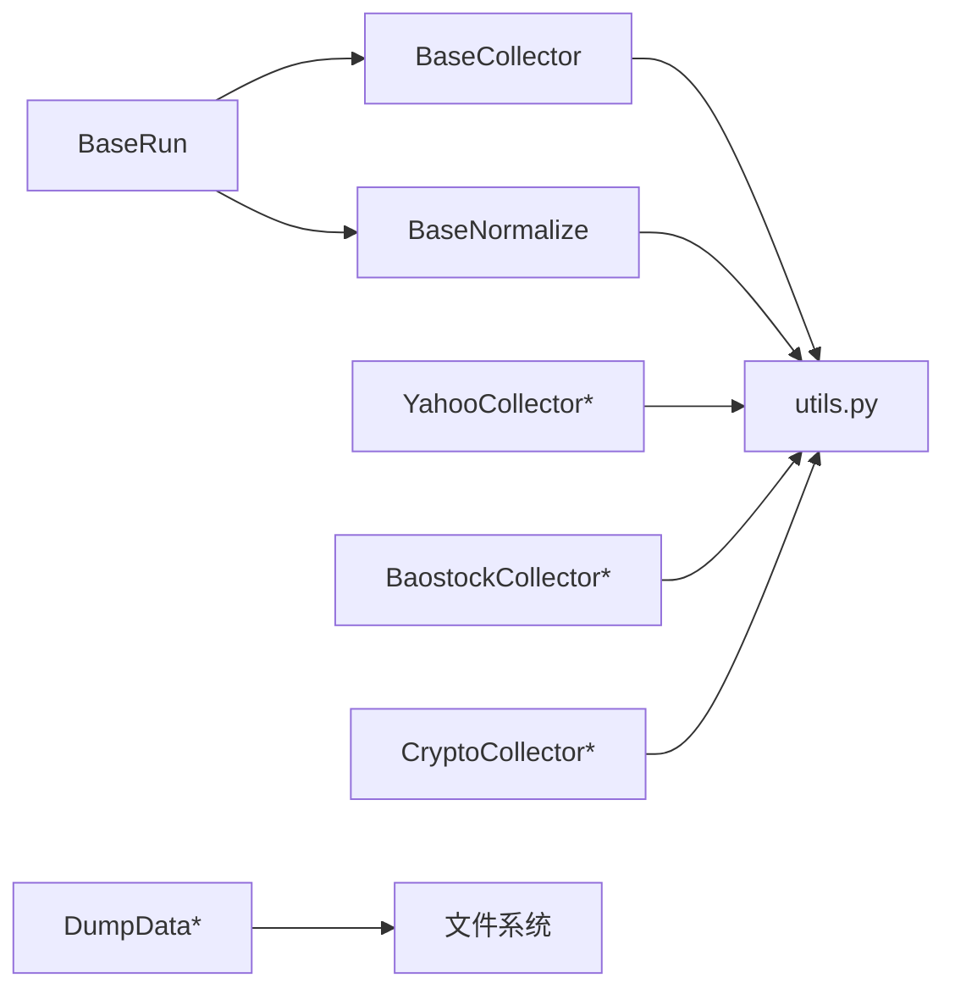

# 数据获取与集成

<cite>
**本文引用的文件**
- [scripts/data_collector/base.py](file://scripts/data_collector/base.py)
- [scripts/data_collector/yahoo/collector.py](file://scripts/data_collector/yahoo/collector.py)
- [scripts/data_collector/baostock_5min/collector.py](file://scripts/data_collector/baostock_5min/collector.py)
- [scripts/data_collector/crypto/collector.py](file://scripts/data_collector/crypto/collector.py)
- [scripts/data_collector/utils.py](file://scripts/data_collector/utils.py)
- [scripts/data_collector/index.py](file://scripts/data_collector/index.py)
- [scripts/data_collector/future_calendar_collector.py](file://scripts/data_collector/future_calendar_collector.py)
- [scripts/check_data_health.py](file://scripts/check_data_health.py)
- [scripts/dump_bin.py](file://scripts/dump_bin.py)
- [examples/data_demo/data_mem_resuse_demo.py](file://examples/data_demo/data_mem_resuse_demo.py)
</cite>

## 目录
1. [简介](#简介)
2. [项目结构](#项目结构)
3. [核心组件](#核心组件)
4. [架构总览](#架构总览)
5. [详细组件分析](#详细组件分析)
6. [依赖关系分析](#依赖关系分析)
7. [性能考量](#性能考量)
8. [故障排查指南](#故障排查指南)
9. [结论](#结论)
10. [附录](#附录)

## 简介
本章节系统性阐述 qlib 的数据获取与集成能力，重点覆盖以下方面：
- 多数据源接入：Yahoo Finance、Baostock、Crypto 等收集器的实现机制与差异
- 收集器通用架构与扩展方法：基于统一基类的采集流程、规范化与批处理策略
- 工具链使用：数据健康检查、数据转储（bin）流程
- 最佳实践：通过内存复用减少重复预处理开销，提升大规模数据处理效率

## 项目结构
围绕“数据采集—规范化—转储—使用”的主干流程，主要目录与文件如下：
- scripts/data_collector/base.py：定义 BaseCollector、BaseNormalize、BaseRun 三大抽象基类，提供统一的采集、规范化与运行框架
- scripts/data_collector/yahoo/collector.py：Yahoo Finance 多地区（CN/US/IN/BR）多频（1d/1min）采集器与规范化器
- scripts/data_collector/baostock_5min/collector.py：沪深300 5 分钟高频数据采集器与规范化器
- scripts/data_collector/crypto/collector.py：加密货币（Coingecko）日线数据采集器与规范化器
- scripts/data_collector/utils.py：采集工具函数（符号池、日历、重试装饰器、分钟级日历生成、因子调整等）
- scripts/data_collector/index.py：指数成分解析与仪器表生成的基类
- scripts/data_collector/future_calendar_collector.py：未来交易日历采集器（基于 Baostock）
- scripts/check_data_health.py：数据健康检查工具（缺失值、异常跳变、列完整性、因子缺失）
- scripts/dump_bin.py：将 CSV 规范化结果转储为 qlib 二进制格式（全量/增量/修复模式）
- examples/data_demo/data_mem_resuse_demo.py：演示数据处理器在内存中的复用，避免重复预处理

图表来源
- [scripts/data_collector/base.py](file://scripts/data_collector/base.py#L1-L440)
- [scripts/data_collector/yahoo/collector.py](file://scripts/data_collector/yahoo/collector.py#L1-L800)
- [scripts/data_collector/baostock_5min/collector.py](file://scripts/data_collector/baostock_5min/collector.py#L1-L329)
- [scripts/data_collector/crypto/collector.py](file://scripts/data_collector/crypto/collector.py#L1-L311)
- [scripts/dump_bin.py](file://scripts/dump_bin.py#L1-L543)
- [scripts/check_data_health.py](file://scripts/check_data_health.py#L1-L204)
- [scripts/data_collector/future_calendar_collector.py](file://scripts/data_collector/future_calendar_collector.py#L1-L122)

章节来源
- [scripts/data_collector/base.py](file://scripts/data_collector/base.py#L1-L440)
- [scripts/data_collector/yahoo/collector.py](file://scripts/data_collector/yahoo/collector.py#L1-L800)
- [scripts/data_collector/baostock_5min/collector.py](file://scripts/data_collector/baostock_5min/collector.py#L1-L329)
- [scripts/data_collector/crypto/collector.py](file://scripts/data_collector/crypto/collector.py#L1-L311)
- [scripts/dump_bin.py](file://scripts/dump_bin.py#L1-L543)
- [scripts/check_data_health.py](file://scripts/check_data_health.py#L1-L204)
- [scripts/data_collector/future_calendar_collector.py](file://scripts/data_collector/future_calendar_collector.py#L1-L122)

## 核心组件
- BaseCollector：定义采集生命周期（时间窗口、并发、重试、缓存小样本、保存）、统一 get_data 接口与保存逻辑
- BaseNormalize：定义规范化接口 normalize 与基准日历生成，支持按日期字段与符号字段定制
- BaseRun：统一运行入口，动态加载具体采集器与规范化器，封装 download_data/normalize_data 流程
- YahooCollector* / BaostockCollector* / CryptoCollector*：各数据源的具体实现，覆盖符号池、时区转换、分段请求、规范化策略
- DumpData*：将规范化后的 CSV 转储为 qlib 二进制格式，支持全量、修复与增量更新
- DataHealthChecker：对 CSV 或 qlib 目录进行数据完整性与质量检查
- Future Calendar Collector：基于 Baostock 采集未来交易日历

章节来源
- [scripts/data_collector/base.py](file://scripts/data_collector/base.py#L1-L440)
- [scripts/data_collector/yahoo/collector.py](file://scripts/data_collector/yahoo/collector.py#L1-L800)
- [scripts/data_collector/baostock_5min/collector.py](file://scripts/data_collector/baostock_5min/collector.py#L1-L329)
- [scripts/data_collector/crypto/collector.py](file://scripts/data_collector/crypto/collector.py#L1-L311)
- [scripts/dump_bin.py](file://scripts/dump_bin.py#L1-L543)
- [scripts/check_data_health.py](file://scripts/check_data_health.py#L1-L204)
- [scripts/data_collector/future_calendar_collector.py](file://scripts/data_collector/future_calendar_collector.py#L1-L122)

## 架构总览
下图展示了从采集到转储的整体流程，以及关键组件之间的调用关系。

图表来源
- [scripts/data_collector/base.py](file://scripts/data_collector/base.py#L322-L440)
- [scripts/data_collector/yahoo/collector.py](file://scripts/data_collector/yahoo/collector.py#L723-L800)
- [scripts/dump_bin.py](file://scripts/dump_bin.py#L305-L543)

## 详细组件分析

### Yahoo Finance 数据收集器（CN/US/IN/BR）
- 统一入口：Run 类根据 region 与 interval 动态选择具体采集器与规范化器
- 符号池与时区：通过工具函数获取各地区股票池；convert_datetime 将本地时间转换为目标时区
- 分段请求：1 分钟数据按周分段拉取，避免单次请求过大
- 规范化策略：
  - 1 日线：使用 adjclose 计算因子并重算 OHLC；支持“扩展规范化”以兼容旧数据
  - 1 分钟：依赖 1 日数据构造分钟级日历，计算暂停标记与因子，重算 OHLC
- 指数数据：CN 地区额外下载基准指数（CSI300/CSI100/CSI500）

图表来源
- [scripts/data_collector/yahoo/collector.py](file://scripts/data_collector/yahoo/collector.py#L1-L800)
- [scripts/data_collector/base.py](file://scripts/data_collector/base.py#L1-L220)

章节来源
- [scripts/data_collector/yahoo/collector.py](file://scripts/data_collector/yahoo/collector.py#L1-L800)
- [scripts/data_collector/utils.py](file://scripts/data_collector/utils.py#L1-L200)

### Baostock 5 分钟高频数据收集器
- 符号池：通过 Baostock 查询沪深300成分股列表
- 日历：基于 Baostock 获取交易日历
- 规范化：构造分钟级日历（9:30-11:29 / 13:00-14:59），使用 1 日数据计算因子与暂停标记
- 依赖：需要先准备 1 日数据（可从 Yahoo 或其他渠道导入）

图表来源
- [scripts/data_collector/baostock_5min/collector.py](file://scripts/data_collector/baostock_5min/collector.py#L1-L329)
- [scripts/dump_bin.py](file://scripts/dump_bin.py#L305-L543)

章节来源
- [scripts/data_collector/baostock_5min/collector.py](file://scripts/data_collector/baostock_5min/collector.py#L1-L329)
- [scripts/data_collector/utils.py](file://scripts/data_collector/utils.py#L595-L628)

### Crypto 加密货币数据收集器
- 符号池：从 Coingecko 获取主流币种 ID 列表
- 规范化：按日重采样与去重，保留价格、成交量、市值等字段
- 限制：当前仅支持 1 日数据，不包含 OHLC，因此不适合回测场景

图表来源
- [scripts/data_collector/crypto/collector.py](file://scripts/data_collector/crypto/collector.py#L1-L311)
- [scripts/dump_bin.py](file://scripts/dump_bin.py#L305-L543)

章节来源
- [scripts/data_collector/crypto/collector.py](file://scripts/data_collector/crypto/collector.py#L1-L311)

### 通用采集器架构与扩展方法
- 扩展步骤
  - 新建子类继承 BaseCollector，实现 get_instrument_list/normalize_symbol/get_data
  - 如需规范化，新建子类继承 BaseNormalize，实现 normalize/adjusted_price/_get_calendar_list
  - 在 Run 子类中设置 collector_class_name/normalize_class_name/default_base_dir
  - 可选：在 utils 中补充符号池或日历工具函数
- 并发与重试
  - 使用 Parallel/delayed 进行并行采集
  - deco_retry 装饰器控制网络异常重试
- 缓存与补采
  - check_data_length 用于检测每只股票数据长度不足时的补采与合并

图表来源
- [scripts/data_collector/base.py](file://scripts/data_collector/base.py#L1-L220)
- [scripts/data_collector/utils.py](file://scripts/data_collector/utils.py#L546-L800)

章节来源
- [scripts/data_collector/base.py](file://scripts/data_collector/base.py#L1-L220)
- [scripts/data_collector/utils.py](file://scripts/data_collector/utils.py#L546-L800)

### 数据健康检查（check_data_health.py）
- 支持两种输入：CSV 目录或已初始化的 qlib 目录
- 检查项
  - 缺失数据：统计各列缺失数量
  - 异常跳变：OHLCV 列按阈值检查最大百分比变化
  - 列完整性：确保 open/high/low/close/volume 存在
  - 因子缺失：检查 factor 字段是否存在且非空（指数文件除外）
- 输出：汇总报告，定位问题文件与列

图表来源
- [scripts/check_data_health.py](file://scripts/check_data_health.py#L1-L204)

章节来源
- [scripts/check_data_health.py](file://scripts/check_data_health.py#L1-L204)

### 数据转储（dump_bin.py）
- 三种模式
  - DumpDataAll：全量生成 calendars/instruments/features
  - DumpDataFix：修复模式，仅更新新增股票的时间范围
  - DumpDataUpdate：增量更新，追加新日期并更新 instruments
- 关键流程
  - 读取 CSV/Parquet，提取日期范围与符号
  - 生成/合并日历，按字段写入二进制文件
  - 多进程并行加速
- 参数要点
  - include_fields/exclude_fields 控制导出字段
  - date_field_name/symbol_field_name 定义列名
  - file_suffix 支持 .csv/.parquet

图表来源
- [scripts/dump_bin.py](file://scripts/dump_bin.py#L305-L543)

章节来源
- [scripts/dump_bin.py](file://scripts/dump_bin.py#L1-L543)

### 数据内存复用最佳实践（data_mem_resuse_demo.py）
- 背景：DataHandlerLP 的处理结果可序列化，避免重复预处理
- 步骤
  - 构造 handler 并执行一次训练，记录耗时
  - 将 handler 深拷贝后注入任务配置，再次训练，观察时间显著降低
  - 可替换训练区间等参数，保持 handler 不变，进一步验证复用收益
- 效果：大幅缩短数据加载与预处理时间，适合大规模数据与多次实验

图表来源
- [examples/data_demo/data_mem_resuse_demo.py](file://examples/data_demo/data_mem_resuse_demo.py#L1-L60)

章节来源
- [examples/data_demo/data_mem_resuse_demo.py](file://examples/data_demo/data_mem_resuse_demo.py#L1-L60)

## 依赖关系分析
- 组件耦合
  - BaseRun 通过模块动态导入具体采集器与规范化器，降低耦合度
  - BaseCollector 与 BaseNormalize 通过抽象接口解耦不同数据源
  - 规范化器依赖 utils 提供的日历、重采样与因子调整工具
- 外部依赖
  - Yahoo Finance：yahooquery、requests
  - Baostock：baostock
  - Coingecko：pycoingecko
  - 并行与进度：joblib、tqdm、concurrent.futures
- 循环依赖
  - 采集器与规范化器通过 BaseRun 解耦，未见循环依赖

图表来源
- [scripts/data_collector/base.py](file://scripts/data_collector/base.py#L322-L440)
- [scripts/data_collector/utils.py](file://scripts/data_collector/utils.py#L1-L200)
- [scripts/dump_bin.py](file://scripts/dump_bin.py#L1-L200)

章节来源
- [scripts/data_collector/base.py](file://scripts/data_collector/base.py#L322-L440)
- [scripts/data_collector/utils.py](file://scripts/data_collector/utils.py#L1-L200)
- [scripts/dump_bin.py](file://scripts/dump_bin.py#L1-L200)

## 性能考量
- 并行策略
  - BaseCollector 使用 joblib.Parallel 并行采集，max_workers 控制并发度
  - Normalize 使用 ProcessPoolExecutor 并行规范化
  - dump_bin 使用多进程/线程并行写入
- I/O 优化
  - 优先使用 .parquet 读取（dump_bin 内置支持），减少 CSV 解析开销
  - 通过 include_fields/exclude_fields 精简导出字段
- 数据复用
  - 使用 data_mem_resuse_demo 的方式，将 DataHandlerLP 结果复用，避免重复预处理
- 网络与限流
  - 通过 delay 与 deco_retry 控制请求频率与失败重试，避免被限流或触发风控

[本节为通用建议，无需特定文件引用]

## 故障排查指南
- 采集失败
  - 检查网络与代理（Yahoo Finance 在部分地区受限）
  - 调整 delay 与 max_collector_count，启用 check_data_length 补采
  - 使用 deco_retry 包裹易失败的远程请求
- 规范化异常
  - 确认日期/符号字段名称一致（date_field_name/symbol_field_name）
  - 对于分钟数据，确保 1 日数据完整可用
- 转储错误
  - 确保 normalize_dir 下 CSV 已正确生成
  - 检查 include_fields/exclude_fields 是否导致字段缺失
  - 使用 DumpDataUpdate 进行增量更新，避免全量重建
- 数据质量
  - 使用 DataHealthChecker 检查缺失、异常跳变与因子缺失
  - 对异常文件单独处理后再重新转储

章节来源
- [scripts/check_data_health.py](file://scripts/check_data_health.py#L1-L204)
- [scripts/dump_bin.py](file://scripts/dump_bin.py#L305-L543)
- [scripts/data_collector/utils.py](file://scripts/data_collector/utils.py#L546-L628)

## 结论
qlib 的数据管线以统一的采集与规范化框架为核心，通过 BaseCollector/BaseNormalize/BaseRun 抽象，实现了对 Yahoo Finance、Baostock、Crypto 等多数据源的统一接入。配合 dump_bin 的高效转储与 DataHealthChecker 的质量保障，能够快速构建高质量的 qlib 数据集。同时，通过数据处理器的内存复用，可在大规模数据场景下显著降低预处理成本，提升整体实验效率。

[本节为总结，无需特定文件引用]

## 附录
- 常用命令参考
  - Yahoo 采集与规范化：参见 Yahoo README 中 download_data/normalize_data/dump_all 步骤
  - Baostock 采集与规范化：参见 Baostock README 中 download_data/normalize_data/dump_all 步骤
  - Crypto 采集与规范化：参见 Crypto README 中 download_data/normalize_data/dump_all 步骤
- 参数建议
  - 并发：max_workers 建议根据 CPU 与网络带宽调整
  - 字段：include_fields/exclude_fields 按需裁剪，减少 IO 与存储
  - 时间：合理设置 start/end，避免过长历史导致超时或限流

[本节为概览，无需特定文件引用]