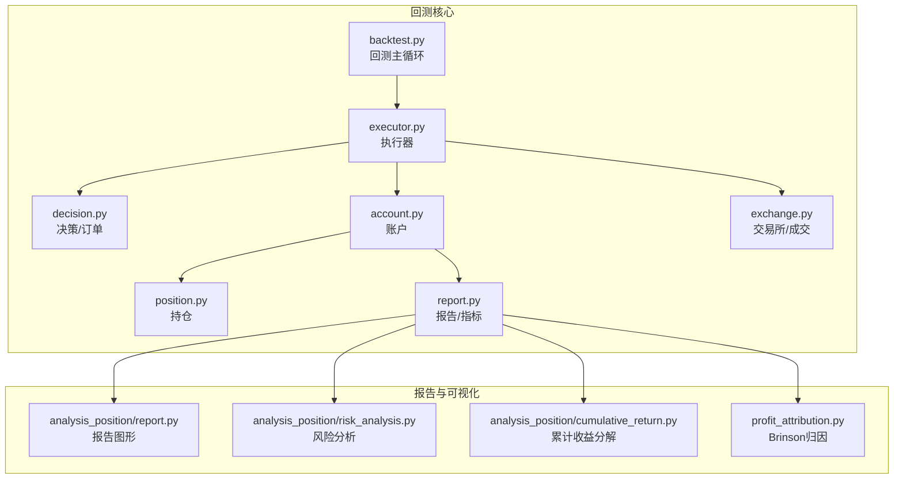
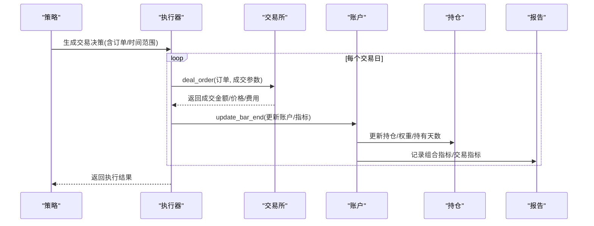
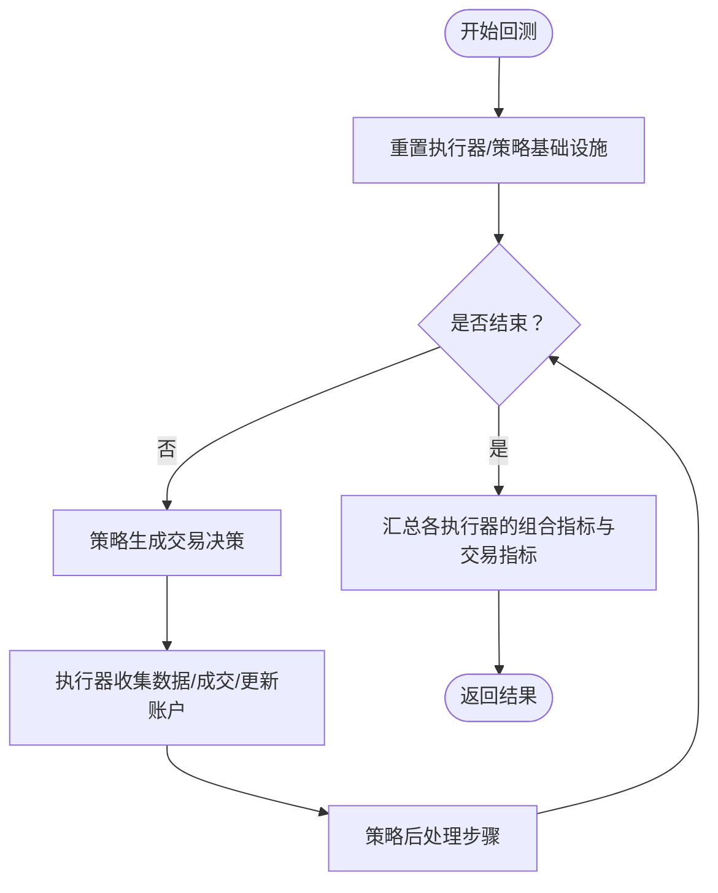
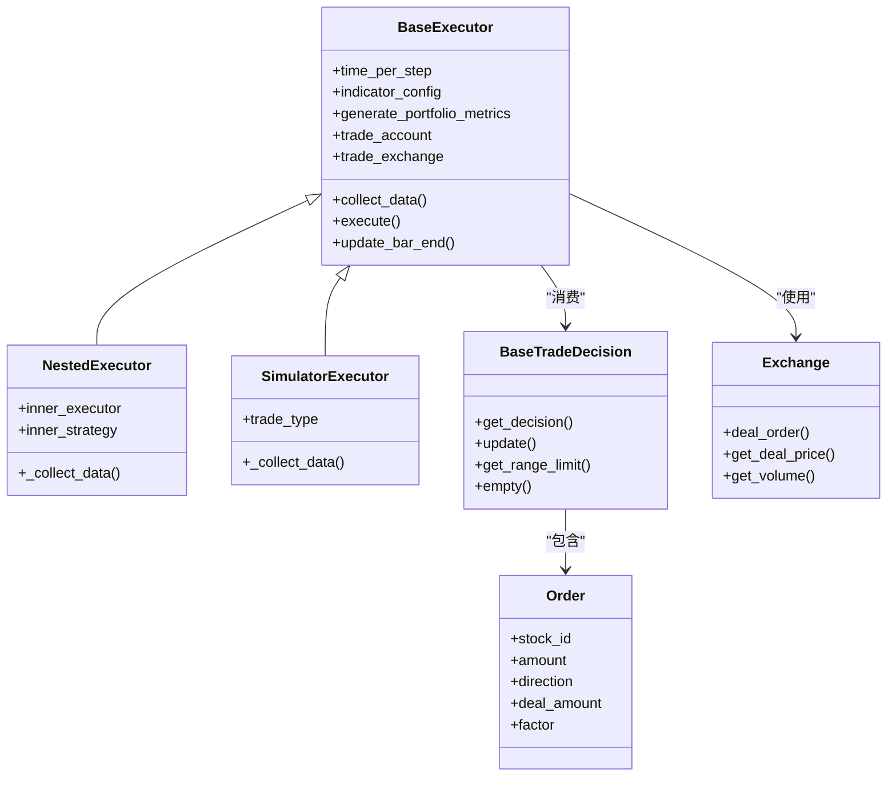
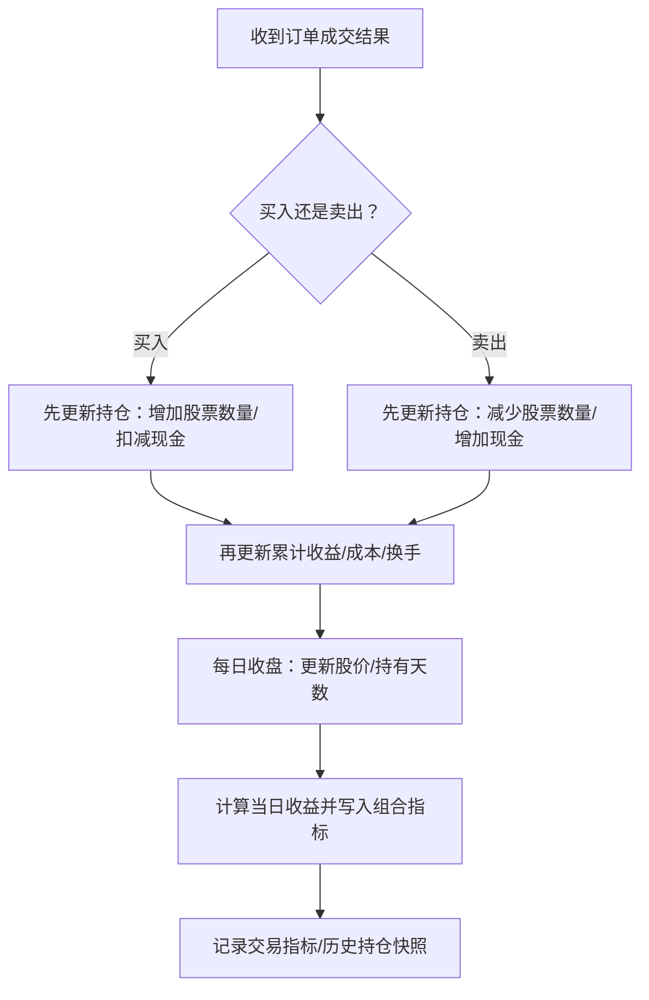
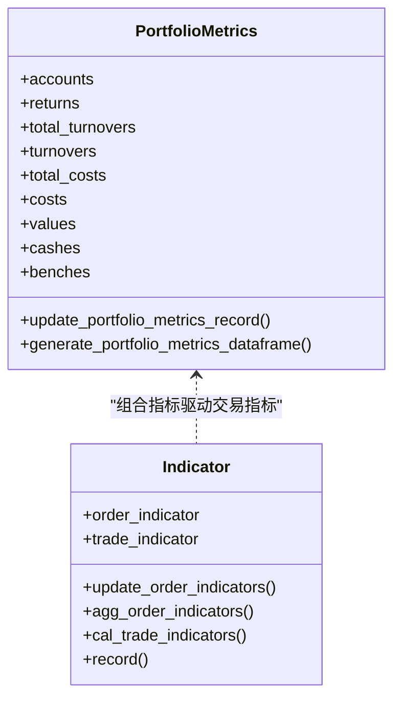
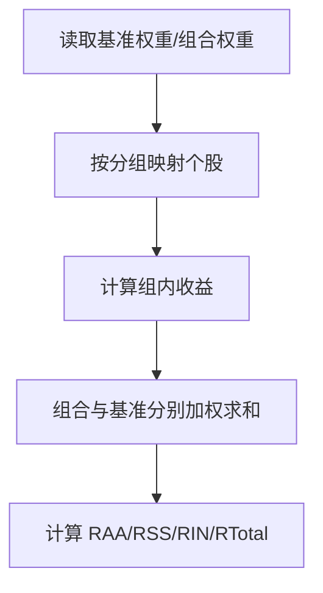
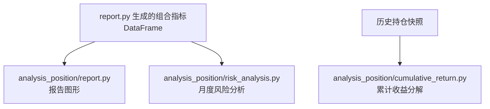
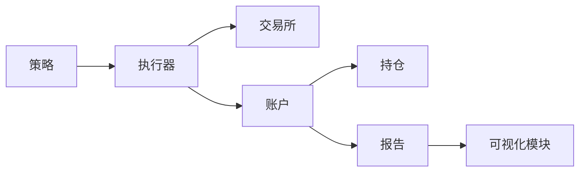

# 回测与报告

<cite>
**本文引用的文件**
- [qlib/backtest/backtest.py](file://qlib/backtest/backtest.py)
- [qlib/backtest/executor.py](file://qlib/backtest/executor.py)
- [qlib/backtest/decision.py](file://qlib/backtest/decision.py)
- [qlib/backtest/account.py](file://qlib/backtest/account.py)
- [qlib/backtest/position.py](file://qlib/backtest/position.py)
- [qlib/backtest/report.py](file://qlib/backtest/report.py)
- [qlib/backtest/profit_attribution.py](file://qlib/backtest/profit_attribution.py)
- [qlib/backtest/exchange.py](file://qlib/backtest/exchange.py)
- [qlib/backtest/__init__.py](file://qlib/backtest/__init__.py)
- [qlib/contrib/report/analysis_position/report.py](file://qlib/contrib/report/analysis_position/report.py)
- [qlib/contrib/report/analysis_position/risk_analysis.py](file://qlib/contrib/report/analysis_position/risk_analysis.py)
- [qlib/contrib/report/analysis_position/cumulative_return.py](file://qlib/contrib/report/analysis_position/cumulative_return.py)
</cite>

## 目录
1. [引言](#引言)
2. [项目结构](#项目结构)
3. [核心组件](#核心组件)
4. [架构总览](#架构总览)
5. [详细组件分析](#详细组件分析)
6. [依赖关系分析](#依赖关系分析)
7. [性能考量](#性能考量)
8. [故障排查指南](#故障排查指南)
9. [结论](#结论)
10. [附录：参数配置与可视化示例](#附录参数配置与可视化示例)

## 引言
本文件系统性介绍 QLearner（QLib）中的回测引擎与报告系统，重点覆盖以下方面：
- 回测主循环与时间推进机制
- 订单生成、匹配与成交流程
- 账户与持仓状态的精确追踪
- 绩效报告与关键指标（年化收益、夏普比率、最大回撤等）
- 利润归因分析（收益来源分解）
- 基于 contrib/report 的深入风险与归因可视化
- 交易成本与滑点等参数配置指南
- 结果解读与可视化方法

## 项目结构
回测与报告相关代码主要集中在 backtest 子模块以及 contrib/report 的分析模块中。下图给出与回测主流程直接相关的文件关系概览。

图表来源
- [qlib/backtest/backtest.py](file://qlib/backtest/backtest.py#L1-L111)
- [qlib/backtest/executor.py](file://qlib/backtest/executor.py#L1-L629)
- [qlib/backtest/decision.py](file://qlib/backtest/decision.py#L1-L597)
- [qlib/backtest/account.py](file://qlib/backtest/account.py#L1-L418)
- [qlib/backtest/position.py](file://qlib/backtest/position.py#L1-L566)
- [qlib/backtest/report.py](file://qlib/backtest/report.py#L1-L652)
- [qlib/backtest/exchange.py](file://qlib/backtest/exchange.py#L38-L127)
- [qlib/contrib/report/analysis_position/report.py](file://qlib/contrib/report/analysis_position/report.py#L1-L249)
- [qlib/contrib/report/analysis_position/risk_analysis.py](file://qlib/contrib/report/analysis_position/risk_analysis.py#L1-L298)
- [qlib/contrib/report/analysis_position/cumulative_return.py](file://qlib/contrib/report/analysis_position/cumulative_return.py#L1-L274)
- [qlib/backtest/profit_attribution.py](file://qlib/backtest/profit_attribution.py#L1-L335)

章节来源
- [qlib/backtest/backtest.py](file://qlib/backtest/backtest.py#L1-L111)
- [qlib/backtest/executor.py](file://qlib/backtest/executor.py#L1-L629)
- [qlib/backtest/decision.py](file://qlib/backtest/decision.py#L1-L597)
- [qlib/backtest/account.py](file://qlib/backtest/account.py#L1-L418)
- [qlib/backtest/position.py](file://qlib/backtest/position.py#L1-L566)
- [qlib/backtest/report.py](file://qlib/backtest/report.py#L1-L652)
- [qlib/backtest/exchange.py](file://qlib/backtest/exchange.py#L38-L127)
- [qlib/contrib/report/analysis_position/report.py](file://qlib/contrib/report/analysis_position/report.py#L1-L249)
- [qlib/contrib/report/analysis_position/risk_analysis.py](file://qlib/contrib/report/analysis_position/risk_analysis.py#L1-L298)
- [qlib/contrib/report/analysis_position/cumulative_return.py](file://qlib/contrib/report/analysis_position/cumulative_return.py#L1-L274)
- [qlib/backtest/profit_attribution.py](file://qlib/backtest/profit_attribution.py#L1-L335)

## 核心组件
- 回测主循环与时间推进：backtest.py 提供外层策略与执行器交互的主循环，按交易日推进并收集指标。
- 执行器：executor.py 定义了 BaseExecutor/NestedExecutor/SimulatorExecutor 等，负责在每个交易步内执行策略决策、调用交易所成交、更新账户与指标。
- 决策与订单：decision.py 定义 Order、BaseTradeDecision 等，承载下单指令与时间窗口限制。
- 交易所与成交：exchange.py 提供市场数据、限价/成交量约束、交易成本与滑点等，完成实际成交。
- 账户与持仓：account.py/position.py 精确维护现金、股票数量、权重、历史持仓快照与每日收益/成本/换手等。
- 报告与指标：report.py 提供组合指标（账户价值、收益、成本、换手、基准收益）与交易指标（成交额、成交均价、价格优势、成交率等），并支持保存/加载。
- 利润归因：profit_attribution.py 提供基于 Brinson 的资产配置与选股归因，分解超额收益来源。
- 报告可视化：analysis_position 下的 report/risk_analysis/cumulative_return 提供图形化展示与月度风险分析。

章节来源
- [qlib/backtest/backtest.py](file://qlib/backtest/backtest.py#L26-L111)
- [qlib/backtest/executor.py](file://qlib/backtest/executor.py#L1-L629)
- [qlib/backtest/decision.py](file://qlib/backtest/decision.py#L1-L597)
- [qlib/backtest/exchange.py](file://qlib/backtest/exchange.py#L38-L127)
- [qlib/backtest/account.py](file://qlib/backtest/account.py#L71-L418)
- [qlib/backtest/position.py](file://qlib/backtest/position.py#L1-L566)
- [qlib/backtest/report.py](file://qlib/backtest/report.py#L22-L652)
- [qlib/backtest/profit_attribution.py](file://qlib/backtest/profit_attribution.py#L1-L335)
- [qlib/contrib/report/analysis_position/report.py](file://qlib/contrib/report/analysis_position/report.py#L1-L249)
- [qlib/contrib/report/analysis_position/risk_analysis.py](file://qlib/contrib/report/analysis_position/risk_analysis.py#L1-L298)
- [qlib/contrib/report/analysis_position/cumulative_return.py](file://qlib/contrib/report/analysis_position/cumulative_return.py#L1-L274)

## 架构总览
下图展示从策略到执行器再到交易所与账户的端到端流程。

图表来源
- [qlib/backtest/executor.py](file://qlib/backtest/executor.py#L228-L304)
- [qlib/backtest/exchange.py](file://qlib/backtest/exchange.py#L38-L127)
- [qlib/backtest/account.py](file://qlib/backtest/account.py#L338-L418)
- [qlib/backtest/report.py](file://qlib/backtest/report.py#L153-L216)

章节来源
- [qlib/backtest/executor.py](file://qlib/backtest/executor.py#L228-L304)
- [qlib/backtest/exchange.py](file://qlib/backtest/exchange.py#L38-L127)
- [qlib/backtest/account.py](file://qlib/backtest/account.py#L338-L418)
- [qlib/backtest/report.py](file://qlib/backtest/report.py#L153-L216)

## 详细组件分析

### 回测主循环与时间推进（backtest.py）
- 外层主循环 backtest_loop 与生成器 collect_data_loop 驱动策略与执行器交互。
- 在每次迭代中，策略生成交易决策，执行器收集数据并推进一步；完成后汇总各执行器的组合指标与交易指标。
- 支持多层嵌套执行器（NestedExecutor），逐层向下传递决策与指标聚合。

图表来源
- [qlib/backtest/backtest.py](file://qlib/backtest/backtest.py#L26-L111)

章节来源
- [qlib/backtest/backtest.py](file://qlib/backtest/backtest.py#L26-L111)

### 执行器与订单匹配（executor.py / decision.py / exchange.py）
- 执行器
  - BaseExecutor：定义时间推进、指标配置、账户与交易所基础设施、每步 update_bar_end 流程。
  - NestedExecutor：支持在每个交易日内部再嵌套更高频的策略/执行器，逐层执行并聚合子层指标。
  - SimulatorExecutor：模拟真实市场，按序列或并行方式执行订单，调用交易所成交，记录成交明细。
- 订单与决策
  - Order：封装下单方向、数量、起止时间、成交结果等。
  - BaseTradeDecision/TradeDecisionWO：承载订单列表与可选的时间窗口限制（TradeRange）。
- 交易所成交
  - Exchange：提供 deal_order 接口，支持限价阈值、成交量限制、买卖价差、交易成本（开仓/平仓/最小费用）、滑点（impact_cost）等。

图表来源
- [qlib/backtest/executor.py](file://qlib/backtest/executor.py#L1-L629)
- [qlib/backtest/decision.py](file://qlib/backtest/decision.py#L1-L597)
- [qlib/backtest/exchange.py](file://qlib/backtest/exchange.py#L38-L127)

章节来源
- [qlib/backtest/executor.py](file://qlib/backtest/executor.py#L1-L629)
- [qlib/backtest/decision.py](file://qlib/backtest/decision.py#L1-L597)
- [qlib/backtest/exchange.py](file://qlib/backtest/exchange.py#L38-L127)

### 账户与持仓状态追踪（account.py / position.py）
- 账户 Account
  - 管理初始资金、当前持仓对象、累计收益/成本/换手、历史持仓快照、组合指标与交易指标。
  - update_order：根据订单成交结果更新累计收益/成本与持仓；先更新状态再更新持仓，或反之，保证收益一致性。
  - update_current_position/update_bar_end：每日收盘时更新股价、持有天数、计算当日收益并写入组合指标。
  - update_indicator：按原子/非原子两种模式聚合订单级指标（成交额、成交均价、价格优势、成交率等），并在每步末尾记录。
- 持仓 Position/InfPosition
  - Position：维护现金、股票数量、价格、权重、持有天数等，支持结算机制（延后可用现金）。
  - InfPosition：无限资金/无限头寸，用于随机测试场景。

图表来源
- [qlib/backtest/account.py](file://qlib/backtest/account.py#L180-L418)
- [qlib/backtest/position.py](file://qlib/backtest/position.py#L231-L566)

章节来源
- [qlib/backtest/account.py](file://qlib/backtest/account.py#L71-L418)
- [qlib/backtest/position.py](file://qlib/backtest/position.py#L1-L566)

### 绩效报告与关键指标（report.py）
- 组合指标 PortfolioMetrics
  - 记录每日账户价值、收益、总/单日换手、总/单日成本、成本率、股票价值、现金、基准收益等。
  - 支持基准收益采样（按频率聚合），并提供生成 DataFrame、保存/加载能力。
- 交易指标 Indicator
  - 原子模式：以 trade_info 聚合订单级指标（成交额、成交均价、成交成本、方向、成交率等）。
  - 非原子模式：聚合子层订单指标，计算价格优势（PA）、成交率（FFR）、正向比例等，并支持加权平均方法。
  - 每步末尾记录交易指标，形成每步的交易报告。

图表来源
- [qlib/backtest/report.py](file://qlib/backtest/report.py#L22-L652)

章节来源
- [qlib/backtest/report.py](file://qlib/backtest/report.py#L22-L652)

### 利润归因分析（profit_attribution.py）
- 基于 Brinson 归因框架，分解超额收益来源：
  - 资产配置（Allocation，RAA）：因组合权重偏离基准导致的超额收益。
  - 个股选择（Selection，RSS）：在各行业/分组内，因个股收益偏离基准组内收益导致的超额收益。
  - 交互项（Interaction，RIN）：权重与收益同时偏离的交互影响。
  - 总体超额收益（RTotal）。
- 步骤要点：
  - 获取基准权重分布与组合权重分布。
  - 将个股按分组（行业/市值等）映射，计算组内收益。
  - 分别对组合与基准进行加权求和，得到各期超额收益分解。

图表来源
- [qlib/backtest/profit_attribution.py](file://qlib/backtest/profit_attribution.py#L1-L335)

章节来源
- [qlib/backtest/profit_attribution.py](file://qlib/backtest/profit_attribution.py#L1-L335)

### 报告可视化与深入分析（contrib/report）
- 报告图形（analysis_position/report.py）
  - 生成累计基准收益、累计收益（含/不含成本）、最大回撤、超额收益（含/不含成本与成本）、换手等序列图。
  - 标注最大回撤区间，便于直观识别风险阶段。
- 风险分析（analysis_position/risk_analysis.py）
  - 对超额收益（含/不含成本）进行月度风险指标统计（年化收益、最大回撤、信息比率、波动率等）。
  - 支持月度趋势可视化。
- 累计收益分解（analysis_position/cumulative_return.py）
  - 按“持有/买入/卖出/买入-卖出”四类对标签收益进行加权累计，辅助理解买卖行为对收益的贡献。

图表来源
- [qlib/contrib/report/analysis_position/report.py](file://qlib/contrib/report/analysis_position/report.py#L1-L249)
- [qlib/contrib/report/analysis_position/risk_analysis.py](file://qlib/contrib/report/analysis_position/risk_analysis.py#L1-L298)
- [qlib/contrib/report/analysis_position/cumulative_return.py](file://qlib/contrib/report/analysis_position/cumulative_return.py#L1-L274)

章节来源
- [qlib/contrib/report/analysis_position/report.py](file://qlib/contrib/report/analysis_position/report.py#L1-L249)
- [qlib/contrib/report/analysis_position/risk_analysis.py](file://qlib/contrib/report/analysis_position/risk_analysis.py#L1-L298)
- [qlib/contrib/report/analysis_position/cumulative_return.py](file://qlib/contrib/report/analysis_position/cumulative_return.py#L1-L274)

## 依赖关系分析
- 组件耦合
  - 执行器依赖策略、交易所与账户；账户依赖持仓类型与报告模块；报告模块依赖账户输出的数据。
  - 嵌套执行器通过浅拷贝共享持仓对象，但各自维护独立的组合指标与交易指标，避免跨层指标污染。
- 外部依赖
  - 数据访问：通过 D.features 等接口获取行情与因子数据，用于基准收益计算与归因分析。
  - 可视化：使用 SubplotsGraph/ScatterGraph 等工具生成图形。

图表来源
- [qlib/backtest/executor.py](file://qlib/backtest/executor.py#L1-L629)
- [qlib/backtest/account.py](file://qlib/backtest/account.py#L1-L418)
- [qlib/backtest/report.py](file://qlib/backtest/report.py#L1-L652)
- [qlib/contrib/report/analysis_position/report.py](file://qlib/contrib/report/analysis_position/report.py#L1-L249)

章节来源
- [qlib/backtest/executor.py](file://qlib/backtest/executor.py#L1-L629)
- [qlib/backtest/account.py](file://qlib/backtest/account.py#L1-L418)
- [qlib/backtest/report.py](file://qlib/backtest/report.py#L1-L652)
- [qlib/contrib/report/analysis_position/report.py](file://qlib/contrib/report/analysis_position/report.py#L1-L249)

## 性能考量
- 指标聚合
  - 非原子模式下，交易指标通过聚合子层指标实现，注意避免重复计算与内存占用。
- 价格优势与成交率
  - PA/FFR 的加权方式（均值/按数量/按价值）会影响最终指标稳定性，建议根据场景选择合适权重。
- 基准收益采样
  - 基准收益按频率聚合，确保与交易频率一致，避免跨频率误差。
- 嵌套执行器
  - 浅拷贝共享持仓可降低内存，但需注意不同层级指标的独立性与一致性校验。

[本节为通用指导，不直接分析具体文件]

## 故障排查指南
- 订单未成交或部分成交
  - 检查交易所限价阈值、成交量限制、交易单位与最小费用设置。
  - 查看成交返回的成交金额与成交均价，确认是否被限流或停牌。
- 收益与成本不一致
  - 确认 update_order 的调用顺序（先更新状态再更新持仓，或反之）与累计收益/成本的计算口径。
- 指标为空或缺失
  - 确认 generate_portfolio_metrics 是否启用，以及账户频率与交易频率是否一致。
- 基准收益异常
  - 检查基准配置（代码/时间范围/频率），确保数据存在且无空值。

章节来源
- [qlib/backtest/exchange.py](file://qlib/backtest/exchange.py#L38-L127)
- [qlib/backtest/account.py](file://qlib/backtest/account.py#L180-L337)
- [qlib/backtest/report.py](file://qlib/backtest/report.py#L96-L152)

## 结论
QLib 的回测与报告体系以清晰的职责划分与可扩展的执行器模型为核心，实现了从策略到成交、从账户到指标、从报告到可视化的完整闭环。通过组合指标与交易指标的双轨记录，配合 Brinson 归因与多维度可视化，用户可以全面评估策略表现并定位收益来源与风险成因。

[本节为总结性内容，不直接分析具体文件]

## 附录：参数配置与可视化示例

### 配置交易成本与滑点
- 交易成本
  - 开仓费率、平仓费率、最小费用等参数在交易所初始化时配置，用于成交成本计算。
- 滑点（市场冲击）
  - 通过 impact_cost 参数控制，反映大额订单对市场的冲击影响。
- 其他关键参数
  - 限价阈值、成交量限制、交易单位、成交价格选择等，均可在交易所配置中调整。

章节来源
- [qlib/backtest/exchange.py](file://qlib/backtest/exchange.py#L38-L127)
- [qlib/backtest/__init__.py](file://qlib/backtest/__init__.py#L33-L120)

### 回测运行与结果解读
- 运行回测
  - 使用 backtest 接口传入策略、执行器、基准、账户规模与交易所参数，返回组合指标字典与交易指标字典。
- 结果解读
  - 组合指标：关注累计收益、年化收益、最大回撤、换手率、成本率等。
  - 交易指标：关注成交率（FFR）、价格优势（PA）、正向比例等，评估执行质量。
- 可视化
  - 使用 analysis_position/report.py 生成报告图形，标注最大回撤区间。
  - 使用 risk_analysis.py 生成月度风险指标趋势图。
  - 使用 cumulative_return.py 对买入/卖出/持有行为进行收益分解。

章节来源
- [qlib/backtest/__init__.py](file://qlib/backtest/__init__.py#L217-L309)
- [qlib/contrib/report/analysis_position/report.py](file://qlib/contrib/report/analysis_position/report.py#L166-L249)
- [qlib/contrib/report/analysis_position/risk_analysis.py](file://qlib/contrib/report/analysis_position/risk_analysis.py#L162-L298)
- [qlib/contrib/report/analysis_position/cumulative_return.py](file://qlib/contrib/report/analysis_position/cumulative_return.py#L183-L274)