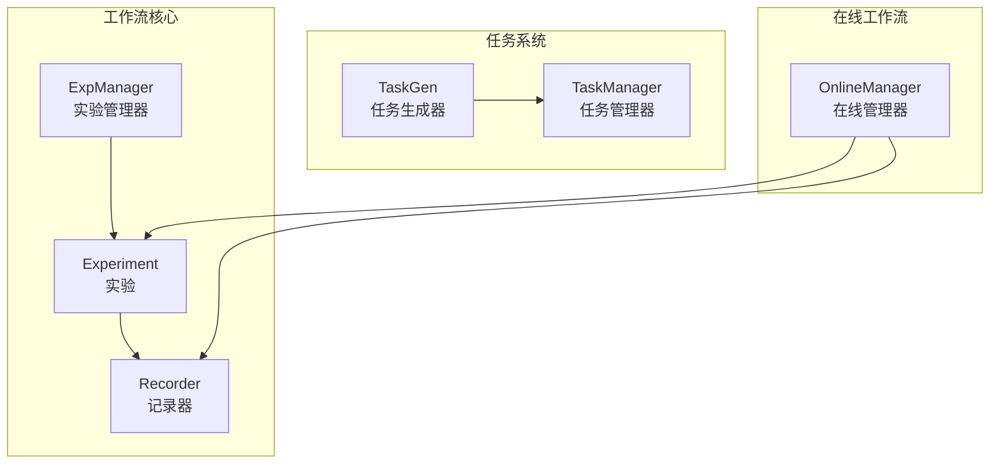
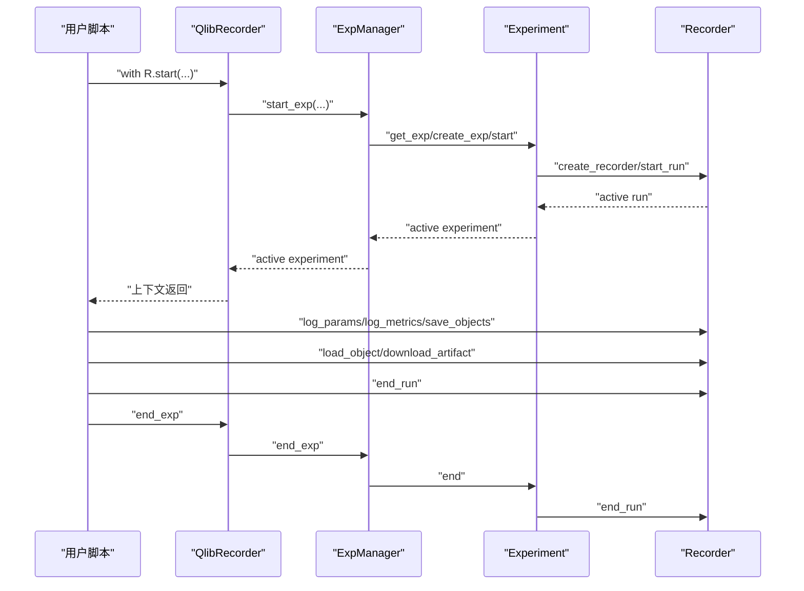
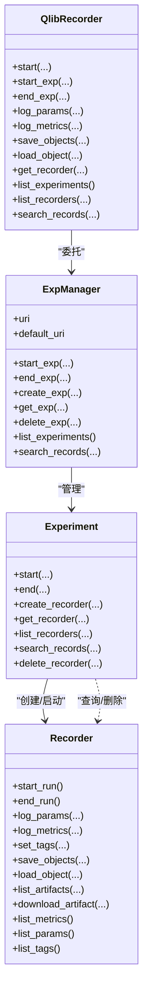
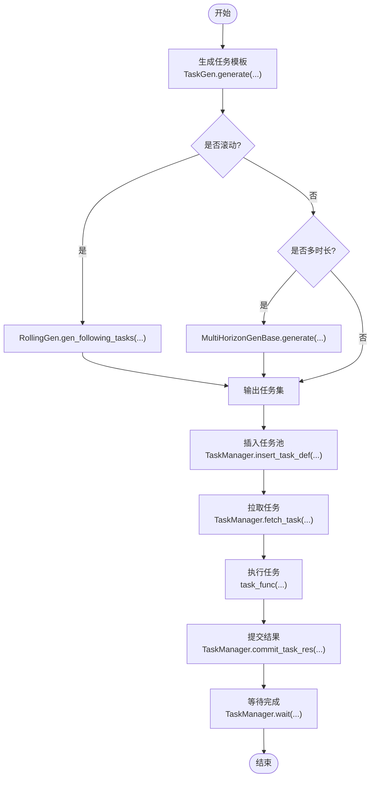
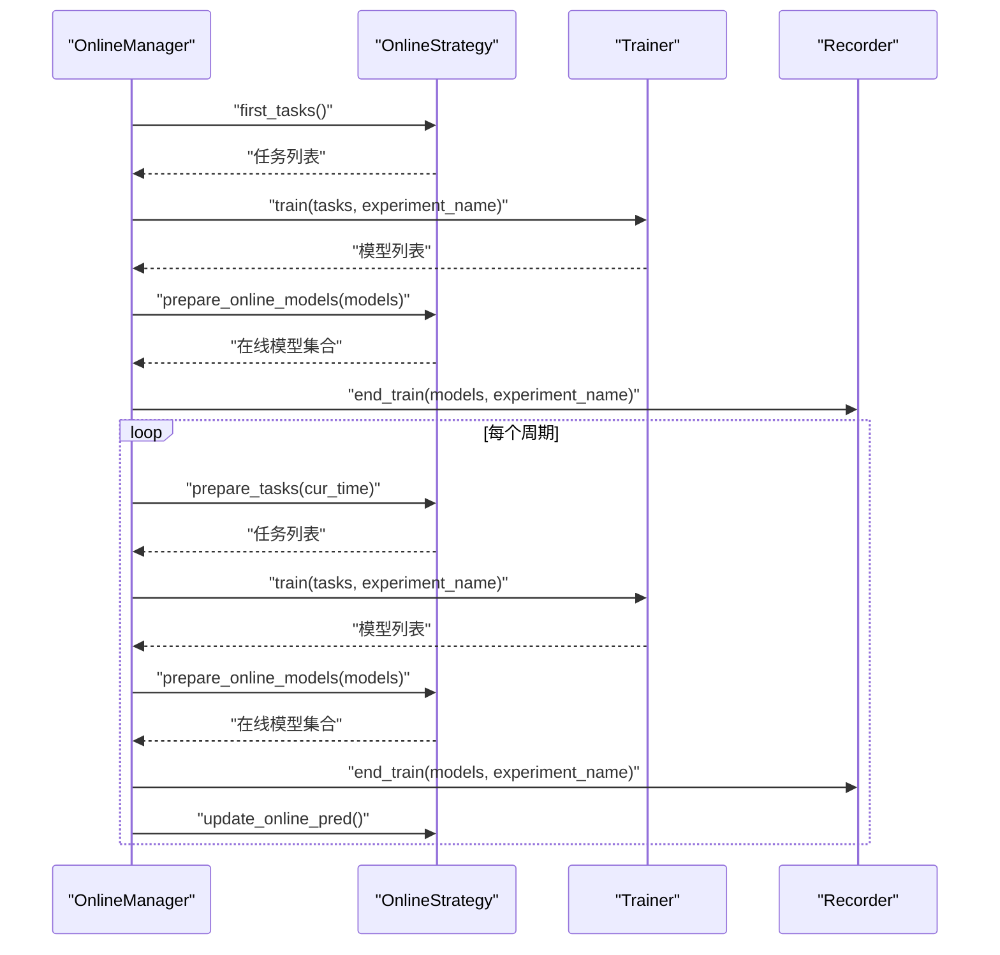
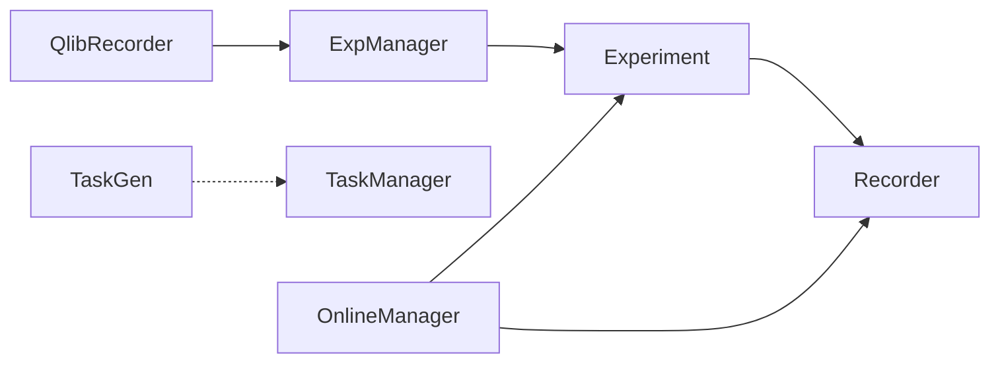

# 工作流管理

<cite>
**本文引用的文件列表**
- [exp.py](file://qlib/workflow/exp.py)
- [recorder.py](file://qlib/workflow/recorder.py)
- [expm.py](file://qlib/workflow/expm.py)
- [__init__.py](file://qlib/workflow/__init__.py)
- [gen.py](file://qlib/workflow/task/gen.py)
- [manage.py](file://qlib/workflow/task/manage.py)
- [manager.py](file://qlib/workflow/online/manager.py)
- [workflow_by_code.py](file://examples/workflow_by_code.py)
- [workflow_config_lightgbm_Alpha158.yaml](file://examples/benchmarks/LightGBM/workflow_config_lightgbm_Alpha158.yaml)
- [utils.py](file://qlib/workflow/utils.py)
</cite>

## 目录
1. [引言](#引言)
2. [项目结构](#项目结构)
3. [核心组件](#核心组件)
4. [架构总览](#架构总览)
5. [详细组件分析](#详细组件分析)
6. [依赖关系分析](#依赖关系分析)
7. [性能考量](#性能考量)
8. [故障排查指南](#故障排查指南)
9. [结论](#结论)
10. [附录：API 调用示例](#附录api-调用示例)

## 引言
本文件系统性阐述 QLib 工作流管理系统的设计与实现，重点说明其作为实验生命周期管理中枢的角色。文档围绕以下目标展开：
- 解释“实验（Exp）”与“记录器（Recorder）”的设计模式，以及它们如何贯穿模型训练、回测与分析全流程；
- 说明任务生成（task/gen.py）与任务管理（task/manage.py）模块如何支撑大规模实验的自动化调度；
- 介绍在线工作流管理器（online/manager.py）在模型滚动更新中的应用；
- 对比 YAML 配置驱动与 Python 代码驱动（workflow_by_code.py）两种工作流定义方式的优劣与适用场景；
- 提供完整的 API 调用示例，展示如何创建、执行与查询实验记录。

## 项目结构
工作流管理位于 qlib/workflow 子模块，围绕“实验管理器（ExpManager）—实验（Experiment）—记录器（Recorder）”三层抽象构建，并通过任务生成与任务管理模块实现大规模实验的自动化调度；在线工作流管理器负责滚动更新与信号准备。

图表来源
- [expm.py](file://qlib/workflow/expm.py#L23-L120)
- [exp.py](file://qlib/workflow/exp.py#L15-L120)
- [recorder.py](file://qlib/workflow/recorder.py#L28-L120)
- [gen.py](file://qlib/workflow/task/gen.py#L52-L120)
- [manage.py](file://qlib/workflow/task/manage.py#L33-L120)
- [manager.py](file://qlib/workflow/online/manager.py#L101-L170)

章节来源
- [expm.py](file://qlib/workflow/expm.py#L23-L120)
- [exp.py](file://qlib/workflow/exp.py#L15-L120)
- [recorder.py](file://qlib/workflow/recorder.py#L28-L120)
- [gen.py](file://qlib/workflow/task/gen.py#L52-L120)
- [manage.py](file://qlib/workflow/task/manage.py#L33-L120)
- [manager.py](file://qlib/workflow/online/manager.py#L101-L170)

## 核心组件
- 实验管理器（ExpManager）：统一管理实验的创建、启动、结束与查询，支持多后端（当前以 MLflow 为主），并维护默认跟踪 URI 与活动实验。
- 实验（Experiment）：面向用户的实验接口，封装记录器的创建、启动、结束、查询与删除等操作。
- 记录器（Recorder）：封装一次实验运行的生命周期，提供参数、指标、标签、制品（Artifacts）的记录与读取能力，并支持异步日志。
- 任务生成（TaskGen）：基于模板生成不同任务集合，支持滚动（Rolling）与多时长（MultiHorizon）等生成策略。
- 任务管理（TaskManager）：基于 MongoDB 的任务池，提供任务插入、拉取、提交结果、状态统计与等待机制。
- 在线管理器（OnlineManager）：按策略周期性地准备任务、训练模型、更新在线模型与信号，支持仿真与延迟训练。

章节来源
- [expm.py](file://qlib/workflow/expm.py#L23-L120)
- [exp.py](file://qlib/workflow/exp.py#L15-L120)
- [recorder.py](file://qlib/workflow/recorder.py#L28-L120)
- [gen.py](file://qlib/workflow/task/gen.py#L52-L120)
- [manage.py](file://qlib/workflow/task/manage.py#L33-L120)
- [manager.py](file://qlib/workflow/online/manager.py#L101-L170)

## 架构总览
工作流管理采用分层设计：
- 上层：QlibRecorder 全局入口，提供 with 上下文与便捷 API；
- 中层：ExpManager/Experiment/Recorder 三层抽象，屏蔽后端细节；
- 下层：TaskGen/TaskManager 支持大规模任务生成与调度；OnlineManager 支持滚动更新与信号准备。

图表来源
- [__init__.py](file://qlib/workflow/__init__.py#L37-L96)
- [expm.py](file://qlib/workflow/expm.py#L95-L118)
- [exp.py](file://qlib/workflow/exp.py#L243-L380)
- [recorder.py](file://qlib/workflow/recorder.py#L247-L396)

章节来源
- [__init__.py](file://qlib/workflow/__init__.py#L37-L96)
- [expm.py](file://qlib/workflow/expm.py#L95-L118)
- [exp.py](file://qlib/workflow/exp.py#L243-L380)
- [recorder.py](file://qlib/workflow/recorder.py#L247-L396)

## 详细组件分析

### 实验与记录器：Exp 与 Recorder 的设计模式
- 设计要点
  - 实验（Experiment）与记录器（Recorder）分别承担“实验生命周期”和“单次运行记录”的职责，二者解耦并通过 MLflow 后端对接。
  - QlibRecorder 作为全局入口，提供 with 上下文与自动状态管理，简化用户使用。
- 生命周期
  - 启动：ExpManager 创建/获取实验，设置为活动实验；Experiment 创建/获取记录器并启动运行。
  - 运行：记录器提供参数、指标、标签、制品的记录与读取接口，并支持异步日志。
  - 结束：记录器结束运行并更新状态；ExpManager 清理活动实验。
- 关键接口路径
  - 实验类与 MLflow 实现：[exp.py](file://qlib/workflow/exp.py#L15-L120), [exp.py](file://qlib/workflow/exp.py#L243-L380)
  - 记录器类与 MLflow 实现：[recorder.py](file://qlib/workflow/recorder.py#L28-L120), [recorder.py](file://qlib/workflow/recorder.py#L247-L494)
  - 全局入口与上下文：[__init__.py](file://qlib/workflow/__init__.py#L37-L96), [__init__.py](file://qlib/workflow/__init__.py#L138-L164)

图表来源
- [__init__.py](file://qlib/workflow/__init__.py#L26-L164)
- [expm.py](file://qlib/workflow/expm.py#L23-L120)
- [exp.py](file://qlib/workflow/exp.py#L15-L120)
- [recorder.py](file://qlib/workflow/recorder.py#L28-L120)

章节来源
- [__init__.py](file://qlib/workflow/__init__.py#L26-L164)
- [expm.py](file://qlib/workflow/expm.py#L23-L120)
- [exp.py](file://qlib/workflow/exp.py#L15-L120)
- [recorder.py](file://qlib/workflow/recorder.py#L28-L120)

### 任务生成与管理：自动化调度
- 任务生成（TaskGen）
  - 基于模板生成任务集合，支持滚动（RollingGen）与多时长（MultiHorizonGenBase）等策略，确保数据不泄漏并可扩展。
  - 关键接口路径：[gen.py](file://qlib/workflow/task/gen.py#L52-L120), [gen.py](file://qlib/workflow/task/gen.py#L141-L352)
- 任务管理（TaskManager）
  - 基于 MongoDB 的任务池，提供插入、拉取、提交结果、状态统计与等待机制，支持优先级与错误恢复。
  - 关键接口路径：[manage.py](file://qlib/workflow/task/manage.py#L33-L120), [manage.py](file://qlib/workflow/task/manage.py#L263-L381), [manage.py](file://qlib/workflow/task/manage.py#L483-L557)

图表来源
- [gen.py](file://qlib/workflow/task/gen.py#L141-L352)
- [manage.py](file://qlib/workflow/task/manage.py#L192-L262)
- [manage.py](file://qlib/workflow/task/manage.py#L263-L381)
- [manage.py](file://qlib/workflow/task/manage.py#L456-L505)

章节来源
- [gen.py](file://qlib/workflow/task/gen.py#L52-L120)
- [gen.py](file://qlib/workflow/task/gen.py#L141-L352)
- [manage.py](file://qlib/workflow/task/manage.py#L33-L120)
- [manage.py](file://qlib/workflow/task/manage.py#L192-L262)
- [manage.py](file://qlib/workflow/task/manage.py#L263-L381)
- [manage.py](file://qlib/workflow/task/manage.py#L456-L505)
- [manage.py](file://qlib/workflow/task/manage.py#L506-L557)

### 在线工作流管理器：滚动更新与信号准备
- 角色定位
  - OnlineManager 管理多个在线策略，按周期准备任务、训练模型、更新在线模型与交易信号，支持仿真与延迟训练。
- 关键流程
  - 首次训练（first_train）：从各策略获取任务并训练，准备在线模型并记录历史。
  - 周期更新（routine）：按时间推进，重复上述流程，并在在线模式下更新预测。
  - 仿真（simulate）：按日历推进，支持延迟训练与延迟准备信号。
- 关键接口路径：[manager.py](file://qlib/workflow/online/manager.py#L156-L229), [manager.py](file://qlib/workflow/online/manager.py#L302-L348)

图表来源
- [manager.py](file://qlib/workflow/online/manager.py#L156-L229)
- [manager.py](file://qlib/workflow/online/manager.py#L302-L348)

章节来源
- [manager.py](file://qlib/workflow/online/manager.py#L101-L170)
- [manager.py](file://qlib/workflow/online/manager.py#L156-L229)
- [manager.py](file://qlib/workflow/online/manager.py#L302-L348)

### 工作流定义方式对比：YAML 与 Python 代码
- YAML 配置驱动
  - 使用示例：[workflow_config_lightgbm_Alpha158.yaml](file://examples/benchmarks/LightGBM/workflow_config_lightgbm_Alpha158.yaml#L1-L72)
  - 特点：声明式、易复用、适合固定流程与参数扫描；通过占位符（如 <MODEL>, <DATASET>, <PRED>）连接各阶段。
- Python 代码驱动
  - 使用示例：[workflow_by_code.py](file://examples/workflow_by_code.py#L1-L86)
  - 特点：灵活、可编程、便于动态控制与条件分支；适合复杂逻辑与自定义分析。
- 选择建议
  - 固定流程与参数网格：优先 YAML；
  - 动态流程与复杂分析：优先 Python 代码。

章节来源
- [workflow_config_lightgbm_Alpha158.yaml](file://examples/benchmarks/LightGBM/workflow_config_lightgbm_Alpha158.yaml#L1-L72)
- [workflow_by_code.py](file://examples/workflow_by_code.py#L1-L86)

## 依赖关系分析
- 组件耦合
  - QlibRecorder 依赖 ExpManager；ExpManager 依赖 Experiment；Experiment 依赖 Recorder；
  - TaskGen 与 TaskManager 解耦，通过任务字典进行协作；
  - OnlineManager 依赖策略、训练器与记录器。
- 外部依赖
  - MLflow 用于实验与记录器后端；
  - MongoDB 用于任务池存储；
  - 日志与异常处理由内部工具模块提供。

图表来源
- [__init__.py](file://qlib/workflow/__init__.py#L26-L164)
- [expm.py](file://qlib/workflow/expm.py#L23-L120)
- [exp.py](file://qlib/workflow/exp.py#L15-L120)
- [recorder.py](file://qlib/workflow/recorder.py#L28-L120)
- [gen.py](file://qlib/workflow/task/gen.py#L52-L120)
- [manage.py](file://qlib/workflow/task/manage.py#L33-L120)
- [manager.py](file://qlib/workflow/online/manager.py#L101-L170)

章节来源
- [__init__.py](file://qlib/workflow/__init__.py#L26-L164)
- [expm.py](file://qlib/workflow/expm.py#L23-L120)
- [exp.py](file://qlib/workflow/exp.py#L15-L120)
- [recorder.py](file://qlib/workflow/recorder.py#L28-L120)
- [gen.py](file://qlib/workflow/task/gen.py#L52-L120)
- [manage.py](file://qlib/workflow/task/manage.py#L33-L120)
- [manager.py](file://qlib/workflow/online/manager.py#L101-L170)

## 性能考量
- 异步日志：记录器支持异步日志队列，减少 I/O 阻塞，但需注意结束时等待队列完成。
- 任务并发：TaskManager 使用 MongoDB 原子更新保证任务唯一性与并发安全；建议合理设置优先级与批量处理。
- 滚动更新：OnlineManager 支持延迟训练与延迟准备信号，避免频繁 I/O 并提升吞吐。
- 数据截断：任务生成器在滚动时对数据段进行截断，避免未来信息泄露，同时保持训练稳定性。

章节来源
- [recorder.py](file://qlib/workflow/recorder.py#L347-L396)
- [manage.py](file://qlib/workflow/task/manage.py#L263-L381)
- [manager.py](file://qlib/workflow/online/manager.py#L145-L155)
- [gen.py](file://qlib/workflow/task/gen.py#L127-L140)

## 故障排查指南
- 异常处理
  - 程序退出钩子：在非正常退出时自动结束实验并标记失败状态。
  - 异常钩子：捕获未处理异常，自动结束实验并记录失败状态。
- 常见问题
  - 记录器未启动：保存对象或下载制品前需先启动记录器；
  - 任务池异常：检查 MongoDB 连接与权限，确认任务 ID 类型转换；
  - 在线仿真日志级别：仿真模式会降低日志级别，注意日志过滤。
- 关键接口路径
  - 退出处理：[utils.py](file://qlib/workflow/utils.py#L16-L48)
  - 记录器结束：[recorder.py](file://qlib/workflow/recorder.py#L380-L396)
  - 任务返回与重置：[manage.py](file://qlib/workflow/task/manage.py#L369-L431)

章节来源
- [utils.py](file://qlib/workflow/utils.py#L16-L48)
- [recorder.py](file://qlib/workflow/recorder.py#L380-L396)
- [manage.py](file://qlib/workflow/task/manage.py#L369-L431)

## 结论
QLib 工作流管理系统通过“实验管理器—实验—记录器”的分层设计，结合任务生成与任务管理模块，实现了从模型训练到回测分析的全生命周期管理；在线工作流管理器进一步支持滚动更新与信号准备。YAML 与 Python 两种工作流定义方式互补：前者适合固定流程与参数扫描，后者适合灵活与可编程场景。整体架构具备良好的扩展性与可维护性。

## 附录：API 调用示例
以下示例展示如何使用 QlibRecorder 完成实验的创建、执行与查询。请根据实际路径与参数调整。

- 创建并启动实验（with 上下文）
  - 示例路径：[__init__.py](file://qlib/workflow/__init__.py#L37-L96)
  - 关键步骤：with R.start(...) 进入实验上下文；在上下文中进行模型训练、记录参数与指标、保存对象。
- 获取记录器并记录
  - 示例路径：[__init__.py](file://qlib/workflow/__init__.py#L392-L460), [recorder.py](file://qlib/workflow/recorder.py#L247-L396)
  - 关键步骤：R.get_recorder() 获取当前活动记录器；R.log_params()/R.log_metrics() 记录参数与指标；R.save_objects()/R.load_object() 管理制品。
- 查询与列出实验/记录器
  - 示例路径：[__init__.py](file://qlib/workflow/__init__.py#L165-L213), [exp.py](file://qlib/workflow/exp.py#L243-L380)
  - 关键步骤：R.search_records()/R.list_experiments()/R.list_recorders() 查询与列举。
- 任务生成与管理
  - 示例路径：[gen.py](file://qlib/workflow/task/gen.py#L141-L352), [manage.py](file://qlib/workflow/task/manage.py#L192-L262)
  - 关键步骤：使用 RollingGen/MultiHorizonGenBase 生成任务；TaskManager.insert_task_def()/fetch_task()/commit_task_res() 管理任务池。
- 在线工作流
  - 示例路径：[manager.py](file://qlib/workflow/online/manager.py#L156-L229), [manager.py](file://qlib/workflow/online/manager.py#L302-L348)
  - 关键步骤：OnlineManager.first_train()/routine()/simulate() 管理滚动更新与仿真。

章节来源
- [__init__.py](file://qlib/workflow/__init__.py#L37-L96)
- [__init__.py](file://qlib/workflow/__init__.py#L165-L213)
- [__init__.py](file://qlib/workflow/__init__.py#L392-L460)
- [recorder.py](file://qlib/workflow/recorder.py#L247-L396)
- [exp.py](file://qlib/workflow/exp.py#L243-L380)
- [gen.py](file://qlib/workflow/task/gen.py#L141-L352)
- [manage.py](file://qlib/workflow/task/manage.py#L192-L262)
- [manager.py](file://qlib/workflow/online/manager.py#L156-L229)
- [manager.py](file://qlib/workflow/online/manager.py#L302-L348)