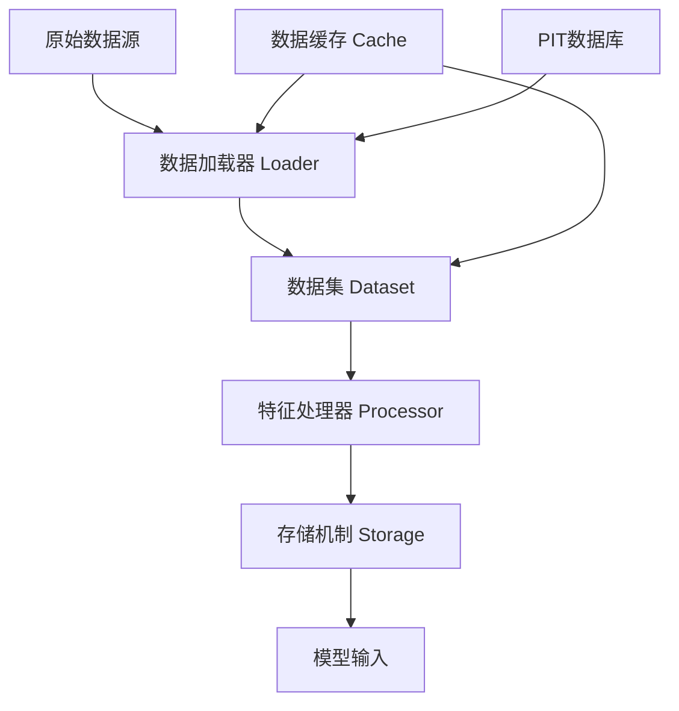
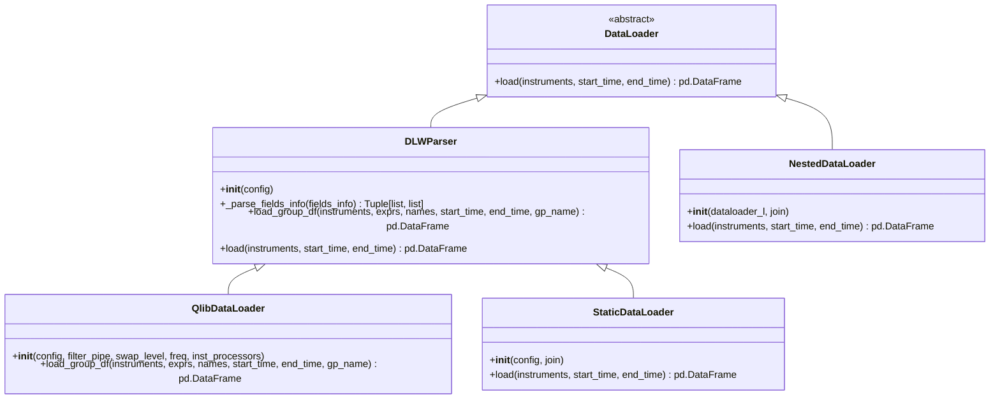
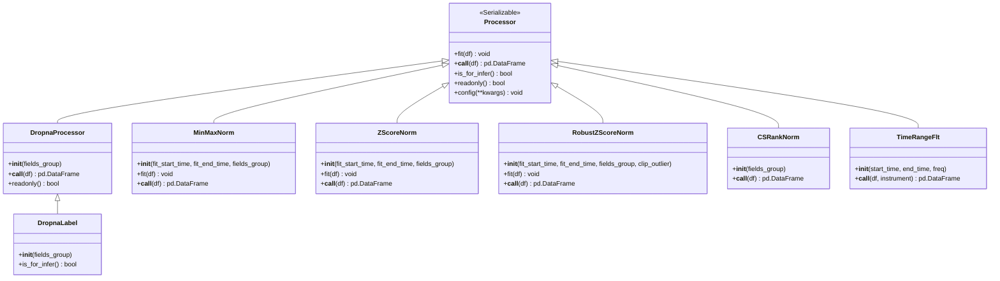
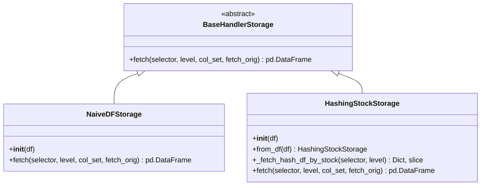
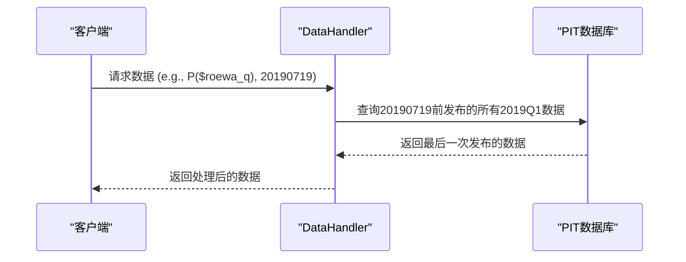
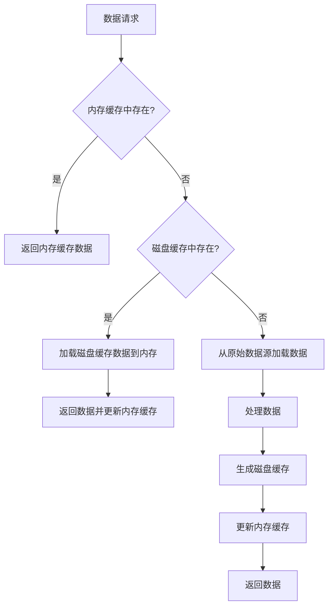
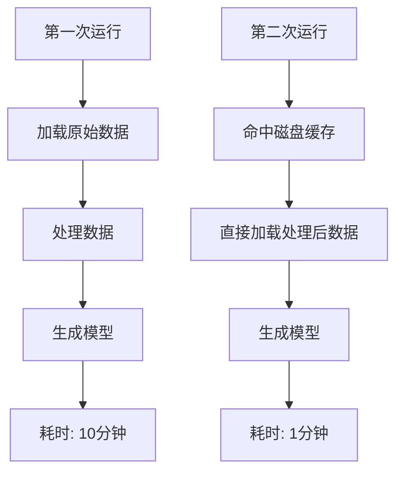
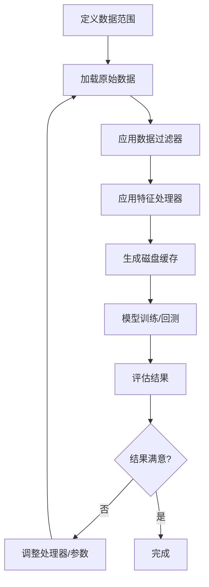

# 数据管理

<cite>
**本文档中引用的文件**   
- [pit.py](file://qlib/data/pit.py)
- [cache.py](file://qlib/data/cache.py)
- [loader.py](file://qlib/data/dataset/loader.py)
- [storage.py](file://qlib/data/dataset/storage.py)
- [processor.py](file://qlib/data/dataset/processor.py)
- [handler.py](file://qlib/data/dataset/handler.py)
- [filter.py](file://qlib/data/filter.py)
- [inst_processor.py](file://qlib/data/inst_processor.py)
- [data.py](file://qlib/data/data.py)
- [data_cache_demo.py](file://examples/data_demo/data_cache_demo.py)
- [data_mem_resuse_demo.py](file://examples/data_demo/data_mem_resue_demo.py)
</cite>

## 目录
1. [引言](#引言)
2. [数据层架构](#数据层架构)
3. [PIT技术详解](#pit技术详解)
4. [数据缓存机制](#数据缓存机制)
5. [自定义组件开发](#自定义组件开发)
6. [高级功能](#高级功能)
7. [完整处理流程](#完整处理流程)
8. [结论](#结论)

## 引言
数据管理组件是量化平台QLib的核心，负责为模型训练和回测提供高质量、无未来数据泄露的数据。该组件采用模块化设计，将数据加载、处理、存储和缓存等职责分离，确保了系统的灵活性和可扩展性。通过PIT（Point-in-Time）技术，系统能够精确地在历史时间点获取当时可用的数据版本，从根本上解决了未来数据泄露问题。同时，强大的数据缓存机制显著提升了重复实验的性能。本文档将深入剖析数据管理组件的架构设计和核心功能。

## 数据层架构
数据层的架构设计遵循清晰的分层原则，由数据加载器（loader）、数据集定义（dataset）、特征处理器（processor）和存储机制（storage）四个核心组件构成。这些组件协同工作，形成一个高效的数据处理流水线。



**架构来源**
- [loader.py](file://qlib/data/dataset/loader.py#L1-L415)
- [handler.py](file://qlib/data/dataset/handler.py#L1-L787)
- [processor.py](file://qlib/data/dataset/processor.py#L1-L420)
- [storage.py](file://qlib/data/dataset/storage.py#L1-L192)

**数据层架构组件关系**
- **数据加载器 (Loader)**: 负责从原始数据源（如文件、数据库）加载数据，是数据流水线的入口。
- **数据集 (Dataset)**: 定义了数据的结构和范围，通常通过`DataHandler`类来实现，它将加载器、处理器和存储机制整合在一起。
- **特征处理器 (Processor)**: 对原始数据进行清洗、标准化、填充等处理，生成适合模型训练的特征。
- **存储机制 (Storage)**: 负责数据的内部存储和高效访问，支持多种存储策略以优化性能。

### 数据加载器
数据加载器是数据管理组件的入口，负责从底层数据源加载原始数据。`QlibDataLoader`是核心实现，它利用QLib的数据接口`D.features`来获取数据。



**类图来源**
- [loader.py](file://qlib/data/dataset/loader.py#L18-L415)

**数据加载器说明**
- `DataLoader`是所有加载器的抽象基类，定义了`load`方法。
- `DLWParser`是一个中间基类，提供了字段解析功能。
- `QlibDataLoader`是主要实现，它使用`D.features`接口从QLib的数据系统中加载数据。
- `StaticDataLoader`用于从文件或内存对象加载静态数据。
- `NestedDataLoader`用于组合多个加载器，实现数据的合并。

### 特征处理器
特征处理器负责对原始数据进行各种转换和处理，以生成高质量的模型输入。处理器以流水线的方式工作，每个处理器负责一个特定的处理任务。



**类图来源**
- [processor.py](file://qlib/data/dataset/processor.py#L35-L420)
- [inst_processor.py](file://qlib/data/inst_processor.py#L6-L23)

**特征处理器说明**
- `Processor`是所有特征处理器的基类，实现了`Serializable`接口，支持序列化。
- `DropnaProcessor`和`DropnaLabel`用于处理缺失值，后者专门用于标签数据。
- `MinMaxNorm`、`ZScoreNorm`和`RobustZScoreNorm`提供不同的归一化方法。
- `CSRankNorm`执行横截面排序归一化，常用于因子分析。
- `TimeRangeFlt`是一个实例处理器，用于过滤在特定时间范围内存在的股票。

### 存储机制
存储机制负责数据的内部表示和高效访问。`DataHandler`根据数据访问模式选择合适的存储策略。



**类图来源**
- [storage.py](file://qlib/data/dataset/storage.py#L12-L192)

**存储机制说明**
- `BaseHandlerStorage`是所有存储机制的抽象基类。
- `NaiveDFStorage`是最简单的存储，直接将数据存储在`pandas.DataFrame`中。
- `HashingStockStorage`为高频访问场景优化，它将数据按股票代码哈希存储，显著提升了单个股票数据的访问速度。

## PIT技术详解
PIT（Point-in-Time）技术是解决未来数据泄露问题的核心。在金融数据中，同一数据点（如公司财报）可能会被多次修正。如果在历史回测中使用了修正后的最新数据，就会导致未来信息泄露，使回测结果失真。PIT技术确保在任何历史时间点，只能访问到当时实际可用的数据版本。

### PIT技术原理
PIT技术的核心思想是将数据分为两种时间维度：
1.  **观察时间 (Observe Time)**: 我们查询数据的时间点。
2.  **周期时间 (Period Time)**: 数据所代表的周期（如2020年Q1）。

例如，在2020年7月19日（观察时间）查询2020年第一季度（周期时间）的财报数据，系统会返回在2020年7月19日之前发布的所有关于2020年Q1的财报版本，并以最后一次发布为准。

### PIT实现机制
在QLib中，PIT技术通过`P`操作符和`LocalPITProvider`来实现。`P`操作符是表达式引擎的一部分，负责将周期时间数据转换为观察时间数据。



**序列图来源**
- [pit.py](file://qlib/data/pit.py#L23-L72)
- [data.py](file://qlib/data/data.py#L754-L777)

**PIT实现关键点**
- **`P`操作符**: 在`pit.py`中定义，它重写了`_load_internal`方法，确保在加载数据时只使用历史信息。
- **数据格式**: PIT数据以链表形式存储，每个数据点包含发布日期、周期、值和指向下一个修订版本的指针。
- **限制**: 为防止未来数据泄露，PIT数据库不支持引用未来周期的数据（如`Ref('$$roewa_q', -1)`）。

## 数据缓存机制
数据缓存机制是提升系统性能的关键，它通过避免重复的数据加载和处理，显著缩短了实验的准备时间。QLib提供了多级缓存策略，包括内存缓存和磁盘缓存。

### 缓存层级
QLib的缓存系统分为两个主要层级：
1.  **内存缓存 (MemCache)**: 位于进程内存中，速度最快，但容量有限。
2.  **磁盘缓存 (DiskCache)**: 位于文件系统中，容量大，可持久化，重启后依然有效。



**流程图来源**
- [cache.py](file://qlib/data/cache.py#L1-L1199)

**缓存机制说明**
- **内存缓存**: 使用`MemCache`类实现，支持基于长度或内存大小的容量限制。
- **磁盘缓存**: 通过`DiskExpressionCache`和`DiskDatasetCache`实现，将处理后的数据序列化存储到磁盘。
- **缓存键**: 使用`hash_args`函数生成唯一的缓存键，确保不同参数组合对应不同的缓存。

### 缓存性能优化
通过缓存，可以极大地提升重复实验的性能。以下是一个性能对比示例：



**性能对比来源**
- [data_cache_demo.py](file://examples/data_demo/data_cache_demo.py#L29-L30)
- [data_mem_resuse_demo.py](file://examples/data_demo/data_mem_resuse_demo.py#L35-L37)

## 自定义组件开发
用户可以通过继承和实现特定的基类来开发自定义的`DataHandler`和`Processor`，以满足特定的研究需求。

### 自定义DataHandler
要创建自定义的`DataHandler`，通常需要继承`DataHandlerLP`类，并配置数据加载器和处理器。

```python
# 伪代码示例
from qlib.data.dataset.handler import DataHandlerLP
from qlib.data.dataset.loader import QlibDataLoader

class MyCustomHandler(DataHandlerLP):
    def __init__(self, instruments, start_time, end_time):
        # 定义数据加载器
        data_loader_config = {
            "class": "QlibDataLoader",
            "kwargs": {
                "config": {
                    "feature": ["$close", "$volume", "Ref($close, 1)"],
                    "label": ["Ref($close, -2)/Ref($close, -1) - 1"]
                },
                "freq": "day"
            }
        }
        
        # 定义处理器
        infer_processors = [
            {"class": "CSRankNorm", "kwargs": {"fields_group": "feature"}}
        ]
        learn_processors = [
            {"class": "DropnaLabel"},
            {"class": "ZScoreNorm", "kwargs": {"fit_start_time": "20080101", "fit_end_time": "20121231"}}
        ]
        
        super().__init__(
            instruments=instruments,
            start_time=start_time,
            end_time=end_time,
            data_loader=data_loader_config,
            infer_processors=infer_processors,
            learn_processors=learn_processors
        )
```

**自定义DataHandler来源**
- [handler.py](file://qlib/data/dataset/handler.py#L383-L787)

### 自定义Processor
要创建自定义的特征处理器，需要继承`Processor`基类，并实现`__call__`方法。

```python
# 伪代码示例
from qlib.data.dataset.processor import Processor

class CustomFactorProcessor(Processor):
    def __init__(self, factor_name, window):
        self.factor_name = factor_name
        self.window = window
    
    def __call__(self, df):
        # 在这里实现自定义的因子计算逻辑
        # 例如，计算一个自定义的动量因子
        df[self.factor_name] = df['$close'].pct_change(self.window)
        return df
    
    def readonly(self):
        # 如果处理器不修改输入数据，返回True以优化性能
        return False
```

**自定义Processor来源**
- [processor.py](file://qlib/data/dataset/processor.py#L35-L420)

## 高级功能
数据管理组件还支持一系列高级功能，以满足复杂的量化研究需求。

### 数据过滤
`ExpressionDFilter`允许用户根据表达式动态过滤股票。例如，可以过滤出市值大于100亿的股票。

```python
from qlib.data.filter import ExpressionDFilter

# 创建一个过滤器，只保留市值大于100亿的股票
filter_rule = "$market_cap > 10000000000"
filter_obj = ExpressionDFilter(rule_expression=filter_rule)
filtered_instruments = filter_obj(instruments)
```

**数据过滤来源**
- [filter.py](file://qlib/data/filter.py#L312-L376)

### 实例加权
实例加权功能允许用户为不同的样本（时间点或股票）分配不同的权重，这对于构建加权投资组合或处理不平衡数据集非常有用。

### 跨市场数据支持
通过配置不同的数据源和日历，数据管理组件可以支持跨市场的数据加载和处理，例如同时处理A股和美股数据。

## 完整处理流程
从原始数据到模型输入的完整处理流程如下：



**完整处理流程来源**
- [data_cache_demo.py](file://examples/data_demo/data_cache_demo.py#L26-L54)
- [data_mem_resuse_demo.py](file://examples/data_demo/data_mem_resuse_demo.py#L30-L59)

## 结论
QLib的数据管理组件是一个强大且灵活的系统，它通过模块化设计、PIT技术和缓存机制，为量化研究提供了坚实的数据基础。其清晰的架构使得用户可以轻松地扩展和定制数据处理流程。通过深入理解`DataHandler`、`Processor`和`Loader`等核心组件，研究人员可以高效地构建和迭代量化模型，确保研究结果的准确性和可靠性。