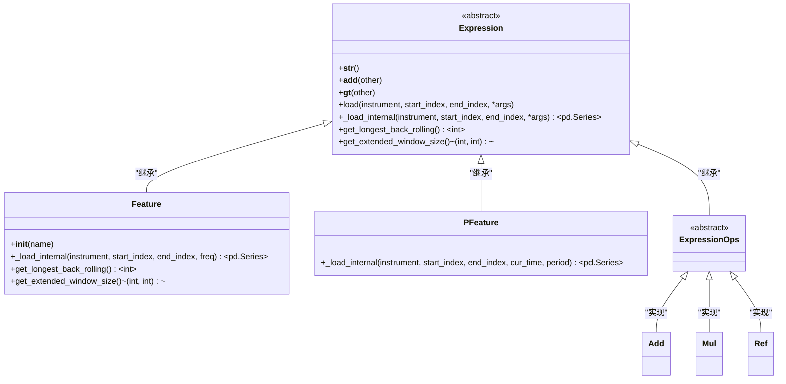
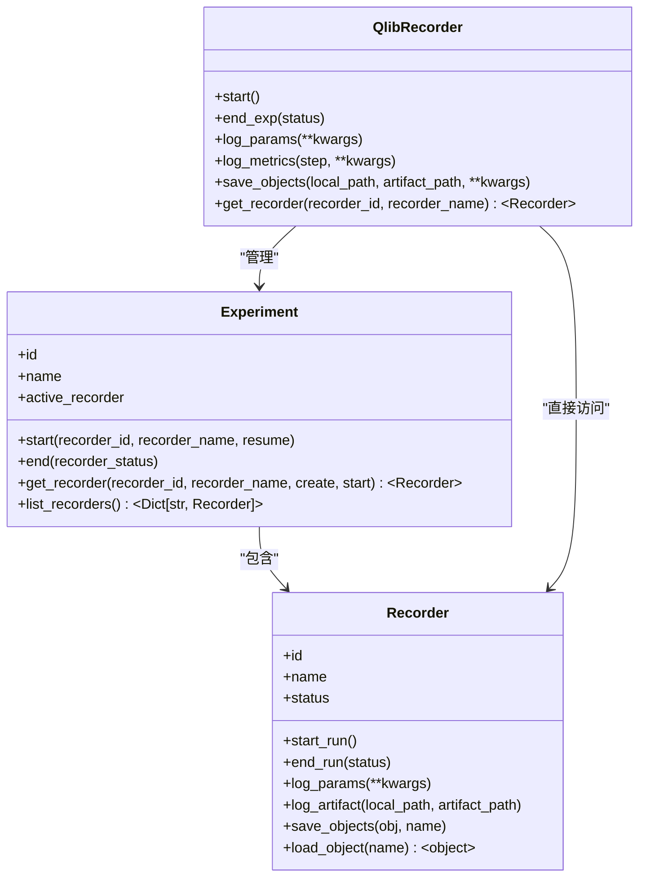
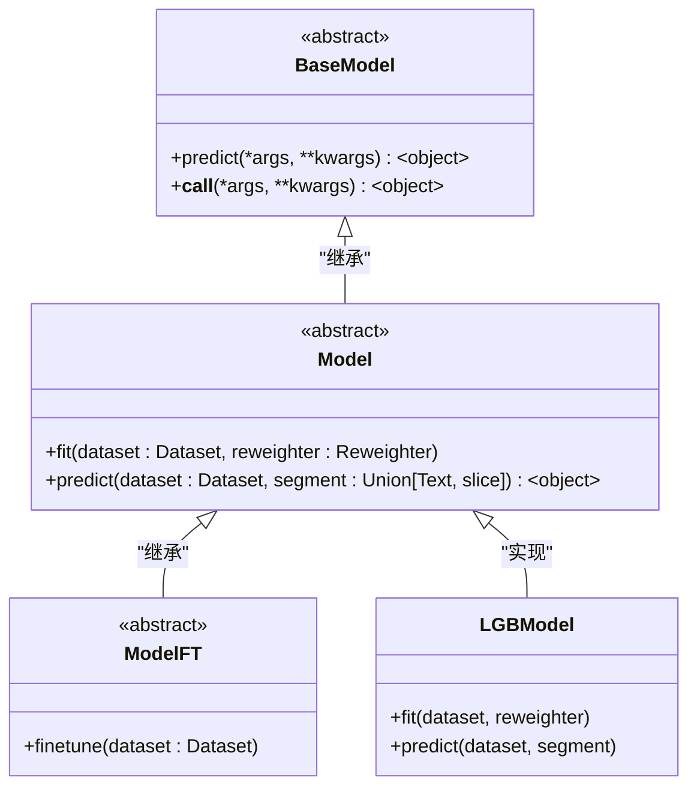
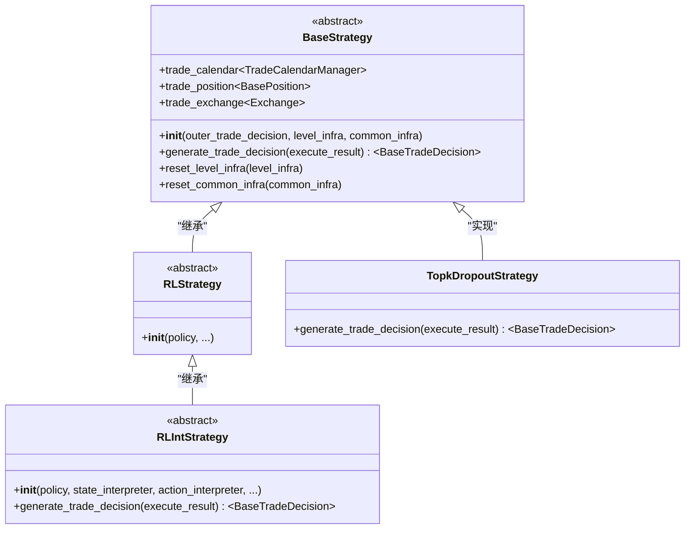
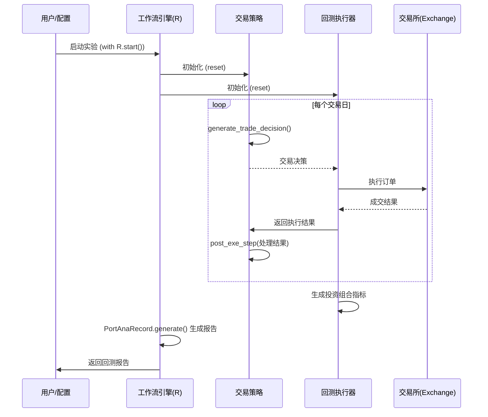

# 核心组件

<cite>
**本文档中引用的文件**   
- [__init__.py](file://qlib/data/__init__.py)
- [base.py](file://qlib/data/base.py)
- [data.py](file://qlib/data/data.py)
- [__init__.py](file://qlib/model/__init__.py)
- [base.py](file://qlib/model/base.py)
- [__init__.py](file://qlib/workflow/__init__.py)
- [exp.py](file://qlib/workflow/exp.py)
- [__init__.py](file://qlib/strategy/__init__.py)
- [base.py](file://qlib/strategy/base.py)
- [__init__.py](file://qlib/backtest/__init__.py)
- [backtest.py](file://qlib/backtest/backtest.py)
- [workflow_config_lightgbm_Alpha158.yaml](file://examples/benchmarks/LightGBM/workflow_config_lightgbm_Alpha158.yaml)
- [workflow_config_lightgbm_Alpha360.yaml](file://examples/benchmarks/LightGBM/workflow_config_lightgbm_Alpha360.yaml)
- [workflow_by_code.py](file://examples/workflow_by_code.py)
</cite>

## 目录
1. [引言](#引言)
2. [数据管理](#数据管理)
3. [工作流引擎](#工作流引擎)
4. [模型系统](#模型系统)
5. [交易策略](#交易策略)
6. [回测报告](#回测报告)
7. [组件集成与松耦合设计](#组件集成与松耦合设计)

## 引言

本文档旨在系统性地介绍 QLib 平台的五大核心支柱：数据管理、工作流引擎、模型系统、交易策略和回测报告。QLib 是一个模块化设计的量化研究平台，其核心设计理念是通过松耦合的组件和基于配置文件的集成方式，为用户提供灵活、可扩展的研究框架。本文将深入剖析各组件的设计哲学、关键类结构及其协同工作机制，例如数据层如何为模型提供特征输入，工作流如何协调模型训练与回测执行，以及策略如何基于模型信号生成交易指令。同时，文档将为每个核心组件提供高层 API 使用示例，并指出其在 `examples` 目录中的对应实现案例。

**组件集成与松耦合设计**
- [__init__.py](file://qlib/data/__init__.py#L1-L67)
- [__init__.py](file://qlib/model/__init__.py#L1-L10)
- [__init__.py](file://qlib/workflow/__init__.py#L1-L682)
- [__init__.py](file://qlib/strategy/__init__.py#L1-L3)
- [__init__.py](file://qlib/backtest/__init__.py#L1-L350)

## 数据管理

数据管理组件是 QLib 的基石，负责提供高效、灵活的金融数据访问和处理能力。其核心设计围绕 `Expression`（表达式）和 `Feature`（特征）展开，允许用户以声明式的方式定义和计算复杂的金融指标。

该组件的关键类结构包括：
- **`Expression` (表达式)**: 所有数据计算操作的抽象基类。它通过重载 Python 的运算符（如 `+`, `-`, `>`, `<` 等），允许用户像编写数学公式一样构建复杂的特征。例如，`$close / Ref($close, -1) - 1` 可以直接表示为 `Feature("close") / Ref(Feature("close"), -1) - 1`。
- **`Feature` (特征)**: 继承自 `Expression`，代表一个具体的、可从数据源加载的原始特征（如收盘价 `$close`）。它通过 `load` 方法从底层数据存储中获取数据，并利用缓存机制（`H["f"]`）避免重复计算。
- **`PFeature` (点对时特征)**: 一种特殊的特征，用于处理点对时（Point-in-Time, PIT）数据，这类数据在不同时间点可能被修正（如财报数据）。
- **`ExpressionOps` (表达式操作)**: 代表由其他表达式组合而成的复合操作，如 `Add`, `Mul`, `Ref` 等，它们构成了特征工程的原子操作。

数据管理组件通过 `D` 对象（位于 `qlib.data`）提供统一的访问接口，用户可以通过 `D.features()` 等方法来获取计算后的特征数据。其设计哲学是将数据的“定义”与“计算”分离，使得特征可以在不同的上下文中被复用。



**图源**
- [base.py](file://qlib/data/base.py#L13-L282)

**数据管理**
- [base.py](file://qlib/data/base.py#L13-L282)
- [data.py](file://qlib/data/data.py#L1-L200)
- [__init__.py](file://qlib/data/__init__.py#L1-L67)

## 工作流引擎

工作流引擎是 QLib 的核心协调者，负责管理整个研究实验的生命周期，包括模型训练、预测、回测和结果记录。它借鉴了 MLflow 的设计理念，但提供了更符合量化研究习惯的 API。

其核心组件包括：
- **`QlibRecorder`**: 全局的记录器对象（通常通过别名 `R` 使用），是用户与工作流引擎交互的主要入口。它提供了 `start()`, `log_params()`, `log_metrics()`, `save_objects()` 等高层 API。
- **`Experiment` (实验)**: 代表一个完整的量化研究项目。一个实验可以包含多个 `Recorder`（记录器）。
- **`Recorder` (记录器)**: 代表实验中的一个具体任务，如一次模型训练或一次回测。它负责记录该任务的所有参数、指标、模型对象和分析报告。

工作流引擎通过 `with R.start()` 上下文管理器来启动一个实验。在此上下文中，所有通过 `R` 记录的日志和对象都会被自动关联到当前的 `Recorder`。这种设计极大地简化了实验的追踪和复现。

**高层 API 使用示例**:
```python
from qlib.workflow import R

# 启动一个名为 "workflow" 的实验
with R.start(experiment_name="workflow"):
    # 记录超参数
    R.log_params(learning_rate=0.01, num_leaves=210)
    # 训练模型
    model.fit(dataset)
    # 保存训练好的模型对象
    R.save_objects(model=model)
    # 获取当前记录器以进行更精细的操作
    recorder = R.get_recorder()
```

此示例在 `examples/workflow_by_code.py` 文件中有完整的实现。



**图源**
- [__init__.py](file://qlib/workflow/__init__.py#L26-L682)
- [exp.py](file://qlib/workflow/exp.py#L15-L380)

**工作流引擎**
- [__init__.py](file://qlib/workflow/__init__.py#L1-L682)
- [exp.py](file://qlib/workflow/exp.py#L1-L380)

## 模型系统

模型系统是 QLib 中用于机器学习模型开发和训练的核心模块。它定义了统一的模型接口，使得不同类型的模型（如 GBDT、深度学习模型）可以无缝地集成到整个研究流程中。

其核心类结构为：
- **`BaseModel` (基础模型)**: 所有模型的抽象基类，定义了 `predict()` 方法。
- **`Model` (模型)**: 继承自 `BaseModel`，是可学习模型的主要基类。它定义了 `fit()` 方法用于模型训练，并通过 `__call__` 方法使其行为像一个函数。
- **`ModelFT` (可微调模型)**: 继承自 `Model`，为支持模型微调（Fine-tuning）的模型提供了 `finetune()` 方法。

所有具体的模型实现（如 `LGBModel`, `PyTorch` 模型等）都必须继承自 `Model` 或 `ModelFT`，并实现 `fit` 和 `predict` 方法。这种设计确保了模型接口的一致性，使得工作流引擎可以以统一的方式调用任何模型。

**高层 API 使用示例**:
```python
# 假设 model 和 dataset 已经通过配置或代码初始化
model.fit(dataset)  # 训练模型
predictions = model.predict(dataset, segment="test")  # 在测试集上进行预测
```

在 `examples/benchmarks/LightGBM/workflow_config_lightgbm_Alpha158.yaml` 配置文件中，`task.model` 部分定义了具体的模型类型和超参数。



**图源**
- [base.py](file://qlib/model/base.py#L10-L111)
- [__init__.py](file://qlib/model/__init__.py#L1-L10)

**模型系统**
- [base.py](file://qlib/model/base.py#L1-L111)
- [__init__.py](file://qlib/model/__init__.py#L1-L10)

## 交易策略

交易策略组件负责将模型生成的信号（如股票排名或收益率预测）转化为具体的交易指令（买入、卖出、持有）。它定义了策略执行的通用接口。

其核心是 `BaseStrategy` 类：
- **`BaseStrategy` (基础策略)**: 所有策略的基类。它通过 `generate_trade_decision()` 抽象方法定义了策略的核心逻辑，即在每个交易周期生成交易决策。该类还管理着与回测相关的基础设施，如交易日历、账户和交易所。
- **`RLStrategy` 和 `RLIntStrategy`**: 为基于强化学习的策略提供的特定基类。

策略通过 `outer_trade_decision` 参数接收来自上层的决策（例如，一个组合管理策略可能会接收一个选股策略的决策），并在此基础上进行进一步的处理（如拆单）。

**高层 API 使用示例**:
```python
# 在配置文件中定义策略
strategy_config = {
    "class": "TopkDropoutStrategy",
    "module_path": "qlib.contrib.strategy",
    "kwargs": {
        "signal": "<PRED>",  # 表示使用模型的预测结果作为信号
        "topk": 50,          # 选择排名前50的股票
        "n_drop": 5          # 随机剔除5只，以降低冲击成本
    }
}
```

此配置在 `examples/benchmarks/LightGBM/workflow_config_lightgbm_Alpha158.yaml` 文件的 `port_analysis_config.strategy` 部分有具体体现。



**图源**
- [base.py](file://qlib/strategy/base.py#L23-L297)
- [__init__.py](file://qlib/strategy/__init__.py#L1-L3)

**交易策略**
- [base.py](file://qlib/strategy/base.py#L1-L297)
- [__init__.py](file://qlib/strategy/__init__.py#L1-L3)

## 回测报告

回测报告组件负责模拟交易执行过程并生成详细的绩效分析报告。它由两个主要部分组成：回测执行器和报告生成器。

- **回测执行器 (`BaseExecutor`)**: 负责模拟交易的执行。它根据策略生成的交易决策，在模拟的市场环境中执行订单，并处理交易成本、涨跌停限制等现实约束。`SimulatorExecutor` 是其主要实现。
- **报告生成器**: 负责计算和可视化回测结果。`PortAnaRecord` 是一个关键的记录模板，它利用 `backtest` 模块中的功能来生成投资组合的绩效指标（如年化收益率、夏普比率、最大回撤等）和分析图表。

回测过程通过 `backtest()` 函数协调，该函数接收策略和执行器作为输入，运行整个回测循环，并返回绩效指标。

**高层 API 使用示例**:
```python
# 在配置文件中定义回测参数
backtest_config = {
    "start_time": "2017-01-01",
    "end_time": "2020-08-01",
    "account": 100000000,
    "benchmark": "SH000300",
    "exchange_kwargs": {
        "limit_threshold": 0.095,
        "deal_price": "close",
        "open_cost": 0.0005,
        "close_cost": 0.0015,
        "min_cost": 5
    }
}
```

此配置在 `examples/benchmarks/LightGBM/workflow_config_lightgbm_Alpha158.yaml` 文件的 `port_analysis_config.backtest` 部分有具体体现。



**图源**
- [__init__.py](file://qlib/backtest/__init__.py#L32-L350)
- [backtest.py](file://qlib/backtest/backtest.py#L26-L111)

**回测报告**
- [__init__.py](file://qlib/backtest/__init__.py#L1-L350)
- [backtest.py](file://qlib/backtest/backtest.py#L1-L111)

## 组件集成与松耦合设计

QLib 的五大支柱通过精心设计的接口和配置文件实现了高度的松耦合。这种设计允许用户独立地替换或升级任何一个组件，而无需修改其他部分的代码。

**集成方式**:
1.  **基于配置文件的集成**: 这是最主要的集成方式。如 `workflow_config_lightgbm_Alpha158.yaml` 所示，一个 YAML 配置文件可以清晰地定义整个工作流，包括数据集、模型、策略和回测参数。每个组件都通过 `class` 和 `module_path` 来指定其具体实现，通过 `kwargs` 传递参数。
2.  **基于代码的集成**: 对于更复杂的场景，用户可以直接在 Python 代码中使用 `init_instance_by_config` 函数来实例化各个组件，并通过工作流引擎 `R` 将它们串联起来，如 `examples/workflow_by_code.py` 所示。

**协同工作机制**:
1.  **数据流**: `数据管理` 组件根据 `Dataset` 配置加载和处理原始数据，生成特征。`模型系统` 使用这些特征进行训练和预测。
2.  **控制流**: `工作流引擎` 协调整个流程。它首先启动一个实验，然后调用 `模型系统` 进行训练，将训练好的模型传递给 `交易策略`。
3.  **执行流**: `交易策略` 生成交易信号，`回测报告` 组件中的 `执行器` 模拟执行这些信号，并将结果反馈给策略。最终，`工作流引擎` 收集所有结果并生成报告。

这种松耦合的设计使得 QLib 极其灵活，用户可以轻松地尝试不同的模型、策略或数据特征，而平台会自动处理它们之间的集成。

**组件集成与松耦合设计**
- [workflow_config_lightgbm_Alpha158.yaml](file://examples/benchmarks/LightGBM/workflow_config_lightgbm_Alpha158.yaml#L1-L72)
- [workflow_config_lightgbm_Alpha360.yaml](file://examples/benchmarks/LightGBM/workflow_config_lightgbm_Alpha360.yaml#L1-L79)
- [workflow_by_code.py](file://examples/workflow_by_code.py#L1-L86)