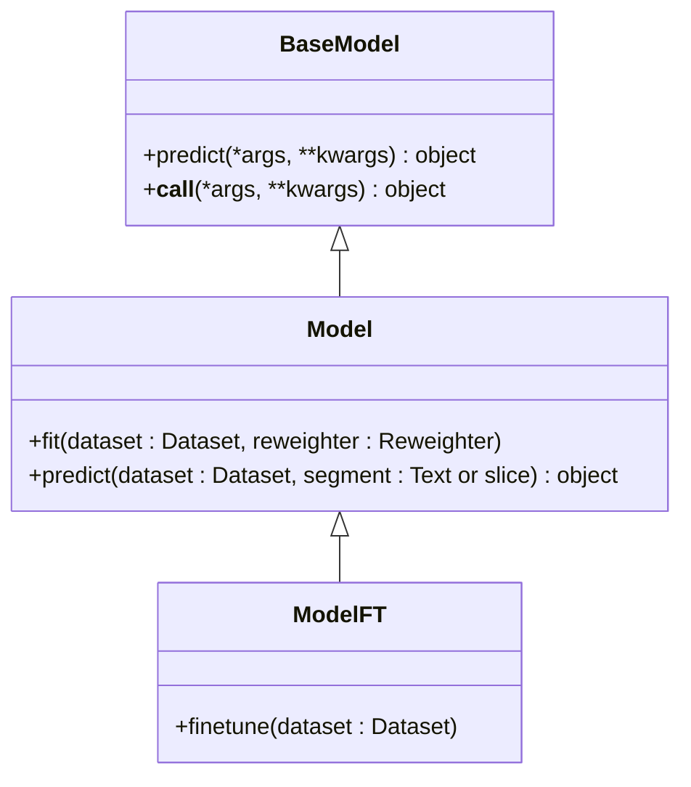
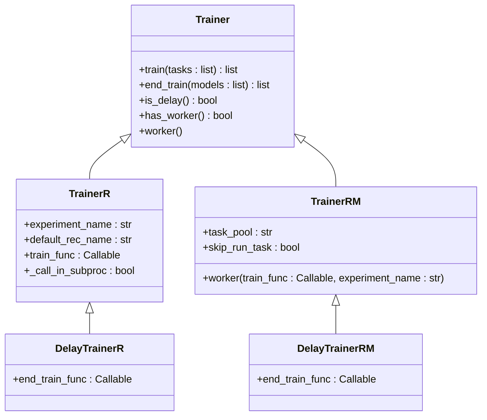
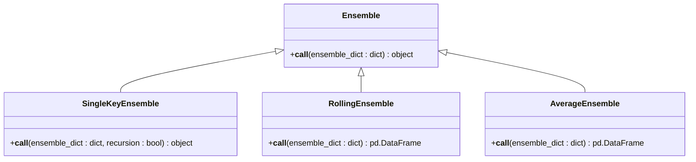
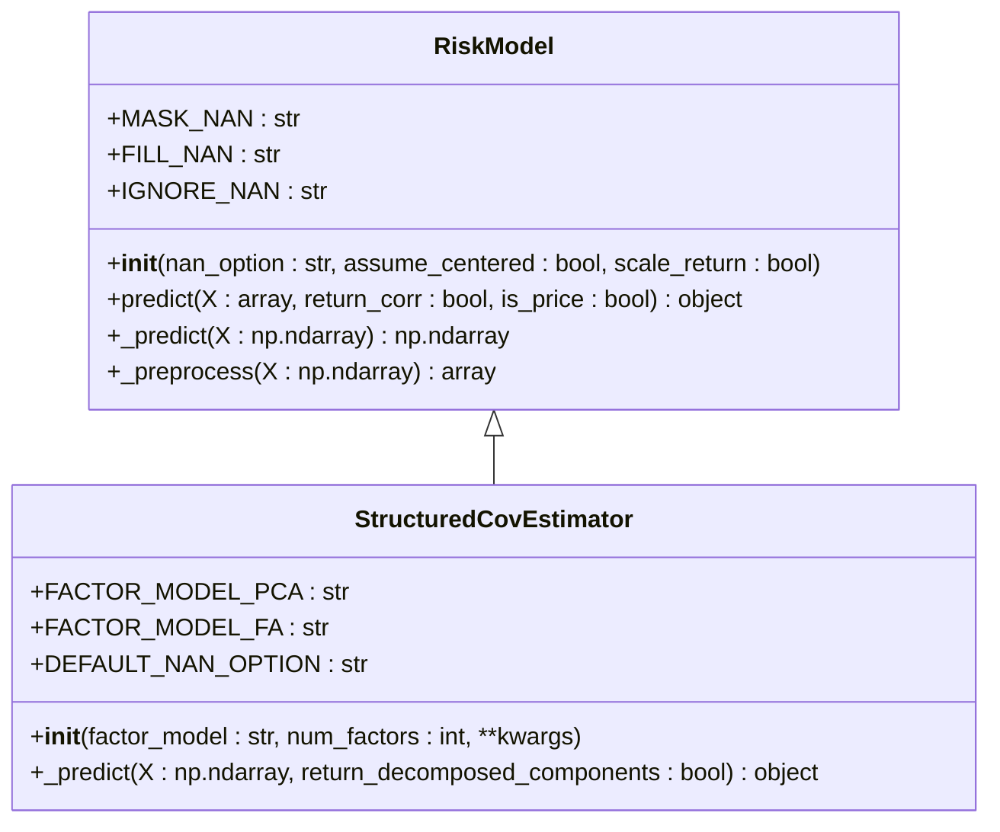
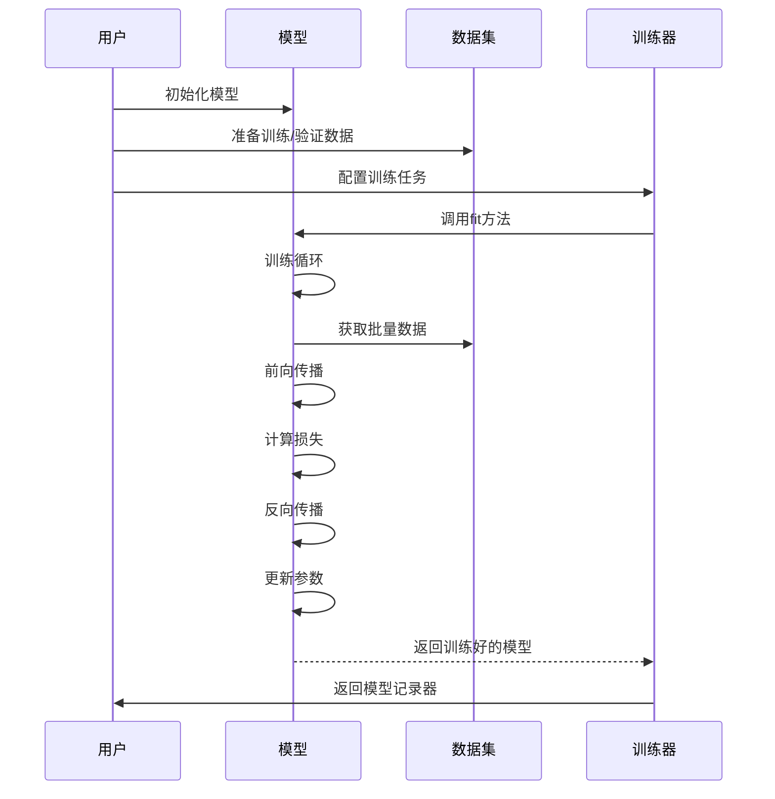
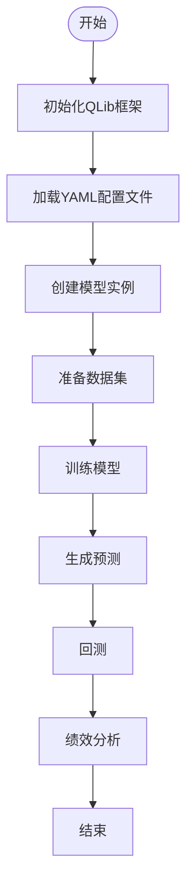

# 模型框架

<cite>
**本文档中引用的文件**  
- [base.py](file://qlib/model/base.py)
- [trainer.py](file://qlib/model/trainer.py)
- [ensemble.py](file://qlib/model/ens/ensemble.py)
- [structured.py](file://qlib/model/riskmodel/structured.py)
- [base.py](file://qlib/model/riskmodel/base.py)
- [pytorch_transformer.py](file://qlib/contrib/model/pytorch_transformer.py)
- [gbdt.py](file://qlib/contrib/model/gbdt.py)
- [workflow_config_lightgbm_Alpha158.yaml](file://examples/benchmarks/LightGBM/workflow_config_lightgbm_Alpha158.yaml)
- [workflow_config_transformer_Alpha158.yaml](file://examples/benchmarks/Transformer/workflow_config_transformer_Alpha158.yaml)
- [test_structured_cov_estimator.py](file://tests/test_structured_cov_estimator.py)
- [group.py](file://qlib/model/ens/group.py)
- [model.py](file://qlib/model/meta/model.py)
</cite>

## 目录
1. [引言](#引言)
2. [基础模型接口](#基础模型接口)
3. [模型训练器](#模型训练器)
4. [集成学习模块](#集成学习模块)
5. [风险模型](#风险模型)
6. [自定义模型开发](#自定义模型开发)
7. [基准测试与工作流配置](#基准测试与工作流配置)
8. [结论](#结论)

## 引言

本文档全面解析QLib框架中的模型体系，涵盖从基础模型接口到复杂集成方法的完整设计。我们将深入探讨`Model`基类的契约定义、模型训练器的统一管理机制、集成学习模块的多种组合策略，以及风险模型在投资组合优化中的应用。同时，通过分析LightGBM和Transformer等具体实现，展示如何开发和注册自定义模型，并通过基准测试示例说明模型在实际研究工作流中的配置与调用方式。

## 基础模型接口

QLib框架中的模型体系以`Model`基类为核心，定义了机器学习模型的基本契约。该基类继承自`BaseModel`并实现了`Serializable`接口，确保模型可以被序列化和持久化。

`Model`类定义了两个核心方法：`fit`和`predict`。`fit`方法用于从数据集中学习模型参数，接收`Dataset`对象和`Reweighter`作为输入，其中`Dataset`负责生成用于模型训练的预处理数据。`predict`方法则用于在给定数据集上进行预测，支持指定数据段（如"test"）作为输入。

此外，框架还定义了`ModelFT`（可微调模型）接口，扩展了`finetune`方法，支持在已有模型基础上进行增量训练。这种设计模式允许用户在不同数据集上进行模型初始化和微调，特别适用于在线学习和迁移学习场景。

**图源**
- [base.py](file://qlib/model/base.py#L10-L111)

**本节来源**
- [base.py](file://qlib/model/base.py#L10-L111)

## 模型训练器

模型训练器（Trainer）是QLib框架中统一管理模型训练过程的核心组件。框架提供了多种训练器实现，包括`TrainerR`和`TrainerRM`，分别基于记录器（Recorder）和任务管理器（TaskManager）实现。

`Trainer`类定义了`train`和`end_train`两个关键方法，实现了"延迟训练"（DelayTrainer）的概念。在`train`阶段，训练器主要进行必要的信息准备和保存；在`end_train`阶段，才执行实际的模型拟合和耗时操作。这种设计特别适用于在线模拟和并行训练场景。

`TrainerR`是最简单的实现，以线性方式训练任务列表并返回模型记录器列表。而`TrainerRM`则基于`TaskManager`实现，支持多进程方式的并行训练，能够更高效地管理任务生命周期。

**图源**
- [trainer.py](file://qlib/model/trainer.py#L131-L620)

**本节来源**
- [trainer.py](file://qlib/model/trainer.py#L131-L620)

## 集成学习模块

集成学习模块（ens/ensemble.py）提供了多种模型集成策略，用于合并多个子模型的预测结果。该模块的核心是`Ensemble`基类，定义了集成操作的基本接口。

框架实现了三种主要的集成策略：
1. **SingleKeyEnsemble**：当字典中只有一个键值对时，提取其值作为结果，使结果更简洁易读。
2. **RollingEnsemble**：用于合并滚动数据帧（如预测值或IC值），按时间索引排序并处理重复预测。
3. **AverageEnsemble**：对具有相同形状的数据帧进行平均和标准化处理，首先展平嵌套字典，然后按时间分组进行标准化，最后计算均值。

这些集成策略在多模型组合和时间序列预测中特别有用，能够有效提升预测的稳定性和准确性。

**图源**
- [ensemble.py](file://qlib/model/ens/ensemble.py#L14-L133)

**本节来源**
- [ensemble.py](file://qlib/model/ens/ensemble.py#L14-L133)

## 风险模型

风险模型模块（riskmodel/）提供了多种协方差矩阵估计方法，特别适用于投资组合优化场景。核心实现是`StructuredCovEstimator`，它基于结构化协方差估计理论，假设观测值可以由多个因子预测。

该模型支持两种潜在因子模型：
- **主成分分析（PCA）**：统计风险模型（SRM），通过主成分提取潜在因子
- **因子分析（FA）**：通过统计方法识别潜在因子

模型假设观测值X可以表示为`X = B @ F.T + U`，其中F是因子暴露矩阵，B是回归系数矩阵，U是残差矩阵。协方差矩阵的估计公式为`cov(X.T) = F @ cov(B.T) @ F.T + diag(var(U))`。

**图源**
- [structured.py](file://qlib/model/riskmodel/structured.py#L11-L95)
- [base.py](file://qlib/model/riskmodel/base.py#L12-L148)

**本节来源**
- [structured.py](file://qlib/model/riskmodel/structured.py#L11-L95)
- [base.py](file://qlib/model/riskmodel/base.py#L12-L148)

## 自定义模型开发

QLib框架通过`contrib/model/`目录支持自定义模型的开发和注册。该目录包含了多种预实现的模型，如LightGBM、XGBoost、PyTorch神经网络等，为开发者提供了良好的参考实现。

以`pytorch_transformer.py`中的`TransformerModel`为例，该类继承自`Model`基类，实现了完整的深度学习模型接口。模型初始化时配置超参数，`fit`方法实现训练循环，包括数据准备、模型训练、验证和早停机制，而`predict`方法则用于生成预测结果。

模型的注册通过`__init__.py`文件中的导入语句实现，将各个模型类暴露给框架。这种设计模式使得新模型的添加变得简单直接，只需在相应模块中实现模型类并将其导入即可。

**图源**
- [pytorch_transformer.py](file://qlib/contrib/model/pytorch_transformer.py#L27-L286)
- [gbdt.py](file://qlib/contrib/model/gbdt.py#L16-L127)

**本节来源**
- [pytorch_transformer.py](file://qlib/contrib/model/pytorch_transformer.py#L27-L286)
- [gbdt.py](file://qlib/contrib/model/gbdt.py#L16-L127)

## 基准测试与工作流配置

QLib框架通过YAML配置文件定义模型训练和评估的工作流，`examples/benchmarks/`目录中的示例展示了完整的配置方法。

以LightGBM和Transformer的配置文件为例，工作流配置主要包括：
1. **qlib_init**：框架初始化参数，如数据路径和区域
2. **task.model**：模型配置，指定模型类、模块路径和超参数
3. **task.dataset**：数据集配置，定义数据处理器和时间分段
4. **task.record**：记录器配置，用于生成预测、回测和分析报告

这种声明式的配置方式使得实验的复现和比较变得简单，用户可以通过修改配置文件快速尝试不同的模型和参数组合。

**图源**
- [workflow_config_lightgbm_Alpha158.yaml](file://examples/benchmarks/LightGBM/workflow_config_lightgbm_Alpha158.yaml#L1-L72)
- [workflow_config_transformer_Alpha158.yaml](file://examples/benchmarks/Transformer/workflow_config_transformer_Alpha158.yaml#L1-L88)

**本节来源**
- [workflow_config_lightgbm_Alpha158.yaml](file://examples/benchmarks/LightGBM/workflow_config_lightgbm_Alpha158.yaml#L1-L72)
- [workflow_config_transformer_Alpha158.yaml](file://examples/benchmarks/Transformer/workflow_config_transformer_Alpha158.yaml#L1-L88)

## 结论

QLib的模型框架提供了一个完整、灵活且可扩展的机器学习解决方案。通过清晰的基类契约、统一的训练器管理、多样化的集成策略和专业的风险模型，框架为量化研究提供了坚实的基础。自定义模型的开发模式和声明式的工作流配置使得新模型的实现和实验变得简单高效。整体架构设计体现了模块化、可复现和易于扩展的特点，为量化投资研究提供了强大的工具支持。