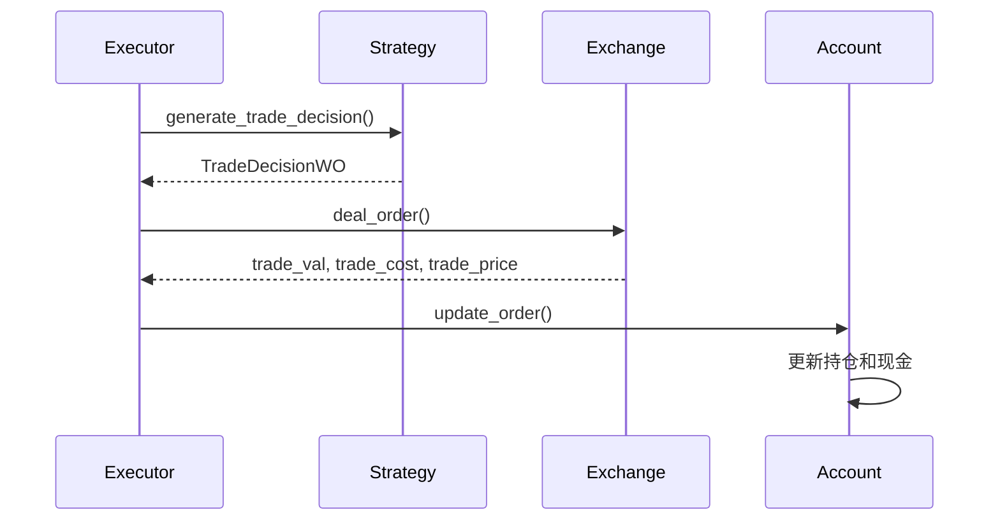
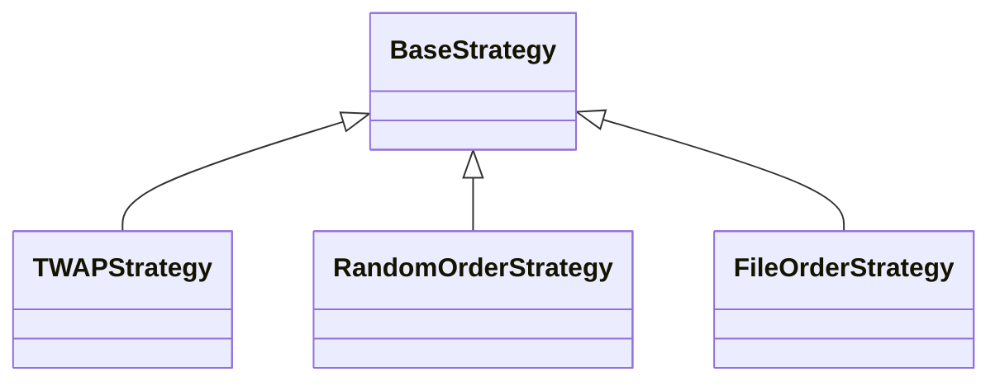
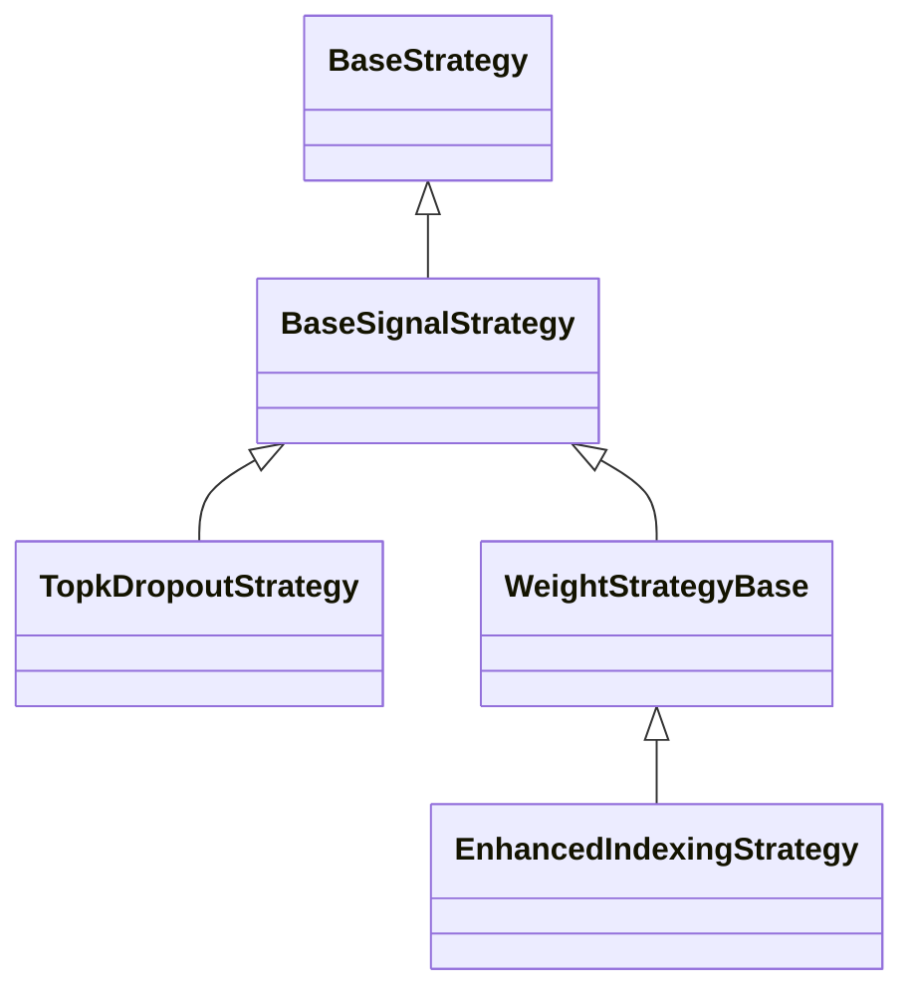

# 策略引擎

<cite>
**本文档引用的文件**  
- [base.py](file://qlib/strategy/base.py)
- [decision.py](file://qlib/backtest/decision.py)
- [executor.py](file://qlib/backtest/executor.py)
- [rule_strategy.py](file://qlib/contrib/strategy/rule_strategy.py)
- [signal_strategy.py](file://qlib/contrib/strategy/signal_strategy.py)
- [exchange.py](file://qlib/backtest/exchange.py)
- [account.py](file://qlib/backtest/account.py)
- [position.py](file://qlib/backtest/position.py)
- [workflow_by_code.py](file://examples/workflow_by_code.py)
</cite>

## 目录
1. [引言](#引言)
2. [策略基类设计](#策略基类设计)
3. [决策与执行机制](#决策与执行机制)
4. [内置策略实现](#内置策略实现)
5. [回测系统集成](#回测系统集成)
6. [自定义策略开发](#自定义策略开发)
7. [结论](#结论)

## 引言
策略引擎是连接模型信号与交易执行的核心组件，作为量化投资系统中的关键桥梁，它负责将模型生成的预测信号转化为具体的买卖指令。在 QLib 框架中，策略引擎通过清晰的接口定义和灵活的扩展机制，实现了从信号到交易的完整闭环。本文档将详细阐述策略引擎的设计原理与实现机制，包括策略接口的定义、决策生成与执行器的协同工作、内置策略的实现方式，以及如何与回测系统集成以支持成本控制和滑点模拟等现实交易约束。

## 策略基类设计

策略引擎的核心是 `BaseStrategy` 基类，它定义了所有策略必须遵循的接口和基本行为。该基类通过抽象方法 `generate_trade_decision` 强制子类实现决策生成逻辑，同时提供了访问交易环境所需的各种属性和方法。

`BaseStrategy` 的设计体现了高度的灵活性和可扩展性。它通过 `level_infra` 和 `common_infra` 两个基础设施对象，分别管理层级共享信息（如交易日历）和通用信息（如交易账户、交易所）。这种分层设计使得策略可以在不同的执行环境中复用，并支持嵌套执行等复杂场景。

策略通过 `outer_trade_decision` 参数接收来自上层策略的决策，这为实现分层交易策略（如将大额订单拆分为小额订单执行）提供了基础。此外，基类还定义了 `reset` 和 `_reset` 方法，允许用户在不干扰内部初始化逻辑的情况下，自定义策略的重置行为。

**Section sources**
- [base.py](file://qlib/strategy/base.py#L23-L297)

## 决策与执行机制

策略引擎的决策与执行机制由 `decision.py` 和 `executor.py` 两个模块协同完成。`BaseTradeDecision` 类封装了交易决策，包含具体的订单列表和可选的执行时间范围。订单（`Order`）是决策的基本单位，包含股票代码、交易数量、方向、时间范围等信息。

执行器（`BaseExecutor`）负责驱动整个交易流程。它通过 `collect_data` 方法与策略协同工作，形成一个生产者-消费者模式：策略作为生产者生成交易决策，执行器作为消费者执行这些决策。`SimulatorExecutor` 是一个具体的执行器实现，它模拟真实市场环境，根据订单信息与交易所（`Exchange`）交互，完成订单撮合。

执行流程是迭代式的：在每个交易步，执行器调用策略的 `generate_trade_decision` 方法获取决策，然后通过 `deal_order` 方法在交易所执行订单，并更新交易账户（`Account`）和持仓（`Position`）状态。这种设计使得策略可以基于最新的市场状态和持仓信息做出动态调整。



**Diagram sources**
- [decision.py](file://qlib/backtest/decision.py#L302-L597)
- [executor.py](file://qlib/backtest/executor.py#L22-L629)
- [exchange.py](file://qlib/backtest/exchange.py#L28-L959)
- [account.py](file://qlib/backtest/account.py#L71-L418)

**Section sources**
- [decision.py](file://qlib/backtest/decision.py#L1-L597)
- [executor.py](file://qlib/backtest/executor.py#L1-L629)

## 内置策略实现

QLib 提供了多种内置策略实现，主要位于 `contrib/strategy` 目录下，分为规则策略（`rule_strategy.py`）和信号策略（`signal_strategy.py`）两大类。

### 规则策略
规则策略基于预定义的交易规则生成决策。`TWAPStrategy` 实现了时间加权平均价格算法，将大额订单均匀分布在指定的交易时段内执行。`RandomOrderStrategy` 用于生成随机订单，常用于基准测试。`FileOrderStrategy` 允许用户从 CSV 文件中读取订单，便于回测历史交易记录。



**Diagram sources**
- [rule_strategy.py](file://qlib/contrib/strategy/rule_strategy.py#L1-L673)

### 信号策略
信号策略基于模型预测的信号生成交易决策。`TopkDropoutStrategy` 是一个典型的信号策略，它根据信号值选择排名靠前的股票构建投资组合，并定期轮换持仓。`EnhancedIndexingStrategy` 实现了增强型指数化策略，结合主动管理和被动管理的优点，在控制风险的同时追求超额收益。

`WeightStrategyBase` 是一个更通用的信号策略基类，它通过 `OrderGenerator` 将目标权重转换为具体的买卖订单。这种设计分离了目标组合生成和订单执行两个逻辑，提高了代码的可维护性和可扩展性。



**Diagram sources**
- [signal_strategy.py](file://qlib/contrib/strategy/signal_strategy.py#L1-L523)

**Section sources**
- [rule_strategy.py](file://qlib/contrib/strategy/rule_strategy.py#L1-L673)
- [signal_strategy.py](file://qlib/contrib/strategy/signal_strategy.py#L1-L523)

## 回测系统集成

策略引擎与回测系统深度集成，能够模拟现实交易中的各种约束和成本。`Exchange` 类是回测系统的核心，它提供了市场数据查询、订单撮合、成本计算等功能。

### 成本控制
交易所支持多种成本模型，包括开仓成本（`open_cost`）、平仓成本（`close_cost`）和最低交易成本（`min_cost`）。这些成本在 `deal_order` 方法中被计算并从交易账户中扣除，确保回测结果的准确性。

### 滑点模拟
滑点（Slippage）是实际交易中不可避免的现象。QLib 通过 `impact_cost` 参数模拟市场冲击成本，即大额订单对市场价格的影响。此外，`deal_price` 参数允许用户指定不同的成交价计算方式（如收盘价、成交量加权平均价），以更真实地模拟不同交易场景。

### 交易限制
交易所还支持多种交易限制，如涨跌停板限制（`limit_threshold`）和交易量限制（`volume_threshold`）。这些限制确保策略不会在股票停牌或涨停时尝试交易，提高了回测的现实性。

**Section sources**
- [exchange.py](file://qlib/backtest/exchange.py#L1-L959)
- [account.py](file://qlib/backtest/account.py#L1-L418)
- [position.py](file://qlib/backtest/position.py#L1-L566)

## 自定义策略开发

开发自定义策略需要继承 `BaseStrategy` 或其子类，并实现 `generate_trade_decision` 方法。以下是一个简单的自定义策略示例：

```python
from qlib.strategy.base import BaseStrategy
from qlib.backtest.decision import TradeDecisionWO, Order

class MyStrategy(BaseStrategy):
    def __init__(self, my_param=1.0, **kwargs):
        super().__init__(**kwargs)
        self.my_param = my_param
        
    def generate_trade_decision(self, execute_result=None):
        # 获取当前交易时间
        trade_start_time, trade_end_time = self.trade_calendar.get_step_time()
        
        # 根据某种逻辑生成订单
        order_list = [
            Order(
                stock_id="SH600519",
                amount=1000,
                start_time=trade_start_time,
                end_time=trade_end_time,
                direction=Order.BUY,
            )
        ]
        
        return TradeDecisionWO(order_list, self)
```

在开发自定义策略时，需要注意以下几点：
1. **参数配置**：通过 `__init__` 方法接收配置参数，便于策略的复用和调整。
2. **状态管理**：使用实例变量存储策略状态，如已交易数量、信号值等，以便在不同交易步之间保持状态。
3. **事件响应**：利用 `execute_result` 参数获取上一步的执行结果，实现基于执行反馈的动态调整。

**Section sources**
- [base.py](file://qlib/strategy/base.py#L23-L297)
- [workflow_by_code.py](file://examples/workflow_by_code.py#L1-L86)

## 结论
策略引擎作为连接模型信号与交易执行的桥梁，在量化投资系统中扮演着至关重要的角色。QLib 的策略引擎设计精巧，通过清晰的接口定义、灵活的扩展机制和丰富的内置实现，为用户提供了强大的策略开发和回测能力。其与回测系统的深度集成，能够准确模拟现实交易中的各种约束和成本，确保回测结果的可靠性和有效性。通过理解和掌握策略引擎的设计原理与实现机制，用户可以开发出更加智能和高效的交易策略，从而在复杂的金融市场中获得竞争优势。