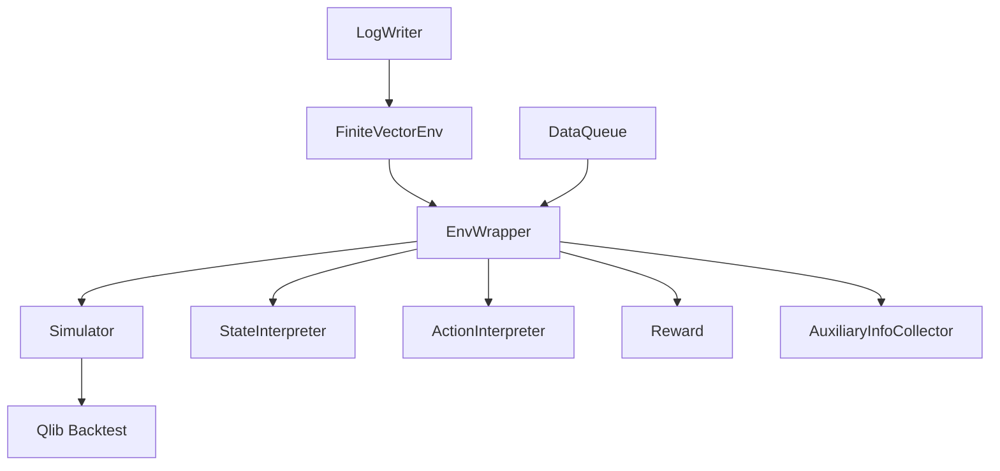
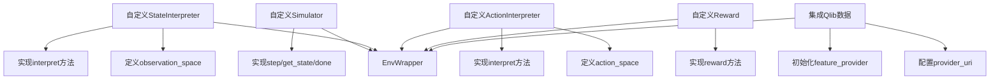

# 强化学习框架

<cite>
**本文档中引用的文件**  
- [env_wrapper.py](file://qlib/rl/utils/env_wrapper.py)
- [finite_env.py](file://qlib/rl/utils/finite_env.py)
- [simulator.py](file://qlib/rl/simulator.py)
- [aux_info.py](file://qlib/rl/aux_info.py)
- [interpreter.py](file://qlib/rl/interpreter.py)
- [reward.py](file://qlib/rl/reward.py)
- [simulator_qlib.py](file://qlib/rl/order_execution/simulator_qlib.py)
- [state.py](file://qlib/rl/order_execution/state.py)
- [integration.py](file://qlib/rl/data/integration.py)
- [single_order.py](file://qlib/rl/strategy/single_order.py)
- [interpreter.py](file://qlib/rl/order_execution/interpreter.py)
</cite>

## 目录
1. [引言](#引言)
2. [核心架构概述](#核心架构概述)
3. [环境封装机制](#环境封装机制)
4. [有限时间步长控制](#有限时间步长控制)
5. [市场模拟与订单执行](#市场模拟与订单执行)
6. [辅助信息注入机制](#辅助信息注入机制)
7. [自定义环境构建与Qlib集成](#自定义环境构建与qlib集成)
8. [多资产交易扩展](#多资产交易扩展)
9. [高级用例适用性](#高级用例适用性)
10. [结论](#结论)

## 引言
Qlib强化学习框架为金融交易场景提供了一套完整的强化学习解决方案。该框架通过将金融交易环境适配为标准的Gym兼容接口，实现了强化学习算法在量化投资领域的有效应用。本文档深入分析框架的核心架构与设计原理，重点阐述环境封装、时间步长控制、市场模拟和辅助信息注入等关键机制。

## 核心架构概述

**图源**  
- [env_wrapper.py](file://qlib/rl/utils/env_wrapper.py#L51-L251)
- [finite_env.py](file://qlib/rl/utils/finite_env.py#L89-L370)
- [simulator.py](file://qlib/rl/simulator.py#L21-L76)

**本节来源**  
- [env_wrapper.py](file://qlib/rl/utils/env_wrapper.py)
- [simulator.py](file://qlib/rl/simulator.py)

## 环境封装机制

Qlib强化学习框架通过`env_wrapper.py`中的`EnvWrapper`类实现环境封装机制，将金融交易环境适配为标准的Gym兼容接口。`EnvWrapper`作为Gym环境的子类，封装了模拟器、状态解释器、动作解释器、奖励函数和辅助信息收集器等组件。

`EnvWrapper`的核心功能包括：
- 通过`reset()`方法初始化模拟器并返回初始观测
- 通过`step()`方法执行策略动作并返回新的观测、奖励和完成状态
- 维护环境状态信息，包括当前步数、完成状态、初始状态和历史记录

环境封装机制实现了强化学习框架与金融交易逻辑的解耦，使得不同的交易策略可以复用相同的环境接口。

**本节来源**  
- [env_wrapper.py](file://qlib/rl/utils/env_wrapper.py#L51-L251)
- [interpreter.py](file://qlib/rl/interpreter.py#L19-L142)

## 有限时间步长控制

`finite_env.py`文件实现了有限时间步长的交易周期控制机制。该机制通过`FiniteVectorEnv`类及其子类（`FiniteDummyVectorEnv`、`FiniteSubprocVectorEnv`、`FiniteShmemVectorEnv`）来管理并行环境的工作周期。

核心控制机制包括：
- `generate_nan_observation()`函数生成表示环境耗尽的特殊观测值
- `check_nan_observation()`函数检测观测值是否为环境耗尽状态
- `FiniteVectorEnv`维护`_alive_env_ids`集合来跟踪活跃的环境实例
- 当环境队列耗尽时抛出`StopIteration`异常以终止收集过程

这种设计确保了每个初始状态（种子）仅被一个环境实例消费，解决了并行环境下状态重复或遗漏的问题。

**本节来源**  
- [finite_env.py](file://qlib/rl/utils/finite_env.py#L89-L370)
- [env_wrapper.py](file://qlib/rl/utils/env_wrapper.py#L190-L193)

## 市场模拟与订单执行

`simulator.py`定义了模拟器的基类`Simulator`，而`simulator_qlib.py`实现了基于Qlib回测工具的具体模拟器`SingleAssetOrderExecution`。

`SingleAssetOrderExecution`的主要功能包括：
- 基于Qlib的回测执行器（`NestedExecutor`）模拟市场动态
- 通过`collect_data_loop`生成交易决策循环
- 实现`step()`方法处理策略动作并推进模拟时间
- 提供`get_state()`方法返回当前交易状态
- 通过`done()`方法判断交易周期是否完成

模拟器与Qlib的数据层集成，能够真实反映市场流动性、交易成本和价格冲击等现实约束，为策略训练提供逼真的市场环境。

**本节来源**  
- [simulator.py](file://qlib/rl/simulator.py#L21-L76)
- [simulator_qlib.py](file://qlib/rl/order_execution/simulator_qlib.py#L19-L142)
- [integration.py](file://qlib/rl/data/integration.py#L18-L83)

## 辅助信息注入机制

`aux_info.py`文件定义了`AuxiliaryInfoCollector`类，实现了辅助信息注入机制。该机制在策略训练中具有重要价值，特别是在多智能体强化学习场景中。

辅助信息收集器的主要特点：
- 通过`collect()`方法从模拟器状态中提取定制化的辅助信息
- 收集的信息通过`info`字典返回给策略，不影响核心的奖励信号
- 可用于传递市场环境特征、交易对手行为等额外信息
- 支持在训练过程中监控和调试策略行为

这种设计使得框架能够灵活地扩展信息维度，同时保持核心强化学习循环的简洁性。

**本节来源**  
- [aux_info.py](file://qlib/rl/aux_info.py#L21-L44)
- [env_wrapper.py](file://qlib/rl/utils/env_wrapper.py#L226-L238)

## 自定义环境构建与Qlib集成

从自定义环境构建到与Qlib数据层集成的技术路径包括以下关键环节：

### 状态观测空间定义
通过`StateInterpreter`子类定义状态观测空间，如`FullHistoryStateInterpreter`将交易历史、市场数据等整合为策略可读的观测向量。

### 动作空间映射
通过`ActionInterpreter`子类实现动作空间映射，如`CategoricalActionInterpreter`将离散动作转换为连续交易量。

### 奖励信号注入
通过`Reward`子类定义奖励函数，如`PPOReward`结合价格优势和交易完成率计算综合奖励。

### Qlib数据集成
通过`init_qlib()`函数初始化Qlib配置，加载市场数据和特征，确保模拟器能够访问真实市场信息。

**图源**  
- [interpreter.py](file://qlib/rl/interpreter.py#L35-L98)
- [reward.py](file://qlib/rl/reward.py#L16-L51)
- [integration.py](file://qlib/rl/data/integration.py#L18-L83)

**本节来源**  
- [interpreter.py](file://qlib/rl/interpreter.py)
- [reward.py](file://qlib/rl/reward.py)
- [integration.py](file://qlib/rl/data/integration.py)

## 多资产交易扩展

框架支持通过扩展基础环境来实现多资产交易场景。扩展方法包括：

1. 修改`Simulator`以支持多资产订单组合
2. 扩展`StateInterpreter`以包含多资产市场数据
3. 设计新的`ActionInterpreter`以处理资产间分配决策
4. 实现组合层面的奖励函数

例如，可以通过继承`SingleAssetOrderExecution`创建`MultiAssetOrderExecution`，同时管理多个资产的交易执行，并考虑资产间的相关性和组合风险。

**本节来源**  
- [simulator_qlib.py](file://qlib/rl/order_execution/simulator_qlib.py#L19-L142)
- [state.py](file://qlib/rl/order_execution/state.py#L70-L102)
- [interpreter.py](file://qlib/rl/order_execution/interpreter.py#L68-L258)

## 高级用例适用性

Qlib强化学习框架在投资组合再平衡和动态对冲等高级用例中具有良好的适用性：

### 投资组合再平衡
- 将再平衡问题建模为多周期决策过程
- 使用资产配置比例作为状态特征
- 以交易成本和跟踪误差作为奖励函数组成部分
- 通过约束动作空间确保组合约束

### 动态对冲
- 将对冲比率作为策略输出
- 使用风险敞口和市场波动率作为状态输入
- 以对冲有效性作为主要奖励信号
- 考虑交易频率和成本的权衡

框架的模块化设计使得这些高级用例可以通过组合不同的解释器、奖励函数和模拟器来实现。

**本节来源**  
- [simulator_qlib.py](file://qlib/rl/order_execution/simulator_qlib.py)
- [reward.py](file://qlib/rl/reward.py)
- [interpreter.py](file://qlib/rl/interpreter.py)

## 结论
Qlib强化学习框架通过精心设计的架构实现了金融交易环境与强化学习算法的有效结合。环境封装机制、有限时间步长控制、市场模拟和辅助信息注入等核心组件共同构成了一个灵活、可扩展的强化学习平台。该框架不仅支持基础的单资产交易策略训练，还为多资产组合管理和高级量化策略开发提供了坚实的基础。