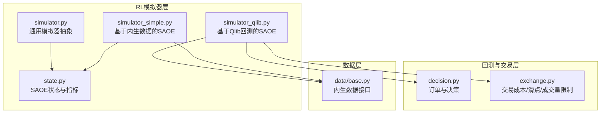
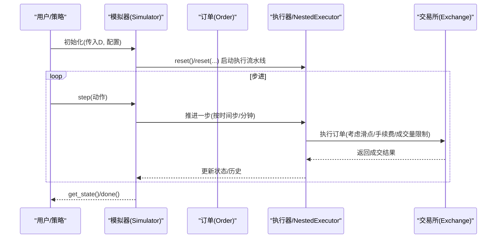
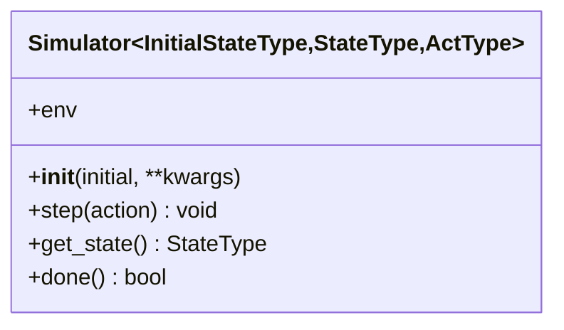
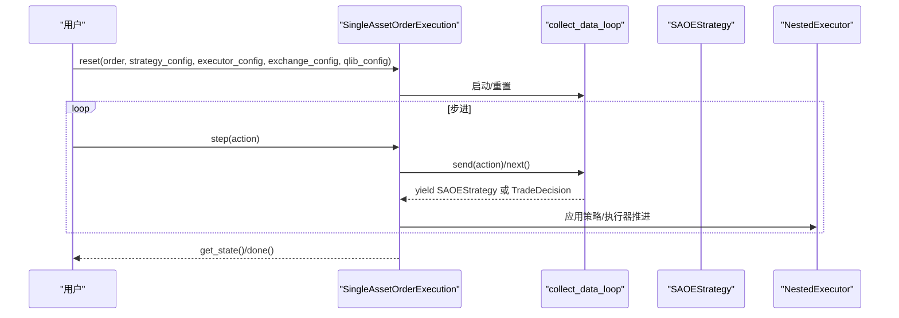
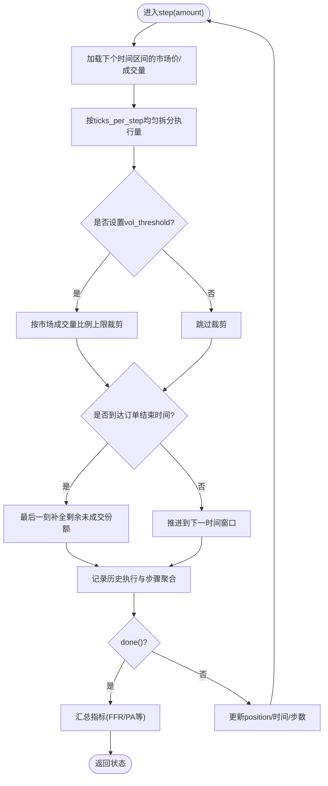
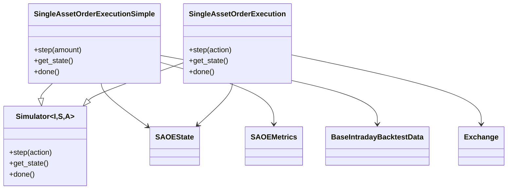

# 模拟器实现

<cite>
**本文引用的文件**
- [simulator.py](file://qlib/rl/simulator.py)
- [simulator_qlib.py](file://qlib/rl/order_execution/simulator_qlib.py)
- [simulator_simple.py](file://qlib/rl/order_execution/simulator_simple.py)
- [state.py](file://qlib/rl/order_execution/state.py)
- [decision.py](file://qlib/backtest/decision.py)
- [exchange.py](file://qlib/backtest/exchange.py)
- [base.py](file://qlib/rl/data/base.py)
- [test_qlib_simulator.py](file://tests/rl/test_qlib_simulator.py)
- [test_saoe_simple.py](file://tests/rl/test_saoe_simple.py)
- [README.md（RL示例）](file://examples/rl_order_execution/README.md)
</cite>

## 目录
1. [引言](#引言)
2. [项目结构](#项目结构)
3. [核心组件](#核心组件)
4. [架构总览](#架构总览)
5. [详细组件分析](#详细组件分析)
6. [依赖关系分析](#依赖关系分析)
7. [性能考虑](#性能考虑)
8. [故障排查指南](#故障排查指南)
9. [结论](#结论)
10. [附录](#附录)

## 引言
本文件系统性文档化QLIB中“单资产订单执行”模拟器的实现，重点聚焦以下目标：
- 全面阐述simulator.py作为通用模拟器基类的抽象设计与生命周期约束
- 深入解析两类模拟器在订单执行、市场动态模拟与交易成本计算中的差异与适用场景
- 对比分析simulator_qlib.py（深度集成Qlib回测系统）与simulator_simple.py（轻量级、快速迭代）的实现要点与边界条件
- 说明限价单、市价单与部分成交逻辑在两类模拟器中的体现与限制
- 给出从初始化模拟环境到执行完整交易序列的端到端示例路径
- 讨论高并发训练下的性能瓶颈与优化策略

## 项目结构
围绕“订单执行模拟器”的关键文件组织如下：
- 抽象基类与类型定义：simulator.py
- 状态与指标：state.py
- 数据接口：data/base.py
- 决策与订单：backtest/decision.py
- 交易成本与市场冲击：backtest/exchange.py
- 两类模拟器实现：
  - 基于Qlib回测框架的复杂模拟器：order_execution/simulator_qlib.py
  - 轻量级内生数据模拟器：order_execution/simulator_simple.py
- 测试用例与示例：tests/rl/* 与 examples/rl_order_execution/README.md

图表来源
- [simulator.py](file://qlib/rl/simulator.py#L1-L76)
- [simulator_qlib.py](file://qlib/rl/order_execution/simulator_qlib.py#L1-L142)
- [simulator_simple.py](file://qlib/rl/order_execution/simulator_simple.py#L1-L363)
- [state.py](file://qlib/rl/order_execution/state.py#L1-L102)
- [decision.py](file://qlib/backtest/decision.py#L1-L200)
- [exchange.py](file://qlib/backtest/exchange.py#L90-L289)
- [base.py](file://qlib/rl/data/base.py#L1-L66)

章节来源
- [simulator.py](file://qlib/rl/simulator.py#L1-L76)
- [simulator_qlib.py](file://qlib/rl/order_execution/simulator_qlib.py#L1-L142)
- [simulator_simple.py](file://qlib/rl/order_execution/simulator_simple.py#L1-L363)
- [state.py](file://qlib/rl/order_execution/state.py#L1-L102)
- [decision.py](file://qlib/backtest/decision.py#L1-L200)
- [exchange.py](file://qlib/backtest/exchange.py#L90-L289)
- [base.py](file://qlib/rl/data/base.py#L1-L66)

## 核心组件
- 通用模拟器抽象（Simulator）
  - 定义了“以初始状态创建、以step(action)推进、通过get_state()读取状态、done()判断终止”的统一生命周期
  - 明确外部模块仅能通过step与查询接口访问内部状态，避免直接修改
  - 支持泛型参数：初始状态类型、状态类型、动作类型，便于不同任务共享MDP组件
- 单资产订单执行状态（SAOEState/SAOEMetrics）
  - 提供执行历史、步骤聚合、价格优势（PA）等指标，支撑策略评估与报告生成
- 两类模拟器
  - Qlib版：基于NestedExecutor与策略-执行器流水线，可接入真实市场数据、交易成本、成交量限制与滑点
  - 简易版：基于内生pickle数据，按时间步拆分执行量，内置TWAP拆分与最后时刻补全逻辑

章节来源
- [simulator.py](file://qlib/rl/simulator.py#L1-L76)
- [state.py](file://qlib/rl/order_execution/state.py#L1-L102)
- [simulator_qlib.py](file://qlib/rl/order_execution/simulator_qlib.py#L1-L142)
- [simulator_simple.py](file://qlib/rl/order_execution/simulator_simple.py#L1-L363)

## 架构总览
两类模拟器均遵循Simulator抽象，但实现路径不同：
- Qlib版：通过get_strategy_executor构建策略-执行器嵌套流水线，使用collect_data_loop驱动状态推进，最终由NestedExecutor完成逐分钟/逐时段的订单执行与成本计算
- 简易版：直接加载内生数据（处理后的行情与特征），按ticks_per_step切分执行量，应用vol_threshold与最后时刻补全，计算平均成交价与PA等指标

图表来源
- [simulator_qlib.py](file://qlib/rl/order_execution/simulator_qlib.py#L60-L142)
- [decision.py](file://qlib/backtest/decision.py#L300-L597)
- [exchange.py](file://qlib/backtest/exchange.py#L90-L289)

## 详细组件分析

### 通用模拟器抽象（Simulator）
- 设计要点
  - 仅允许通过step(action)修改内部状态，外部只读
  - done()用于判定终止，终止后应销毁旧模拟器并创建新实例
  - 支持弱引用环境包装器，便于跨组件共享上下文
- 生命周期
  - 创建：__init__(initial, **kwargs)
  - 推进：step(action)
  - 查询：get_state()
  - 终止：done()

图表来源
- [simulator.py](file://qlib/rl/simulator.py#L1-L76)

章节来源
- [simulator.py](file://qlib/rl/simulator.py#L1-L76)

### Qlib版单资产订单执行模拟器（SingleAssetOrderExecution）
- 初始化与重置
  - 使用get_strategy_executor构建策略-执行器嵌套流水线，支持NestedExecutor与SimulatorExecutor组合
  - reset时根据order与配置初始化策略、执行器、回测数据循环器
- 步进逻辑
  - step(action)通过send(action)驱动collect_data_loop，直到yield出SAOEStrategy或完成
  - 支持action为None（自动推进）或指定每步执行量
- 状态与指标
  - get_state()返回SAOEState，包含当前时间、步数、剩余头寸、历史执行与步骤聚合、backtest数据索引等
  - twap_price用于PA计算
- 终止条件
  - done()委托给NestedExecutor.finished()

图表来源
- [simulator_qlib.py](file://qlib/rl/order_execution/simulator_qlib.py#L60-L142)

章节来源
- [simulator_qlib.py](file://qlib/rl/order_execution/simulator_qlib.py#L1-L142)

### 简易版单资产订单执行模拟器（SingleAssetOrderExecutionSimple）
- 初始化与数据加载
  - 通过get_backtest_data加载内生数据（处理后的行情与特征），支持两种兼容数据格式
  - 计算twap_price（订单时间段内的平均成交价）
- 步进逻辑
  - step(amount)将意图执行量按ticks_per_step均匀拆分
  - 应用vol_threshold（按市场成交量比例上限）进行裁剪
  - 最后时刻强制补全剩余未成交份额
  - 记录历史执行与步骤聚合指标
- 状态与指标
  - get_state()返回SAOEState，包含历史执行、步骤聚合、指标等
  - _metrics_collect计算平均成交价、交易价值、FFR、PA等
- 终止条件
  - done()当position接近0或超过订单结束时间

图表来源
- [simulator_simple.py](file://qlib/rl/order_execution/simulator_simple.py#L147-L327)

章节来源
- [simulator_simple.py](file://qlib/rl/order_execution/simulator_simple.py#L1-L363)

### 状态与指标（SAOEState/SAOEMetrics）
- SAOEMetrics
  - 包含股票ID、时间、方向、市场成交量/价格、策略意图量、成交额、平均成交价、交易价值、剩余头寸、完成比例(FFR)、价格优势(PA)等
- SAOEState
  - 封装当前时间、步数、剩余头寸、历史执行与步骤聚合、backtest数据索引、ticks_per_step等

章节来源
- [state.py](file://qlib/rl/order_execution/state.py#L1-L102)

### 订单与决策（Order/TradeDecision）
- Order
  - 定义股票代码、数量、方向、起止时间、已成交数量与因子等
  - 提供sign、amount_delta、deal_amount_delta等辅助属性
- TradeDecision与派生类
  - TradeDecisionWO/TradeDecisionWithDetails封装策略决策与可选细节
  - 支持按时间范围限制（IdxTradeRange/TradeRangeByTime）

章节来源
- [decision.py](file://qlib/backtest/decision.py#L1-L200)
- [decision.py](file://qlib/backtest/decision.py#L200-L597)

### 交易成本与市场冲击（Exchange）
- 关键参数
  - open_cost/close_cost/min_cost：开仓/平仓费率与最低费用
  - impact_cost：市场冲击成本率（滑点）
  - volume_threshold：成交量限制（支持“累计/当前”与按买卖区分）
  - deal_price：成交价选择（买/卖价或表达式）
- 成本计算与裁剪
  - 根据交易金额与总成交金额计算调整后的impact_cost
  - 平仓时按trade_unit四舍五入
  - 当现金不足以支付手续费或出现负值时，裁剪成交数量

章节来源
- [exchange.py](file://qlib/backtest/exchange.py#L90-L289)
- [exchange.py](file://qlib/backtest/exchange.py#L886-L917)

## 依赖关系分析
- 类继承与组合
  - SingleAssetOrderExecutionSimple继承Simulator[Order, SAOEState, float]
  - SingleAssetOrderExecution继承Simulator[Order, SAOEState, float]
  - 两者均依赖SAOEState/SAOEMetrics进行状态封装与指标计算
- 外部依赖
  - Qlib版：NestedExecutor、策略-执行器流水线、collect_data_loop
  - 简易版：内生数据接口（BaseIntradayBacktestData）、pickle数据加载
  - 交易成本：Exchange（open_cost/close_cost/impact_cost/volume_threshold）

图表来源
- [simulator.py](file://qlib/rl/simulator.py#L1-L76)
- [simulator_simple.py](file://qlib/rl/order_execution/simulator_simple.py#L1-L363)
- [simulator_qlib.py](file://qlib/rl/order_execution/simulator_qlib.py#L1-L142)
- [state.py](file://qlib/rl/order_execution/state.py#L1-L102)
- [base.py](file://qlib/rl/data/base.py#L1-L66)
- [exchange.py](file://qlib/backtest/exchange.py#L90-L289)

章节来源
- [simulator.py](file://qlib/rl/simulator.py#L1-L76)
- [simulator_simple.py](file://qlib/rl/order_execution/simulator_simple.py#L1-L363)
- [simulator_qlib.py](file://qlib/rl/order_execution/simulator_qlib.py#L1-L142)
- [state.py](file://qlib/rl/order_execution/state.py#L1-L102)
- [base.py](file://qlib/rl/data/base.py#L1-L66)
- [exchange.py](file://qlib/backtest/exchange.py#L90-L289)

## 性能考虑
- Qlib版
  - 依赖NestedExecutor与策略-执行器流水线，适合复杂交易规则与滑点建模，但调用链较长，适合离线回测
  - 可通过合理设置time_per_step与策略层级减少不必要的数据读取与状态切换
- 简易版
  - 直接基于内生数据与向量化操作，计算开销低，适合快速迭代与大规模并行
  - 通过ticks_per_step控制时间粒度，平衡精度与吞吐
- 并发与吞吐
  - 在高并发训练场景，建议优先使用简易版模拟器，配合多进程/共享内存环境（如tests/rl/test_saoe_simple.py中展示的concurrency参数）
  - 对于需要真实滑点与交易成本的场景，可在回测阶段切换到Qlib版，训练阶段使用简易版

章节来源
- [test_saoe_simple.py](file://tests/rl/test_saoe_simple.py#L249-L330)
- [README.md（RL示例）](file://examples/rl_order_execution/README.md#L60-L101)

## 故障排查指南
- 常见问题与定位
  - 执行量异常或头寸为负：检查step前后的position与exec_vol是否一致，确认vol_threshold与最后时刻补全逻辑
  - PA异常或NaN：检查twap_price与成交价计算，确保baseline非零且方向正确
  - Qlib版未产出决策：确认collect_data_loop是否yield SAOEStrategy或TradeDecision，检查策略配置与时间窗
  - 交易成本导致成交被裁剪：核对open_cost/close_cost/min_cost与impact_cost，以及cash限制
- 日志与调试
  - 简易版在done()时会向环境logger输出history_steps与history_exec，便于定位异常
  - Qlib版可通过NestedExecutor与策略日志查看执行细节

章节来源
- [simulator_simple.py](file://qlib/rl/order_execution/simulator_simple.py#L147-L230)
- [exchange.py](file://qlib/backtest/exchange.py#L886-L917)
- [test_qlib_simulator.py](file://tests/rl/test_qlib_simulator.py#L1-L196)

## 结论
- 两类模拟器分别面向“高保真回测”与“快速迭代训练”的不同需求
- Qlib版通过NestedExecutor与Exchange实现真实的交易成本与滑点建模，适合离线验证与基准对比
- 简易版以内生数据与向量化操作实现高效模拟，适合大规模并行训练与探索性实验
- 在实际工程中，建议训练阶段采用简易版，回测阶段切换至Qlib版，以兼顾效率与准确性

## 附录

### 端到端示例（路径指引）
- Qlib版（基于回测框架）
  - 初始化：参考测试用例中的get_configs与get_simulator，构造executor_config、exchange_config与qlib_config
  - 执行：循环调用simulator.step(动作)，观察state.history_exec与state.history_steps
  - 参考路径
    - [get_configs/get_simulator](file://tests/rl/test_qlib_simulator.py#L35-L117)
    - [Qlib模拟器reset/step](file://qlib/rl/order_execution/simulator_qlib.py#L60-L142)
- 简易版（基于内生数据）
  - 初始化：构造SingleAssetOrderExecutionSimple(order, data_dir, ticks_per_step, vol_threshold)
  - 执行：循环调用simulator.step(动作)，观察state.metrics与state.history_exec
  - 参考路径
    - [简易版构造与step](file://qlib/rl/order_execution/simulator_simple.py#L78-L230)
    - [指标收集](file://qlib/rl/order_execution/simulator_simple.py#L296-L327)
- 示例说明
  - [RL示例README](file://examples/rl_order_execution/README.md#L60-L101)明确指出训练与回测使用不同模拟器，回测更贴近真实市场约束

章节来源
- [test_qlib_simulator.py](file://tests/rl/test_qlib_simulator.py#L35-L117)
- [simulator_qlib.py](file://qlib/rl/order_execution/simulator_qlib.py#L60-L142)
- [simulator_simple.py](file://qlib/rl/order_execution/simulator_simple.py#L78-L230)
- [README.md（RL示例）](file://examples/rl_order_execution/README.md#L60-L101)